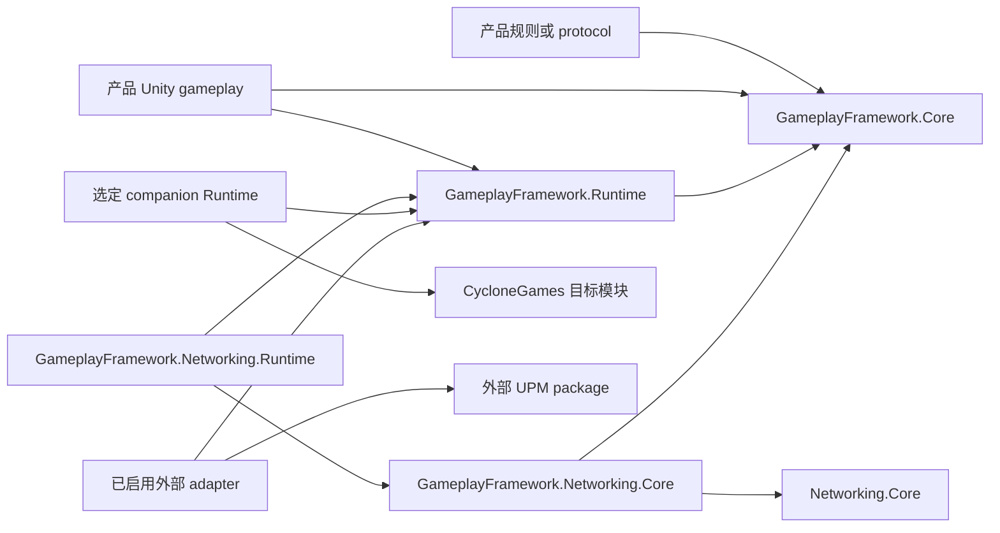

# GameplayFramework 包组合

[English](UPMComposition.md)

## 用途

`com.cyclone-games.gameplay-framework` 在同一个 UPM package 中提供纯 C# gameplay rule assembly 和 Unity-facing Runtime assembly。产品可以继续使用熟悉的 `World`、`Actor`、`GameMode`、`Controller`、`Pawn`、`PlayerState` 与 `GameState` 接口，同时让可复用的准入、roster、match state、snapshot 和 capacity 规则不依赖 `UnityEngine`。

可选 CycloneGames 模块与外部 UPM package 通过窄 assembly 连接。Package 不要求 PlayerSettings Scripting Define Symbol。

## Package Assembly

| Assembly | Engine reference | Auto referenced | 职责 |
| --- | --- | --- | --- |
| `CycloneGames.GameplayFramework.Core` | 无 | No | 参与者准入与 roster、login request/status 值、match clock/state/snapshot、player snapshot、World limit、Actor admission snapshot 与 Actor tag validation。 |
| `CycloneGames.GameplayFramework.Runtime` | Unity | No | `GameInstance`、`World`、`Actor`、`GameMode`、Controller、Pawn、Unity 生命周期、authoring asset、camera orchestration，以及对 Core 规则的 Runtime adapter。 |
| `CycloneGames.GameplayFramework.Editor` | Unity Editor | Yes | Inspector、validation、diagnostic 与 authoring tool。 |

`CycloneGames.GameplayFramework.Core` 设置 `noEngineReferences: true`。其 public contract 不暴露 `UnityEngine.Object`、`GameObject`、`MonoBehaviour`、`ScriptableObject`、Unity vector 或 Unity time。`CycloneGames.GameplayFramework.Runtime` 单向依赖 Core，并继续作为主要的 Unity gameplay 接口。

Package 为每个 gameplay object 保留唯一身份。`Actor` 就是注册到 `World` 的 Unity component；Core 不创建需要逐帧同步的第二个 Actor object。

## Consumer Assembly Reference

两个 Runtime assembly 都使用 `autoReferenced: false`。产品源码直接使用哪个 assembly 的类型，就应显式引用哪个 assembly。

只使用 `Actor`、`World` 或其他 Unity-facing 类型的 Unity gameplay assembly 引用 Runtime：

```json
{
  "references": [
    "CycloneGames.GameplayFramework.Runtime"
  ]
}
```

如果 assembly 还会直接构造或查询 `ParticipantRoster`、`PlayerLoginRequest`、`MatchTimestamp`、`MatchStateMachine`、`MatchStateSnapshot`、`PlayerStateSnapshot` 或其他 Core 类型，则显式引用两个 assembly：

```json
{
  "references": [
    "CycloneGames.GameplayFramework.Core",
    "CycloneGames.GameplayFramework.Runtime"
  ]
}
```

纯规则、command-line 或 server-domain Unity asmdef 可以只引用 Core：

```json
{
  "references": [
    "CycloneGames.GameplayFramework.Core"
  ],
  "noEngineReferences": true
}
```

不要编辑 Unity 生成的 project 或 solution file。Reference 应添加到实际持有源码的 consumer asmdef。

`noEngineReferences` 表示该 assembly 在 Unity assembly graph 内不依赖 Unity engine API。要把同一份源码发布为独立 .NET artifact，还需要单独的 .NET project/package build 与 target-framework 验证。

## Runtime 组合与 DI

`GameplayWorldComposition` 是与 container 无关的 Unity composition value。手动 bootstrap 与 DI container 构造同一个值，并在启动前调用 `GameplayWorldHost.Configure`。

```csharp
var sharedCameraOutputLeaseArbiter = new CameraOutputLeaseArbiter();
var composition = new GameplayWorldComposition(
    new UnityActorLifetime(),
    referenceResolver: resolver,
    sceneTransitionHandler: transitions,
    gameSession: session,
    runtimeLimits: limits,
    actorSource: new SceneWorldActorSource(gameplayWorldHost.gameObject.scene),
    matchClock: UnityMatchClock.Unscaled,
    cameraOutputLeaseArbiter: sharedCameraOutputLeaseArbiter);

gameplayWorldHost.Configure(composition);
```

`GameSession` 是面向 Unity 参与者对象的 Runtime facade，内部组合 Core `ParticipantRoster`。`GameState` 组合 Core `MatchStateMachine`，并读取 composition 显式提供的 `IMatchClock`。World 会在 GameState registration 期间、registry commit 与 BeginPlay publication 之前配置该 clock。Timestamp 携带 `Guid` epoch 与 `double` 秒数；readonly `MatchStateSnapshot` 不包含 persistence 或 wire schema。Container 可以提供 Runtime facade、clock、Actor source、camera-output lease arbiter、它们的依赖，或完整 composition value；这些 contract 都不依赖具体 container 类型。

未显式配置的 `GameplayWorldHost` 会为 Host GameObject 自身 Scene 提供 `SceneWorldActorSource`、使用 `UnityMatchClock.Scaled`，并创建一个 `CameraOutputLeaseArbiter`。显式 composition 会精确控制这些 seam。`ActorSource` 为 null 时（包括直接构造 `GameInstance`）会关闭启动发现，不会扫描全部已加载 Scene。

自定义 Actor source 通过事务范围内的 `IWorldActorCollector` 写入候选项；`TryAdd` 返回 false 时必须停止，且不得保留 collector。这样可将候选存储限制在 `WorldRuntimeLimits.MaximumActorCount` 内，并在注册前拒绝 shutdown re-entry。`SceneWorldActorSource` 还接受不可变的 `maximumVisitedGameObjectCount` 遍历预算，并以增量方式遍历层级，不会物化 scene-wide Actor list。

`ICameraOutputLeaseArbiter` 是 camera-resource ownership 的 composition seam。`CameraOutputLeaseArbiter` 记录构造线程，不保存 static global state，并对共享该实例的所有 World 执行仲裁。一个 GameInstance 对其创建的全部 World 使用同一个 arbiter。Parallel World 使用不同 GameInstance；如果它们可能引用同一个 persistent Camera、CinemachineBrain、Virtual Camera 或自定义 backend resource，应向所有实例注入同一个 shared arbiter。彼此独立的 default arbiter 是独立 ownership domain。

需要 VContainer 专用 entry point 的项目应把它放在项目 integration asmdef 中，并使用 `jp.hadashikick.vcontainer` package capability 门控。VContainer 缺失时，GameplayFramework 仍可使用。

## Companion Package

每个 companion 都是独立 package root，直接依赖 GameplayFramework 和它所连接的模块。Assembly 使用 `autoReferenced: false`；consumer 只引用实际调用的 bridge 类型。

| Package | Assembly | 层与能力 |
| --- | --- | --- |
| `com.cyclone-games.gameplay-framework-asset-management` | `CycloneGames.GameplayFramework.Runtime.Integrations.AssetManagement` | Unity Runtime adapter，通过应用持有的 `IAssetPackage` 解析 `WorldSettings` reference。 |
| `com.cyclone-games.gameplay-framework-factory` | `CycloneGames.GameplayFramework.Runtime.Integrations.Factory` | Unity Runtime adapter，将 `IUnityObjectLifetime` 连接到 Actor 的终态创建与释放。 |
| `com.cyclone-games.gameplay-framework-gameplay-abilities` | `CycloneGames.GameplayFramework.Runtime.Integrations.GameplayAbilities` | Actor owner/avatar 信息与 GameplayAbilities 的 Unity Runtime bridge。 |
| `com.cyclone-games.gameplay-framework-gameplay-tags` | `CycloneGames.GameplayFramework.Runtime.Integrations.GameplayTags` | Actor 与 GameplayTags 之间的 Unity Runtime helper。 |
| `com.cyclone-games.gameplay-framework-networking` | `CycloneGames.GameplayFramework.Networking.Core` | 纯 protocol message、bound、codec、security-policy composition 与 validation；依赖 GameplayFramework Core 和 Networking Core。 |
| `com.cyclone-games.gameplay-framework-networking` | `CycloneGames.GameplayFramework.Networking.Runtime` | Actor capture/apply、共享 replication capture 与 Runtime GameSession binding 的 Unity adapter。 |

Networking Core assembly 设置 `noEngineReferences: true`，且不引用 GameplayFramework Runtime。共享的 `CycloneGames.Networking.Core` 仍是 replication object、observer、policy、budget 与 `NetworkReplicationPlanner` 的唯一 owner。Networking Runtime assembly 依赖两侧 Core，并包含所有读写 Unity gameplay object 的操作。产品 protocol assembly 引用 `CycloneGames.GameplayFramework.Networking.Core`；Unity replication assembly 还要引用 `CycloneGames.GameplayFramework.Networking.Runtime`，以及源码直接使用的 GameplayFramework assembly。

### UPM 安装

只安装产品需要的 companion package。Unity Package Manager 会解析 companion 声明的 GameplayFramework 与目标模块依赖。未安装的 companion 不会成为 GameplayFramework package 的依赖。

### 嵌入 Assets

Package root 位于 `Assets` 下时，Unity 不会解析相邻 `package.json` 的依赖。项目必须同时放入 companion、GameplayFramework 和对应的 CycloneGames 目标模块。Companion 的直接 asmdef reference 会使其参与编译；目标模块不存在时，应移除该 companion package root。

Companion 不使用 `versionDefines` 发现 `Assets` 下的相邻 package manifest；Unity 只会从 Package Manager 已解析的 package 派生 package-version capability。

## 外部 Package 门控

外部 adapter 位于 GameplayFramework package 内，但只有 Package Manager 解析到受支持版本时才参与编译。

| 外部 package | Assembly | Capability | 支持的 expression |
| --- | --- | --- | --- |
| `com.unity.cinemachine` | `CycloneGames.GameplayFramework.Runtime.Integrations.Cinemachine` | `CYCLONEGAMES_HAS_CINEMACHINE` | `[3.0.0,4.0.0)` |
| `com.unity.cinemachine` | `CycloneGames.GameplayFramework.Editor.Integrations.Cinemachine` | `CYCLONEGAMES_HAS_CINEMACHINE` | `[3.0.0,4.0.0)` |
| `com.mackysoft.navigathena` | `CycloneGames.GameplayFramework.Runtime.Integrations.Navigathena` | `CYCLONEGAMES_HAS_NAVIGATHENA` | `[1.1.0,2.0.0)` |

对应 EditMode test assembly 使用相同 capability 与 version expression。Package 缺失或版本不在范围内时，Unity 会排除该 adapter 及其测试；GameplayFramework Core、Runtime、Editor、sample 与无关 companion 继续编译。

`CinemachineCameraOutput` 实现 Runtime `ICameraOutput` contract，并将 Brain 与 Virtual Camera prepare 为一个 atomic、有界 ownership-resource domain。其内置 discovery 仅限 output GameObject 所在 Scene。内置 `UnityCameraOutput` 只 prepare target Camera。每个 output 最多 prepare `CameraOutputLimits.MaximumPreparedResourceCount`（4）个 resource。`NavigathenaSceneTransitionHandler` 实现 Runtime `ISceneTransitionHandler` contract。外部 package 类型不会进入 GameplayFramework Core 或 Runtime public interface。

Package-derived gate 只对 UPM 已解析的 package 生效。把 Cinemachine 或 Navigathena 源码复制到 `Assets` 下不会满足这些 `versionDefines`；这种布局需要项目自有、带显式 reference 的 adapter assembly。

## 依赖方向



Unity-facing assembly 可以依赖纯 assembly。纯 assembly 不引用 Unity-facing assembly。Integration 依赖 bridge 两侧；GameplayFramework Core 与 Runtime 不引用 companion 或外部 adapter。

## 性能与线程

Assembly 分层不会增加逐帧 adapter object。只有规则本身具有独立状态时，Runtime 才持有 Core rule object，例如每个 `GameSession` 一个 roster、每个 `GameState` 一个 match state machine。

- Core snapshot 与 status value 是有界值数据，不持有 Unity object。
- `ParticipantRoster` 与 Runtime `GameSession` 由构造线程持有，且不添加 lock。`MatchStateMachine` 由构造线程或成功恢复 snapshot 的线程持有。其他线程执行 mutable read 或 mutation 时会被拒绝。
- Immutable limit 与 static validation/transition-policy function 不读取 live mutable state。Worker result 必须先 marshal 到 owner，之后才能访问 live roster、match state machine 或 session。
- Runtime World 与 Unity object 遵守已记录的 owner-thread 和 Unity main-thread 要求。
- Shared `CameraOutputLeaseArbiter` 在一个 composition owner thread 创建和修改；所有参与 World 都在该线程执行 lease operation。
- Network 与 worker-thread 输入应先在纯代码中验证，再 marshal 到 World owner 执行 Runtime 修改。
- 产品应在每个发布 backend 上分析实际 Actor、roster、protocol 与 replication workload。Assembly 结构本身不能证明 zero-GC 或平台性能。

## 验证矩阵

所有 profile 都运行 package test assembly：

```text
CycloneGames.GameplayFramework.Core.Tests.Editor
CycloneGames.GameplayFramework.Tests.Editor
CycloneGames.GameplayFramework.Tests.PlayMode
```

运行每个已安装 companion 的 test assembly：

```text
CycloneGames.GameplayFramework.Integrations.AssetManagement.Tests.Editor
CycloneGames.GameplayFramework.Integrations.Factory.Tests.Editor
CycloneGames.GameplayFramework.Integrations.GameplayAbilities.Tests.Editor
CycloneGames.GameplayFramework.Integrations.GameplayTags.Tests.Editor
CycloneGames.GameplayFramework.Networking.Core.Tests.Editor
CycloneGames.GameplayFramework.Networking.Runtime.Tests.Editor
```

对应 UPM package 存在时还要运行：

```text
CycloneGames.GameplayFramework.Integrations.Cinemachine.Tests.Editor
CycloneGames.GameplayFramework.Integrations.Navigathena.Tests.Editor
```

发布验证覆盖 dependency-present 与 dependency-absent UPM profile、选定 companion 的嵌入式 `Assets` profile、clean domain reload 与目标 Player backend。需要确认：

1. Core 在关闭 engine reference 的条件下编译。
2. Runtime 使用对 Core 的直接 reference 编译。
3. Networking Core 在不引用 GameplayFramework Runtime 或 UnityEngine 的条件下编译。
4. Networking Runtime 持有所有 Unity Actor、World 与 GameSession adapter。
5. UPM 依赖缺失时，gated assembly 被排除。
6. 产品的准确 assembly graph 能完成 clean Player build。
7. 共享 persistent camera resource 的 parallel World 获得同一个 composition-owned arbiter，并拒绝重叠 lease。

## 持久化

Package 组合不会写文件、偏好、registry entry 或 PlayerSettings symbol。`WorldSettings` 仍是显式项目 asset。Core roster、match、admission、snapshot 与 diagnostic state 只存在于内存。Camera lease ownership 同样仅存在于内存，并随各 World shutdown 释放；shared arbiter 由 composition 持有，直到所有参与 World 停止。`MatchStateSnapshot` 包含 state、elapsed seconds、captured timestamp 与 clock epoch，但不包含 storage schema；storage 与 protocol adapter 持有 envelope 和 compatibility。Storage、catalog、save 与 protocol state 由各自模块持有，并在对应 package 文档中说明。

## 故障排查

| 现象 | 处理 |
| --- | --- |
| 产品源码无法解析 Core 类型 | 将 `CycloneGames.GameplayFramework.Core` 添加到 consumer asmdef；该 assembly 不会自动引用。 |
| 无法解析 Actor、World 或 GameMode 类型 | 将 `CycloneGames.GameplayFramework.Runtime` 添加到 Unity gameplay asmdef。 |
| 纯 assembly 报告 UnityEngine 依赖 | 移除 Runtime 或 Unity adapter reference，只依赖 GameplayFramework Core 或 Networking Core。 |
| Networking 代码无法解析 Actor capture/apply 操作 | 从 Unity replication assembly 引用 `CycloneGames.GameplayFramework.Networking.Runtime`。仅使用 protocol 的 assembly 引用 Networking Core。 |
| Companion assembly 在 `Assets` 下无法解析目标模块 | 添加目标模块 package root，或移除该 companion package root。相邻 manifest 不会执行依赖解析。 |
| Gated external assembly 不存在 | 确认 Package Manager 已解析受支持版本，并让 consumer asmdef 显式引用 integration assembly。 |
| 不同 checkout 的 capability 不一致 | 比较 `Packages/manifest.json`、`Packages/packages-lock.json`、package root 与 asmdef reference；不要添加 PlayerSettings symbol。 |
| DI 配置晚于 Host 启动 | 在 Unity `Start` 前配置 Host，或关闭 **Auto Start**，待 composition 完成后调用 `StartWorldAsync`。 |
| Parallel World 同时激活一个 persistent camera resource | 在共同 owner thread 创建一个 `CameraOutputLeaseArbiter`，并注入每个参与的 composition。 |
