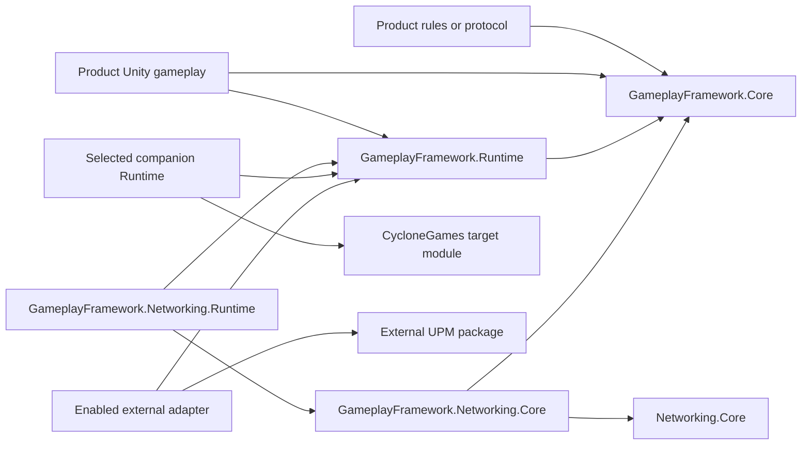

# GameplayFramework Package Composition

[Simplified Chinese](UPMComposition.SCH.md)

## Purpose

`com.cyclone-games.gameplay-framework` ships a pure C# gameplay-rule assembly and a Unity-facing runtime assembly in one UPM package. Products can use the familiar `World`, `Actor`, `GameMode`, `Controller`, `Pawn`, `PlayerState`, and `GameState` interfaces without coupling reusable admission, roster, match-state, snapshot, or capacity rules to `UnityEngine`.

Optional CycloneGames modules and external UPM packages are connected through narrow assemblies. The package does not require PlayerSettings scripting define symbols.

## Package Assemblies

| Assembly | Engine references | Auto referenced | Responsibility |
| --- | --- | --- | --- |
| `CycloneGames.GameplayFramework.Core` | No | No | Participant admission and roster, login request/status values, match-state machine, player snapshots, World limits, Actor admission snapshots, and Actor-tag validation. |
| `CycloneGames.GameplayFramework.Runtime` | Unity | No | `GameInstance`, `World`, `Actor`, `GameMode`, Controllers, Pawns, Unity lifecycle, authoring assets, camera orchestration, and runtime adapters over Core rules. |
| `CycloneGames.GameplayFramework.Editor` | Unity Editor | Yes | Inspectors, validation, diagnostics, and authoring tools. |

`CycloneGames.GameplayFramework.Core` sets `noEngineReferences: true`. Its public contracts do not expose `UnityEngine.Object`, `GameObject`, `MonoBehaviour`, `ScriptableObject`, Unity vectors, or Unity time. `CycloneGames.GameplayFramework.Runtime` depends on Core in one direction and remains the primary Unity gameplay interface.

The package keeps one identity for each gameplay object. An `Actor` is the Unity component registered with a `World`; Core does not create a second Actor object that requires per-frame synchronization.

## Consumer Assembly References

Both Runtime assemblies use `autoReferenced: false`. Reference every assembly whose types appear directly in product source.

A Unity gameplay assembly that uses only `Actor`, `World`, or other Unity-facing types references Runtime:

```json
{
  "references": [
    "CycloneGames.GameplayFramework.Runtime"
  ]
}
```

An assembly that also constructs or queries `ParticipantRoster`, `PlayerLoginRequest`, `MatchStateMachine`, `PlayerStateSnapshot`, or other Core types references both assemblies explicitly:

```json
{
  "references": [
    "CycloneGames.GameplayFramework.Core",
    "CycloneGames.GameplayFramework.Runtime"
  ]
}
```

A pure rules, command-line, or server-domain Unity asmdef can reference Core alone:

```json
{
  "references": [
    "CycloneGames.GameplayFramework.Core"
  ],
  "noEngineReferences": true
}
```

Do not edit Unity-generated project or solution files. Add references to the consumer asmdef that owns the source code.

`noEngineReferences` makes the assembly independent of Unity engine APIs inside Unity's assembly graph. Shipping the same source as a standalone .NET artifact requires a separate .NET project/package build and its own target-framework validation.

## Runtime Composition and DI

`GameplayWorldComposition` is the container-neutral Unity composition value. Manual bootstrap code and DI containers construct the same value and call `GameplayWorldHost.Configure` before startup.

```csharp
var composition = new GameplayWorldComposition(
    new UnityActorLifetime(),
    referenceResolver: resolver,
    sceneTransitionHandler: transitions,
    gameSession: session,
    runtimeLimits: limits);

gameplayWorldHost.Configure(composition);
```

`GameSession` is the Runtime facade for Unity participant objects and composes the Core `ParticipantRoster`. `GameState` composes the Core `MatchStateMachine` and supplies Unity time when committing a match-state transition. Containers may provide the Runtime facade, its dependencies, or a complete composition value; none of these contracts depend on a container type.

A project that needs VContainer-specific entry points keeps them in a project integration asmdef gated by a `jp.hadashikick.vcontainer` package capability. GameplayFramework remains usable when VContainer is absent.

## Companion Packages

Each companion is an independent package root with direct dependencies on GameplayFramework and the module it connects. Its assemblies use `autoReferenced: false`; consumers reference only the bridge types they call.

| Package | Assembly | Layer and capability |
| --- | --- | --- |
| `com.cyclone-games.gameplay-framework-asset-management` | `CycloneGames.GameplayFramework.Runtime.Integrations.AssetManagement` | Unity Runtime adapter that resolves `WorldSettings` references through an application-owned `IAssetPackage`. |
| `com.cyclone-games.gameplay-framework-factory` | `CycloneGames.GameplayFramework.Runtime.Integrations.Factory` | Unity Runtime adapter from `IUnityObjectLifetime` to terminal Actor creation and release. |
| `com.cyclone-games.gameplay-framework-gameplay-abilities` | `CycloneGames.GameplayFramework.Runtime.Integrations.GameplayAbilities` | Unity Runtime bridge for Actor owner/avatar information and GameplayAbilities. |
| `com.cyclone-games.gameplay-framework-gameplay-tags` | `CycloneGames.GameplayFramework.Runtime.Integrations.GameplayTags` | Unity Runtime helpers between Actor and GameplayTags. |
| `com.cyclone-games.gameplay-framework-networking` | `CycloneGames.GameplayFramework.Networking.Core` | Pure protocol messages, bounds, codecs, observer rules, and validation; depends on GameplayFramework Core and Networking Core. |
| `com.cyclone-games.gameplay-framework-networking` | `CycloneGames.GameplayFramework.Networking.Runtime` | Unity adapter for Actor capture/apply, World replication, and Runtime GameSession binding. |

The Networking Core assembly sets `noEngineReferences: true` and does not reference GameplayFramework Runtime. The Networking Runtime assembly depends on both Core layers and contains every operation that reads or writes Unity gameplay objects. A product protocol assembly references `CycloneGames.GameplayFramework.Networking.Core`; a Unity replication assembly also references `CycloneGames.GameplayFramework.Networking.Runtime` and any directly used GameplayFramework assembly.

### UPM installation

Install only the companion packages required by the product. Unity Package Manager resolves each companion's declared GameplayFramework and target-module dependencies. The GameplayFramework package remains independent of companions that are not installed.

### Embedded installation under Assets

When package roots are embedded under `Assets`, Unity does not resolve sibling `package.json` dependencies. Place the companion, GameplayFramework, and its target CycloneGames module in the project together. Direct asmdef references compile that companion. Remove the companion package root when its target module is absent.

Companion packages do not use `versionDefines` to discover sibling package manifests under `Assets`; Unity derives package-version capabilities only from packages resolved by Package Manager.

## External Package Gates

External adapters remain inside the GameplayFramework package but compile only when Package Manager resolves a supported package version.

| External package | Assembly | Capability | Supported expression |
| --- | --- | --- | --- |
| `com.unity.cinemachine` | `CycloneGames.GameplayFramework.Runtime.Integrations.Cinemachine` | `CYCLONEGAMES_HAS_CINEMACHINE` | `[3.0.0,4.0.0)` |
| `com.unity.cinemachine` | `CycloneGames.GameplayFramework.Editor.Integrations.Cinemachine` | `CYCLONEGAMES_HAS_CINEMACHINE` | `[3.0.0,4.0.0)` |
| `com.mackysoft.navigathena` | `CycloneGames.GameplayFramework.Runtime.Integrations.Navigathena` | `CYCLONEGAMES_HAS_NAVIGATHENA` | `[1.1.0,2.0.0)` |

Matching EditMode test assemblies use the same capability and version expression. If a package is missing or outside the supported range, Unity excludes that adapter and its tests. GameplayFramework Core, Runtime, Editor, samples, and unrelated companions continue to compile.

`CinemachineCameraOutput` implements the Runtime `ICameraOutput` contract. `NavigathenaSceneTransitionHandler` implements the Runtime `ISceneTransitionHandler` contract. External package types do not enter GameplayFramework Core or Runtime public interfaces.

Package-derived gates are active only for UPM-resolved packages. Copying Cinemachine or Navigathena source under `Assets` does not satisfy these `versionDefines`; that layout requires a project-owned adapter assembly with explicit references.

## Dependency Direction



Unity-facing assemblies can depend on pure assemblies. Pure assemblies never reference Unity-facing assemblies. Integrations depend on both sides of their bridge; GameplayFramework Core and Runtime never reference companions or external adapters.

## Performance and Threading

Assembly separation does not add a per-frame adapter object. Runtime holds Core rule objects only where those rules have independent state, such as one roster per `GameSession` and one match-state machine per `GameState`.

- Core snapshots and status values are bounded value data and do not own Unity objects.
- `ParticipantRoster`, `MatchStateMachine`, and Runtime `GameSession` are single-owner objects and add no locks. Reads of mutable instance state and mutations reject access from any thread other than the constructing owner.
- Immutable limits and static validation/transition-policy functions do not read live mutable state. Worker results marshal to the owner before accessing a live roster, match state machine, or session.
- Runtime World and Unity objects keep the documented owner-thread and Unity main-thread requirements.
- Network and worker-thread input must be validated in pure code, then marshalled to the World owner before Runtime mutation.
- Product code should profile actual Actor, roster, protocol, and replication workloads on every release backend. Assembly structure alone is not evidence of zero-GC or platform performance.

## Validation Matrix

Run the package test assemblies in every profile:

```text
CycloneGames.GameplayFramework.Core.Tests.Editor
CycloneGames.GameplayFramework.Tests.Editor
CycloneGames.GameplayFramework.Tests.PlayMode
```

Run each installed companion test assembly:

```text
CycloneGames.GameplayFramework.Integrations.AssetManagement.Tests.Editor
CycloneGames.GameplayFramework.Integrations.Factory.Tests.Editor
CycloneGames.GameplayFramework.Integrations.GameplayAbilities.Tests.Editor
CycloneGames.GameplayFramework.Integrations.GameplayTags.Tests.Editor
CycloneGames.GameplayFramework.Networking.Core.Tests.Editor
CycloneGames.GameplayFramework.Networking.Runtime.Tests.Editor
```

When the matching UPM package is installed, also run:

```text
CycloneGames.GameplayFramework.Integrations.Cinemachine.Tests.Editor
CycloneGames.GameplayFramework.Integrations.Navigathena.Tests.Editor
```

Release validation covers dependency-present and dependency-absent UPM profiles, an embedded `Assets` profile for selected companions, a clean domain reload, and the target Player backend. Verify that:

1. Core compiles with engine references disabled.
2. Runtime compiles with a direct reference to Core.
3. Networking Core compiles without GameplayFramework Runtime or UnityEngine.
4. Networking Runtime owns every Unity Actor, World, and GameSession adapter.
5. Gated assemblies are excluded when their UPM dependency is absent.
6. The product's exact assembly graph succeeds in a clean Player build.

## Persistence

Package composition writes no files, preferences, registry entries, or PlayerSettings symbols. `WorldSettings` remains an explicit project asset. Core roster, match, admission, and diagnostic state is memory-only. Storage, catalogs, saves, and protocol state belong to their owning modules and are documented by those packages.

## Troubleshooting

| Symptom | Resolution |
| --- | --- |
| A Core type cannot be resolved from product source | Add `CycloneGames.GameplayFramework.Core` to the consumer asmdef; references are explicit because the assembly is not auto-referenced. |
| An Actor, World, or GameMode type cannot be resolved | Add `CycloneGames.GameplayFramework.Runtime` to the Unity gameplay asmdef. |
| A pure assembly reports a UnityEngine dependency | Remove Runtime or Unity adapter references and depend only on GameplayFramework Core or Networking Core. |
| Networking code cannot resolve Actor capture/apply operations | Reference `CycloneGames.GameplayFramework.Networking.Runtime` from the Unity replication assembly. Protocol-only assemblies reference Networking Core instead. |
| A companion assembly cannot resolve its target module under `Assets` | Add the target module package root or remove the companion package root. Sibling manifests do not perform dependency resolution. |
| A gated external assembly is absent | Confirm Package Manager resolved the package inside the supported version expression and that the consumer asmdef explicitly references the integration assembly. |
| A capability differs between checkouts | Compare `Packages/manifest.json`, `Packages/packages-lock.json`, package roots, and asmdef references. Do not add a PlayerSettings symbol. |
| DI configuration runs after Host startup | Configure the Host before Unity `Start`, or disable **Auto Start** and call `StartWorldAsync` after composition is ready. |
