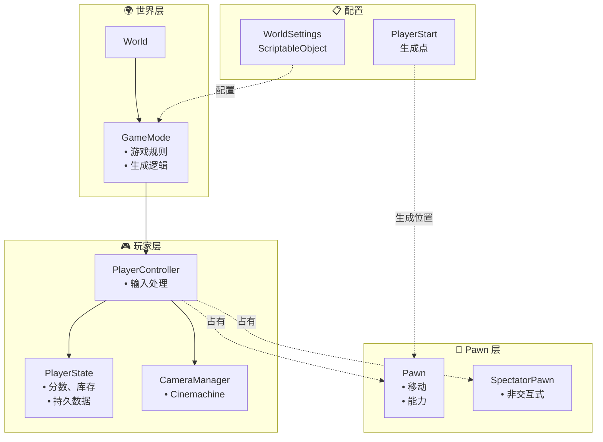
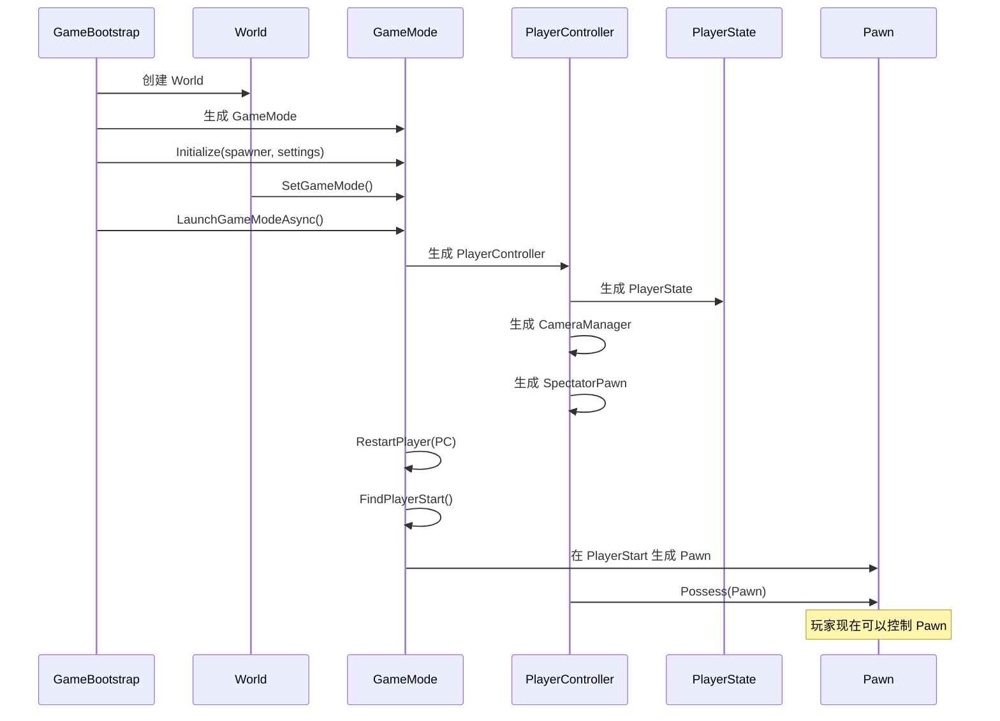
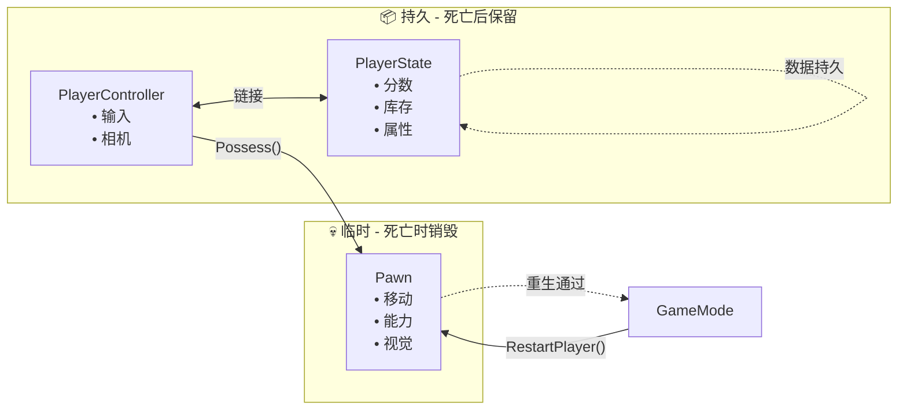

> **注意：** 本文档由 AI 辅助编写，如果你追求绝对精准，请直接阅读模块源码, **源码**以及**示例**皆由作者编写。

[**English**](README.md) | [**简体中文**]

# CycloneGames.GameplayFramework

一个面向 Unity 的轻量级 UnrealEngine 风格玩法框架。它模仿虚幻引擎的 Gameplay Framework 概念（Actor、Pawn、Controller、GameMode 等），使您能够轻松构建可扩展、可维护的游戏系统，并支持依赖注入。

本框架非常适合想要在 Unity 中使用虚幻引擎成熟架构模式的开发者，或从虚幻引擎过渡到 Unity 的团队。它提供了清晰的关注点分离，并遵循行业标准的设计模式。

- **Unity**: 2022.3+
- **依赖项**：
  - `com.unity.cinemachine@3` - 用于摄像机管理
  - `com.cysharp.unitask@2` - 用于异步操作
  - `com.cyclone-games.factory@1` - 用于对象生成
  - `com.cyclone-games.logger@1` - 用于调试日志

## 目录

1. [框架设计哲学](#框架设计哲学)
2. [核心概念](#核心概念)
3. [快速上手指南](#综合快速上手指南)
4. [架构概览](#架构概览)
5. [高级用法](#高级用法)
6. [本地多人游戏指南](#本地多人游戏指南)
7. [最佳实践](#最佳实践)

## 框架设计哲学

CycloneGames.GameplayFramework 将虚幻引擎经过验证的 Gameplay Framework 架构引入 Unity。这种设计模式已在无数 AAA 游戏中得到验证，为构建复杂的游戏系统提供了坚实的基础。

### 为什么使用这个框架？

**传统 Unity 方法：**

- 处理一切的单一 `PlayerController` 脚本
- 玩家逻辑、摄像机和游戏状态之间的紧密耦合
- 难以交换玩家角色或实现重生系统
- 随着复杂性增长，难以测试和维护

**GameplayFramework 方法：**

- **关注点分离**: 玩家逻辑（`Pawn`）、控制（`Controller`）、状态（`PlayerState`）和游戏规则（`GameMode`）是分离的
- **轻松交换角色**: 更改 `Pawn` 预制体而无需修改控制器代码
- **持久状态**: `PlayerState` 在 Pawn 重生后仍然存在，非常适合分数、库存等
- **可测试**: 每个组件都有明确的职责，可以独立测试
- **可扩展**: 添加新功能而无需修改现有代码

### 主要优势

- ✅ **虚幻开发者熟悉**: 如果您了解虚幻的 Gameplay Framework，您会感到熟悉
- ✅ **支持 DI**: 与依赖注入容器无缝协作
- ✅ **清晰的架构**: 游戏逻辑和基础设施之间的清晰分离
- ✅ **灵活**: 易于扩展和自定义以满足您的特定需求
- ✅ **生产就绪**: 基于在 AAA 游戏中使用的经过验证的模式

## 核心概念

### Actor

所有游戏对象的基础类。游戏中具有游戏逻辑的每个对象都应该继承自 `Actor`。

**关键特性：**

- **所有权**: Actor 可以拥有所有者（其他 Actor）
- **生命周期**: 在设定时间后自动销毁
- **位置/旋转**: 用于位置和旋转的辅助方法
- **世界事件**: `FellOutOfWorld()` 用于处理超出边界的 Actor

**示例：**

```csharp
public class MyActor : Actor
{
    protected override void Awake()
    {
        base.Awake();
        // 您的初始化代码
    }

    public override void FellOutOfWorld()
    {
        // 当 Actor 掉出世界时的自定义行为
        base.FellOutOfWorld(); // 销毁 Actor
    }
}
```

### Pawn

`Pawn` 是一个可被 `Controller` "占有"的可控制 `Actor`。这是您的玩家角色、敌人或任何可被控制的实体。

**关键特性：**

- **占有**: 可以被 `Controller` 控制
- **PlayerState 链接**: 连接到 `PlayerState` 以获取持久数据
- **重启**: 可以重启（对重生有用）

**示例：**

```csharp
public class MyPlayerPawn : Pawn
{
    protected override void Awake()
    {
        base.Awake();
        // 初始化移动、能力等
    }

    public override void PossessedBy(Controller NewController)
    {
        base.PossessedBy(NewController);
        // 当控制器获得控制权时调用
        // 初始化输入、启用移动等
    }

    public override void UnPossessed()
    {
        base.UnPossessed();
        // 当控制器释放控制权时调用
        // 禁用输入、停止移动等
    }
}
```

### Controller

`Controller` 拥有并控制 `Pawn`。它是做出决策并向 Pawn 发送命令的"大脑"。

**类型：**

- **PlayerController**: 用于人类玩家
- **AIController**: 用于 AI 控制的实体

**关键特性：**

- **占有**: `Possess(Pawn)` 和 `UnPossess()` 方法
- **控制旋转**: 管理控制器"看向"的方向
- **PlayerState**: 每个控制器都有一个 `PlayerState` 用于持久数据

**示例：**

```csharp
public class MyPlayerController : PlayerController
{
    void Update()
    {
        // 处理输入
        if (Input.GetKeyDown(KeyCode.Space))
        {
            // 让 Pawn 跳跃
            if (GetPawn() is MyPlayerPawn pawn)
            {
                pawn.Jump();
            }
        }
    }
}
```

### PlayerState

`PlayerState` 保存玩家相关的数据，这些数据在 Pawn 重生后仍然存在。这非常适合：

- 分数
- 库存
- 属性
- 任何应该在死亡/重生后保留的数据

**关键特性：**

- **持久**: 在 Pawn 销毁后仍然存在
- **Pawn 引用**: 跟踪当前的 `Pawn`
- **事件**: 当 Pawn 改变时触发 `OnPawnSetEvent`

**示例：**

```csharp
public class MyPlayerState : PlayerState
{
    public int Score { get; private set; }
    public int Health { get; private set; }

    public void AddScore(int points)
    {
        Score += points;
        // 通知 UI 等
    }

    protected override void Awake()
    {
        base.Awake();
        Health = 100;
        Score = 0;
    }
}
```

### GameMode

`GameMode` 编排游戏规则。它处理：

- 生成 `PlayerController`
- 生成和重生 `Pawn`
- 查找 `PlayerStart` 位置
- 游戏特定规则

**关键方法：**

- `LaunchGameMode()`: 启动游戏，生成玩家
- `RestartPlayer(PlayerController)`: 重生玩家
- `FindPlayerStart(Controller, string)`: 查找生成点

**示例：**

```csharp
public class MyGameMode : GameMode
{
    public override void RestartPlayer(PlayerController NewPlayer, string Portal = "")
    {
        // 自定义重生逻辑
        base.RestartPlayer(NewPlayer, Portal);

        // 也许恢复生命值、重置能力等
        if (NewPlayer.GetPlayerState() is MyPlayerState ps)
        {
            ps.RestoreHealth();
        }
    }
}
```

### WorldSettings

一个 `ScriptableObject`，定义游戏所需的所有关键预制体和类。这是您的"游戏配置"资产。

**包含：**

- `GameModeClass` - 您的游戏模式预制体
- `PlayerControllerClass` - 您的玩家控制器预制体
- `PawnClass` - 您的默认玩家 Pawn 预制体
- `PlayerStateClass` - 您的玩家状态预制体
- `CameraManagerClass` - 您的摄像机管理器预制体
- `SpectatorPawnClass` - 您的旁观者 Pawn 预制体

### World

一个轻量级容器，保存对 `GameMode` 的引用并提供查找方法。这**不是**虚幻的 UWorld——它要简单得多。

**用法：**

```csharp
World world = new World();
world.SetGameMode(gameMode);
PlayerController pc = world.GetPlayerController();
Pawn pawn = world.GetPlayerPawn();
```

### CameraManager

管理 Cinemachine 摄像机并跟随当前视角目标（通常是 `PlayerController`）。

**要求：**

- 主摄像机必须有 `CinemachineBrain` 组件
- 场景中至少有一个 `CinemachineCamera`

**特性：**

- 自动查找摄像机
- 跟随视角目标
- FOV 控制

### PlayerStart

玩家的生成点。在您希望玩家生成的位置放置这些。

**特性：**

- 基于名称的匹配（用于传送门/检查点）
- 旋转支持（玩家面向正确方向生成）
- 默认使用找到的第一个

### SpectatorPawn

一个非交互式 `Pawn`，当玩家还没有真正的 Pawn 时使用（例如，在加载期间或旁观时）。

## 综合快速上手指南

本指南将引导您从零开始设置一个完整的 GameplayFramework 项目。

### 前置条件

在开始之前，请确保您已具备：

- Unity 2022.3 或更高版本
- 已安装 `CycloneGames.GameplayFramework` 包
- 已安装所有依赖项（`Cinemachine`, `UniTask`, `Factory`, `Logger`）

### 步骤 1: 创建您的预制体

在创建 `WorldSettings` 之前，您需要创建它将引用的预制体。

**1.1 创建 GameMode 预制体**

1. 在场景中创建一个空 GameObject
2. 添加 `GameMode` 组件（或您的自定义子类）
3. 命名为 `GameMode_MyGame`
4. 将其拖到您的 `Prefabs` 文件夹以创建预制体

**1.2 创建 PlayerController 预制体**

1. 创建一个空 GameObject
2. 添加 `PlayerController` 组件（或您的自定义子类）
3. 命名为 `PlayerController_MyGame`
4. 将其拖到您的 `Prefabs` 文件夹

**1.3 创建 Pawn 预制体**

1. 创建一个带有玩家角色的 GameObject（例如，带有 CharacterController 的胶囊体）
2. 添加 `Pawn` 组件（或您的自定义子类）
3. 添加任何移动、输入或能力组件
4. 命名为 `Pawn_MyPlayer`
5. 将其拖到您的 `Prefabs` 文件夹

**1.4 创建 PlayerState 预制体**

1. 创建一个空 GameObject
2. 添加 `PlayerState` 组件（或您的自定义子类）
3. 命名为 `PlayerState_MyGame`
4. 将其拖到您的 `Prefabs` 文件夹

**1.5 创建 CameraManager 预制体**

1. 创建一个空 GameObject
2. 添加 `CameraManager` 组件（或您的自定义子类）
3. 命名为 `CameraManager_MyGame`
4. 将其拖到您的 `Prefabs` 文件夹

**1.6 创建 SpectatorPawn 预制体**

1. 创建一个简单的 GameObject（例如，一个胶囊体）
2. 添加 `SpectatorPawn` 组件
3. 命名为 `SpectatorPawn_MyGame`
4. 将其拖到您的 `Prefabs` 文件夹

### 步骤 2: 创建 WorldSettings

`WorldSettings` 是一个 `ScriptableObject`，它将所有预制体联系在一起。

**2.1 创建资产**

1. 在项目窗口中，在所需文件夹中右键单击
2. 选择 **Create > CycloneGames > GameplayFramework > WorldSettings**
3. 命名为 `MyWorldSettings`

**2.2 配置 WorldSettings**

1. 选择 `MyWorldSettings` 资产
2. 在 Inspector 中，将您的预制体拖到相应字段：
   - **Game Mode Class**: 拖入 `GameMode_MyGame`
   - **Player Controller Class**: 拖入 `PlayerController_MyGame`
   - **Pawn Class**: 拖入 `Pawn_MyPlayer`
   - **Player State Class**: 拖入 `PlayerState_MyGame`
   - **Camera Manager Class**: 拖入 `CameraManager_MyGame`
   - **Spectator Pawn Class**: 拖入 `SpectatorPawn_MyGame`

**2.3 放置在 Resources 中（可选）**

如果您想按名称在运行时加载 `WorldSettings`：

1. 在 `Assets` 目录中创建一个 `Resources` 文件夹（如果不存在）
2. 将 `MyWorldSettings` 移动到 `Resources` 文件夹
3. 现在可以使用 `Resources.Load<WorldSettings>("MyWorldSettings")` 加载它

### 步骤 3: 实现对象生成器

框架使用 `IUnityObjectSpawner`（来自 `com.cyclone-games.factory`）来生成对象。这允许您与依赖注入或对象池集成。

**3.1 创建简单生成器**

创建一个新脚本 `SimpleObjectSpawner.cs`：

```csharp
// SimpleObjectSpawner.cs
using CycloneGames.Factory.Runtime;
using UnityEngine;

/// <summary>
/// 一个使用 Unity 的 Instantiate 的简单对象生成器。
/// 对于生产环境，考虑与您的 DI 容器或对象池系统集成。
/// </summary>
public class SimpleObjectSpawner : IUnityObjectSpawner
{
    public T Create<T>(T origin) where T : Object
    {
        if (origin == null)
        {
            Debug.LogError("[SimpleObjectSpawner] 尝试生成空对象");
            return null;
        }

        return Object.Instantiate(origin);
    }
}
```

**3.2 高级：DI 集成示例**

如果您使用 DI 容器（如 VContainer、Zenject 等），可以这样集成：

```csharp
// DIObjectSpawner.cs
using CycloneGames.Factory.Runtime;
using UnityEngine;

public class DIObjectSpawner : IUnityObjectSpawner
{
    private IContainer container; // 您的 DI 容器

    public DIObjectSpawner(IContainer container)
    {
        this.container = container;
    }

    public T Create<T>(T origin) where T : Object
    {
        if (origin == null) return null;

        // 使用您的 DI 容器来解析依赖
        var instance = container.Instantiate(origin);
        return instance;
    }
}
```

### 步骤 4: 创建游戏引导脚本

引导脚本初始化框架并启动游戏。

**4.1 创建引导脚本**

创建一个新脚本 `GameBootstrap.cs`：

```csharp
// GameBootstrap.cs
using UnityEngine;
using CycloneGames.GameplayFramework;
using CycloneGames.Factory.Runtime;
using Cysharp.Threading.Tasks;

/// <summary>
/// 初始化 GameplayFramework 的引导脚本。
/// 将此脚本附加到初始场景中的 GameObject。
/// </summary>
public class GameBootstrap : MonoBehaviour
{
    [Header("配置")]
    [Tooltip("要使用的 WorldSettings 资产。如果为 null，将尝试从 Resources 加载。")]
    [SerializeField] private WorldSettings worldSettings;

    [Tooltip("要从 Resources 加载的 WorldSettings 名称（如果 worldSettings 为 null）。")]
    [SerializeField] private string worldSettingsName = "MyWorldSettings";

    private IUnityObjectSpawner objectSpawner;
    private World world;

    async void Start()
    {
        // 初始化 World
        world = new World();

        // 创建对象生成器
        // 在生产环境中，您可能从 DI 容器获取此对象
        objectSpawner = new SimpleObjectSpawner();

        // 加载 WorldSettings
        WorldSettings ws = worldSettings;
        if (ws == null)
        {
            ws = Resources.Load<WorldSettings>(worldSettingsName);
            if (ws == null)
            {
                Debug.LogError($"[GameBootstrap] 加载 WorldSettings 失败: {worldSettingsName}");
                return;
            }
        }

        // 生成并初始化 GameMode
        var gameMode = objectSpawner.Create(ws.GameModeClass) as GameMode;
        if (gameMode == null)
        {
            Debug.LogError("[GameBootstrap] 生成 GameMode 失败。请检查 WorldSettings 配置。");
            return;
        }

        gameMode.Initialize(objectSpawner, ws);

        // 在 World 中设置 GameMode
        world.SetGameMode(gameMode);

        // 启动游戏
        await gameMode.LaunchGameModeAsync(this.GetCancellationTokenOnDestroy());

        Debug.Log("[GameBootstrap] 游戏启动成功！");
    }
}
```

**4.2 在场景中设置引导**

1. 在场景中创建一个空 GameObject
2. 命名为 `GameBootstrap`
3. 添加 `GameBootstrap` 组件
4. 可选：在 Inspector 中分配 `MyWorldSettings`，或留空以从 Resources 加载

### 步骤 5: 设置您的场景

**5.1 添加 PlayerStart**

1. 在场景中创建一个空 GameObject
2. 添加 `PlayerStart` 组件
3. 将其放置在您希望玩家生成的位置
4. 旋转它以设置生成方向
5. （可选）如果您想使用基于传送门的生成，给它一个特定名称

**5.2 设置摄像机**

1. 确保您的主摄像机有 `CinemachineBrain` 组件
2. 在场景中创建至少一个 `CinemachineCamera`
3. 配置 `CinemachineCamera` 以跟随您的玩家（`CameraManager` 会自动设置此功能）

**5.3 （可选）添加 KillZVolume**

要自动销毁掉出边界的 Actor：

1. 创建一个空 GameObject
2. 添加 `BoxCollider` 组件
3. 勾选 **Is Trigger**
4. 添加 `KillZVolume` 组件
5. 定位并缩放碰撞体以覆盖"死亡区域"
6. 确保下落的 Actor 同时具有 `Collider` 和 `Rigidbody` 组件

### 步骤 6: 测试您的设置

**6.1 运行场景**

1. 按 Play
2. 框架应该：
   - 生成 `PlayerController`
   - 生成 `PlayerState`
   - 生成 `CameraManager`
   - 生成 `SpectatorPawn`
   - 查找 `PlayerStart`
   - 在 `PlayerStart` 处生成您的 `Pawn`
   - 用 `PlayerController` 占有 `Pawn`

**6.2 在 Hierarchy 中验证**

检查这些对象是否已生成：

- `PlayerController_MyGame(Clone)`
- `PlayerState_MyGame(Clone)`
- `CameraManager_MyGame(Clone)`
- `SpectatorPawn_MyGame(Clone)`
- `Pawn_MyPlayer(Clone)`

**6.3 调试技巧**

如果出现问题：

1. **检查控制台**: 查找错误消息
2. **验证预制体**: 确保所有预制体都有必需的组件
3. **检查 WorldSettings**: 所有字段都应该已分配
4. **验证 PlayerStart**: 场景中必须至少有一个 `PlayerStart`
5. **检查摄像机**: 主摄像机需要 `CinemachineBrain`，并且必须至少存在一个 `CinemachineCamera`

## 架构概览

### 组件层次结构



### 生命周期流程



### 数据流



- **PlayerState**: 在 Pawn 重生后仍然存在
  - 分数、库存、属性
  - 链接到 `PlayerController`，而不是 `Pawn`
- **Pawn**: 临时的，可以被销毁和重生
  - 移动、能力、视觉表现
  - 在死亡时销毁，由 `GameMode` 重生
- **Controller**: "大脑"
  - 输入处理（对于 `PlayerController`）
  - AI 逻辑（对于 `AIController`）
  - 占有 `Pawn` 以控制它

## 高级用法

### 自定义 GameMode

通过子类化 `GameMode` 创建自定义游戏规则：

```csharp
public class MyGameMode : GameMode
{
    public int MaxLives = 3;
    private Dictionary<PlayerController, int> playerLives = new();

    public override void RestartPlayer(PlayerController NewPlayer, string Portal = "")
    {
        // 在重生前检查生命值
        if (!playerLives.ContainsKey(NewPlayer))
        {
            playerLives[NewPlayer] = MaxLives;
        }

        if (playerLives[NewPlayer] > 0)
        {
            playerLives[NewPlayer]--;
            base.RestartPlayer(NewPlayer, Portal);
        }
        else
        {
            // 游戏结束逻辑
            OnPlayerGameOver(NewPlayer);
        }
    }

    private void OnPlayerGameOver(PlayerController player)
    {
        Debug.Log($"{player.name} 生命值用尽！");
        // 显示游戏结束 UI 等
    }
}
```

### 自定义 PlayerController

添加输入处理和玩家特定逻辑：

```csharp
public class MyPlayerController : PlayerController
{
    private MyPlayerPawn currentPawn;

    void Update()
    {
        // 处理输入
        HandleMovementInput();
        HandleAbilityInput();
    }

    void HandleMovementInput()
    {
        if (GetPawn() is MyPlayerPawn pawn)
        {
            Vector2 moveInput = new Vector2(
                Input.GetAxis("Horizontal"),
                Input.GetAxis("Vertical")
            );

            pawn.Move(moveInput);
        }
    }

    void HandleAbilityInput()
    {
        if (Input.GetKeyDown(KeyCode.Space))
        {
            if (GetPawn() is MyPlayerPawn pawn)
            {
                pawn.Jump();
            }
        }
    }

    public override void OnPossess(Pawn InPawn)
    {
        base.OnPossess(InPawn);
        currentPawn = InPawn as MyPlayerPawn;

        // 启用输入、显示 UI 等
        if (currentPawn != null)
        {
            currentPawn.EnableInput();
        }
    }

    public override void OnUnPossess()
    {
        if (currentPawn != null)
        {
            currentPawn.DisableInput();
        }

        base.OnUnPossess();
        currentPawn = null;
    }
}
```

### 自定义 Pawn

实现移动、能力和游戏逻辑：

```csharp
public class MyPlayerPawn : Pawn
{
    private CharacterController characterController;
    private float moveSpeed = 5f;
    private bool inputEnabled = true;

    protected override void Awake()
    {
        base.Awake();
        characterController = GetComponent<CharacterController>();
    }

    public void Move(Vector2 input)
    {
        if (!inputEnabled) return;

        Vector3 moveDirection = new Vector3(input.x, 0, input.y);
        moveDirection = transform.TransformDirection(moveDirection);
        moveDirection *= moveSpeed;

        // 应用重力
        moveDirection.y -= 9.81f * Time.deltaTime;

        characterController.Move(moveDirection * Time.deltaTime);
    }

    public void Jump()
    {
        if (!inputEnabled) return;
        // 跳跃逻辑
    }

    public void EnableInput()
    {
        inputEnabled = true;
    }

    public void DisableInput()
    {
        inputEnabled = false;
    }

    public override void PossessedBy(Controller NewController)
    {
        base.PossessedBy(NewController);
        EnableInput();
    }

    public override void UnPossessed()
    {
        DisableInput();
        base.UnPossessed();
    }
}
```

### 基于传送门的生成

使用命名的 `PlayerStart` 对象实现检查点/传送门系统：

```csharp
// 在您的 GameMode 或自定义脚本中
public void SpawnPlayerAtPortal(string portalName)
{
    PlayerController pc = GetPlayerController();
    if (pc != null)
    {
        RestartPlayer(pc, portalName); // portalName 匹配 PlayerStart 名称
    }
}
```

**设置：**

1. 在场景中创建多个 `PlayerStart` 对象
2. 命名它们（例如，"Checkpoint1"、"Checkpoint2"）
3. 调用 `RestartPlayer(playerController, "Checkpoint1")` 以在该特定起点生成

### 重生系统

使用 `GameMode.RestartPlayer()` 实现重生系统：

```csharp
public class RespawnSystem : MonoBehaviour
{
    private GameMode gameMode;
    private PlayerController playerController;

    void Start()
    {
        // 获取引用（您可能想使用服务定位器或 DI）
        gameMode = FindObjectOfType<GameMode>();
        playerController = FindObjectOfType<PlayerController>();
    }

    public void RespawnPlayer()
    {
        if (gameMode != null && playerController != null)
        {
            // 在最后一个检查点重生
            gameMode.RestartPlayer(playerController, lastCheckpointName);
        }
    }

    // 当玩家死亡时调用此方法
    public void OnPlayerDeath()
    {
        // 等待一会儿，然后重生
        StartCoroutine(RespawnAfterDelay(2f));
    }

    private System.Collections.IEnumerator RespawnAfterDelay(float delay)
    {
        yield return new WaitForSeconds(delay);
        RespawnPlayer();
    }
}
```

### 摄像机切换

在不同 Cinemachine 摄像机之间切换：

```csharp
public class CameraSwitcher : MonoBehaviour
{
    private CameraManager cameraManager;
    public CinemachineCamera firstPersonCamera;
    public CinemachineCamera thirdPersonCamera;

    void Start()
    {
        PlayerController pc = FindObjectOfType<PlayerController>();
        cameraManager = pc?.GetCameraManager();
    }

    void Update()
    {
        if (Input.GetKeyDown(KeyCode.C))
        {
            // 在摄像机之间切换
            if (cameraManager != null)
            {
                var current = cameraManager.ActiveVirtualCamera;
                var next = current == firstPersonCamera ? thirdPersonCamera : firstPersonCamera;
                cameraManager.SetActiveVirtualCamera(next);
            }
        }
    }
}
```

## 本地多人游戏指南

本指南将引导您使用 GameplayFramework 实现本地多人游戏（分屏或共享屏幕）。本地多人游戏意味着同一设备上的多个玩家，每个玩家都有自己的控制器和输入。

### 概述

对于本地多人游戏，您需要：

1. **扩展 GameMode** 以管理多个 `PlayerController`
2. **分配玩家索引** 以区分玩家
3. **生成多个 PlayerStart**（每个玩家一个）
4. **处理多个输入源**（Unity Input System 或传统输入）
5. **管理多个摄像机**（分屏或画中画）
6. **为每个玩家创建独立的 PlayerState**

### 步骤 1: 创建多人游戏 GameMode

首先，创建一个可以处理多个玩家的自定义 `GameMode`：

```csharp
// MultiplayerGameMode.cs
using System.Collections.Generic;
using UnityEngine;
using CycloneGames.GameplayFramework;
using Cysharp.Threading.Tasks;
using System.Threading;

/// <summary>
/// 支持本地多人游戏的 GameMode，可管理多个玩家。
/// </summary>
public class MultiplayerGameMode : GameMode
{
    [Header("多人游戏设置")]
    [Tooltip("最大玩家数量")]
    [SerializeField] private int maxPlayers = 4;

    [Tooltip("当前活跃的玩家索引")]
    [SerializeField] private List<int> activePlayerIndices = new List<int>();

    // 按索引存储所有玩家控制器的字典
    private Dictionary<int, PlayerController> playerControllers = new Dictionary<int, PlayerController>();

    // 按索引存储玩家状态的字典
    private Dictionary<int, PlayerState> playerStates = new Dictionary<int, PlayerState>();

    // 按玩家索引存储玩家起点的字典
    private Dictionary<int, PlayerStart> playerStartMap = new Dictionary<int, PlayerStart>();

    /// <summary>
    /// 获取特定玩家索引的 PlayerController。
    /// </summary>
    public PlayerController GetPlayerController(int playerIndex)
    {
        return playerControllers.TryGetValue(playerIndex, out var pc) ? pc : null;
    }

    /// <summary>
    /// 获取所有活跃的玩家控制器。
    /// </summary>
    public List<PlayerController> GetAllPlayerControllers()
    {
        return new List<PlayerController>(playerControllers.Values);
    }

    /// <summary>
    /// 获取特定玩家索引的 PlayerState。
    /// </summary>
    public PlayerState GetPlayerState(int playerIndex)
    {
        return playerStates.TryGetValue(playerIndex, out var ps) ? ps : null;
    }

    /// <summary>
    /// 向游戏添加玩家。
    /// </summary>
    public async UniTask AddPlayer(int playerIndex, CancellationToken cancellationToken = default)
    {
        if (playerControllers.ContainsKey(playerIndex))
        {
            Debug.LogWarning($"[MultiplayerGameMode] 玩家 {playerIndex} 已存在");
            return;
        }

        if (playerIndex < 0 || playerIndex >= maxPlayers)
        {
            Debug.LogError($"[MultiplayerGameMode] 无效的玩家索引: {playerIndex}");
            return;
        }

        // 生成 PlayerController
        var playerController = SpawnPlayerController(playerIndex);
        if (playerController == null)
        {
            Debug.LogError($"[MultiplayerGameMode] 为玩家 {playerIndex} 生成 PlayerController 失败");
            return;
        }

        // 等待初始化
        await playerController.InitializationTask.AttachExternalCancellation(cancellationToken);
        if (cancellationToken.IsCancellationRequested) return;

        // 存储引用
        playerControllers[playerIndex] = playerController;
        playerStates[playerIndex] = playerController.GetPlayerState();

        // 添加到活跃列表
        if (!activePlayerIndices.Contains(playerIndex))
        {
            activePlayerIndices.Add(playerIndex);
        }

        // 生成并占有 Pawn
        RestartPlayer(playerController, GetPlayerStartName(playerIndex));

        Debug.Log($"[MultiplayerGameMode] 玩家 {playerIndex} 添加成功");
    }

    /// <summary>
    /// 从游戏中移除玩家。
    /// </summary>
    public void RemovePlayer(int playerIndex)
    {
        if (!playerControllers.TryGetValue(playerIndex, out var pc))
        {
            Debug.LogWarning($"[MultiplayerGameMode] 未找到玩家 {playerIndex}");
            return;
        }

        // 释放占有并销毁 Pawn
        if (pc.GetPawn() != null)
        {
            pc.UnPossess();
            Destroy(pc.GetPawn().gameObject);
        }

        // 销毁 PlayerController 和相关对象
        if (pc.GetPlayerState() != null)
        {
            Destroy(pc.GetPlayerState().gameObject);
        }
        if (pc.GetCameraManager() != null)
        {
            Destroy(pc.GetCameraManager().gameObject);
        }
        if (pc.GetSpectatorPawn() != null)
        {
            Destroy(pc.GetSpectatorPawn().gameObject);
        }

        Destroy(pc.gameObject);

        // 从字典中移除
        playerControllers.Remove(playerIndex);
        playerStates.Remove(playerIndex);
        activePlayerIndices.Remove(playerIndex);

        Debug.Log($"[MultiplayerGameMode] 玩家 {playerIndex} 已移除");
    }

    /// <summary>
    /// 为特定玩家索引生成 PlayerController。
    /// </summary>
    private PlayerController SpawnPlayerController(int playerIndex)
    {
        var playerController = objectSpawner?.Create(worldSettings?.PlayerControllerClass) as PlayerController;
        if (playerController == null)
        {
            Debug.LogError($"[MultiplayerGameMode] 为玩家 {playerIndex} 生成 PlayerController 失败");
            return null;
        }

        // 设置玩家索引（如果您的 PlayerController 支持）
        if (playerController is MultiplayerPlayerController mpc)
        {
            mpc.SetPlayerIndex(playerIndex);
        }

        playerController.Initialize(objectSpawner, worldSettings);
        return playerController;
    }

    /// <summary>
    /// 获取玩家索引的 PlayerStart 名称。
    /// 您可以将 PlayerStart 命名为 "PlayerStart_0"、"PlayerStart_1" 等。
    /// </summary>
    private string GetPlayerStartName(int playerIndex)
    {
        return $"PlayerStart_{playerIndex}";
    }

    /// <summary>
    /// 重写 LaunchGameModeAsync 以支持多个玩家。
    /// </summary>
    public override async UniTask LaunchGameModeAsync(CancellationToken cancellationToken = default)
    {
        Debug.Log("[MultiplayerGameMode] 启动多人游戏模式");

        // 添加初始玩家（您可以根据游戏需求修改此部分）
        // 例如，根据连接的控制器添加玩家
        for (int i = 0; i < GetConnectedPlayerCount(); i++)
        {
            await AddPlayer(i, cancellationToken);
            if (cancellationToken.IsCancellationRequested) return;
        }
    }

    /// <summary>
    /// 重写 RestartPlayer 以支持玩家特定的生成点。
    /// </summary>
    public override void RestartPlayer(PlayerController NewPlayer, string Portal = "")
    {
        if (NewPlayer == null)
        {
            Debug.LogError("[MultiplayerGameMode] 无效的玩家控制器");
            return;
        }

        // 获取玩家索引
        int playerIndex = GetPlayerIndex(NewPlayer);
        if (playerIndex < 0)
        {
            Debug.LogWarning("[MultiplayerGameMode] 无法确定玩家索引，使用默认生成");
            base.RestartPlayer(NewPlayer, Portal);
            return;
        }

        // 如果 Portal 为空，使用玩家特定的传送门名称
        if (string.IsNullOrEmpty(Portal))
        {
            Portal = GetPlayerStartName(playerIndex);
        }

        base.RestartPlayer(NewPlayer, Portal);
    }

    /// <summary>
    /// 获取 PlayerController 的玩家索引。
    /// </summary>
    private int GetPlayerIndex(PlayerController pc)
    {
        foreach (var kvp in playerControllers)
        {
            if (kvp.Value == pc)
            {
                return kvp.Key;
            }
        }
        return -1;
    }

    /// <summary>
    /// 获取连接的玩家数量（根据您的输入系统实现）。
    /// </summary>
    private int GetConnectedPlayerCount()
    {
        // 示例：检查 Unity Input System
        // return UnityEngine.InputSystem.InputSystem.devices.Count(d => d is UnityEngine.InputSystem.Gamepad);

        // 现在返回默认值（您应该根据需求实现此功能）
        return 2; // 本地多人游戏默认为 2 个玩家
    }
}
```

### 步骤 2: 创建多人游戏 PlayerController

创建一个支持玩家索引的自定义 `PlayerController`：

```csharp
// MultiplayerPlayerController.cs
using UnityEngine;
using CycloneGames.GameplayFramework;

/// <summary>
/// 支持本地多人游戏玩家索引的 PlayerController。
/// </summary>
public class MultiplayerPlayerController : PlayerController
{
    [Header("多人游戏")]
    [SerializeField] private int playerIndex = 0;

    /// <summary>
    /// 获取此控制器的玩家索引。
    /// </summary>
    public int PlayerIndex => playerIndex;

    /// <summary>
    /// 设置玩家索引（在生成时由 GameMode 调用）。
    /// </summary>
    public void SetPlayerIndex(int index)
    {
        playerIndex = index;
        gameObject.name = $"PlayerController_{index}";
    }

    protected override void Update()
    {
        base.Update();

        // 根据玩家索引处理输入
        HandlePlayerInput();
    }

    /// <summary>
    /// 处理此特定玩家的输入。
    /// </summary>
    private void HandlePlayerInput()
    {
        if (GetPawn() is MultiplayerPawn pawn)
        {
            // 根据玩家索引获取输入
            Vector2 moveInput = GetMoveInput(playerIndex);
            bool jumpInput = GetJumpInput(playerIndex);

            if (moveInput.magnitude > 0.1f)
            {
                pawn.Move(moveInput);
            }

            if (jumpInput)
            {
                pawn.Jump();
            }
        }
    }

    /// <summary>
    /// 获取特定玩家索引的移动输入。
    /// 根据您的输入系统实现此功能。
    /// </summary>
    private Vector2 GetMoveInput(int playerIdx)
    {
        // 使用 Unity 传统 Input 系统的示例，带有玩家特定的轴
        // 您可以使用 "Horizontal_P1"、"Vertical_P1"、"Horizontal_P2"、"Vertical_P2" 等
        string horizontalAxis = $"Horizontal_P{playerIdx + 1}";
        string verticalAxis = $"Vertical_P{playerIdx + 1}";

        // 如果使用 Unity Input System，您可以：
        // var gamepad = Gamepad.all[playerIdx];
        // return gamepad.leftStick.ReadValue();

        // 对于此示例，使用带有自定义轴的传统输入
        return new Vector2(
            Input.GetAxis(horizontalAxis),
            Input.GetAxis(verticalAxis)
        );
    }

    /// <summary>
    /// 获取特定玩家索引的跳跃输入。
    /// </summary>
    private bool GetJumpInput(int playerIdx)
    {
        // 示例：玩家 1 使用空格键，玩家 2 使用回车键，等等
        KeyCode[] jumpKeys = { KeyCode.Space, KeyCode.Return, KeyCode.JoystickButton0, KeyCode.JoystickButton1 };

        if (playerIdx < jumpKeys.Length)
        {
            return Input.GetKeyDown(jumpKeys[playerIdx]);
        }

        return false;
    }
}
```

### 步骤 3: 设置输入系统

您需要为多个玩家配置输入。这里有两种方法：

#### 选项 A: Unity Input Manager（传统）

1. 打开 **Edit > Project Settings > Input Manager**
2. 为每个玩家创建重复的轴：
   - `Horizontal_P1`、`Vertical_P1`（玩家 1）
   - `Horizontal_P2`、`Vertical_P2`（玩家 2）
   - 等等
3. 为每个轴分配不同的按键/手柄

#### 选项 B: Unity Input System（推荐）

创建一个带有多个操作映射的 Input Action Asset：

```csharp
// 示例：使用 Unity Input System
// 创建一个带有操作映射的 Input Actions 资产："Player1"、"Player2" 等

using UnityEngine;
using UnityEngine.InputSystem;

public class MultiplayerInputHandler : MonoBehaviour
{
    private PlayerInput[] playerInputs;

    public void SetupPlayerInput(int playerIndex, PlayerInput input)
    {
        if (playerInputs == null)
        {
            playerInputs = new PlayerInput[4]; // 最多 4 个玩家
        }

        playerInputs[playerIndex] = input;
        input.SwitchCurrentActionMap($"Player{playerIndex + 1}");
    }

    public Vector2 GetMoveInput(int playerIndex)
    {
        if (playerInputs[playerIndex] != null)
        {
            var moveAction = playerInputs[playerIndex].actions["Move"];
            return moveAction.ReadValue<Vector2>();
        }
        return Vector2.zero;
    }
}
```

### 步骤 4: 设置多个 PlayerStart

在场景中，创建多个 `PlayerStart` 对象：

1. 创建名为以下名称的 `PlayerStart` 对象：
   - `PlayerStart_0`（玩家 1）
   - `PlayerStart_1`（玩家 2）
   - `PlayerStart_2`（玩家 3）
   - `PlayerStart_3`（玩家 4）
2. 将它们放置在您希望每个玩家生成的位置
3. 旋转它们以设置生成方向

### 步骤 5: 处理多个摄像机

对于分屏多人游戏，您需要管理多个摄像机。这是一个示例：

```csharp
// SplitScreenCameraManager.cs
using UnityEngine;
using CycloneGames.GameplayFramework;

/// <summary>
/// 管理本地多人游戏的分屏摄像机。
/// </summary>
public class SplitScreenCameraManager : MonoBehaviour
{
    [Header("分屏设置")]
    [SerializeField] private int playerCount = 2;
    [SerializeField] private CameraManager[] cameraManagers;

    private Camera[] playerCameras;

    void Start()
    {
        SetupSplitScreen();
    }

    /// <summary>
    /// 根据玩家数量设置分屏视口。
    /// </summary>
    public void SetupSplitScreen()
    {
        playerCameras = new Camera[playerCount];

        for (int i = 0; i < playerCount; i++)
        {
            if (i < cameraManagers.Length && cameraManagers[i] != null)
            {
                // 从 CameraManager 获取摄像机
                var brain = cameraManagers[i].GetComponentInChildren<Camera>();
                if (brain != null)
                {
                    playerCameras[i] = brain;
                    SetupViewport(playerCameras[i], i, playerCount);
                }
            }
        }
    }

    /// <summary>
    /// 为特定玩家摄像机设置视口。
    /// </summary>
    private void SetupViewport(Camera cam, int playerIndex, int totalPlayers)
    {
        if (cam == null) return;

        Rect viewport = CalculateViewport(playerIndex, totalPlayers);
        cam.rect = viewport;
    }

    /// <summary>
    /// 根据分屏布局计算玩家的视口矩形。
    /// </summary>
    private Rect CalculateViewport(int playerIndex, int totalPlayers)
    {
        switch (totalPlayers)
        {
            case 2:
                // 两个玩家：并排
                return new Rect(playerIndex * 0.5f, 0, 0.5f, 1);

            case 3:
                // 三个玩家：一个在上，两个在下
                if (playerIndex == 0)
                    return new Rect(0, 0.5f, 1, 0.5f);
                else
                    return new Rect((playerIndex - 1) * 0.5f, 0, 0.5f, 0.5f);

            case 4:
                // 四个玩家：2x2 网格
                float x = (playerIndex % 2) * 0.5f;
                float y = (playerIndex < 2) ? 0.5f : 0;
                return new Rect(x, y, 0.5f, 0.5f);

            default:
                return new Rect(0, 0, 1, 1);
        }
    }

    /// <summary>
    /// 当玩家数量改变时更新分屏。
    /// </summary>
    public void UpdatePlayerCount(int newCount)
    {
        playerCount = newCount;
        SetupSplitScreen();
    }
}
```

### 步骤 6: 更新引导脚本以支持多人游戏

修改您的引导脚本以使用多人游戏 GameMode：

```csharp
// MultiplayerGameBootstrap.cs
using UnityEngine;
using CycloneGames.GameplayFramework;
using CycloneGames.Factory.Runtime;
using Cysharp.Threading.Tasks;

public class MultiplayerGameBootstrap : MonoBehaviour
{
    [Header("配置")]
    [SerializeField] private WorldSettings worldSettings;
    [SerializeField] private int numberOfPlayers = 2;

    private IUnityObjectSpawner objectSpawner;
    private World world;
    private MultiplayerGameMode gameMode;

    async void Start()
    {
        // 初始化
        world = new World();
        objectSpawner = new SimpleObjectSpawner();

        // 加载 WorldSettings
        WorldSettings ws = worldSettings;
        if (ws == null)
        {
            ws = Resources.Load<WorldSettings>("MyWorldSettings");
        }

        // 生成 MultiplayerGameMode（确保您的 WorldSettings 引用 MultiplayerGameMode 预制体）
        gameMode = objectSpawner.Create(ws.GameModeClass) as MultiplayerGameMode;
        if (gameMode == null)
        {
            Debug.LogError("[MultiplayerGameBootstrap] WorldSettings 必须引用 MultiplayerGameMode 预制体！");
            return;
        }

        gameMode.Initialize(objectSpawner, ws);
        world.SetGameMode(gameMode);

        // 启动游戏模式（它将根据 GetConnectedPlayerCount 添加玩家）
        await gameMode.LaunchGameModeAsync(this.GetCancellationTokenOnDestroy());

        Debug.Log($"[MultiplayerGameBootstrap] 多人游戏已启动，共有 {gameMode.GetAllPlayerControllers().Count} 个玩家！");
    }

    // 示例：当控制器连接时添加玩家
    public async void OnPlayerConnected(int playerIndex)
    {
        if (gameMode != null)
        {
            await gameMode.AddPlayer(playerIndex);
        }
    }

    // 示例：当控制器断开连接时移除玩家
    public void OnPlayerDisconnected(int playerIndex)
    {
        if (gameMode != null)
        {
            gameMode.RemovePlayer(playerIndex);
        }
    }
}
```

### 步骤 7: 创建多人游戏 Pawn

创建一个可以使用玩家索引的 Pawn：

```csharp
// MultiplayerPawn.cs
using UnityEngine;
using CycloneGames.GameplayFramework;

public class MultiplayerPawn : Pawn
{
    [Header("视觉")]
    [SerializeField] private Material[] playerMaterials; // 每个玩家的不同颜色
    [SerializeField] private Renderer[] renderers; // 要应用材质的渲染器

    private int playerIndex = -1;

    public override void PossessedBy(Controller NewController)
    {
        base.PossessedBy(NewController);

        // 从控制器获取玩家索引
        if (NewController is MultiplayerPlayerController mpc)
        {
            playerIndex = mpc.PlayerIndex;
            ApplyPlayerVisuals(playerIndex);
        }
    }

    /// <summary>
    /// 根据玩家索引应用视觉差异（颜色等）。
    /// </summary>
    private void ApplyPlayerVisuals(int index)
    {
        if (playerMaterials != null && index < playerMaterials.Length)
        {
            foreach (var renderer in renderers)
            {
                if (renderer != null)
                {
                    renderer.material = playerMaterials[index];
                }
            }
        }
    }

    // 移动方法（与单人游戏示例相同）
    public void Move(Vector2 input) { /* ... */ }
    public void Jump() { /* ... */ }
}
```

### 完整示例：2 人本地多人游戏设置

这是一个完整的设置检查清单：

1. **创建预制体：**

   - `MultiplayerGameMode`（带有 `MultiplayerGameMode` 组件）
   - `MultiplayerPlayerController`（带有 `MultiplayerPlayerController` 组件）
   - `MultiplayerPawn`（带有 `MultiplayerPawn` 组件）
   - 标准的 `PlayerState`、`CameraManager`、`SpectatorPawn`

2. **更新 WorldSettings：**

   - 将 `GameModeClass` 设置为 `MultiplayerGameMode` 预制体
   - 将 `PlayerControllerClass` 设置为 `MultiplayerPlayerController` 预制体
   - 将 `PawnClass` 设置为 `MultiplayerPawn` 预制体

3. **场景设置：**

   - 在场景中添加 `PlayerStart_0` 和 `PlayerStart_1`
   - 适当地定位它们
   - 在场景中添加 `SplitScreenCameraManager`

4. **输入设置：**

   - 为玩家 1 和玩家 2 配置输入轴
   - 或使用多个操作映射设置 Unity Input System

5. **引导：**
   - 使用 `MultiplayerGameBootstrap` 而不是单人游戏引导

### 提示和最佳实践

1. **玩家索引管理：**

   - 始终使用基于 0 的索引（0, 1, 2, 3）
   - 在 `PlayerController` 和 `PlayerState` 中存储玩家索引
   - 使用玩家索引进行输入映射和视觉区分

2. **输入处理：**

   - 使用 Unity Input System 以获得更好的多控制器支持
   - 考虑使用带有不同操作映射的 `PlayerInput` 组件
   - 优雅地处理控制器断开连接

3. **摄像机管理：**

   - 对于分屏，动态调整视口矩形
   - 对于超过 2 个玩家，考虑画中画
   - 对于共享摄像机，使用 Cinemachine 的 `CinemachineTargetGroup`

4. **性能：**

   - 根据游戏需求限制最大玩家数量
   - 考虑为远处的玩家使用 LOD 系统
   - 优化分屏渲染（每个视口更少的绘制调用）

5. **测试：**
   - 使用不同数量的玩家进行测试
   - 测试游戏过程中的玩家加入/离开
   - 测试多个玩家的重生

## 最佳实践

### 1. 保持 Pawn 简单

`Pawn` 应该专注于：

- 移动
- 视觉表现
- 能力/动作

避免在 `Pawn` 中放置游戏逻辑——将其放在 `Controller` 或 `GameMode` 中。

### 2. 使用 PlayerState 存储持久数据

不要在 `Pawn` 中存储持久数据：

- ❌ 不好: `pawn.score`, `pawn.inventory`
- ✅ 好: `playerState.score`, `playerState.inventory`

### 3. 子类化以进行自定义

为您的特定需求创建子类：

- `MyGameMode` 继承 `GameMode`
- `MyPlayerController` 继承 `PlayerController`
- `MyPlayerPawn` 继承 `Pawn`
- `MyPlayerState` 继承 `PlayerState`

### 4. 使用 World 进行查找

通过 `World` 访问游戏对象：

```csharp
World world = GetWorld(); // 您获取 World 引用的方式
PlayerController pc = world.GetPlayerController();
Pawn pawn = world.GetPlayerPawn();
```

### 5. 与 DI 集成

如果您使用依赖注入：

- 使用您的 DI 容器实现 `IUnityObjectSpawner`
- 在您的 DI 容器中注册 `World` 和 `GameMode`
- 将依赖注入到您的自定义类中

### 6. 处理异步初始化

`PlayerController` 初始化是异步的。始终等待它：

```csharp
await gameMode.LaunchGameModeAsync(cancellationToken);
// 现在 PlayerController 已完全初始化
```

## API 参考

### GameMode

**关键方法：**

- `Initialize(IUnityObjectSpawner, IWorldSettings)`: 连接依赖
- `LaunchGameModeAsync(CancellationToken)`: 生成 `PlayerController` 并启动游戏
- `RestartPlayer(PlayerController, string)`: 重生玩家（可选在命名传送门处）
- `FindPlayerStart(Controller, string)`: 查找生成点
- `GetPlayerController()`: 获取当前玩家控制器

**生成辅助方法：**

- `SpawnDefaultPawnAtPlayerStart(Controller, Actor)`: 在 PlayerStart 处生成 Pawn
- `SpawnDefaultPawnAtTransform(Controller, Transform)`: 在 Transform 处生成 Pawn
- `SpawnDefaultPawnAtLocation(Controller, Vector3)`: 在位置处生成 Pawn

### PlayerController

**关键方法：**

- `GetPawn()`: 获取当前占有的 Pawn
- `GetPlayerState()`: 获取玩家状态
- `GetCameraManager()`: 获取摄像机管理器
- `GetSpectatorPawn()`: 获取旁观者 Pawn
- `InitializationTask`: 初始化完成时完成的 UniTask

**生命周期：**

- 在异步初始化期间自动生成 `PlayerState`、`CameraManager` 和 `SpectatorPawn`

### Controller

**关键方法：**

- `Possess(Pawn)`: 控制一个 Pawn
- `UnPossess()`: 释放当前 Pawn 的控制
- `SetControlRotation(Quaternion)`: 设置控制器"看向"的方向
- `ControlRotation()`: 获取当前控制旋转
- `GetDefaultPawnPrefab()`: 从 `WorldSettings` 获取默认 Pawn 预制体

**虚方法：**

- `OnPossess(Pawn)`: 占有 Pawn 时调用
- `OnUnPossess()`: 释放占有时调用

### Pawn

**关键方法：**

- `PossessedBy(Controller)`: 当控制器获得控制权时调用
- `UnPossessed()`: 当控制器释放控制权时调用
- `DispatchRestart()`: 触发重启逻辑
- `NotifyInitialRotation(Quaternion)`: 通知组件初始旋转（用于移动组件）

**属性：**

- `Controller`: 当前占有此 Pawn 的控制器

### PlayerState

**关键方法：**

- `GetPawn()`: 获取当前 Pawn
- `GetPawn<T>()`: 获取当前 Pawn 作为特定类型

**事件：**

- `OnPawnSetEvent`: 当 Pawn 改变时触发（参数：PlayerState, NewPawn, OldPawn）

### CameraManager

**关键方法：**

- `SetActiveVirtualCamera(CinemachineCamera)`: 设置活动摄像机
- `SetViewTarget(Transform)`: 设置摄像机应跟随的目标
- `SetFOV(float)`: 设置视野
- `InitializeFor(PlayerController)`: 为特定玩家控制器初始化

**属性：**

- `ActiveVirtualCamera`: 当前活动的 Cinemachine 摄像机

### WorldSettings

**属性：**

- `GameModeClass`: GameMode 的预制体引用
- `PlayerControllerClass`: PlayerController 的预制体引用
- `PawnClass`: 默认 Pawn 的预制体引用
- `PlayerStateClass`: PlayerState 的预制体引用
- `CameraManagerClass`: CameraManager 的预制体引用
- `SpectatorPawnClass`: SpectatorPawn 的预制体引用

### World

**关键方法：**

- `SetGameMode(GameMode)`: 设置当前游戏模式
- `GetGameMode()`: 获取当前游戏模式
- `GetPlayerController()`: 获取玩家控制器
- `GetPlayerPawn()`: 获取玩家 Pawn

## 故障排查

### 生成失败 / 空引用

**症状:** 对象不生成，或出现空引用错误

**解决方案：**

- ✅ 确保 `WorldSettings` 字段引用具有必需组件的有效预制体
- ✅ 提供 `IUnityObjectSpawner`（创建 `SimpleObjectSpawner` 或集成您的 DI 容器）
- ✅ 检查预制体是否缺少组件
- ✅ 验证预制体在正确的文件夹中且未损坏

**调试代码：**

```csharp
// 添加到您的引导脚本
if (ws.GameModeClass == null) Debug.LogError("GameModeClass 为空！");
if (ws.PlayerControllerClass == null) Debug.LogError("PlayerControllerClass 为空！");
if (ws.PawnClass == null) Debug.LogError("PawnClass 为空！");
```

### 摄像机不跟随

**症状:** 摄像机不跟随玩家或保持静止

**解决方案：**

- ✅ 在主摄像机上添加 `CinemachineBrain` 组件
- ✅ 确保场景中至少存在一个 `CinemachineCamera`
- ✅ 验证 `CameraManager` 已生成（检查 Hierarchy）
- ✅ 检查是否调用了 `CameraManager.InitializeFor(PlayerController)`

**调试：**

```csharp
var brain = Camera.main?.GetComponent<CinemachineBrain>();
if (brain == null) Debug.LogError("主摄像机缺少 CinemachineBrain！");

var vcams = FindObjectsOfType<CinemachineCamera>();
if (vcams.Length == 0) Debug.LogError("场景中未找到 CinemachineCamera！");
```

### 玩家在原点生成

**症状:** 玩家在 (0, 0, 0) 生成，而不是在 PlayerStart

**解决方案：**

- ✅ 在场景中添加至少一个 `PlayerStart`
- ✅ 验证 `PlayerStart` 有 `PlayerStart` 组件
- ✅ 检查 `PlayerStart` 在场景中是否激活
- ✅ 如果使用传送门名称，验证名称完全匹配

**调试：**

```csharp
var starts = FindObjectsOfType<PlayerStart>();
Debug.Log($"在场景中找到 {starts.Length} 个 PlayerStart");
foreach (var start in starts)
{
    Debug.Log($"  - {start.name} 在 {start.transform.position}");
}
```

### KillZ 无效

**症状:** Actor 掉入 KillZVolume 时不被销毁

**解决方案：**

- ✅ `KillZVolume` 需要一个 `BoxCollider`（或其他碰撞体）设置为 **Is Trigger**
- ✅ 下落的 Actor 需要同时具有 `Collider` 和 `Rigidbody` 组件
- ✅ 确保 `KillZVolume` GameObject 处于激活状态
- ✅ 检查碰撞体边界是否覆盖死亡区域

**调试：**

```csharp
// 添加到 KillZVolume.OnTriggerEnter
Debug.Log($"[KillZ] {other.name} 进入。有 Actor: {other.GetComponent<Actor>() != null}");
```

### Pawn 生成后旋转未同步

**症状:** Pawn 生成但旋转与生成点不匹配

**解决方案：**

- ✅ 如果使用 `RPGFoundation` 的 `MovementComponent`：
  - 如果 GameplayFramework 通过 Package Manager 安装：应该自动工作
  - 如果 GameplayFramework 在 Assets 文件夹中：在 Scripting Define Symbols 中添加 `GAMEPLAY_FRAMEWORK_PRESENT`
- ✅ 或在生成后手动设置旋转：
  ```csharp
  Pawn pawn = SpawnDefaultPawnAtTransform(...);
  var movement = pawn.GetComponent<MovementComponent>();
  if (movement != null)
  {
      movement.SetRotation(spawnTransform.rotation, immediate: true);
  }
  ```

### PlayerController 未初始化

**症状:** `InitializationTask` 永不完成，或组件未生成

**解决方案：**

- ✅ 确保调用了 `PlayerController.Initialize(spawner, settings)`
- ✅ 检查 `WorldSettings` 是否已分配所有必需的预制体
- ✅ 验证 `IUnityObjectSpawner` 是否工作（使用 `SimpleObjectSpawner` 测试）
- ✅ 检查初始化期间控制台是否有错误

**调试：**

```csharp
// 在您的引导脚本中，生成 PlayerController 后
var pc = gameMode.GetPlayerController();
if (pc != null)
{
    await pc.InitializationTask;
    Debug.Log($"PlayerController 已初始化。Pawn: {pc.GetPawn()?.name}, State: {pc.GetPlayerState()?.name}");
}
```

## 示例

框架在 `Samples/Sample.PureUnity` 中包含一个完整的示例项目：

- **场景**: `Scene/UnitySampleScene.unity` - 一个可运行的场景
- **预制体**: `Prefabs/` 文件夹中的所有必需预制体
- **WorldSettings**: `Resources/UnitySampleWorldSettings.asset` - 完整配置
- **引导**: `UnitySampleBoot.cs` - 示例引导脚本
- **生成器**: `UnitySampleObjectSpawner.cs` - 示例对象生成器

**使用示例：**

1. 打开 `Samples/Sample.PureUnity/Scene/UnitySampleScene.unity`
2. 按 Play
3. 框架将自动生成并设置所有内容

## 依赖项

本包依赖于以下外部和内部包：

- `com.unity.cinemachine@3`: 用于通过 Cinemachine 进行摄像机管理
- `com.cysharp.unitask@2`: 用于异步操作
- `com.cyclone-games.factory@1`: 用于对象创建和生成接口
- `com.cyclone-games.logger@1`: 用于调试日志

## 常见问题

### Q: 我可以将此与 GameplayAbilities 一起使用吗？

可以！`GameplayFramework` 和 `GameplayAbilities` 设计为协同工作。您可以：

- 在您的 `Pawn` 上添加 `AbilitySystemComponentHolder`
- 在 `Pawn.PossessedBy()` 中初始化能力系统
- 在 `PlayerState` 中存储能力相关数据

### Q: 如何处理多个玩家？

请参阅 **[本地多人游戏指南](#本地多人游戏指南)** 部分以获取完整教程。该指南涵盖：

- 创建 `MultiplayerGameMode` 以管理多个玩家
- 设置玩家索引和输入映射
- 实现分屏摄像机
- 处理多个 `PlayerController` 和 `PlayerState`

### Q: 我可以不使用 Cinemachine 使用此框架吗？

`CameraManager` 需要 Cinemachine。如果您不想使用它：

- 不要在 `WorldSettings` 中分配 `CameraManagerClass`（留空）
- 实现您自己的摄像机系统
- 框架在没有 `CameraManager` 的情况下也能正常工作

### Q: 如何保存/加载游戏状态？

使用 `PlayerState` 存储持久数据：

- 将 `PlayerState` 数据保存到磁盘
- 加载时，将数据恢复到 `PlayerState`
- `PlayerState` 在 Pawn 重生后仍然存在，因此您的数据是安全的
