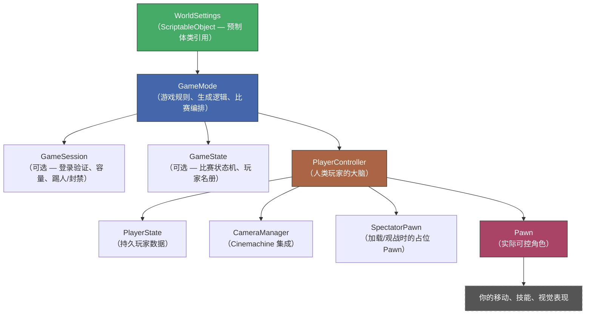
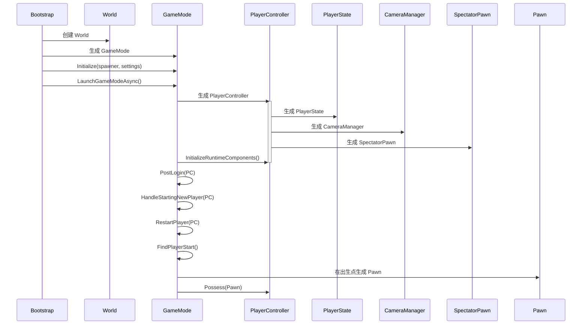
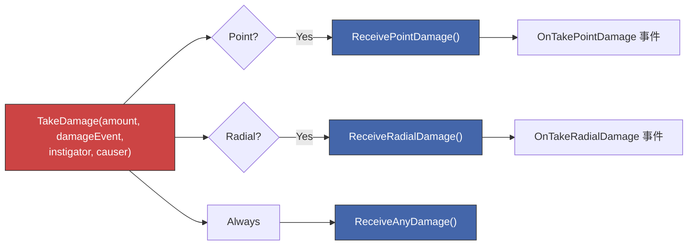

[**English**](README.md) | [**简体中文**]

# CycloneGames.GameplayFramework

CycloneGames.GameplayFramework 是一个面向 Unity 的 Gameplay 基础框架，继承了 **虚幻引擎（Unreal Engine）GameFramework** 的核心思想，并针对 Unity 的运行时模型进行了落地。它将 Gameplay 代码组织为 **Actor**、**Pawn**、**Controller**、**PlayerController**、**GameMode**、**PlayerState** 等明确层次，使所有权、生命周期、生成、附身和相机行为都建立在一致的契约之上。

这个包适合需要长期维护 Gameplay 架构、而不是继续堆叠零散 MonoBehaviour 脚本的项目。对于存在多种 GameMode、多种 Pawn、AI Controller、重生流程或角色替换需求的项目，它能够提供更稳定的结构基础。

- **Unity**: 2022.3+
- **依赖**:
  - `com.unity.burst` / `com.unity.mathematics` — Burst 优化的数学工具
  - `com.unity.cinemachine@3` — 摄像机管理
  - `com.cysharp.unitask@2` — 异步操作
  - `com.cyclone-games.factory@1` — 对象生成抽象（`IUnityObjectSpawner`）
  - `com.cyclone-games.logger@1` — 调试日志

---

## 目录

- [CycloneGames.GameplayFramework](#cyclonegamesgameplayframework)
  - [目录](#目录)
  - [设计理念](#设计理念)
    - [问题](#问题)
    - [解决方案](#解决方案)
    - [核心原则](#核心原则)
    - [这个包统一了什么](#这个包统一了什么)
  - [架构概览](#架构概览)
    - [组件层级](#组件层级)
    - [生命周期序列](#生命周期序列)
    - [数据生命周期](#数据生命周期)
    - [推荐扩展路径](#推荐扩展路径)
  - [类参考](#类参考)
    - [Actor](#actor)
    - [Pawn](#pawn)
    - [Controller](#controller)
    - [PlayerController](#playercontroller)
    - [AIController](#aicontroller)
    - [PlayerState](#playerstate)
    - [GameMode](#gamemode)
    - [GameState](#gamestate)
    - [GameSession](#gamesession)
    - [DamageType 伤害系统](#damagetype-伤害系统)
    - [World 与 WorldSettings](#world-与-worldsettings)
    - [CameraManager](#cameramanager)
    - [PlayerStart](#playerstart)
    - [SpectatorPawn](#spectatorpawn)
    - [KillZVolume](#killzvolume)
    - [SceneLogic](#scenelogic)
    - [ActorTag 标签系统](#actortag-标签系统)
    - [Config Assets](#config-assets)
    - [Scene Transition](#scene-transition)
    - [Serialization](#serialization)
    - [Camera Modes](#camera-modes)
    - [Camera Action Preset（ScriptableObject）](#camera-action-presetscriptableobject)
    - [CameraProfile](#cameraprofile)
    - [动画系统无关触发绑定](#动画系统无关触发绑定)
      - [第一步 — 创建 CameraActionPreset](#第一步--创建-cameraactionpreset)
      - [第二步 — 创建 CameraActionMap（可选但推荐）](#第二步--创建-cameraactionmap可选但推荐)
      - [第三步 — 在角色上添加 CameraActionBinding](#第三步--在角色上添加-cameraactionbinding)
      - [第四步 — 接入你的动画系统](#第四步--接入你的动画系统)
    - [可选 Animancer 集成](#可选-animancer-集成)
    - [Camera Blend Curves](#camera-blend-curves)
  - [快速开始](#快速开始)
    - [前提条件](#前提条件)
    - [最小配置](#最小配置)
      - [1. 创建必需预制体](#1-创建必需预制体)
      - [2. 创建并配置 WorldSettings](#2-创建并配置-worldsettings)
      - [3. 创建引导入口](#3-创建引导入口)
      - [4. 配置场景](#4-配置场景)
      - [5. 验证启动流程](#5-验证启动流程)
  - [进阶用法](#进阶用法)
    - [重生系统](#重生系统)
    - [角色切换](#角色切换)
    - [输入抑制](#输入抑制)
    - [伤害事件订阅](#伤害事件订阅)
    - [示例 — Navigathena bootstrap](#示例--navigathena-bootstrap)
  - [最佳实践](#最佳实践)

---

## 设计理念

### 问题

在很多 Unity 项目中，Gameplay 责任会逐步集中到少量脚本上，通常围绕玩家控制、场景状态和生成流程展开。输入、移动、摄像机、计分、重生和规则处理经常被写进同一个行为脚本中。这种耦合会提高迭代成本，使附身与 Pawn 替换更困难，也会削弱测试与复用能力。

### 解决方案

CycloneGames.GameplayFramework 通过定义稳定的 Gameplay 内核来解决这些问题，并为每个角色给出明确职责：

| 层次         | 类                 | 职责                                                           |
| ------------ | ------------------ | -------------------------------------------------------------- |
| **实体**     | `Actor`            | 所有游戏对象的基类 — 生命周期、所有权、标签、伤害              |
| **可控体**   | `Pawn`             | 可被附身并接收移动输入的 Actor                                 |
| **决策**     | `Controller`       | 管理附身、控制旋转与命令流的控制对象                           |
| **人类输入** | `PlayerController` | 由人类输入驱动的 Controller，带摄像机与观战支持                |
| **AI 决策**  | `AIController`     | 由 AI 逻辑驱动的 Controller，带注视目标与自动转向              |
| **持久数据** | `PlayerState`      | 在 Pawn 死亡/重生后仍保留的玩家数据（分数、昵称、统计）        |
| **游戏规则** | `GameMode`         | 生成逻辑、重生规则、比赛流程编排                               |
| **比赛状态** | `GameState`        | 可观察的比赛状态机与玩家名册                                   |
| **会话**     | `GameSession`      | 网络无关的玩家容量、登录验证、踢人/封禁                        |
| **伤害**     | `DamageType`       | 类型化的伤害管线，支持点/范围路由                              |
| **世界**     | `World`            | 轻量级服务定位器，用于访问 GameMode/GameState/PlayerController |
| **配置**     | `WorldSettings`    | ScriptableObject，绑定所有预制体类引用                         |

### 核心原则

- **DI 友好**：所有对象生成通过 `IUnityObjectSpawner` 进行 — 可无缝替换为任何 DI 容器或对象池，无需修改框架代码。
- **稳定的 Gameplay 内核**：核心语义定义在 `Actor`、`Pawn`、`Controller`、`PlayerController`、`GameMode`、`PlayerState` 这些基类上，它们决定默认使用习惯与命名风格。
- **分层扩展**：Gameplay 角色用继承和虚方法扩展；可选规则用策略对象扩展；基础设施与外部系统通过接口接入。
- **零强制依赖**：框架对 GameplayAbilities、GameplayTags、Networking 或其他 CycloneGames 包 **没有任何** 编译时依赖。集成通过接口和不透明上下文字段完成。

### 这个包统一了什么

- **附身流程**：`GameMode` 负责生成或重启 Pawn，`Controller` 负责执行附身，而 `PlayerState` 绑定在玩家生命周期上，而不是 Pawn 生命周期上。
- **玩家身份与角色实体的分离**：`PlayerController` 与 `PlayerState` 跨重生持续存在，`Pawn` 则被视为可替换的运行时实体。
- **相机所有权**：`PlayerController` 持有当前视角目标，`Actor` 与 `Pawn` 暴露相机语义，`CameraManager` 负责求解最终镜头。
- **游戏规则归属**：`GameMode` 始终是登录、出生点选择、生成、重生和比赛推进的权威入口。

---

## 架构概览

### 组件层级


```mermaid
graph TD
    WS["WorldSettings<br/>（ScriptableObject — 预制体类引用）"]
    GM["GameMode<br/>（游戏规则、生成逻辑、比赛编排）"]
    GSession["GameSession<br/>（可选 — 登录验证、容量、踢人/封禁）"]
    GState["GameState<br/>（可选 — 比赛状态机、玩家名册）"]
    PC["PlayerController<br/>（人类玩家的大脑）"]
    PS["PlayerState<br/>（持久玩家数据）"]
    CM["CameraManager<br/>（Cinemachine 集成）"]
    SP["SpectatorPawn<br/>（加载/观战时的占位 Pawn）"]
    Pawn["Pawn<br/>（实际可控角色）"]
    User["你的移动、技能、视觉表现"]

    WS --> GM
    GM --> GSession
    GM --> GState
    GM --> PC
    PC --> PS
    PC --> CM
    PC --> SP
    PC --> Pawn
    Pawn --> User

    style WS fill:#4a6,stroke:#333,color:#fff
    style GM fill:#46a,stroke:#333,color:#fff
    style PC fill:#a64,stroke:#333,color:#fff
    style Pawn fill:#a46,stroke:#333,color:#fff
    style User fill:#555,stroke:#999,color:#fff,stroke-dasharray: 5 5
```

### 生命周期序列


```mermaid
sequenceDiagram
    participant Boot as Bootstrap
    participant W as World
    participant GM as GameMode
    participant PC as PlayerController
    participant PS as PlayerState
    participant Cam as CameraManager
    participant SP as SpectatorPawn
    participant Pawn as Pawn

    Boot->>W: 创建 World
    Boot->>GM: 生成 GameMode
    Boot->>GM: Initialize(spawner, settings)
    Boot->>GM: LaunchGameModeAsync()
    GM->>PC: 生成 PlayerController
    activate PC
    PC->>PS: 生成 PlayerState
    PC->>Cam: 生成 CameraManager
    PC->>SP: 生成 SpectatorPawn
    GM->>PC: InitializeRuntimeComponents()
    deactivate PC
    GM->>GM: PostLogin(PC)
    GM->>GM: HandleStartingNewPlayer(PC)
    GM->>GM: RestartPlayer(PC)
    GM->>GM: FindPlayerStart()
    GM->>Pawn: 在出生点生成 Pawn
    GM->>PC: Possess(Pawn)
```

### 数据生命周期

| Pawn 死亡后保留                   | 随 Pawn 销毁 |
| --------------------------------- | ------------ |
| `PlayerController`                | `Pawn` 实例  |
| `PlayerState`（分数、昵称、统计） | 移动状态     |
| `CameraManager`                   | 视觉组件     |
| `SpectatorPawn`                   | 物理状态     |

这种分离使重生流程保持结构上的简洁：销毁旧 Pawn，生成新 Pawn，然后调用 `Possess()`。玩家侧状态在整个过程中保持连续。

### 推荐扩展路径

新增 Gameplay 功能时，建议先判断它属于哪一层：

1. 如果它改变的是场景中对象的身份或被附身后的行为，优先扩展 `Actor` 或 `Pawn`。
2. 如果它改变的是输入所有权、瞄准逻辑或视角目标选择，优先扩展 `Controller` 或 `PlayerController`。
3. 如果它改变的是出生、重生、玩家准入或比赛流程，优先扩展 `GameMode` 或 `GameSession`。
4. 如果它只是一个可选规则，优先放在 `CameraMode`、`IViewTargetPolicy` 或独立功能包中。

---

## 类参考

### Actor

**用途**：所有游戏对象的基类。提供生命周期钩子、所有权链、标签系统、可见性切换、伤害管线和网络扩展性。

**设计动机**：典型 Unity 项目中，游戏性 MonoBehaviour 缺乏统一的生命周期、所有权或伤害契约。Actor 建立了这个契约，使任何游戏对象 — 角色、弹体、拾取物、体积 — 共享一致的 API。

**核心功能**：

| 功能     | API                                                                      | 说明                                                                     |
| -------- | ------------------------------------------------------------------------ | ------------------------------------------------------------------------ |
| 生命周期 | `BeginPlay()` / `EndPlay()`                                              | Start 之后 / OnDestroy 之前各调用一次                                    |
| 所有权   | `SetOwner(Actor)` / `GetOwner()`                                         | 层级所有权链                                                             |
| 发起者   | `SetInstigator(Actor)` / `GetInstigator()`                               | 谁导致了此 Actor 的创建                                                  |
| 标签     | `ActorHasTag(string)` / `AddTag()` / `RemoveTag()`                       | 简单字符串标签系统，支持 `[ActorTag]` Inspector 选择器                   |
| 可见性   | `SetActorHiddenInGame(bool)`                                             | 批量渲染器切换                                                           |
| 伤害     | `TakeDamage(float)` / `TakeDamage(float, DamageEvent, ...)`              | 路由至 `ReceivePointDamage` / `ReceiveRadialDamage` / `ReceiveAnyDamage` |
| 生命期   | `SetLifeSpan(float)`                                                     | N 秒后自动销毁                                                           |
| 边界     | `FellOutOfWorld()` / `OutsideWorldBounds()`                              | 重写以处理出界                                                           |
| 网络     | `HasAuthority()`                                                         | 在网络层重写；默认 `true`（单机模式）                                    |
| 朝向     | `GetOrientation()`                                                       | Burst 编译的四元数转欧拉角                                               |
| 事件     | `OnDestroyed` / `OwnerChanged`                                           | 可观察的 Actor 生命周期事件                                              |
| 变换     | `GetActorLocation()` / `SetActorLocation()` / `GetActorRotation()` / ... | 对 `transform` 的便捷封装                                                |

**示例 — 自定义 Actor 的生命周期与伤害处理**：

```csharp
public class Projectile : Actor
{
    [SerializeField] private float speed = 20f;

    protected override void BeginPlay()
    {
        // Start 之后调用一次 — 设置自动销毁时间
        SetLifeSpan(5f);
    }

    protected override void EndPlay()
    {
        // OnDestroy 之前调用 — 清理特效、回收对象池等
    }

    void Update()
    {
        if (!IsHidden())
            transform.Translate(Vector3.forward * speed * Time.deltaTime);
    }

    public override void FellOutOfWorld()
    {
        // 触碰死亡区域 — 立即销毁
        Destroy(gameObject);
    }
}
```

### Pawn

**用途**：可被 Controller **附身** 的 Actor。即你的玩家角色、AI 敌人、载具 — 任何接收输入并在世界中行动的实体。

**设计动机**：将"身体"（Pawn）与"大脑"（Controller）分离，意味着可以在不重写控制逻辑的情况下更换角色，同一个 Pawn 类可以由人类输入或 AI 驱动。

**核心功能**：

- **附身**：`PossessedBy(Controller)` / `UnPossessed()` — 框架处理所有权和状态传递。
- **移动输入管线**：`AddMovementInput(direction, scale)` 每帧累积输入。移动组件每帧调用 `ConsumeMovementInputVector()` 驱动实际移动。
- **控制器旋转**：`FaceRotation()` 自动将 Pawn 旋转同步至 Controller 的 `ControlRotation`，支持逐轴控制（`UseControllerRotationPitch/Yaw/Roll`）。
- **初始旋转**：`NotifyInitialRotation(Quaternion)` 向所有 `IInitialRotationSettable` 组件广播 — 允许外部移动组件（如 RPGFoundation）同步初始旋转而无需框架耦合。
- **状态查询**：`IsPlayerControlled()`、`IsBotControlled()`、`IsLocallyControlled()`、`IsTurnedOff()`。
- **视角**：`GetPawnViewLocation()`、`GetViewRotation()`、`GetBaseAimRotation()` — 摄像机与瞄准集成。
- **开关**：`TurnOff()` / `TurnOn()` — 禁用 Pawn 而不销毁它。

**示例 — 带移动的角色 Pawn**：

```csharp
public class CharacterPawn : Pawn
{
    [SerializeField] private float moveSpeed = 5f;
    [SerializeField] private CharacterController characterController;

    protected override void BeginPlay()
    {
        UseControllerRotationYaw = true; // 同步 Yaw 到 Controller
    }

    public override void PossessedBy(Controller NewController)
    {
        base.PossessedBy(NewController);
        // 启用视觉效果、开始动画等
    }

    public override void UnPossessed()
    {
        base.UnPossessed();
        // 禁用输入驱动的行为
    }

    void Update()
    {
        // 消费累积的移动输入
        Vector3 input = ConsumeMovementInputVector();
        if (input.sqrMagnitude > 0.001f)
        {
            characterController.Move(input * moveSpeed * Time.deltaTime);
        }

        // 同步旋转到 Controller
        if (Controller != null)
        {
            FaceRotation(GetControlRotation(), Time.deltaTime);
        }
    }
}
```

### Controller

**用途**：附身并控制 Pawn 的抽象控制对象。它持有 `PlayerState`、出生点等持久引用，并在 Pawn 生命周期之外维护控制旋转。

**设计动机**：将控制逻辑与实体执行解耦，可以让 Pawn 在不重建控制侧状态的情况下被替换，也可以让同一个 Pawn 在人类输入、AI 逻辑、回放逻辑或脚本逻辑之间切换控制来源。

**核心功能**：

- **Possess / UnPossess**：完整的握手流程 — 通知旧 Pawn 和新 Pawn、旧 Controller，传递所有权。`OnPossessedPawnChanged` 事件触发。
- **堆栈式输入抑制**：`SetIgnoreMoveInput(true/false)` / `SetIgnoreLookInput(true/false)` 递增/递减计数器。多个系统可独立抑制输入而互不干扰。调用 `ResetIgnoreInputFlags()` 一次性清除。
- **生成器和设置注入**：`Initialize(IUnityObjectSpawner, IWorldSettings)` — 构造注入，适配 DI。
- **出生点**：`SetStartSpot(Actor)` / `GetStartSpot()` — 追踪此 Controller 的 Pawn 生成位置。
- **游戏流程**：`GameHasEnded(Actor, bool)` / `FailedToSpawnPawn()` — 重写以响应游戏事件。

### PlayerController

**用途**：面向人类玩家的 Controller。在 Controller 基础上扩展了 **视角目标所有权**、**相机扩展状态** 和 **观战 Pawn**。

**设计动机**：`PlayerController` 是人类输入、玩家本地相机状态和观战回退实体的持久拥有者。框架将相机契约稳定在 `GetViewTarget`、`SetViewTarget`、`AutoManageActiveCameraTarget` 这些核心接口上，而 `CameraContext`、`IViewTargetPolicy`、`CameraMode` 则作为可选扩展点存在。

**核心功能**：

- **运行时组件初始化**：`InitializeRuntimeComponents()` 会在控制器依赖注入完成后创建并连接 `PlayerState`、`CameraManager`、`CameraContext` 与 `SpectatorPawn`。`InitializationTask` 继续保留，主要用于兼容旧调用点。
- **视角目标管理**：`SetViewTarget(Actor)`、`ClearViewTargetOverride()`、`SetViewTargetPolicy(IViewTargetPolicy)`、`AutoManageActiveCameraTarget(Actor)` 用于协同手动覆盖和自动视角选择。
- **镜头风格管理**：`SetBaseCameraMode(CameraMode)`、`PushCameraMode(CameraMode)`、`RemoveCameraMode(CameraMode)`、`GetCameraContext()` 提供分层的镜头风格扩展方式，而不替代视角所有权模型。
- **观战回退**：`SpawnSpectatorPawn()` 与 `GetSpectatorPawn()` 为玩家暂时没有有效 Gameplay Pawn 的阶段提供稳定回退。

**推荐使用方式**：

1. 人类输入采集优先放在 `PlayerController` 或其输入子类中。
2. 移动、运动反馈和动画驱动优先留在 Pawn 中。
3. `SetViewTarget` 应当被视为视角切换的权威接口。
4. `CameraMode` 用于改变构图方式，而不是改变 Gameplay 所有权。

**示例 — 带输入的 PlayerController**：

```csharp
public class MyPlayerController : PlayerController
{
    void Update()
    {
        if (IsMoveInputIgnored()) return;

        Pawn pawn = GetPawn();
        if (pawn == null) return;

        // WASD 移动输入
        float h = Input.GetAxisRaw("Horizontal");
        float v = Input.GetAxisRaw("Vertical");
        Vector3 direction = new Vector3(h, 0, v).normalized;
        if (direction.sqrMagnitude > 0.001f)
        {
            pawn.AddMovementInput(direction, 1f);
        }

        // 鼠标视角 -> 控制旋转
        float mouseX = Input.GetAxis("Mouse X");
        Quaternion rot = ControlRotation() * Quaternion.Euler(0, mouseX * 2f, 0);
        SetControlRotation(rot);
    }
}
```

### AIController

**用途**：面向 AI 驱动 Pawn 的 Controller。提供 **注视系统** 和 **自动转向**。

**设计动机**：AI 需要注视目标并运行逻辑循环。AIController 提供注视/旋转管线，使 AI 实现（行为树、状态机、GOAP）只需调用 `SetFocus(Actor)` 或 `SetFocalPoint(Vector3)` 即可。

**核心功能**：

- **注视**：`SetFocus(Actor)` / `SetFocalPoint(Vector3)` / `ClearFocus()` / `GetFocusActor()` / `GetFocalPoint()`。
- **自动转向**：每帧 Update 中自动朝注视目标旋转。
- **AI 生命周期**：`RunAI()` / `StopAI()` / `IsRunningAI()` — 如果 `bStartAILogicOnPossess` 为 true，在附身/脱离附身时自动调用。

**示例 — 带注视的 AI 巡逻**：

```csharp
public class PatrolAIController : AIController
{
    [SerializeField] private Transform[] patrolPoints;
    private int currentIndex = 0;

    public override void RunAI()
    {
        base.RunAI();
        MoveToNextPatrolPoint();
    }

    void MoveToNextPatrolPoint()
    {
        if (patrolPoints.Length == 0) return;
        SetFocalPoint(patrolPoints[currentIndex].position);
    }

    void Update()
    {
        if (!IsRunningAI()) return;

        Pawn pawn = GetPawn();
        if (pawn == null) return;

        Vector3 target = patrolPoints[currentIndex].position;
        Vector3 dir = (target - pawn.GetActorLocation()).normalized;
        pawn.AddMovementInput(dir, 1f);

        if (Vector3.Distance(pawn.GetActorLocation(), target) < 1f)
        {
            currentIndex = (currentIndex + 1) % patrolPoints.Length;
            MoveToNextPatrolPoint();
        }
    }

    public void OnPlayerDetected(Actor player)
    {
        // 切换注视到玩家 — 自动转向会跟踪玩家
        SetFocus(player);
    }
}
```

### PlayerState

**用途**：在 Pawn 死亡和重生后 **仍然保留** 的持久玩家数据。

**设计动机**：分数、玩家昵称、队伍、背包 — 这些数据不应在角色死亡时丢失。PlayerState 挂载在 Controller 上（而非 Pawn 上），因此重生时创建新 Pawn 但所有玩家数据完好无损。

**核心功能**：

- **Pawn 追踪**：`GetPawn()` / `OnPawnSetEvent` — 当附身的 Pawn 变更时收到通知。事件签名：`(PlayerState, newPawn, oldPawn)`。
- **玩家信息**：`GetPlayerName()` / `SetPlayerName()`、`GetPlayerId()` / `SetPlayerId()`、`GetScore()` / `SetScore()`、`AddScore()`（返回新分数）。
- **标记**：`IsABot()` / `SetIsABot()`、`IsSpectator()` / `SetIsSpectator()`。
- **序列化接缝**：`Serialize(IDataWriter)` / `Deserialize(IDataReader)` 为存档系统、回放系统或网络同步适配器提供框架级持久化契约。
- **复制**：`CopyProperties(PlayerState)` — 用于无缝旅行或重生时的状态传递。

**示例 — 带背包的自定义 PlayerState**：

```csharp
public class RPGPlayerState : PlayerState
{
    private List<string> inventory = new List<string>();
    public int Kills { get; private set; }

    public void RecordKill()
    {
        Kills++;
        AddScore(100f);
    }

    public void AddItem(string itemId)
    {
        inventory.Add(itemId);
    }

    public override void CopyProperties(PlayerState other)
    {
        base.CopyProperties(other);
        if (other is RPGPlayerState rpg)
        {
            inventory = new List<string>(rpg.inventory);
            Kills = rpg.Kills;
        }
    }
}
```

### GameMode

**用途**：**总编排者**。处理玩家生成、重生、出生点选择和比赛流程。

**设计动机**：游戏规则（几条命、在哪重生、何时开始比赛）与玩家输入或角色移动有本质区别。GameMode 将这些决策集中在一处，只需更改 WorldSettings 中的预制体引用即可轻松切换游戏模式（死斗 vs. 夺旗 vs. 教程）。

**核心功能**：

- **启动**：`LaunchGameModeAsync(CancellationToken)` — 入口点。生成 PlayerController，等待初始化，调用 PostLogin，启动比赛，重启玩家。
- **出生点选择**：`FindPlayerStart()` -> `ChoosePlayerStart()` — 重写以实现自定义逻辑（随机、基于队伍、轮询）。
- **生成管线**：`SpawnDefaultPawnAtPlayerStart/Transform/Location()` — 生成 Pawn，通过 `TeleportPawn()` 处理 CharacterController/Rigidbody 传送。
- **登录/登出**：`PreLogin()`（通过 GameSession 验证）-> `PostLogin()`（注册 + HandleStartingNewPlayer）-> `Logout()`（注销）。
- **会话集成**：`SetGameSession(IGameSession)` — 可选。不设置会话时，所有登录检查通过（单机模式）。
- **配置驱动规则**：`SetGameModeConfig(GameModeConfig)` / `GetGameModeConfig()` 允许把规则预设放在资源资产里，而不是硬编码在子类里。
- **场景切换接缝**：`SetSceneTransitionHandler(ISceneTransitionHandler)` / `GetSceneTransitionHandler()` 为 Navigathena 这类场景导航系统提供清晰的适配边界。
- **旅行生命周期**：`TravelToLevel()` 会先通过 `EndGameAsync()` 做游戏侧收尾，再把实际场景切换委托给 transition handler。
- **Pawn 类选择**：重写 `GetDefaultPawnPrefabForController()` 可为不同玩家返回不同 Pawn 预制体（基于职业或队伍的选择）。

**示例 — 带生命值和自定义出生点的 GameMode**：

```csharp
public class ArenaGameMode : GameMode
{
    private Dictionary<PlayerController, int> playerLives = new();
    private const int MaxLives = 3;

    protected override void HandleStartingNewPlayer(PlayerController NewPlayer)
    {
        playerLives[NewPlayer] = MaxLives;
    }

    public override void RestartPlayer(PlayerController NewPlayer, string Portal = "")
    {
        if (playerLives.TryGetValue(NewPlayer, out int lives) && lives <= 0)
        {
            // 没有剩余生命 — 切换为观战者
            NewPlayer.GetPlayerState()?.SetIsSpectator(true);
            return;
        }
        base.RestartPlayer(NewPlayer, Portal);
    }

    // 重写以随机选择出生点
    protected override Actor ChoosePlayerStart(Controller Player)
    {
        var starts = PlayerStart.GetAllPlayerStarts();
        if (starts.Count == 0) return null;
        return starts[UnityEngine.Random.Range(0, starts.Count)];
    }

    // 重写以分配职业特定的 Pawn 预制体
    protected override Pawn GetDefaultPawnPrefabForController(Controller InController)
    {
        // 可根据玩家职业选择返回不同的 Pawn 预制体
        return base.GetDefaultPawnPrefabForController(InController);
    }

    public void OnPlayerKilled(PlayerController player)
    {
        if (playerLives.ContainsKey(player))
        {
            playerLives[player]--;
            RestartPlayer(player);
        }
    }
}
```

### GameState

**用途**：所有玩家可见的、可观察的比赛状态。追踪比赛阶段、经过时间和权威的玩家名册。

**设计动机**：在多人游戏中，所有客户端需要就比赛状态达成一致（等待中、进行中、已结束）。即使在单人游戏中，比赛阶段的状态机也能避免散落在各处的临时 bool 标志。

**核心功能**：

- **比赛状态机**：`EMatchState` 枚举（EnteringMap -> WaitingToStart -> InProgress -> WaitingPostMatch -> LeavingMap -> Aborted）。
- **状态转换**：`SetMatchState(EMatchState)` -> `OnMatchStateChanged(old, new)` — 重写以实现自定义转换逻辑。
- **玩家名册**：`AddPlayerState()` / `RemovePlayerState()` / `PlayerArray` / `GetNumPlayers()`。
- **经过时间**：`ElapsedTime` — 在 `InProgress` 状态下自动递增。

**示例 — 带胜利条件的 GameState**：

```csharp
public class ArenaGameState : GameState
{
    public int ScoreToWin { get; set; } = 10;

    protected override void OnMatchStateChanged(EMatchState OldState, EMatchState NewState)
    {
        if (NewState == EMatchState.InProgress)
        {
            // 比赛刚开始 — 通知 UI
            Debug.Log("Match started!");
        }
        else if (NewState == EMatchState.WaitingPostMatch)
        {
            Debug.Log($"Match ended after {ElapsedTime:F1}s");
        }
    }

    public void CheckWinCondition()
    {
        foreach (var ps in PlayerArray)
        {
            if (ps.GetScore() >= ScoreToWin)
            {
                SetMatchState(EMatchState.WaitingPostMatch);
                return;
            }
        }
    }
}
```

### GameSession

**用途**：网络无关的会话管理 — 玩家容量、登录验证、踢人/封禁。

**设计动机**：网络方案各异（Mirror、Netcode、Photon、自研）。GameSession 提供稳定的接口（`IGameSession`），GameMode 通过它调用，而实际网络实现则位于适配器中。不设置会话时，GameMode 以单机模式运行，无容量检查。

**核心功能**：

- **`IGameSession` 接口**：`ApproveLogin()`、`RegisterPlayer()`、`UnregisterPlayer()`、`AtCapacity()`、`KickPlayer()`、`BanPlayer()`、`HandleMatchHasStarted/Ended()`。
- **默认实现**：`GameSession`（Actor 子类） 本地单机会话，对照 `MaxPlayers`/`MaxSpectators` 计数。
- **集成方式**：在 Mirror/Netcode/Photon 适配器中实现 `IGameSession`。传递给 `GameMode.SetGameSession()`。

**示例 — 带密码的自定义会话**：

```csharp
public class PasswordGameSession : GameSession
{
    [SerializeField] private string serverPassword = "";

    public override bool ApproveLogin(string options, string address, out string errorMessage)
    {
        if (!base.ApproveLogin(options, address, out errorMessage))
            return false;

        if (!string.IsNullOrEmpty(serverPassword) && options != serverPassword)
        {
            errorMessage = "Invalid password";
            return false;
        }
        return true;
    }
}
```

### DamageType 伤害系统

**用途**：类型化、可路由的伤害管线。定义伤害种类（火焰、爆炸、环境）并携带命中上下文（位置、方向、半径）。

**设计动机**：游戏需要区分伤害类型以处理护甲、抗性、视觉效果和音效。框架提供 `IDamageType` 接口使其可独立使用，同时通过不透明的 `EffectContext` 字段携带 GameplayAbilities 上下文 — 无需对 GAS 产生任何编译时依赖。

**组件**：

- **`IDamageType`**（接口）：`CausedByWorld`、`ScaleMomentumByMass`、`DamageImpulse`、`DamageFalloff`。
- **`DamageType`**（ScriptableObject）：默认实现 — 通过 `Create -> CycloneGames -> GameplayFramework -> DamageType` 创建。
- **`EDamageEventType`**（枚举）：`Generic`、`Point`、`Radial`。
- **`DamageEvent`**（结构体）：零分配值类型，包含事件类型、伤害类型、命中位置/法线/方向（点伤害）、原点/半径（范围伤害），以及可选的 `EffectContext`（object）用于 GAS 桥接。
- **工厂方法**：`DamageEvent.MakeGenericDamage()`、`MakePointDamage(...)`、`MakeRadialDamage(...)`。

**Actor 中的伤害路由**：


```mermaid
flowchart LR
    TD["TakeDamage(amount, damageEvent,<br/>instigator, causer)"] --> Point{Point?}
    TD --> Radial{Radial?}
    TD --> Always["Always"]

    Point -->|Yes| RPD["ReceivePointDamage()"]
    RPD --> OTPD["OnTakePointDamage 事件"]

    Radial -->|Yes| RRD["ReceiveRadialDamage()"]
    RRD --> OTRD["OnTakeRadialDamage 事件"]

    Always --> RAD["ReceiveAnyDamage()"]

    style TD fill:#c44,stroke:#333,color:#fff
    style RPD fill:#46a,stroke:#333,color:#fff
    style RRD fill:#46a,stroke:#333,color:#fff
    style RAD fill:#46a,stroke:#333,color:#fff
```

**示例 — 施加和接收伤害**：

```csharp
// --- 施加伤害（如武器）---
public class Weapon : Actor
{
    [SerializeField] private DamageType fireDamageType;

    public void FireAt(Actor target, Vector3 hitLocation, Vector3 hitNormal)
    {
        var damageEvent = DamageEvent.MakePointDamage(
            hitLocation, hitNormal, GetActorForwardVector(), fireDamageType);

        target.TakeDamage(25f, damageEvent,
            GetInstigator<Controller>(), this);
    }

    public void Explode(Vector3 origin, float radius)
    {
        var damageEvent = DamageEvent.MakeRadialDamage(
            origin, innerRadius: 2f, outerRadius: radius, fireDamageType);

        // 对半径内的所有 Actor 施加伤害...
    }
}

// --- 接收伤害（在你的 Actor 子类中）---
public class EnemyActor : Actor
{
    private float health = 100f;

    protected override void ReceiveAnyDamage(float Damage, Controller EventInstigator, Actor DamageCauser)
    {
        health -= Damage;
        if (health <= 0f)
            Destroy(gameObject);
    }

    protected override void ReceivePointDamage(float Damage, DamageEvent damageEvent,
        Controller EventInstigator, Actor DamageCauser)
    {
        // 在撞击点生成命中特效
        // damageEvent.HitLocation, damageEvent.HitNormal, damageEvent.ShotDirection
    }

    protected override void ReceiveRadialDamage(float Damage, DamageEvent damageEvent,
        Controller EventInstigator, Actor DamageCauser)
    {
        // 从爆炸原点施加击退
        // damageEvent.Origin, damageEvent.InnerRadius, damageEvent.OuterRadius
    }
}
```

### World 与 WorldSettings

**`WorldSettings`**（ScriptableObject） 绑定所有类引用的配置资产：

| 字段                    | 类型               | 必需 |
| ----------------------- | ------------------ | ---- |
| `GameModeClass`         | `GameMode`         | 是   |
| `PlayerControllerClass` | `PlayerController` | 是   |
| `PawnClass`             | `Pawn`             | 是   |
| `PlayerStateClass`      | `PlayerState`      | 否   |
| `CameraManagerClass`    | `CameraManager`    | 否   |
| `SpectatorPawnClass`    | `SpectatorPawn`    | 否   |

通过 `Create -> CycloneGames -> GameplayFramework -> WorldSettings` 创建。编辑器验证会为每个字段显示绿色/红色/黄色状态。

**`World`** — 非 MonoBehaviour 的服务定位器。持有 GameMode、GameState 引用，提供玩家查询：

```csharp
World world = new World();
world.SetGameMode(gameMode);
world.SetGameState(gameState);
PlayerController pc = world.GetPlayerController();
Pawn pawn = world.GetPlayerPawn();
```

### CameraManager

**用途**：为当前玩家求解最终 `CameraPose`，并将结果输出到活动的 Cinemachine 摄像机。

**前提**：主摄像机需要 `CinemachineBrain`。场景中至少需要一个 `CinemachineCamera`。

**配置要点（推荐）**：

1. `CameraManager` 预制体上设置 `Bootstrap Virtual Camera`（通常拖同物体上的 `CinemachineCamera`）。
2. `Bootstrap Brain` 可选：
   - 若 `CameraManager` 是场景内预放对象，可直接拖场景 `MainCamera` 上的 `CinemachineBrain`。
   - 若 `CameraManager` 是运行时生成对象（常见），预制体无法直接持有场景引用，这是正常现象。可在运行时调用 `SetBootstrapBrain(...)` 显式绑定，或调用 `TryResolveAndBindBrain()` 自动解析。
3. 如果场景中有多个 `CinemachineBrain`，建议始终显式绑定，避免歧义。

**运行时绑定 API**：

- `SetBootstrapBrain(CinemachineBrain brain, bool rebindImmediately = true)`
- `SetBootStartpBrain(...)`（兼容别名）
- `TryResolveAndBindBrain()`

**无 Brain 时的行为**：

- `CameraManager` 仍会计算 `CameraPose`，但不会驱动最终输出相机（会打印警告）。
- 框架 Gameplay 主逻辑可继续运行，但 Camera 模块效果不会生效。

**核心 API**：`InitializeFor(PlayerController)`、`UpdateCamera(float)`、`NotifyCameraStateChanged()`、`SetActiveVirtualCamera()`、`SetFOV(float)`。

**扩展后的相机接缝**：

- **混合曲线**：`CameraBlendState` 现在可接受 `ICameraBlendCurve`，让过渡节奏与姿态插值逻辑解耦。
- **模式分层**：`CameraMode` 仍然负责构图扩展，而可复用的参数预设现在可以放进 `CameraProfile` ScriptableObject。
- **示例参考实现**：`FirstPersonCameraMode`、`OrbitalCameraMode`、`ThirdPersonFollowCameraMode` 作为可选参考实现，已放在 `Samples/Sample.CameraModes`。

**镜头工作流**：

- **`Actor.GetActorEyesViewPoint()`**：提供 Actor 的基础观察点。
- **`Actor.CalcCamera()`**：主镜头求解入口。`Pawn` 或其他 Actor 可以通过重写它提供自身的镜头语义。
- **`Controller.GetViewTarget()` 与 `PlayerController.SetViewTarget()`**：定义当前究竟观察哪个 Actor。
- **`CameraContext` 与 `IViewTargetPolicy`**：在不把策略污染进 Gameplay 内核的前提下，进一步调整目标选择逻辑。
- **`CameraMode`**：叠加可选构图逻辑，例如跟随距离、注视点偏移和 FOV 覆盖。
- **`CameraManager`**：组合上述层次并写入最终镜头结果。

**建议的扩展位置**：

1. 当观察点与 Actor 枢轴不同步时，优先重写 `GetActorEyesViewPoint()`。
2. 当镜头语义由 Actor 自身决定时，优先重写 `CalcCamera()`。
3. 当目标不变而构图发生变化时，优先增加 `CameraMode`。
4. 当自动选目标规则因 GameMode 或观战状态而变化时，优先增加或替换 `IViewTargetPolicy`。

**示例 — 切换视角目标与 CameraMode**：

```csharp
// 在你的 PlayerController 子类中：
public void SwitchToSpectateTarget(Actor target)
{
    SetViewTargetWithBlend(target, 0.5f); // 0.5 秒混合
    SetBaseCameraMode(new ViewTargetCameraMode());
}

public void EnableCombatCamera()
{
    PushCameraMode(new ThirdPersonFollowCameraMode
    {
        FollowDistance = 5.5f,
        PivotHeight = 1.8f,
        LookAtHeight = 1.2f,
        OverrideFov = 55f
    });
}

public void DisableCombatCamera(CameraMode combatMode)
{
    RemoveCameraMode(combatMode);
}
```

**参考实现 — 第三人称与技能镜头的业务层组合**：

```csharp
using UnityEngine;
using CycloneGames.GameplayFramework.Runtime;

// 业务层 PlayerController 扩展
public class MyGamePlayerController : PlayerController
{
    private readonly ThirdPersonFollowCameraMode thirdPersonMode = new ThirdPersonFollowCameraMode
    {
        FollowDistance = 4.5f,
        PivotHeight = 1.6f,
        LookAtHeight = 1.1f,
        OverrideFov = 60f
    };

    private readonly SkillCameraMode skillMode = new SkillCameraMode();

    // 保持框架默认中立模式，业务层显式设置基础构图。
    protected override CameraMode CreateDefaultCameraMode()
    {
        return new ViewTargetCameraMode();
    }

    public void EnterGameplayCamera()
    {
        SetBaseCameraMode(thirdPersonMode);
    }

    public void OnSkillBegin(float duration)
    {
        skillMode.Setup(duration, 7f, 52f);
        PushCameraMode(skillMode);
    }

    public void OnSkillEnd()
    {
        RemoveCameraMode(skillMode);
    }
}

// 业务层技能镜头模式示例
public sealed class SkillCameraMode : CameraMode
{
    private float duration;
    private float elapsed;
    private float targetDistance;
    private float targetFov;

    public override float BlendDuration => 0.15f;

    public void Setup(float inDuration, float inDistance, float inFov)
    {
        duration = Mathf.Max(0.01f, inDuration);
        elapsed = 0f;
        targetDistance = inDistance;
        targetFov = inFov;
    }

    public override void Tick(CameraContext context, float deltaTime)
    {
        elapsed = Mathf.Min(duration, elapsed + deltaTime);
    }

    public override CameraPose Evaluate(CameraContext context, in CameraPose basePose, float deltaTime)
    {
        Actor target = context != null ? context.CurrentViewTarget : null;
        if (target == null)
        {
            return basePose;
        }

        target.CalcCamera(deltaTime, out CameraPose targetPose, basePose.Fov);

        float alpha = duration > 0f ? elapsed / duration : 1f;
        alpha = alpha * alpha * (3f - 2f * alpha); // SmoothStep

        Vector3 pivot = targetPose.Position + Vector3.up * 1.6f;
        Vector3 desiredPos = pivot + (targetPose.Rotation * Vector3.back) * targetDistance;
        Vector3 lookAt = targetPose.Position + Vector3.up * 1.1f;
        Quaternion desiredRot = Quaternion.LookRotation((lookAt - desiredPos).normalized, Vector3.up);

        CameraPose skillPose = new CameraPose(desiredPos, desiredRot, targetFov);
        return CameraPose.Lerp(basePose, skillPose, alpha);
    }
}
```

**分层约定**：

1. `CameraMode` 具体风格实现建议放在业务项目层（例如 `Assets/Game/Scripts/Camera`）。
2. 框架 Runtime 仅维护中立契约与扩展接缝（如 `ViewTargetCameraMode`、`SetBaseCameraMode`、`PushCameraMode`、`RemoveCameraMode`）。
3. 第三人称、锁定目标、技能演出等镜头风格通过业务层 `CameraMode` 组合实现。
4. 对高频触发的技能镜头，建议复用 `CameraMode` 实例以降低运行时分配。

**说明**：`ThirdPersonFollowCameraMode`、`FirstPersonCameraMode`、`OrbitalCameraMode` 属于可选参考实现，现位于 `Samples/Sample.CameraModes`。框架 Runtime 核心契约仍以 `ViewTargetCameraMode`、`CameraMode` 和相机栈 API 为中心。

### PlayerStart

**用途**：玩家出生点。使用 **静态注册表模式** 实现零 GC 查找 — 运行时无需 `FindObjectsOfType`。

**特性**：启用/禁用时自动注册/注销。支持基于名称的匹配，用于传送门/检查点系统。编辑器中绘制 Gizmo。

**示例 — 基于传送门名称的出生点选择**：

```csharp
// 将 PlayerStart 的 GameObject 命名为："SpawnPoint_LevelA"、"SpawnPoint_LevelB"
// 然后在 GameMode 中：
protected override Actor ChoosePlayerStart(Controller Player)
{
    string portal = "SpawnPoint_LevelB";
    foreach (var start in PlayerStart.GetAllPlayerStarts())
    {
        if (start.gameObject.name == portal)
            return start;
    }
    return base.ChoosePlayerStart(Player);
}
```

### SpectatorPawn

**用途**：当玩家尚未获得实际角色时使用的最小 Pawn（加载期间、回合间隙、观战时）。

**关键字段**：`spectatorSpeed` — 观战模式下的移动速度。

### KillZVolume

**用途**：触发体积，任何进入的 Actor 都会调用 `FellOutOfWorld()`。同时支持 3D（`BoxCollider` + IsTrigger）和 2D（`BoxCollider2D` + IsTrigger）。

**使用方式**：将 `KillZVolume` 组件添加到带有触发碰撞器的 GameObject 上。放置在可游玩区域下方。

### SceneLogic

**用途**：每场景的逻辑控制器。提供生命周期钩子（`Awake`、`Start`、`Update` 等），用于场景特定的游戏脚本 — 如开场过场、关卡特定触发器、环境事件等。

### ActorTag 标签系统

**用途**：为 Actor 基于字符串的标签字段提供 Inspector 友好的标签选择。

**组件**：

- **`ActorTagAttribute`**：带可选 `Type` 参数的 PropertyAttribute。
  - `[ActorTag]` — 不指定类型：绘制为普通字符串字段（框架基类使用）。
  - `[ActorTag(typeof(MyTags))]` — 指定类型：绘制可搜索弹出选择器，数据源为指定类中的 `public const string` 字段。
- **`ActorTagPropertyDrawer`**：编辑器 Drawer，打开带 `SearchField` + 可滚动 `TreeView` 的 `PopupWindow`。支持搜索过滤、(None) 选项、清除按钮和无效值高亮。

**示例**：

```csharp
// 1. 定义标签常量
public static class ActorTags
{
    public const string Player = "Player";
    public const string Enemy = "Enemy";
    public const string NPC = "NPC";
    public const string Interactable = "Interactable";
    public const string Destructible = "Destructible";
}

// 2. 在你的 Actor 子类中使用 — Inspector 显示可搜索下拉菜单
public class MyPawn : Pawn
{
    [SerializeField, ActorTag(typeof(ActorTags))]
    private List<string> tags;
}

// 3. 运行时查询标签
if (someActor.ActorHasTag("Enemy"))
{
    // 对敌人做出反应
}
```

### Config Assets

**用途**：把常见 Gameplay 调参从子类代码中抽离出来，放进可复用的 ScriptableObject 资产。

**内置资产**：

- **`WorldSettings`** — 绑定框架启动所需的核心预制体类型。
- **`PawnConfig`** — 保存可控体参数，例如是否跟随 Controller Rotation、视角高度、视角俯仰限制和视角灵敏度。
- **`GameModeConfig`** — 保存高层规则参数，例如重生延迟、比赛时长、玩家上限和默认观战设置。
- **`CameraProfile`** — 保存与具体镜头类型无关的全局默认参数。当前基类只暴露 `fov` 与回退 `blendDuration`；当项目需要更多全局相机参数时，建议在业务层通过子类扩展，并继续把它作为单个可分配资产使用。

**价值**：

1. 设计师可以直接调参，而不必重新编译代码。
2. 多个 GameMode 或 Pawn 原型可以共享同一套运行时代码，只切换不同配置资产。
3. 框架依然保持独立，因为这些配置只是简单的 ScriptableObject，而不是对其他包的适配器。

**示例 — 资产驱动配置**：

```csharp
public class ArenaGameMode : GameMode
{
    [SerializeField] private GameModeConfig config;

    protected override void BeginPlay()
    {
        base.BeginPlay();

        if (config == null) return;

        SetGameModeConfig(config);
        config.ApplyTo(this);
    }
}

public class CharacterPawn : Pawn
{
    [SerializeField] private PawnConfig config;

    protected override void BeginPlay()
    {
        base.BeginPlay();

        if (config == null) return;

        SetPawnConfig(config);
        config.ApplyTo(this);
    }
}
```

`CameraProfile` 也建议采用同样模式：在你的相机栈初始化位置持有这个资产，并在运行时 `CameraManager` 可用后把参数应用进去。

### Scene Transition

**用途**：让场景导航能力留在 Gameplay 内核之外，同时给 `GameMode` 提供稳定的 travel API。

**核心契约**：`ISceneTransitionHandler`

- `ChangeScene(string sceneName, CancellationToken)`
- `PushScene(string sceneName, CancellationToken)`
- `PopScene(CancellationToken)`
- `ReplaceScene(string sceneName, CancellationToken)`

**设计意图**：

- `GameMode` 负责 Gameplay 侧的收尾和编排。
- 真正的场景系统语义属于外部适配器。
- 项目可以接入 Unity SceneManager、Navigathena 或自定义加载栈，而无需修改 `GameMode`。

**重要行为**：

`TravelToLevel()` 不会直接启动下一个场景的 `GameMode`。这个职责应由目标场景自己的 bootstrap 流程或 scene entry point 负责。

### Serialization

**用途**：提供一个最小持久化接缝，而不把存档系统或网络依赖强塞进框架内核。

**核心契约**：

- **`IGameplayFrameworkSerializable`** — 由希望暴露持久状态的运行时类实现。
- **`IDataWriter`** / **`IDataReader`** — 面向适配器的类型化读写抽象。

**当前内置使用**：

- `PlayerState` 默认序列化玩家名、玩家 ID、分数、Bot 标记和观战标记等核心字段。

**推荐使用方式**：

1. 在存档系统或网络同步适配器中实现这些接口。
2. 在子类里扩展 `PlayerState.Serialize()` / `Deserialize()`，写入项目自己的背包、成长或队伍信息。
3. 二进制格式、JSON 格式和传输细节保持在框架包之外。

### Camera Modes

**用途**：在不改变视角所有权规则的前提下，提供可复用的镜头行为。

**示例实现**：

- **`FirstPersonCameraMode`** — 从目标的眼睛视点求值，适合直接的第一人称控制。
- **`OrbitalCameraMode`** — 以可配置半径和高度环绕目标，并支持自动旋转。
- **`ThirdPersonFollowCameraMode`** — 提供第三人称跟随构图的基线实现。

这些示例 CameraMode 类位于 `Samples/Sample.CameraModes`，并与 Runtime 核心实现保持分离。

**使用建议**：

- 当某种模式代表玩家默认镜头时，用 `SetBaseCameraMode()`。
- 当需要临时叠加战斗缩放、锁定目标或拍照模式时，用 `PushCameraMode()` / `RemoveCameraMode()`。
- 所有权变化继续放在 `SetViewTarget()`，构图变化放在 `CameraMode`。

### Camera Action Preset（ScriptableObject）

在动作玩法中，可通过 `CameraActionPreset` 资产化镜头参数，再通过 `PresetCameraMode` 在运行时执行。

- `CameraActionPreset`：保存时长、混合时长、构图偏移、FOV 等参数。
- `PresetCameraMode`：基于当前 ViewTarget 与预设求解并输出 `CameraPose`。

示例流程：

```csharp
public class MyActionCameraDriver : MonoBehaviour
{
    [SerializeField] private PlayerController playerController;
    [SerializeField] private CameraActionPreset heavyAttackPreset;

    private readonly PresetCameraMode actionMode = new PresetCameraMode();

    public void PlayHeavyAttackCamera(float attackDuration)
    {
        actionMode.Setup(heavyAttackPreset, attackDuration);
        playerController.PushCameraMode(actionMode);
    }

    private void Update()
    {
        if (actionMode.IsFinished)
        {
            playerController.RemoveCameraMode(actionMode);
        }
    }
}
```

这种模式可以在保持运行时镜头求解轻量化的同时，让设计师将镜头方案与动画/VFX 流水线进行资源级绑定。

### CameraProfile

`CameraProfile` 是一个刻意保持精简的共享配置 ScriptableObject，用于与摄像机类型无关的全局参数：

| 字段            | 作用                                           |
| --------------- | ---------------------------------------------- |
| `fov`           | 启动时应用到 `CameraManager` 的默认视野角      |
| `blendDuration` | 当激活的 `CameraMode` 未指定混合时长时的回退值 |

**它是一个设计为可拓展的基类，而非多余的资产。** 子类化它，可以将项目特有的摄像机全局参数（后处理 Volume、CinemachineChannel、镜头预设等）打包成一个可直接拖拽赋值的资产，方便在关卡、角色或场景切换时整体替换：

```csharp
[CreateAssetMenu(menuName = "MyGame/MyCameraProfile")]
public class MyCameraProfile : CameraProfile
{
    [SerializeField] private VolumeProfile postProcessVolume;
    [SerializeField] private float motionBlurIntensity;

    public override void ApplyTo(CameraManager manager)
    {
        base.ApplyTo(manager);
        // 在此将自定义字段应用到 manager 或 Cinemachine brain
    }
}
```

创建方式：`Assets > Create > CycloneGames > GameplayFramework > CameraProfile`

---

### 动画系统无关触发绑定

摄像机动作系统将触发逻辑与任何具体动画运行时解耦。
所有动画方案都调用同一套 `CameraActionBinding` API，Camera 模块无需感知是哪个系统发起了触发。

#### 第一步 — 创建 CameraActionPreset

`Assets > Create > CycloneGames > GameplayFramework > CameraActionPreset`

在 Inspector 中配置时序、取景、镜头覆盖字段。
在代码中子类化，可以 override 7 个虚拟求值步骤（`ResolveUpAxis`、`ResolveOffset`、`ComputePivotPoint`、`ComputeDesiredPosition`、`ComputeLookAtPoint`、`ComputeDesiredRotation`、`ResolveDesiredFov`）。

#### 第二步 — 创建 CameraActionMap（可选但推荐）

`Assets > Create > CycloneGames > GameplayFramework > CameraActionMap`

将 `ActionKey` 字符串映射到预设资产。多角色可共享同一张表，在资产中修改预设后所有角色立即生效。

| 字段                 | 作用                                           |
| -------------------- | ---------------------------------------------- |
| `ActionKey`          | 动画系统发送的唯一字符串标识                   |
| `Preset`             | 要激活的 `CameraActionPreset` 资产             |
| `Policy`             | `ReplaceSameKey` / `IgnoreIfRunning` / `Stack` |
| `AutoRemoveOnFinish` | 时长结束后是否自动移除                         |
| `DurationOverride`   | 覆盖预设时长（≤0 = 使用预设自身值）            |

`CameraActionBinding` 组件上的内联条目始终优先于表中相同 key 的条目，允许个别角色覆盖共享默认值，而无需修改共享资产。

#### 第三步 — 在角色上添加 CameraActionBinding

将组件添加到 `PlayerController` 旁边或其父对象上。可以分配内联 `actionEntries`、共享 `CameraActionMap`，或两者兼用。

```csharp
// 可从任意动画系统在任意时机调用：
actionBinding.PlayAction("dodge");
actionBinding.PlayAction("heavyAttack", 0.6f);  // 带时长覆盖
actionBinding.StopAction("dodge");
actionBinding.IsActionRunning("heavyAttack");   // 查询状态
```

#### 第四步 — 接入你的动画系统

根据项目选择适配器：

**Unity Animator — Animation Events**

在 `CameraActionBinding` 旁边添加 `AnimatorCameraActionBridge`。
在动画片段中添加 `AnimationEvent`，调用以下方法之一：

| 方法                                      | 说明                |
| ----------------------------------------- | ------------------- |
| `PlayCameraAction(string key)`            | 播放 key 对应的预设 |
| `PlayCameraActionTimed(string "key@0.6")` | 播放并内联覆盖时长  |
| `StopCameraAction(string key)`            | 按 key 停止         |
| `StopAllCameraActions()`                  | 停止所有激活预设    |

**Unity Animator — State Machine Behaviour**

在任意 Animator 状态上添加 `CameraActionStateBehaviour`（在状态 Inspector 中点击 `Add Behaviour`）：

| 字段                                   | 作用                                                 |
| -------------------------------------- | ---------------------------------------------------- |
| `On Enter Action Key`                  | 进入此状态时播放                                     |
| `Allow Enter Trigger In Transition`    | 混合期间是否允许进入触发                             |
| `On Exit Mode`                         | `None` / `StopActionKey` / `PlayActionKey`           |
| `On Exit Action Key`                   | 退出时要停止的 key（StopActionKey 模式）             |
| `On Exit Play Action Key`              | 退出时要播放的 key（PlayActionKey 模式）             |
| `On Progress Action Key`               | 动画归一化时间跨过阈值时播放的 key                   |
| `Trigger Normalized Time`              | 进度触发的 0–1 阈值                                  |
| `Trigger Every Loop`                   | 每次循环都重置触发，还是整个状态生命周期只触发一次   |
| `Allow Progress Trigger In Transition` | 混合期间是否允许进度触发                             |
| `Duration Override`                    | 应用到进入/退出/进度动作的时长（≤0 = 使用表/预设值） |

**Unity Timeline**

将 `TimelineCameraActionReceiver` 添加到与 `PlayableDirector` 同一 GameObject 上。
在 Timeline Signal Track 中放置 `SignalEmitter` 标记并创建 `SignalAsset` 文件。
将每个 `SignalAsset` 拖入组件的映射表并设置对应 action key。
无需添加 `com.unity.timeline` 包依赖。

**Animancer**（可选集成）

在 `CameraActionBinding` 旁边添加 `AnimancerCameraActionBridge`。
配置 `EventToAction` 映射列表：

| 字段                              | 作用                                                    |
| --------------------------------- | ------------------------------------------------------- |
| `EventName`                       | 与动画片段中 Animancer 命名事件匹配                     |
| `ActionKey`                       | 转发给 `CameraActionBinding.PlayAction` 或 `StopAction` |
| `StopAction`                      | 勾选则调用 Stop 而非 Play                               |
| `DurationOverride`                | 每个事件的时长覆盖                                      |
| `MinTriggerInterval`              | 最小触发间隔（节流），≤0 = 无限制                       |
| `RequiredCurrentStateKeyContains` | 仅当当前层 CurrentState 的 key 包含此子串时触发         |
| `InvertCurrentStateKeyFilter`     | 反转状态 key 过滤逻辑                                   |
| `LayerIndex`                      | 进行状态 key 过滤时检查的 Animancer 层索引              |
| `AdditionalCommands`              | 批量：一次事件执行多条 Play/Stop 命令                   |

每条 `AdditionalCommand` 也支持 `RequireActionRunningKey`/`InvertRequirement` 条件守卫，可对批量中的每条命令单独配置条件。

**纯代码 / 其他系统**

`CameraActionBinding.PlayAction` 和 `StopAction` 是普通公共方法，可从任何地方调用（PlayMaker、Bolt、自定义能力系统等）。

### 可选 Animancer 集成

如果项目使用 `com.kybernetik.animancer`，启用集成程序集：

- 集成路径：`Runtime/Scripts/Integrations/Animancer`
- `AnimancerCameraActionBridge` 将 Animancer 命名事件映射到 `CameraActionBinding` 的 action key。
- 集成程序集是可选的，与框架核心契约隔离。
- 委托在 `Awake` 中预创建，`OnEnable`/`OnDisable` 循环产生零 GC。

### Camera Blend Curves

**用途**：控制相机过渡的加速或缓出节奏，而不改变源姿态和目标姿态本身。

**核心契约**：`ICameraBlendCurve.Evaluate(float t)`

**内置曲线实现**：

- `LinearCameraBlendCurve`
- `SmoothStepCameraBlendCurve`
- `EaseInCameraBlendCurve`
- `EaseOutCameraBlendCurve`
- `CustomCameraBlendCurve`

当不同过渡需要不同视觉节奏时，可将这些曲线传给 `CameraBlendState.Start(..., ICameraBlendCurve curve)`。

---

## 快速开始

### 前提条件

- Unity 2022.3+
- 已安装包：`CycloneGames.GameplayFramework`、`Cinemachine`、`UniTask`、`CycloneGames.Factory`、`CycloneGames.Logger`

### 最小配置

#### 1. 创建必需预制体

创建空 GameObject，添加对应组件，保存为预制体：

| 预制体        | 组件                             | 说明                           |
| ------------- | -------------------------------- | ------------------------------ |
| `GM_MyGame`   | `GameMode`（或你的子类）         | 必需                           |
| `PC_MyGame`   | `PlayerController`（或你的子类） | 必需                           |
| `Pawn_MyGame` | `Pawn`（或你的子类）             | 必需 — 在此添加角色模型/控制器 |
| `PS_MyGame`   | `PlayerState`（或你的子类）      | 必需                           |
| `CM_MyGame`   | `CameraManager`                  | 可选 — 使用 Cinemachine 时需要 |
| `SP_MyGame`   | `SpectatorPawn`                  | 可选                           |

#### 2. 创建并配置 WorldSettings

`Create -> CycloneGames -> GameplayFramework -> WorldSettings`。分配所有预制体。

#### 3. 创建引导入口

```csharp
using Cysharp.Threading.Tasks;
using UnityEngine;
using CycloneGames.GameplayFramework.Runtime;
using CycloneGames.Factory.Runtime;

public class GameBootstrap : MonoBehaviour
{
    [SerializeField] private WorldSettings worldSettings;

    async void Start()
    {
        IUnityObjectSpawner spawner = new SimpleObjectSpawner();

        var gameMode = spawner.Create(worldSettings.GameModeClass) as GameMode;
        gameMode.Initialize(spawner, worldSettings);

        var world = new World();
        world.SetGameMode(gameMode);

        await gameMode.LaunchGameModeAsync(destroyCancellationToken);
    }
}

public class SimpleObjectSpawner : IUnityObjectSpawner
{
    public T Create<T>(T origin) where T : Object
    {
        return origin != null ? Object.Instantiate(origin) : null;
    }
}
```

#### 4. 配置场景

1. 在空 GameObject 上添加 `PlayerStart` 组件并定位。
2. 确保主摄像机有 `CinemachineBrain`，场景中有至少一个 `CinemachineCamera`。
3. 在 GameObject 上添加 `GameBootstrap` 组件并分配你的 `WorldSettings`。

如果 `CameraManager` 是运行时生成，且你希望固定绑定某个 Brain，可在运行时显式设置：

```csharp
var pc = gameMode.GetPlayerController();
var cm = pc != null ? pc.GetCameraManager() : null;
if (cm != null)
{
    var brain = Camera.main != null ? Camera.main.GetComponent<CinemachineBrain>() : null;
    cm.SetBootstrapBrain(brain, rebindImmediately: true);
}
```

如为多相机/多 Brain 项目，建议不要依赖 `Camera.main`，而是通过你自己的相机路由系统传入目标 `CinemachineBrain`。

#### 5. 验证启动流程

运行时的预期流程是：生成 `GameMode` -> 生成 `PlayerController` -> 初始化运行时组件 -> 解析 `PlayerStart` -> 生成 `Pawn` -> 调用 `Possess()`。

---

## 进阶用法

以下示例聚焦于项目最常需要自定义的扩展点：重生时机、Pawn 替换、堆栈式输入抑制，以及伤害事件观察。

### 重生系统

```csharp
// 在你的 GameMode 子类中：
public void OnPlayerDied(PlayerController player)
{
    // 取消附身死亡的 Pawn
    Pawn deadPawn = player.GetPawn();
    player.UnPossess();

    // 延迟重生（可选）
    RespawnAfterDelay(player, 3f).Forget();
}

private async UniTaskVoid RespawnAfterDelay(PlayerController player, float delay)
{
    await UniTask.Delay(TimeSpan.FromSeconds(delay));
    RestartPlayer(player);
}
```

### 角色切换

```csharp
// 游戏中切换 Pawn（例如进入载具）
public class VehicleActor : Actor
{
    [SerializeField] private Pawn vehiclePawn;

    public void EnterVehicle(PlayerController driver)
    {
        Pawn oldPawn = driver.GetPawn();
        driver.UnPossess();
        driver.Possess(vehiclePawn);
        oldPawn.SetActorHiddenInGame(true);
    }

    public void ExitVehicle(PlayerController driver, Pawn originalPawn)
    {
        driver.UnPossess();
        originalPawn.SetActorHiddenInGame(false);
        originalPawn.SetActorLocation(transform.position + Vector3.right * 2f);
        driver.Possess(originalPawn);
    }
}
```

### 输入抑制

```csharp
// 多个系统可独立抑制输入
playerController.SetIgnoreMoveInput(true);  // UI 打开 — 抑制
playerController.SetIgnoreMoveInput(true);  // 过场动画 — 抑制（计数器 = 2）
playerController.SetIgnoreMoveInput(false); // UI 关闭（计数器 = 1，仍被抑制）
playerController.SetIgnoreMoveInput(false); // 过场结束（计数器 = 0，输入恢复）

// 或一次性重置所有
playerController.ResetIgnoreInputFlags();
```

### 伤害事件订阅

```csharp
// 从 Actor 外部订阅伤害事件
Actor target = someEnemy;
target.OnTakePointDamage += (damage, damageEvent, instigator, causer) =>
{
    // 显示命中标记 UI
    ShowHitMarker(damageEvent.HitLocation);
};
target.OnTakeRadialDamage += (damage, damageEvent, instigator, causer) =>
{
    // 显示爆炸指示器
    ShowExplosionIndicator(damageEvent.Origin);
};
```

---

### 示例 — Navigathena bootstrap

关键规则很简单：让 Navigathena 负责导航语义，让 GameplayFramework 负责 Gameplay 编排。

```csharp
using CycloneGames.GameplayFramework.Runtime;
using CycloneGames.GameplayFramework.Runtime.Integrations.Navigathena;
using MackySoft.Navigathena;
using MackySoft.Navigathena.SceneManagement;
using UnityEngine;

public sealed class GameplaySceneInstaller : MonoBehaviour
{
    [SerializeField] private GameMode gameMode;
    [SerializeField] private MonoBehaviour navigatorSource;

    private void Awake()
    {
        var navigator = navigatorSource as ISceneNavigator;
        if (gameMode == null || navigator == null)
        {
            return;
        }

        gameMode.SetSceneTransitionHandler(
            new NavigathenaSceneTransitionHandler(
                navigator,
                TransitionDirector.Empty()));
    }
}
```

把这个组件挂在当前场景里，并确保它运行在 `GameMode` 已创建或已解析之后。之后当你调用 `await gameMode.TravelToLevel("BattleScene");` 时，框架会负责当前流程收尾，而 Navigathena 适配器会转发实际导航请求。

---

## 最佳实践

1. **保持 Pawn 职责专一** — 移动、视觉表现、技能。不处理游戏规则，不处理计分。
2. **使用 PlayerState 存储持久数据** — 分数、背包、统计数据存放在 PlayerState 而非 Pawn。它们在重生后保留。
3. **每种游戏类型一个 GameMode** — 死斗、夺旗、教程 — 各是一个 GameMode 子类。通过更改 WorldSettings 预制体引用即可切换。
4. **重写而非修改** — 继承 `GameMode`、`PlayerController`、`Pawn` 等。框架基类处理底层管线。
5. **Gameplay 角色优先用继承表达** — 如果行为属于 Actor、Pawn、Controller、GameMode 的身份语义，优先使用虚方法和子类，而不是额外服务接口。
6. **基础设施优先用接口表达** — `IGameMode`、`IGameSession`、`IWorldSettings`、`IUnityObjectSpawner` 等适合作为测试、DI 容器、外部系统的接缝。
7. **相机扩展属于外层** — `SetViewTarget`、`GetViewTarget`、`GetActorEyesViewPoint`、`CalcCamera` 是核心契约；`IViewTargetPolicy` 与 `CameraMode` 负责增强，不应替代它们。
8. **让 GameMode 编排一切** — 生成、重生、比赛流程都属于 GameMode。不要分散到 Pawn 或 Controller 中。
9. **优先使用 TakeDamage 而非直接操作血量** — 所有伤害通过 Actor 伤害管线路由，确保事件触发和类型路由的一致性。
10. **把功能包留在内核之外** — 技能、联网、高级相机行为、UI、编辑器工作流应当接入框架，而不是反向重塑基础类语义。

---
