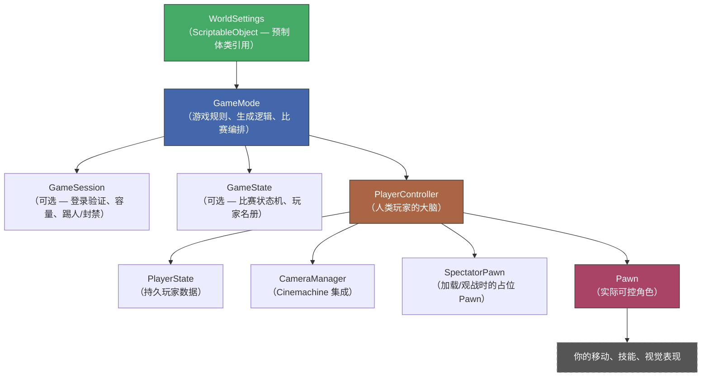
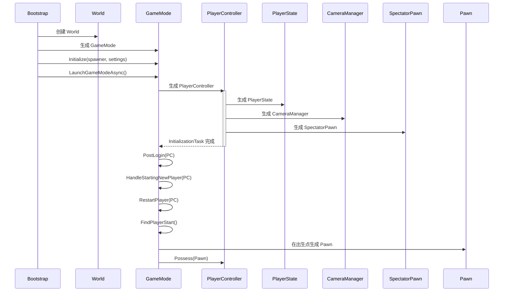
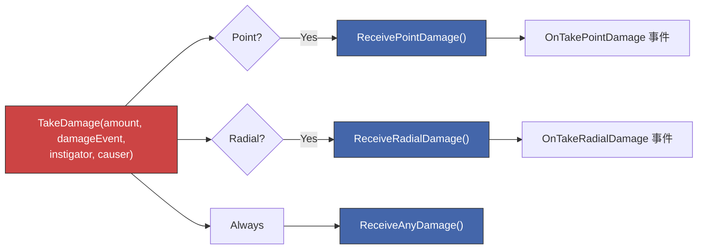

[**English**](README.md) | [**简体中文**]

# CycloneGames.GameplayFramework

一个结构化的 Unity 游戏玩法框架，灵感来源于 **虚幻引擎（Unreal Engine）的 GameFramework** 架构。它将游戏逻辑分解为清晰、可组合的层次 — **Actor**、**Pawn**、**Controller**、**GameMode**、**PlayerState** 等 — 每个类解决一个明确的架构问题，让项目保持可扩展、可测试、易于维护。

非常适合想要在 Unity 中使用虚幻引擎成熟架构模式的开发者，或从虚幻引擎过渡到 Unity 的团队。它提供了清晰的关注点分离，并遵循经过无数 AAA 级项目实战验证的行业标准设计模式。

- **Unity**: 2022.3+
- **依赖**:
  - `com.unity.burst` / `com.unity.mathematics` — Burst 优化的数学工具
  - `com.unity.cinemachine@3` — 摄像机管理
  - `com.cysharp.unitask@2` — 异步操作
  - `com.cyclone-games.factory@1` — 对象生成抽象（`IUnityObjectSpawner`）
  - `com.cyclone-games.logger@1` — 调试日志

---

## 目录

1. [设计理念](#设计理念)
2. [架构概览](#架构概览)
3. [类参考](#类参考)
   - [Actor](#actor)
   - [Pawn](#pawn)
   - [Controller](#controller)
   - [PlayerController](#playercontroller)
   - [AIController](#aicontroller)
   - [PlayerState](#playerstate)
   - [GameMode](#gamemode)
   - [GameState](#gamestate)
   - [GameSession](#gamesession)
   - [DamageType 伤害系统](#damagetype-伤害系统)
   - [World 与 WorldSettings](#world-与-worldsettings)
   - [CameraManager](#cameramanager)
   - [PlayerStart](#playerstart)
   - [SpectatorPawn](#spectatorpawn)
   - [KillZVolume](#killzvolume)
   - [SceneLogic](#scenelogic)
   - [ActorTag 标签系统](#actortag-标签系统)
4. [快速开始](#快速开始)
5. [进阶用法](#进阶用法)
6. [与其他包的集成](#与其他包的集成)
7. [最佳实践](#最佳实践)
8. [常见问题](#常见问题)

---

## 设计理念

### 问题

典型的 Unity 项目往往会演变出一个巨型 `PlayerController` 脚本，同时处理输入、移动、摄像机、计分、重生、游戏规则。随着项目增长，这会导致强耦合、角色替换困难、测试极为痛苦。

### 解决方案

借鉴虚幻引擎 GameFramework 的架构思想，本框架将游戏玩法分解为 **职责清晰的层次**：

| 层次 | 类 | 职责 |
|------|-----|------|
| **实体** | `Actor` | 所有游戏对象的基类 — 生命周期、所有权、标签、伤害 |
| **可控体** | `Pawn` | 可被附身并接收移动输入的 Actor |
| **决策** | `Controller` | 大脑 — 决定 Pawn 做什么 |
| **人类输入** | `PlayerController` | 由人类输入驱动的 Controller，带摄像机与观战支持 |
| **AI 决策** | `AIController` | 由 AI 逻辑驱动的 Controller，带注视目标与自动转向 |
| **持久数据** | `PlayerState` | 在 Pawn 死亡/重生后仍保留的玩家数据（分数、昵称、统计） |
| **游戏规则** | `GameMode` | 生成逻辑、重生规则、比赛流程编排 |
| **比赛状态** | `GameState` | 可观察的比赛状态机与玩家名册 |
| **会话** | `GameSession` | 网络无关的玩家容量、登录验证、踢人/封禁 |
| **伤害** | `DamageType` | 类型化的伤害管线，支持点/范围路由 |
| **世界** | `World` | 轻量级服务定位器，用于访问 GameMode/GameState/PlayerController |
| **配置** | `WorldSettings` | ScriptableObject，绑定所有预制体类引用 |

### 核心原则

- **DI 友好**：所有对象生成通过 `IUnityObjectSpawner` 进行 — 可无缝替换为任何 DI 容器或对象池，无需修改框架代码。
- **接口优先可扩展**：核心系统暴露接口（`IGameMode`、`IGameSession`、`IDamageType`、`IWorldSettings`），无需继承即可提供自定义实现。
- **零强制依赖**：框架对 GameplayAbilities、GameplayTags、Networking 或其他 CycloneGames 包 **没有任何** 编译时依赖。集成通过接口和不透明上下文字段完成。
- **零 GC 意识**：热路径使用预分配缓冲区、静态列表和 Burst 编译的数学运算。Actor 可见性切换、标签查询、方向计算均无逐帧分配。

---

## 架构概览

### 组件层级


```mermaid
graph TD
    WS["WorldSettings<br/>（ScriptableObject — 预制体类引用）"]
    GM["GameMode<br/>（游戏规则、生成逻辑、比赛编排）"]
    GSession["GameSession<br/>（可选 — 登录验证、容量、踢人/封禁）"]
    GState["GameState<br/>（可选 — 比赛状态机、玩家名册）"]
    PC["PlayerController<br/>（人类玩家的大脑）"]
    PS["PlayerState<br/>（持久玩家数据）"]
    CM["CameraManager<br/>（Cinemachine 集成）"]
    SP["SpectatorPawn<br/>（加载/观战时的占位 Pawn）"]
    Pawn["Pawn<br/>（实际可控角色）"]
    User["你的移动、技能、视觉表现"]

    WS --> GM
    GM --> GSession
    GM --> GState
    GM --> PC
    PC --> PS
    PC --> CM
    PC --> SP
    PC --> Pawn
    Pawn --> User

    style WS fill:#4a6,stroke:#333,color:#fff
    style GM fill:#46a,stroke:#333,color:#fff
    style PC fill:#a64,stroke:#333,color:#fff
    style Pawn fill:#a46,stroke:#333,color:#fff
    style User fill:#555,stroke:#999,color:#fff,stroke-dasharray: 5 5
```

### 生命周期序列


```mermaid
sequenceDiagram
    participant Boot as Bootstrap
    participant W as World
    participant GM as GameMode
    participant PC as PlayerController
    participant PS as PlayerState
    participant Cam as CameraManager
    participant SP as SpectatorPawn
    participant Pawn as Pawn

    Boot->>W: 创建 World
    Boot->>GM: 生成 GameMode
    Boot->>GM: Initialize(spawner, settings)
    Boot->>GM: LaunchGameModeAsync()
    GM->>PC: 生成 PlayerController
    activate PC
    PC->>PS: 生成 PlayerState
    PC->>Cam: 生成 CameraManager
    PC->>SP: 生成 SpectatorPawn
    PC-->>GM: InitializationTask 完成
    deactivate PC
    GM->>GM: PostLogin(PC)
    GM->>GM: HandleStartingNewPlayer(PC)
    GM->>GM: RestartPlayer(PC)
    GM->>GM: FindPlayerStart()
    GM->>Pawn: 在出生点生成 Pawn
    GM->>PC: Possess(Pawn)
```

### 数据生命周期

| Pawn 死亡后保留 | 随 Pawn 销毁 |
|---|---|
| `PlayerController` | `Pawn` 实例 |
| `PlayerState`（分数、昵称、统计） | 移动状态 |
| `CameraManager` | 视觉组件 |
| `SpectatorPawn` | 物理状态 |

这意味着重生非常简单：销毁旧 Pawn -> 生成新 Pawn -> `Possess()` — 所有玩家数据保持完整。

---

## 类参考

### Actor

**用途**：所有游戏对象的基类。提供生命周期钩子、所有权链、标签系统、可见性切换、伤害管线和网络扩展性。

**设计动机**：典型 Unity 项目中，游戏性 MonoBehaviour 缺乏统一的生命周期、所有权或伤害契约。Actor 建立了这个契约，使任何游戏对象 — 角色、弹体、拾取物、体积 — 共享一致的 API。

**核心功能**：

| 功能 | API | 说明 |
|------|-----|------|
| 生命周期 | `BeginPlay()` / `EndPlay()` | Start 之后 / OnDestroy 之前各调用一次 |
| 所有权 | `SetOwner(Actor)` / `GetOwner()` | 层级所有权链 |
| 发起者 | `SetInstigator(Actor)` / `GetInstigator()` | 谁导致了此 Actor 的创建 |
| 标签 | `ActorHasTag(string)` / `AddTag()` / `RemoveTag()` | 简单字符串标签系统，支持 `[ActorTag]` Inspector 选择器 |
| 可见性 | `SetActorHiddenInGame(bool)` | 零 GC 的批量渲染器切换 |
| 伤害 | `TakeDamage(float)` / `TakeDamage(float, DamageEvent, ...)` | 路由至 `ReceivePointDamage` / `ReceiveRadialDamage` / `ReceiveAnyDamage` |
| 生命期 | `SetLifeSpan(float)` | N 秒后自动销毁 |
| 边界 | `FellOutOfWorld()` / `OutsideWorldBounds()` | 重写以处理出界 |
| 网络 | `HasAuthority()` | 在网络层重写；默认 `true`（单机模式） |
| 朝向 | `GetOrientation()` | Burst 编译的四元数转欧拉角 |
| 事件 | `OnDestroyed` / `OwnerChanged` | 可观察的 Actor 生命周期事件 |
| 变换 | `GetActorLocation()` / `SetActorLocation()` / `GetActorRotation()` / ... | 对 `transform` 的便捷封装 |

**示例 — 自定义 Actor 的生命周期与伤害处理**：

```csharp
public class Projectile : Actor
{
    [SerializeField] private float speed = 20f;

    protected override void BeginPlay()
    {
        // Start 之后调用一次 — 设置自动销毁时间
        SetLifeSpan(5f);
    }

    protected override void EndPlay()
    {
        // OnDestroy 之前调用 — 清理特效、回收对象池等
    }

    void Update()
    {
        if (!IsHidden())
            transform.Translate(Vector3.forward * speed * Time.deltaTime);
    }

    public override void FellOutOfWorld()
    {
        // 触碰死亡区域 — 立即销毁
        Destroy(gameObject);
    }
}
```

### Pawn

**用途**：可被 Controller **附身** 的 Actor。即你的玩家角色、AI 敌人、载具 — 任何接收输入并在世界中行动的实体。

**设计动机**：将"身体"（Pawn）与"大脑"（Controller）分离，意味着可以在不重写控制逻辑的情况下更换角色，同一个 Pawn 类可以由人类输入或 AI 驱动。

**核心功能**：

- **附身**：`PossessedBy(Controller)` / `UnPossessed()` — 框架处理所有权和状态传递。
- **移动输入管线**：`AddMovementInput(direction, scale)` 每帧累积输入。移动组件每帧调用 `ConsumeMovementInputVector()` 驱动实际移动。
- **控制器旋转**：`FaceRotation()` 自动将 Pawn 旋转同步至 Controller 的 `ControlRotation`，支持逐轴控制（`UseControllerRotationPitch/Yaw/Roll`）。
- **初始旋转**：`NotifyInitialRotation(Quaternion)` 向所有 `IInitialRotationSettable` 组件广播 — 允许外部移动组件（如 RPGFoundation）同步初始旋转而无需框架耦合。
- **状态查询**：`IsPlayerControlled()`、`IsBotControlled()`、`IsLocallyControlled()`、`IsTurnedOff()`。
- **视角**：`GetPawnViewLocation()`、`GetViewRotation()`、`GetBaseAimRotation()` — 摄像机与瞄准集成。
- **开关**：`TurnOff()` / `TurnOn()` — 禁用 Pawn 而不销毁它。

**示例 — 带移动的角色 Pawn**：

```csharp
public class CharacterPawn : Pawn
{
    [SerializeField] private float moveSpeed = 5f;
    [SerializeField] private CharacterController characterController;

    protected override void BeginPlay()
    {
        UseControllerRotationYaw = true; // 同步 Yaw 到 Controller
    }

    public override void PossessedBy(Controller NewController)
    {
        base.PossessedBy(NewController);
        // 启用视觉效果、开始动画等
    }

    public override void UnPossessed()
    {
        base.UnPossessed();
        // 禁用输入驱动的行为
    }

    void Update()
    {
        // 消费累积的移动输入
        Vector3 input = ConsumeMovementInputVector();
        if (input.sqrMagnitude > 0.001f)
        {
            characterController.Move(input * moveSpeed * Time.deltaTime);
        }

        // 同步旋转到 Controller
        if (Controller != null)
        {
            FaceRotation(GetControlRotation(), Time.deltaTime);
        }
    }
}
```

### Controller

**用途**：附身并控制 Pawn 的抽象"大脑"。持有持久引用（PlayerState、出生点）并管理控制旋转。

**设计动机**：将决策（Controller）与执行（Pawn）分离，框架支持热切换角色、AI 接管玩家 Pawn、干净的输入抑制 — 这些在单体玩家脚本中均不可能实现。

**核心功能**：

- **Possess / UnPossess**：完整的握手流程 — 通知旧 Pawn 和新 Pawn、旧 Controller，传递所有权。`OnPossessedPawnChanged` 事件触发。
- **堆栈式输入抑制**：`SetIgnoreMoveInput(true/false)` / `SetIgnoreLookInput(true/false)` 递增/递减计数器。多个系统可独立抑制输入而互不干扰。调用 `ResetIgnoreInputFlags()` 一次性清除。
- **生成器和设置注入**：`Initialize(IUnityObjectSpawner, IWorldSettings)` — 构造注入，适配 DI。
- **出生点**：`SetStartSpot(Actor)` / `GetStartSpot()` — 追踪此 Controller 的 Pawn 生成位置。
- **游戏流程**：`GameHasEnded(Actor, bool)` / `FailedToSpawnPawn()` — 重写以响应游戏事件。

### PlayerController

**用途**：面向人类玩家的 Controller。在 Controller 基础上扩展了 **摄像机管理**、**观战 Pawn** 和 **异步初始化**。

**设计动机**：人类玩家需要摄像机设置、加载期间的观战回退、异步初始化（等待依赖就绪）。PlayerController 封装了所有这些，使游戏专用子类只需关注输入处理。

**核心功能**：

- **异步初始化**：`InitializationTask`（UniTask） 按顺序生成 PlayerState、CameraManager、SpectatorPawn。GameMode 会等待此任务完成后再继续。
- **摄像机**：`GetCameraManager()`、`SetViewTarget(Actor)`、`SetViewTargetWithBlend(Actor, float)`、`AutoManageActiveCameraTarget(Actor)`。
- **观战**：`SpawnSpectatorPawn()` / `GetSpectatorPawn()` — 加载期间用作回退 Pawn。

**示例 — 带输入的 PlayerController**：

```csharp
public class MyPlayerController : PlayerController
{
    void Update()
    {
        if (IsMoveInputIgnored()) return;

        Pawn pawn = GetPawn();
        if (pawn == null) return;

        // WASD 移动输入
        float h = Input.GetAxisRaw("Horizontal");
        float v = Input.GetAxisRaw("Vertical");
        Vector3 direction = new Vector3(h, 0, v).normalized;
        if (direction.sqrMagnitude > 0.001f)
        {
            pawn.AddMovementInput(direction, 1f);
        }

        // 鼠标视角 -> 控制旋转
        float mouseX = Input.GetAxis("Mouse X");
        Quaternion rot = ControlRotation() * Quaternion.Euler(0, mouseX * 2f, 0);
        SetControlRotation(rot);
    }
}
```

### AIController

**用途**：面向 AI 驱动 Pawn 的 Controller。提供 **注视系统** 和 **自动转向**。

**设计动机**：AI 需要注视目标并运行逻辑循环。AIController 提供注视/旋转管线，使 AI 实现（行为树、状态机、GOAP）只需调用 `SetFocus(Actor)` 或 `SetFocalPoint(Vector3)` 即可。

**核心功能**：

- **注视**：`SetFocus(Actor)` / `SetFocalPoint(Vector3)` / `ClearFocus()` / `GetFocusActor()` / `GetFocalPoint()`。
- **自动转向**：每帧 Update 中自动朝注视目标旋转。
- **AI 生命周期**：`RunAI()` / `StopAI()` / `IsRunningAI()` — 如果 `bStartAILogicOnPossess` 为 true，在附身/脱离附身时自动调用。

**示例 — 带注视的 AI 巡逻**：

```csharp
public class PatrolAIController : AIController
{
    [SerializeField] private Transform[] patrolPoints;
    private int currentIndex = 0;

    public override void RunAI()
    {
        base.RunAI();
        MoveToNextPatrolPoint();
    }

    void MoveToNextPatrolPoint()
    {
        if (patrolPoints.Length == 0) return;
        SetFocalPoint(patrolPoints[currentIndex].position);
    }

    void Update()
    {
        if (!IsRunningAI()) return;

        Pawn pawn = GetPawn();
        if (pawn == null) return;

        Vector3 target = patrolPoints[currentIndex].position;
        Vector3 dir = (target - pawn.GetActorLocation()).normalized;
        pawn.AddMovementInput(dir, 1f);

        if (Vector3.Distance(pawn.GetActorLocation(), target) < 1f)
        {
            currentIndex = (currentIndex + 1) % patrolPoints.Length;
            MoveToNextPatrolPoint();
        }
    }

    public void OnPlayerDetected(Actor player)
    {
        // 切换注视到玩家 — 自动转向会跟踪玩家
        SetFocus(player);
    }
}
```

### PlayerState

**用途**：在 Pawn 死亡和重生后 **仍然保留** 的持久玩家数据。

**设计动机**：分数、玩家昵称、队伍、背包 — 这些数据不应在角色死亡时丢失。PlayerState 挂载在 Controller 上（而非 Pawn 上），因此重生时创建新 Pawn 但所有玩家数据完好无损。

**核心功能**：

- **Pawn 追踪**：`GetPawn()` / `OnPawnSetEvent` — 当附身的 Pawn 变更时收到通知。事件签名：`(PlayerState, newPawn, oldPawn)`。
- **玩家信息**：`GetPlayerName()` / `SetPlayerName()`、`GetPlayerId()` / `SetPlayerId()`、`GetScore()` / `SetScore()`、`AddScore()`（返回新分数）。
- **标记**：`IsABot()` / `SetIsABot()`、`IsSpectator()` / `SetIsSpectator()`。
- **复制**：`CopyProperties(PlayerState)` — 用于无缝旅行或重生时的状态传递。

**示例 — 带背包的自定义 PlayerState**：

```csharp
public class RPGPlayerState : PlayerState
{
    private List<string> inventory = new List<string>();
    public int Kills { get; private set; }

    public void RecordKill()
    {
        Kills++;
        AddScore(100f);
    }

    public void AddItem(string itemId)
    {
        inventory.Add(itemId);
    }

    public override void CopyProperties(PlayerState other)
    {
        base.CopyProperties(other);
        if (other is RPGPlayerState rpg)
        {
            inventory = new List<string>(rpg.inventory);
            Kills = rpg.Kills;
        }
    }
}
```

### GameMode

**用途**：**总编排者**。处理玩家生成、重生、出生点选择和比赛流程。

**设计动机**：游戏规则（几条命、在哪重生、何时开始比赛）与玩家输入或角色移动有本质区别。GameMode 将这些决策集中在一处，只需更改 WorldSettings 中的预制体引用即可轻松切换游戏模式（死斗 vs. 夺旗 vs. 教程）。

**核心功能**：

- **启动**：`LaunchGameModeAsync(CancellationToken)` — 入口点。生成 PlayerController，等待初始化，调用 PostLogin，启动比赛，重启玩家。
- **出生点选择**：`FindPlayerStart()` -> `ChoosePlayerStart()` — 重写以实现自定义逻辑（随机、基于队伍、轮询）。
- **生成管线**：`SpawnDefaultPawnAtPlayerStart/Transform/Location()` — 生成 Pawn，通过 `TeleportPawn()` 处理 CharacterController/Rigidbody 传送。
- **登录/登出**：`PreLogin()`（通过 GameSession 验证）-> `PostLogin()`（注册 + HandleStartingNewPlayer）-> `Logout()`（注销）。
- **会话集成**：`SetGameSession(IGameSession)` — 可选。不设置会话时，所有登录检查通过（单机模式）。
- **Pawn 类选择**：重写 `GetDefaultPawnPrefabForController()` 可为不同玩家返回不同 Pawn 预制体（基于职业或队伍的选择）。

**示例 — 带生命值和自定义出生点的 GameMode**：

```csharp
public class ArenaGameMode : GameMode
{
    private Dictionary<PlayerController, int> playerLives = new();
    private const int MaxLives = 3;

    protected override void HandleStartingNewPlayer(PlayerController NewPlayer)
    {
        playerLives[NewPlayer] = MaxLives;
    }

    public override void RestartPlayer(PlayerController NewPlayer, string Portal = "")
    {
        if (playerLives.TryGetValue(NewPlayer, out int lives) && lives <= 0)
        {
            // 没有剩余生命 — 切换为观战者
            NewPlayer.GetPlayerState()?.SetIsSpectator(true);
            return;
        }
        base.RestartPlayer(NewPlayer, Portal);
    }

    // 重写以随机选择出生点
    protected override Actor ChoosePlayerStart(Controller Player)
    {
        var starts = PlayerStart.GetAllPlayerStarts();
        if (starts.Count == 0) return null;
        return starts[UnityEngine.Random.Range(0, starts.Count)];
    }

    // 重写以分配职业特定的 Pawn 预制体
    protected override Pawn GetDefaultPawnPrefabForController(Controller InController)
    {
        // 可根据玩家职业选择返回不同的 Pawn 预制体
        return base.GetDefaultPawnPrefabForController(InController);
    }

    public void OnPlayerKilled(PlayerController player)
    {
        if (playerLives.ContainsKey(player))
        {
            playerLives[player]--;
            RestartPlayer(player);
        }
    }
}
```

### GameState

**用途**：所有玩家可见的、可观察的比赛状态。追踪比赛阶段、经过时间和权威的玩家名册。

**设计动机**：在多人游戏中，所有客户端需要就比赛状态达成一致（等待中、进行中、已结束）。即使在单人游戏中，比赛阶段的状态机也能避免散落在各处的临时 bool 标志。

**核心功能**：

- **比赛状态机**：`EMatchState` 枚举（EnteringMap -> WaitingToStart -> InProgress -> WaitingPostMatch -> LeavingMap -> Aborted）。
- **状态转换**：`SetMatchState(EMatchState)` -> `OnMatchStateChanged(old, new)` — 重写以实现自定义转换逻辑。
- **玩家名册**：`AddPlayerState()` / `RemovePlayerState()` / `PlayerArray` / `GetNumPlayers()`。
- **经过时间**：`ElapsedTime` — 在 `InProgress` 状态下自动递增。

**示例 — 带胜利条件的 GameState**：

```csharp
public class ArenaGameState : GameState
{
    public int ScoreToWin { get; set; } = 10;

    protected override void OnMatchStateChanged(EMatchState OldState, EMatchState NewState)
    {
        if (NewState == EMatchState.InProgress)
        {
            // 比赛刚开始 — 通知 UI
            Debug.Log("Match started!");
        }
        else if (NewState == EMatchState.WaitingPostMatch)
        {
            Debug.Log($"Match ended after {ElapsedTime:F1}s");
        }
    }

    public void CheckWinCondition()
    {
        foreach (var ps in PlayerArray)
        {
            if (ps.GetScore() >= ScoreToWin)
            {
                SetMatchState(EMatchState.WaitingPostMatch);
                return;
            }
        }
    }
}
```

### GameSession

**用途**：网络无关的会话管理 — 玩家容量、登录验证、踢人/封禁。

**设计动机**：网络方案各异（Mirror、Netcode、Photon、自研）。GameSession 提供稳定的接口（`IGameSession`），GameMode 通过它调用，而实际网络实现则位于适配器中。不设置会话时，GameMode 以单机模式运行，无容量检查。

**核心功能**：

- **`IGameSession` 接口**：`ApproveLogin()`、`RegisterPlayer()`、`UnregisterPlayer()`、`AtCapacity()`、`KickPlayer()`、`BanPlayer()`、`HandleMatchHasStarted/Ended()`。
- **默认实现**：`GameSession`（Actor 子类） 本地单机会话，对照 `MaxPlayers`/`MaxSpectators` 计数。
- **集成方式**：在 Mirror/Netcode/Photon 适配器中实现 `IGameSession`。传递给 `GameMode.SetGameSession()`。

**示例 — 带密码的自定义会话**：

```csharp
public class PasswordGameSession : GameSession
{
    [SerializeField] private string serverPassword = "";

    public override bool ApproveLogin(string options, string address, out string errorMessage)
    {
        if (!base.ApproveLogin(options, address, out errorMessage))
            return false;

        if (!string.IsNullOrEmpty(serverPassword) && options != serverPassword)
        {
            errorMessage = "Invalid password";
            return false;
        }
        return true;
    }
}
```

### DamageType 伤害系统

**用途**：类型化、可路由的伤害管线。定义伤害种类（火焰、爆炸、环境）并携带命中上下文（位置、方向、半径）。

**设计动机**：游戏需要区分伤害类型以处理护甲、抗性、视觉效果和音效。框架提供 `IDamageType` 接口使其可独立使用，同时通过不透明的 `EffectContext` 字段携带 GameplayAbilities 上下文 — 无需对 GAS 产生任何编译时依赖。

**组件**：

- **`IDamageType`**（接口）：`CausedByWorld`、`ScaleMomentumByMass`、`DamageImpulse`、`DamageFalloff`。
- **`DamageType`**（ScriptableObject）：默认实现 — 通过 `Create -> CycloneGames -> GameplayFramework -> DamageType` 创建。
- **`EDamageEventType`**（枚举）：`Generic`、`Point`、`Radial`。
- **`DamageEvent`**（结构体）：零分配值类型，包含事件类型、伤害类型、命中位置/法线/方向（点伤害）、原点/半径（范围伤害），以及可选的 `EffectContext`（object）用于 GAS 桥接。
- **工厂方法**：`DamageEvent.MakeGenericDamage()`、`MakePointDamage(...)`、`MakeRadialDamage(...)`。

**Actor 中的伤害路由**：


```mermaid
flowchart LR
    TD["TakeDamage(amount, damageEvent,<br/>instigator, causer)"] --> Point{Point?}
    TD --> Radial{Radial?}
    TD --> Always["Always"]

    Point -->|Yes| RPD["ReceivePointDamage()"]
    RPD --> OTPD["OnTakePointDamage 事件"]

    Radial -->|Yes| RRD["ReceiveRadialDamage()"]
    RRD --> OTRD["OnTakeRadialDamage 事件"]

    Always --> RAD["ReceiveAnyDamage()"]

    style TD fill:#c44,stroke:#333,color:#fff
    style RPD fill:#46a,stroke:#333,color:#fff
    style RRD fill:#46a,stroke:#333,color:#fff
    style RAD fill:#46a,stroke:#333,color:#fff
```

**示例 — 施加和接收伤害**：

```csharp
// --- 施加伤害（如武器）---
public class Weapon : Actor
{
    [SerializeField] private DamageType fireDamageType;

    public void FireAt(Actor target, Vector3 hitLocation, Vector3 hitNormal)
    {
        var damageEvent = DamageEvent.MakePointDamage(
            hitLocation, hitNormal, GetActorForwardVector(), fireDamageType);

        target.TakeDamage(25f, damageEvent,
            GetInstigator<Controller>(), this);
    }

    public void Explode(Vector3 origin, float radius)
    {
        var damageEvent = DamageEvent.MakeRadialDamage(
            origin, innerRadius: 2f, outerRadius: radius, fireDamageType);

        // 对半径内的所有 Actor 施加伤害...
    }
}

// --- 接收伤害（在你的 Actor 子类中）---
public class EnemyActor : Actor
{
    private float health = 100f;

    protected override void ReceiveAnyDamage(float Damage, Controller EventInstigator, Actor DamageCauser)
    {
        health -= Damage;
        if (health <= 0f)
            Destroy(gameObject);
    }

    protected override void ReceivePointDamage(float Damage, DamageEvent damageEvent,
        Controller EventInstigator, Actor DamageCauser)
    {
        // 在撞击点生成命中特效
        // damageEvent.HitLocation, damageEvent.HitNormal, damageEvent.ShotDirection
    }

    protected override void ReceiveRadialDamage(float Damage, DamageEvent damageEvent,
        Controller EventInstigator, Actor DamageCauser)
    {
        // 从爆炸原点施加击退
        // damageEvent.Origin, damageEvent.InnerRadius, damageEvent.OuterRadius
    }
}
```

### World 与 WorldSettings

**`WorldSettings`**（ScriptableObject） 绑定所有类引用的配置资产：

| 字段 | 类型 | 必需 |
|------|------|------|
| `GameModeClass` | `GameMode` | 是 |
| `PlayerControllerClass` | `PlayerController` | 是 |
| `PawnClass` | `Pawn` | 是 |
| `PlayerStateClass` | `PlayerState` | 否 |
| `CameraManagerClass` | `CameraManager` | 否 |
| `SpectatorPawnClass` | `SpectatorPawn` | 否 |

通过 `Create -> CycloneGames -> GameplayFramework -> WorldSettings` 创建。编辑器验证会为每个字段显示绿色/红色/黄色状态。

**`World`** — 非 MonoBehaviour 的服务定位器。持有 GameMode、GameState 引用，提供玩家查询：

```csharp
World world = new World();
world.SetGameMode(gameMode);
world.SetGameState(gameState);
PlayerController pc = world.GetPlayerController();
Pawn pawn = world.GetPlayerPawn();
```

### CameraManager

**用途**：管理 Cinemachine 摄像机，跟踪当前视角目标。

**前提**：主摄像机需要 `CinemachineBrain`。场景中至少需要一个 `CinemachineCamera`。

**核心 API**：`InitializeFor(PlayerController)`、`SetActiveVirtualCamera()`、`SetViewTarget(Transform)`、`SetFOV(float)`。

**示例 — 切换摄像机目标**：

```csharp
// 在你的 PlayerController 子类中：
public void SwitchToSpectateTarget(Actor target)
{
    SetViewTargetWithBlend(target, 0.5f); // 0.5 秒混合
}

// 或直接访问 CameraManager：
CameraManager cam = GetCameraManager();
cam.SetViewTarget(someActor.transform);
cam.SetFOV(60f);
```

### PlayerStart

**用途**：玩家出生点。使用 **静态注册表模式** 实现零 GC 查找 — 运行时无需 `FindObjectsOfType`。

**特性**：启用/禁用时自动注册/注销。支持基于名称的匹配，用于传送门/检查点系统。编辑器中绘制 Gizmo。

**示例 — 基于传送门名称的出生点选择**：

```csharp
// 将 PlayerStart 的 GameObject 命名为："SpawnPoint_LevelA"、"SpawnPoint_LevelB"
// 然后在 GameMode 中：
protected override Actor ChoosePlayerStart(Controller Player)
{
    string portal = "SpawnPoint_LevelB";
    foreach (var start in PlayerStart.GetAllPlayerStarts())
    {
        if (start.gameObject.name == portal)
            return start;
    }
    return base.ChoosePlayerStart(Player);
}
```

### SpectatorPawn

**用途**：当玩家尚未获得实际角色时使用的最小 Pawn（加载期间、回合间隙、观战时）。

**关键字段**：`spectatorSpeed` — 观战模式下的移动速度。

### KillZVolume

**用途**：触发体积，任何进入的 Actor 都会调用 `FellOutOfWorld()`。同时支持 3D（`BoxCollider` + IsTrigger）和 2D（`BoxCollider2D` + IsTrigger）。

**使用方式**：将 `KillZVolume` 组件添加到带有触发碰撞器的 GameObject 上。放置在可游玩区域下方。

### SceneLogic

**用途**：每场景的逻辑控制器。提供生命周期钩子（`Awake`、`Start`、`Update` 等），用于场景特定的游戏脚本 — 如开场过场、关卡特定触发器、环境事件等。

### ActorTag 标签系统

**用途**：为 Actor 基于字符串的标签字段提供 Inspector 友好的标签选择。

**组件**：

- **`ActorTagAttribute`**：带可选 `Type` 参数的 PropertyAttribute。
  - `[ActorTag]` — 不指定类型：绘制为普通字符串字段（框架基类使用）。
  - `[ActorTag(typeof(MyTags))]` — 指定类型：绘制可搜索弹出选择器，数据源为指定类中的 `public const string` 字段。
- **`ActorTagPropertyDrawer`**：编辑器 Drawer，打开带 `SearchField` + 可滚动 `TreeView` 的 `PopupWindow`。支持搜索过滤、(None) 选项、清除按钮和无效值高亮。

**示例**：

```csharp
// 1. 定义标签常量
public static class ActorTags
{
    public const string Player = "Player";
    public const string Enemy = "Enemy";
    public const string NPC = "NPC";
    public const string Interactable = "Interactable";
    public const string Destructible = "Destructible";
}

// 2. 在你的 Actor 子类中使用 — Inspector 显示可搜索下拉菜单
public class MyPawn : Pawn
{
    [SerializeField, ActorTag(typeof(ActorTags))]
    private List<string> tags;
}

// 3. 运行时查询标签
if (someActor.ActorHasTag("Enemy"))
{
    // 对敌人做出反应
}
```

---

## 快速开始

### 前提条件

- Unity 2022.3+
- 已安装包：`CycloneGames.GameplayFramework`、`Cinemachine`、`UniTask`、`CycloneGames.Factory`、`CycloneGames.Logger`

### 最小配置（5 步）

**步骤 1 — 创建预制体**

创建空 GameObject，添加对应组件，保存为预制体：

| 预制体 | 组件 | 说明 |
|--------|------|------|
| `GM_MyGame` | `GameMode`（或你的子类） | 必需 |
| `PC_MyGame` | `PlayerController`（或你的子类） | 必需 |
| `Pawn_MyGame` | `Pawn`（或你的子类） | 必需 — 在此添加角色模型/控制器 |
| `PS_MyGame` | `PlayerState`（或你的子类） | 必需 |
| `CM_MyGame` | `CameraManager` | 可选 — 使用 Cinemachine 时需要 |
| `SP_MyGame` | `SpectatorPawn` | 可选 |

**步骤 2 — 创建 WorldSettings**

`Create -> CycloneGames -> GameplayFramework -> WorldSettings`。分配所有预制体。

**步骤 3 — 创建引导程序**

```csharp
using Cysharp.Threading.Tasks;
using UnityEngine;
using CycloneGames.GameplayFramework.Runtime;
using CycloneGames.Factory.Runtime;

public class GameBootstrap : MonoBehaviour
{
    [SerializeField] private WorldSettings worldSettings;

    async void Start()
    {
        IUnityObjectSpawner spawner = new SimpleObjectSpawner();

        var gameMode = spawner.Create(worldSettings.GameModeClass) as GameMode;
        gameMode.Initialize(spawner, worldSettings);

        var world = new World();
        world.SetGameMode(gameMode);

        await gameMode.LaunchGameModeAsync(destroyCancellationToken);
    }
}

public class SimpleObjectSpawner : IUnityObjectSpawner
{
    public T Create<T>(T origin) where T : Object
    {
        return origin != null ? Object.Instantiate(origin) : null;
    }
}
```

**步骤 4 — 设置场景**

1. 在空 GameObject 上添加 `PlayerStart` 组件并定位。
2. 确保主摄像机有 `CinemachineBrain`，场景中有至少一个 `CinemachineCamera`。
3. 在 GameObject 上添加 `GameBootstrap` 组件并分配你的 `WorldSettings`。

**步骤 5 — 按下 Play**

框架将自动：生成 PlayerController -> 初始化 PlayerState / CameraManager / SpectatorPawn -> 查找 PlayerStart -> 生成 Pawn -> 附身。

---

## 进阶用法

### 重生系统

```csharp
// 在你的 GameMode 子类中：
public void OnPlayerDied(PlayerController player)
{
    // 取消附身死亡的 Pawn
    Pawn deadPawn = player.GetPawn();
    player.UnPossess();

    // 延迟重生（可选）
    RespawnAfterDelay(player, 3f).Forget();
}

private async UniTaskVoid RespawnAfterDelay(PlayerController player, float delay)
{
    await UniTask.Delay(TimeSpan.FromSeconds(delay));
    RestartPlayer(player);
}
```

### 角色切换

```csharp
// 游戏中切换 Pawn（例如进入载具）
public class VehicleActor : Actor
{
    [SerializeField] private Pawn vehiclePawn;

    public void EnterVehicle(PlayerController driver)
    {
        Pawn oldPawn = driver.GetPawn();
        driver.UnPossess();
        driver.Possess(vehiclePawn);
        oldPawn.SetActorHiddenInGame(true);
    }

    public void ExitVehicle(PlayerController driver, Pawn originalPawn)
    {
        driver.UnPossess();
        originalPawn.SetActorHiddenInGame(false);
        originalPawn.SetActorLocation(transform.position + Vector3.right * 2f);
        driver.Possess(originalPawn);
    }
}
```

### 输入抑制

```csharp
// 多个系统可独立抑制输入
playerController.SetIgnoreMoveInput(true);  // UI 打开 — 抑制
playerController.SetIgnoreMoveInput(true);  // 过场动画 — 抑制（计数器 = 2）
playerController.SetIgnoreMoveInput(false); // UI 关闭（计数器 = 1，仍被抑制）
playerController.SetIgnoreMoveInput(false); // 过场结束（计数器 = 0，输入恢复）

// 或一次性重置所有
playerController.ResetIgnoreInputFlags();
```

### 伤害事件订阅

```csharp
// 从 Actor 外部订阅伤害事件
Actor target = someEnemy;
target.OnTakePointDamage += (damage, damageEvent, instigator, causer) =>
{
    // 显示命中标记 UI
    ShowHitMarker(damageEvent.HitLocation);
};
target.OnTakeRadialDamage += (damage, damageEvent, instigator, causer) =>
{
    // 显示爆炸指示器
    ShowExplosionIndicator(damageEvent.Origin);
};
```

---

## 与其他包的集成

框架设计为与其他 CycloneGames 包 **并行工作**，无编译时依赖：

| 包 | 集成方式 |
|----|------|
| **GameplayAbilities (GAS)** | 将 `DamageEvent.EffectContext` 设为你的 `GameplayEffectSpec` 或 `IGameplayEffectContext`。下游处理器转型回来。 |
| **GameplayTags** | Actor 的 `tags`（简单字符串）与 `GameplayTagContainer`（层级计数标签）服务于不同目的，可在同一 GameObject 上共存。 |
| **RPGFoundation** | Pawn 调用 `NotifyInitialRotation()`，向 `IInitialRotationSettable` 组件广播 — RPGFoundation 的移动组件可实现此接口。 |
| **InputSystem** | PlayerController 子类从 `CycloneGames.InputSystem` 读取输入，调用 `Pawn.AddMovementInput()`。 |
| **Networking（Mirror 等）** | 在网络适配器中实现 `IGameSession`。传递给 `GameMode.SetGameSession()`。在联网 Actor 子类中重写 `Actor.HasAuthority()`。 |
| **AIPerception** | 高性能 AI 感知系统（视觉、听觉），Jobs/Burst 优化 — 与 `AIController` 配合实现基于检测的 AI。 |
| **BehaviorTree** | 可视化行为树编辑器与运行时 — 用可组合节点驱动 `AIController.RunAI()` 逻辑。 |
| **AssetManagement** | 接口优先、DI 友好的资源管理（封装 YooAsset） — 用于异步加载 Pawn/关卡。 |
| **Audio** | 增强型音频管理，支持异步加载 — 从 Actor 伤害事件或 GameState 转换触发音效。 |
| **Services** | 图形设置、摄像机服务和设备设置管理。 |
| **DeviceFeedback** | 多平台触觉/振动/灯条反馈 — 从伤害事件或技能激活触发。 |
| **Cheat** | 轻量级作弊指令系统 — 开发期间测试 GameMode 规则、生成等非常有用。 |
| **UIFramework** | 简单 UI 框架 — 构建从 PlayerState、GameState 和比赛事件读取数据的 HUD/菜单。 |
| **Factory** | 对象生成/对象池抽象 — 框架的 `IUnityObjectSpawner` 定义于此（必需依赖）。 |
| **Logger** | 线程安全日志，支持分类过滤 — 框架的 `CLogger` 调用通过此系统（必需依赖）。 |

---

## 最佳实践

1. **保持 Pawn 职责专一** — 移动、视觉表现、技能。不处理游戏规则，不处理计分。
2. **使用 PlayerState 存储持久数据** — 分数、背包、统计数据存放在 PlayerState 而非 Pawn。它们在重生后保留。
3. **每种游戏类型一个 GameMode** — 死斗、夺旗、教程 — 各是一个 GameMode 子类。通过更改 WorldSettings 预制体引用即可切换。
4. **重写而非修改** — 继承 `GameMode`、`PlayerController`、`Pawn` 等。框架基类处理底层管线。
5. **用接口做测试** — `IGameMode`、`IGameSession`、`IWorldSettings`、`IUnityObjectSpawner` 均可 Mock，方便单元测试。
6. **让 GameMode 编排一切** — 生成、重生、比赛流程都属于 GameMode。不要分散到 Pawn 或 Controller 中。
7. **优先使用 TakeDamage 而非直接操作血量** — 所有伤害通过 Actor 伤害管线路由，确保事件触发和类型路由的一致性。

---

## 常见问题

**问：不使用 Cinemachine 可以吗？**
可以。不要在 WorldSettings 中分配 `CameraManagerClass`。框架在没有它的情况下正常工作 — 实现你自己的摄像机系统即可。

**问：重生如何工作？**
调用 `GameMode.RestartPlayer(playerController)`。它会查找 PlayerStart、生成新 Pawn 并附身。PlayerState 不受影响。

**问：可以有多个玩家吗？**
框架开箱即提供单人流程。本地多人游戏需要继承 GameMode，生成多个 PlayerController 并用玩家索引管理它们。

**问：如何与我的 DI 容器集成？**
使用你的容器的实例化方法实现 `IUnityObjectSpawner`。传递给 `GameMode.Initialize()`。

**问：Actor.tags 与 GameplayTags 冲突吗？**
不冲突。Actor.tags 是简单的 `List<string>`，用于轻量标记。GameplayTags 是层级化的计数标签系统，用于技能/效果查询。它们服务于不同目的，可共存。

**问：这个框架的灵感来源是什么？**
架构灵感来源于虚幻引擎的 GameFramework。Actor、Pawn、Controller、GameMode、PlayerState 等概念直接对应虚幻引擎中的同名组件。但实现完全基于 Unity 原生构建 — 利用 MonoBehaviour、Cinemachine、UniTask 和 Unity 特有的模式。