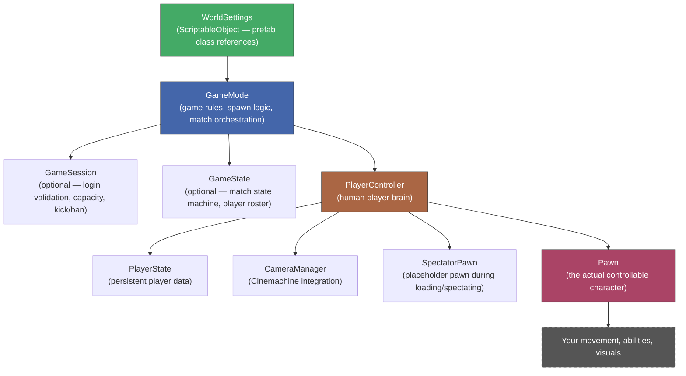
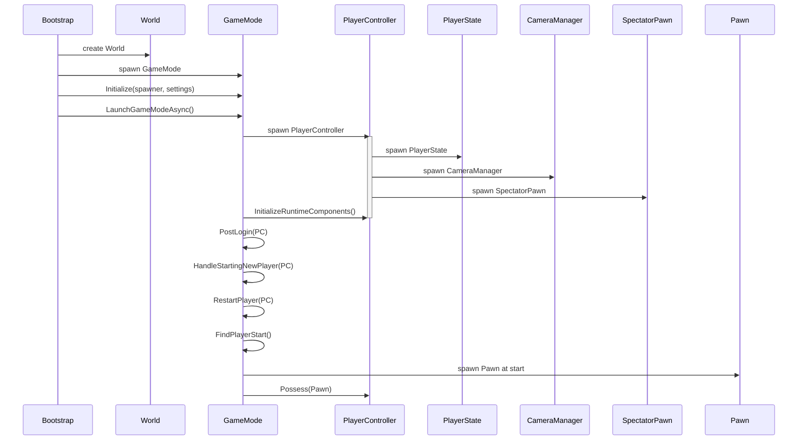
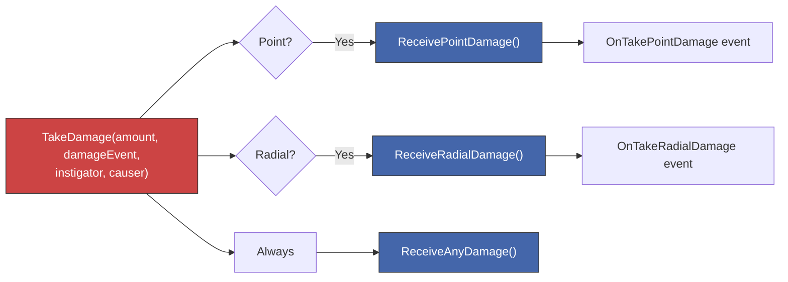

[**English**] | [**简体中文**](README.SCH.md)

# CycloneGames.GameplayFramework

CycloneGames.GameplayFramework is a gameplay foundation for Unity derived from **Unreal Engine's GameFramework** concepts and adapted to Unity's runtime model. It organizes gameplay code into explicit layers such as **Actor**, **Pawn**, **Controller**, **PlayerController**, **GameMode**, and **PlayerState**, so that ownership, lifecycle, spawning, possession, and camera behavior follow a consistent contract.

The package is intended for projects that need a reusable gameplay architecture rather than isolated MonoBehaviour scripts. It is particularly suitable for projects that expect multiple game modes, multiple pawn types, AI controllers, respawn flows, or persistent player state across character replacement.

- **Unity**: 2022.3+
- **Dependencies**:
  - `com.unity.burst` / `com.unity.mathematics` — Burst-optimized math utilities
  - `com.unity.cinemachine@3` — Camera management
  - `com.cysharp.unitask@2` — Async operations
  - `com.cyclone-games.factory@1` — Object spawning abstraction (`IUnityObjectSpawner`)
  - `com.cyclone-games.logger@1` — Debug logging

---

## Table of Contents

- [CycloneGames.GameplayFramework](#cyclonegamesgameplayframework)
  - [Table of Contents](#table-of-contents)
  - [Design Philosophy](#design-philosophy)
    - [The Problem](#the-problem)
    - [The Solution](#the-solution)
    - [Key Principles](#key-principles)
    - [What This Package Standardizes](#what-this-package-standardizes)
  - [Architecture Overview](#architecture-overview)
    - [Component Hierarchy](#component-hierarchy)
    - [Lifecycle Sequence](#lifecycle-sequence)
    - [Data Lifetime](#data-lifetime)
    - [Recommended Extension Workflow](#recommended-extension-workflow)
  - [Class Reference](#class-reference)
    - [Actor](#actor)
    - [Pawn](#pawn)
    - [Controller](#controller)
    - [PlayerController](#playercontroller)
    - [AIController](#aicontroller)
    - [PlayerState](#playerstate)
    - [GameMode](#gamemode)
    - [GameState](#gamestate)
    - [GameSession](#gamesession)
    - [DamageType System](#damagetype-system)
    - [World \& WorldSettings](#world--worldsettings)
    - [CameraManager](#cameramanager)
    - [PlayerStart](#playerstart)
    - [SpectatorPawn](#spectatorpawn)
    - [KillZVolume](#killzvolume)
    - [SceneLogic](#scenelogic)
    - [ActorTag System](#actortag-system)
    - [Config Assets](#config-assets)
    - [Scene Transition](#scene-transition)
    - [Serialization](#serialization)
    - [Camera Modes](#camera-modes)
    - [Camera Action Presets (ScriptableObject)](#camera-action-presets-scriptableobject)
    - [CameraProfile](#cameraprofile)
    - [Animation-Agnostic Trigger Binding](#animation-agnostic-trigger-binding)
      - [Step 1 — Author a CameraActionPreset](#step-1--author-a-cameraactionpreset)
      - [Step 2 — Create a CameraActionMap (optional but recommended)](#step-2--create-a-cameraactionmap-optional-but-recommended)
      - [Step 3 — Add CameraActionBinding to your character](#step-3--add-cameraactionbinding-to-your-character)
      - [Step 4 — Connect your animation system](#step-4--connect-your-animation-system)
    - [Optional Animancer Integration](#optional-animancer-integration)
    - [Camera Blend Curves](#camera-blend-curves)
  - [Quick Start](#quick-start)
    - [Prerequisites](#prerequisites)
    - [Minimal Setup](#minimal-setup)
      - [1. Create the required prefabs](#1-create-the-required-prefabs)
      - [2. Create and configure WorldSettings](#2-create-and-configure-worldsettings)
      - [3. Create a bootstrap entry point](#3-create-a-bootstrap-entry-point)
      - [4. Configure the scene](#4-configure-the-scene)
      - [5. Validate the startup flow](#5-validate-the-startup-flow)
  - [Advanced Usage](#advanced-usage)
    - [Respawn System](#respawn-system)
    - [Character Swapping](#character-swapping)
    - [Input Suppression](#input-suppression)
    - [Damage with Event Subscription](#damage-with-event-subscription)
    - [Example — Navigathena bootstrap](#example--navigathena-bootstrap)
  - [Best Practices](#best-practices)

---

## Design Philosophy

### The Problem

In many Unity projects, gameplay responsibilities gradually accumulate inside a small number of scripts, usually around player control, scene state, and spawning. Input, movement, camera control, scoring, respawn, and rule processing often become coupled to the same behaviour. That coupling increases the cost of iteration, makes possession and pawn replacement harder, and weakens testability.

### The Solution

CycloneGames.GameplayFramework addresses this by defining a stable gameplay kernel with explicit responsibilities for each role:

| Layer               | Class              | Responsibility                                                          |
| ------------------- | ------------------ | ----------------------------------------------------------------------- |
| **Entity**          | `Actor`            | Base for all gameplay objects — lifecycle, ownership, tags, damage      |
| **Controllable**    | `Pawn`             | An Actor that can be possessed and receive movement input               |
| **Decision**        | `Controller`       | Control object that owns possession, control rotation, and command flow |
| **Human Input**     | `PlayerController` | A Controller driven by human input, with camera and spectator support   |
| **AI Decision**     | `AIController`     | A Controller driven by AI logic, with focus and auto-rotation           |
| **Persistent Data** | `PlayerState`      | Player data that survives Pawn death/respawn (score, name, stats)       |
| **Game Rules**      | `GameMode`         | Spawn logic, respawn rules, match flow orchestration                    |
| **Match State**     | `GameState`        | Observable match state machine and player roster                        |
| **Session**         | `GameSession`      | Network-agnostic player capacity, login validation, kick/ban            |
| **Damage**          | `DamageType`       | Typed damage pipeline with point/radial routing                         |
| **World**           | `World`            | Lightweight service locator for GameMode/GameState/PlayerController     |
| **Configuration**   | `WorldSettings`    | ScriptableObject that binds all prefab class references                 |

### Key Principles

- **DI-friendly**: All spawning goes through `IUnityObjectSpawner` — swap in any DI container or object pool without touching framework code.
- **Stable gameplay kernel**: Core gameplay semantics live on `Actor`, `Pawn`, `Controller`, `PlayerController`, `GameMode`, and `PlayerState`. These base classes define the default usage habits and naming style.
- **Layered extensibility**: Use inheritance for gameplay roles, strategy objects for optional rules such as camera policies and camera modes, and interfaces for infrastructure adapters.
- **No forced dependencies**: The framework has **zero** compile-time dependency on GameplayAbilities, GameplayTags, Networking, or any other CycloneGames package. Integration is handled through interfaces and opaque context fields.

### What This Package Standardizes

- **Possession flow**: `GameMode` spawns or restarts a Pawn, `Controller` possesses it, and `PlayerState` remains attached to the player lifecycle rather than the Pawn lifecycle.
- **Player identity vs character identity**: `PlayerController` and `PlayerState` persist across respawn, while `Pawn` is treated as the replaceable runtime body.
- **Camera ownership**: `PlayerController` owns the current view target, `Actor` and `Pawn` expose camera semantics, and `CameraManager` resolves the final camera pose.
- **Game-rule ownership**: `GameMode` remains the authoritative entry point for login, player start selection, spawning, respawn, and match progression.

---

## Architecture Overview

### Component Hierarchy


```mermaid
graph TD
    WS["WorldSettings<br/>(ScriptableObject — prefab class references)"]
    GM["GameMode<br/>(game rules, spawn logic, match orchestration)"]
    GSession["GameSession<br/>(optional — login validation, capacity, kick/ban)"]
    GState["GameState<br/>(optional — match state machine, player roster)"]
    PC["PlayerController<br/>(human player brain)"]
    PS["PlayerState<br/>(persistent player data)"]
    CM["CameraManager<br/>(Cinemachine integration)"]
    SP["SpectatorPawn<br/>(placeholder pawn during loading/spectating)"]
    Pawn["Pawn<br/>(the actual controllable character)"]
    User["Your movement, abilities, visuals"]

    WS --> GM
    GM --> GSession
    GM --> GState
    GM --> PC
    PC --> PS
    PC --> CM
    PC --> SP
    PC --> Pawn
    Pawn --> User

    style WS fill:#4a6,stroke:#333,color:#fff
    style GM fill:#46a,stroke:#333,color:#fff
    style PC fill:#a64,stroke:#333,color:#fff
    style Pawn fill:#a46,stroke:#333,color:#fff
    style User fill:#555,stroke:#999,color:#fff,stroke-dasharray: 5 5
```

### Lifecycle Sequence


```mermaid
sequenceDiagram
    participant Boot as Bootstrap
    participant W as World
    participant GM as GameMode
    participant PC as PlayerController
    participant PS as PlayerState
    participant Cam as CameraManager
    participant SP as SpectatorPawn
    participant Pawn as Pawn

    Boot->>W: create World
    Boot->>GM: spawn GameMode
    Boot->>GM: Initialize(spawner, settings)
    Boot->>GM: LaunchGameModeAsync()
    GM->>PC: spawn PlayerController
    activate PC
    PC->>PS: spawn PlayerState
    PC->>Cam: spawn CameraManager
    PC->>SP: spawn SpectatorPawn
    GM->>PC: InitializeRuntimeComponents()
    deactivate PC
    GM->>GM: PostLogin(PC)
    GM->>GM: HandleStartingNewPlayer(PC)
    GM->>GM: RestartPlayer(PC)
    GM->>GM: FindPlayerStart()
    GM->>Pawn: spawn Pawn at start
    GM->>PC: Possess(Pawn)
```

### Data Lifetime

| Survives Pawn Death                | Destroyed with Pawn |
| ---------------------------------- | ------------------- |
| `PlayerController`                 | `Pawn` instance     |
| `PlayerState` (score, name, stats) | Movement state      |
| `CameraManager`                    | Visual components   |
| `SpectatorPawn`                    | Physics state       |

This separation means respawning is simply: destroy old Pawn -> spawn new Pawn -> `Possess()` — all player data remains intact.

### Recommended Extension Workflow

When adding a new gameplay feature, classify it first:

1. If it changes what an in-world object is or how it behaves when possessed, extend `Actor` or `Pawn`.
2. If it changes who owns input, aiming, or camera target selection, extend `Controller` or `PlayerController`.
3. If it changes spawn rules, match flow, or player admission, extend `GameMode` or `GameSession`.
4. If it changes only an optional rule, keep it in an outer layer such as `CameraMode`, `IViewTargetPolicy`, or a feature package.

---

## Class Reference

### Actor

**Purpose**: Base class for every gameplay object. Provides lifecycle hooks, ownership chain, tag system, visibility toggling, damage pipeline, and network extensibility.

**Design rationale**: In a typical Unity project, gameplay MonoBehaviours lack a shared contract for lifecycle, ownership, or damage. Actor establishes this contract so that any gameplay object — characters, projectiles, pickups, volumes — shares a consistent API.

**Key features**:

| Feature     | API                                                                      | Notes                                                                       |
| ----------- | ------------------------------------------------------------------------ | --------------------------------------------------------------------------- |
| Lifecycle   | `BeginPlay()` / `EndPlay()`                                              | Called once after Start / before OnDestroy                                  |
| Ownership   | `SetOwner(Actor)` / `GetOwner()`                                         | Hierarchical ownership chain                                                |
| Instigator  | `SetInstigator(Actor)` / `GetInstigator()`                               | Who caused this Actor to be created                                         |
| Tags        | `ActorHasTag(string)` / `AddTag()` / `RemoveTag()`                       | Simple string-based tag system with `[ActorTag]` Inspector support          |
| Visibility  | `SetActorHiddenInGame(bool)`                                             | Batch renderer toggle                                                       |
| Damage      | `TakeDamage(float)` / `TakeDamage(float, DamageEvent, ...)`              | Routes to `ReceivePointDamage` / `ReceiveRadialDamage` / `ReceiveAnyDamage` |
| Lifespan    | `SetLifeSpan(float)`                                                     | Auto-destroy after N seconds                                                |
| Bounds      | `FellOutOfWorld()` / `OutsideWorldBounds()`                              | Override to handle out-of-bounds                                            |
| Network     | `HasAuthority()`                                                         | Override in network layer; defaults to `true` (standalone)                  |
| Orientation | `GetOrientation()`                                                       | Burst-compiled quaternion-to-Euler conversion                               |
| Events      | `OnDestroyed` / `OwnerChanged`                                           | Observable Actor lifecycle events                                           |
| Transform   | `GetActorLocation()` / `SetActorLocation()` / `GetActorRotation()` / ... | Convenience wrappers over `transform`                                       |

**Example — Custom Actor with lifecycle and damage handling**:

```csharp
public class Projectile : Actor
{
    [SerializeField] private float speed = 20f;

    protected override void BeginPlay()
    {
        // Called once after Start — set up lifespan for auto-cleanup
        SetLifeSpan(5f);
    }

    protected override void EndPlay()
    {
        // Called before OnDestroy — clean up effects, return to pool, etc.
    }

    void Update()
    {
        if (!IsHidden())
            transform.Translate(Vector3.forward * speed * Time.deltaTime);
    }

    public override void FellOutOfWorld()
    {
        // Hit kill zone — destroy immediately
        Destroy(gameObject);
    }
}
```

### Pawn

**Purpose**: An Actor that can be **possessed** by a Controller. This is your player character, AI enemy, vehicle — anything that receives input and acts in the world.

**Design rationale**: Separating the "body" (Pawn) from the "brain" (Controller) means you can swap characters without rewriting control logic, and the same Pawn class can be driven by either human input or AI.

**Key features**:

- **Possession**: `PossessedBy(Controller)` / `UnPossessed()` — framework handles owner/state transfer.
- **Movement input pipeline**: `AddMovementInput(direction, scale)` accumulates input per frame. Movement components call `ConsumeMovementInputVector()` each tick to drive actual movement.
- **Controller rotation**: `FaceRotation()` automatically syncs Pawn rotation to Controller's `ControlRotation`, respecting per-axis flags (`UseControllerRotationPitch/Yaw/Roll`).
- **Initial rotation**: `NotifyInitialRotation(Quaternion)` broadcasts to all `IInitialRotationSettable` components on spawn — allowing external movement components (e.g., from RPGFoundation) to synchronize without framework coupling.
- **State queries**: `IsPlayerControlled()`, `IsBotControlled()`, `IsLocallyControlled()`, `IsTurnedOff()`.
- **View**: `GetPawnViewLocation()`, `GetViewRotation()`, `GetBaseAimRotation()` — camera and aiming integration.
- **Turn on/off**: `TurnOff()` / `TurnOn()` — disable pawn without destroying it.

**Example — Character Pawn with movement**:

```csharp
public class CharacterPawn : Pawn
{
    [SerializeField] private float moveSpeed = 5f;
    [SerializeField] private CharacterController characterController;

    protected override void BeginPlay()
    {
        UseControllerRotationYaw = true; // Sync yaw to controller
    }

    public override void PossessedBy(Controller NewController)
    {
        base.PossessedBy(NewController);
        // Enable visuals, start animations, etc.
    }

    public override void UnPossessed()
    {
        base.UnPossessed();
        // Disable input-driven behavior
    }

    void Update()
    {
        // Consume accumulated movement input
        Vector3 input = ConsumeMovementInputVector();
        if (input.sqrMagnitude > 0.001f)
        {
            characterController.Move(input * moveSpeed * Time.deltaTime);
        }

        // Sync rotation to controller
        if (Controller != null)
        {
            FaceRotation(GetControlRotation(), Time.deltaTime);
        }
    }
}
```

### Controller

**Purpose**: Abstract control object that possesses and controls a Pawn. Holds persistent references such as `PlayerState` and start spot, and manages control rotation independently from Pawn lifetime.

**Design rationale**: Separating control from embodiment keeps possession explicit. A Pawn can be replaced without recreating controller-side state, and the same Pawn class can be driven by human input, AI logic, replay logic, or scripted control.

**Key features**:

- **Possess / UnPossess**: Full handshake — notifies old and new Pawn, old Controller, transfers ownership. `OnPossessedPawnChanged` event fires.
- **Stacked input suppression**: `SetIgnoreMoveInput(true/false)` / `SetIgnoreLookInput(true/false)` increments/decrements a counter. Multiple systems can independently suppress input without stomping each other. Call `ResetIgnoreInputFlags()` to clear all.
- **Spawner and settings injection**: `Initialize(IUnityObjectSpawner, IWorldSettings)` — constructor injection for DI compatibility.
- **Start spot**: `SetStartSpot(Actor)` / `GetStartSpot()` — tracks where this controller's pawn was spawned.
- **Game flow**: `GameHasEnded(Actor, bool)` / `FailedToSpawnPawn()` — override to react to game events.

### PlayerController

**Purpose**: A Controller for human players. Extends Controller with **view-target ownership**, **camera extension state**, and **spectator pawn**.

**Design rationale**: `PlayerController` is the persistent runtime owner of human input, player-local camera state, and spectator fallback. The framework keeps the camera contract centered on `GetViewTarget`, `SetViewTarget`, and `AutoManageActiveCameraTarget`, while `CameraContext`, `IViewTargetPolicy`, and `CameraMode` remain optional extension points.

**Key features**:

- **Runtime component initialization**: `InitializeRuntimeComponents()` creates and wires `PlayerState`, `CameraManager`, `CameraContext`, and `SpectatorPawn` after controller dependencies have been injected. `InitializationTask` remains as a compatibility surface for older call sites.
- **View-target management**: `SetViewTarget(Actor)`, `ClearViewTargetOverride()`, `SetViewTargetPolicy(IViewTargetPolicy)`, and `AutoManageActiveCameraTarget(Actor)` coordinate manual overrides and automatic selection.
- **Camera-style management**: `SetBaseCameraMode(CameraMode)`, `PushCameraMode(CameraMode)`, `RemoveCameraMode(CameraMode)`, and `GetCameraContext()` expose a layered way to apply framing styles without replacing the ownership model.
- **Spectator fallback**: `SpawnSpectatorPawn()` and `GetSpectatorPawn()` provide a stable fallback when the player temporarily has no active gameplay Pawn.

**Recommended usage**:

1. Keep human-input collection in `PlayerController` or an input-facing subclass.
2. Keep movement, locomotion response, and animation-driving logic in the Pawn.
3. Treat `SetViewTarget` as the authoritative API for view-target override.
4. Use `CameraMode` to change framing style, not gameplay ownership.

**Example — PlayerController with input**:

```csharp
public class MyPlayerController : PlayerController
{
    void Update()
    {
        if (IsMoveInputIgnored()) return;

        Pawn pawn = GetPawn();
        if (pawn == null) return;

        // WASD movement input
        float h = Input.GetAxisRaw("Horizontal");
        float v = Input.GetAxisRaw("Vertical");
        Vector3 direction = new Vector3(h, 0, v).normalized;
        if (direction.sqrMagnitude > 0.001f)
        {
            pawn.AddMovementInput(direction, 1f);
        }

        // Mouse look -> control rotation
        float mouseX = Input.GetAxis("Mouse X");
        Quaternion rot = ControlRotation() * Quaternion.Euler(0, mouseX * 2f, 0);
        SetControlRotation(rot);
    }
}
```

### AIController

**Purpose**: A Controller for AI-driven pawns. Provides **focus system** and **auto-rotation** toward targets.

**Design rationale**: AI needs to look at targets and run logic loops. AIController provides the focus/rotation plumbing so AI implementations (behavior trees, state machines, GOAP) only need to call `SetFocus(Actor)` or `SetFocalPoint(Vector3)`.

**Key features**:

- **Focus**: `SetFocus(Actor)` / `SetFocalPoint(Vector3)` / `ClearFocus()` / `GetFocusActor()` / `GetFocalPoint()`.
- **Auto-rotation**: Automatically rotates toward focus target each Update.
- **AI lifecycle**: `RunAI()` / `StopAI()` / `IsRunningAI()` — called automatically on possess/unpossess if `bStartAILogicOnPossess` is true.

**Example — AI patrol with focus**:

```csharp
public class PatrolAIController : AIController
{
    [SerializeField] private Transform[] patrolPoints;
    private int currentIndex = 0;

    public override void RunAI()
    {
        base.RunAI();
        MoveToNextPatrolPoint();
    }

    void MoveToNextPatrolPoint()
    {
        if (patrolPoints.Length == 0) return;
        SetFocalPoint(patrolPoints[currentIndex].position);
    }

    void Update()
    {
        if (!IsRunningAI()) return;

        Pawn pawn = GetPawn();
        if (pawn == null) return;

        Vector3 target = patrolPoints[currentIndex].position;
        Vector3 dir = (target - pawn.GetActorLocation()).normalized;
        pawn.AddMovementInput(dir, 1f);

        if (Vector3.Distance(pawn.GetActorLocation(), target) < 1f)
        {
            currentIndex = (currentIndex + 1) % patrolPoints.Length;
            MoveToNextPatrolPoint();
        }
    }

    public void OnPlayerDetected(Actor player)
    {
        // Switch focus to the player — auto-rotation will track them
        SetFocus(player);
    }
}
```

### PlayerState

**Purpose**: Persistent player data that **survives Pawn death and respawn**.

**Design rationale**: Score, player name, team, inventory — these must not be destroyed when a character dies. PlayerState lives on the Controller (not the Pawn), so respawning creates a new Pawn but keeps all player data.

**Key features**:

- **Pawn tracking**: `GetPawn()` / `OnPawnSetEvent` — notified when the possessed Pawn changes. Event signature: `(PlayerState, newPawn, oldPawn)`.
- **Player info**: `GetPlayerName()` / `SetPlayerName()`, `GetPlayerId()` / `SetPlayerId()`, `GetScore()` / `SetScore()`, `AddScore()` (returns new score).
- **Flags**: `IsABot()` / `SetIsABot()`, `IsSpectator()` / `SetIsSpectator()`.
- **Serialization seam**: `Serialize(IDataWriter)` / `Deserialize(IDataReader)` provide a framework-level persistence contract for save systems, replay systems, or networking adapters.
- **Copy**: `CopyProperties(PlayerState)` — for seamless travel or respawn state transfer.

**Example — Custom PlayerState with inventory**:

```csharp
public class RPGPlayerState : PlayerState
{
    private List<string> inventory = new List<string>();
    public int Kills { get; private set; }

    public void RecordKill()
    {
        Kills++;
        AddScore(100f);
    }

    public void AddItem(string itemId)
    {
        inventory.Add(itemId);
    }

    public override void CopyProperties(PlayerState other)
    {
        base.CopyProperties(other);
        if (other is RPGPlayerState rpg)
        {
            inventory = new List<string>(rpg.inventory);
            Kills = rpg.Kills;
        }
    }
}
```

### GameMode

**Purpose**: **The orchestrator**. Handles player spawning, respawning, start point selection, and match flow.

**Design rationale**: Game rules (how many lives, where to spawn, when the match starts) are fundamentally different from player input or character movement. GameMode centralizes these decisions in one place, making it trivial to swap game modes (Deathmatch vs. CTF vs. Tutorial) by changing a single prefab reference.

**Key features**:

- **Launch**: `LaunchGameModeAsync(CancellationToken)` — the entry point. Spawns PlayerController, waits for init, calls PostLogin, starts match, restarts player.
- **Player start selection**: `FindPlayerStart()` -> `ChoosePlayerStart()` — override for custom logic (random, team-based, round-robin).
- **Spawn pipeline**: `SpawnDefaultPawnAtPlayerStart/Transform/Location()` — spawns Pawn, handles CharacterController/Rigidbody teleport via `TeleportPawn()`.
- **Login/Logout**: `PreLogin()` (validate with GameSession) -> `PostLogin()` (register + HandleStartingNewPlayer) -> `Logout()` (unregister).
- **Session integration**: `SetGameSession(IGameSession)` — optional. Without a session, all login checks pass (standalone mode).
- **Config-driven rules**: `SetGameModeConfig(GameModeConfig)` / `GetGameModeConfig()` let rule presets live in assets instead of hard-coded subclasses.
- **Scene travel seam**: `SetSceneTransitionHandler(ISceneTransitionHandler)` / `GetSceneTransitionHandler()` define a clean adapter boundary for scene navigation systems such as Navigathena.
- **Travel lifecycle**: `TravelToLevel()` performs game-side shutdown through `EndGameAsync()` and then delegates the actual scene change to the transition handler.
- **Pawn class selection**: Override `GetDefaultPawnPrefabForController()` to return different Pawn prefabs per player (class-based or team-based selection).

**Example — GameMode with lives and custom spawn**:

```csharp
public class ArenaGameMode : GameMode
{
    private Dictionary<PlayerController, int> playerLives = new();
    private const int MaxLives = 3;

    protected override void HandleStartingNewPlayer(PlayerController NewPlayer)
    {
        playerLives[NewPlayer] = MaxLives;
    }

    public override void RestartPlayer(PlayerController NewPlayer, string Portal = "")
    {
        if (playerLives.TryGetValue(NewPlayer, out int lives) && lives <= 0)
        {
            // No lives left — switch to spectator
            NewPlayer.GetPlayerState()?.SetIsSpectator(true);
            return;
        }
        base.RestartPlayer(NewPlayer, Portal);
    }

    // Override to pick a random spawn point
    protected override Actor ChoosePlayerStart(Controller Player)
    {
        var starts = PlayerStart.GetAllPlayerStarts();
        if (starts.Count == 0) return null;
        return starts[UnityEngine.Random.Range(0, starts.Count)];
    }

    // Override to assign class-specific pawn prefabs
    protected override Pawn GetDefaultPawnPrefabForController(Controller InController)
    {
        // Could return different pawn prefabs based on player class selection
        return base.GetDefaultPawnPrefabForController(InController);
    }

    public void OnPlayerKilled(PlayerController player)
    {
        if (playerLives.ContainsKey(player))
        {
            playerLives[player]--;
            RestartPlayer(player);
        }
    }
}
```

### GameState

**Purpose**: Observable match state visible to all players. Tracks match phase, elapsed time, and the authoritative player roster.

**Design rationale**: In multiplayer games, all clients need to agree on match state (waiting, in progress, ended). Even in single-player, a state machine for match phases prevents ad-hoc boolean flags scattered across scripts.

**Key features**:

- **Match state machine**: `EMatchState` enum (EnteringMap -> WaitingToStart -> InProgress -> WaitingPostMatch -> LeavingMap -> Aborted).
- **State transitions**: `SetMatchState(EMatchState)` -> `OnMatchStateChanged(old, new)` — override for custom transition logic.
- **Player roster**: `AddPlayerState()` / `RemovePlayerState()` / `PlayerArray` / `GetNumPlayers()`.
- **Elapsed time**: `ElapsedTime` — auto-increments during `InProgress` state.

**Example — GameState with win condition**:

```csharp
public class ArenaGameState : GameState
{
    public int ScoreToWin { get; set; } = 10;

    protected override void OnMatchStateChanged(EMatchState OldState, EMatchState NewState)
    {
        if (NewState == EMatchState.InProgress)
        {
            // Match just started — notify UI
            Debug.Log("Match started!");
        }
        else if (NewState == EMatchState.WaitingPostMatch)
        {
            Debug.Log($"Match ended after {ElapsedTime:F1}s");
        }
    }

    public void CheckWinCondition()
    {
        foreach (var ps in PlayerArray)
        {
            if (ps.GetScore() >= ScoreToWin)
            {
                SetMatchState(EMatchState.WaitingPostMatch);
                return;
            }
        }
    }
}
```

### GameSession

**Purpose**: Network-agnostic session management — player capacity, login validation, kick/ban.

**Design rationale**: Networking solutions vary (Mirror, Netcode, Photon, custom). GameSession provides a stable interface (`IGameSession`) that GameMode calls into, while the actual network implementation lives in an adapter. Without a session, GameMode operates in standalone mode with no capacity checks.

**Key features**:

- **`IGameSession` interface**: `ApproveLogin()`, `RegisterPlayer()`, `UnregisterPlayer()`, `AtCapacity()`, `KickPlayer()`, `BanPlayer()`, `HandleMatchHasStarted/Ended()`.
- **Default implementation**: `GameSession` (Actor subclass) — local standalone session that counts players/spectators against `MaxPlayers`/`MaxSpectators`.
- **Integration**: Implement `IGameSession` in a Mirror/Netcode/Photon adapter. Pass it to `GameMode.SetGameSession()`.

**Example — Custom session with password**:

```csharp
public class PasswordGameSession : GameSession
{
    [SerializeField] private string serverPassword = "";

    public override bool ApproveLogin(string options, string address, out string errorMessage)
    {
        if (!base.ApproveLogin(options, address, out errorMessage))
            return false;

        if (!string.IsNullOrEmpty(serverPassword) && options != serverPassword)
        {
            errorMessage = "Invalid password";
            return false;
        }
        return true;
    }
}
```

### DamageType System

**Purpose**: Typed, routed damage pipeline. Defines what kind of damage was dealt (fire, explosive, environmental) and carries hit context (location, direction, radius).

**Design rationale**: Games need to distinguish damage types for armor, resistances, visual effects, and sound. The framework provides `IDamageType` as an interface so it works standalone, but can also carry GameplayAbilities context through the opaque `EffectContext` field — without any compile-time dependency on GAS.

**Components**:

- **`IDamageType`** (interface): `CausedByWorld`, `ScaleMomentumByMass`, `DamageImpulse`, `DamageFalloff`.
- **`DamageType`** (ScriptableObject): Default implementation — create via `Create -> CycloneGames -> GameplayFramework -> DamageType`.
- **`EDamageEventType`** (enum): `Generic`, `Point`, `Radial`.
- **`DamageEvent`** (struct): Zero-allocation value type with fields for event type, damage type, hit location/normal/direction (point), origin/radii (radial), and optional `EffectContext` (object) for GAS bridging.
- **Factory methods**: `DamageEvent.MakeGenericDamage()`, `MakePointDamage(...)`, `MakeRadialDamage(...)`.

**Damage routing in Actor**:


```mermaid
flowchart LR
    TD["TakeDamage(amount, damageEvent,<br/>instigator, causer)"] --> Point{Point?}
    TD --> Radial{Radial?}
    TD --> Always["Always"]

    Point -->|Yes| RPD["ReceivePointDamage()"]
    RPD --> OTPD["OnTakePointDamage event"]

    Radial -->|Yes| RRD["ReceiveRadialDamage()"]
    RRD --> OTRD["OnTakeRadialDamage event"]

    Always --> RAD["ReceiveAnyDamage()"]

    style TD fill:#c44,stroke:#333,color:#fff
    style RPD fill:#46a,stroke:#333,color:#fff
    style RRD fill:#46a,stroke:#333,color:#fff
    style RAD fill:#46a,stroke:#333,color:#fff
```

**Example — Applying and receiving damage**:

```csharp
// --- Applying damage (e.g., from a weapon) ---
public class Weapon : Actor
{
    [SerializeField] private DamageType fireDamageType;

    public void FireAt(Actor target, Vector3 hitLocation, Vector3 hitNormal)
    {
        var damageEvent = DamageEvent.MakePointDamage(
            hitLocation, hitNormal, GetActorForwardVector(), fireDamageType);

        target.TakeDamage(25f, damageEvent,
            GetInstigator<Controller>(), this);
    }

    public void Explode(Vector3 origin, float radius)
    {
        var damageEvent = DamageEvent.MakeRadialDamage(
            origin, innerRadius: 2f, outerRadius: radius, fireDamageType);

        // Apply to all actors in radius...
    }
}

// --- Receiving damage (in your Actor subclass) ---
public class EnemyActor : Actor
{
    private float health = 100f;

    protected override void ReceiveAnyDamage(float Damage, Controller EventInstigator, Actor DamageCauser)
    {
        health -= Damage;
        if (health <= 0f)
            Destroy(gameObject);
    }

    protected override void ReceivePointDamage(float Damage, DamageEvent damageEvent,
        Controller EventInstigator, Actor DamageCauser)
    {
        // Spawn hit VFX at impact point
        // damageEvent.HitLocation, damageEvent.HitNormal, damageEvent.ShotDirection
    }

    protected override void ReceiveRadialDamage(float Damage, DamageEvent damageEvent,
        Controller EventInstigator, Actor DamageCauser)
    {
        // Apply knockback from explosion origin
        // damageEvent.Origin, damageEvent.InnerRadius, damageEvent.OuterRadius
    }
}
```

### World & WorldSettings

**`WorldSettings`** (ScriptableObject) — The configuration asset that binds all class references:

| Field                   | Type               | Required |
| ----------------------- | ------------------ | -------- |
| `GameModeClass`         | `GameMode`         | Yes      |
| `PlayerControllerClass` | `PlayerController` | Yes      |
| `PawnClass`             | `Pawn`             | Yes      |
| `PlayerStateClass`      | `PlayerState`      | No       |
| `CameraManagerClass`    | `CameraManager`    | No       |
| `SpectatorPawnClass`    | `SpectatorPawn`    | No       |

Create via `Create -> CycloneGames -> GameplayFramework -> WorldSettings`. Editor validation shows green/red/yellow status for each field.

**`World`** — A non-MonoBehaviour service locator. Holds references to GameMode, GameState, and provides player queries:

```csharp
World world = new World();
world.SetGameMode(gameMode);
world.SetGameState(gameState);
PlayerController pc = world.GetPlayerController();
Pawn pawn = world.GetPlayerPawn();
```

### CameraManager

**Purpose**: Resolves the final `CameraPose` for the current player and applies it to the active Cinemachine rig.

**Requirements**: Main Camera must have `CinemachineBrain`. At least one `CinemachineCamera` must exist in the scene.

**Setup guidance (recommended)**:

1. Set `Bootstrap Virtual Camera` on the `CameraManager` prefab (typically the same object's `CinemachineCamera`).
2. `Bootstrap Brain` is optional:
   - If `CameraManager` is scene-placed, you can drag the scene `MainCamera`'s `CinemachineBrain` directly.
   - If `CameraManager` is runtime-spawned (common), prefab assets cannot hold scene references. This is expected. Bind at runtime via `SetBootstrapBrain(...)`, or call `TryResolveAndBindBrain()` for auto-discovery.
3. If your scene has multiple `CinemachineBrain` instances, prefer explicit binding to avoid ambiguity.

**Runtime binding API**:

- `SetBootstrapBrain(CinemachineBrain brain, bool rebindImmediately = true)`
- `SetBootStartpBrain(...)` (backward-compatible alias)
- `TryResolveAndBindBrain()`

**Behavior when no Brain is present**:

- `CameraManager` still evaluates `CameraPose`, but final camera output is not driven (a warning is logged).
- Core gameplay can continue, but camera-module features will not be visible.

**Key API**: `InitializeFor(PlayerController)`, `UpdateCamera(float)`, `NotifyCameraStateChanged()`, `SetActiveVirtualCamera()`, `SetFOV(float)`.

**Extended camera hooks**:

- **Blend shaping**: `CameraBlendState` now accepts an `ICameraBlendCurve`, allowing blend timing to be decoupled from pose interpolation logic.
- **Mode layering**: `CameraMode` remains the extension point for framing, while reusable presets can now be stored in `CameraProfile` ScriptableObjects.
- **Sample reference implementations**: `FirstPersonCameraMode`, `OrbitalCameraMode`, and `ThirdPersonFollowCameraMode` are provided in `Samples/Sample.CameraModes` as optional camera-style examples.

**Camera workflow**:

- **`Actor.GetActorEyesViewPoint()`** provides the base observation point for an actor.
- **`Actor.CalcCamera()`** is the main camera-evaluation hook. `Pawn` and other actors can override it to provide actor-specific view semantics.
- **`Controller.GetViewTarget()` and `PlayerController.SetViewTarget()`** define which actor is currently being observed.
- **`CameraContext` and `IViewTargetPolicy`** can refine target selection without moving that policy into the gameplay kernel.
- **`CameraMode`** applies optional framing logic such as follow distance, look-at adjustment, and FOV override.
- **`CameraManager`** composes these layers and writes the resolved result to the active camera.

**When to customize**:

1. Override `GetActorEyesViewPoint()` when the observation point differs from the actor pivot.
2. Override `CalcCamera()` when the actor itself owns the view logic.
3. Add `CameraMode` when the target stays the same but the framing style changes.
4. Add or replace `IViewTargetPolicy` when automatic target selection rules differ by game mode or spectator state.

**Example — Switching camera target and mode**:

```csharp
// In your PlayerController subclass:
public void SwitchToSpectateTarget(Actor target)
{
    SetViewTargetWithBlend(target, 0.5f); // 0.5s blend
    SetBaseCameraMode(new ViewTargetCameraMode());
}

public void EnableCombatCamera()
{
    PushCameraMode(new ThirdPersonFollowCameraMode
    {
        FollowDistance = 5.5f,
        PivotHeight = 1.8f,
        LookAtHeight = 1.2f,
        OverrideFov = 55f
    });
}

public void DisableCombatCamera(CameraMode combatMode)
{
    RemoveCameraMode(combatMode);
}
```

**Reference pattern — Composing third-person and skill cameras in the game layer**:

```csharp
using UnityEngine;
using CycloneGames.GameplayFramework.Runtime;

// Game-layer PlayerController extension
public class MyGamePlayerController : PlayerController
{
    private readonly ThirdPersonFollowCameraMode thirdPersonMode = new ThirdPersonFollowCameraMode
    {
        FollowDistance = 4.5f,
        PivotHeight = 1.6f,
        LookAtHeight = 1.1f,
        OverrideFov = 60f
    };

    private readonly SkillCameraMode skillMode = new SkillCameraMode();

    // Keep framework default neutral and opt into project framing explicitly.
    protected override CameraMode CreateDefaultCameraMode()
    {
        return new ViewTargetCameraMode();
    }

    public void EnterGameplayCamera()
    {
        SetBaseCameraMode(thirdPersonMode);
    }

    public void OnSkillBegin(float duration)
    {
        skillMode.Setup(duration, 7f, 52f);
        PushCameraMode(skillMode);
    }

    public void OnSkillEnd()
    {
        RemoveCameraMode(skillMode);
    }
}

// Game-layer skill camera mode example
public sealed class SkillCameraMode : CameraMode
{
    private float duration;
    private float elapsed;
    private float targetDistance;
    private float targetFov;

    public override float BlendDuration => 0.15f;

    public void Setup(float inDuration, float inDistance, float inFov)
    {
        duration = Mathf.Max(0.01f, inDuration);
        elapsed = 0f;
        targetDistance = inDistance;
        targetFov = inFov;
    }

    public override void Tick(CameraContext context, float deltaTime)
    {
        elapsed = Mathf.Min(duration, elapsed + deltaTime);
    }

    public override CameraPose Evaluate(CameraContext context, in CameraPose basePose, float deltaTime)
    {
        Actor target = context != null ? context.CurrentViewTarget : null;
        if (target == null)
        {
            return basePose;
        }

        target.CalcCamera(deltaTime, out CameraPose targetPose, basePose.Fov);

        float alpha = duration > 0f ? elapsed / duration : 1f;
        alpha = alpha * alpha * (3f - 2f * alpha); // SmoothStep

        Vector3 pivot = targetPose.Position + Vector3.up * 1.6f;
        Vector3 desiredPos = pivot + (targetPose.Rotation * Vector3.back) * targetDistance;
        Vector3 lookAt = targetPose.Position + Vector3.up * 1.1f;
        Quaternion desiredRot = Quaternion.LookRotation((lookAt - desiredPos).normalized, Vector3.up);

        CameraPose skillPose = new CameraPose(desiredPos, desiredRot, targetFov);
        return CameraPose.Lerp(basePose, skillPose, alpha);
    }
}
```

**Layering guidelines**:

1. Keep concrete `CameraMode` style implementations in the game project layer (for example, `Assets/Game/Scripts/Camera`).
2. Keep framework runtime focused on neutral contracts and extension seams (`ViewTargetCameraMode`, `SetBaseCameraMode`, `PushCameraMode`, `RemoveCameraMode`).
3. Implement third-person, lock-on, and skill cinematic behavior by composing game-layer `CameraMode` classes.
4. Reuse `CameraMode` instances for high-frequency skill events to reduce runtime allocations.

**Note**: `ThirdPersonFollowCameraMode`, `FirstPersonCameraMode`, and `OrbitalCameraMode` are optional reference implementations and are now located in `Samples/Sample.CameraModes`. The runtime core contract remains centered on `ViewTargetCameraMode`, `CameraMode`, and the camera stack APIs.

### PlayerStart

**Purpose**: Spawn point for players. Uses a **static registry pattern** for zero-GC lookup — no `FindObjectsOfType` at runtime.

**Features**: Auto-register/unregister on enable/disable. Name-based matching for portal/checkpoint systems. Gizmo visualization in editor.

**Example — Portal-based spawning with named starts**:

```csharp
// Name your PlayerStart GameObjects: "SpawnPoint_LevelA", "SpawnPoint_LevelB"
// Then in GameMode:
protected override Actor ChoosePlayerStart(Controller Player)
{
    string portal = "SpawnPoint_LevelB";
    foreach (var start in PlayerStart.GetAllPlayerStarts())
    {
        if (start.gameObject.name == portal)
            return start;
    }
    return base.ChoosePlayerStart(Player);
}
```

### SpectatorPawn

**Purpose**: A minimal Pawn used as a placeholder when the player doesn't have a real character yet (during loading, between rounds, when spectating).

**Key field**: `spectatorSpeed` — movement speed in spectator mode.

### KillZVolume

**Purpose**: Trigger volume that calls `FellOutOfWorld()` on any Actor that enters. Supports both 3D (`BoxCollider` with IsTrigger) and 2D (`BoxCollider2D` with IsTrigger).

**Usage**: Add `KillZVolume` component to a GameObject with a trigger collider. Position it under the playable area.

### SceneLogic

**Purpose**: Per-scene logic controller. Provides lifecycle hooks (`Awake`, `Start`, `Update`, etc.) for scene-specific gameplay scripting — e.g., opening cutscenes, level-specific triggers, ambient events.

### ActorTag System

**Purpose**: Inspector-friendly tag selection for Actor's string-based tag fields.

**Components**:

- **`ActorTagAttribute`**: PropertyAttribute with optional `Type` parameter.
  - `[ActorTag]` — no type: draws as normal string field (used by framework base class).
  - `[ActorTag(typeof(MyTags))]` — with type: draws a searchable popup picker sourced from `public const string` fields in the specified class.
- **`ActorTagPropertyDrawer`**: Editor drawer that opens a `PopupWindow` with `SearchField` + scrollable `TreeView`. Supports search filtering, (None) option, clear button, and invalid value highlighting.

**Example**:

```csharp
// 1. Define your tag constants
public static class ActorTags
{
    public const string Player = "Player";
    public const string Enemy = "Enemy";
    public const string NPC = "NPC";
    public const string Interactable = "Interactable";
    public const string Destructible = "Destructible";
}

// 2. Use in your Actor subclass — Inspector shows a searchable dropdown
public class MyPawn : Pawn
{
    [SerializeField, ActorTag(typeof(ActorTags))]
    private List<string> tags;
}

// 3. Query tags at runtime
if (someActor.ActorHasTag("Enemy"))
{
    // React to enemy
}
```

### Config Assets

**Purpose**: Move common gameplay tuning out of subclasses and into reusable ScriptableObject assets.

**Included assets**:

- **`WorldSettings`** — binds the core prefab classes used to bootstrap the framework.
- **`PawnConfig`** — stores controllable-body tuning such as controller-rotation usage, eye height, look angle limits, and look sensitivity.
- **`GameModeConfig`** — stores high-level rule values such as respawn delay, match duration, player limits, and spectator defaults.
- **`CameraProfile`** — stores camera-agnostic global defaults. The base class currently exposes `fov` and fallback `blendDuration`; subclass it in project code when additional global camera parameters need to travel as a single asset.

**Why it matters**:

1. Designers can iterate on gameplay values without recompiling code.
2. Multiple game modes or pawn archetypes can share the same runtime code but load different assets.
3. The framework stays independent because the configs are simple ScriptableObjects, not adapters to other packages.

**Example — asset-driven setup**:

```csharp
public class ArenaGameMode : GameMode
{
    [SerializeField] private GameModeConfig config;

    protected override void BeginPlay()
    {
        base.BeginPlay();

        if (config == null) return;

        SetGameModeConfig(config);
        config.ApplyTo(this);
    }
}

public class CharacterPawn : Pawn
{
    [SerializeField] private PawnConfig config;

    protected override void BeginPlay()
    {
        base.BeginPlay();

        if (config == null) return;

        SetPawnConfig(config);
        config.ApplyTo(this);
    }
}
```

For `CameraProfile`, keep the same pattern: assign the asset where your camera stack is initialized, then apply it to the active `CameraManager` when that runtime object becomes available.

### Scene Transition

**Purpose**: Keep scene navigation outside the gameplay kernel while still giving `GameMode` a stable travel API.

**Core contract**: `ISceneTransitionHandler`

- `ChangeScene(string sceneName, CancellationToken)`
- `PushScene(string sceneName, CancellationToken)`
- `PopScene(CancellationToken)`
- `ReplaceScene(string sceneName, CancellationToken)`

**Design intent**:

- `GameMode` is responsible for gameplay shutdown and orchestration.
- The actual scene-system semantics belong to an adapter.
- Different projects can plug in Unity SceneManager, Navigathena, or a custom loading stack without modifying `GameMode`.

**Important behavior**:

`TravelToLevel()` does not directly bootstrap the next scene's `GameMode`. That responsibility belongs to the destination scene's own bootstrap flow or scene entry point.

### Serialization

**Purpose**: Provide a minimal persistence seam without forcing a save-system or networking dependency into the framework.

**Core contracts**:

- **`IGameplayFrameworkSerializable`** — implemented by runtime classes that want to expose persistent state.
- **`IDataWriter`** / **`IDataReader`** — typed read/write abstraction for adapters.

**Current built-in usage**:

- `PlayerState` serializes core fields such as player name, player id, score, bot flag, and spectator flag.

**Recommended usage**:

1. Implement these interfaces in save-game or networking adapters.
2. Extend `PlayerState.Serialize()` / `Deserialize()` in subclasses for project-specific data such as inventory, progression, or team assignment.
3. Keep binary format, JSON format, and transport details outside the framework package.

### Camera Modes

**Purpose**: Provide reusable camera behaviors without changing view-target ownership rules.

**Sample examples**:

- **`FirstPersonCameraMode`** — evaluates from the target's eye point and is suitable for direct first-person control.
- **`OrbitalCameraMode`** — rotates around the target at configurable radius and height and supports optional auto-rotation.
- **`ThirdPersonFollowCameraMode`** — provides a follow-camera framing baseline for third-person gameplay.

These sample camera mode classes are shipped under `Samples/Sample.CameraModes` and are intentionally separated from runtime core.

**Usage guidance**:

- Use `SetBaseCameraMode()` when the mode defines the player's default framing.
- Use `PushCameraMode()` / `RemoveCameraMode()` for temporary overlays such as combat zoom, lock-on, or photo mode.
- Keep ownership changes in `SetViewTarget()` and framing changes in `CameraMode`.

### Camera Action Presets (ScriptableObject)

For action gameplay, camera shots can be authored as reusable assets with `CameraActionPreset` and executed via `PresetCameraMode`.

- `CameraActionPreset` stores timing, blend duration, framing offsets, and FOV.
- `PresetCameraMode` evaluates the selected preset against current view target and outputs `CameraPose`.

Example workflow:

```csharp
public class MyActionCameraDriver : MonoBehaviour
{
    [SerializeField] private PlayerController playerController;
    [SerializeField] private CameraActionPreset heavyAttackPreset;

    private readonly PresetCameraMode actionMode = new PresetCameraMode();

    public void PlayHeavyAttackCamera(float attackDuration)
    {
        actionMode.Setup(heavyAttackPreset, attackDuration);
        playerController.PushCameraMode(actionMode);
    }

    private void Update()
    {
        if (actionMode.IsFinished)
        {
            playerController.RemoveCameraMode(actionMode);
        }
    }
}
```

This pattern keeps runtime camera evaluation lightweight while enabling designer-authored camera assets that can be bound to animation/VFX pipelines.

### CameraProfile

`CameraProfile` is an intentionally minimal shared-config ScriptableObject for camera-agnostic parameters:

| Field           | Purpose                                                                   |
| --------------- | ------------------------------------------------------------------------- |
| `fov`           | Default field-of-view applied to the `CameraManager` at startup           |
| `blendDuration` | Fallback blend duration when the active `CameraMode` does not specify one |

**It is a designed base class, not redundant.** Subclass it to add project-specific camera globals (post-process volumes, CinemachineChannels, lens presets, etc.) that need to travel as a single assignable asset:

```csharp
[CreateAssetMenu(menuName = "MyGame/MyCameraProfile")]
public class MyCameraProfile : CameraProfile
{
    [SerializeField] private VolumeProfile postProcessVolume;
    [SerializeField] private float motionBlurIntensity;

    public override void ApplyTo(CameraManager manager)
    {
        base.ApplyTo(manager);
        // apply custom fields to manager or Cinemachine brain
    }
}
```

Create via: `Assets > Create > CycloneGames > GameplayFramework > CameraProfile`

---

### Animation-Agnostic Trigger Binding

The camera action system decouples triggering from any specific animation runtime.
Every animation stack calls the same `CameraActionBinding` API — the camera module never needs to know which system fired it.

#### Step 1 — Author a CameraActionPreset

`Assets > Create > CycloneGames > GameplayFramework > CameraActionPreset`

Configure timing, framing, and lens override fields in the Inspector.
Subclass it in code to override any of the 7 virtual evaluation steps (`ResolveUpAxis`, `ResolveOffset`, `ComputePivotPoint`, `ComputeDesiredPosition`, `ComputeLookAtPoint`, `ComputeDesiredRotation`, `ResolveDesiredFov`).

#### Step 2 — Create a CameraActionMap (optional but recommended)

`Assets > Create > CycloneGames > GameplayFramework > CameraActionMap`

Maps `ActionKey` strings to presets. A shared map can be referenced by many characters so changing a preset in one asset affects all of them.

| Field                | Purpose                                             |
| -------------------- | --------------------------------------------------- |
| `ActionKey`          | Unique string identifier the animation system sends |
| `Preset`             | The `CameraActionPreset` asset to activate          |
| `Policy`             | `ReplaceSameKey` / `IgnoreIfRunning` / `Stack`      |
| `AutoRemoveOnFinish` | Remove mode automatically when duration ends        |
| `DurationOverride`   | Override preset duration (≤0 = use preset value)    |

Per-component inline entries on `CameraActionBinding` always take priority over map entries for the same key, letting individual characters override shared defaults without editing the shared asset.

#### Step 3 — Add CameraActionBinding to your character

Add the component next to (or on a parent of) `PlayerController`. Assign either an inline `actionEntries` list, a shared `CameraActionMap`, or both.

```csharp
// Called from any animation system at any time:
actionBinding.PlayAction("dodge");
actionBinding.PlayAction("heavyAttack", 0.6f);  // duration override
actionBinding.StopAction("dodge");
actionBinding.IsActionRunning("heavyAttack");   // query
```

#### Step 4 — Connect your animation system

Choose the adapter that matches your project:

**Unity Animator — Animation Events**

Add `AnimatorCameraActionBridge` next to `CameraActionBinding`.
In each animation clip, add an `AnimationEvent` calling one of:

| Method                                    | Description                        |
| ----------------------------------------- | ---------------------------------- |
| `PlayCameraAction(string key)`            | Play preset registered under key   |
| `PlayCameraActionTimed(string "key@0.6")` | Play with inline duration override |
| `StopCameraAction(string key)`            | Stop by key                        |
| `StopAllCameraActions()`                  | Stop all active presets            |

**Unity Animator — State Machine Behaviour**

Add `CameraActionStateBehaviour` as a Behaviour on any Animator state (`Add Behaviour` in the state Inspector):

| Field                                  | Purpose                                                        |
| -------------------------------------- | -------------------------------------------------------------- |
| `On Enter Action Key`                  | Play when entering this state                                  |
| `Allow Enter Trigger In Transition`    | Suppress entry trigger during blend-in                         |
| `On Exit Mode`                         | `None` / `StopActionKey` / `PlayActionKey`                     |
| `On Exit Action Key`                   | Key to stop on exit (`StopActionKey` mode)                     |
| `On Exit Play Action Key`              | Key to play on exit (`PlayActionKey` mode)                     |
| `On Progress Action Key`               | Key to play when animation crosses threshold                   |
| `Trigger Normalized Time`              | 0–1 threshold where progress trigger fires                     |
| `Trigger Every Loop`                   | Reset trigger every loop iteration or only once                |
| `Allow Progress Trigger In Transition` | Suppress mid-state trigger during blend                        |
| `Duration Override`                    | Applied to enter/exit/progress actions (≤0 = map/preset value) |

**Unity Timeline**

Add `TimelineCameraActionReceiver` to the same GameObject as `PlayableDirector`.
In a Timeline Signal Track, place `SignalEmitter` markers and create `SignalAsset` files.
Drag each `SignalAsset` into the component's mapping table and set its action key.
No `com.unity.timeline` package reference required.

**Animancer** (optional integration)

Add `AnimancerCameraActionBridge` alongside `CameraActionBinding`.
Configure the `EventToAction` mapping list:

| Field                             | Purpose                                                       |
| --------------------------------- | ------------------------------------------------------------- |
| `EventName`                       | Matches an Animancer named event in your animation            |
| `ActionKey`                       | Forwarded to `CameraActionBinding.PlayAction` or `StopAction` |
| `StopAction`                      | Stop instead of play                                          |
| `DurationOverride`                | Per-event duration override                                   |
| `MinTriggerInterval`              | Minimum seconds between repeated triggers (throttle)          |
| `RequiredCurrentStateKeyContains` | Fire only when layer's CurrentState key matches substring     |
| `InvertCurrentStateKeyFilter`     | Invert the state key filter                                   |
| `LayerIndex`                      | Animancer layer to inspect for state-key filtering            |
| `AdditionalCommands`              | Batch: execute multiple play/stop commands from one event     |

Each `AdditionalCommand` also supports a `RequireActionRunningKey`/`InvertRequirement` guard, so individual commands in a batch can be conditional.

**Pure code / other systems**

`CameraActionBinding.PlayAction` and `StopAction` are plain public methods callable from anywhere (PlayMaker, Bolt, custom ability systems, etc.).

### Optional Animancer Integration

If your project uses `com.kybernetik.animancer`, enable the integration assembly:

- Integration path: `Runtime/Scripts/Integrations/Animancer`
- The `AnimancerCameraActionBridge` bridge maps Animancer named events to `CameraActionBinding` action keys.
- The integration assembly is optional and isolated from framework core contracts.
- Delegate pre-allocation in `Awake` means repeated `OnEnable`/`OnDisable` cycles produce zero GC.

### Camera Blend Curves

**Purpose**: Control how quickly camera transitions accelerate or ease without changing the source and target poses.

**Core contract**: `ICameraBlendCurve.Evaluate(float t)`

**Built-in curve implementations**:

- `LinearCameraBlendCurve`
- `SmoothStepCameraBlendCurve`
- `EaseInCameraBlendCurve`
- `EaseOutCameraBlendCurve`
- `CustomCameraBlendCurve`

Use these with `CameraBlendState.Start(..., ICameraBlendCurve curve)` when different transitions need different visual pacing.

---

## Quick Start

### Prerequisites

- Unity 2022.3+
- Packages installed: `CycloneGames.GameplayFramework`, `Cinemachine`, `UniTask`, `CycloneGames.Factory`, `CycloneGames.Logger`

### Minimal Setup

#### 1. Create the required prefabs

Create empty GameObjects, add the corresponding component, and save as prefabs:

| Prefab        | Component                             | Notes                                               |
| ------------- | ------------------------------------- | --------------------------------------------------- |
| `GM_MyGame`   | `GameMode` (or your subclass)         | Required                                            |
| `PC_MyGame`   | `PlayerController` (or your subclass) | Required                                            |
| `Pawn_MyGame` | `Pawn` (or your subclass)             | Required — add your character model/controller here |
| `PS_MyGame`   | `PlayerState` (or your subclass)      | Required                                            |
| `CM_MyGame`   | `CameraManager`                       | Optional — needed if using Cinemachine              |
| `SP_MyGame`   | `SpectatorPawn`                       | Optional                                            |

#### 2. Create and configure WorldSettings

`Create -> CycloneGames -> GameplayFramework -> WorldSettings`. Assign all prefabs.

#### 3. Create a bootstrap entry point

```csharp
using Cysharp.Threading.Tasks;
using UnityEngine;
using CycloneGames.GameplayFramework.Runtime;
using CycloneGames.Factory.Runtime;

public class GameBootstrap : MonoBehaviour
{
    [SerializeField] private WorldSettings worldSettings;

    async void Start()
    {
        IUnityObjectSpawner spawner = new SimpleObjectSpawner();

        var gameMode = spawner.Create(worldSettings.GameModeClass) as GameMode;
        gameMode.Initialize(spawner, worldSettings);

        var world = new World();
        world.SetGameMode(gameMode);

        await gameMode.LaunchGameModeAsync(destroyCancellationToken);
    }
}

public class SimpleObjectSpawner : IUnityObjectSpawner
{
    public T Create<T>(T origin) where T : Object
    {
        return origin != null ? Object.Instantiate(origin) : null;
    }
}
```

#### 4. Configure the scene

1. Add a `PlayerStart` component to an empty GameObject and position it.
2. Ensure the Main Camera has `CinemachineBrain` and the scene has at least one `CinemachineCamera`.
3. Add the `GameBootstrap` component to a GameObject and assign your `WorldSettings`.

If `CameraManager` is runtime-spawned and you want deterministic Brain binding, set it explicitly at runtime:

```csharp
var pc = gameMode.GetPlayerController();
var cm = pc != null ? pc.GetCameraManager() : null;
if (cm != null)
{
    var brain = Camera.main != null ? Camera.main.GetComponent<CinemachineBrain>() : null;
    cm.SetBootstrapBrain(brain, rebindImmediately: true);
}
```

For multi-camera or multi-brain projects, avoid relying on `Camera.main`; inject the exact target `CinemachineBrain` from your own camera routing layer.

#### 5. Validate the startup flow

At runtime, the expected flow is: spawn `GameMode` -> spawn `PlayerController` -> initialize runtime components -> resolve a `PlayerStart` -> spawn a `Pawn` -> call `Possess()`.

---

## Advanced Usage

The following examples focus on the extension points that projects most commonly customize: respawn timing, Pawn replacement, stacked input suppression, and damage-event observation.

### Respawn System

```csharp
// In your GameMode subclass:
public void OnPlayerDied(PlayerController player)
{
    // Unpossess the dead pawn
    Pawn deadPawn = player.GetPawn();
    player.UnPossess();

    // Optionally delay respawn
    RespawnAfterDelay(player, 3f).Forget();
}

private async UniTaskVoid RespawnAfterDelay(PlayerController player, float delay)
{
    await UniTask.Delay(TimeSpan.FromSeconds(delay));
    RestartPlayer(player);
}
```

### Character Swapping

```csharp
// Swap pawn mid-game (e.g., entering a vehicle)
public class VehicleActor : Actor
{
    [SerializeField] private Pawn vehiclePawn;

    public void EnterVehicle(PlayerController driver)
    {
        Pawn oldPawn = driver.GetPawn();
        driver.UnPossess();
        driver.Possess(vehiclePawn);
        oldPawn.SetActorHiddenInGame(true);
    }

    public void ExitVehicle(PlayerController driver, Pawn originalPawn)
    {
        driver.UnPossess();
        originalPawn.SetActorHiddenInGame(false);
        originalPawn.SetActorLocation(transform.position + Vector3.right * 2f);
        driver.Possess(originalPawn);
    }
}
```

### Input Suppression

```csharp
// Multiple systems can suppress input independently
playerController.SetIgnoreMoveInput(true);  // UI opened — suppress
playerController.SetIgnoreMoveInput(true);  // Cutscene — suppress (counter = 2)
playerController.SetIgnoreMoveInput(false); // UI closed (counter = 1, still suppressed)
playerController.SetIgnoreMoveInput(false); // Cutscene ended (counter = 0, input restored)

// Or reset everything at once
playerController.ResetIgnoreInputFlags();
```

### Damage with Event Subscription

```csharp
// Subscribe to damage events from outside the Actor
Actor target = someEnemy;
target.OnTakePointDamage += (damage, damageEvent, instigator, causer) =>
{
    // Spawn hit marker UI
    ShowHitMarker(damageEvent.HitLocation);
};
target.OnTakeRadialDamage += (damage, damageEvent, instigator, causer) =>
{
    // Show explosion indicator
    ShowExplosionIndicator(damageEvent.Origin);
};
```

---

### Example — Navigathena bootstrap

The key rule is simple: let Navigathena own navigation semantics, and let the framework own gameplay orchestration.

```csharp
using CycloneGames.GameplayFramework.Runtime;
using CycloneGames.GameplayFramework.Runtime.Integrations.Navigathena;
using MackySoft.Navigathena;
using MackySoft.Navigathena.SceneManagement;
using UnityEngine;

public sealed class GameplaySceneInstaller : MonoBehaviour
{
    [SerializeField] private GameMode gameMode;
    [SerializeField] private MonoBehaviour navigatorSource;

    private void Awake()
    {
        var navigator = navigatorSource as ISceneNavigator;
        if (gameMode == null || navigator == null)
        {
            return;
        }

        gameMode.SetSceneTransitionHandler(
            new NavigathenaSceneTransitionHandler(
                navigator,
                TransitionDirector.Empty()));
    }
}
```

Attach this after your current scene has created or resolved its `GameMode`. When you later call `await gameMode.TravelToLevel("BattleScene");`, the framework handles shutdown and the Navigathena adapter forwards the navigation request.

---

## Best Practices

1. **Keep Pawn focused** — Movement, visual representation, abilities. No game rules, no scoring.
2. **Use PlayerState for persistent data** — Score, inventory, stats belong on PlayerState, not Pawn. They survive respawn.
3. **One GameMode per game type** — Deathmatch, CTF, Tutorial — each is a GameMode subclass. Swap by changing the WorldSettings prefab reference.
4. **Override, don't modify** — Subclass `GameMode`, `PlayerController`, `Pawn`, etc. The framework's base classes handle the plumbing.
5. **Use inheritance for gameplay roles** — If behavior is part of the identity of an Actor, Pawn, Controller, or GameMode, prefer virtual methods and subclasses over service interfaces.
6. **Use interfaces for infrastructure** — `IGameMode`, `IGameSession`, `IWorldSettings`, `IUnityObjectSpawner` and similar adapters are the right DI seam for tests, containers, and external systems.
7. **Treat camera extensions as outer layers** — `SetViewTarget`, `GetViewTarget`, `GetActorEyesViewPoint`, and `CalcCamera` are the core contract. `IViewTargetPolicy` and `CameraMode` should refine that flow, not replace it.
8. **Let GameMode orchestrate** — Spawning, respawning, match flow all belong in GameMode. Don't scatter these across Pawn or Controller.
9. **Prefer TakeDamage over direct health manipulation** — Route all damage through the Actor damage pipeline for consistent event firing and type routing.
10. **Keep feature packages outside the kernel** — Abilities, networking, advanced camera behaviors, UI, and authoring workflows should plug into the framework, not reshape its base class semantics.

---
