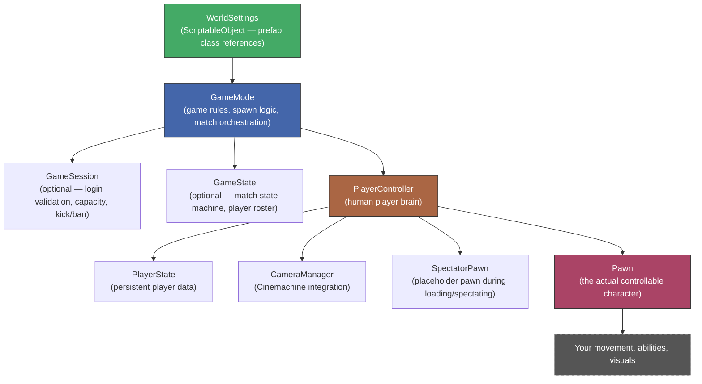
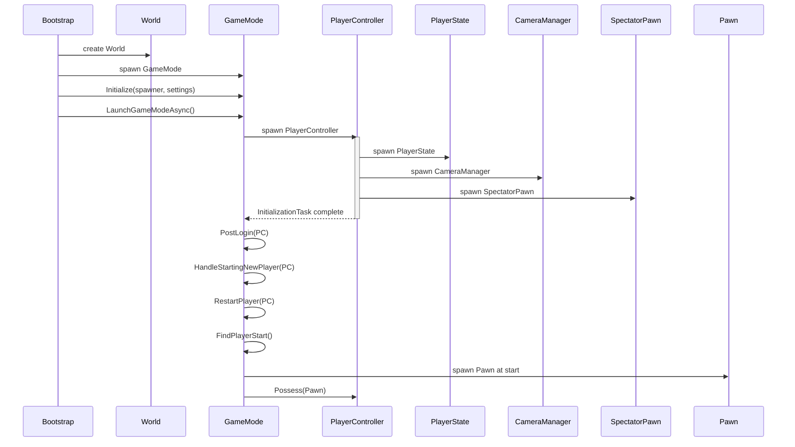
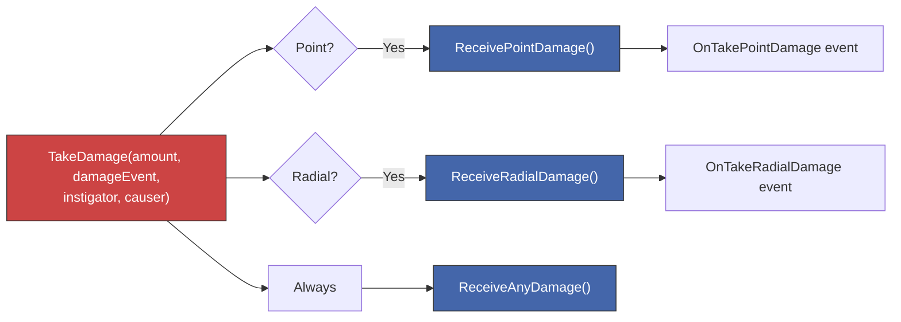

[**English**] | [**简体中文**](README.SCH.md)

# CycloneGames.GameplayFramework

A structured gameplay framework for Unity, inspired by **Unreal Engine's GameFramework** architecture. It separates game logic into clear, composable layers — **Actor**, **Pawn**, **Controller**, **GameMode**, **PlayerState**, and more — each solving a specific architectural problem to keep your project scalable, testable, and easy to extend.

Ideal for developers who want Unreal Engine's proven architecture patterns in Unity, or for teams transitioning from Unreal Engine to Unity. The framework provides clean separation of concerns and follows industry-standard design patterns that have been battle-tested in countless AAA titles.

- **Unity**: 2022.3+
- **Dependencies**:
  - `com.unity.burst` / `com.unity.mathematics` — Burst-optimized math utilities
  - `com.unity.cinemachine@3` — Camera management
  - `com.cysharp.unitask@2` — Async operations
  - `com.cyclone-games.factory@1` — Object spawning abstraction (`IUnityObjectSpawner`)
  - `com.cyclone-games.logger@1` — Debug logging

---

## Table of Contents

1. [Design Philosophy](#design-philosophy)
2. [Architecture Overview](#architecture-overview)
3. [Class Reference](#class-reference)
   - [Actor](#actor)
   - [Pawn](#pawn)
   - [Controller](#controller)
   - [PlayerController](#playercontroller)
   - [AIController](#aicontroller)
   - [PlayerState](#playerstate)
   - [GameMode](#gamemode)
   - [GameState](#gamestate)
   - [GameSession](#gamesession)
   - [DamageType System](#damagetype-system)
   - [World & WorldSettings](#world--worldsettings)
   - [CameraManager](#cameramanager)
   - [PlayerStart](#playerstart)
   - [SpectatorPawn](#spectatorpawn)
   - [KillZVolume](#killzvolume)
   - [SceneLogic](#scenelogic)
   - [ActorTag System](#actortag-system)
4. [Quick Start](#quick-start)
5. [Advanced Usage](#advanced-usage)
6. [Integration with Other Packages](#integration-with-other-packages)
7. [Best Practices](#best-practices)
8. [FAQ](#faq)

---

## Design Philosophy

### The Problem

A typical Unity project tends to evolve a monolithic `PlayerController` script that handles input, movement, camera, scoring, respawn, and game rules all in one place. As the project grows, this creates tight coupling, makes character swapping difficult, and turns testing into a nightmare.

### The Solution

Drawing inspiration from Unreal Engine's GameFramework, this framework decomposes gameplay into **layers with clear responsibilities**:

| Layer | Class | Responsibility |
|-------|-------|---------------|
| **Entity** | `Actor` | Base for all gameplay objects — lifecycle, ownership, tags, damage |
| **Controllable** | `Pawn` | An Actor that can be possessed and receive movement input |
| **Decision** | `Controller` | The brain — decides what the Pawn does |
| **Human Input** | `PlayerController` | A Controller driven by human input, with camera and spectator support |
| **AI Decision** | `AIController` | A Controller driven by AI logic, with focus and auto-rotation |
| **Persistent Data** | `PlayerState` | Player data that survives Pawn death/respawn (score, name, stats) |
| **Game Rules** | `GameMode` | Spawn logic, respawn rules, match flow orchestration |
| **Match State** | `GameState` | Observable match state machine and player roster |
| **Session** | `GameSession` | Network-agnostic player capacity, login validation, kick/ban |
| **Damage** | `DamageType` | Typed damage pipeline with point/radial routing |
| **World** | `World` | Lightweight service locator for GameMode/GameState/PlayerController |
| **Configuration** | `WorldSettings` | ScriptableObject that binds all prefab class references |

### Key Principles

- **DI-friendly**: All spawning goes through `IUnityObjectSpawner` — swap in any DI container or object pool without touching framework code.
- **Interface-first extensibility**: Core systems expose interfaces (`IGameMode`, `IGameSession`, `IDamageType`, `IWorldSettings`) so you can provide custom implementations without subclassing.
- **No forced dependencies**: The framework has **zero** compile-time dependency on GameplayAbilities, GameplayTags, Networking, or any other CycloneGames package. Integration is handled through interfaces and opaque context fields.
- **Zero-GC awareness**: Hot paths use pre-allocated buffers, static lists, and Burst-compiled math. No per-frame allocations in Actor visibility toggling, tag queries, or orientation math.

---

## Architecture Overview

### Component Hierarchy


```mermaid
graph TD
    WS["WorldSettings<br/>(ScriptableObject — prefab class references)"]
    GM["GameMode<br/>(game rules, spawn logic, match orchestration)"]
    GSession["GameSession<br/>(optional — login validation, capacity, kick/ban)"]
    GState["GameState<br/>(optional — match state machine, player roster)"]
    PC["PlayerController<br/>(human player brain)"]
    PS["PlayerState<br/>(persistent player data)"]
    CM["CameraManager<br/>(Cinemachine integration)"]
    SP["SpectatorPawn<br/>(placeholder pawn during loading/spectating)"]
    Pawn["Pawn<br/>(the actual controllable character)"]
    User["Your movement, abilities, visuals"]

    WS --> GM
    GM --> GSession
    GM --> GState
    GM --> PC
    PC --> PS
    PC --> CM
    PC --> SP
    PC --> Pawn
    Pawn --> User

    style WS fill:#4a6,stroke:#333,color:#fff
    style GM fill:#46a,stroke:#333,color:#fff
    style PC fill:#a64,stroke:#333,color:#fff
    style Pawn fill:#a46,stroke:#333,color:#fff
    style User fill:#555,stroke:#999,color:#fff,stroke-dasharray: 5 5
```

### Lifecycle Sequence


```mermaid
sequenceDiagram
    participant Boot as Bootstrap
    participant W as World
    participant GM as GameMode
    participant PC as PlayerController
    participant PS as PlayerState
    participant Cam as CameraManager
    participant SP as SpectatorPawn
    participant Pawn as Pawn

    Boot->>W: create World
    Boot->>GM: spawn GameMode
    Boot->>GM: Initialize(spawner, settings)
    Boot->>GM: LaunchGameModeAsync()
    GM->>PC: spawn PlayerController
    activate PC
    PC->>PS: spawn PlayerState
    PC->>Cam: spawn CameraManager
    PC->>SP: spawn SpectatorPawn
    PC-->>GM: InitializationTask complete
    deactivate PC
    GM->>GM: PostLogin(PC)
    GM->>GM: HandleStartingNewPlayer(PC)
    GM->>GM: RestartPlayer(PC)
    GM->>GM: FindPlayerStart()
    GM->>Pawn: spawn Pawn at start
    GM->>PC: Possess(Pawn)
```

### Data Lifetime

| Survives Pawn Death | Destroyed with Pawn |
|---|---|
| `PlayerController` | `Pawn` instance |
| `PlayerState` (score, name, stats) | Movement state |
| `CameraManager` | Visual components |
| `SpectatorPawn` | Physics state |

This separation means respawning is simply: destroy old Pawn -> spawn new Pawn -> `Possess()` — all player data remains intact.

---

## Class Reference

### Actor

**Purpose**: Base class for every gameplay object. Provides lifecycle hooks, ownership chain, tag system, visibility toggling, damage pipeline, and network extensibility.

**Design rationale**: In a typical Unity project, gameplay MonoBehaviours lack a shared contract for lifecycle, ownership, or damage. Actor establishes this contract so that any gameplay object — characters, projectiles, pickups, volumes — shares a consistent API.

**Key features**:

| Feature | API | Notes |
|---|---|---|
| Lifecycle | `BeginPlay()` / `EndPlay()` | Called once after Start / before OnDestroy |
| Ownership | `SetOwner(Actor)` / `GetOwner()` | Hierarchical ownership chain |
| Instigator | `SetInstigator(Actor)` / `GetInstigator()` | Who caused this Actor to be created |
| Tags | `ActorHasTag(string)` / `AddTag()` / `RemoveTag()` | Simple string-based tag system with `[ActorTag]` Inspector support |
| Visibility | `SetActorHiddenInGame(bool)` | Zero-GC batch renderer toggle |
| Damage | `TakeDamage(float)` / `TakeDamage(float, DamageEvent, ...)` | Routes to `ReceivePointDamage` / `ReceiveRadialDamage` / `ReceiveAnyDamage` |
| Lifespan | `SetLifeSpan(float)` | Auto-destroy after N seconds |
| Bounds | `FellOutOfWorld()` / `OutsideWorldBounds()` | Override to handle out-of-bounds |
| Network | `HasAuthority()` | Override in network layer; defaults to `true` (standalone) |
| Orientation | `GetOrientation()` | Burst-compiled quaternion-to-Euler conversion |
| Events | `OnDestroyed` / `OwnerChanged` | Observable Actor lifecycle events |
| Transform | `GetActorLocation()` / `SetActorLocation()` / `GetActorRotation()` / ... | Convenience wrappers over `transform` |

**Example — Custom Actor with lifecycle and damage handling**:

```csharp
public class Projectile : Actor
{
    [SerializeField] private float speed = 20f;

    protected override void BeginPlay()
    {
        // Called once after Start — set up lifespan for auto-cleanup
        SetLifeSpan(5f);
    }

    protected override void EndPlay()
    {
        // Called before OnDestroy — clean up effects, return to pool, etc.
    }

    void Update()
    {
        if (!IsHidden())
            transform.Translate(Vector3.forward * speed * Time.deltaTime);
    }

    public override void FellOutOfWorld()
    {
        // Hit kill zone — destroy immediately
        Destroy(gameObject);
    }
}
```

### Pawn

**Purpose**: An Actor that can be **possessed** by a Controller. This is your player character, AI enemy, vehicle — anything that receives input and acts in the world.

**Design rationale**: Separating the "body" (Pawn) from the "brain" (Controller) means you can swap characters without rewriting control logic, and the same Pawn class can be driven by either human input or AI.

**Key features**:

- **Possession**: `PossessedBy(Controller)` / `UnPossessed()` — framework handles owner/state transfer.
- **Movement input pipeline**: `AddMovementInput(direction, scale)` accumulates input per frame. Movement components call `ConsumeMovementInputVector()` each tick to drive actual movement.
- **Controller rotation**: `FaceRotation()` automatically syncs Pawn rotation to Controller's `ControlRotation`, respecting per-axis flags (`UseControllerRotationPitch/Yaw/Roll`).
- **Initial rotation**: `NotifyInitialRotation(Quaternion)` broadcasts to all `IInitialRotationSettable` components on spawn — allowing external movement components (e.g., from RPGFoundation) to synchronize without framework coupling.
- **State queries**: `IsPlayerControlled()`, `IsBotControlled()`, `IsLocallyControlled()`, `IsTurnedOff()`.
- **View**: `GetPawnViewLocation()`, `GetViewRotation()`, `GetBaseAimRotation()` — camera and aiming integration.
- **Turn on/off**: `TurnOff()` / `TurnOn()` — disable pawn without destroying it.

**Example — Character Pawn with movement**:

```csharp
public class CharacterPawn : Pawn
{
    [SerializeField] private float moveSpeed = 5f;
    [SerializeField] private CharacterController characterController;

    protected override void BeginPlay()
    {
        UseControllerRotationYaw = true; // Sync yaw to controller
    }

    public override void PossessedBy(Controller NewController)
    {
        base.PossessedBy(NewController);
        // Enable visuals, start animations, etc.
    }

    public override void UnPossessed()
    {
        base.UnPossessed();
        // Disable input-driven behavior
    }

    void Update()
    {
        // Consume accumulated movement input
        Vector3 input = ConsumeMovementInputVector();
        if (input.sqrMagnitude > 0.001f)
        {
            characterController.Move(input * moveSpeed * Time.deltaTime);
        }

        // Sync rotation to controller
        if (Controller != null)
        {
            FaceRotation(GetControlRotation(), Time.deltaTime);
        }
    }
}
```

### Controller

**Purpose**: The abstract "brain" that possesses and controls a Pawn. Holds persistent references (PlayerState, start spot) and manages control rotation.

**Design rationale**: By separating decision-making (Controller) from execution (Pawn), the framework supports hot-swapping characters, AI takeover of player pawns, and clean input suppression — all impossible with monolithic player scripts.

**Key features**:

- **Possess / UnPossess**: Full handshake — notifies old and new Pawn, old Controller, transfers ownership. `OnPossessedPawnChanged` event fires.
- **Stacked input suppression**: `SetIgnoreMoveInput(true/false)` / `SetIgnoreLookInput(true/false)` increments/decrements a counter. Multiple systems can independently suppress input without stomping each other. Call `ResetIgnoreInputFlags()` to clear all.
- **Spawner and settings injection**: `Initialize(IUnityObjectSpawner, IWorldSettings)` — constructor injection for DI compatibility.
- **Start spot**: `SetStartSpot(Actor)` / `GetStartSpot()` — tracks where this controller's pawn was spawned.
- **Game flow**: `GameHasEnded(Actor, bool)` / `FailedToSpawnPawn()` — override to react to game events.

### PlayerController

**Purpose**: A Controller for human players. Extends Controller with **camera management**, **spectator pawn**, and **async initialization**.

**Design rationale**: Human players need camera setup, spectator fallback during loading, and async init (waiting for dependencies). PlayerController encapsulates all of this so game-specific subclasses only need to handle input.

**Key features**:

- **Async init**: `InitializationTask` (UniTask) — spawns PlayerState, CameraManager, SpectatorPawn in sequence. GameMode awaits this before proceeding.
- **Camera**: `GetCameraManager()`, `SetViewTarget(Actor)`, `SetViewTargetWithBlend(Actor, float)`, `AutoManageActiveCameraTarget(Actor)`.
- **Spectator**: `SpawnSpectatorPawn()` / `GetSpectatorPawn()` — used as fallback Pawn during loading.

**Example — PlayerController with input**:

```csharp
public class MyPlayerController : PlayerController
{
    void Update()
    {
        if (IsMoveInputIgnored()) return;

        Pawn pawn = GetPawn();
        if (pawn == null) return;

        // WASD movement input
        float h = Input.GetAxisRaw("Horizontal");
        float v = Input.GetAxisRaw("Vertical");
        Vector3 direction = new Vector3(h, 0, v).normalized;
        if (direction.sqrMagnitude > 0.001f)
        {
            pawn.AddMovementInput(direction, 1f);
        }

        // Mouse look -> control rotation
        float mouseX = Input.GetAxis("Mouse X");
        Quaternion rot = ControlRotation() * Quaternion.Euler(0, mouseX * 2f, 0);
        SetControlRotation(rot);
    }
}
```

### AIController

**Purpose**: A Controller for AI-driven pawns. Provides **focus system** and **auto-rotation** toward targets.

**Design rationale**: AI needs to look at targets and run logic loops. AIController provides the focus/rotation plumbing so AI implementations (behavior trees, state machines, GOAP) only need to call `SetFocus(Actor)` or `SetFocalPoint(Vector3)`.

**Key features**:

- **Focus**: `SetFocus(Actor)` / `SetFocalPoint(Vector3)` / `ClearFocus()` / `GetFocusActor()` / `GetFocalPoint()`.
- **Auto-rotation**: Automatically rotates toward focus target each Update.
- **AI lifecycle**: `RunAI()` / `StopAI()` / `IsRunningAI()` — called automatically on possess/unpossess if `bStartAILogicOnPossess` is true.

**Example — AI patrol with focus**:

```csharp
public class PatrolAIController : AIController
{
    [SerializeField] private Transform[] patrolPoints;
    private int currentIndex = 0;

    public override void RunAI()
    {
        base.RunAI();
        MoveToNextPatrolPoint();
    }

    void MoveToNextPatrolPoint()
    {
        if (patrolPoints.Length == 0) return;
        SetFocalPoint(patrolPoints[currentIndex].position);
    }

    void Update()
    {
        if (!IsRunningAI()) return;

        Pawn pawn = GetPawn();
        if (pawn == null) return;

        Vector3 target = patrolPoints[currentIndex].position;
        Vector3 dir = (target - pawn.GetActorLocation()).normalized;
        pawn.AddMovementInput(dir, 1f);

        if (Vector3.Distance(pawn.GetActorLocation(), target) < 1f)
        {
            currentIndex = (currentIndex + 1) % patrolPoints.Length;
            MoveToNextPatrolPoint();
        }
    }

    public void OnPlayerDetected(Actor player)
    {
        // Switch focus to the player — auto-rotation will track them
        SetFocus(player);
    }
}
```

### PlayerState

**Purpose**: Persistent player data that **survives Pawn death and respawn**.

**Design rationale**: Score, player name, team, inventory — these must not be destroyed when a character dies. PlayerState lives on the Controller (not the Pawn), so respawning creates a new Pawn but keeps all player data.

**Key features**:

- **Pawn tracking**: `GetPawn()` / `OnPawnSetEvent` — notified when the possessed Pawn changes. Event signature: `(PlayerState, newPawn, oldPawn)`.
- **Player info**: `GetPlayerName()` / `SetPlayerName()`, `GetPlayerId()` / `SetPlayerId()`, `GetScore()` / `SetScore()`, `AddScore()` (returns new score).
- **Flags**: `IsABot()` / `SetIsABot()`, `IsSpectator()` / `SetIsSpectator()`.
- **Copy**: `CopyProperties(PlayerState)` — for seamless travel or respawn state transfer.

**Example — Custom PlayerState with inventory**:

```csharp
public class RPGPlayerState : PlayerState
{
    private List<string> inventory = new List<string>();
    public int Kills { get; private set; }

    public void RecordKill()
    {
        Kills++;
        AddScore(100f);
    }

    public void AddItem(string itemId)
    {
        inventory.Add(itemId);
    }

    public override void CopyProperties(PlayerState other)
    {
        base.CopyProperties(other);
        if (other is RPGPlayerState rpg)
        {
            inventory = new List<string>(rpg.inventory);
            Kills = rpg.Kills;
        }
    }
}
```

### GameMode

**Purpose**: **The orchestrator**. Handles player spawning, respawning, start point selection, and match flow.

**Design rationale**: Game rules (how many lives, where to spawn, when the match starts) are fundamentally different from player input or character movement. GameMode centralizes these decisions in one place, making it trivial to swap game modes (Deathmatch vs. CTF vs. Tutorial) by changing a single prefab reference.

**Key features**:

- **Launch**: `LaunchGameModeAsync(CancellationToken)` — the entry point. Spawns PlayerController, waits for init, calls PostLogin, starts match, restarts player.
- **Player start selection**: `FindPlayerStart()` -> `ChoosePlayerStart()` — override for custom logic (random, team-based, round-robin).
- **Spawn pipeline**: `SpawnDefaultPawnAtPlayerStart/Transform/Location()` — spawns Pawn, handles CharacterController/Rigidbody teleport via `TeleportPawn()`.
- **Login/Logout**: `PreLogin()` (validate with GameSession) -> `PostLogin()` (register + HandleStartingNewPlayer) -> `Logout()` (unregister).
- **Session integration**: `SetGameSession(IGameSession)` — optional. Without a session, all login checks pass (standalone mode).
- **Pawn class selection**: Override `GetDefaultPawnPrefabForController()` to return different Pawn prefabs per player (class-based or team-based selection).

**Example — GameMode with lives and custom spawn**:

```csharp
public class ArenaGameMode : GameMode
{
    private Dictionary<PlayerController, int> playerLives = new();
    private const int MaxLives = 3;

    protected override void HandleStartingNewPlayer(PlayerController NewPlayer)
    {
        playerLives[NewPlayer] = MaxLives;
    }

    public override void RestartPlayer(PlayerController NewPlayer, string Portal = "")
    {
        if (playerLives.TryGetValue(NewPlayer, out int lives) && lives <= 0)
        {
            // No lives left — switch to spectator
            NewPlayer.GetPlayerState()?.SetIsSpectator(true);
            return;
        }
        base.RestartPlayer(NewPlayer, Portal);
    }

    // Override to pick a random spawn point
    protected override Actor ChoosePlayerStart(Controller Player)
    {
        var starts = PlayerStart.GetAllPlayerStarts();
        if (starts.Count == 0) return null;
        return starts[UnityEngine.Random.Range(0, starts.Count)];
    }

    // Override to assign class-specific pawn prefabs
    protected override Pawn GetDefaultPawnPrefabForController(Controller InController)
    {
        // Could return different pawn prefabs based on player class selection
        return base.GetDefaultPawnPrefabForController(InController);
    }

    public void OnPlayerKilled(PlayerController player)
    {
        if (playerLives.ContainsKey(player))
        {
            playerLives[player]--;
            RestartPlayer(player);
        }
    }
}
```

### GameState

**Purpose**: Observable match state visible to all players. Tracks match phase, elapsed time, and the authoritative player roster.

**Design rationale**: In multiplayer games, all clients need to agree on match state (waiting, in progress, ended). Even in single-player, a state machine for match phases prevents ad-hoc boolean flags scattered across scripts.

**Key features**:

- **Match state machine**: `EMatchState` enum (EnteringMap -> WaitingToStart -> InProgress -> WaitingPostMatch -> LeavingMap -> Aborted).
- **State transitions**: `SetMatchState(EMatchState)` -> `OnMatchStateChanged(old, new)` — override for custom transition logic.
- **Player roster**: `AddPlayerState()` / `RemovePlayerState()` / `PlayerArray` / `GetNumPlayers()`.
- **Elapsed time**: `ElapsedTime` — auto-increments during `InProgress` state.

**Example — GameState with win condition**:

```csharp
public class ArenaGameState : GameState
{
    public int ScoreToWin { get; set; } = 10;

    protected override void OnMatchStateChanged(EMatchState OldState, EMatchState NewState)
    {
        if (NewState == EMatchState.InProgress)
        {
            // Match just started — notify UI
            Debug.Log("Match started!");
        }
        else if (NewState == EMatchState.WaitingPostMatch)
        {
            Debug.Log($"Match ended after {ElapsedTime:F1}s");
        }
    }

    public void CheckWinCondition()
    {
        foreach (var ps in PlayerArray)
        {
            if (ps.GetScore() >= ScoreToWin)
            {
                SetMatchState(EMatchState.WaitingPostMatch);
                return;
            }
        }
    }
}
```

### GameSession

**Purpose**: Network-agnostic session management — player capacity, login validation, kick/ban.

**Design rationale**: Networking solutions vary (Mirror, Netcode, Photon, custom). GameSession provides a stable interface (`IGameSession`) that GameMode calls into, while the actual network implementation lives in an adapter. Without a session, GameMode operates in standalone mode with no capacity checks.

**Key features**:

- **`IGameSession` interface**: `ApproveLogin()`, `RegisterPlayer()`, `UnregisterPlayer()`, `AtCapacity()`, `KickPlayer()`, `BanPlayer()`, `HandleMatchHasStarted/Ended()`.
- **Default implementation**: `GameSession` (Actor subclass) — local standalone session that counts players/spectators against `MaxPlayers`/`MaxSpectators`.
- **Integration**: Implement `IGameSession` in a Mirror/Netcode/Photon adapter. Pass it to `GameMode.SetGameSession()`.

**Example — Custom session with password**:

```csharp
public class PasswordGameSession : GameSession
{
    [SerializeField] private string serverPassword = "";

    public override bool ApproveLogin(string options, string address, out string errorMessage)
    {
        if (!base.ApproveLogin(options, address, out errorMessage))
            return false;

        if (!string.IsNullOrEmpty(serverPassword) && options != serverPassword)
        {
            errorMessage = "Invalid password";
            return false;
        }
        return true;
    }
}
```

### DamageType System

**Purpose**: Typed, routed damage pipeline. Defines what kind of damage was dealt (fire, explosive, environmental) and carries hit context (location, direction, radius).

**Design rationale**: Games need to distinguish damage types for armor, resistances, visual effects, and sound. The framework provides `IDamageType` as an interface so it works standalone, but can also carry GameplayAbilities context through the opaque `EffectContext` field — without any compile-time dependency on GAS.

**Components**:

- **`IDamageType`** (interface): `CausedByWorld`, `ScaleMomentumByMass`, `DamageImpulse`, `DamageFalloff`.
- **`DamageType`** (ScriptableObject): Default implementation — create via `Create -> CycloneGames -> GameplayFramework -> DamageType`.
- **`EDamageEventType`** (enum): `Generic`, `Point`, `Radial`.
- **`DamageEvent`** (struct): Zero-allocation value type with fields for event type, damage type, hit location/normal/direction (point), origin/radii (radial), and optional `EffectContext` (object) for GAS bridging.
- **Factory methods**: `DamageEvent.MakeGenericDamage()`, `MakePointDamage(...)`, `MakeRadialDamage(...)`.

**Damage routing in Actor**:


```mermaid
flowchart LR
    TD["TakeDamage(amount, damageEvent,<br/>instigator, causer)"] --> Point{Point?}
    TD --> Radial{Radial?}
    TD --> Always["Always"]

    Point -->|Yes| RPD["ReceivePointDamage()"]
    RPD --> OTPD["OnTakePointDamage event"]

    Radial -->|Yes| RRD["ReceiveRadialDamage()"]
    RRD --> OTRD["OnTakeRadialDamage event"]

    Always --> RAD["ReceiveAnyDamage()"]

    style TD fill:#c44,stroke:#333,color:#fff
    style RPD fill:#46a,stroke:#333,color:#fff
    style RRD fill:#46a,stroke:#333,color:#fff
    style RAD fill:#46a,stroke:#333,color:#fff
```

**Example — Applying and receiving damage**:

```csharp
// --- Applying damage (e.g., from a weapon) ---
public class Weapon : Actor
{
    [SerializeField] private DamageType fireDamageType;

    public void FireAt(Actor target, Vector3 hitLocation, Vector3 hitNormal)
    {
        var damageEvent = DamageEvent.MakePointDamage(
            hitLocation, hitNormal, GetActorForwardVector(), fireDamageType);

        target.TakeDamage(25f, damageEvent,
            GetInstigator<Controller>(), this);
    }

    public void Explode(Vector3 origin, float radius)
    {
        var damageEvent = DamageEvent.MakeRadialDamage(
            origin, innerRadius: 2f, outerRadius: radius, fireDamageType);

        // Apply to all actors in radius...
    }
}

// --- Receiving damage (in your Actor subclass) ---
public class EnemyActor : Actor
{
    private float health = 100f;

    protected override void ReceiveAnyDamage(float Damage, Controller EventInstigator, Actor DamageCauser)
    {
        health -= Damage;
        if (health <= 0f)
            Destroy(gameObject);
    }

    protected override void ReceivePointDamage(float Damage, DamageEvent damageEvent,
        Controller EventInstigator, Actor DamageCauser)
    {
        // Spawn hit VFX at impact point
        // damageEvent.HitLocation, damageEvent.HitNormal, damageEvent.ShotDirection
    }

    protected override void ReceiveRadialDamage(float Damage, DamageEvent damageEvent,
        Controller EventInstigator, Actor DamageCauser)
    {
        // Apply knockback from explosion origin
        // damageEvent.Origin, damageEvent.InnerRadius, damageEvent.OuterRadius
    }
}
```

### World & WorldSettings

**`WorldSettings`** (ScriptableObject) — The configuration asset that binds all class references:

| Field | Type | Required |
|---|---|---|
| `GameModeClass` | `GameMode` | Yes |
| `PlayerControllerClass` | `PlayerController` | Yes |
| `PawnClass` | `Pawn` | Yes |
| `PlayerStateClass` | `PlayerState` | No |
| `CameraManagerClass` | `CameraManager` | No |
| `SpectatorPawnClass` | `SpectatorPawn` | No |

Create via `Create -> CycloneGames -> GameplayFramework -> WorldSettings`. Editor validation shows green/red/yellow status for each field.

**`World`** — A non-MonoBehaviour service locator. Holds references to GameMode, GameState, and provides player queries:

```csharp
World world = new World();
world.SetGameMode(gameMode);
world.SetGameState(gameState);
PlayerController pc = world.GetPlayerController();
Pawn pawn = world.GetPlayerPawn();
```

### CameraManager

**Purpose**: Manages Cinemachine cameras and follows the current view target.

**Requirements**: Main Camera must have `CinemachineBrain`. At least one `CinemachineCamera` must exist in the scene.

**Key API**: `InitializeFor(PlayerController)`, `SetActiveVirtualCamera()`, `SetViewTarget(Transform)`, `SetFOV(float)`.

**Example — Switching camera target**:

```csharp
// In your PlayerController subclass:
public void SwitchToSpectateTarget(Actor target)
{
    SetViewTargetWithBlend(target, 0.5f); // 0.5s blend
}

// Or access CameraManager directly:
CameraManager cam = GetCameraManager();
cam.SetViewTarget(someActor.transform);
cam.SetFOV(60f);
```

### PlayerStart

**Purpose**: Spawn point for players. Uses a **static registry pattern** for zero-GC lookup — no `FindObjectsOfType` at runtime.

**Features**: Auto-register/unregister on enable/disable. Name-based matching for portal/checkpoint systems. Gizmo visualization in editor.

**Example — Portal-based spawning with named starts**:

```csharp
// Name your PlayerStart GameObjects: "SpawnPoint_LevelA", "SpawnPoint_LevelB"
// Then in GameMode:
protected override Actor ChoosePlayerStart(Controller Player)
{
    string portal = "SpawnPoint_LevelB";
    foreach (var start in PlayerStart.GetAllPlayerStarts())
    {
        if (start.gameObject.name == portal)
            return start;
    }
    return base.ChoosePlayerStart(Player);
}
```

### SpectatorPawn

**Purpose**: A minimal Pawn used as a placeholder when the player doesn't have a real character yet (during loading, between rounds, when spectating).

**Key field**: `spectatorSpeed` — movement speed in spectator mode.

### KillZVolume

**Purpose**: Trigger volume that calls `FellOutOfWorld()` on any Actor that enters. Supports both 3D (`BoxCollider` with IsTrigger) and 2D (`BoxCollider2D` with IsTrigger).

**Usage**: Add `KillZVolume` component to a GameObject with a trigger collider. Position it under the playable area.

### SceneLogic

**Purpose**: Per-scene logic controller. Provides lifecycle hooks (`Awake`, `Start`, `Update`, etc.) for scene-specific gameplay scripting — e.g., opening cutscenes, level-specific triggers, ambient events.

### ActorTag System

**Purpose**: Inspector-friendly tag selection for Actor's string-based tag fields.

**Components**:

- **`ActorTagAttribute`**: PropertyAttribute with optional `Type` parameter.
  - `[ActorTag]` — no type: draws as normal string field (used by framework base class).
  - `[ActorTag(typeof(MyTags))]` — with type: draws a searchable popup picker sourced from `public const string` fields in the specified class.
- **`ActorTagPropertyDrawer`**: Editor drawer that opens a `PopupWindow` with `SearchField` + scrollable `TreeView`. Supports search filtering, (None) option, clear button, and invalid value highlighting.

**Example**:

```csharp
// 1. Define your tag constants
public static class ActorTags
{
    public const string Player = "Player";
    public const string Enemy = "Enemy";
    public const string NPC = "NPC";
    public const string Interactable = "Interactable";
    public const string Destructible = "Destructible";
}

// 2. Use in your Actor subclass — Inspector shows a searchable dropdown
public class MyPawn : Pawn
{
    [SerializeField, ActorTag(typeof(ActorTags))]
    private List<string> tags;
}

// 3. Query tags at runtime
if (someActor.ActorHasTag("Enemy"))
{
    // React to enemy
}
```

---

## Quick Start

### Prerequisites

- Unity 2022.3+
- Packages installed: `CycloneGames.GameplayFramework`, `Cinemachine`, `UniTask`, `CycloneGames.Factory`, `CycloneGames.Logger`

### Minimal Setup (5 steps)

**Step 1 — Create prefabs**

Create empty GameObjects, add the corresponding component, and save as prefabs:

| Prefab | Component | Notes |
|---|---|---|
| `GM_MyGame` | `GameMode` (or your subclass) | Required |
| `PC_MyGame` | `PlayerController` (or your subclass) | Required |
| `Pawn_MyGame` | `Pawn` (or your subclass) | Required — add your character model/controller here |
| `PS_MyGame` | `PlayerState` (or your subclass) | Required |
| `CM_MyGame` | `CameraManager` | Optional — needed if using Cinemachine |
| `SP_MyGame` | `SpectatorPawn` | Optional |

**Step 2 — Create WorldSettings**

`Create -> CycloneGames -> GameplayFramework -> WorldSettings`. Assign all prefabs.

**Step 3 — Create the bootstrap**

```csharp
using Cysharp.Threading.Tasks;
using UnityEngine;
using CycloneGames.GameplayFramework.Runtime;
using CycloneGames.Factory.Runtime;

public class GameBootstrap : MonoBehaviour
{
    [SerializeField] private WorldSettings worldSettings;

    async void Start()
    {
        IUnityObjectSpawner spawner = new SimpleObjectSpawner();

        var gameMode = spawner.Create(worldSettings.GameModeClass) as GameMode;
        gameMode.Initialize(spawner, worldSettings);

        var world = new World();
        world.SetGameMode(gameMode);

        await gameMode.LaunchGameModeAsync(destroyCancellationToken);
    }
}

public class SimpleObjectSpawner : IUnityObjectSpawner
{
    public T Create<T>(T origin) where T : Object
    {
        return origin != null ? Object.Instantiate(origin) : null;
    }
}
```

**Step 4 — Set up the scene**

1. Add a `PlayerStart` component to an empty GameObject and position it.
2. Ensure the Main Camera has `CinemachineBrain` and the scene has at least one `CinemachineCamera`.
3. Add the `GameBootstrap` component to a GameObject and assign your `WorldSettings`.

**Step 5 — Press Play**

The framework will: spawn PlayerController -> init PlayerState / CameraManager / SpectatorPawn -> find PlayerStart -> spawn Pawn -> possess.

---

## Advanced Usage

### Respawn System

```csharp
// In your GameMode subclass:
public void OnPlayerDied(PlayerController player)
{
    // Unpossess the dead pawn
    Pawn deadPawn = player.GetPawn();
    player.UnPossess();

    // Optionally delay respawn
    RespawnAfterDelay(player, 3f).Forget();
}

private async UniTaskVoid RespawnAfterDelay(PlayerController player, float delay)
{
    await UniTask.Delay(TimeSpan.FromSeconds(delay));
    RestartPlayer(player);
}
```

### Character Swapping

```csharp
// Swap pawn mid-game (e.g., entering a vehicle)
public class VehicleActor : Actor
{
    [SerializeField] private Pawn vehiclePawn;

    public void EnterVehicle(PlayerController driver)
    {
        Pawn oldPawn = driver.GetPawn();
        driver.UnPossess();
        driver.Possess(vehiclePawn);
        oldPawn.SetActorHiddenInGame(true);
    }

    public void ExitVehicle(PlayerController driver, Pawn originalPawn)
    {
        driver.UnPossess();
        originalPawn.SetActorHiddenInGame(false);
        originalPawn.SetActorLocation(transform.position + Vector3.right * 2f);
        driver.Possess(originalPawn);
    }
}
```

### Input Suppression

```csharp
// Multiple systems can suppress input independently
playerController.SetIgnoreMoveInput(true);  // UI opened — suppress
playerController.SetIgnoreMoveInput(true);  // Cutscene — suppress (counter = 2)
playerController.SetIgnoreMoveInput(false); // UI closed (counter = 1, still suppressed)
playerController.SetIgnoreMoveInput(false); // Cutscene ended (counter = 0, input restored)

// Or reset everything at once
playerController.ResetIgnoreInputFlags();
```

### Damage with Event Subscription

```csharp
// Subscribe to damage events from outside the Actor
Actor target = someEnemy;
target.OnTakePointDamage += (damage, damageEvent, instigator, causer) =>
{
    // Spawn hit marker UI
    ShowHitMarker(damageEvent.HitLocation);
};
target.OnTakeRadialDamage += (damage, damageEvent, instigator, causer) =>
{
    // Show explosion indicator
    ShowExplosionIndicator(damageEvent.Origin);
};
```

---

## Integration with Other Packages

The framework is designed to work **alongside** other CycloneGames packages without compile-time dependencies:

| Package | How it integrates |
|---|---|
| **GameplayAbilities (GAS)** | Set `DamageEvent.EffectContext` to your `GameplayEffectSpec` or `IGameplayEffectContext`. Downstream handlers cast it back. |
| **GameplayTags** | Actor's `tags` (simple strings) and `GameplayTagContainer` (hierarchical counted tags) serve different purposes and coexist on the same GameObject. |
| **RPGFoundation** | Pawn calls `NotifyInitialRotation()` which broadcasts to `IInitialRotationSettable` components — RPGFoundation's movement components can implement this interface. |
| **InputSystem** | PlayerController subclass reads from `CycloneGames.InputSystem` and calls `Pawn.AddMovementInput()`. |
| **Networking (Mirror, etc.)** | Implement `IGameSession` in a network adapter. Pass to `GameMode.SetGameSession()`. Override `Actor.HasAuthority()` in networked Actor subclasses. |
| **AIPerception** | High-performance AI perception system (sight, hearing) with Jobs/Burst optimization — pair with `AIController` for detection-driven AI. |
| **BehaviorTree** | Visual behavior tree editor and runtime — drive `AIController.RunAI()` logic with composable nodes. |
| **AssetManagement** | Interface-first, DI-friendly asset management (wraps YooAsset) — use for async Pawn/level loading. |
| **Audio** | Enhanced audio management with async loading — trigger sound effects from Actor damage events or GameState transitions. |
| **Services** | Graphics settings, camera services, and device settings management. |
| **DeviceFeedback** | Multi-platform haptics/vibration/light bar — trigger from damage events or ability activations. |
| **Cheat** | Lightweight cheat command system — useful during development for testing GameMode rules, spawning, etc. |
| **UIFramework** | Simple UI framework — build HUD/menus that read from PlayerState, GameState, and match events. |
| **Factory** | Object spawning/pooling abstraction — the framework's `IUnityObjectSpawner` is defined here (required dependency). |
| **Logger** | Thread-safe logging with category filtering — the framework's `CLogger` calls go through this (required dependency). |

---

## Best Practices

1. **Keep Pawn focused** — Movement, visual representation, abilities. No game rules, no scoring.
2. **Use PlayerState for persistent data** — Score, inventory, stats belong on PlayerState, not Pawn. They survive respawn.
3. **One GameMode per game type** — Deathmatch, CTF, Tutorial — each is a GameMode subclass. Swap by changing the WorldSettings prefab reference.
4. **Override, don't modify** — Subclass `GameMode`, `PlayerController`, `Pawn`, etc. The framework's base classes handle the plumbing.
5. **Use interfaces for testing** — `IGameMode`, `IGameSession`, `IWorldSettings`, `IUnityObjectSpawner` are all mockable for unit tests.
6. **Let GameMode orchestrate** — Spawning, respawning, match flow all belong in GameMode. Don't scatter these across Pawn or Controller.
7. **Prefer TakeDamage over direct health manipulation** — Route all damage through the Actor damage pipeline for consistent event firing and type routing.

---

## FAQ

**Q: Can I use this without Cinemachine?**
Yes. Don't assign `CameraManagerClass` in WorldSettings. The framework works fine without it — implement your own camera system.

**Q: How does respawning work?**
Call `GameMode.RestartPlayer(playerController)`. It finds a PlayerStart, spawns a new Pawn, and possesses it. PlayerState is untouched.

**Q: Can I have multiple players?**
The framework provides single-player flow out of the box. For local multiplayer, subclass GameMode to spawn multiple PlayerControllers and manage them with player indices.

**Q: How do I integrate with my DI container?**
Implement `IUnityObjectSpawner` using your container's instantiate method. Pass it to `GameMode.Initialize()`.

**Q: Does Actor.tags conflict with GameplayTags?**
No. Actor.tags is a simple `List<string>` for lightweight labeling. GameplayTags is a hierarchical counted tag system for ability/effect queries. They serve different purposes and coexist.

**Q: What is the inspiration behind this framework?**
The architecture is inspired by Unreal Engine's GameFramework. Concepts like Actor, Pawn, Controller, GameMode, and PlayerState map directly to their Unreal counterparts. However, the implementation is built natively for Unity — leveraging MonoBehaviour, Cinemachine, UniTask, and Unity-specific patterns.