> **Note:** This document was written with AI assistance. If you are looking for absolute accuracy, please read the source code directly. Both the **source code** and the **examples** were written by the author.

[**English**] | [**简体中文**](README.SCH.md)

# CycloneGames.GameplayFramework

A minimal, UE-style gameplay framework for Unity. It mirrors Unreal Engine's Gameplay Framework concepts (Actor, Pawn, Controller, GameMode, etc.), making it easy to build scalable, maintainable gameplay systems with dependency injection support.

This framework is perfect for developers who want Unreal Engine's proven architecture patterns in Unity, or for teams transitioning from Unreal to Unity. It provides a clean separation of concerns and follows industry-standard design patterns.

- **Unity**: 2022.3+
- **Dependencies**:
  - `com.unity.cinemachine@3` - For camera management
  - `com.cysharp.unitask@2` - For asynchronous operations
  - `com.cyclone-games.factory@1` - For object spawning
  - `com.cyclone-games.logger@1` - For debug logging

## Table of Contents

1. [Framework Philosophy](#framework-philosophy)
2. [Core Concepts](#core-concepts)
3. [Quick Start Guide](#comprehensive-quick-start-guide)
4. [Architecture Overview](#architecture-overview)
5. [Advanced Usage](#advanced-usage)
6. [Local Multiplayer Guide](#local-multiplayer-guide)
7. [Best Practices](#best-practices)

## Framework Philosophy

CycloneGames.GameplayFramework brings Unreal Engine's proven Gameplay Framework architecture to Unity. This design pattern has been battle-tested in countless AAA games and provides a robust foundation for building complex gameplay systems.

### Why Use This Framework?

**Traditional Unity Approach:**

- Monolithic `PlayerController` scripts that handle everything
- Tight coupling between player logic, camera, and game state
- Difficult to swap player characters or implement respawn systems
- Hard to test and maintain as complexity grows

**GameplayFramework Approach:**

- **Separation of Concerns**: Player logic (`Pawn`), control (`Controller`), state (`PlayerState`), and game rules (`GameMode`) are separate
- **Easy Character Swapping**: Change the `Pawn` prefab without touching controller code
- **Persistent State**: `PlayerState` survives Pawn respawns, perfect for score, inventory, etc.
- **Testable**: Each component has clear responsibilities and can be tested independently
- **Scalable**: Add new features without modifying existing code

### Key Benefits

- ✅ **Familiar to Unreal Developers**: If you know Unreal's Gameplay Framework, you'll feel at home
- ✅ **DI-Friendly**: Works seamlessly with dependency injection containers
- ✅ **Clean Architecture**: Clear separation between gameplay logic and infrastructure
- ✅ **Flexible**: Easy to extend and customize for your specific needs
- ✅ **Production-Ready**: Based on proven patterns used in AAA games

## Core Concepts

### Actor

The base class for all gameplay objects. Every object in your game that has gameplay logic should inherit from `Actor`.

**Key Features:**

- **Ownership**: Actors can have owners (other Actors)
- **Lifespan**: Automatic destruction after a set time
- **Location/Rotation**: Helper methods for position and rotation
- **World Events**: `FellOutOfWorld()` for handling out-of-bounds actors

**Example:**

```csharp
public class MyActor : Actor
{
    protected override void Awake()
    {
        base.Awake();
        // Your initialization code
    }

    public override void FellOutOfWorld()
    {
        // Custom behavior when actor falls out of world
        base.FellOutOfWorld(); // Destroys the actor
    }
}
```

### Pawn

A `Pawn` is a controllable `Actor` that can be "possessed" by a `Controller`. This is your player character, enemy, or any entity that can be controlled.

**Key Features:**

- **Possession**: Can be controlled by a `Controller`
- **PlayerState Link**: Connected to `PlayerState` for persistent data
- **Restart**: Can be restarted (useful for respawns)

**Example:**

```csharp
public class MyPlayerPawn : Pawn
{
    protected override void Awake()
    {
        base.Awake();
        // Initialize movement, abilities, etc.
    }

    public override void PossessedBy(Controller NewController)
    {
        base.PossessedBy(NewController);
        // Called when a controller takes control
        // Initialize input, enable movement, etc.
    }

    public override void UnPossessed()
    {
        base.UnPossessed();
        // Called when controller releases control
        // Disable input, stop movement, etc.
    }
}
```

### Controller

A `Controller` owns and controls a `Pawn`. It's the "brain" that makes decisions and sends commands to the Pawn.

**Types:**

- **PlayerController**: For human players
- **AIController**: For AI-controlled entities

**Key Features:**

- **Possession**: `Possess(Pawn)` and `UnPossess()` methods
- **Control Rotation**: Manages where the controller is "looking"
- **PlayerState**: Each controller has a `PlayerState` for persistent data

**Example:**

```csharp
public class MyPlayerController : PlayerController
{
    void Update()
    {
        // Handle input
        if (Input.GetKeyDown(KeyCode.Space))
        {
            // Make the pawn jump
            if (GetPawn() is MyPlayerPawn pawn)
            {
                pawn.Jump();
            }
        }
    }
}
```

### PlayerState

`PlayerState` holds player-centric data that persists across Pawn respawns. This is perfect for:

- Score
- Inventory
- Stats
- Any data that should survive death/respawn

**Key Features:**

- **Persistent**: Survives Pawn destruction
- **Pawn Reference**: Tracks the current `Pawn`
- **Events**: `OnPawnSetEvent` fires when Pawn changes

**Example:**

```csharp
public class MyPlayerState : PlayerState
{
    public int Score { get; private set; }
    public int Health { get; private set; }

    public void AddScore(int points)
    {
        Score += points;
        // Notify UI, etc.
    }

    protected override void Awake()
    {
        base.Awake();
        Health = 100;
        Score = 0;
    }
}
```

### GameMode

`GameMode` orchestrates the game rules. It handles:

- Spawning `PlayerController`
- Spawning and respawning `Pawn`s
- Finding `PlayerStart` locations
- Game-specific rules

**Key Methods:**

- `LaunchGameMode()`: Starts the game, spawns player
- `RestartPlayer(PlayerController)`: Respawns a player
- `FindPlayerStart(Controller, string)`: Finds spawn points

**Example:**

```csharp
public class MyGameMode : GameMode
{
    public override void RestartPlayer(PlayerController NewPlayer, string Portal = "")
    {
        // Custom respawn logic
        base.RestartPlayer(NewPlayer, Portal);

        // Maybe restore health, reset abilities, etc.
        if (NewPlayer.GetPlayerState() is MyPlayerState ps)
        {
            ps.RestoreHealth();
        }
    }
}
```

### WorldSettings

A `ScriptableObject` that defines all the key prefabs and classes your game needs. This is your "game configuration" asset.

**Contains:**

- `GameModeClass` - Your game mode prefab
- `PlayerControllerClass` - Your player controller prefab
- `PawnClass` - Your default player pawn prefab
- `PlayerStateClass` - Your player state prefab
- `CameraManagerClass` - Your camera manager prefab
- `SpectatorPawnClass` - Your spectator pawn prefab

### World

A lightweight container that holds a reference to the `GameMode` and provides lookup methods. This is NOT Unreal's UWorld—it's much simpler.

**Usage:**

```csharp
World world = new World();
world.SetGameMode(gameMode);
PlayerController pc = world.GetPlayerController();
Pawn pawn = world.GetPlayerPawn();
```

### CameraManager

Manages Cinemachine cameras and follows the current view target (usually the `PlayerController`).

**Requirements:**

- Main Camera must have `CinemachineBrain` component
- At least one `CinemachineCamera` in the scene

**Features:**

- Automatic camera finding
- View target following
- FOV control

### PlayerStart

A spawn point for players. Place these in your scene where you want players to spawn.

**Features:**

- Name-based matching (for portals/checkpoints)
- Rotation support (players spawn facing the correct direction)
- First found is used by default

### SpectatorPawn

A non-interactive `Pawn` used when the player doesn't have a real Pawn yet (e.g., during loading or when spectating).

## Comprehensive Quick-Start Guide

This guide will walk you through setting up a complete GameplayFramework project from scratch.

### Prerequisites

Before starting, ensure you have:

- Unity 2022.3 or later
- The `CycloneGames.GameplayFramework` package installed
- All dependencies installed (`Cinemachine`, `UniTask`, `Factory`, `Logger`)

### Step 1: Create Your Prefabs

Before creating `WorldSettings`, you need to create the prefabs it will reference.

**1.1 Create GameMode Prefab**

1. Create an empty GameObject in your scene
2. Add the `GameMode` component (or your custom subclass)
3. Name it `GameMode_MyGame`
4. Drag it to your `Prefabs` folder to create a prefab

**1.2 Create PlayerController Prefab**

1. Create an empty GameObject
2. Add the `PlayerController` component (or your custom subclass)
3. Name it `PlayerController_MyGame`
4. Drag it to your `Prefabs` folder

**1.3 Create Pawn Prefab**

1. Create a GameObject with your player character (e.g., a capsule with a CharacterController)
2. Add the `Pawn` component (or your custom subclass)
3. Add any movement, input, or ability components
4. Name it `Pawn_MyPlayer`
5. Drag it to your `Prefabs` folder

**1.4 Create PlayerState Prefab**

1. Create an empty GameObject
2. Add the `PlayerState` component (or your custom subclass)
3. Name it `PlayerState_MyGame`
4. Drag it to your `Prefabs` folder

**1.5 Create CameraManager Prefab**

1. Create an empty GameObject
2. Add the `CameraManager` component (or your custom subclass)
3. Name it `CameraManager_MyGame`
4. Drag it to your `Prefabs` folder

**1.6 Create SpectatorPawn Prefab**

1. Create a simple GameObject (e.g., a capsule)
2. Add the `SpectatorPawn` component
3. Name it `SpectatorPawn_MyGame`
4. Drag it to your `Prefabs` folder

### Step 2: Create WorldSettings

`WorldSettings` is a `ScriptableObject` that ties all your prefabs together.

**2.1 Create the Asset**

1. In the Project window, right-click in your desired folder
2. Select **Create > CycloneGames > GameplayFramework > WorldSettings**
3. Name it `MyWorldSettings`

**2.2 Configure WorldSettings**

1. Select the `MyWorldSettings` asset
2. In the Inspector, drag your prefabs into the corresponding fields:
   - **Game Mode Class**: Drag `GameMode_MyGame`
   - **Player Controller Class**: Drag `PlayerController_MyGame`
   - **Pawn Class**: Drag `Pawn_MyPlayer`
   - **Player State Class**: Drag `PlayerState_MyGame`
   - **Camera Manager Class**: Drag `CameraManager_MyGame`
   - **Spectator Pawn Class**: Drag `SpectatorPawn_MyGame`

**2.3 Place in Resources (Optional)**

If you want to load `WorldSettings` by name at runtime:

1. Create a `Resources` folder in your `Assets` directory (if it doesn't exist)
2. Move `MyWorldSettings` into the `Resources` folder
3. You can now load it with `Resources.Load<WorldSettings>("MyWorldSettings")`

### Step 3: Implement Object Spawner

The framework uses `IUnityObjectSpawner` (from `com.cyclone-games.factory`) to spawn objects. This allows you to integrate with dependency injection or object pooling.

**3.1 Create Simple Spawner**

Create a new script `SimpleObjectSpawner.cs`:

```csharp
// SimpleObjectSpawner.cs
using CycloneGames.Factory.Runtime;
using UnityEngine;

/// <summary>
/// A simple object spawner that uses Unity's Instantiate.
/// For production, consider integrating with your DI container or object pooling system.
/// </summary>
public class SimpleObjectSpawner : IUnityObjectSpawner
{
    public T Create<T>(T origin) where T : Object
    {
        if (origin == null)
        {
            Debug.LogError("[SimpleObjectSpawner] Attempted to spawn null object");
            return null;
        }

        return Object.Instantiate(origin);
    }
}
```

**3.2 Advanced: DI Integration Example**

If you're using a DI container (like VContainer, Zenject, etc.), you can integrate it:

```csharp
// DIObjectSpawner.cs
using CycloneGames.Factory.Runtime;
using UnityEngine;

public class DIObjectSpawner : IUnityObjectSpawner
{
    private IContainer container; // Your DI container

    public DIObjectSpawner(IContainer container)
    {
        this.container = container;
    }

    public T Create<T>(T origin) where T : Object
    {
        if (origin == null) return null;

        // Use your DI container to resolve dependencies
        var instance = container.Instantiate(origin);
        return instance;
    }
}
```

### Step 4: Create Game Bootstrap

The bootstrap script initializes the framework and launches the game.

**4.1 Create Bootstrap Script**

Create a new script `GameBootstrap.cs`:

```csharp
// GameBootstrap.cs
using UnityEngine;
using CycloneGames.GameplayFramework;
using CycloneGames.Factory.Runtime;
using Cysharp.Threading.Tasks;

/// <summary>
/// Bootstrap script that initializes the GameplayFramework.
/// Attach this to a GameObject in your initial scene.
/// </summary>
public class GameBootstrap : MonoBehaviour
{
    [Header("Configuration")]
    [Tooltip("The WorldSettings asset to use. If null, will try to load from Resources.")]
    [SerializeField] private WorldSettings worldSettings;

    [Tooltip("Name of WorldSettings to load from Resources (if worldSettings is null).")]
    [SerializeField] private string worldSettingsName = "MyWorldSettings";

    private IUnityObjectSpawner objectSpawner;
    private World world;

    async void Start()
    {
        // Initialize the World
        world = new World();

        // Create object spawner
        // In production, you might get this from your DI container
        objectSpawner = new SimpleObjectSpawner();

        // Load WorldSettings
        WorldSettings ws = worldSettings;
        if (ws == null)
        {
            ws = Resources.Load<WorldSettings>(worldSettingsName);
            if (ws == null)
            {
                Debug.LogError($"[GameBootstrap] Failed to load WorldSettings: {worldSettingsName}");
                return;
            }
        }

        // Spawn and initialize GameMode
        var gameMode = objectSpawner.Create(ws.GameModeClass) as GameMode;
        if (gameMode == null)
        {
            Debug.LogError("[GameBootstrap] Failed to spawn GameMode. Check WorldSettings configuration.");
            return;
        }

        gameMode.Initialize(objectSpawner, ws);

        // Set GameMode in World
        world.SetGameMode(gameMode);

        // Launch the game
        await gameMode.LaunchGameModeAsync(this.GetCancellationTokenOnDestroy());

        Debug.Log("[GameBootstrap] Game launched successfully!");
    }
}
```

**4.2 Set Up Bootstrap in Scene**

1. Create an empty GameObject in your scene
2. Name it `GameBootstrap`
3. Add the `GameBootstrap` component
4. Optionally assign `MyWorldSettings` in the Inspector, or leave it null to load from Resources

### Step 5: Set Up Your Scene

**5.1 Add PlayerStart**

1. Create an empty GameObject in your scene
2. Add the `PlayerStart` component
3. Position it where you want players to spawn
4. Rotate it to set the spawn direction
5. (Optional) Name it something specific if you want to use portal-based spawning

**5.2 Set Up Camera**

1. Ensure your Main Camera has a `CinemachineBrain` component
2. Create at least one `CinemachineCamera` in your scene
3. Configure the `CinemachineCamera` to follow your player (the `CameraManager` will set this automatically)

**5.3 (Optional) Add KillZVolume**

To automatically destroy actors that fall out of bounds:

1. Create an empty GameObject
2. Add a `BoxCollider` component
3. Check **Is Trigger**
4. Add the `KillZVolume` component
5. Position and scale the collider to cover the "death zone"
6. Ensure falling actors have both `Collider` and `Rigidbody` components

### Step 6: Test Your Setup

**6.1 Run the Scene**

1. Press Play
2. The framework should:
   - Spawn `PlayerController`
   - Spawn `PlayerState`
   - Spawn `CameraManager`
   - Spawn `SpectatorPawn`
   - Find a `PlayerStart`
   - Spawn your `Pawn` at the `PlayerStart`
   - Possess the `Pawn` with the `PlayerController`

**6.2 Verify in Hierarchy**

Check that these objects were spawned:

- `PlayerController_MyGame(Clone)`
- `PlayerState_MyGame(Clone)`
- `CameraManager_MyGame(Clone)`
- `SpectatorPawn_MyGame(Clone)`
- `Pawn_MyPlayer(Clone)`

**6.3 Debug Tips**

If things don't work:

1. **Check Console**: Look for error messages
2. **Verify Prefabs**: Ensure all prefabs have the required components
3. **Check WorldSettings**: All fields should be assigned
4. **Verify PlayerStart**: At least one `PlayerStart` must exist in the scene
5. **Check Camera**: Main Camera needs `CinemachineBrain`, and at least one `CinemachineCamera` must exist

## Architecture Overview

### Component Hierarchy

```mermaid
flowchart TB
    subgraph WorldLayer["🌍 World Layer"]
        World["World"]
        GameMode["GameMode<br/>• Game Rules<br/>• Spawn Logic"]
    end

    subgraph PlayerLayer["🎮 Player Layer"]
        PC["PlayerController<br/>• Input Handling"]
        PS["PlayerState<br/>• Score, Inventory<br/>• Persistent Data"]
        CM["CameraManager<br/>• Cinemachine"]
    end

    subgraph PawnLayer["🏃 Pawn Layer"]
        Pawn["Pawn<br/>• Movement<br/>• Abilities"]
        Spectator["SpectatorPawn<br/>• Non-Interactive"]
    end

    subgraph Config["📋 Configuration"]
        WS["WorldSettings<br/>ScriptableObject"]
        PSt["PlayerStart<br/>Spawn Points"]
    end

    World --> GameMode
    GameMode --> PC
    PC --> PS
    PC --> CM
    PC -.->|possesses| Pawn
    PC -.->|possesses| Spectator

    WS -.->|configures| GameMode
    PSt -.->|spawn location| Pawn
```



### Lifecycle Flow


### Data Flow

```mermaid
flowchart LR
    subgraph Persistent["📦 Persistent - Survives Death"]
        PS["PlayerState<br/>• Score<br/>• Inventory<br/>• Stats"]
        PC["PlayerController<br/>• Input<br/>• Camera"]
    end

    subgraph Temporary["💀 Temporary - Destroyed on Death"]
        Pawn["Pawn<br/>• Movement<br/>• Abilities<br/>• Visual"]
    end

    PC -->|"Possess()"| Pawn
    PC <-->|linked| PS
    Pawn -.->|"respawn via"| GM["GameMode"]
    GM -->|"RestartPlayer()"| Pawn
    PS -.->|"data persists"| PS
```



- **PlayerState**: Persists across Pawn respawns
  - Score, inventory, stats
  - Linked to `PlayerController`, not `Pawn`
- **Pawn**: Temporary, can be destroyed and respawned
  - Movement, abilities, visual representation
  - Destroyed on death, respawned by `GameMode`
- **Controller**: The "brain"
  - Input handling (for `PlayerController`)
  - AI logic (for `AIController`)
  - Possesses `Pawn` to control it

## Advanced Usage

### Custom GameMode

Create custom game rules by subclassing `GameMode`:

```csharp
public class MyGameMode : GameMode
{
    public int MaxLives = 3;
    private Dictionary<PlayerController, int> playerLives = new();

    public override void RestartPlayer(PlayerController NewPlayer, string Portal = "")
    {
        // Check lives before respawning
        if (!playerLives.ContainsKey(NewPlayer))
        {
            playerLives[NewPlayer] = MaxLives;
        }

        if (playerLives[NewPlayer] > 0)
        {
            playerLives[NewPlayer]--;
            base.RestartPlayer(NewPlayer, Portal);
        }
        else
        {
            // Game over logic
            OnPlayerGameOver(NewPlayer);
        }
    }

    private void OnPlayerGameOver(PlayerController player)
    {
        Debug.Log($"{player.name} is out of lives!");
        // Show game over UI, etc.
    }
}
```

### Custom PlayerController

Add input handling and player-specific logic:

```csharp
public class MyPlayerController : PlayerController
{
    private MyPlayerPawn currentPawn;

    void Update()
    {
        // Handle input
        HandleMovementInput();
        HandleAbilityInput();
    }

    void HandleMovementInput()
    {
        if (GetPawn() is MyPlayerPawn pawn)
        {
            Vector2 moveInput = new Vector2(
                Input.GetAxis("Horizontal"),
                Input.GetAxis("Vertical")
            );

            pawn.Move(moveInput);
        }
    }

    void HandleAbilityInput()
    {
        if (Input.GetKeyDown(KeyCode.Space))
        {
            if (GetPawn() is MyPlayerPawn pawn)
            {
                pawn.Jump();
            }
        }
    }

    public override void OnPossess(Pawn InPawn)
    {
        base.OnPossess(InPawn);
        currentPawn = InPawn as MyPlayerPawn;

        // Enable input, show UI, etc.
        if (currentPawn != null)
        {
            currentPawn.EnableInput();
        }
    }

    public override void OnUnPossess()
    {
        if (currentPawn != null)
        {
            currentPawn.DisableInput();
        }

        base.OnUnPossess();
        currentPawn = null;
    }
}
```

### Custom Pawn

Implement movement, abilities, and gameplay logic:

```csharp
public class MyPlayerPawn : Pawn
{
    private CharacterController characterController;
    private float moveSpeed = 5f;
    private bool inputEnabled = true;

    protected override void Awake()
    {
        base.Awake();
        characterController = GetComponent<CharacterController>();
    }

    public void Move(Vector2 input)
    {
        if (!inputEnabled) return;

        Vector3 moveDirection = new Vector3(input.x, 0, input.y);
        moveDirection = transform.TransformDirection(moveDirection);
        moveDirection *= moveSpeed;

        // Apply gravity
        moveDirection.y -= 9.81f * Time.deltaTime;

        characterController.Move(moveDirection * Time.deltaTime);
    }

    public void Jump()
    {
        if (!inputEnabled) return;
        // Jump logic
    }

    public void EnableInput()
    {
        inputEnabled = true;
    }

    public void DisableInput()
    {
        inputEnabled = false;
    }

    public override void PossessedBy(Controller NewController)
    {
        base.PossessedBy(NewController);
        EnableInput();
    }

    public override void UnPossessed()
    {
        DisableInput();
        base.UnPossessed();
    }
}
```

### Portal-Based Spawning

Use named `PlayerStart` objects for checkpoint/portal systems:

```csharp
// In your GameMode or custom script
public void SpawnPlayerAtPortal(string portalName)
{
    PlayerController pc = GetPlayerController();
    if (pc != null)
    {
        RestartPlayer(pc, portalName); // portalName matches PlayerStart name
    }
}
```

**Setup:**

1. Create multiple `PlayerStart` objects in your scene
2. Name them (e.g., "Checkpoint1", "Checkpoint2")
3. Call `RestartPlayer(playerController, "Checkpoint1")` to spawn at that specific start

### Respawn System

Implement a respawn system using `GameMode.RestartPlayer()`:

```csharp
public class RespawnSystem : MonoBehaviour
{
    private GameMode gameMode;
    private PlayerController playerController;

    void Start()
    {
        // Get references (you might want to use a service locator or DI)
        gameMode = FindObjectOfType<GameMode>();
        playerController = FindObjectOfType<PlayerController>();
    }

    public void RespawnPlayer()
    {
        if (gameMode != null && playerController != null)
        {
            // Respawn at the last checkpoint
            gameMode.RestartPlayer(playerController, lastCheckpointName);
        }
    }

    // Call this when player dies
    public void OnPlayerDeath()
    {
        // Wait a bit, then respawn
        StartCoroutine(RespawnAfterDelay(2f));
    }

    private System.Collections.IEnumerator RespawnAfterDelay(float delay)
    {
        yield return new WaitForSeconds(delay);
        RespawnPlayer();
    }
}
```

### Camera Switching

Switch between different Cinemachine cameras:

```csharp
public class CameraSwitcher : MonoBehaviour
{
    private CameraManager cameraManager;
    public CinemachineCamera firstPersonCamera;
    public CinemachineCamera thirdPersonCamera;

    void Start()
    {
        PlayerController pc = FindObjectOfType<PlayerController>();
        cameraManager = pc?.GetCameraManager();
    }

    void Update()
    {
        if (Input.GetKeyDown(KeyCode.C))
        {
            // Toggle between cameras
            if (cameraManager != null)
            {
                var current = cameraManager.ActiveVirtualCamera;
                var next = current == firstPersonCamera ? thirdPersonCamera : firstPersonCamera;
                cameraManager.SetActiveVirtualCamera(next);
            }
        }
    }
}
```

## Local Multiplayer Guide

This guide will walk you through implementing local multiplayer (split-screen or shared screen) using GameplayFramework. Local multiplayer means multiple players on the same device, each with their own controller and input.

### Overview

For local multiplayer, you need to:

1. **Extend GameMode** to manage multiple `PlayerController`s
2. **Assign player indices** to distinguish between players
3. **Spawn multiple PlayerStarts** (one per player)
4. **Handle multiple input sources** (Unity Input System or traditional input)
5. **Manage multiple cameras** (split-screen or picture-in-picture)
6. **Create independent PlayerState** for each player

### Step 1: Create Multiplayer GameMode

First, create a custom `GameMode` that can handle multiple players:

```csharp
// MultiplayerGameMode.cs
using System.Collections.Generic;
using UnityEngine;
using CycloneGames.GameplayFramework;
using Cysharp.Threading.Tasks;
using System.Threading;

/// <summary>
/// GameMode that supports local multiplayer with multiple players.
/// </summary>
public class MultiplayerGameMode : GameMode
{
    [Header("Multiplayer Settings")]
    [Tooltip("Maximum number of players")]
    [SerializeField] private int maxPlayers = 4;

    [Tooltip("Player indices that are currently active")]
    [SerializeField] private List<int> activePlayerIndices = new List<int>();

    // Dictionary to store all player controllers by their index
    private Dictionary<int, PlayerController> playerControllers = new Dictionary<int, PlayerController>();

    // Dictionary to store player states by index
    private Dictionary<int, PlayerState> playerStates = new Dictionary<int, PlayerState>();

    // Dictionary to store player starts by player index
    private Dictionary<int, PlayerStart> playerStartMap = new Dictionary<int, PlayerStart>();

    /// <summary>
    /// Gets the PlayerController for a specific player index.
    /// </summary>
    public PlayerController GetPlayerController(int playerIndex)
    {
        return playerControllers.TryGetValue(playerIndex, out var pc) ? pc : null;
    }

    /// <summary>
    /// Gets all active player controllers.
    /// </summary>
    public List<PlayerController> GetAllPlayerControllers()
    {
        return new List<PlayerController>(playerControllers.Values);
    }

    /// <summary>
    /// Gets the PlayerState for a specific player index.
    /// </summary>
    public PlayerState GetPlayerState(int playerIndex)
    {
        return playerStates.TryGetValue(playerIndex, out var ps) ? ps : null;
    }

    /// <summary>
    /// Adds a player to the game.
    /// </summary>
    public async UniTask AddPlayer(int playerIndex, CancellationToken cancellationToken = default)
    {
        if (playerControllers.ContainsKey(playerIndex))
        {
            Debug.LogWarning($"[MultiplayerGameMode] Player {playerIndex} already exists");
            return;
        }

        if (playerIndex < 0 || playerIndex >= maxPlayers)
        {
            Debug.LogError($"[MultiplayerGameMode] Invalid player index: {playerIndex}");
            return;
        }

        // Spawn PlayerController
        var playerController = SpawnPlayerController(playerIndex);
        if (playerController == null)
        {
            Debug.LogError($"[MultiplayerGameMode] Failed to spawn PlayerController for player {playerIndex}");
            return;
        }

        // Wait for initialization
        await playerController.InitializationTask.AttachExternalCancellation(cancellationToken);
        if (cancellationToken.IsCancellationRequested) return;

        // Store references
        playerControllers[playerIndex] = playerController;
        playerStates[playerIndex] = playerController.GetPlayerState();

        // Add to active list
        if (!activePlayerIndices.Contains(playerIndex))
        {
            activePlayerIndices.Add(playerIndex);
        }

        // Spawn and possess pawn
        RestartPlayer(playerController, GetPlayerStartName(playerIndex));

        Debug.Log($"[MultiplayerGameMode] Player {playerIndex} added successfully");
    }

    /// <summary>
    /// Removes a player from the game.
    /// </summary>
    public void RemovePlayer(int playerIndex)
    {
        if (!playerControllers.TryGetValue(playerIndex, out var pc))
        {
            Debug.LogWarning($"[MultiplayerGameMode] Player {playerIndex} not found");
            return;
        }

        // Unpossess and destroy pawn
        if (pc.GetPawn() != null)
        {
            pc.UnPossess();
            Destroy(pc.GetPawn().gameObject);
        }

        // Destroy PlayerController and related objects
        if (pc.GetPlayerState() != null)
        {
            Destroy(pc.GetPlayerState().gameObject);
        }
        if (pc.GetCameraManager() != null)
        {
            Destroy(pc.GetCameraManager().gameObject);
        }
        if (pc.GetSpectatorPawn() != null)
        {
            Destroy(pc.GetSpectatorPawn().gameObject);
        }

        Destroy(pc.gameObject);

        // Remove from dictionaries
        playerControllers.Remove(playerIndex);
        playerStates.Remove(playerIndex);
        activePlayerIndices.Remove(playerIndex);

        Debug.Log($"[MultiplayerGameMode] Player {playerIndex} removed");
    }

    /// <summary>
    /// Spawns a PlayerController for a specific player index.
    /// </summary>
    private PlayerController SpawnPlayerController(int playerIndex)
    {
        var playerController = objectSpawner?.Create(worldSettings?.PlayerControllerClass) as PlayerController;
        if (playerController == null)
        {
            Debug.LogError($"[MultiplayerGameMode] Failed to spawn PlayerController for player {playerIndex}");
            return null;
        }

        // Set player index (if your PlayerController supports it)
        if (playerController is MultiplayerPlayerController mpc)
        {
            mpc.SetPlayerIndex(playerIndex);
        }

        playerController.Initialize(objectSpawner, worldSettings);
        return playerController;
    }

    /// <summary>
    /// Gets the PlayerStart name for a player index.
    /// You can name your PlayerStarts as "PlayerStart_0", "PlayerStart_1", etc.
    /// </summary>
    private string GetPlayerStartName(int playerIndex)
    {
        return $"PlayerStart_{playerIndex}";
    }

    /// <summary>
    /// Override LaunchGameModeAsync to support multiple players.
    /// </summary>
    public override async UniTask LaunchGameModeAsync(CancellationToken cancellationToken = default)
    {
        Debug.Log("[MultiplayerGameMode] Launching multiplayer game mode");

        // Add initial players (you can modify this based on your game's needs)
        // For example, add players based on connected controllers
        for (int i = 0; i < GetConnectedPlayerCount(); i++)
        {
            await AddPlayer(i, cancellationToken);
            if (cancellationToken.IsCancellationRequested) return;
        }
    }

    /// <summary>
    /// Override RestartPlayer to support player-specific spawn points.
    /// </summary>
    public override void RestartPlayer(PlayerController NewPlayer, string Portal = "")
    {
        if (NewPlayer == null)
        {
            Debug.LogError("[MultiplayerGameMode] Invalid Player Controller");
            return;
        }

        // Get player index
        int playerIndex = GetPlayerIndex(NewPlayer);
        if (playerIndex < 0)
        {
            Debug.LogWarning("[MultiplayerGameMode] Could not determine player index, using default spawn");
            base.RestartPlayer(NewPlayer, Portal);
            return;
        }

        // Use player-specific portal name if Portal is empty
        if (string.IsNullOrEmpty(Portal))
        {
            Portal = GetPlayerStartName(playerIndex);
        }

        base.RestartPlayer(NewPlayer, Portal);
    }

    /// <summary>
    /// Gets the player index for a PlayerController.
    /// </summary>
    private int GetPlayerIndex(PlayerController pc)
    {
        foreach (var kvp in playerControllers)
        {
            if (kvp.Value == pc)
            {
                return kvp.Key;
            }
        }
        return -1;
    }

    /// <summary>
    /// Gets the number of connected players (implement based on your input system).
    /// </summary>
    private int GetConnectedPlayerCount()
    {
        // Example: Check Unity Input System
        // return UnityEngine.InputSystem.InputSystem.devices.Count(d => d is UnityEngine.InputSystem.Gamepad);

        // For now, return a default value (you should implement this based on your needs)
        return 2; // Default to 2 players for local multiplayer
    }
}
```

### Step 2: Create Multiplayer PlayerController

Create a custom `PlayerController` that supports player indices:

```csharp
// MultiplayerPlayerController.cs
using UnityEngine;
using CycloneGames.GameplayFramework;

/// <summary>
/// PlayerController that supports player indices for local multiplayer.
/// </summary>
public class MultiplayerPlayerController : PlayerController
{
    [Header("Multiplayer")]
    [SerializeField] private int playerIndex = 0;

    /// <summary>
    /// Gets the player index for this controller.
    /// </summary>
    public int PlayerIndex => playerIndex;

    /// <summary>
    /// Sets the player index (called by GameMode during spawn).
    /// </summary>
    public void SetPlayerIndex(int index)
    {
        playerIndex = index;
        gameObject.name = $"PlayerController_{index}";
    }

    protected override void Update()
    {
        base.Update();

        // Handle input based on player index
        HandlePlayerInput();
    }

    /// <summary>
    /// Handles input for this specific player.
    /// </summary>
    private void HandlePlayerInput()
    {
        if (GetPawn() is MultiplayerPawn pawn)
        {
            // Get input based on player index
            Vector2 moveInput = GetMoveInput(playerIndex);
            bool jumpInput = GetJumpInput(playerIndex);

            if (moveInput.magnitude > 0.1f)
            {
                pawn.Move(moveInput);
            }

            if (jumpInput)
            {
                pawn.Jump();
            }
        }
    }

    /// <summary>
    /// Gets movement input for a specific player index.
    /// Implement this based on your input system.
    /// </summary>
    private Vector2 GetMoveInput(int playerIdx)
    {
        // Example using Unity's traditional Input system with player-specific axes
        // You might use "Horizontal_P1", "Vertical_P1", "Horizontal_P2", "Vertical_P2", etc.
        string horizontalAxis = $"Horizontal_P{playerIdx + 1}";
        string verticalAxis = $"Vertical_P{playerIdx + 1}";

        // If using Unity Input System, you could do:
        // var gamepad = Gamepad.all[playerIdx];
        // return gamepad.leftStick.ReadValue();

        // For this example, using traditional input with custom axes
        return new Vector2(
            Input.GetAxis(horizontalAxis),
            Input.GetAxis(verticalAxis)
        );
    }

    /// <summary>
    /// Gets jump input for a specific player index.
    /// </summary>
    private bool GetJumpInput(int playerIdx)
    {
        // Example: Player 1 uses Space, Player 2 uses Enter, etc.
        KeyCode[] jumpKeys = { KeyCode.Space, KeyCode.Return, KeyCode.JoystickButton0, KeyCode.JoystickButton1 };

        if (playerIdx < jumpKeys.Length)
        {
            return Input.GetKeyDown(jumpKeys[playerIdx]);
        }

        return false;
    }
}
```

### Step 3: Set Up Input System

You need to configure input for multiple players. Here are two approaches:

#### Option A: Unity Input Manager (Traditional)

1. Open **Edit > Project Settings > Input Manager**
2. Create duplicate axes for each player:
   - `Horizontal_P1`, `Vertical_P1` (Player 1)
   - `Horizontal_P2`, `Vertical_P2` (Player 2)
   - etc.
3. Assign different keys/gamepads to each axis

#### Option B: Unity Input System (Recommended)

Create an Input Action Asset with multiple action maps:

```csharp
// Example: Using Unity Input System
// Create an Input Actions asset with action maps: "Player1", "Player2", etc.

using UnityEngine;
using UnityEngine.InputSystem;

public class MultiplayerInputHandler : MonoBehaviour
{
    private PlayerInput[] playerInputs;

    public void SetupPlayerInput(int playerIndex, PlayerInput input)
    {
        if (playerInputs == null)
        {
            playerInputs = new PlayerInput[4]; // Max 4 players
        }

        playerInputs[playerIndex] = input;
        input.SwitchCurrentActionMap($"Player{playerIndex + 1}");
    }

    public Vector2 GetMoveInput(int playerIndex)
    {
        if (playerInputs[playerIndex] != null)
        {
            var moveAction = playerInputs[playerIndex].actions["Move"];
            return moveAction.ReadValue<Vector2>();
        }
        return Vector2.zero;
    }
}
```

### Step 4: Set Up Multiple PlayerStarts

In your scene, create multiple `PlayerStart` objects:

1. Create `PlayerStart` objects named:
   - `PlayerStart_0` (for Player 1)
   - `PlayerStart_1` (for Player 2)
   - `PlayerStart_2` (for Player 3)
   - `PlayerStart_3` (for Player 4)
2. Position them where you want each player to spawn
3. Rotate them to set spawn direction

### Step 5: Handle Multiple Cameras

For split-screen multiplayer, you need to manage multiple cameras. Here's an example:

```csharp
// SplitScreenCameraManager.cs
using UnityEngine;
using CycloneGames.GameplayFramework;

/// <summary>
/// Manages split-screen cameras for local multiplayer.
/// </summary>
public class SplitScreenCameraManager : MonoBehaviour
{
    [Header("Split Screen Settings")]
    [SerializeField] private int playerCount = 2;
    [SerializeField] private CameraManager[] cameraManagers;

    private Camera[] playerCameras;

    void Start()
    {
        SetupSplitScreen();
    }

    /// <summary>
    /// Sets up split-screen viewports based on player count.
    /// </summary>
    public void SetupSplitScreen()
    {
        playerCameras = new Camera[playerCount];

        for (int i = 0; i < playerCount; i++)
        {
            if (i < cameraManagers.Length && cameraManagers[i] != null)
            {
                // Get the camera from CameraManager
                var brain = cameraManagers[i].GetComponentInChildren<Camera>();
                if (brain != null)
                {
                    playerCameras[i] = brain;
                    SetupViewport(playerCameras[i], i, playerCount);
                }
            }
        }
    }

    /// <summary>
    /// Sets up the viewport for a specific player camera.
    /// </summary>
    private void SetupViewport(Camera cam, int playerIndex, int totalPlayers)
    {
        if (cam == null) return;

        Rect viewport = CalculateViewport(playerIndex, totalPlayers);
        cam.rect = viewport;
    }

    /// <summary>
    /// Calculates the viewport rect for a player based on split-screen layout.
    /// </summary>
    private Rect CalculateViewport(int playerIndex, int totalPlayers)
    {
        switch (totalPlayers)
        {
            case 2:
                // Two players: side by side
                return new Rect(playerIndex * 0.5f, 0, 0.5f, 1);

            case 3:
                // Three players: one on top, two on bottom
                if (playerIndex == 0)
                    return new Rect(0, 0.5f, 1, 0.5f);
                else
                    return new Rect((playerIndex - 1) * 0.5f, 0, 0.5f, 0.5f);

            case 4:
                // Four players: 2x2 grid
                float x = (playerIndex % 2) * 0.5f;
                float y = (playerIndex < 2) ? 0.5f : 0;
                return new Rect(x, y, 0.5f, 0.5f);

            default:
                return new Rect(0, 0, 1, 1);
        }
    }

    /// <summary>
    /// Updates split-screen when player count changes.
    /// </summary>
    public void UpdatePlayerCount(int newCount)
    {
        playerCount = newCount;
        SetupSplitScreen();
    }
}
```

### Step 6: Update Bootstrap for Multiplayer

Modify your bootstrap to use the multiplayer GameMode:

```csharp
// MultiplayerGameBootstrap.cs
using UnityEngine;
using CycloneGames.GameplayFramework;
using CycloneGames.Factory.Runtime;
using Cysharp.Threading.Tasks;

public class MultiplayerGameBootstrap : MonoBehaviour
{
    [Header("Configuration")]
    [SerializeField] private WorldSettings worldSettings;
    [SerializeField] private int numberOfPlayers = 2;

    private IUnityObjectSpawner objectSpawner;
    private World world;
    private MultiplayerGameMode gameMode;

    async void Start()
    {
        // Initialize
        world = new World();
        objectSpawner = new SimpleObjectSpawner();

        // Load WorldSettings
        WorldSettings ws = worldSettings;
        if (ws == null)
        {
            ws = Resources.Load<WorldSettings>("MyWorldSettings");
        }

        // Spawn MultiplayerGameMode (make sure your WorldSettings references MultiplayerGameMode prefab)
        gameMode = objectSpawner.Create(ws.GameModeClass) as MultiplayerGameMode;
        if (gameMode == null)
        {
            Debug.LogError("[MultiplayerGameBootstrap] WorldSettings must reference a MultiplayerGameMode prefab!");
            return;
        }

        gameMode.Initialize(objectSpawner, ws);
        world.SetGameMode(gameMode);

        // Launch game mode (it will add players based on GetConnectedPlayerCount)
        await gameMode.LaunchGameModeAsync(this.GetCancellationTokenOnDestroy());

        Debug.Log($"[MultiplayerGameBootstrap] Multiplayer game launched with {gameMode.GetAllPlayerControllers().Count} players!");
    }

    // Example: Add a player when a controller connects
    public async void OnPlayerConnected(int playerIndex)
    {
        if (gameMode != null)
        {
            await gameMode.AddPlayer(playerIndex);
        }
    }

    // Example: Remove a player when a controller disconnects
    public void OnPlayerDisconnected(int playerIndex)
    {
        if (gameMode != null)
        {
            gameMode.RemovePlayer(playerIndex);
        }
    }
}
```

### Step 7: Create Multiplayer Pawn

Create a pawn that can work with player indices:

```csharp
// MultiplayerPawn.cs
using UnityEngine;
using CycloneGames.GameplayFramework;

public class MultiplayerPawn : Pawn
{
    [Header("Visual")]
    [SerializeField] private Material[] playerMaterials; // Different colors for each player
    [SerializeField] private Renderer[] renderers; // Renderers to apply materials to

    private int playerIndex = -1;

    public override void PossessedBy(Controller NewController)
    {
        base.PossessedBy(NewController);

        // Get player index from controller
        if (NewController is MultiplayerPlayerController mpc)
        {
            playerIndex = mpc.PlayerIndex;
            ApplyPlayerVisuals(playerIndex);
        }
    }

    /// <summary>
    /// Applies visual differences based on player index (colors, etc.).
    /// </summary>
    private void ApplyPlayerVisuals(int index)
    {
        if (playerMaterials != null && index < playerMaterials.Length)
        {
            foreach (var renderer in renderers)
            {
                if (renderer != null)
                {
                    renderer.material = playerMaterials[index];
                }
            }
        }
    }

    // Movement methods (same as single-player example)
    public void Move(Vector2 input) { /* ... */ }
    public void Jump() { /* ... */ }
}
```

### Complete Example: 2-Player Local Multiplayer Setup

Here's a complete setup checklist:

1. **Create Prefabs:**

   - `MultiplayerGameMode` (with `MultiplayerGameMode` component)
   - `MultiplayerPlayerController` (with `MultiplayerPlayerController` component)
   - `MultiplayerPawn` (with `MultiplayerPawn` component)
   - Standard `PlayerState`, `CameraManager`, `SpectatorPawn`

2. **Update WorldSettings:**

   - Set `GameModeClass` to `MultiplayerGameMode` prefab
   - Set `PlayerControllerClass` to `MultiplayerPlayerController` prefab
   - Set `PawnClass` to `MultiplayerPawn` prefab

3. **Scene Setup:**

   - Add `PlayerStart_0` and `PlayerStart_1` to scene
   - Position them appropriately
   - Add `SplitScreenCameraManager` to scene

4. **Input Setup:**

   - Configure input axes for Player 1 and Player 2
   - Or set up Unity Input System with multiple action maps

5. **Bootstrap:**
   - Use `MultiplayerGameBootstrap` instead of single-player bootstrap

### Tips and Best Practices

1. **Player Index Management:**

   - Always use 0-based indices (0, 1, 2, 3)
   - Store player index in `PlayerController` and `PlayerState`
   - Use player index for input mapping and visual differentiation

2. **Input Handling:**

   - Use Unity Input System for better multi-controller support
   - Consider using `PlayerInput` component with different action maps
   - Handle controller disconnection gracefully

3. **Camera Management:**

   - For split-screen, adjust viewport rects dynamically
   - Consider picture-in-picture for more than 2 players
   - Use Cinemachine's `CinemachineTargetGroup` for shared camera

4. **Performance:**

   - Limit maximum players based on your game's needs
   - Consider LOD systems for distant players
   - Optimize rendering for split-screen (fewer draw calls per viewport)

5. **Testing:**
   - Test with different numbers of players
   - Test player join/leave during gameplay
   - Test respawn with multiple players

## Best Practices

### 1. Keep Pawns Simple

`Pawn` should focus on:

- Movement
- Visual representation
- Abilities/actions

Avoid putting game logic in `Pawn`—put it in `Controller` or `GameMode`.

### 2. Use PlayerState for Persistent Data

Don't store persistent data in `Pawn`:

- ❌ Bad: `pawn.score`, `pawn.inventory`
- ✅ Good: `playerState.score`, `playerState.inventory`

### 3. Subclass for Customization

Create subclasses for your specific needs:

- `MyGameMode` extends `GameMode`
- `MyPlayerController` extends `PlayerController`
- `MyPlayerPawn` extends `Pawn`
- `MyPlayerState` extends `PlayerState`

### 4. Use World for Lookups

Access game objects through `World`:

```csharp
World world = GetWorld(); // Your way to get World reference
PlayerController pc = world.GetPlayerController();
Pawn pawn = world.GetPlayerPawn();
```

### 5. Integrate with DI

If you're using dependency injection:

- Implement `IUnityObjectSpawner` using your DI container
- Register `World` and `GameMode` in your DI container
- Inject dependencies into your custom classes

### 6. Handle Async Initialization

`PlayerController` initialization is async. Always await it:

```csharp
await gameMode.LaunchGameModeAsync(cancellationToken);
// Now PlayerController is fully initialized
```

## API Reference

### GameMode

**Key Methods:**

- `Initialize(IUnityObjectSpawner, IWorldSettings)`: Wire dependencies
- `LaunchGameModeAsync(CancellationToken)`: Spawns `PlayerController` and starts the game
- `RestartPlayer(PlayerController, string)`: Respawns a player (optionally at a named portal)
- `FindPlayerStart(Controller, string)`: Finds a spawn point
- `GetPlayerController()`: Gets the current player controller

**Spawn Helpers:**

- `SpawnDefaultPawnAtPlayerStart(Controller, Actor)`: Spawns pawn at a PlayerStart
- `SpawnDefaultPawnAtTransform(Controller, Transform)`: Spawns pawn at a transform
- `SpawnDefaultPawnAtLocation(Controller, Vector3)`: Spawns pawn at a location

### PlayerController

**Key Methods:**

- `GetPawn()`: Gets the currently possessed pawn
- `GetPlayerState()`: Gets the player state
- `GetCameraManager()`: Gets the camera manager
- `GetSpectatorPawn()`: Gets the spectator pawn
- `InitializationTask`: UniTask that completes when initialization is done

**Lifecycle:**

- Automatically spawns `PlayerState`, `CameraManager`, and `SpectatorPawn` during async initialization

### Controller

**Key Methods:**

- `Possess(Pawn)`: Takes control of a pawn
- `UnPossess()`: Releases control of the current pawn
- `SetControlRotation(Quaternion)`: Sets where the controller is "looking"
- `ControlRotation()`: Gets the current control rotation
- `GetDefaultPawnPrefab()`: Gets the default pawn prefab from `WorldSettings`

**Virtual Methods:**

- `OnPossess(Pawn)`: Called when possessing a pawn
- `OnUnPossess()`: Called when unpossessing

### Pawn

**Key Methods:**

- `PossessedBy(Controller)`: Called when a controller takes control
- `UnPossessed()`: Called when controller releases control
- `DispatchRestart()`: Triggers restart logic
- `NotifyInitialRotation(Quaternion)`: Notifies components about initial rotation (for movement components)

**Properties:**

- `Controller`: The controller currently possessing this pawn

### PlayerState

**Key Methods:**

- `GetPawn()`: Gets the current pawn
- `GetPawn<T>()`: Gets the current pawn as a specific type

**Events:**

- `OnPawnSetEvent`: Fires when the pawn changes (parameters: PlayerState, NewPawn, OldPawn)

### CameraManager

**Key Methods:**

- `SetActiveVirtualCamera(CinemachineCamera)`: Sets the active camera
- `SetViewTarget(Transform)`: Sets what the camera should follow
- `SetFOV(float)`: Sets the field of view
- `InitializeFor(PlayerController)`: Initializes for a specific player controller

**Properties:**

- `ActiveVirtualCamera`: The currently active Cinemachine camera

### WorldSettings

**Properties:**

- `GameModeClass`: Prefab reference for GameMode
- `PlayerControllerClass`: Prefab reference for PlayerController
- `PawnClass`: Prefab reference for default Pawn
- `PlayerStateClass`: Prefab reference for PlayerState
- `CameraManagerClass`: Prefab reference for CameraManager
- `SpectatorPawnClass`: Prefab reference for SpectatorPawn

### World

**Key Methods:**

- `SetGameMode(GameMode)`: Sets the current game mode
- `GetGameMode()`: Gets the current game mode
- `GetPlayerController()`: Gets the player controller
- `GetPlayerPawn()`: Gets the player pawn

## Troubleshooting

### Spawn Failed / Null References

**Symptoms:** Objects don't spawn, or you get null reference errors

**Solutions:**

- ✅ Ensure `WorldSettings` fields reference valid prefabs with required components
- ✅ Provide an `IUnityObjectSpawner` (create `SimpleObjectSpawner` or integrate your DI container)
- ✅ Check that prefabs are not missing components
- ✅ Verify prefabs are in the correct folders and not corrupted

**Debug Code:**

```csharp
// Add to your bootstrap
if (ws.GameModeClass == null) Debug.LogError("GameModeClass is null!");
if (ws.PlayerControllerClass == null) Debug.LogError("PlayerControllerClass is null!");
if (ws.PawnClass == null) Debug.LogError("PawnClass is null!");
```

### Camera Not Following

**Symptoms:** Camera doesn't follow the player or stays static

**Solutions:**

- ✅ Add `CinemachineBrain` component to Main Camera
- ✅ Ensure at least one `CinemachineCamera` exists in the scene
- ✅ Verify `CameraManager` is spawned (check hierarchy)
- ✅ Check that `CameraManager.InitializeFor(PlayerController)` was called

**Debug:**

```csharp
var brain = Camera.main?.GetComponent<CinemachineBrain>();
if (brain == null) Debug.LogError("Main Camera missing CinemachineBrain!");

var vcams = FindObjectsOfType<CinemachineCamera>();
if (vcams.Length == 0) Debug.LogError("No CinemachineCamera found in scene!");
```

### Player Spawns at Origin

**Symptoms:** Player spawns at (0, 0, 0) instead of at PlayerStart

**Solutions:**

- ✅ Add at least one `PlayerStart` to the scene
- ✅ Verify `PlayerStart` has the `PlayerStart` component
- ✅ Check that `PlayerStart` is active in the scene
- ✅ If using portal names, verify the name matches exactly

**Debug:**

```csharp
var starts = FindObjectsOfType<PlayerStart>();
Debug.Log($"Found {starts.Length} PlayerStart(s) in scene");
foreach (var start in starts)
{
    Debug.Log($"  - {start.name} at {start.transform.position}");
}
```

### KillZ Not Firing

**Symptoms:** Actors don't get destroyed when falling into KillZVolume

**Solutions:**

- ✅ `KillZVolume` needs a `BoxCollider` (or other collider) set to **Is Trigger**
- ✅ Falling actors need both `Collider` and `Rigidbody` components
- ✅ Ensure the `KillZVolume` GameObject is active
- ✅ Check that the collider bounds cover the death zone

**Debug:**

```csharp
// Add to KillZVolume.OnTriggerEnter
Debug.Log($"[KillZ] {other.name} entered. Has Actor: {other.GetComponent<Actor>() != null}");
```

### Pawn Rotation Not Synchronized After Spawn

**Symptoms:** Pawn spawns but rotation doesn't match the spawn point

**Solutions:**

- ✅ If using `MovementComponent` from `RPGFoundation`:
  - If GameplayFramework is installed via Package Manager: Should work automatically
  - If GameplayFramework is in Assets folder: Add `GAMEPLAY_FRAMEWORK_PRESENT` to Scripting Define Symbols
- ✅ Or manually set rotation after spawn:
  ```csharp
  Pawn pawn = SpawnDefaultPawnAtTransform(...);
  var movement = pawn.GetComponent<MovementComponent>();
  if (movement != null)
  {
      movement.SetRotation(spawnTransform.rotation, immediate: true);
  }
  ```

### PlayerController Not Initializing

**Symptoms:** `InitializationTask` never completes, or components aren't spawned

**Solutions:**

- ✅ Ensure `PlayerController.Initialize(spawner, settings)` was called
- ✅ Check that `WorldSettings` has all required prefabs assigned
- ✅ Verify `IUnityObjectSpawner` is working (test with `SimpleObjectSpawner`)
- ✅ Check for errors in console during initialization

**Debug:**

```csharp
// In your bootstrap, after spawning PlayerController
var pc = gameMode.GetPlayerController();
if (pc != null)
{
    await pc.InitializationTask;
    Debug.Log($"PlayerController initialized. Pawn: {pc.GetPawn()?.name}, State: {pc.GetPlayerState()?.name}");
}
```

## Samples

The framework includes a complete sample project in `Samples/Sample.PureUnity`:

- **Scene**: `Scene/UnitySampleScene.unity` - A ready-to-run scene
- **Prefabs**: All required prefabs in `Prefabs/` folder
- **WorldSettings**: `Resources/UnitySampleWorldSettings.asset` - Complete configuration
- **Bootstrap**: `UnitySampleBoot.cs` - Example bootstrap script
- **Spawner**: `UnitySampleObjectSpawner.cs` - Example object spawner

**To use the sample:**

1. Open `Samples/Sample.PureUnity/Scene/UnitySampleScene.unity`
2. Press Play
3. The framework will automatically spawn and set up everything

## Dependencies

This package relies on the following external and internal packages:

- `com.unity.cinemachine@3`: For camera management via Cinemachine
- `com.cysharp.unitask@2`: For asynchronous operations
- `com.cyclone-games.factory@1`: For object creation and spawning interface
- `com.cyclone-games.logger@1`: For debug logging

## Frequently Asked Questions

### Q: Can I use this with GameplayAbilities?

Yes! `GameplayFramework` and `GameplayAbilities` are designed to work together. You can:

- Add `AbilitySystemComponentHolder` to your `Pawn`
- Initialize the ability system in `Pawn.PossessedBy()`
- Store ability-related data in `PlayerState`

### Q: How do I handle multiple players?

See the **[Local Multiplayer Guide](#local-multiplayer-guide)** section for a complete tutorial. The guide covers:

- Creating a `MultiplayerGameMode` to manage multiple players
- Setting up player indices and input mapping
- Implementing split-screen cameras
- Handling multiple `PlayerController`s and `PlayerState`s

### Q: Can I use this without Cinemachine?

`CameraManager` requires Cinemachine. If you don't want to use it:

- Don't assign `CameraManagerClass` in `WorldSettings` (leave it null)
- Implement your own camera system
- The framework will work fine without `CameraManager`

### Q: How do I save/load game state?

Use `PlayerState` for persistent data:

- Save `PlayerState` data to disk
- On load, restore the data to `PlayerState`
- `PlayerState` persists across Pawn respawns, so your data is safe
