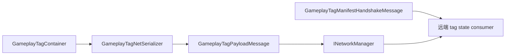

# CycloneGames.GameplayTags.Networking

[English](./README.md) | 简体中文

`CycloneGames.GameplayTags.Networking` 是 `CycloneGames.GameplayTags` 面向 `CycloneGames.Networking` 的网络桥接包。该包提供协议元数据和与传输无关的消息 DTO，用于通过 Cyclone Networking 同步 gameplay tag container。

基础包 `CycloneGames.GameplayTags` 不依赖 `CycloneGames.Networking`。未引用网络包的项目直接使用 GameplayTags 基础能力，不需要安装本桥接包。

## 包结构

```text
CycloneGames.GameplayTags.Networking/
  Core/
    CycloneGames.GameplayTags.Networking.Core.asmdef
    GameplayTagsNetworkProtocol.cs
  Tests/Editor/
    CycloneGames.GameplayTags.Networking.Tests.Editor.asmdef
    GameplayTagsNetworkingIntegrationTests.cs
```

## 程序集边界

| Assembly | 职责 | Unity 依赖 |
| --- | --- | --- |
| `CycloneGames.GameplayTags.Networking.Core` | 消息范围、catalog 注册、manifest handshake、full-state 消息、delta 消息、full-state request DTO。 | 无 |
| `CycloneGames.GameplayTags.Networking.Tests.Editor` | 覆盖协议注册和 payload 行为的 EditMode 测试。 | 无 |

Core assembly 引用 `CycloneGames.GameplayTags.Core` 和 `CycloneGames.Networking.Core`。它不使用 PlayerSettings scripting define symbols、Unity 生命周期、后端 SDK 类型或特定 DI 容器。

## 核心概念

| 类型 | 作用 |
| --- | --- |
| `GameplayTagManifestHandshakeMessage` | 携带本地 GameplayTags manifest hash 和支持的 serializer version 范围。 |
| `GameplayTagPayloadMessage` | 为 full 或 delta GameplayTags payload 增加 target id、sequence、protocol version 和 manifest hash。 |
| `GameplayTagFullStateRequestMessage` | 请求某个 target network object 的完整 tag container 刷新。 |
| `GameplayTagsNetworkProtocol` | 拥有 GameplayTags 消息范围，并向 `INetworkMessageCatalog` 注册 descriptor。 |

## State Sync 流程



## 协议

`GameplayTagsNetworkProtocol` 在 Cyclone module range 中拥有 `12000-12999` 消息 ID。

| Message | ID | Channel | Payload |
| --- | ---: | --- | --- |
| `MsgManifestHandshake` | `12000` | Reliable | `GameplayTagManifestHandshakeMessage` |
| `MsgFullState` | `12001` | Reliable | `GameplayTagPayloadMessage` |
| `MsgDelta` | `12002` | Reliable | `GameplayTagPayloadMessage` |
| `MsgFullStateRequest` | `12003` | Reliable | `GameplayTagFullStateRequestMessage` |

当已存在的 descriptor 拥有相同 owner、类型名、schema hash、kind、channel 和 payload limit 时，catalog 注册是幂等的。

## 快速接入

在网络 composition 阶段注册消息 catalog：

```csharp
using CycloneGames.GameplayTags.Networking;
using CycloneGames.Networking;

public static class GameplayTagNetworkInstaller
{
    public static void Configure(INetworkMessageCatalog catalog)
    {
        GameplayTagsNetworkProtocol.RegisterMessageCatalog(catalog);
    }
}
```

非 DI bootstrap 在 network manager 暴露 `INetworkRuntimeContextProvider`，且 runtime context 中包含 `INetworkMessageCatalog` 服务后调用 `TryRegisterMessageCatalog(INetworkManager)`：

```csharp
using CycloneGames.GameplayTags.Networking;
using CycloneGames.Networking;

public static class GameplayTagNetworkBootstrap
{
    public static bool TryConfigure(INetworkManager manager)
    {
        return GameplayTagsNetworkProtocol.TryRegisterMessageCatalog(manager);
    }
}
```

## Payload 流程

先使用 `GameplayTagNetSerializer` 创建 payload bytes，再用协议 helper 包装：

```csharp
using CycloneGames.GameplayTags.Core;
using CycloneGames.GameplayTags.Networking;

public static class GameplayTagPayloadFactory
{
    public static GameplayTagPayloadMessage CreateDelta(
        uint targetNetworkId,
        GameplayTagContainer current,
        GameplayTagContainer previous,
        ushort sequence)
    {
        byte[] payload = GameplayTagNetSerializer.SerializeDelta(current, previous);
        return GameplayTagsNetworkProtocol.CreateDeltaMessage(targetNetworkId, payload, sequence);
    }
}
```

`CreateFullStateMessage` 和 `CreateDeltaMessage` 会在构造 wrapper 前验证 serialized payload kind 与 network message kind 是否一致。

## 扩展点

- 项目自有 GameplayTags 消息放在项目 assembly 中，并通过 `NetworkMessageKind.User` manifest 注册。
- 具体后端传输代码保留在 adapter 层；本包只定义可发送和接收的 DTO。
- 应用远端 tag state 前，使用 `GameplayTagManifestHandshakeMessage.IsCompatibleWithLocalManifest()` 做 manifest 兼容性检查。

## 持久化

本包不写入文件、资产、偏好设置、缓存或运行时存档。Unity `.meta` 文件是资产元数据，随包进入版本控制。

## 验证

修改本包后运行以下检查：

```text
Unity Test Runner > EditMode > CycloneGames.GameplayTags.Networking.Tests.Editor
Unity Test Runner > EditMode > CycloneGames.GameplayTags.Tests.Editor
Unity Test Runner > EditMode > CycloneGames.Networking.Tests.Editor
```
