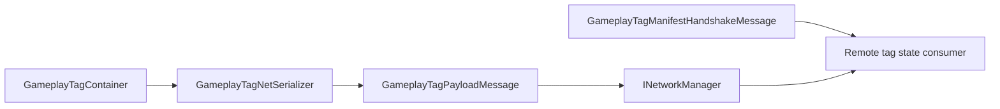

# CycloneGames.GameplayTags.Networking

English | [Simplified Chinese](./README.SCH.md)

`CycloneGames.GameplayTags.Networking` is the Cyclone Networking bridge for `CycloneGames.GameplayTags`. The package adds protocol metadata and transport-neutral message DTOs for synchronizing gameplay tag containers through `CycloneGames.Networking`.

The base `CycloneGames.GameplayTags` package remains independent from `CycloneGames.Networking`. Projects that do not reference the networking package can use GameplayTags without this bridge.

## Package Layout

```text
CycloneGames.GameplayTags.Networking/
  Core/
    CycloneGames.GameplayTags.Networking.Core.asmdef
    GameplayTagsNetworkProtocol.cs
  Tests/Editor/
    CycloneGames.GameplayTags.Networking.Tests.Editor.asmdef
    GameplayTagsNetworkingIntegrationTests.cs
```

## Assembly Boundary

| Assembly | Role | Unity dependency |
| --- | --- | --- |
| `CycloneGames.GameplayTags.Networking.Core` | Message range, catalog registration, manifest handshake, full-state message, delta message, and full-state request DTOs. | No |
| `CycloneGames.GameplayTags.Networking.Tests.Editor` | EditMode coverage for protocol registration and payload behavior. | No |

The core assembly references `CycloneGames.GameplayTags.Core` and `CycloneGames.Networking.Core`. It does not use PlayerSettings scripting define symbols, Unity lifecycle hooks, backend SDK types, or a DI container.

## Core Concepts

| Type | Purpose |
| --- | --- |
| `GameplayTagManifestHandshakeMessage` | Carries the local GameplayTags manifest hash and supported serializer version range. |
| `GameplayTagPayloadMessage` | Wraps a serialized full or delta GameplayTags payload with target id, sequence, protocol version, and manifest hash. |
| `GameplayTagFullStateRequestMessage` | Requests a full tag container refresh for one target network object. |
| `GameplayTagsNetworkProtocol` | Owns the GameplayTags message range and registers descriptors in `INetworkMessageCatalog`. |

## State Sync Flow



## Protocol

`GameplayTagsNetworkProtocol` owns message ids `12000-12999` in the Cyclone module range.

| Message | ID | Channel | Payload |
| --- | ---: | --- | --- |
| `MsgManifestHandshake` | `12000` | Reliable | `GameplayTagManifestHandshakeMessage` |
| `MsgFullState` | `12001` | Reliable | `GameplayTagPayloadMessage` |
| `MsgDelta` | `12002` | Reliable | `GameplayTagPayloadMessage` |
| `MsgFullStateRequest` | `12003` | Reliable | `GameplayTagFullStateRequestMessage` |

Catalog registration is idempotent when the existing descriptor has the same owner, type name, schema hash, kind, channel, and payload limit.

## Quick Start

Register the message catalog during the network composition phase:

```csharp
using CycloneGames.GameplayTags.Networking;
using CycloneGames.Networking;

public static class GameplayTagNetworkInstaller
{
    public static void Configure(INetworkMessageCatalog catalog)
    {
        GameplayTagsNetworkProtocol.RegisterMessageCatalog(catalog);
    }
}
```

For non-DI bootstraps, call `TryRegisterMessageCatalog(INetworkManager)` after the network manager exposes an `INetworkRuntimeContextProvider` with an `INetworkMessageCatalog` service:

```csharp
using CycloneGames.GameplayTags.Networking;
using CycloneGames.Networking;

public static class GameplayTagNetworkBootstrap
{
    public static bool TryConfigure(INetworkManager manager)
    {
        return GameplayTagsNetworkProtocol.TryRegisterMessageCatalog(manager);
    }
}
```

## Payload Workflow

Create payload bytes with `GameplayTagNetSerializer`, then wrap those bytes with the protocol helper:

```csharp
using CycloneGames.GameplayTags.Core;
using CycloneGames.GameplayTags.Networking;

public static class GameplayTagPayloadFactory
{
    public static GameplayTagPayloadMessage CreateDelta(
        uint targetNetworkId,
        GameplayTagContainer current,
        GameplayTagContainer previous,
        ushort sequence)
    {
        byte[] payload = GameplayTagNetSerializer.SerializeDelta(current, previous);
        return GameplayTagsNetworkProtocol.CreateDeltaMessage(targetNetworkId, payload, sequence);
    }
}
```

`CreateFullStateMessage` and `CreateDeltaMessage` validate that the serialized payload kind matches the network message kind before constructing the wrapper.

## Extension Points

- Register project-owned GameplayTags messages in a project assembly by using a `NetworkMessageKind.User` manifest.
- Keep backend-specific transport code outside this package. Adapters only need to send and receive the DTOs declared here.
- Perform manifest compatibility checks with `GameplayTagManifestHandshakeMessage.IsCompatibleWithLocalManifest()` before applying remote tag state.

## Persistence

This package does not write files, assets, preferences, caches, or runtime save data. Unity `.meta` files are asset metadata and remain version-controlled with the package.

## Validation

Run these checks after changing the package:

```text
Unity Test Runner > EditMode > CycloneGames.GameplayTags.Networking.Tests.Editor
Unity Test Runner > EditMode > CycloneGames.GameplayTags.Tests.Editor
Unity Test Runner > EditMode > CycloneGames.Networking.Tests.Editor
```
