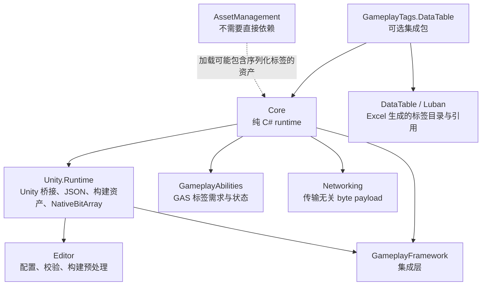

# CycloneGames.GameplayTags

[English](./README.md) | 简体中文

`CycloneGames.GameplayTags` 是面向 Unity foundation project 的生产级 Gameplay Tags 模块。它提供纯 C# 核心，用于标签注册、查询、容器、计数容器、查询表达式、掩码、重定向和网络序列化，并提供 Unity Runtime / Editor 桥接，用于 JSON 文件、Inspector、构建期烘焙和校验工具。

该模块设计为 `CycloneGames.GameplayAbilities`、`CycloneGames.GameplayFramework`、`CycloneGames.Networking`、`CycloneGames.AssetManagement`、headless simulation、CLI tests 和未来非 Unity adapter 的可复用依赖。Core 契约不暴露 Unity 类型。

## 包结构

```text
CycloneGames.GameplayTags/
  Core/
    CycloneGames.GameplayTags.Core.asmdef
    GameplayTag.cs
    GameplayTagManager.cs
    GameplayTagContainer.cs
    GameplayTagCountContainer.cs
    GameplayTagQuery.cs
    GameplayTagMask.cs
    GameplayTagNetSerializer.cs
  Unity.Runtime/
    CycloneGames.GameplayTags.Unity.Runtime.asmdef
    FileGameplayTagSource.cs
    GameObjectGameplayTagContainer.cs
    NativeGameplayTagMask.cs
  Editor/
    CycloneGames.GameplayTags.Unity.Editor.asmdef
    GameplayTagEditorWindow.cs
    GameplayTagContainerPropertyDrawer.cs
    GameplayTagValidationReporter.cs
    BuildTags.cs
  Tests/Editor/
    GameplayTagsCoreTests.cs
  Tests/Performance/
    GameplayTagsPerformanceTests.cs
  SourceGenerator~/
    GameplayTagsSourceGenerator.cs
```

可选集成以独立集成包形式分发。`CycloneGames.GameplayTags.DataTable` 在项目明确同时包含 `CycloneGames.GameplayTags` 和 `CycloneGames.DataTable` 时提供 DataTable/Luban 桥接。



## 程序集边界

| Assembly | 职责 | Unity 依赖 | Unsafe code |
| --- | --- | --- | --- |
| `CycloneGames.GameplayTags.Core` | 标签、容器、查询、掩码、重定向、构建二进制读取、网络序列化 | 无 | 无 |
| `CycloneGames.GameplayTags.Unity.Runtime` | Unity bootstrap、JSON 项目源、`GameObjectGameplayTagContainer`、`NativeGameplayTagMask` | 有 | 无 |
| `CycloneGames.GameplayTags.Unity.Editor` | 管理窗口、Inspector、校验、构建期烘焙、文件监听 | 仅 Editor | 无 |
| `CycloneGames.GameplayTags.Tests.Editor` | Core 回归测试 | Editor test runner | 无 |
| `CycloneGames.GameplayTags.Tests.Performance` | 容器、查询、掩码和网络序列化 benchmark | Editor performance test runner | 无 |

Core assembly 是 GameplayAbilities 和服务器/headless 逻辑消费的主要契约。Unity 相关逻辑被限制在 adapter 中，以便 GameplayTags 保持稳定底层模块定位。

DataTable/Luban 桥接位于独立的 `CycloneGames.GameplayTags.DataTable` 集成包中，因此基础包永远不会引用 `CycloneGames.DataTable.Core`。

## 依赖

当前包声明以下 Unity package 依赖，因为 Runtime assembly 直接使用它们：

| Package | 用途 |
| --- | --- |
| `com.cyclone-games.hash` | Stable tag ID、manifest hash 和构建 payload check |
| `com.unity.collections` | `NativeGameplayTagMask` 和 `NativeBitArray` 桥接 |
| `com.unity.burst` | 可选 `[BurstCompile]` 注解路径 |
| `com.unity.nuget.newtonsoft-json` | `ProjectSettings/GameplayTags/` 下的 JSON 标签源 |

`com.unity.entities` 不是硬依赖。`GameplayTagMaskComponent.cs` 由 `CYCLONE_HAS_ENTITIES` 保护；需要 Entities 的项目应将 Entities bridge 放入可选 integration assembly，并通过 `versionDefines` 和显式 package dependency 启用。

DataTable 支持不再通过 ProjectSettings scripting define symbols 接入。项目包含 `CycloneGames.DataTable` 时，使用 `CycloneGames.GameplayTags.DataTable` 集成包：

- UPM 分发时安装 `com.cyclone-games.gameplay-tags.data-table`；它的 `package.json` 声明了 `com.cyclone-games.gameplay-tags` 和 `com.cyclone-games.data-table`。
- Assets 直放分发时，仅在项目同时包含 `CycloneGames.GameplayTags/` 与 `CycloneGames.DataTable/` 时引入 `CycloneGames.GameplayTags.DataTable/` 文件夹。

这样基础包保持干净，DataTable 缺失时不会出现 missing asmdef 编译错误，并且 Assets 直放与 UPM 包两种形态的行为一致。

## 核心概念

### `GameplayTag`

`GameplayTag` 是轻量值，保存稳定标签名和当前快照内的 runtime index。Runtime index 很快，但不是持久化或网络契约。标签表 reload 或动态扩展后，tag 会先校验缓存 index 是否仍指向同名标签，必要时按名称重新解析。

`GameplayTag.None` 只表示空值。容器会拒绝 `None` 和 invalid tag。

### `TagDataSnapshot`

`GameplayTagManager` 通过 `Volatile.Write` 发布不可变 `TagDataSnapshot`。读者获取一次快照引用后即可无锁访问数组。动态注册等变更会在锁内构建新快照，再原子发布。

每个注册标签拥有：

- 名称、label、description、层级深度和 flags。
- 本地查询用 runtime index。
- 网络和 manifest 校验用 64 位 stable ID。
- 存在 flat array 中的 parent、child、hierarchy span。

### 容器

| 类型 | 用途 |
| --- | --- |
| `GameplayTagContainer` | 显式标签与隐式父级标签集合。适合作为 gameplay state 和 authoring 字段默认容器。 |
| `GameplayTagCountContainer` | 带引用计数和事件的标签容器。适合 GAS effect、buff、可叠加状态。 |
| `GameplayTagHierarchicalContainer` | 子容器，将显式变化传播到父计数容器。适合组合 owner。 |
| `ReadOnlyGameplayTagContainer` | 不可变快照，适合 worker thread、网络和稳定比较。 |

`GameplayTagContainer` 同时维护 Unity 序列化需要的标签名和热路径需要的 runtime index。纯运行时容器不会无意义创建序列化字符串列表，除非该列表已存在或显式调用 `FlushSerializedState()`。

### 查询

`GameplayTagQuery` 将嵌套表达式编译为 token stream 并缓存。已编译 query 在热路径评估中把表达式图视为不可变数据。如果运行中原地修改 `RootExpression`、嵌套表达式或嵌套 tag container，需要在下一次匹配前调用 `InvalidateCompiledCache()`。如果直接替换为新的 `RootExpression` 引用，会自动重新编译。

### 掩码

`GameplayTagMask` 是 32 字节、256 位 value type，适合 tag 总量小于 256 runtime index 的热路径。它使用安全 word 访问，不使用 unsafe 指针重解释。超过该规模时可使用 `GameplayTagMaskLarge`。

密集重复检查用 mask。需要精确显式标签、层级展开、序列化或动态标签规模时用 container。

## 标签配置

### 程序集特性

```csharp
using CycloneGames.GameplayTags.Core;

[assembly: GameplayTag("Ability.Damage.Fire")]
[assembly: GameplayTag("State.CrowdControl.Stunned")]
```

### 静态类注册

```csharp
using CycloneGames.GameplayTags.Core;

[assembly: RegisterGameplayTagsFrom(typeof(ProjectGameplayTags))]

public static class ProjectGameplayTags
{
    public const string AbilityDamageFire = "Ability.Damage.Fire";
    public const string StateStunned = "State.CrowdControl.Stunned";
}
```

### JSON 文件

Unity 项目可以在以下目录配置标签：

```text
<unity-project-root>/ProjectSettings/GameplayTags/*.json
```

示例：

```json
{
  "Ability.Damage.Fire": {
    "Comment": "Fire damage ability tag."
  },
  "State.CrowdControl.Stunned": {
    "Comment": "The actor cannot move or cast normal abilities."
  }
}
```

Editor 文件监听器会在 JSON 文件变化后 reload 标签。构建预处理会把 leaf tag 烘焙到 `Assets/Resources/GameplayTags.bytes`，构建后删除该生成资产。

### DataTable 与 Luban

当项目通过 `CycloneGames.DataTable` 接入 Excel/Luban 生成数据，并希望由生成行提供 gameplay tag catalog 或 gameplay-data tag references 时，使用 `CycloneGames.GameplayTags.DataTable`。该集成包用于在 GameplayTags 快照初始化前，把生成的标签目录和生成配置中的 tag 引用注册到 `GameplayTagManager`。

接入前置条件：

1. 引入 `CycloneGames.GameplayTags`。
2. 引入 `CycloneGames.DataTable`。
3. 引入 `CycloneGames.GameplayTags.DataTable`。
4. 在负责加载生成行的启动/composition 程序集中，显式引用 `CycloneGames.GameplayTags.DataTable` asmdef。

当一条生成行代表一个 gameplay tag 定义时，使用 `GameplayTagDataTableSource<TRow>`：

```csharp
DataTable<TagRow> tagTable = DataTableRegistry.Get<DataTable<TagRow>>();

GameplayTagRuntimePlatform.RegisterProjectTagSource(new GameplayTagDataTableSource<TagRow>(
    "Design.GameplayTags",
    tagTable,
    static row => row.Name,
    static row => row.Comment,
    static row => row.Flags,
    static row => row.Enabled));

GameplayTagManager.InitializeIfNeeded();
```

推荐 Excel 字段：

| 字段 | 用途 |
| --- | --- |
| `Id` | DataTable 主键，只用于表查询，不是网络 stable ID。 |
| `Name` | 完整 Gameplay Tag 名称，例如 `Ability.Fireball`。 |
| `Comment` | 展示在校验工具和 Editor 工具中的配置说明。 |
| `Flags` | 可选 `GameplayTagFlags` 值。 |
| `Enabled` | 可选启用开关，用于灰度、废弃或分阶段内容。 |
| `Owner` | 可选负责人或系统归属，用于审核流程。 |
| `Deprecated` / `RedirectTo` | 可选迁移元数据，由项目侧校验工具处理。 |

如果 `GameplayAbility` 或 `GameplayEffect` 定义也由 Luban 生成，可以把 tag 引用存为字符串或生成的字符串列表。`GameplayTagDataTableReferenceSource<TRow>` 会在构建 GAS 定义前，从这些行中收集被引用的 tag：

```csharp
DataTable<AbilityRow> abilityTable = DataTableRegistry.Get<DataTable<AbilityRow>>();

GameplayTagRuntimePlatform.RegisterProjectTagSource(new GameplayTagDataTableReferenceSource<AbilityRow>(
    "Design.Abilities",
    abilityTable,
    static row => row.AbilityTags,
    static row => row.ActivationRequiredTags,
    static row => row.ActivationBlockedTags,
    static row => row.ActivationOwnedTags));
```

推荐启动顺序：

1. 加载 Luban bytes，并把生成表注册到 `DataTableRegistry`。
2. 注册 DataTable-backed gameplay tag sources。
3. 调用 `GameplayTagManager.InitializeIfNeeded()`。
4. 从生成行构建 GameplayAbilities / GameplayEffects，并把 tag-name 字段转换为容器。

生产构建中，静态 tag catalog 也可以在 Editor/CI 构建阶段烘焙进 `GameplayTags.bytes`。这样运行时不一定要再加载 tag catalog 表，而 Ability/Effect 生成行仍然可以用 tag name 作为引用契约。

### 动态注册

```csharp
GameplayTagManager.RegisterDynamicTag("Hotfix.Event.DoubleDrop", "Hotfix event tag.");
GameplayTagManager.RegisterDynamicTagsFromAssembly(hotUpdateAssembly);
GameplayTagManager.RegisterDynamicTags(serverProvidedTags);
```

动态注册用于热更新和服务器配置工作流。`RegisterDynamicTags`、`RegisterDynamicTagsFromType` 和 `RegisterDynamicTagsFromAssembly` 等批量 API 会先追加所有新标签，再只重建并广播一次。这是 HybridCLR 热更新程序集加载的推荐路径。动态注册会改变当前 manifest hash，因此活跃网络 peer 在标签表变化后必须重新同步已复制的 tag container。

## 运行时用法

```csharp
GameplayTag fire = GameplayTagManager.RequestTag("Ability.Damage.Fire");
GameplayTag stunned = GameplayTagManager.RequestTag("State.CrowdControl.Stunned");

GameplayTagContainer tags = new();
tags.AddTag(fire);

bool hasDamage = tags.HasTag(GameplayTagManager.RequestTag("Ability.Damage"));
bool hasFireExact = tags.HasTagExact(fire);
```

当用户数据、存档或网络数据可能包含未知 tag 时，使用 `TryRequestTag`：

```csharp
if (GameplayTagManager.TryRequestTag(tagName, out GameplayTag tag))
{
    tags.AddTag(tag);
}
```

GAS 风格需求判断：

```csharp
GameplayTagRequirements requirements = new(forbiddenTags, requiredTags);
bool allowed = requirements.Matches(sourceTags, targetTags);
```

对 DataTable 或 Luban 生成行，在构建定义对象时把名称转换为容器：

```csharp
GameplayTagContainer abilityTags = GameplayTagContainerNameExtensions.FromTagNames(row.AbilityTags);
GameplayTagRequirements activationRequirements = GameplayTagContainerNameExtensions.CreateRequirementsFromTagNames(
    row.ActivationBlockedTags,
    row.ActivationRequiredTags);

GameplayTagContainer cues = GameplayTagContainerNameExtensions.FromDelimitedTagNames(row.GameplayCueTags, '|');
```

默认转换模式是严格的：未知或空 tag name 会抛出异常。只有迁移工具、可选旧数据或已经由其他流程校验的分阶段内容，才建议使用 `ignoreMissing: true`。

## 网络

`GameplayTagNetSerializer` 与具体网络框架无关，可用于 `CycloneGames.Networking`、Mirror、Netcode for GameObjects、FishNet 或自定义 transport。

当前包格式使用 stable tag ID 和 manifest hash：

```text
Full:
[protocolVersion:byte=1][marker:byte=0xFE][manifestHash:uint64][count:int32][stableId:uint64 x count]

Delta:
[protocolVersion:byte=1][marker:byte=0xFD][manifestHash:uint64][addCount:int32][addStableId:uint64 x addCount][removeCount:int32][removeStableId:uint64 x removeCount]

Mask:
[word0:uint64][word1:uint64][word2:uint64][word3:uint64]
```

`CurrentProtocolVersion` 是 GameplayTags serializer 自己的 wire-format 版本。它故意比整个游戏网络协议版本更窄。大型 live-service 游戏仍应在外层 compatibility handshake 中交换 game build、content build、gameplay data version、支持的 gameplay protocol range、feature flags，以及 `GameplayTagManager.CurrentManifestHash`。

Serializer 会校验 buffer 长度、负 count、count 乘法溢出、包 marker、protocol version 和 manifest hash。Manifest 匹配但 stable ID 不存在时，会被视为协议数据损坏。Runtime index 永远不作为网络契约。

```csharp
byte[] fullPacket = GameplayTagNetSerializer.SerializeFull(container);
GameplayTagNetSerializer.DeserializeFull(remoteContainer, fullPacket);

byte[] deltaPacket = GameplayTagNetSerializer.SerializeDelta(currentContainer, previousContainer);
GameplayTagNetSerializer.ApplyDelta(remoteContainer, deltaPacket);

byte[] buffer = new byte[GameplayTagNetSerializer.GetFullSerializedSize(container)];
int written = GameplayTagNetSerializer.SerializeFull(container, buffer, 0);

byte[] deltaBuffer = new byte[GameplayTagNetSerializer.GetDeltaSerializedSize(addCount, removeCount)];
int deltaWritten = GameplayTagNetSerializer.SerializeDelta(currentContainer, previousContainer, deltaBuffer, 0);
```

大型 MMORPG 部署中，应把 tag manifest 纳入 client/server compatibility handshake。`GameplayTagManager.CurrentManifestHash` 不一致的 client 和 server 不应交换 gameplay tag 状态，直到 reload 或 patch 流程完成 manifest 对齐。如果未来 serializer 版本需要向后兼容，应保持 `MinimumSupportedProtocolVersion`、`CurrentProtocolVersion` 和按版本分支的 decode path 显式可见，并用跨版本测试覆盖。

## Unity Runtime

`GameObjectGameplayTagContainer` 将序列化的 persistent tags 桥接为运行时 `GameplayTagCountContainer`。它支持 lazy initialization，因此系统即使在 `Awake` 前绑定也能拿到有效容器。

```csharp
GameObjectGameplayTagContainer component = GetComponent<GameObjectGameplayTagContainer>();
GameplayTagCountContainer runtimeTags = component.GameplayTagContainer;
```

`GameplayTagContainerBinds` 将 tag 是否存在绑定到 boolean callback，并提供确定性的 `UnbindAll()` 清理路径。

## Jobs 与数据导向用法

`NativeGameplayTagMask` 可以把托管 container 或 mask 复制到 `NativeBitArray`，用于 Jobs/Burst 风格工作流：

```csharp
using NativeGameplayTagMask nativeMask = new(Allocator.TempJob);
nativeMask.CopyFrom(readOnlySnapshot);
```

在 tags 初始化后，在主线程创建并填充 native mask。按 allocator 生命周期调用 `Dispose()`。

## Editor 工具

| 工具 | 路径 |
| --- | --- |
| Gameplay Tag Manager | `Tools/CycloneGames/GameplayTags/Gameplay Tag Manager` |
| Validation Window | `Tools/CycloneGames/GameplayTags/Tag Validation Window` |
| Inspector drawer | `GameplayTag` 和 `GameplayTagContainer` 序列化字段 |
| Build bake | `BuildTags` build preprocess/postprocess hooks |

Gameplay Tag Manager 提供搜索、source 展示、增删操作、右键复制/创建子 tag，以及选中 tag 的详情面板，可查看 stable ID、manifest hash、层级、flags 和来源信息。

Inspector drawer 为 `GameplayTag` 和 `GameplayTagContainer` 提供可搜索选择器。Container 字段在 Inspector 中显示带总数的有限摘要，完整编辑仍放在 tag picker popup 中；当只显示前几个 tags 时，会提供 `View All` 快捷入口，避免大量 tags 把组件 Inspector 无限拉长。

Editor 修复操作使用 `SerializedObject`、Undo、dirty 标记和 scene dirty 标记。Validation Window 会扫描 Prefab、ScriptableObject 和已打开场景中的无效序列化 `GameplayTag` 与 `GameplayTagContainer` tag name，并支持 ping、单项移除和批量修复。

## 持久化与生成文件

| 数据 | 路径 | 格式 | Owner | 是否进版本 | 清理方式 |
| --- | --- | --- | --- | --- | --- |
| 配置的标签文件 | `UnityStarter/ProjectSettings/GameplayTags/*.json` | JSON object | GameplayTags Editor tools 和用户 | 项目可选择纳入 Git | 迁移后手动删除不用的 JSON |
| 构建烘焙标签 | `UnityStarter/Assets/Resources/GameplayTags.bytes` | Binary format + payloadHash64 | `BuildTags` preprocess hook | 否，构建前生成、构建后删除 | `BuildTags.OnPostprocessBuild` 删除 asset 和 `.meta` |
| 运行时容器 | 仅内存，除非由宿主对象序列化 | tag names + runtime indices | owning gameplay object/service | 取决于宿主对象 | 清理 owner state 或调用 container `Clear()` |

模块不使用 `EditorPrefs`、`PlayerPrefs`、registry、plist 或隐藏全局状态保存标签配置。

## 集成说明

### GameplayAbilities

GameplayAbilities 应依赖 `CycloneGames.GameplayTags.Core`。Ability activation、owned tags、blocked tags、effect-granted tags 和 stack-sensitive state 使用 container、requirements 和 count container。不要在 ability spec 中序列化 runtime index；需要跨进程时使用 tag name、stable ID 或本模块 serializer。

GameplayAbilities 不要求 GameplayEffect 或 GameplayAbility 定义一定来自 ScriptableObject。生成行 adapter 可以加载 Luban 行，用 `GameplayTagContainerNameExtensions` 创建 `GameplayTagContainer`，再把这些容器传入纯运行时 `GameplayAbility.Initialize(...)` 或 `GameplayEffect` 构造函数。应先初始化 GameplayTags，再构建这些定义，让错误表格数据在启动阶段暴露，而不是在战斗热路径中失败。

当项目使用 `CycloneGames.GameplayTags.DataTable` 集成包，并希望 Ability/Effect 表也成为引用 tag 的来源时，在启动阶段注册 `GameplayTagDataTableReferenceSource<TRow>`。对更严格的 live-service 生产流程，推荐保留单独的 `GameplayTag` catalog 表作为权威来源，把 Ability/Effect 表中的 tag 引用作为校验输入。

### GameplayFramework

GameplayFramework integration 可依赖 `Core` 和 `Unity.Runtime`。场景侧组件应在初始化时桥接到纯 C# container，不要把 Unity 对象引用塞入 tag 逻辑。

### Networking

Networking 层应把 GameplayTags 包视作 payload，并在应用复制状态前做 manifest 兼容校验。Transport 不需要理解 tag 层级。

### AssetManagement

AssetManagement 不需要直接依赖 GameplayTags。资产可以包含序列化的 `GameplayTag` 或 `GameplayTagContainer` 字段；消费依赖 tag lookup 的已加载资产前，应保证 tags 已初始化。

## 性能与平台注意事项

- 热路径查询使用 runtime index 和 flat array。
- 初始化后 snapshot 读取无锁。
- Container 枚举使用自定义 struct enumerator。
- `GameplayTagMask` 固定大小，适合 AOT 平台。
- 网络序列化使用 little-endian，在支持平台上确定一致。
- Full 和 delta 网络序列化都提供预分配 buffer 重载，适合 low-GC 复制循环。
- 复杂 `GameplayTagQuery` 会编译一次；authoring 阶段或运行时原地修改表达式后应显式调用 `InvalidateCompiledCache()`。
- Tag name 使用 `StringComparison.Ordinal`，配置时大小写敏感。
- Runtime index 只属于当前 snapshot，不得作为权威数据保存或发送。
- 热路径 tag 数超过 256 时，使用 `GameplayTagMaskLarge` 或 container，不要强行使用 `GameplayTagMask`。
- 性能覆盖位于 `CycloneGames.GameplayTags.Tests.Performance`，测量 container bitset lookup、256-bit mask、wide query matching、full serialization 和预分配 buffer delta serialization。

## 验证

本包使用的 CLI 检查：

```bash
dotnet build CycloneGames.GameplayTags.Core.csproj -v:minimal
dotnet build CycloneGames.GameplayTags.Tests.Editor.csproj -v:minimal
dotnet build CycloneGames.GameplayTags.Unity.Runtime.csproj -v:minimal
dotnet build CycloneGames.GameplayTags.Unity.Editor.csproj -v:minimal
```

Unity 重新生成工程文件后，也可以从 CLI 编译 `CycloneGames.GameplayTags.Tests.Performance.csproj`。在该 csproj 生成前，请通过 Unity Test Runner 运行 performance assembly。

引入 `CycloneGames.GameplayTags.DataTable` 集成包时，按该包 README 验证它的 runtime 和 test assembly。

建议 Unity Editor 验证：

1. 从 `<repo-root>/UnityStarter` 打开 Unity 项目。
2. 运行 `CycloneGames.GameplayTags.Tests.Editor` 下的 EditMode tests。
3. 如果引入了 DataTable 集成包，运行 `CycloneGames.GameplayTags.DataTable.Tests.Editor` 下的 EditMode tests。
4. 运行 `CycloneGames.GameplayTags.Tests.Performance` 的 performance tests，并对比 hot-path 变更前后的 Time 和 `Time.GC()` sample group。
5. 打开 `Tools/CycloneGames/GameplayTags/Gameplay Tag Manager`，在 `ProjectSettings/GameplayTags/` 创建测试 tag。
6. 在测试 asset 或 component 上添加 `GameplayTagContainer` 字段，验证 selector、clear action 和 invalid tag 展示。
7. 打开 `Tools/CycloneGames/GameplayTags/Tag Validation Window`，扫描项目资产和已打开场景，并验证 fix 操作可 Undo。
8. 做一次 development build，确认 `Assets/Resources/GameplayTags.bytes` 在 build preprocess 生成，并在 postprocess 后删除。
