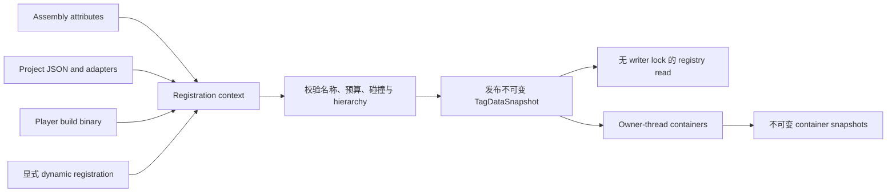

# CycloneGames.GameplayTags

[English | 简体中文](README.md)

以虚幻引擎的 GameplayTags 系统为蓝本，本模块提供分层标签（`State.CrowdControl.Stunned`）、自动父标签解析的标签容器和编译后的标签查询——UE 开发者用标签连接技能、效果、AI 和 UI 而不引入硬引用的那套方法，在 Unity 里同样可用。

## 目录

- [概述](#概述)
- [架构](#架构)
- [快速上手](#快速上手)
- [核心概念](#核心概念)
- [使用指南](#使用指南)
- [进阶主题](#进阶主题)
- [常见场景](#常见场景)
- [性能与内存](#性能与内存)
- [故障排查](#故障排查)

## 概述

玩法标签是一个带有点分层次名称的紧凑标签，如 `State.CrowdControl.Stunned`。注册表校验名称、解析父标签并发布不可变快照。容器追踪显式标签并计算派生父成员关系。查询通过预编译布尔表达式评估容器状态。

适用场景：

- 多个系统（技能、效果、AI、UI）需要共享标签词汇表。
- 标签形成层级结构，例如 `State.CrowdControl` 包含 `State.CrowdControl.Stunned`。
- 热路径上需要零分配查找和容器比较。

### 主要特性

- **分层标签注册表**，支持原子快照发布与无锁读取。
- **GameplayTagContainer** 提供显式成员关系与自动父标签解析。
- **GameplayTagCountContainer** 提供稀疏叠加计数与同步变更通知。
- **GameplayTagQuery** 提供编译后的 `All`/`Any`/`None` 谓词匹配，使用 1 KiB 栈临时空间。
- **多种定义来源**：项目 JSON、程序集属性、静态目录、动态注册和 DataTable 适配器。
- **纯 C# Core 程序集**，`noEngineReferences: true`；编辑器工具位于独立程序集。

## 架构

| 程序集 | 职责 | 直接依赖 |
| --- | --- | --- |
| `CycloneGames.GameplayTags.Core` | 注册表、值、容器、计数、查询与 Player catalog contract | `CycloneGames.Hash.Core`；`noEngineReferences` |
| `CycloneGames.GameplayTags.Unity.Runtime` | Unity logging/bootstrap、`Resources` build data loading、`GameObject` component adapter | GameplayTags Core |
| `CycloneGames.GameplayTags.Unity.Editor` | JSON authoring、manager window、drawer、validation、file watcher、build bake | Core、Unity Runtime、Newtonsoft.Json；仅 Editor |



Writer 在发布前构建完整 candidate。非法输入、stable-ID collision 或预算失败不会修改当前 snapshot。Tree-change notification 在发布后于 registry writer lock 之外同步执行。

## 快速上手

在 asmdef 中添加对 `CycloneGames.GameplayTags.Core` 的引用，然后：

```csharp
using CycloneGames.GameplayTags.Core;

GameplayTagManager.InitializeIfNeeded();

GameplayTag stunned = GameplayTagManager.RequestTag("State.CrowdControl.Stunned");
GameplayTag crowdControl = GameplayTagManager.RequestTag("State.CrowdControl");

GameplayTagContainer state = new();
state.AddTag(stunned);

bool exact = state.HasTagExact(stunned);     // true
bool inherited = state.HasTag(crowdControl); // true
```

可选内容使用 `TryRequestTag`，并缓存结果：

```csharp
if (GameplayTagManager.TryRequestTag("Feature.Seasonal.Active", out GameplayTag seasonal))
{
    // 缓存 seasonal，不要在每帧通过字符串请求标签。
}
```

`GameplayTag.None` 保留 runtime index 0，不能作为有效容器成员。

## 核心概念

### 关键类型

| 类型 | 职责 | Owner 与生命周期 |
| --- | --- | --- |
| `GameplayTag` | 以分层名称标识的可序列化值 | 可复制值；名称是稳定 identity |
| `GameplayTagManager` | 进程级注册表 Facade 与原子 snapshot 发布 | 应用或 subsystem 生命周期 |
| `TagDataSnapshot` | 含 hierarchy 与 lookup table 的不可变注册表 generation | 由 manager 发布，reader 捕获引用 |
| `IReadOnlyGameplayTagContainer` | 只读容器 capability | 从具体 owner 借用 |
| `IGameplayTagContainer` | 在只读能力之外提供 mutation capability | 唯一明确的 mutable owner |
| `GameplayTagContainer` | 显式成员以及由其派生的父标签成员 | owning system 或序列化对象 |
| `GameplayTagCountContainer` | 稀疏的显式/聚合层级计数与通知 | 单一逻辑 runtime owner |
| `ReadOnlyGameplayTagContainer` | 绑定到一个 registry epoch 的不可变容器副本 | 创建者持有 snapshot 引用 |
| `GameplayTagQuery` | 编译后的 `All` / `Any` / `None` predicate | owner 控制构造与 cache invalidation |

方法仅检查标签时，应接受 `IReadOnlyGameplayTagContainer`。

### 容器与层级

`GameplayTagContainer` 保存有序 explicit set，并从其派生完整 parent set。添加 `State.CrowdControl.Stunned` 会使得精确查询和父标签查询都成功。

```csharp
void CanUseAbility(
    IReadOnlyGameplayTagContainer owned,
    IReadOnlyGameplayTagContainer required)
{
    bool allowed = owned.HasAll(required);
}
```

空集合语义：`HasAll(empty)` 为 `true`，`HasAny(empty)` 为 `false`。

Unity 序列化使用 `m_SerializedExplicitTags`（名称列表）。Runtime index 从名称重建。存档或传输契约应保存稳定名称或 stable ID，不得保存 raw runtime index。

### 查询

```csharp
GameplayTagQuery query = new()
{
    RootExpression = GameplayTagQueryExpression.All(
        GameplayTagQueryExpression.MatchAny(attackTags),
        GameplayTagQueryExpression.MatchNone(blockedStateTags))
};

bool canActivate = query.Matches(ownedTags);
```

一个 node 只能包含 tags 或 child expressions，不能同时包含两者。Compilation 会拒绝 cycle，并应用 depth、node 和 referenced-tag budget。Match 使用由 `MaxExpressionNodes`（1,024）限制的固定 1 KiB 栈临时空间。修改 expression graph 后必须在下次 match 前调用 `InvalidateCompiledCache()`。

### 计数容器

`GameplayTagCountContainer` 只为 active index 保存计数。添加 leaf 会增加该 leaf 以及每个 parent；重复添加同一 leaf 会重复增加每个受影响计数。

```csharp
GameplayTagCountContainer counts = new();
counts.RegisterTagEventCallback(
    stunned,
    GameplayTagEventType.NewOrRemoved,
    static (tag, count) => SetStunned(count > 0));

counts.AddTag(stunned);
counts.RemoveTag(stunned);
```

Mutation 语义：

- Batch delta 在提交前完成汇总和验证；overflow 或移除到零以下会失败且不产生部分 mutation。
- Callback 在 commit 之后于 mutating thread 同步执行；单个 callback 失败不会阻止后续 callback。
- Callback 内的 mutation reentry 会 fail fast。
- Callback 注册和移除属于 cold path 操作。

单标签 mutation 使用有界栈缓冲区（最多 32 个层级通知）。多标签 mutation 仅在需要时创建临时存储。

## 使用指南

### 定义标签

**Project JSON** — Editor 从 `ProjectSettings/GameplayTags/` 读取 `*.json` 文件。每个文件只允许一个顶层 property `tags`：

```json
{
  "tags": {
    "Ability.Attack.Primary": {
      "description": "Primary attack ability"
    },
    "State.CrowdControl.Stunned": {
      "description": "Actor cannot act"
    },
    "UI.Internal.Debug": {
      "flags": 1
    }
  }
}
```

`description` 与 `flags` 可省略。Flag `1` 即 `GameplayTagFlags.HideInEditor`。Parser 对单一文件 handle 施加 byte budget，只接受不带 BOM 的 UTF-8。写入使用同目录临时文件、flush 和原子替换。

**Assembly attributes：**

```csharp
[assembly: GameplayTag("Ability.Attack.Primary", "Primary attack ability")]
[assembly: GameplayTag("State.CrowdControl.Stunned", "Actor cannot act")]
```

**Static catalogs：**

```csharp
[RegisterGameplayTagsFrom(typeof(GameTags))]
public static class GameTags
{
    public const string FireDamage = "Damage.Element.Fire";
    public const string Stunned = "State.CrowdControl.Stunned";
}
```

**动态注册** — 在依赖对象创建前批量注册：

```csharp
GameplayTagManager.RegisterDynamicTags(new[]
{
    "Event.Combat.Hit",
    "Event.Combat.CriticalHit"
});
GameplayTagManager.InitializeIfNeeded();
```

### 编辑器工作流

- `Tools/CycloneGames/GameplayTags/Gameplay Tag Manager` — 浏览和编辑标签。
- `Tools/CycloneGames/GameplayTags/Tag Validation Window` — 扫描 Prefab、ScriptableObject 和已打开 Scene。
- Property drawer 通过 `SerializedObject`/`SerializedProperty` 编辑，保留 Undo、Prefab Override 与多对象语义。
- Full-project validation 属于 cold operation；大型项目应在专用 Editor 或 CI session 中运行。

### Player Build Data

Player build 前，Editor 把除 `None` 外的全部定义写入 `Assets/Resources/GameplayTags.bytes`：

```text
4 bytes ASCII signature "CGTG"
int32 definitionCount
repeat definitionCount: string name, string description, int32 flags
uint64 contentHash
```

Runtime 在注册前严格校验 signature、strict UTF-8、size、count、name、flag、duplicate、trailing data 和 content hash。数据缺失或损坏会导致初始化失败，而非静默以空注册表启动。

## 进阶主题

### 注册表发布与 Index Epoch

每个 registry snapshot 暴露：

- `Generation` — 每次成功发布都会改变。
- `RuntimeIndexEpoch` — 已有 index 可能被重排或移除时改变。
- `RegistryManifestHash` — 按 canonical tag name 的 ordinal 顺序组合稳定标签 identity。
- `GameplayTagManager.CurrentManifestHash` — 额外包含 redirect contract。

Runtime index 是 cache-local identifier，不是持久化 identity。Container 会拒绝跨不兼容 epoch 的 index 操作。Play 期间 reload 保留已有 index 并追加新增；authoring 中删除的标签保留到下一次 runtime reset。

Redirect 以 immutable snapshot 发布。`AddRedirects` 在 registry lock 外 materialize 和校验至多 4,096 个输入项，然后在锁内原子合并。

### 不可变快照与线程

```csharp
ReadOnlyGameplayTagContainer snapshot = ownedTags.CreateSnapshot();
if (snapshot.IsCompatibleWithCurrentRegistry)
{
    bool hasStun = snapshot.HasTag(stunned);
}
```

线程契约：

- Registry write 串行执行；已发布 snapshot 支持并发 managed read。
- 创建 container snapshot 时 source 必须处于稳定的 owner-thread access。
- Mutable container、count container 和 query construction 仍为 owner-thread 操作。
- Unity object 与 Unity API 保持 Unity main thread affinity。
- 这些 managed snapshot 不是 Burst job data。

### GameplayAbilities 与 GameplayFramework 集成

GameplayAbilities 对不可变 ability/effect definition 使用 read-only container。`GameplayTagCountContainer` 提供叠加的 owned/blocked/state count。GameplayFramework 通过 `ActorGameplayTagExtensions` 以 `GetComponent` 查找 `GameplayObjectGameplayTagContainer`；重复访问时应缓存返回的 container：

```csharp
if (actor.TryGetGameplayTagContainer(out GameplayTagCountContainer actorTags))
{
    actorTags.AddTag(stunned);
}
```

## 常见场景

### 技能需求判定

```csharp
public bool CanActivate(IReadOnlyGameplayTagContainer actorTags)
{
    return actorTags.HasAll(ability.RequiredTags) &&
           !actorTags.HasAny(ability.BlockedTags);
}
```

### 状态叠加计数

```csharp
// 多个来源可以分别添加 "Stunned"。
// 计数值反映有多少活跃来源施加该状态。
counts.AddTag(stunned); // count = 1
counts.AddTag(stunned); // count = 2
// Tag event 仅在 0↔1 转换时触发。
```

### 内容过滤查询

```csharp
GameplayTagQuery playerContentQuery = new()
{
    RootExpression = GameplayTagQueryExpression.All(
        GameplayTagQueryExpression.MatchAny(playerClassTags),
        GameplayTagQueryExpression.MatchNone(explicitlyBlockedTags))
};
```

## 性能与内存

### 预算

| 边界 | 上限 |
| --- | ---: |
| Tag name | 255 UTF-16 code units |
| 层级深度 | 32 segments |
| 已注册标签 | 65,535（不含 `None`） |
| 每个 candidate 的 registration attempt | 131,070 |
| Query depth / nodes / tag references | 32 / 1,024 / 4,096 |
| Redirect catalog | 4,096 entries |
| JSON source file / count | 8 MiB / 256 |

### 热路径指引

- 缓存已请求的 `GameplayTag` value；不在每帧通过字符串请求标签。
- 小到中等 owned set 使用 `GameplayTagContainer`。
- 需要 stack ownership 时使用 `GameplayTagCountContainer`。
- 预先构造 query graph，authoring mutation 后显式 invalidation。
- Registry rebuild、JSON parsing、validation scan 和 build bake 均视为 cold path。

### 内存所有权

- `GameplayTagManager` 持有已发布不可变 registry snapshot；publication 原子替换完整 snapshot。
- Mutable container 持有自己的 backing storage。Immutable snapshot 持有复制后的 index。
- Compiled query data 由所属 `GameplayTagQuery` 持有。Mutation 后调用 `InvalidateCompiledCache()`。
- Compiled query match 使用固定 1 KiB 栈临时空间；调用之间不保留 shared pool。
- 单标签 count mutation 使用栈缓冲区；多标签 mutation 使用 container 独占的懒创建临时存储。

Registry read 捕获不可变 snapshot，不获取 writer lock。

### 平台

Core 为 managed C#，不依赖 UnityEngine、native plugin 或 runtime reflection discovery。Player 通过 Unity Runtime adapter 使用 baked `Resources` binary。WebGL 和 headless/server 使用相同的 managed registry 与 baked-data contract。

## 故障排查

| 现象 | 可能原因 | 解决方法 |
| --- | --- | --- |
| `RequestTag` 找不到标签 | 注册表未初始化或标签未注册 | 在请求前调用 `InitializeIfNeeded()`；检查标签是否存在于来源定义中 |
| Container 操作抛出 index mismatch | Reload 后 RuntimeIndexEpoch 变化 | 捕获新的 container，或在非保留式 reload 后 `Clear()` |
| 修改 query graph 后始终返回 false | Compiled cache 过期 | 修改 expression graph 后调用 `InvalidateCompiledCache()` |
| Player build 启动时注册表为空 | Build data 缺失或损坏 | 检查 `Assets/Resources/GameplayTags.bytes` 是否存在且 content hash 通过校验 |
| JSON 文件编辑未被识别 | 外部编辑导致 conflict | 检查 `ProjectSettings/GameplayTags/` 下是否有 `.tmp`/`.bak` recovery 文件 |
| Count callback 未触发 | 从 1 递增到 2 不会触发 `NewOrRemoved` | `NewOrRemoved` 仅在 0↔1 转换时触发；所有变化请使用 `AnyCountChange` |

## 验证

通过 Unity Test Runner 运行：

```text
CycloneGames.GameplayTags.Tests.Editor           (EditMode)
CycloneGames.GameplayTags.DataTable.Tests.Editor (EditMode)
CycloneGames.GameplayTags.Tests.Performance      (EditMode, warm-up 后)
```

分别在 Domain Reload 启用和禁用时测试 Play Mode。在每个支持的 target family 上验证 Player build，包括 IL2CPP 和 managed stripping。
