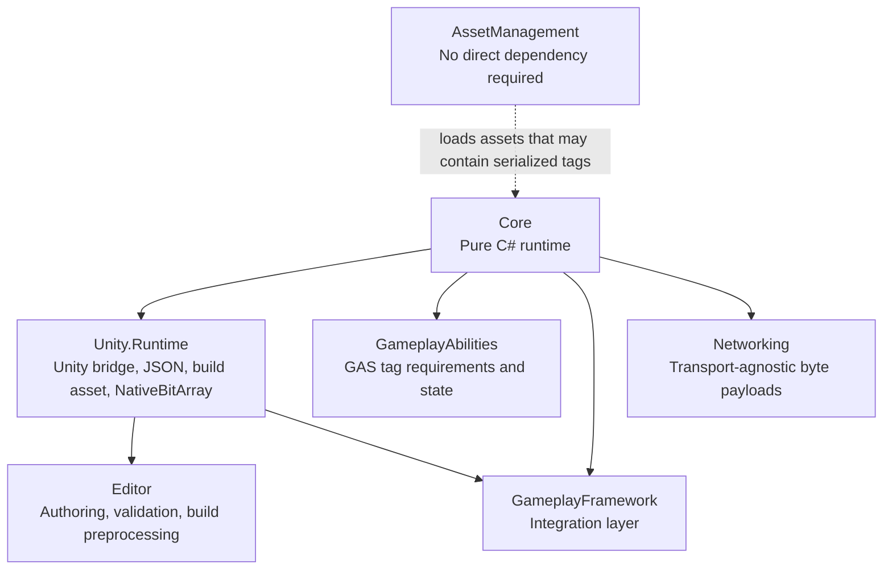

# CycloneGames.GameplayTags

English | [Simplified Chinese](./README.SCH.md)

`CycloneGames.GameplayTags` is a production-oriented gameplay tag module for Unity foundation projects. It provides a pure C# core for tag registration, lookup, containers, queries, masks, redirects, and network serialization, plus Unity Runtime and Editor bridges for authoring, build-time tag baking, JSON files, and inspector tooling.

The module is designed to be a reusable dependency for `CycloneGames.GameplayAbilities`, `CycloneGames.GameplayFramework`, `CycloneGames.Networking`, `CycloneGames.AssetManagement`, headless simulations, CLI tests, and future non-Unity adapters. Core contracts do not expose Unity types.

## Package Layout

```text
CycloneGames.GameplayTags/
  Core/
    CycloneGames.GameplayTags.Core.asmdef
    GameplayTag.cs
    GameplayTagManager.cs
    GameplayTagContainer.cs
    GameplayTagCountContainer.cs
    GameplayTagQuery.cs
    GameplayTagMask.cs
    GameplayTagNetSerializer.cs
  Unity.Runtime/
    CycloneGames.GameplayTags.Unity.Runtime.asmdef
    FileGameplayTagSource.cs
    GameObjectGameplayTagContainer.cs
    NativeGameplayTagMask.cs
  Editor/
    CycloneGames.GameplayTags.Unity.Editor.asmdef
    GameplayTagEditorWindow.cs
    GameplayTagContainerPropertyDrawer.cs
    GameplayTagValidationReporter.cs
    BuildTags.cs
  Tests/Editor/
    GameplayTagsCoreTests.cs
  Tests/Performance/
    GameplayTagsPerformanceTests.cs
  SourceGenerator~/
    GameplayTagsSourceGenerator.cs
```



## Assembly Boundary

| Assembly | Responsibility | Unity dependency | Unsafe code |
| --- | --- | --- | --- |
| `CycloneGames.GameplayTags.Core` | Tags, containers, queries, masks, redirects, build binary reader, network serializer | No | No |
| `CycloneGames.GameplayTags.Unity.Runtime` | Unity bootstrap, JSON project sources, `GameObjectGameplayTagContainer`, `NativeGameplayTagMask` | Yes | No |
| `CycloneGames.GameplayTags.Unity.Editor` | Manager window, inspectors, validation, build-time baking, file watcher | Editor only | No |
| `CycloneGames.GameplayTags.Tests.Editor` | Core regression coverage | Editor test runner | No |
| `CycloneGames.GameplayTags.Tests.Performance` | Container, query, mask, and network serializer benchmarks | Editor performance test runner | No |

The Core assembly is the contract consumed by GameplayAbilities and server/headless logic. Unity-facing code is kept in adapters so the tag system can remain a stable foundation module.

## Dependencies

The package declares these Unity package dependencies because the current Runtime assembly uses them directly:

| Package | Used by |
| --- | --- |
| `com.cyclone-games.hash` | Stable tag IDs, manifest hashes, and build payload checks |
| `com.unity.collections` | `NativeGameplayTagMask` and `NativeBitArray` bridge |
| `com.unity.burst` | Optional `[BurstCompile]` annotation paths |
| `com.unity.nuget.newtonsoft-json` | JSON tag source files in `ProjectSettings/GameplayTags/` |

`com.unity.entities` is intentionally not a hard dependency. `GameplayTagMaskComponent.cs` is guarded by `CYCLONE_HAS_ENTITIES`; projects that need Entities should place the Entities bridge in an optional integration assembly with a `versionDefines` entry and an explicit package dependency.

## Core Concepts

### `GameplayTag`

`GameplayTag` is a lightweight value that stores a stable tag name and a snapshot-local runtime index. Runtime indices are fast but not a persistence or network contract. If the tag table is reloaded or extended, a tag validates its cached index against the current snapshot and resolves by name when needed.

Use `GameplayTag.None` only as an empty value. Containers reject `None` and invalid tags.

### `TagDataSnapshot`

`GameplayTagManager` publishes immutable `TagDataSnapshot` instances with `Volatile.Write`. Readers capture one snapshot and query arrays without locks. Mutations such as dynamic registration rebuild a new snapshot under a lock and publish it atomically.

Every registered tag has:

- Name, label, description, hierarchy level, flags.
- Runtime index for local lookup.
- Stable 64-bit ID for network and manifest validation.
- Parent, child, and hierarchy spans stored in flat arrays.

### Containers

| Type | Use case |
| --- | --- |
| `GameplayTagContainer` | Explicit and implicit hierarchy-aware tag set. Good default for gameplay state and authoring fields. |
| `GameplayTagCountContainer` | Reference-counted tags with add/remove events. Useful for GAS effects, buffs, and stacked state. |
| `GameplayTagHierarchicalContainer` | Child container that propagates explicit changes to a parent count container. Useful for composed owners. |
| `ReadOnlyGameplayTagContainer` | Immutable snapshot for worker threads, networking, and stable comparisons. |

`GameplayTagContainer` keeps serialized tag names for Unity authoring and runtime indices for hot-path lookup. Runtime-only containers do not allocate the serialized string list unless one already exists or `FlushSerializedState()` is explicitly called.

### Queries

`GameplayTagQuery` compiles nested expressions into a token stream and caches it. Compiled queries treat the expression graph as immutable for hot-path evaluation. If `RootExpression`, nested expressions, or nested tag containers are mutated in place, call `InvalidateCompiledCache()` before the next match. Assigning a different `RootExpression` reference recompiles automatically.

### Masks

`GameplayTagMask` is a 32-byte, 256-bit value type for hot paths where tag count fits under 256 runtime indices. It uses safe word access, not unsafe pointer reinterpretation. `GameplayTagMaskLarge` is available for projects with more tags.

Use masks for dense repeated checks. Use containers when the exact explicit tag set, hierarchy expansion, serialization, or dynamic tag count matters.

## Tag Authoring

### Assembly Attributes

```csharp
using CycloneGames.GameplayTags.Core;

[assembly: GameplayTag("Ability.Damage.Fire")]
[assembly: GameplayTag("State.CrowdControl.Stunned")]
```

### Static Class Registration

```csharp
using CycloneGames.GameplayTags.Core;

[assembly: RegisterGameplayTagsFrom(typeof(ProjectGameplayTags))]

public static class ProjectGameplayTags
{
    public const string AbilityDamageFire = "Ability.Damage.Fire";
    public const string StateStunned = "State.CrowdControl.Stunned";
}
```

### JSON Files

Unity projects can author tags in JSON files under:

```text
<unity-project-root>/ProjectSettings/GameplayTags/*.json
```

Example:

```json
{
  "Ability.Damage.Fire": {
    "Comment": "Fire damage ability tag."
  },
  "State.CrowdControl.Stunned": {
    "Comment": "The actor cannot move or cast normal abilities."
  }
}
```

The Editor file watcher reloads tags when these files change. Build preprocessing bakes leaf tags into `Assets/Resources/GameplayTags.bytes` and removes the generated asset after the build.

### Dynamic Registration

```csharp
GameplayTagManager.RegisterDynamicTag("Hotfix.Event.DoubleDrop", "Hotfix event tag.");
GameplayTagManager.RegisterDynamicTagsFromAssembly(hotUpdateAssembly);
GameplayTagManager.RegisterDynamicTags(serverProvidedTags);
```

Dynamic registration is supported for hot-update and server-config workflows. Batch APIs such as `RegisterDynamicTags`, `RegisterDynamicTagsFromType`, and `RegisterDynamicTagsFromAssembly` append all new tags first, then rebuild and broadcast once. This is the preferred path for HybridCLR hot-update assembly loading. Dynamic registration changes the current manifest hash, so active network peers must resynchronize replicated tag containers after a tag table change.

## Runtime Usage

```csharp
GameplayTag fire = GameplayTagManager.RequestTag("Ability.Damage.Fire");
GameplayTag stunned = GameplayTagManager.RequestTag("State.CrowdControl.Stunned");

GameplayTagContainer tags = new();
tags.AddTag(fire);

bool hasDamage = tags.HasTag(GameplayTagManager.RequestTag("Ability.Damage"));
bool hasFireExact = tags.HasTagExact(fire);
```

Use `TryRequestTag` when user data, save data, or network data may contain unknown tags:

```csharp
if (GameplayTagManager.TryRequestTag(tagName, out GameplayTag tag))
{
    tags.AddTag(tag);
}
```

For GAS-style requirements:

```csharp
GameplayTagRequirements requirements = new(forbiddenTags, requiredTags);
bool allowed = requirements.Matches(sourceTags, targetTags);
```

## Networking

`GameplayTagNetSerializer` is framework-agnostic. It can be used with `CycloneGames.Networking`, Mirror, Netcode for GameObjects, FishNet, or a custom transport.

The current packet format uses stable tag IDs and a manifest hash:

```text
Full:
[protocolVersion:byte=1][marker:byte=0xFE][manifestHash:uint64][count:int32][stableId:uint64 x count]

Delta:
[protocolVersion:byte=1][marker:byte=0xFD][manifestHash:uint64][addCount:int32][addStableId:uint64 x addCount][removeCount:int32][removeStableId:uint64 x removeCount]

Mask:
[word0:uint64][word1:uint64][word2:uint64][word3:uint64]
```

`CurrentProtocolVersion` is the GameplayTags serializer wire-format version. It is intentionally narrower than the whole game network protocol version. Large live-service games should still perform an outer compatibility handshake that exchanges the game build, content build, gameplay data version, supported gameplay protocol range, feature flags, and `GameplayTagManager.CurrentManifestHash`.

The serializer validates buffer size, negative counts, count multiplication overflow, packet markers, protocol version, and manifest hash. Unknown stable IDs in a matching manifest are treated as corrupted protocol data. Runtime indices are never used as the network contract.

```csharp
byte[] fullPacket = GameplayTagNetSerializer.SerializeFull(container);
GameplayTagNetSerializer.DeserializeFull(remoteContainer, fullPacket);

byte[] deltaPacket = GameplayTagNetSerializer.SerializeDelta(currentContainer, previousContainer);
GameplayTagNetSerializer.ApplyDelta(remoteContainer, deltaPacket);

byte[] buffer = new byte[GameplayTagNetSerializer.GetFullSerializedSize(container)];
int written = GameplayTagNetSerializer.SerializeFull(container, buffer, 0);

byte[] deltaBuffer = new byte[GameplayTagNetSerializer.GetDeltaSerializedSize(addCount, removeCount)];
int deltaWritten = GameplayTagNetSerializer.SerializeDelta(currentContainer, previousContainer, deltaBuffer, 0);
```

For large MMORPG deployments, make tag manifests part of the client/server compatibility handshake. A client and server with different `GameplayTagManager.CurrentManifestHash` values should not exchange gameplay tag state until a reload or patch flow has reconciled the manifests. If a future serializer version needs backward compatibility, keep `MinimumSupportedProtocolVersion`, `CurrentProtocolVersion`, and version-specific decode paths explicit and covered by cross-version tests.

## Unity Runtime

`GameObjectGameplayTagContainer` bridges serialized persistent tags into a runtime `GameplayTagCountContainer`. It lazily initializes so systems that bind before `Awake` still receive a valid container.

```csharp
GameObjectGameplayTagContainer component = GetComponent<GameObjectGameplayTagContainer>();
GameplayTagCountContainer runtimeTags = component.GameplayTagContainer;
```

`GameplayTagContainerBinds` binds boolean callbacks to tag presence and supports deterministic `UnbindAll()` cleanup.

## Jobs And Data-Oriented Usage

`NativeGameplayTagMask` copies managed containers or masks into a `NativeBitArray` for Jobs/Burst-oriented workflows:

```csharp
using NativeGameplayTagMask nativeMask = new(Allocator.TempJob);
nativeMask.CopyFrom(readOnlySnapshot);
```

Create and populate native masks on the main thread after tags are initialized. Dispose masks according to the allocator lifetime.

## Editor Tooling

| Tool | Path |
| --- | --- |
| Gameplay Tag Manager | `Tools/CycloneGames/GameplayTags/Gameplay Tag Manager` |
| Validation Window | `Tools/CycloneGames/GameplayTags/Tag Validation Window` |
| Inspector drawer | `GameplayTag` and `GameplayTagContainer` serialized fields |
| Build bake | `BuildTags` build preprocess/postprocess hooks |

The Gameplay Tag Manager includes search, source display, add/delete actions, context-menu copy/create-child commands, and a details panel for the selected tag with stable ID, manifest hash, hierarchy, flags, and source information.

Inspector drawers provide searchable pickers for `GameplayTag` and `GameplayTagContainer`. Container fields show a bounded summary with the total tag count, keep the full editable list in the tag picker popup, and expose a `View All` shortcut when only the first tags are shown so large tag sets do not stretch component inspectors indefinitely.

Editor fix operations use `SerializedObject`, Undo, dirty marking, and scene dirty marking. The validation window scans prefabs, ScriptableObjects, and open scenes for invalid serialized `GameplayTag` and `GameplayTagContainer` names, then can ping, remove, or fix all invalid references.

## Persistence And Generated Files

| Data | Path | Format | Owner | Versioned | Cleanup |
| --- | --- | --- | --- | --- | --- |
| Authored tag files | `UnityStarter/ProjectSettings/GameplayTags/*.json` | JSON object | GameplayTags Editor tools and users | Yes, if the project chooses to track tags in Git | Delete unused JSON files manually after migration |
| Build baked tags | `UnityStarter/Assets/Resources/GameplayTags.bytes` | Binary format + payloadHash64 | `BuildTags` preprocess hook | No; generated before build and deleted after build | `BuildTags.OnPostprocessBuild` deletes asset and `.meta` |
| Runtime containers | Memory only unless serialized by host object | Tag names + runtime indices | Owning gameplay object/service | Host-dependent | Clear owner state or call container `Clear()` |

The module does not use `EditorPrefs`, `PlayerPrefs`, registry, plist, or hidden global state for tag configuration.

## Integration Notes

### GameplayAbilities

GameplayAbilities should depend on `CycloneGames.GameplayTags.Core`. Use containers, requirements, and count containers for ability activation, owned tags, blocked tags, effect-granted tags, and stack-sensitive state. Do not serialize runtime indices in ability specs; use tag names, stable IDs, or the module serializer.

### GameplayFramework

GameplayFramework integrations may depend on `Core` and `Unity.Runtime`. Scene-facing components should bridge to pure C# containers at initialization and avoid direct Unity object references inside tag logic.

### Networking

Networking layers should treat GameplayTags packets as payloads and perform manifest compatibility checks before applying replicated state. The transport does not need to understand tag hierarchy.

### AssetManagement

AssetManagement does not need a direct dependency on GameplayTags. Assets may contain serialized `GameplayTag` or `GameplayTagContainer` fields; make sure tags are initialized before consuming loaded assets that rely on tag lookups.

## Performance And Platform Notes

- Hot-path lookups use runtime indices and flat arrays.
- Snapshot reads are lock-free after initialization.
- Container enumeration uses custom struct enumerators.
- `GameplayTagMask` is fixed-size and safe for AOT platforms.
- Network serialization is little-endian and deterministic across supported platforms.
- Full and delta network serializers provide preallocated-buffer overloads for low-GC replication loops.
- Complex `GameplayTagQuery` instances are compiled once and should be invalidated explicitly after authoring-time or runtime mutation.
- Tag names are compared with `StringComparison.Ordinal`; tag authoring is case-sensitive.
- Runtime indices are local to a snapshot and must not be saved or sent as authoritative data.
- For projects with more than 256 hot-path tags, use `GameplayTagMaskLarge` or containers instead of forcing `GameplayTagMask`.
- Performance coverage lives in `CycloneGames.GameplayTags.Tests.Performance` and measures container bitset lookup, 256-bit masks, wide query matching, full serialization, and delta serialization with preallocated buffers.

## Validation

CLI checks used for this package:

```bash
dotnet build CycloneGames.GameplayTags.Core.csproj -v:minimal
dotnet build CycloneGames.GameplayTags.Tests.Editor.csproj -v:minimal
dotnet build CycloneGames.GameplayTags.Unity.Runtime.csproj -v:minimal
dotnet build CycloneGames.GameplayTags.Unity.Editor.csproj -v:minimal
```

After Unity regenerates project files, `CycloneGames.GameplayTags.Tests.Performance.csproj` can also be built from CLI. Until then, run the performance assembly through the Unity Test Runner.

Recommended Unity Editor validation:

1. Open the Unity project from `<repo-root>/UnityStarter`.
2. Run EditMode tests in `CycloneGames.GameplayTags.Tests.Editor`.
3. Run performance tests in `CycloneGames.GameplayTags.Tests.Performance` and compare the Time and `Time.GC()` sample groups before and after hot-path changes.
4. Open `Tools/CycloneGames/GameplayTags/Gameplay Tag Manager` and create a test tag in `ProjectSettings/GameplayTags/`.
5. Add a `GameplayTagContainer` field to a test asset or component and verify the selector, clear action, and invalid tag display.
6. Open `Tools/CycloneGames/GameplayTags/Tag Validation Window`, scan project assets and open scenes, and verify Undo works for a fix operation.
7. Make a development build and verify `Assets/Resources/GameplayTags.bytes` is generated during preprocessing and removed after postprocessing.
