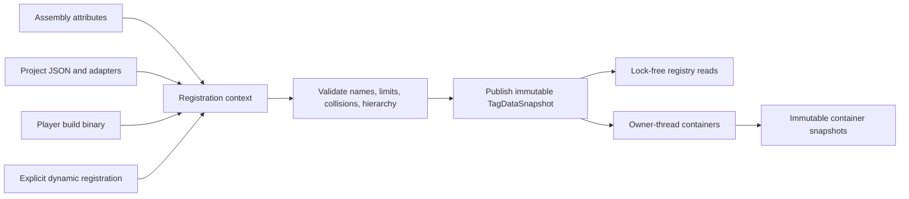

# CycloneGames.GameplayTags

[English | 简体中文](README.SCH.md)

Inspired by Unreal Engine's GameplayTags system, this module provides hierarchical tags (`State.CrowdControl.Stunned`), tag containers with automatic parent resolution, and compiled tag queries — the same vocabulary-driven approach UE developers use to connect abilities, effects, AI, and UI without hard references.

## Table of Contents

- [Overview](#overview)
- [Architecture](#architecture)
- [Quick Start](#quick-start)
- [Core Concepts](#core-concepts)
- [Usage Guide](#usage-guide)
- [Advanced Topics](#advanced-topics)
- [Common Scenarios](#common-scenarios)
- [Performance and Memory](#performance-and-memory)
- [Troubleshooting](#troubleshooting)

## Overview

A gameplay tag is a compact label with a dotted hierarchical name like `State.CrowdControl.Stunned`. The registry validates names, resolves parents, and publishes an immutable snapshot. Containers track explicit tags and compute derived parent membership. Queries evaluate container state against pre-compiled boolean expressions.

Use this module when:

- Multiple systems (abilities, effects, AI, UI) need a shared vocabulary of labels.
- Tags form a hierarchy where `State.CrowdControl` includes `State.CrowdControl.Stunned`.
- You need zero-allocation lookups and container comparisons on hot paths.

### Key Features

- **Hierarchical tag registry** with atomic snapshot publication and lock-free reads.
- **GameplayTagContainer** for explicit membership with automatic parent resolution.
- **GameplayTagCountContainer** for sparse stacked counts with synchronous change notifications.
- **GameplayTagQuery** for compiled `All`/`Any`/`None` predicate matching with 1 KiB stack scratch.
- **Multiple definition sources**: project JSON, assembly attributes, static catalogs, dynamic registration, and DataTable adapters.
- **Pure C# Core** assembly with `noEngineReferences: true`; Editor tooling in separate assemblies.

## Architecture

| Assembly | Role | Direct dependencies |
| --- | --- | --- |
| `CycloneGames.GameplayTags.Core` | Registry, values, containers, counts, queries, Player catalog contract | `CycloneGames.Hash.Core`; `noEngineReferences` |
| `CycloneGames.GameplayTags.Unity.Runtime` | Unity logging/bootstrap, `Resources` build-data loading, `GameObject` component adapter | GameplayTags Core |
| `CycloneGames.GameplayTags.Unity.Editor` | JSON authoring, manager window, drawers, validation, file watcher, build bake | Core, Unity Runtime, Newtonsoft.Json; Editor only |



Writers build a complete candidate before publication. Invalid input, a stable-ID collision, or a budget failure leaves the current snapshot unchanged. Tree-change notifications run synchronously after publication outside the registry writer lock.

## Quick Start

Add an asmdef reference to `CycloneGames.GameplayTags.Core`, then:

```csharp
using CycloneGames.GameplayTags.Core;

GameplayTagManager.InitializeIfNeeded();

GameplayTag stunned = GameplayTagManager.RequestTag("State.CrowdControl.Stunned");
GameplayTag crowdControl = GameplayTagManager.RequestTag("State.CrowdControl");

GameplayTagContainer state = new();
state.AddTag(stunned);

bool exact = state.HasTagExact(stunned);     // true
bool inherited = state.HasTag(crowdControl); // true
```

For optional content, use `TryRequestTag` and cache the result:

```csharp
if (GameplayTagManager.TryRequestTag("Feature.Seasonal.Active", out GameplayTag seasonal))
{
    // Cache seasonal — do not request strings every frame.
}
```

`GameplayTag.None` reserves runtime index 0 and is not a valid container member.

## Core Concepts

### Key Types

| Type | Responsibility | Owner and lifetime |
| --- | --- | --- |
| `GameplayTag` | Serializable value identified by a hierarchical name | Copyable value; name is the stable identity |
| `GameplayTagManager` | Process-wide registry facade and atomic snapshot publication | Application/subsystem lifetime |
| `TagDataSnapshot` | Immutable registry generation with hierarchy and lookup tables | Published by the manager; readers capture references |
| `IReadOnlyGameplayTagContainer` | Read-only container capability | Borrowed from its concrete owner |
| `IGameplayTagContainer` | Mutation capability plus read-only operations | One explicit mutable owner |
| `GameplayTagContainer` | Explicit membership plus derived parent membership | Owning system or serialized object |
| `GameplayTagCountContainer` | Sparse explicit and aggregate hierarchy counts with notifications | One logical runtime owner |
| `ReadOnlyGameplayTagContainer` | Immutable copy of container indices bound to one registry epoch | Creator owns the snapshot reference |
| `GameplayTagQuery` | Compiled `All` / `Any` / `None` predicate | Owner controls construction and cache invalidation |

Accept `IReadOnlyGameplayTagContainer` when a method only inspects tags.

### Containers and Hierarchy

`GameplayTagContainer` stores a sorted explicit set and derives the complete parent set. Adding `State.CrowdControl.Stunned` makes both exact and parent queries succeed.

```csharp
void CanUseAbility(
    IReadOnlyGameplayTagContainer owned,
    IReadOnlyGameplayTagContainer required)
{
    bool allowed = owned.HasAll(required);
}
```

Empty-set behavior: `HasAll(empty)` is `true`, `HasAny(empty)` is `false`.

Unity serialization uses `m_SerializedExplicitTags` (name list). Runtime indices are reconstructed from names. Save/wire contracts should persist stable names or stable IDs, never raw runtime indices.

### Queries

```csharp
GameplayTagQuery query = new()
{
    RootExpression = GameplayTagQueryExpression.All(
        GameplayTagQueryExpression.MatchAny(attackTags),
        GameplayTagQueryExpression.MatchNone(blockedStateTags))
};

bool canActivate = query.Matches(ownedTags);
```

A node contains tags or child expressions, not both. Compilation rejects cycles and applies depth, node, and referenced-tag budgets. Matching uses a fixed 1 KiB stack scratch bounded by `MaxExpressionNodes` (1,024). After changing the expression graph, call `InvalidateCompiledCache()` before the next match.

### Count Containers

`GameplayTagCountContainer` stores counts only for active indices. Adding a leaf increments that leaf and every parent; adding the same leaf twice increments each count twice.

```csharp
GameplayTagCountContainer counts = new();
counts.RegisterTagEventCallback(
    stunned,
    GameplayTagEventType.NewOrRemoved,
    static (tag, count) => SetStunned(count > 0));

counts.AddTag(stunned);
counts.RemoveTag(stunned);
```

Mutation semantics:

- Batch deltas are accumulated and validated before commit; overflow or removal below zero fails without partial mutation.
- Callbacks run synchronously after commit on the mutating thread; one callback failure does not stop others.
- Mutation reentry from a callback fails fast.
- Callback registration and removal are cold-path operations.

Single-tag mutation uses a bounded stack buffer (max 32 hierarchy notifications). Multi-tag mutation creates scratch storage only when needed.

## Usage Guide

### Defining Tags

**Project JSON** — Editor reads `*.json` from `ProjectSettings/GameplayTags/`. Each file has one top-level property `tags`:

```json
{
  "tags": {
    "Ability.Attack.Primary": {
      "description": "Primary attack ability"
    },
    "State.CrowdControl.Stunned": {
      "description": "Actor cannot act"
    },
    "UI.Internal.Debug": {
      "flags": 1
    }
  }
}
```

`description` and `flags` are optional. Flag `1` is `GameplayTagFlags.HideInEditor`. The parser enforces a byte budget against a single file handle and accepts only UTF-8 without BOM. Writes use same-directory temporary file, flush, and atomic replacement.

**Assembly attributes:**

```csharp
[assembly: GameplayTag("Ability.Attack.Primary", "Primary attack ability")]
[assembly: GameplayTag("State.CrowdControl.Stunned", "Actor cannot act")]
```

**Static catalogs:**

```csharp
[RegisterGameplayTagsFrom(typeof(GameTags))]
public static class GameTags
{
    public const string FireDamage = "Damage.Element.Fire";
    public const string Stunned = "State.CrowdControl.Stunned";
}
```

**Dynamic registration** — register a batch before dependent objects are created:

```csharp
GameplayTagManager.RegisterDynamicTags(new[]
{
    "Event.Combat.Hit",
    "Event.Combat.CriticalHit"
});
GameplayTagManager.InitializeIfNeeded();
```

### Editor Workflow

- `Tools/CycloneGames/GameplayTags/Gameplay Tag Manager` — browse and author tags.
- `Tools/CycloneGames/GameplayTags/Tag Validation Window` — scan prefabs, ScriptableObjects, and open scenes.
- Property drawers use `SerializedObject`/`SerializedProperty`, preserving Undo, prefab overrides, and multi-object semantics.
- Full-project validation is a cold operation; run it in a dedicated Editor or CI session.

### Player Build Data

Before a Player build, the Editor writes all definitions (except `None`) to `Assets/Resources/GameplayTags.bytes`:

```text
4 bytes ASCII signature "CGTG"
int32 definitionCount
repeat definitionCount: string name, string description, int32 flags
uint64 contentHash
```

Runtime validates the signature, strict UTF-8, size, count, name, flag, duplicate, trailing-data, and content hash before registration. Missing or corrupted data fails initialization rather than starting silently.

## Advanced Topics

### Registry Publication and Index Epochs

Each registry snapshot exposes:

- `Generation` — changes after every successful publication.
- `RuntimeIndexEpoch` — changes when existing indices may have been reordered or removed.
- `RegistryManifestHash` — derived from stable tag identities in ordinal canonical-name order.
- `GameplayTagManager.CurrentManifestHash` — also includes redirects.

Runtime indices are cache-local identifiers, not persistence identities. Containers reject index operations across an incompatible epoch. During play, reload preserves current indices and appends additions; authoring removals remain registered until the next runtime reset.

Redirects are published as immutable snapshots. `AddRedirects` materializes and validates at most 4,096 entries outside the registry lock, then merges atomically under the lock.

### Immutable Snapshots and Threading

```csharp
ReadOnlyGameplayTagContainer snapshot = ownedTags.CreateSnapshot();
if (snapshot.IsCompatibleWithCurrentRegistry)
{
    bool hasStun = snapshot.HasTag(stunned);
}
```

Threading contract:

- Registry writes are serialized; published snapshots support concurrent managed reads.
- Construct a container snapshot while its source has stable owner-thread access.
- Mutable containers, count containers, and query construction remain owner-thread operations.
- Unity objects and Unity APIs remain on the Unity main thread.
- These managed snapshots are not Burst job data.

### GameplayAbilities and GameplayFramework Integration

GameplayAbilities uses read-only containers for ability/effect definitions. `GameplayTagCountContainer` supplies stacked owned/blocked/state counts. GameplayFramework provides `ActorGameplayTagExtensions` that discovers `GameObjectGameplayTagContainer` via `GetComponent`; cache the returned container for repeated access:

```csharp
if (actor.TryGetGameplayTagContainer(out GameplayTagCountContainer actorTags))
{
    actorTags.AddTag(stunned);
}
```

## Common Scenarios

### Ability Requirements

```csharp
public bool CanActivate(IReadOnlyGameplayTagContainer actorTags)
{
    return actorTags.HasAll(ability.RequiredTags) &&
           !actorTags.HasAny(ability.BlockedTags);
}
```

### State Stacking with Counts

```csharp
// Multiple sources can each add "Stunned" independently.
// The count reflects how many active sources contribute the state.
counts.AddTag(stunned); // count = 1
counts.AddTag(stunned); // count = 2
// Tag event fires on transition between 0 and 1.
```

### Content Filtering with Queries

```csharp
GameplayTagQuery playerContentQuery = new()
{
    RootExpression = GameplayTagQueryExpression.All(
        GameplayTagQueryExpression.MatchAny(playerClassTags),
        GameplayTagQueryExpression.MatchNone(explicitlyBlockedTags))
};
```

## Performance and Memory

### Budgets

| Boundary | Limit |
| --- | ---: |
| Tag name | 255 UTF-16 code units |
| Hierarchy depth | 32 segments |
| Registered tags | 65,535 (excluding `None`) |
| Registration attempts per candidate | 131,070 |
| Query depth / nodes / tag references | 32 / 1,024 / 4,096 |
| Redirect catalog | 4,096 entries |
| JSON source file / count | 8 MiB / 256 |

### Hot Path Guidance

- Cache requested `GameplayTag` values; do not request strings every frame.
- Use `GameplayTagContainer` for small/moderate owned sets.
- Use `GameplayTagCountContainer` when stacked ownership is required.
- Pre-build query graphs and invalidate them explicitly after authoring mutation.
- Treat registry rebuild, JSON parsing, validation scans, and build baking as cold paths.

### Memory Ownership

- `GameplayTagManager` owns the published immutable registry snapshot; publication replaces the complete snapshot atomically.
- Mutable containers own their backing storage. Immutable snapshots own copied indices.
- Compiled query data belongs to its `GameplayTagQuery`. Call `InvalidateCompiledCache()` after mutation.
- Compiled query matching uses a fixed 1 KiB stack scratch; no shared pool is retained between calls.
- Single-tag count mutation uses a stack buffer; multi-tag mutation uses lazily-created scratch owned by the container.

Registry reads capture an immutable snapshot and do not take the writer lock.

### Platform Profile

Core is managed C# without UnityEngine, native plugins, or runtime reflection discovery. Players use baked `Resources` binary through the Unity Runtime adapter. WebGL and headless/server use the same managed registry and baked-data contract.

## Troubleshooting

| Symptom | Likely cause | Resolution |
| --- | --- | --- |
| Tag not found after `RequestTag` | Registry not initialized or tag not registered | Call `InitializeIfNeeded()` before requesting; verify the tag exists in source definitions |
| Container operations throw on index mismatch | Runtime index epoch changed after reload | Capture a fresh container or `Clear()` after a non-preserving reload |
| Query always returns false after graph change | Compiled cache stale | Call `InvalidateCompiledCache()` after modifying the expression graph |
| Player build starts with empty tag registry | Build data missing or corrupted | Verify `Assets/Resources/GameplayTags.bytes` exists and passes content hash validation |
| JSON file edits silently ignored | External edit conflict detected | Check for `.tmp`/`.bak` recovery files in `ProjectSettings/GameplayTags/` |
| Count callback not firing | Increment from 1 to 2 does not trigger `NewOrRemoved` | `NewOrRemoved` fires only on 0↔1 transitions; use `AnyCountChange` for all changes |

## Validation

Run from Unity Test Runner:

```text
CycloneGames.GameplayTags.Tests.Editor           (EditMode)
CycloneGames.GameplayTags.DataTable.Tests.Editor (EditMode)
CycloneGames.GameplayTags.Tests.Performance      (EditMode, after warm-up)
```

Test Play Mode with Domain Reload enabled and disabled. Verify Player build on each supported target family, including IL2CPP and managed stripping.
