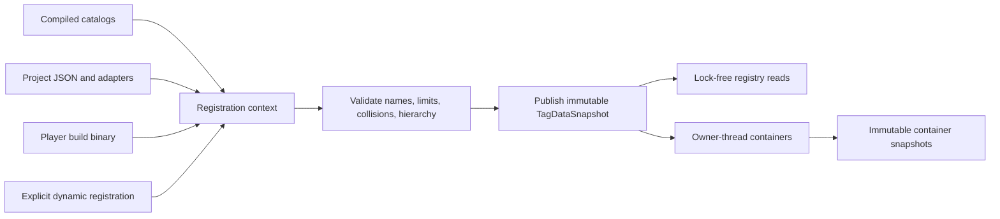

# CycloneGames.GameplayTags

[English | 简体中文](README.SCH.md)

CycloneGames.GameplayTags provides hierarchical tags (`State.CrowdControl.Stunned`), tag containers with automatic parent resolution, and compiled tag queries. Tags are shareable labels: abilities, effects, AI, and UI can reference the same vocabulary without hard references.

## Table of Contents

- [Overview](#overview)
- [Architecture](#architecture)
- [Logging](#logging)
- [Quick Start](#quick-start)
- [Core Concepts](#core-concepts)
- [Usage Guide](#usage-guide)
- [Advanced Topics](#advanced-topics)
- [Common Scenarios](#common-scenarios)
- [Performance and Memory](#performance-and-memory)
- [Serialization and Inspector](#serialization-and-inspector)
- [Troubleshooting](#troubleshooting)

## Overview

A gameplay tag is a compact label with a dotted hierarchical name like `State.CrowdControl.Stunned`. The registry validates names, resolves parents, and publishes an immutable snapshot. Containers track explicit tags and compute derived parent membership. Queries evaluate container state against pre-compiled boolean expressions.

Use this module when:

- Multiple systems (abilities, effects, AI, UI) need a shared vocabulary of labels.
- Tags form a hierarchy where `State.CrowdControl` includes `State.CrowdControl.Stunned`.
- You need zero-allocation lookups and container comparisons on hot paths.

### Key Features

- **Hierarchical tag registry** with atomic snapshot publication and lock-free reads.
- **GameplayTagContainer** for explicit membership with automatic parent resolution.
- **GameplayTagCountContainer** for sparse stacked counts with synchronous change notifications.
- **GameplayTagQuery** for compiled `All`/`Any`/`None` predicate matching with an allocation-free `ulong` value stack.
- **Multiple definition sources**: compiled catalogs, project JSON, baked build manifests, dynamic registration, and DataTable adapters — zero reflection, AOT and HybridCLR safe.
- **Pure C# Core** assembly with `noEngineReferences: true`; Editor tooling in separate assemblies.

## Architecture

| Assembly | Role | Direct dependencies |
| --- | --- | --- |
| `CycloneGames.GameplayTags.Core` | Registry, values, containers, counts, queries, Player catalog contract, local diagnostics port | `CycloneGames.Hash.Core`; `noEngineReferences` |
| `CycloneGames.GameplayTags.Integrations.Logging` | Optional bridge from Core diagnostics to the shared writer | Core, Logging; `noEngineReferences`; `autoReferenced: false` |
| `CycloneGames.GameplayTags.Unity.Runtime` | Runtime bootstrap, `Resources` build-data loading, `GameObject` component adapter | Core, Logging integration |
| `CycloneGames.GameplayTags.Unity.Editor` | JSON authoring, manager window, drawers, validation, file watcher, build bake | Core, Unity Runtime, Logging, Newtonsoft.Json; Editor only |


```mermaid
flowchart LR
    A["Compiled catalogs"] --> C["Registration context"]
    B["Project JSON and adapters"] --> C
    D["Player build binary"] --> C
    E["Explicit dynamic registration"] --> C
    C --> V["Validate names, limits, collisions, hierarchy"]
    V --> S["Publish immutable TagDataSnapshot"]
    S --> R["Lock-free registry reads"]
    S --> O["Owner-thread containers"]
    O --> I["Immutable container snapshots"]
```

Writers build a complete candidate before publication. Invalid input, a stable-ID collision, or a budget failure leaves the current snapshot unchanged. Tree-change notifications run synchronously after publication outside the registry writer lock.

## Logging

Core owns the engine-independent `IGameplayTagsDiagnostics`, `NullGameplayTagsDiagnostics`, `GameplayTagsDiagnosticCategories.Root`, and `GameplayTagsDiagnostics` process replacement point. It does not reference `ILogWriter`, `LogChannel`, Unity, or a concrete backend. `GameplayTagsDiagnosticLevel` has the stable shared shape `Trace`, `Debug`, `Info`, `Warning`, `Error`, `Fatal`, and `None`, with numeric values matching `LogSeverity`; `None` and unknown values are never emitted. `GameplayTagsLogWriterAdapter` is the optional adapter to the shared process writer; it isolates ordinary writer failures while deliberately allowing `OutOfMemoryException` to propagate.

This is an assembly boundary, not yet a separate UPM distribution boundary. The current combined `com.cyclone-games.gameplay-tags` package root also contains non-Core assemblies and therefore still declares `com.cyclone-games.logging`; installing only Core without that package dependency requires a future physical Core package split.

Every Core call crosses the internal `GameplayTagsCoreDiagnostics` best-effort guard. Ordinary custom-sink failures cannot alter registry publication, tag lookup, committed count state, or subscriber iteration. Pure C# hosts may leave Core silent, install their own `IGameplayTagsDiagnostics`, or explicitly reference the Logging integration. Owners use `GameplayTagsDiagnostics.TryReplace(expected, replacement)` for atomic handoff or `TryReset(expected)` to release only the sink they installed. The Unity bootstrap tracks its ambient ownership and never resets or replaces a user-installed sink; it also never mutates `LogRuntime.Writer`.

Editor-owned output continues to use the assembly-local `GameplayTagsEditorLog` facade with the standard `Category`, ambient `Channel`, and `Create(ILogWriter)` shape. `IGameplayTagHostPlatform` (installed through `GameplayTagHost.Use`) retains only host-platform capabilities for play-state detection, build data, settings paths, and project tag sources.

## Quick Start

Add an asmdef reference to `CycloneGames.GameplayTags.Core`, then:

```csharp
using CycloneGames.GameplayTags.Core;

GameplayTagManager.InitializeIfNeeded();

GameplayTag stunned = GameplayTagManager.Request("State.CrowdControl.Stunned");
GameplayTag crowdControl = GameplayTagManager.Request("State.CrowdControl");

GameplayTagContainer state = new();
state.AddTag(stunned);

bool exact = state.HasTagExact(stunned);     // true
bool inherited = state.HasTag(crowdControl); // true
```

For optional content, use `TryRequest` and cache the result:

```csharp
if (GameplayTagManager.TryRequest("Feature.Seasonal.Active", out GameplayTag seasonal))
{
    // Cache seasonal — do not request strings every frame.
}
```

`GameplayTag.None` reserves runtime index 0 and is not a valid container member.

## Core Concepts

### Key Types

| Type | Responsibility | Owner and lifetime |
| --- | --- | --- |
| `GameplayTag` | Serializable value identified by a hierarchical name | Copyable value; name is the stable identity |
| `GameplayTagManager` | Process-wide registry facade and atomic snapshot publication | Application/subsystem lifetime |
| `TagDataSnapshot` | Immutable registry generation with hierarchy and lookup tables | Published by the manager; readers capture references |
| `IReadOnlyGameplayTagContainer` | Read-only container capability | Borrowed from its concrete owner |
| `IGameplayTagContainer` | Mutation capability plus read-only operations | One explicit mutable owner |
| `GameplayTagContainer` | Explicit membership plus derived parent membership | Owning system or serialized object |
| `GameplayTagCountContainer` | Sparse explicit and aggregate hierarchy counts with notifications | One logical runtime owner |
| `ReadOnlyGameplayTagContainer` | Immutable copy of container indices bound to one registry epoch | Creator owns the snapshot reference |
| `GameplayTagQuery` | Compiled `All` / `Any` / `None` predicate | Owner controls construction and cache invalidation |

Accept `IReadOnlyGameplayTagContainer` when a method only inspects tags.

### Containers and Hierarchy

`GameplayTagContainer` stores a sorted explicit set and derives the complete parent set. Adding `State.CrowdControl.Stunned` makes both exact and parent queries succeed.

```csharp
void CanUseAbility(
    IReadOnlyGameplayTagContainer owned,
    IReadOnlyGameplayTagContainer required)
{
    bool allowed = owned.HasAll(required);
}
```

Empty-set behavior: `HasAll(empty)` is `true`, `HasAny(empty)` is `false`.

Unity serialization uses `m_SerializedExplicitTags` (name list). Runtime indices are reconstructed from names. Save/wire contracts should persist stable names or stable IDs, never raw runtime indices.

### Queries

```csharp
GameplayTagQuery query = new()
{
    RootExpression = GameplayTagQueryExpression.All(
        GameplayTagQueryExpression.MatchAny(attackTags),
        GameplayTagQueryExpression.MatchNone(blockedStateTags))
};

bool canActivate = query.Matches(ownedTags);
```

A node contains tags or child expressions, not both. Compilation rejects cycles and applies depth, node, and referenced-tag budgets. Matching keeps the value stack in a single `ulong` bitmask when the compiled depth is at or below 64 (the common case), falling back to a span sized to the exact compiled depth. There is no fixed stack budget and no per-call zeroing. After changing the expression graph, call `InvalidateCompiledCache()` before the next match.

### Count Containers

`GameplayTagCountContainer` stores counts only for active indices. Adding a leaf increments that leaf and every parent; adding the same leaf twice increments each count twice.

```csharp
GameplayTagCountContainer counts = new();
counts.RegisterTagEventCallback(
    stunned,
    GameplayTagEventType.NewOrRemoved,
    static (tag, count) => SetStunned(count > 0));

counts.AddTag(stunned);
counts.RemoveTag(stunned);
```

Mutation semantics:

- Batch deltas are accumulated and validated before commit; overflow or removal below zero fails without partial mutation.
- Callbacks run synchronously after commit on the mutating thread; one callback failure does not stop others.
- Mutation reentry from a callback fails fast.
- Callback registration and removal are cold-path operations.

Single-tag mutation uses a bounded stack buffer (max 32 hierarchy notifications). Multi-tag mutation creates scratch storage only when needed.

## Usage Guide

### Defining Tags

**Project JSON** — Editor reads `*.json` from `ProjectSettings/GameplayTags/`. Each file has one top-level property `tags`:

```json
{
  "tags": {
    "Ability.Attack.Primary": {
      "description": "Primary attack ability"
    },
    "State.CrowdControl.Stunned": {
      "description": "Actor cannot act"
    },
    "UI.Internal.Debug": {
      "flags": 1
    }
  }
}
```

`description` and `flags` are optional. Flag `1` is `GameplayTagFlags.HideInEditor`. The parser enforces a byte budget against a single file handle and accepts only UTF-8 without BOM. Writes use same-directory temporary file, flush, and atomic replacement.

**Compiled catalogs** — the reflection-free declaration contract. Declare a catalog, then register it once in both a runtime bootstrap and an editor bootstrap so the tags exist in both worlds:

```csharp
public sealed class GameTagsCatalog : IGameplayTagCatalog
{
    public string Name => "Game.Tags";
    public void Collect(GameplayTagCatalogBuilder builder)
    {
        builder.Add("Ability.Attack.Primary", "Primary attack ability");
        builder.Add("State.CrowdControl.Stunned", "Actor cannot act");
    }
}

// Runtime: [RuntimeInitializeOnLoadMethod] — Editor: [InitializeOnLoad]
GameplayTagManager.RegisterCatalog(new GameTagsCatalog());
```

**Native tags** — declare once, read as a constant with no string lookup; visible and read-only in the editor:

```csharp
public static class GameTags
{
    public static readonly NativeGameplayTag Stunned = new("State.CrowdControl.Stunned", "Actor cannot act");
}

// hot path
if (actor.Tags.HasTag(GameTags.Stunned.Tag)) { ... }
```

**Dynamic registration** — register a batch before dependent objects are created:

```csharp
GameplayTagManager.RegisterDynamicTags(new[]
{
    "Event.Combat.Hit",
    "Event.Combat.CriticalHit"
});
GameplayTagManager.InitializeIfNeeded();
```

### Editor Workflow

- `Tools/CycloneGames/GameplayTags/Gameplay Tag Manager` — browse and author tags.
- `Tools/CycloneGames/GameplayTags/Tag Validation Window` — scan prefabs, ScriptableObjects, and open scenes.
- Property drawers use `SerializedObject`/`SerializedProperty`, preserving Undo, prefab overrides, and multi-object semantics.
- Full-project validation is a cold operation; run it in a dedicated Editor or CI session.

### Player Build Data

Before a Player build, the Editor publishes all definitions (except `None`) to the isolated build-only asset path:

```text
Assets/Generated/CycloneGames.GameplayTags/Resources/CycloneGames.GameplayTags/GameplayTags.bytes
```

The Runtime adapter loads it with `Resources.Load<TextAsset>("CycloneGames.GameplayTags/GameplayTags")`. The binary format is:

```text
4 bytes ASCII signature "CGTG"
int32 definitionCount
repeat definitionCount: string name, string description, int32 flags
uint64 contentHash
```

Runtime validates the signature, strict UTF-8, size, count, name, flag, duplicate, trailing-data, and content hash before registration. Missing or corrupted data fails initialization rather than starting silently.

The generated asset is controlled by a write-ahead transaction. Before changing `Assets`, the Editor writes every planned file and directory effect, its absent pre-state, expected SHA-256, size budget, and generated Unity GUID to:

```text
.buildpipeline/transactions/gameplay-tags/active.json
```

Normal build preprocessing never recovers pending state implicitly. A pending journal, journal candidate, scratch directory, or unknown state entry stops the build before new output is created. Postprocessing validates every generated file and scans every transaction-created directory for unknown content before deleting anything; any cleanup failure fails the build and retains the journal and evidence.

Recovery is an explicit operation:

```csharp
BuildTags.Recover(projectRoot);
```

The public static facade belongs to the GameplayTags Editor assembly and has no dependency on the project Build module, so a CI/build orchestrator may invoke it through reflection. Recovery accepts only the fixed GameplayTags path set, rejects traversal and reparse points, applies bounded reads, verifies exact hashes, and never recursively deletes directories. Unknown or modified files are preserved and require manual reconciliation.

Persistence contract:

| State | Owner | Version control | Lifetime and safe cleanup |
| --- | --- | --- | --- |
| `.buildpipeline/transactions/gameplay-tags/active.json` | GameplayTags build asset transaction | Exclude from Git | Exists from preprocess through successful postprocess; remove only through `BuildTags.Recover` |
| `.buildpipeline/transactions/gameplay-tags/active.json.new` | Atomic journal writer | Exclude from Git | May remain after interruption; explicit recovery validates and reconciles it |
| `.buildpipeline/transactions/gameplay-tags/scratch/` | Transaction staging | Exclude from Git | Contains only journal-named staging files; explicit recovery rejects unknown entries |
| `.buildpipeline/transactions/gameplay-tags/build.lock` | Cross-process exclusion | Exclude from Git | Empty, rebuildable coordination file; it does not contain build facts |

## Advanced Topics

### Registry Publication and Index Epochs

Each registry snapshot exposes:

- `Generation` — changes after every successful publication.
- `RuntimeIndexEpoch` — changes when existing indices may have been reordered or removed.
- `RegistryManifestHash` — derived from stable tag identities in ordinal canonical-name order.
- `GameplayTagManager.ManifestHash` — also includes redirects.

Runtime indices are cache-local identifiers, not persistence identities. Containers reject index operations across an incompatible epoch. During play, reload preserves current indices and appends additions; authoring removals remain registered until the next runtime reset.

Redirects are published as immutable snapshots. `AddRedirects` materializes and validates at most 4,096 entries outside the registry lock, then merges atomically under the lock.

### Immutable Snapshots and Threading

```csharp
ReadOnlyGameplayTagContainer snapshot = ownedTags.CreateSnapshot();
if (snapshot.IsCompatibleWithCurrentRegistry)
{
    bool hasStun = snapshot.HasTag(stunned);
}
```

Threading contract:

- Registry writes are serialized; published snapshots support concurrent managed reads.
- Construct a container snapshot while its source has stable owner-thread access.
- Mutable containers, count containers, and query construction remain owner-thread operations.
- Unity objects and Unity APIs remain on the Unity main thread.
- These managed snapshots are not Burst job data.

### GameplayAbilities and GameplayFramework Integration

GameplayAbilities uses read-only containers for ability/effect definitions. `GameplayTagCountContainer` supplies stacked owned/blocked/state counts. GameplayFramework provides `ActorGameplayTagExtensions` that discovers `GameObjectGameplayTagContainer` via `GetComponent`; cache the returned container for repeated access:

```csharp
if (actor.TryGetGameplayTagContainer(out GameplayTagCountContainer actorTags))
{
    actorTags.AddTag(stunned);
}
```

## Common Scenarios

### Ability Requirements

```csharp
public bool CanActivate(IReadOnlyGameplayTagContainer actorTags)
{
    return actorTags.HasAll(ability.RequiredTags) &&
           !actorTags.HasAny(ability.BlockedTags);
}
```

### State Stacking with Counts

```csharp
// Multiple sources can each add "Stunned" independently.
// The count reflects how many active sources contribute the state.
counts.AddTag(stunned); // count = 1
counts.AddTag(stunned); // count = 2
// Tag event fires on transition between 0 and 1.
```

### Content Filtering with Queries

```csharp
GameplayTagQuery playerContentQuery = new()
{
    RootExpression = GameplayTagQueryExpression.All(
        GameplayTagQueryExpression.MatchAny(playerClassTags),
        GameplayTagQueryExpression.MatchNone(explicitlyBlockedTags))
};
```

## Performance and Memory

### Budgets

| Boundary | Limit |
| --- | ---: |
| Tag name | 255 UTF-16 code units |
| Hierarchy depth | 32 segments |
| Registered tags | 65,535 (excluding `None`) |
| Registration attempts per candidate | 131,070 |
| Query depth / nodes / tag references | 32 / 1,024 / 4,096 |
| Redirect catalog | 4,096 entries |
| JSON source file / count | 8 MiB / 256 |

### Hot Path Guidance

- Cache requested `GameplayTag` values; do not request strings every frame.
- Use `GameplayTagContainer` for small/moderate owned sets.
- Use `GameplayTagCountContainer` when stacked ownership is required.
- Pre-build query graphs and invalidate them explicitly after authoring mutation.
- Treat registry rebuild, JSON parsing, validation scans, and build baking as cold paths.

### Memory Ownership

- `GameplayTagManager` owns the published immutable registry snapshot; publication replaces the complete snapshot atomically.
- Mutable containers own their backing storage. Immutable snapshots own copied indices.
- Compiled query data belongs to its `GameplayTagQuery`. Call `InvalidateCompiledCache()` after mutation.
- Compiled query matching keeps its value stack in one `ulong`; no allocation and no stack zeroing per call.
- Single-tag count mutation uses a stack buffer; multi-tag mutation uses lazily-created scratch owned by the container.

`GameplayTagManager.GetMemorySnapshot()` returns an allocation-free O(1) aggregate of registry counts, limits, generation, epoch, manifest hash, redirects, and query limits without exposing registry storage.

Registry reads capture an immutable snapshot and do not take the writer lock.

### Platform Profile

Core is managed C# without UnityEngine, native plugins, or runtime reflection discovery. Players use baked `Resources` binary through the Unity Runtime adapter. WebGL and headless/server use the same managed registry and baked-data contract.

## Serialization and Inspector

Core containers store runtime indices; Unity persists **names** through serializable bridge types in `CycloneGames.GameplayTags.Unity.Runtime`:

| Bridge | Serialized payload | Use |
| --- | --- | --- |
| `SerializableGameplayTag` (struct) | `tagName` | a single tag reference on a component or SO |
| `SerializableGameplayTagContainer` | `explicitTagNames` | the usual container field |
| `SerializableGameplayTagCountContainer` | names + `counts` | stacked granted-tag state that must survive a save |
| `SerializableGameplayTagRequirements` | two bridges | required/forbidden authoring pairs |

Each bridge implements `ISerializationCallbackReceiver` and `IReadOnlyGameplayTagContainer`, so tag extension methods (`HasTag`, `HasAll`, ...) work on them directly. The container bridge resolves its names against the current registry keyed on `(RegistryInstanceId, Epoch)` — after a registry reset, reload, republish, or hot-update re-registration, the next tag read re-resolves automatically. The serialized names are the durable truth; the runtime container is a per-epoch cache.

Assign a runtime container to a bridge with `LoadPersisted(string[] names)`; read the live container through `.Container` (or the implicit conversion to `GameplayTagContainer`) and treat it as read-only from definition-building code.

**Two declaration lanes:**

| Lane | Declared in | Editor | Player |
| --- | --- | --- | --- |
| Code-declared | `IGameplayTagCatalog` + one `RegisterCatalog` call per bootstrap ([InitializeOnLoad] and [RuntimeInitializeOnLoadMethod]) | Visible, read-only | Registered at startup |
| Authored | `FileGameplayTagSource` JSON under `ProjectSettings/GameplayTags` | Editable in the Tag Editor | Baked into the manifest |

Native tags (`NativeGameplayTag`) are the constant-handle form of the code lane.

**WebGL**: the manifest is fetched asynchronously from `StreamingAssets` (`GameplayTagWebGLManifestLoader`); gate gameplay on `ManifestLoaded` before resolving tags.

## Troubleshooting

| Symptom | Likely cause | Resolution |
| --- | --- | --- |
| Tag not found after `Request` | Registry not initialized or tag not registered | Call `InitializeIfNeeded()` before requesting; verify the tag exists in source definitions |
| Container operations throw on index mismatch | Runtime index epoch changed after reload | Capture a fresh container or `Clear()` after a non-preserving reload |
| Query always returns false after graph change | Compiled cache stale | Call `InvalidateCompiledCache()` after modifying the expression graph |
| Player build starts with empty tag registry | Build data missing or corrupted | Verify the isolated generated `GameplayTags.bytes` asset was included and passes content hash validation |
| Player build refuses to start because GameplayTags recovery is required | A previous build was interrupted or cleanup evidence is ambiguous | Inspect `.buildpipeline/transactions/gameplay-tags/`, then run the build workspace recovery command or `BuildTags.Recover(projectRoot)`; do not delete modified/unknown files blindly |
| JSON file edits silently ignored | External edit conflict detected | Check for `.tmp`/`.bak` recovery files in `ProjectSettings/GameplayTags/` |
| Count callback not firing | Increment from 1 to 2 does not trigger `NewOrRemoved` | `NewOrRemoved` fires only on 0↔1 transitions; use `AnyCountChange` for all changes |

## Validation

Run from Unity Test Runner:

```text
CycloneGames.GameplayTags.Tests.Editor           (EditMode)
CycloneGames.GameplayTags.DataTable.Tests.Editor (EditMode)
CycloneGames.GameplayTags.Tests.Performance      (EditMode, after warm-up)
```

Test Play Mode with Domain Reload enabled and disabled. Verify Player build on each supported target family, including IL2CPP and managed stripping.
