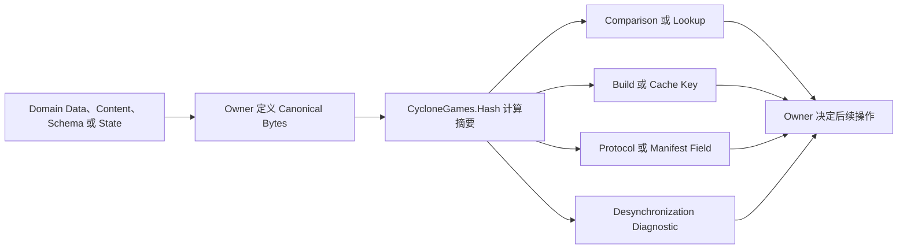
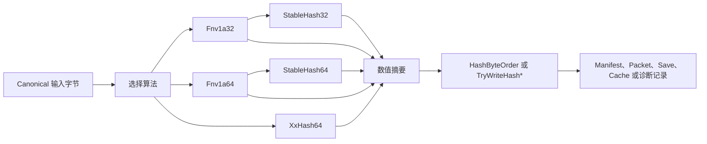

# CycloneGames.Hash

[English](README.md)

大型游戏会让同一份逻辑数据反复经过 Authoring Tool、Build Pipeline、Runtime System、Cache、Save、Network Protocol、Replay Tool 和 Server。这些系统需要一种紧凑方式判断 Definition、Payload、Schema 或 State Snapshot 是否相同，而不是每次都保留并完整比较源数据。

CycloneGames.Hash 就是为此服务的确定性指纹层。拥有数据的系统先把有意义的数据转换为 Canonical Ordered Bytes；本模块再把这些字节转换为固定宽度的非密码学摘要；最后由 Owner 使用该摘要完成 Lookup、Comparison、Invalidation、Compatibility Check 或 Diagnostics。

该模块面向 Unity Runtime、Editor 工具、命令行测试、Headless 进程和服务器组合。Runtime 程序集不引用 `UnityEngine`，不执行文件 I/O，不分配 Native 内存，不创建线程，也不保留全局状态。

## 1. 为什么需要这个模块

### 在游戏框架中的位置

CycloneGames.Hash 位于数据定义和 Canonical Serialization 之后，位于 Owner 的业务决策之前：



模块不决定哪些字段有意义、Object 如何序列化、Collision 是否可以接受，或者发现不一致后应该执行什么操作。这些决策属于拥有数据的 Gameplay、Content、Networking、Save 或 Build System。

这一边界让不同运行环境共享同一个小型 Hash Core，同时允许每个 Owner 定义自己的 Canonical Data Contract。

### 应用情景

| 应用情景 | 需要解决的问题 | CycloneGames.Hash 承担的职责 | 常用 API |
| --- | --- | --- | --- |
| 稳定命名 Definition | Authoring 使用可读名称，Runtime Lookup 需要紧凑数值 Key | 对 Canonical Name 计算 Hash；Owner 保留名称并检查 Collision | `StableHash64.ComputeUtf16Ordinal` 或显式 UTF-8 Bytes |
| Asset 与 Content 指纹 | Tool 需要判断有意义的内容是否发生变化 | 对 Canonical Content 或 Metadata Bytes 计算 Hash，用于快速比较 | `XxHash64.Compute` |
| Build 与 Cache 失效 | 只有全部相关输入相同时，昂贵的生成结果才能复用 | 把有序 Input 与 Setting 计算为 Cache Key | `XxHash64` Streaming 或 `Fnv1a64` Composition |
| Content Manifest 与 Update Catalog | Client 与 Server 需要同一 Manifest Entry 的紧凑指纹 | 生成 Manifest Digest；Authenticity 仍由 Security Layer 负责 | `XxHash64` 加显式字节序输出 |
| Protocol 与 Schema 检查 | Peer 必须在解释 Payload 前拒绝不兼容的 Layout | 对 Handshake 使用的 Canonical Field/Type Description 计算 Hash | `Fnv1a64` Ordered Composition |
| 确定性状态诊断 | Client、Server、Replay 或 Simulation Tool 需要定位第一个分歧检查点 | 对 Canonical Snapshot 计算 Hash，用于比较与日志 | `XxHash64` |
| 大型 File 或 Streaming Payload | 数据按 Chunk 到达，不应复制到一个大型 Buffer | 在有序 Chunk 之间维护增量状态 | `XxHash64.Create` 与 `Append` |
| 快速 Equality Filtering | 完整字节比较成本较高，并且大多数候选数据并不相同 | 先按 Digest 排除不同候选；需要绝对相等时由 Owner 再逐字节比较 | `XxHash64.Compute` |

#### 示例：Content Cache

```text
Source Asset + Import Setting + Dependency Identifier
    -> Canonical Input Bytes
    -> XXH64 Digest
    -> Cache Key
    -> Key 相同时复用 Output
    -> Key 不同时重新生成 Output
```

#### 示例：确定性状态诊断

```text
Checkpoint N 的 Authoritative State
    -> Canonical Snapshot Bytes
    -> XXH64 Digest
    -> 比较 Client/Server/Replay Value
    -> Value 不同时采集详细字段诊断
```

Hash 可以检测 Canonical Bytes 是否不同，但不能解释差异，也不能让 Simulation 自动具备确定性。拥有诊断流程的系统负责决定采集哪些字段以及如何报告。

### 如何判断是否应该使用

| 问题 | 决策 |
| --- | --- |
| 是否需要有序数据的紧凑、可重复指纹？ | 先定义精确 Input Bytes，再使用本模块 |
| 两个 Producer 是否可能把同一逻辑值序列化为不同 Bytes？ | 先定义 Canonicalization；Hash 本身无法修复差异 |
| Identifier 是否必须绝对唯一？ | 使用 Owner Assigned Stable ID，或者保留 Canonical Key 并拒绝 Collision |
| 结果是否必须证明可信或抵抗恶意篡改？ | 在 Security Layer 使用 Cryptographic Digest 加 Signature 或 MAC |
| 是否必须从数学上确认数据相等？ | 用 Digest 快速过滤，再比较 Canonical Bytes |
| 数据是否按有序 Chunk 到达？ | 使用增量 `XxHash64`，无需拼接 Chunk |

需要特别理解两个结论：

- Digest 不同时，可以确认 Algorithm Contract 或 Input Bytes 不同。
- 非密码学 Digest 相同时，只能作为很强的比较证据；因为存在 Collision，它不是绝对相等证明。

不要把 Runtime `GetHashCode()` 用作持久化、网络或跨 Tool 的数据契约。应显式选择 CycloneGames.Hash Algorithm，并定义 Canonical Input。

### 设计目标

本模块围绕以下性质设计：

- **确定性契约：** Algorithm、Seed、Input Order、Encoding 和 Byte Order 都保持可见。
- **纯 C# Core：** Domain、Editor、Client、Server 和 Headless Code 共享同一实现。
- **低分配执行：** Span API 和 Inline XXH64 State 避免模块拥有的 Heap Allocation。
- **显式所有权：** 调用方拥有 Input Memory、Mutable State、Threading、Storage 和 Failure Action。
- **跨平台表示：** Integer 与 Digest Byte Order 显式定义。
- **聚焦的 API：** 具体 Algorithm Entry Point 让调用点直接表达所选契约。
- **可测试行为：** Known Vector、Chunk Boundary、Allocation 与 Performance Path 都有专用测试。
- **清晰安全边界：** Collision Handling 与 Cryptographic Trust 明确属于 Owner。

### 核心职责

Hash 函数解决一个明确的问题：

> 当算法契约和输入字节完全一致时，所有生产者应计算出哪个固定宽度的摘要？

CycloneGames.Hash 提供：

- FNV-1a 32-bit 和 64-bit 字节 Hash；
- 对 .NET UTF-16 code unit 进行确定性 ordinal Hash；
- 为需要保留 `0` 作为未设置值的系统提供稳定非零 32-bit 和 64-bit helper；
- XXH64 one-shot 和增量 Hash；
- 显式 32-bit 与 64-bit little-endian、big-endian 转换；
- 主要热路径的分配与吞吐测试。

### 非目标

该模块不提供：

- 密码学认证、加密、签名或密码 Hash；
- 绝对唯一的标识符；
- 自动对象序列化；
- Unicode normalization 或文本编码；
- File、Stream、Network 或 Save System 的所有权；
- 全局 Hash Registry、Cache、Worker Pool 或 Job Scheduler。

这些边界使 Hash 契约与 Unity 生命周期、存储、传输和安全策略保持解耦。

### 推荐阅读顺序

- 第一次接入：阅读第 2、3、4 节。
- 设计确定性数据：继续阅读第 5、6、7、9 节。
- 高吞吐 Runtime 工作：重点阅读第 8、11、12 节。
- 持久化、网络与安全评审：阅读第 10、13、15 节。

## 2. 架构与包结构

| 程序集 | 路径 | 职责 | 可用条件 |
| --- | --- | --- | --- |
| `CycloneGames.Hash.Core` | `Core/` | 纯 C# 算法、状态和字节序 helper | 所有平台；无程序集依赖；`noEngineReferences=true` |
| `CycloneGames.Hash.Tests.Editor` | `Tests/Editor/` | Known Vector、边界、契约行为和分配测试 | Unity EditMode |
| `CycloneGames.Hash.Tests.Performance` | `Tests/Performance/` | 结构化吞吐与 Managed GC 测量 | 安装 Performance Testing 时在 Unity Editor 中启用 |



由自定义 asmdef 编译的代码应引用 `CycloneGames.Hash.Core`。源码随后导入：

```csharp
using CycloneGames.Hash.Core;
```

## 3. 选择正确的 API

选择与数据契约匹配的最窄 API：

| 需求 | 推荐 API | 原因 |
| --- | --- | --- |
| 对完整字节 Payload 快速计算摘要 | `XxHash64.Compute` | 简单的 one-shot 入口 |
| 大型 Payload 以有序 Chunk 到达 | `XxHash64.Create`、`Append`、`GetDigest` | 固定 inline state，不需要拼接 Buffer |
| 有序组合小型整数字段与字节 | `Fnv1a64` | 可直接组合 running state |
| 带 Collision 检查的紧凑 32-bit 字段 | `Fnv1a32` 或 `StableHash32` | 仅在契约要求 32-bit 时使用 |
| 非零 64-bit 标识符 | `StableHash64` | 保留 `0` 作为未设置值 |
| Ordinal .NET String 标识符 | `ComputeUtf16Ordinal` | 每个 UTF-16 code unit 参与一次计算 |
| 跨语言文本或协议数据 | 先编码 canonical bytes，再使用 FNV-1a 或 XXH64 | 显式确定编码与 normalization |
| 序列化数值摘要 | `HashByteOrder` 或 `TryWriteHash*` | 消除本机字节序歧义 |

算法数量不是模块质量指标。生产级契约更依赖精确输入定义、显式字节序、Collision 处理、测试和稳定所有权，而不是语义不清的可互换算法。

## 4. 快速上手

以下示例默认包含：

```csharp
using System;
using CycloneGames.Hash.Core;
```

### 对字节 Payload 计算 Hash

```csharp
public static ulong ComputePayloadHash(ReadOnlySpan<byte> payload)
{
    return XxHash64.Compute(payload);
}
```

返回值是数值形式的 `ulong` 摘要。相同字节和相同 Seed 会产生相同数值。

### 创建稳定的非零标识符

```csharp
public static ulong ComputeAbilityId(string canonicalName)
{
    return StableHash64.ComputeUtf16Ordinal(canonicalName);
}
```

该示例把输入定义为有序的 .NET UTF-16 code unit 序列。所有生产者都遵守这一规则时才使用它。

### 在不拼接 Buffer 的情况下计算有序 Payload

```csharp
public static ulong ComputePacketHash(
    ReadOnlySpan<byte> header,
    ReadOnlySpan<byte> payload,
    ReadOnlySpan<byte> footer)
{
    XxHash64 hash = XxHash64.Create();
    hash.Append(header);
    hash.Append(payload);
    hash.Append(footer);
    return hash.GetDigest();
}
```

依次追加 `A`、`B`、`C`，等价于对精确字节拼接 `A || B || C` 计算 Hash。

## 5. 确定性 Hash 契约

只有完整输入契约具备确定性时，数值摘要才具备确定性。持久化、网络或跨进程数据应定义以下全部属性：

| 术语 | 含义 |
| --- | --- |
| 输入字节 | 算法按顺序消费的精确字节序列 |
| 摘要 | 固定宽度的数值结果 |
| Seed | 由契约选择的初始数值状态 |
| Canonical Form | 一个逻辑值唯一允许的字节表示 |
| Collision | 两个不同输入产生相同摘要 |
| Running State | 可以继续接收有序输入的中间 Accumulator |

1. 算法与摘要位宽。
2. 初始 Seed 或 Running State。
3. 字段顺序。
4. 字段边界或长度前缀。
5. 文本编码与 Unicode normalization。
6. 整数和浮点数表示。
7. 摘要字节序。
8. Null、Empty、Missing 和 Default Value 规则。
9. Schema 或 Protocol 修订号。

如果没有编码边界，以下两组字段会产生歧义：

```text
["ab", "c"]  -> "abc"
["a", "bc"]  -> "abc"
```

应在可变长度数据之前加入固定宽度长度，或者对 Canonical Serializer 的输出计算 Hash，避免不同逻辑值在 Hash 之前就变成相同输入字节。

### Seed 语义

`XxHash64` 接受用于初始化算法的数值 Seed。

`Fnv1a32.Compute` 和 `Fnv1a64.Compute` 的 Seed overload 接受当前 FNV Running State，用于有序增量组合：

```csharp
public static ulong ComputeManifestHash(
    uint contractRevision,
    ulong contentLength,
    ReadOnlySpan<byte> content)
{
    ulong hash = Fnv1a64.OffsetBasis;
    hash = Fnv1a64.CombineUInt32LittleEndian(hash, contractRevision);
    hash = Fnv1a64.CombineUInt64LittleEndian(hash, contentLength);
    hash = Fnv1a64.Compute(content, hash);
    return hash;
}
```

FNV Running State 不是密钥，不能防御恶意输入。

## 6. 正确处理文本

文本必须拥有明确契约。视觉上相同的字符串可能具有不同 Unicode code point、normalization form、大小写、换行或空白。

### Ordinal UTF-16 标识符

`ComputeUtf16Ordinal` 会对每个 .NET `char` 执行一次 XOR/multiply。它不会把字符串编码为 UTF-8 或 UTF-16LE bytes。

适合使用该 API 的条件：

- 所有生产者都使用相同的 .NET UTF-16 code-unit 定义；
- 需要 ordinal、区分大小写的行为；
- 标识符不会与使用其他文本表示的生产者交换。

### 用于交换的 UTF-8 文本

对于 Network、File、Toolchain 或跨语言数据，应先定义 normalization 并显式编码文本：

```csharp
using System.Text;

public static ulong ComputeCanonicalTextHash(string text)
{
    if (text == null)
    {
        throw new ArgumentNullException(nameof(text));
    }

    string normalized = text.Normalize(NormalizationForm.FormC);
    byte[] utf8 = Encoding.UTF8.GetBytes(normalized);
    return XxHash64.Compute(utf8);
}
```

这个入门示例会分配 normalized string 和 UTF-8 array。热路径应在 Authoring 或 Ingestion 阶段完成 normalization，并由调用方提供 Scratch Memory：

```csharp
using System.Text;

public static bool TryComputeUtf8Hash(
    ReadOnlySpan<char> text,
    Span<byte> utf8Scratch,
    out ulong digest)
{
    int byteCount = Encoding.UTF8.GetByteCount(text);
    if (byteCount > utf8Scratch.Length)
    {
        digest = 0UL;
        return false;
    }

    int written = Encoding.UTF8.GetBytes(text, utf8Scratch);
    digest = XxHash64.Compute(utf8Scratch.Slice(0, written));
    return true;
}
```

Scratch Memory 示例不会执行 normalization。调用方必须提供已经符合契约的文本。

## 7. 处理结构化与跨平台数据

不要对 Object Memory、Reflection Order、`GetHashCode()`、Unity Instance ID 或任意 Serializer 输出直接计算 Hash。应先把有意义的字段转换为 Canonical Bytes。

```csharp
public static ulong ComputeStateRecordHash(
    uint contractRevision,
    ulong entityId,
    uint stateFlags,
    ReadOnlySpan<byte> payload)
{
    const int HEADER_SIZE = 20;
    Span<byte> header = stackalloc byte[HEADER_SIZE];

    HashByteOrder.WriteUInt32LittleEndian(
        header.Slice(0, 4),
        contractRevision);
    HashByteOrder.WriteUInt64LittleEndian(
        header.Slice(4, 8),
        entityId);
    HashByteOrder.WriteUInt32LittleEndian(
        header.Slice(12, 4),
        stateFlags);
    HashByteOrder.WriteUInt32LittleEndian(
        header.Slice(16, 4),
        checked((uint)payload.Length));

    XxHash64 hash = XxHash64.Create();
    hash.Append(header);
    hash.Append(payload);
    return hash.GetDigest();
}
```

长度字段为 Payload 提供无歧义边界。字节序 helper 使整数表示不依赖机器字节序。

### Canonicalization 检查清单

在处理结构化数据前，应定义：

- Dictionary、Set、Entity 和 Component 的排序；
- 固定字段顺序；
- 每个整数的位宽和 Signedness；
- Enum 与 Flag 的表示；
- Null 与 Missing Value 的处理；
- 文本编码、normalization、大小写和换行；
- Path Separator 与大小写规则；
- 浮点数量化，以及 `NaN`、Infinity、`-0` 和 `+0` 的处理；
- 是否包含 Timestamp 和 Transient Field。

Hash 可以检测字节差异，但不能让 Simulation、Serialization 或 Floating-Point Calculation 自动具备确定性。

## 8. One-shot、Streaming 与状态复用

完整 Payload 已经位于连续内存中时，使用 One-shot：

```csharp
ulong digest = XxHash64.Compute(payloadBytes, seed: 0UL);
```

数据按 Chunk 到达，或者拼接数据需要额外 Buffer 时，使用 Streaming：

```csharp
using System.IO;

public static ulong ComputeStreamHash(Stream stream, byte[] buffer)
{
    if (stream == null)
    {
        throw new ArgumentNullException(nameof(stream));
    }

    if (buffer == null || buffer.Length == 0)
    {
        throw new ArgumentException(
            "A non-empty caller-owned buffer is required.",
            nameof(buffer));
    }

    XxHash64 hash = XxHash64.Create();
    int bytesRead;
    while ((bytesRead = stream.Read(buffer, 0, buffer.Length)) > 0)
    {
        hash.Append(buffer, 0, bytesRead);
    }

    return hash.GetDigest();
}
```

I/O 和 Buffer 由调用方拥有。`XxHash64` 只消费传递给 `Append` 的字节。

### 状态行为

- `Create(seed)` 初始化新状态。
- `default(XxHash64)` 是合法的 Seed-0 状态。
- `Append` 按调用顺序处理字节。
- `GetDigest` 不会消耗状态；之后仍可继续追加数据。
- `Reset(seed)` 清理状态和 inline tail buffer，以便复用。
- 复制 Struct 会创建 Accumulator 与 Buffered Bytes 的独立快照。

```csharp
XxHash64 hash = XxHash64.Create();
hash.Append(firstPayload);
ulong firstDigest = hash.GetDigest();

hash.Reset(seed: 42UL);
hash.Append(secondPayload);
ulong secondDigest = hash.GetDigest();
```

Mutable State 需要反复传递给 Helper Method 且不需要快照语义时，使用 `ref` 传递。

## 9. 摘要序列化与字节序

数值形式的 `ulong` 摘要与它的 8 个序列化字节属于两个不同契约。

- Canonical xxHash byte representation 使用 big-endian。
- 可互操作的 FNV byte vector 使用 little-endian。
- 项目内部格式只有在显式定义时才能选择其他字节序。

```csharp
Span<byte> xxHashBytes = stackalloc byte[XxHash64.HashSizeInBytes];
XxHash64 state = XxHash64.Create();
state.Append(payload);

bool written = state.TryWriteHashBigEndian(xxHashBytes);
if (!written)
{
    throw new InvalidOperationException("The digest buffer is too small.");
}

ulong receivedDigest =
    HashByteOrder.ReadUInt64BigEndian(xxHashBytes);
```

`TryWriteHash` 写入 canonical big-endian representation。`TryWriteHashBigEndian` 显式表达相同契约。`TryWriteHashLittleEndian` 以 little-endian 写入数值摘要。

当 Destination 少于 8 bytes 时，所有 `TryWriteHash*` 都返回 `false` 且不写入。`HashByteOrder` read/write method 对过短输入遵循标准 Span Range 行为。

## 10. 稳定标识符与 Collision 管理

非密码学 Hash 是紧凑指纹，不是唯一性证明。对于均匀分布值，Birthday Approximation 为：

| 位宽 | 至少发生一次 Collision 的概率约为 1% | 概率约为 50% |
| --- | ---: | ---: |
| 32-bit | 9,300 个不同值 | 77,000 个不同值 |
| 64-bit | 6.09 亿个不同值 | 50.6 亿个不同值 |

只有 Storage 或 Protocol 强制要求时才使用 32-bit 标识符，并由 Owner 检测 Collision。大型 Registry 应优先使用 64-bit 标识符。

`StableHash32` 和 `StableHash64` 会把最终 Zero Digest 映射到 `NonZeroFallback`。这样系统可以保留 `0` 表示 "未设置"，但不会获得唯一性，并会与 Fallback Value 额外产生一次 Collision。

冷路径 Registry 应保留 Canonical Key：

```csharp
using System.Collections.Generic;

public static ulong RegisterAbilityId(
    Dictionary<ulong, string> registry,
    string canonicalName)
{
    ulong id = StableHash64.ComputeUtf16Ordinal(canonicalName);

    if (registry.TryGetValue(id, out string registeredName))
    {
        if (!string.Equals(
                registeredName,
                canonicalName,
                StringComparison.Ordinal))
        {
            throw new InvalidOperationException(
                "A stable hash collision was detected.");
        }

        return id;
    }

    registry.Add(id, canonicalName);
    return id;
}
```

应在 Authoring、Loading 或 Composition 阶段建立并校验 Registry，不要在每帧热路径执行 Discovery。

## 11. 性能、内存与 Cache 行为

| 路径 | 时间复杂度 | 模块拥有的 Managed Allocation | 工作状态 |
| --- | --- | --- | --- |
| FNV-1a Byte 或 UTF-16 Hash | `O(n)` | 0 bytes | 数值 Accumulator |
| XXH64 One-shot | `O(n)` | 0 bytes | 带 Inline Tail Storage 的 Value State |
| XXH64 Streaming | 所有 Chunk 合计 `O(n)` | 0 bytes | 调用方拥有的 Mutable State |
| 字节序 Read/Write | `O(1)` | 0 bytes | 无 |

基于 Span 的 Core 路径不分配 Managed Memory。XXH64 按 32-byte stripe 处理数据，并在 inline 32-byte buffer 中保留最多 31 个未处理字节。

模块不会缓存：

- Input Buffer 或 String；
- Path 或 File Metadata；
- Digest 或格式化后的 Hex String；
- Reflection Result；
- Encoding Buffer。

因此不存在 Cache Invalidation、Retained Memory Growth、Synchronization 和 Cleanup Ownership。应使用 `Reset` 复用 `XxHash64`，而不是池化这个小型 Value State。

调用方仍可能通过以下操作产生分配：

- `Encoding.GetBytes(string)`；
- 新建 Array 与 Collection 扩容；
- LINQ、Delegate、Closure 和 Iterator；
- Stream 或 Task Wrapper；
- `ToString` 和 Hex Formatting。

性能必须在 Owner Workload 中测量。内置 Performance Assembly 覆盖 64-byte 与 1 MiB XXH64、4 KiB Streaming Chunk、1 MiB FNV-1a 64-bit 和 Managed GC。发布验收应为每类目标设备定义 Throughput、Latency、Allocation、Code Size 和 Warm-up Budget。

## 12. 线程、所有权与平台行为

### 线程

- `Fnv1a32`、`Fnv1a64`、`StableHash32`、`StableHash64` 和 `HashByteOrder` 没有 Mutable Static State，可以并发调用。
- 一个 Mutable `XxHash64` Value 只有一个 Mutation Owner。
- 不要对同一个 State 并发调用 `Append` 或 `Reset`。
- 独立 `XxHash64` Value 可以在不同 Worker 上运行，不需要锁。
- 模块不创建线程、不选择 Scheduler，也不引入 Synchronization。

不能任意组合不同 Partition 的 Digest。分别 Hash `A` 与 `B`，再 Hash 两个 Digest，不等价于 Hash `A || B`。应保留输入顺序，或者由 Owner System 定义独立的 Tree-Hash 契约。

### 平台行为

Runtime 程序集：

- 对所有 Unity 平台启用；
- 不引用 `UnityEngine` 或平台 SDK；
- 使用可移植整数运算、Span 和 `BinaryPrimitives`；
- 使用显式字节序；
- 不使用 Unsafe Code、Native Plugin、Reflection 或 Dynamic Code Generation；
- 不拥有 Thread、File、Socket、Handle 或 Native Container。

该设计避免在 Core Algorithm 中引入操作系统与 CPU 特定控制流。平台发布验证应在目标 Scripting Backend 下运行相同 Known Vector 和 Chunk Boundary Test，再执行目标平台的性能与分配测量。

## 13. 持久化、网络、安全与 Integration

CycloneGames.Hash 不写入 File、Asset、Project Preference、Player Preference、Registry Entry 或 Hidden Cache Data。Consumer 负责 Storage Path、Atomic Write、Schema Revision、Format Evolution、Corruption Recovery 和 Cleanup。

持久化或传输 Digest 时，应保存或冻结：

| 契约字段 | 示例 |
| --- | --- |
| Algorithm | `XXH64` |
| Digest Width | `64` |
| Seed | `0` |
| Text Representation | `UTF-8, NFC, case-sensitive` |
| Integer Order | `Little-endian` |
| Digest Order | `Big-endian` |
| Field Layout | 固定顺序，可变字段带长度前缀 |
| Contract Revision | 由 Manifest、Save 或 Protocol 拥有 |

改变任意字段都会改变数据契约。Owner Format 应使用不同 Contract Revision，并由 Reader 或 Adapter 在解释字节前选择匹配的契约。

### 安全边界

FNV-1a 和 XXH64 都是非密码学算法，适合意外差异检测、Cache、本地 Lookup、Diagnostics 和 Desynchronization Report。它们不能证明来源、阻止篡改、保护 Secret，也不能抵抗故意构造 Collision。

Remote Executable Content、Paid Content、Account Data、Anti-Cheat Evidence 和 Trusted Update 需要由 Security Owner 设计，例如 Cryptographic Digest 加 Authenticated Signature 或 MAC。

### Integration 边界

Domain 与 Platform 关注点应保留在 Core 之外：

```text
File/Network/Unity Adapter
    -> Canonical Bytes
    -> CycloneGames.Hash
    -> Numeric 或 Serialized Digest
    -> Owner 定义的 Storage、Comparison、Logging 或 Security Action
```

Adapter 可以负责 Stream Reading、Asset Traversal、Native Container Conversion、Job Scheduling 或 Protocol Framing，但不能隐式改变算法契约。

## 14. Public API 参考

### `Fnv1a32`

- `Compute(ReadOnlySpan<byte>)`：从 `OffsetBasis` 开始计算 Byte Hash。
- `Compute(ReadOnlySpan<byte>, uint seed)`：从 Running FNV State 继续计算。
- `ComputeUtf16Ordinal(ReadOnlySpan<char>)`：从 `OffsetBasis` 开始计算 UTF-16 Code Unit Hash。
- `ComputeUtf16Ordinal(ReadOnlySpan<char>, uint seed)`：继续 Ordinal Text Contract。
- `CombineUInt32LittleEndian`：按 Low Byte First 合并 4 bytes。

### `Fnv1a64`

- `Compute(ReadOnlySpan<byte>)` 及其 Running State overload。
- `ComputeUtf16Ordinal(ReadOnlySpan<char>)` 及其 Running State overload。
- `CombineUInt32LittleEndian`：把 32-bit 字段合并到 64-bit State。
- `CombineUInt64LittleEndian`：按 Low Byte First 合并 8-byte 字段。

### `StableHash32` 与 `StableHash64`

- `ComputeBytes`：应用 FNV，并映射最终 Zero Digest。
- `ComputeUtf16Ordinal`：计算 Ordinal UTF-16 Text Hash，并映射最终 Zero Digest。
- `EnsureNonZero`：把 `0` 映射为 `NonZeroFallback`。
- `CombineUInt32LittleEndian` 或 `CombineUInt64LittleEndian`：继续有序字段组合，不应用最终 Zero Mapping。

`string` overload 对 `null` 抛出 `ArgumentNullException`。Span overload 把 Empty Span 视为合法空输入。

### `XxHash64`

- `Create(seed)`：创建已初始化 State。
- `Reset(seed)`：清理并重新初始化 State。
- `Append(ReadOnlySpan<byte>)`：追加 Span。
- `Append(byte[], offset, count)`：追加 Array Slice，并使用标准 Range Validation。
- `GetDigest()`：读取 Digest，不消耗 State。
- `Compute(data, seed)`：One-shot Hash。
- `HashToUInt64(data, seed)`：One-shot Numeric Digest Alias。
- `TryWriteHash` 与 `TryWriteHashBigEndian`：Canonical Big-endian Bytes。
- `TryWriteHashLittleEndian`：显式 Little-endian Numeric Bytes。
- `HashSizeInBytes`：Digest Destination 所需长度。

### `HashByteOrder`

提供 32-bit 和 64-bit 数值的 Little-endian、Big-endian Read/Write Method。Source 或 Destination Span 必须至少包含所选位宽需要的 4 或 8 bytes。

## 15. 验证与故障排查

### 编译检查

可以使用 Unity 生成的 Project File 执行本地编译检查：

```bash
dotnet build UnityStarter/CycloneGames.Hash.Core.csproj -v:minimal
dotnet build UnityStarter/CycloneGames.Hash.Tests.Editor.csproj -v:minimal
dotnet build UnityStarter/CycloneGames.Hash.Tests.Performance.csproj -v:minimal
```

### Unity 验证

1. 使用 `ProjectSettings/ProjectVersion.txt` 记录的 Unity release 打开 `<repo-root>/UnityStarter`。
2. Refresh Script，并确认 Console 没有 Compilation Error。
3. 在 EditMode 运行 `CycloneGames.Hash.Tests.Editor`。
4. 安装 Performance Testing 后运行 `CycloneGames.Hash.Tests.Performance`。
5. 对 Persisted、Networked 或 Public Contract 使用变更 Hash 路径的所有 Consumer 运行测试。
6. 在每个 Release Player 和 Scripting Backend 中运行 Known Vector 与性能检查。

### 故障排查

| 现象 | 常见原因 | 处理方式 |
| --- | --- | --- |
| 视觉上相同的文本得到不同 Hash | Encoding、Normalization、Case、Whitespace 或 Line Ending 不同 | 对比 Canonical Text Contract，并 Hash 显式 Bytes |
| 数值 Digest 相同但序列化 Bytes 不同 | Producer 使用不同字节序 | 使用显式 `HashByteOrder` 或 `TryWriteHash*` |
| One-shot 与 Streaming XXH64 不同 | Seed、顺序、Offset、Count 或 Chunk Coverage 不同 | 确认 Chunk 按顺序且仅一次覆盖精确字节序列 |
| 稳定标识符发生 Collision | Owner 把指纹当成了唯一 Key | 保存 Canonical Key、检测 Collision，并使用更宽契约 |
| 热路径出现 Allocation | 调用方 Encoding、Buffer、Enumeration 或 Formatting 产生分配 | Profile 完整调用路径，并提供可复用 Span/Buffer |
| 不同平台报告不同 State Hash | Hash 之前的 Canonical Serialization 或 Simulation 不同 | 在检查 Hash 前，按字段边界比较序列化 Bytes |
| Digest 被用作可信证明 | 非密码学 Hash 越过了安全边界 | 在 Security Owner 中使用 Cryptographic Digest 加 Signature 或 MAC |

## 参考资料

- [xxHash reference implementation](https://github.com/Cyan4973/xxHash)
- [IETF FNV draft](https://datatracker.ietf.org/doc/draft-eastlake-fnv/)
