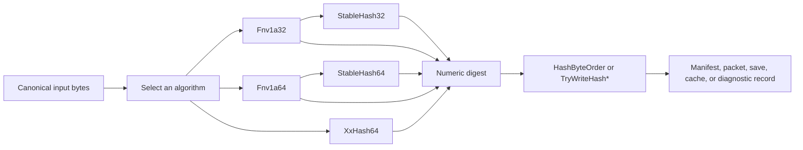

# CycloneGames.Hash

[English | 简体中文](README.md)

CycloneGames.Hash 为 Unity 项目、构建管线和纯 C# 服务提供确定性的非加密哈希原语。它在无 `UnityEngine` 依赖的纯 C# 核心中封装了 FNV-1a（32/64 位）、XXH64、稳定的非零标识符以及显式字节序辅助方法，使同一套哈希契约在 Runtime、Editor、CLI、headless 和服务端环境中产生完全相同的摘要。

## 目录

- [概述](#概述)
- [架构](#架构)
- [快速上手](#快速上手)
- [核心概念](#核心概念)
- [使用指南](#使用指南)
- [进阶主题](#进阶主题)
- [常见场景](#常见场景)
- [性能与内存](#性能与内存)
- [故障排查](#故障排查)

## 概述

哈希函数回答一个问题：给定相同算法和相同输入字节，每个生产者应该计算出什么固定宽度的摘要？CycloneGames.Hash 用一组聚焦的算法回答这个问题，每条 API 在调用处显式暴露契约（算法、种子、字节序）。

本模块适用于项目需要对规范数据进行紧凑指纹采集的时机：资产内容、构建输入、协议 schema、确定性状态快照、命名定义或缓存键。所有者决定要哈希哪些字节，本模块把这些字节转换成可以比较、缓存、传输或记录的稳定摘要。

适用场景：

- 创作工具、构建管线或 Runtime 代码需要对有序数据的紧凑可重复指纹。
- 同一逻辑值需要在不同机器、进程和 Unity 后端之间产生相同摘要。
- 需要基于 span、热路径零分配的哈希能力。

不要用于加密认证、防篡改、密码存储或保证唯一的标识符。这些职责属于带签名或 MAC 的加密摘要层。

### 主要特性

- **FNV-1a 32 位与 64 位**：适合有序组合少量字段与字节。
- **XXH64**：一次性与流式两种用法，适合较大负载的快速摘要。
- **StableHash32 / StableHash64**：将 `0` 保留为"未设置"哨兵值。
- **HashByteOrder**：显式小端和大端的读写辅助方法。
- **纯 C# 核心**：`noEngineReferences: true`，基于 span 的 API，热路径零模块级堆分配。

## 架构

本模块由一个程序集及其测试组成：

| 程序集 | 路径 | 用途 |
| --- | --- | --- |
| `CycloneGames.Hash.Core` | `Core/` | 算法、状态与字节序辅助方法。不引用 `UnityEngine`。 |
| `CycloneGames.Hash.Tests.Editor` | `Tests/Editor/` | 已知向量、分块边界、契约与分配测试。 |
| `CycloneGames.Hash.Tests.Performance` | `Tests/Performance/` | 吞吐量与托管 GC 测量（需要 Performance Testing 包）。 |



所有者把有意义的数据转换成规范字节，本模块把这些字节转换成摘要，所有者再决定如何使用结果。算法选择、种子、字段顺序、编码和字节序都在调用处可见，绝不隐藏在隐式配置背后。

## 快速上手

在 asmdef 中添加对 `CycloneGames.Hash.Core` 的引用，然后导入命名空间：

```csharp
using CycloneGames.Hash.Core;
```

### 哈希字节负载

```csharp
public static ulong ComputePayloadHash(ReadOnlySpan<byte> payload)
{
    return XxHash64.Compute(payload);
}
```

相同的字节和种子在每个环境中产生相同的 `ulong` 摘要。

### 哈希字符串标识符

```csharp
public static ulong ComputeAbilityId(string canonicalName)
{
    return StableHash64.ComputeUtf16Ordinal(canonicalName);
}
```

`StableHash64` 会将最终的零摘要映射到非零回退值，因此可以把 `0` 保留为"未设置"哨兵。

### 不拼接直接哈希有序分块

```csharp
public static ulong ComputePacketHash(
    ReadOnlySpan<byte> header,
    ReadOnlySpan<byte> payload,
    ReadOnlySpan<byte> footer)
{
    XxHash64 hash = XxHash64.Create();
    hash.Append(header);
    hash.Append(payload);
    hash.Append(footer);
    return hash.GetDigest();
}
```

依次追加 `A`、`B`、`C`，与哈希拼接后的字节序列 `A || B || C` 产生相同的摘要。

## 核心概念

### 算法选择

选择与数据契约最匹配的最窄 API：

| 需求 | 推荐 API | 原因 |
| --- | --- | --- |
| 完整字节负载的快速摘要 | `XxHash64.Compute` | 一次性入口 |
| 大负载分块到达 | `XxHash64.Create` + `Append` + `GetDigest` | 内联状态固定，无需拼接缓冲区 |
| 少量整数字段的有序组合 | `Fnv1a64` | 直接基于运行状态组合 |
| 32 位紧凑字段且处理碰撞 | `Fnv1a32` 或 `StableHash32` | 仅在契约要求 32 位时使用 |
| 非零 64 位标识符 | `StableHash64` | 把 `0` 保留为未设置哨兵 |
| .NET 序号字符串标识符 | `ComputeUtf16Ordinal` | 每个 UTF-16 code unit 一次 XOR/multiply |
| 跨语言文本或协议数据 | 编码为规范字节后用 FNV-1a 或 XXH64 | 显式化编码与归一化 |
| 序列化数值摘要 | `HashByteOrder` 或 `TryWriteHash*` | 避免机器字节序歧义 |

算法数量并不是质量的衡量标准。可靠的契约更依赖于精确的输入定义、显式字节序和碰撞处理，而不是语义不清的同类互换算法。

### 确定性契约

数值摘要只有在整个输入契约确定时才确定。持久化、网络或跨进程数据应固定以下每一项：

1. 算法与摘要宽度。
2. 初始种子或运行状态。
3. 字段顺序。
4. 字段边界或长度前缀。
5. 文本编码与 Unicode 归一化。
6. 整数与浮点数表示。
7. 摘要字节序。
8. null、空、缺失与默认值规则。
9. Schema 或协议版本。

例如，没有编码边界时，下面两组字段序列会塌缩为相同的输入字节：

```text
["ab", "c"]  -> "abc"
["a", "bc"]  -> "abc"
```

在可变长度数据前加固定宽度长度前缀，或哈希规范序列化器的输出，避免不同逻辑值在哈希之前就碰撞。

### 种子语义

`XxHash64` 接受一个数值种子初始化算法。`Fnv1a32.Compute` 与 `Fnv1a64.Compute` 的种子重载接受当前 FNV 运行状态，从而支持有序增量组合：

```csharp
public static ulong ComputeManifestHash(
    uint contractRevision,
    ulong contentLength,
    ReadOnlySpan<byte> content)
{
    ulong hash = Fnv1a64.OffsetBasis;
    hash = Fnv1a64.CombineUInt32LittleEndian(hash, contractRevision);
    hash = Fnv1a64.CombineUInt64LittleEndian(hash, contentLength);
    hash = Fnv1a64.Compute(content, hash);
    return hash;
}
```

FNV 运行状态不是密钥，对恶意输入没有防护能力。

## 使用指南

### 哈希文本

文本必须有显式契约。视觉上相同的字符串可能包含不同的 Unicode code point、归一化形式、大小写、行尾或空白。

**序号 UTF-16 标识符** —— `ComputeUtf16Ordinal` 对每个 .NET `char` 执行一次 XOR/multiply，不会把字符串编码为 UTF-8 或 UTF-16LE 字节。当所有生产者使用相同的 .NET UTF-16 code-unit 定义、且需要序号区分大小写行为时使用。

**用于交换的 UTF-8** —— 网络、文件、工具链或跨语言数据，需显式定义归一化，再把文本编码为 UTF-8 字节后哈希：

```csharp
using System.Text;

public static ulong ComputeCanonicalTextHash(string text)
{
    if (text == null) throw new ArgumentNullException(nameof(text));
    string normalized = text.Normalize(NormalizationForm.FormC);
    byte[] utf8 = Encoding.UTF8.GetBytes(normalized);
    return XxHash64.Compute(utf8);
}
```

此示例为入门用法，会分配归一化字符串和 UTF-8 数组。热路径上应在创作或导入阶段完成归一化，由调用方提供 scratch 内存：

```csharp
using System.Text;

public static bool TryComputeUtf8Hash(
    ReadOnlySpan<char> text,
    Span<byte> utf8Scratch,
    out ulong digest)
{
    int byteCount = Encoding.UTF8.GetByteCount(text);
    if (byteCount > utf8Scratch.Length)
    {
        digest = 0UL;
        return false;
    }

    int written = Encoding.UTF8.GetBytes(text, utf8Scratch);
    digest = XxHash64.Compute(utf8Scratch.Slice(0, written));
    return true;
}
```

### 哈希结构化数据

不要哈希对象内存、反射顺序、`GetHashCode()`、Unity 实例 ID 或任意序列化器输出。先把有意义的字段转换成规范字节：

```csharp
public static ulong ComputeStateRecordHash(
    uint contractRevision,
    ulong entityId,
    uint stateFlags,
    ReadOnlySpan<byte> payload)
{
    const int HEADER_SIZE = 20;
    Span<byte> header = stackalloc byte[HEADER_SIZE];

    HashByteOrder.WriteUInt32LittleEndian(header.Slice(0, 4), contractRevision);
    HashByteOrder.WriteUInt64LittleEndian(header.Slice(4, 8), entityId);
    HashByteOrder.WriteUInt32LittleEndian(header.Slice(12, 4), stateFlags);
    HashByteOrder.WriteUInt32LittleEndian(header.Slice(16, 4), checked((uint)payload.Length));

    XxHash64 hash = XxHash64.Create();
    hash.Append(header);
    hash.Append(payload);
    return hash.GetDigest();
}
```

长度字段给负载明确的边界。字节序辅助方法让整数表示与机器字节序无关。

#### 规范化清单

哈希结构化数据前，需定义：

- 字典、集合、实体与组件的排序。
- 固定字段顺序。
- 每个整数的宽度与符号。
- 枚举与标志的表示。
- null 与缺失值的处理。
- 文本编码、归一化、大小写与行尾。
- 路径分隔符与大小写策略。
- 浮点数量化与 `NaN`、无穷、`-0`、`+0` 的处理。
- 时间戳与瞬态字段的取舍。

哈希能检测字节差异，但不能让模拟、序列化或浮点计算变确定性。

### 流式与状态复用

负载已经连续存放时使用一次性哈希：

```csharp
ulong digest = XxHash64.Compute(payloadBytes, seed: 0UL);
```

数据分块到达或拼接需要额外缓冲时使用流式：

```csharp
using System.IO;

public static ulong ComputeStreamHash(Stream stream, byte[] buffer)
{
    if (stream == null) throw new ArgumentNullException(nameof(stream));
    if (buffer == null || buffer.Length == 0)
        throw new ArgumentException("A non-empty caller-owned buffer is required.", nameof(buffer));

    XxHash64 hash = XxHash64.Create();
    int bytesRead;
    while ((bytesRead = stream.Read(buffer, 0, buffer.Length)) > 0)
    {
        hash.Append(buffer, 0, bytesRead);
    }
    return hash.GetDigest();
}
```

I/O 与缓冲区归调用方所有。`XxHash64` 只消费传给 `Append` 的字节。

状态行为：

- `Create(seed)` 初始化新状态。
- `default(XxHash64)` 是合法的 seed-0 状态。
- `Append` 按调用顺序处理字节。
- `GetDigest` 不破坏状态，之后可以继续追加字节。
- `Reset(seed)` 清空状态与内联尾部缓冲区以便复用。
- 复制 struct 会创建累加器与缓冲字节的独立快照。

```csharp
XxHash64 hash = XxHash64.Create();
hash.Append(firstPayload);
ulong firstDigest = hash.GetDigest();

hash.Reset(seed: 42UL);
hash.Append(secondPayload);
ulong secondDigest = hash.GetDigest();
```

需要重复通过辅助方法调用同一可变状态且不需要快照语义时，按 `ref` 传递。

### 序列化摘要

数值 `ulong` 摘要与其 8 字节序列化形式是两份独立契约：

- XXH64 规范字节表示为**大端**。
- 互操作 FNV 字节向量使用**小端**。
- 项目本地格式可以选择其他字节序，但必须在格式中显式定义。

```csharp
Span<byte> xxHashBytes = stackalloc byte[XxHash64.HashSizeInBytes];
XxHash64 state = XxHash64.Create();
state.Append(payload);

bool written = state.TryWriteHashBigEndian(xxHashBytes);
if (!written) throw new InvalidOperationException("Digest buffer too small.");

ulong receivedDigest = HashByteOrder.ReadUInt64BigEndian(xxHashBytes);
```

`TryWriteHash` 写入规范的大端表示。`TryWriteHashBigEndian` 显式声明同一契约。`TryWriteHashLittleEndian` 按小端写入数值摘要。所有 `TryWriteHash*` 方法在目标缓冲区小于 8 字节时返回 `false` 且不写入。

### 稳定标识符与碰撞处理

非加密哈希是紧凑指纹，不是唯一性证明。对于均匀分布的值，生日近似给出：

| 宽度 | 至少一次碰撞的 ~1% 概率 | ~50% 概率 |
| --- | ---: | ---: |
| 32 位 | 9,300 个不同值 | 77,000 个不同值 |
| 64 位 | 6.09 亿个不同值 | 50.6 亿个不同值 |

仅在存储或协议约束要求且所有者处理碰撞时使用 32 位标识符。大型注册表优先使用 64 位。

`StableHash32` 与 `StableHash64` 把最终零摘要映射到 `NonZeroFallback`。这让系统可以把 `0` 保留为"未设置"，但不会创造唯一性，并增加一个与回退值的碰撞。

冷路径注册表应同时保留规范键：

```csharp
using System.Collections.Generic;

public static ulong RegisterAbilityId(
    Dictionary<ulong, string> registry,
    string canonicalName)
{
    ulong id = StableHash64.ComputeUtf16Ordinal(canonicalName);

    if (registry.TryGetValue(id, out string registeredName))
    {
        if (!string.Equals(registeredName, canonicalName, StringComparison.Ordinal))
            throw new InvalidOperationException("A stable hash collision was detected.");
        return id;
    }

    registry.Add(id, canonicalName);
    return id;
}
```

在创作、加载或组合阶段完成注册与校验，不要放在逐帧热路径上。

## 进阶主题

### 合并独立分区的摘要

独立分区的摘要不能任意合并。分别哈希 `A` 与 `B`，再哈希它们的摘要，**不等价于**哈希 `A || B`。保留输入顺序，或由所属系统定义独立的 tree-hash 契约。

### 跨语言契约

摘要需要与非 .NET 生产者（C++ 服务端、Rust 工具、Python 构建脚本）匹配时，契约必须固定 [确定性契约](#确定性契约) 中列出的每一项。最常见的陷阱：

- .NET 字符串是 UTF-16；许多其他语言默认 UTF-8。
- .NET `BitConverter` 使用机器字节序；显式 `HashByteOrder` 调用避免歧义。
- `GetHashCode()` 在不同机器、进程或 .NET 版本之间不稳定。不要持久化或传输它。

### 何时改用加密摘要

当哈希数据跨越信任边界时，改用带签名或 MAC 的加密摘要（如 SHA-256）：

- 远程可执行内容或付费内容。
- 账号数据或反作弊证据。
- 通过不可信通道分发的可信更新。

FNV-1a 与 XXH64 检测意外差异，不证明来源、不防篡改、不抗刻意碰撞构造。

## 常见场景

### 内容缓存失效

构建工具希望只在每个相关输入完全相同时复用昂贵的生成输出：

```text
Source asset + import settings + dependency identifiers
    -> canonical input bytes
    -> XXH64 digest
    -> cache key
    -> reuse output when the key matches
    -> rebuild output when the key differs
```

输入较大或分块到达时使用 `XxHash64` 流式 API。

### 确定性状态诊断

客户端、服务端、回放或模拟工具需要定位第一个分歧检查点：

```text
Authoritative state at checkpoint N
    -> canonical snapshot bytes
    -> XXH64 digest
    -> compare client/server/replay values
    -> capture detailed field diagnostics when values differ
```

哈希能检测规范字节的差异，不解释差异本身，也不让模拟变确定性。所属诊断系统决定捕获哪些字段以及如何上报。

### 协议与 Schema 校验

通信双方在解释负载前必须拒绝不兼容的布局。对握手使用的规范字段/类型描述进行哈希：

```csharp
public static ulong ComputeSchemaHash(uint revision, ReadOnlySpan<byte> schemaBytes)
{
    ulong hash = Fnv1a64.OffsetBasis;
    hash = Fnv1a64.CombineUInt32LittleEndian(hash, revision);
    hash = Fnv1a64.Compute(schemaBytes, hash);
    return hash;
}
```

### 稳定的命名定义

创作使用可读名称，Runtime 查找需要紧凑数值键：

```csharp
public static ulong ComputeTagId(string canonicalName)
{
    return StableHash64.ComputeUtf16Ordinal(canonicalName);
}
```

所有者保留规范名称，并在创作阶段拒绝碰撞。

## 性能与内存

| 路径 | 时间复杂度 | 模块级分配 | 工作状态 |
| --- | --- | --- | --- |
| FNV-1a 字节或 UTF-16 哈希 | `O(n)` | 0 字节 | 数值累加器 |
| XXH64 一次性 | `O(n)` | 0 字节 | 含内联 32 字节尾部的值状态 |
| XXH64 流式 | 跨所有分块 `O(n)` | 0 字节 | 调用方拥有的可变状态 |
| 字节序读写 | `O(1)` | 0 字节 | 无 |

基于 span 的核心路径不分配托管内存。XXH64 处理 32 字节 stripe，并在内联 32 字节缓冲区中保留至多 31 字节未处理数据。

本模块不缓存输入缓冲区、字符串、路径、摘要、反射结果或编码缓冲区。这避免了缓存失效、保留内存增长、同步与清理归属问题。用 `Reset` 复用 `XxHash64` 而不是池化其小型值状态。

调用方代码仍可能通过 `Encoding.GetBytes(string)`、新增数组与集合扩容、LINQ、委托、闭包、迭代器、stream/task 包装、`ToString` 与十六进制格式化产生分配。归因到哈希层之前，先 profile 完整调用路径。

### 线程

- `Fnv1a32`、`Fnv1a64`、`StableHash32`、`StableHash64` 与 `HashByteOrder` 无可变静态状态，可并发调用。
- 可变 `XxHash64` 值只有一个修改者。不要在同一状态上并发调用 `Append` 或 `Reset`。
- 独立的 `XxHash64` 值可以在不同 worker 上无锁运行。
- 本模块不创建线程、不选择调度器、不引入同步。

### 平台行为

Runtime 程序集在所有 Unity 平台启用，不引用 `UnityEngine` 或平台 SDK，使用可移植整数运算、span 与 `BinaryPrimitives`，使用显式字节序，不使用 unsafe 代码、原生插件、反射或动态代码生成，不持有线程、文件、socket、句柄或原生容器。发布验证应在目标脚本后端下运行相同的已知向量与分块边界测试，再做目标相关的性能与分配测量。

## 故障排查

| 现象 | 可能原因 | 解决方法 |
| --- | --- | --- |
| 相同可见文本哈希结果不同 | 编码、归一化、大小写、空白或行尾规则不同 | 比对规范文本契约，对显式字节做哈希 |
| 数值摘要相同但序列化字节不同 | 生产者使用不同字节序 | 使用显式 `HashByteOrder` 或 `TryWriteHash*` |
| 一次性与流式 XXH64 结果不同 | 种子、顺序、偏移、数量或分块覆盖不同 | 校验分块恰好覆盖字节序列一次且按顺序 |
| 稳定标识符碰撞 | 所有者把指纹当作唯一键 | 保留规范键、检测碰撞、使用更宽契约 |
| 热路径产生分配 | 调用方代码中的编码、缓冲区、枚举或格式化分配 | Profile 完整调用路径，提供可复用 span/buffer |
| 不同平台状态哈希不同 | 哈希之前的规范序列化或模拟不同 | 在检查哈希之前先比对字段边界处的序列化字节 |
| 摘要被当作信任证明 | 非加密哈希跨越了安全边界 | 在安全所有者中使用带签名或 MAC 的加密摘要 |

## 验证

通过 Unity Test Runner 运行聚焦测试：

```text
<UnityEditor> -batchmode -nographics -projectPath <repo-root>/UnityStarter -runTests -testPlatform EditMode -assemblyNames CycloneGames.Hash.Tests.Editor -testResults <result-path> -quit
```

安装 `com.unity.test-framework.performance` 后，也运行 `CycloneGames.Hash.Tests.Performance`。在每个消费该契约的发布 Player 与脚本后端中运行已知向量与性能检查。

## 参考

- [xxHash 参考实现](https://github.com/Cyan4973/xxHash)
- [IETF FNV 草案](https://datatracker.ietf.org/doc/draft-eastlake-fnv/)
