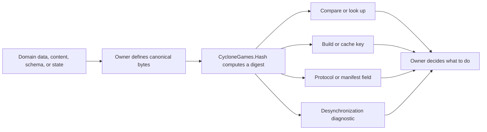
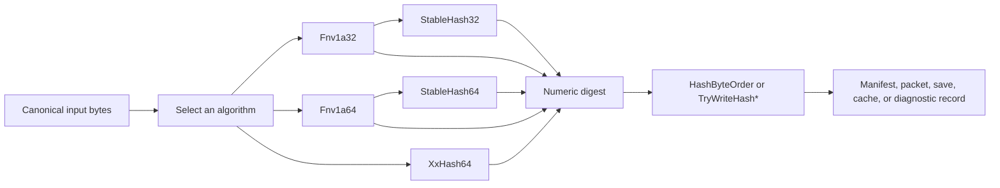

# CycloneGames.Hash

[简体中文](README.SCH.md)

Large games repeatedly move the same logical data through authoring tools, build pipelines, Runtime systems, caches, save files, network protocols, replay tools, and servers. Those systems need a compact way to answer whether a definition, payload, schema, or state snapshot is the same without retaining or comparing the complete source every time.

CycloneGames.Hash is the deterministic fingerprint layer for that job. An owning system converts meaningful data into a canonical ordered byte sequence; this module turns those bytes into a fixed-width, non-cryptographic digest. The owner then uses the digest for lookup, comparison, invalidation, compatibility checks, or diagnostics.

The module is designed for Unity Runtime code, Editor tools, command-line tests, headless processes, and server composition. Its Runtime assembly does not reference `UnityEngine`, perform file I/O, allocate native memory, create threads, or retain global state.

## 1. Why this module exists

### Role in a game framework

CycloneGames.Hash sits after data definition and canonical serialization, but before the owner's decision:



The module does not decide which fields matter, how objects are serialized, whether a collision is acceptable, or what action follows a mismatch. Those decisions belong to the gameplay, content, networking, save, or build system that owns the data.

This separation gives every environment the same small hashing core while allowing each owner to define its own canonical data contract.

### Application scenarios

| Scenario | Problem being solved | Role of CycloneGames.Hash | Typical API |
| --- | --- | --- | --- |
| Stable named definitions | Authoring uses readable names, while Runtime lookup needs compact numeric keys | Hashes the canonical name; the owner retains the name and checks collisions | `StableHash64.ComputeUtf16Ordinal` or explicit UTF-8 bytes |
| Asset and content fingerprints | Tools need to know whether meaningful content changed | Hashes canonical content or metadata bytes for fast comparison | `XxHash64.Compute` |
| Build and cache invalidation | Expensive generated output may be reused only when every relevant input is identical | Hashes ordered inputs and settings into a cache key | `XxHash64` streaming or `Fnv1a64` composition |
| Content manifests and update catalogs | Client and server need a compact fingerprint for the same manifest entry | Produces the manifest digest; authenticity remains the security layer's responsibility | `XxHash64` plus explicit byte-order output |
| Protocol and schema checks | Peers must reject incompatible layouts before interpreting payloads | Hashes the canonical field/type description used by the handshake | `Fnv1a64` ordered composition |
| Deterministic state diagnostics | Client, server, replay, or simulation tools need to locate the first divergent checkpoint | Hashes a canonical snapshot for comparison and logging | `XxHash64` |
| Large files or streamed payloads | Data arrives in chunks and should not be copied into one large buffer | Maintains incremental state across ordered chunks | `XxHash64.Create` and `Append` |
| Fast equality filtering | Full byte comparison is expensive and most candidates differ | Rejects unequal candidates by digest, then lets the owner perform exact comparison when required | `XxHash64.Compute` |

#### Example: content cache

```text
Source asset + import settings + dependency identifiers
    -> canonical input bytes
    -> XXH64 digest
    -> cache key
    -> reuse output when the key matches
    -> rebuild output when the key differs
```

#### Example: deterministic-state diagnostics

```text
Authoritative state at checkpoint N
    -> canonical snapshot bytes
    -> XXH64 digest
    -> compare client/server/replay values
    -> capture detailed field diagnostics when values differ
```

Hashing detects that canonical bytes differ; it does not explain the difference or make the simulation deterministic. The owning diagnostic system decides which fields to capture and how to report them.

### How to decide whether to use it

| Question | Decision |
| --- | --- |
| Do you need a compact, repeatable fingerprint of ordered data? | Use this module after defining the exact input bytes |
| Can two producers serialize the same logical value differently? | Define canonicalization first; hashing alone cannot fix the mismatch |
| Must the identifier be absolutely unique? | Use an owner-assigned stable ID, or retain canonical keys and reject collisions |
| Must the result prove trust or resist malicious manipulation? | Use a cryptographic digest with signature or MAC in the security layer |
| Must equality be mathematically certain? | Use the digest as a fast filter, then compare canonical bytes |
| Does data arrive in ordered chunks? | Use incremental `XxHash64` without concatenating the chunks |

Two consequences are important:

- Different digests prove that the algorithm contract or input bytes differ.
- Equal non-cryptographic digests are strong comparison evidence, but not a proof of equality because collisions exist.

Do not use Runtime `GetHashCode()` as a persisted, networked, or cross-tool data contract. Use an explicitly selected CycloneGames.Hash algorithm and canonical input definition.

### Design objectives

The module is designed around these properties:

- **Deterministic contract:** algorithm, seed, input order, encoding, and byte order remain visible.
- **Pure C# core:** domain, Editor, client, server, and headless code can share the same implementation.
- **Low-allocation execution:** span-based APIs and inline XXH64 state avoid module-owned heap allocation.
- **Explicit ownership:** callers own input memory, mutable state, threading, storage, and failure actions.
- **Cross-platform representation:** integer and digest byte order are explicit.
- **Focused API:** concrete algorithm entry points make the selected contract visible at the call site.
- **Testable behavior:** known vectors, chunk boundaries, allocation, and performance paths have dedicated tests.
- **Clear safety boundary:** collision handling and cryptographic trust remain explicit owner responsibilities.

### Core responsibility

A hash function answers a focused question:

> Given the same algorithm contract and exactly the same input bytes, what fixed-width digest should every producer calculate?

CycloneGames.Hash provides:

- FNV-1a 32-bit and 64-bit byte hashing;
- deterministic ordinal hashing of .NET UTF-16 code units;
- stable non-zero 32-bit and 64-bit helpers for systems that reserve `0` as an unset value;
- XXH64 one-shot and incremental hashing;
- explicit 32-bit and 64-bit little-endian and big-endian conversion;
- allocation and throughput tests for the primary hot paths.

### Non-goals

The module does not provide:

- cryptographic authentication, encryption, signatures, or password hashing;
- guaranteed-unique identifiers;
- automatic object serialization;
- Unicode normalization or text encoding;
- file, stream, network, or save-system ownership;
- a global hash registry, cache, worker pool, or job scheduler.

These boundaries keep the hashing contract independent from Unity lifecycle, storage, transport, and security policy.

### Recommended learning path

- First integration: read sections 2, 3, and 4.
- Deterministic data design: continue with sections 5, 6, 7, and 9.
- High-throughput Runtime work: focus on sections 8, 11, and 12.
- Persistence, networking, and security review: use sections 10, 13, and 15.

## 2. Architecture and package structure

| Assembly | Path | Responsibility | Availability |
| --- | --- | --- | --- |
| `CycloneGames.Hash.Core` | `Core/` | Pure C# algorithms, state, and byte-order helpers | All platforms; no assembly dependencies; `noEngineReferences=true` |
| `CycloneGames.Hash.Tests.Editor` | `Tests/Editor/` | Known vectors, boundaries, contract behavior, and allocation tests | Unity EditMode |
| `CycloneGames.Hash.Tests.Performance` | `Tests/Performance/` | Structured throughput and managed-GC measurements | Unity Editor when Performance Testing is installed |



Code compiled by a custom asmdef should reference `CycloneGames.Hash.Core`. Source files then import:

```csharp
using CycloneGames.Hash.Core;
```

## 3. Selecting the right API

Choose the narrowest API that matches the data contract:

| Requirement | Recommended API | Reason |
| --- | --- | --- |
| Fast digest for a complete byte payload | `XxHash64.Compute` | Simple one-shot entry point |
| Large payload arriving in ordered chunks | `XxHash64.Create`, `Append`, `GetDigest` | Fixed inline state; no concatenation buffer |
| Ordered composition of small integer fields and bytes | `Fnv1a64` | Direct running-state composition |
| Compact 32-bit field with collision handling | `Fnv1a32` or `StableHash32` | Use only when the contract requires 32 bits |
| Non-zero 64-bit identifier | `StableHash64` | Reserves `0` as an unset sentinel |
| Ordinal .NET string identifier | `ComputeUtf16Ordinal` | Hashes each UTF-16 code unit once |
| Cross-language text or protocol data | Encode canonical bytes, then use FNV-1a or XXH64 | Makes encoding and normalization explicit |
| Serialize a numeric digest | `HashByteOrder` or `TryWriteHash*` | Prevents machine-endian ambiguity |

Algorithm count is not a measure of module quality. A production contract benefits more from a precise input definition, explicit byte order, collision handling, tests, and stable ownership than from interchangeable algorithms with unclear semantics.

## 4. Quick start

The following examples assume:

```csharp
using System;
using CycloneGames.Hash.Core;
```

### Hash a byte payload

```csharp
public static ulong ComputePayloadHash(ReadOnlySpan<byte> payload)
{
    return XxHash64.Compute(payload);
}
```

The result is a numeric `ulong` digest. The same bytes and seed produce the same numeric value.

### Create a stable non-zero identifier

```csharp
public static ulong ComputeAbilityId(string canonicalName)
{
    return StableHash64.ComputeUtf16Ordinal(canonicalName);
}
```

This example defines the input as an ordinal sequence of .NET UTF-16 code units. Use it when every producer follows that exact rule.

### Hash an ordered payload without concatenation

```csharp
public static ulong ComputePacketHash(
    ReadOnlySpan<byte> header,
    ReadOnlySpan<byte> payload,
    ReadOnlySpan<byte> footer)
{
    XxHash64 hash = XxHash64.Create();
    hash.Append(header);
    hash.Append(payload);
    hash.Append(footer);
    return hash.GetDigest();
}
```

Appending `A`, then `B`, then `C` is equivalent to hashing the exact byte concatenation `A || B || C`.

## 5. Deterministic hash contracts

A numeric digest is deterministic only when the complete input contract is deterministic. Persisted, networked, or cross-process data should define all of these properties:

| Term | Meaning |
| --- | --- |
| Input bytes | The exact ordered byte sequence consumed by the algorithm |
| Digest | The fixed-width numeric result |
| Seed | The initial numeric state selected by the contract |
| Canonical form | The one permitted byte representation of a logical value |
| Collision | Two different inputs producing the same digest |
| Running state | An intermediate accumulator that can accept more ordered input |

1. Algorithm and digest width.
2. Initial seed or running state.
3. Field order.
4. Field boundaries or length prefixes.
5. Text encoding and Unicode normalization.
6. Integer and floating-point representation.
7. Digest byte order.
8. Null, empty, missing, and default-value rules.
9. Schema or protocol revision.

For example, these two field sequences are ambiguous if no boundaries are encoded:

```text
["ab", "c"]  -> "abc"
["a", "bc"]  -> "abc"
```

Add a fixed-width length before variable data, or hash a canonical serializer output, so distinct logical values cannot collapse into the same input byte sequence before hashing.

### Seed semantics

`XxHash64` accepts a numeric seed that initializes the algorithm.

The seed overloads on `Fnv1a32.Compute` and `Fnv1a64.Compute` accept the current running FNV state. They support ordered incremental composition:

```csharp
public static ulong ComputeManifestHash(
    uint contractRevision,
    ulong contentLength,
    ReadOnlySpan<byte> content)
{
    ulong hash = Fnv1a64.OffsetBasis;
    hash = Fnv1a64.CombineUInt32LittleEndian(hash, contractRevision);
    hash = Fnv1a64.CombineUInt64LittleEndian(hash, contentLength);
    hash = Fnv1a64.Compute(content, hash);
    return hash;
}
```

An FNV running state is not a secret key and does not provide protection against malicious input.

## 6. Hashing text correctly

Text must have an explicit contract. Visually identical strings can contain different Unicode code points, normalization forms, case, line endings, or whitespace.

### Ordinal UTF-16 identifiers

`ComputeUtf16Ordinal` performs one XOR/multiply step for each .NET `char`. It does not encode the string as UTF-8 or UTF-16LE bytes.

Use this API when:

- all producers use the same .NET UTF-16 code-unit definition;
- ordinal case-sensitive behavior is required;
- the identifier is not exchanged with a producer that uses a different text representation.

### UTF-8 text for interchange

For network, file, toolchain, or cross-language data, define normalization and encode text explicitly:

```csharp
using System.Text;

public static ulong ComputeCanonicalTextHash(string text)
{
    if (text == null)
    {
        throw new ArgumentNullException(nameof(text));
    }

    string normalized = text.Normalize(NormalizationForm.FormC);
    byte[] utf8 = Encoding.UTF8.GetBytes(normalized);
    return XxHash64.Compute(utf8);
}
```

This beginner-friendly example allocates the normalized string and UTF-8 array. In a hot path, normalize during authoring or ingestion and let the caller supply scratch memory:

```csharp
using System.Text;

public static bool TryComputeUtf8Hash(
    ReadOnlySpan<char> text,
    Span<byte> utf8Scratch,
    out ulong digest)
{
    int byteCount = Encoding.UTF8.GetByteCount(text);
    if (byteCount > utf8Scratch.Length)
    {
        digest = 0UL;
        return false;
    }

    int written = Encoding.UTF8.GetBytes(text, utf8Scratch);
    digest = XxHash64.Compute(utf8Scratch.Slice(0, written));
    return true;
}
```

The scratch-memory example does not normalize text. Its caller must provide text that already follows the contract.

## 7. Hashing structured and cross-platform data

Do not hash object memory, reflection order, `GetHashCode()`, Unity instance IDs, or arbitrary serializer output. First convert the meaningful fields into canonical bytes.

```csharp
public static ulong ComputeStateRecordHash(
    uint contractRevision,
    ulong entityId,
    uint stateFlags,
    ReadOnlySpan<byte> payload)
{
    const int HEADER_SIZE = 20;
    Span<byte> header = stackalloc byte[HEADER_SIZE];

    HashByteOrder.WriteUInt32LittleEndian(
        header.Slice(0, 4),
        contractRevision);
    HashByteOrder.WriteUInt64LittleEndian(
        header.Slice(4, 8),
        entityId);
    HashByteOrder.WriteUInt32LittleEndian(
        header.Slice(12, 4),
        stateFlags);
    HashByteOrder.WriteUInt32LittleEndian(
        header.Slice(16, 4),
        checked((uint)payload.Length));

    XxHash64 hash = XxHash64.Create();
    hash.Append(header);
    hash.Append(payload);
    return hash.GetDigest();
}
```

The length field gives the payload an unambiguous boundary. The byte-order helpers make the integer representation independent of machine endianness.

### Canonicalization checklist

Before hashing structured data, define:

- sorting for dictionaries, sets, entities, and components;
- fixed field order;
- width and signedness for every integer;
- representation of enums and flags;
- handling of null and missing values;
- text encoding, normalization, case, and line endings;
- path separator and case policy;
- float quantization and handling of `NaN`, infinities, `-0`, and `+0`;
- inclusion or exclusion of timestamps and transient fields.

Hashing detects byte differences. It does not make simulation, serialization, or floating-point calculations deterministic.

## 8. One-shot, streaming, and state reuse

Use one-shot hashing when the complete payload already exists as contiguous memory:

```csharp
ulong digest = XxHash64.Compute(payloadBytes, seed: 0UL);
```

Use streaming when data arrives in chunks or when concatenating it would require an extra buffer:

```csharp
using System.IO;

public static ulong ComputeStreamHash(Stream stream, byte[] buffer)
{
    if (stream == null)
    {
        throw new ArgumentNullException(nameof(stream));
    }

    if (buffer == null || buffer.Length == 0)
    {
        throw new ArgumentException(
            "A non-empty caller-owned buffer is required.",
            nameof(buffer));
    }

    XxHash64 hash = XxHash64.Create();
    int bytesRead;
    while ((bytesRead = stream.Read(buffer, 0, buffer.Length)) > 0)
    {
        hash.Append(buffer, 0, bytesRead);
    }

    return hash.GetDigest();
}
```

The I/O and buffer belong to the caller. `XxHash64` only consumes the bytes provided to `Append`.

### State behavior

- `Create(seed)` initializes a new state.
- `default(XxHash64)` is a valid seed-0 state.
- `Append` processes bytes in call order.
- `GetDigest` is non-destructive; more bytes may be appended afterward.
- `Reset(seed)` clears the state and its inline tail buffer for reuse.
- Copying the struct creates an independent snapshot of the accumulators and buffered bytes.

```csharp
XxHash64 hash = XxHash64.Create();
hash.Append(firstPayload);
ulong firstDigest = hash.GetDigest();

hash.Reset(seed: 42UL);
hash.Append(secondPayload);
ulong secondDigest = hash.GetDigest();
```

Use `ref` when passing a mutable state repeatedly through helper methods and snapshot semantics are not required.

## 9. Digest serialization and byte order

The numeric `ulong` digest and its eight serialized bytes are separate contracts.

- Canonical xxHash byte representation is big-endian.
- Interoperable FNV byte vectors use little-endian.
- A project-local format may choose another order only when the format defines it explicitly.

```csharp
Span<byte> xxHashBytes = stackalloc byte[XxHash64.HashSizeInBytes];
XxHash64 state = XxHash64.Create();
state.Append(payload);

bool written = state.TryWriteHashBigEndian(xxHashBytes);
if (!written)
{
    throw new InvalidOperationException("The digest buffer is too small.");
}

ulong receivedDigest =
    HashByteOrder.ReadUInt64BigEndian(xxHashBytes);
```

`TryWriteHash` writes the canonical big-endian representation. `TryWriteHashBigEndian` states the same contract explicitly. `TryWriteHashLittleEndian` writes the numeric digest in little-endian order.

All `TryWriteHash*` methods return `false` without writing when the destination is shorter than eight bytes. `HashByteOrder` read/write methods use the standard span range behavior for undersized inputs.

## 10. Stable identifiers and collision management

A non-cryptographic hash is a compact fingerprint, not a proof of uniqueness. For uniformly distributed values, the birthday approximation gives:

| Width | About 1% probability of at least one collision | About 50% probability |
| --- | ---: | ---: |
| 32-bit | 9,300 distinct values | 77,000 distinct values |
| 64-bit | 609 million distinct values | 5.06 billion distinct values |

Use 32-bit identifiers only when storage or protocol constraints require them and the owner detects collisions. Prefer 64-bit identifiers for large registries.

`StableHash32` and `StableHash64` map a final zero digest to `NonZeroFallback`. This lets a system reserve `0` as "unset," but it does not create uniqueness and adds one collision with the fallback value.

Cold-path registries should retain the canonical key:

```csharp
using System.Collections.Generic;

public static ulong RegisterAbilityId(
    Dictionary<ulong, string> registry,
    string canonicalName)
{
    ulong id = StableHash64.ComputeUtf16Ordinal(canonicalName);

    if (registry.TryGetValue(id, out string registeredName))
    {
        if (!string.Equals(
                registeredName,
                canonicalName,
                StringComparison.Ordinal))
        {
            throw new InvalidOperationException(
                "A stable hash collision was detected.");
        }

        return id;
    }

    registry.Add(id, canonicalName);
    return id;
}
```

Reserve and validate such registries during authoring, loading, or composition instead of performing discovery in a per-frame hot path.

## 11. Performance, memory, and cache behavior

| Path | Time complexity | Module-owned managed allocation | Working state |
| --- | --- | --- | --- |
| FNV-1a byte or UTF-16 hashing | `O(n)` | 0 bytes | Numeric accumulator |
| XXH64 one-shot | `O(n)` | 0 bytes | Value state with inline tail storage |
| XXH64 streaming | `O(n)` across all chunks | 0 bytes | Caller-owned mutable state |
| Byte-order read/write | `O(1)` | 0 bytes | None |

The span-based core paths do not allocate managed memory. XXH64 processes 32-byte stripes and keeps up to 31 unprocessed bytes in an inline 32-byte buffer.

The module does not cache:

- input buffers or strings;
- paths or file metadata;
- digests or formatted hexadecimal strings;
- reflection results;
- encoding buffers.

This avoids cache invalidation, retained-memory growth, synchronization, and cleanup ownership. Reuse `XxHash64` with `Reset` rather than pooling its small value state.

Caller code can still allocate through:

- `Encoding.GetBytes(string)`;
- new arrays and collection growth;
- LINQ, delegates, closures, and iterators;
- stream or task wrappers;
- `ToString` and hexadecimal formatting.

Performance must be measured in the owning workload. The included performance assembly covers 64-byte and 1 MiB XXH64, 4 KiB streaming chunks, 1 MiB FNV-1a 64-bit, and managed GC. Release acceptance should define throughput, latency, allocation, code-size, and warm-up budgets for every target device class.

## 12. Threading, ownership, and platform behavior

### Threading

- `Fnv1a32`, `Fnv1a64`, `StableHash32`, `StableHash64`, and `HashByteOrder` have no mutable static state and may be called concurrently.
- A mutable `XxHash64` value has one mutation owner.
- Do not call `Append` or `Reset` concurrently on the same state.
- Independent `XxHash64` values can run on separate workers without locks.
- The module does not create threads, choose schedulers, or introduce synchronization.

Digest values from independent partitions cannot be combined arbitrarily. Hashing `A` and `B` separately, then hashing their digests, is not equivalent to hashing `A || B`. Preserve input order or define a separate tree-hash contract in the owning system.

### Platform behavior

The Runtime assembly:

- is enabled for all Unity platforms;
- has no `UnityEngine` or platform SDK reference;
- uses portable integer arithmetic, spans, and `BinaryPrimitives`;
- uses explicit endianness;
- uses no unsafe code, native plugin, reflection, or dynamic code generation;
- owns no thread, file, socket, handle, or native container.

This design avoids operating-system and CPU-specific control flow in the core algorithm. Platform release validation should run the same known vectors and chunk-boundary tests under the target scripting backend, followed by target-specific performance and allocation measurements.

## 13. Persistence, networking, security, and integration

CycloneGames.Hash writes no files, assets, project preferences, player preferences, registry entries, or hidden cache data. The consumer owns storage paths, atomic writes, schema revision, format evolution, corruption recovery, and cleanup.

For persisted or transmitted digests, store or freeze:

| Contract field | Example |
| --- | --- |
| Algorithm | `XXH64` |
| Digest width | `64` |
| Seed | `0` |
| Text representation | `UTF-8, NFC, case-sensitive` |
| Integer order | `Little-endian` |
| Digest order | `Big-endian` |
| Field layout | Fixed order with length-prefixed variable fields |
| Contract revision | Owned by the manifest, save, or protocol |

Changing one of these fields changes the data contract. Give the owning format a distinct contract revision, and let its reader or adapter select the matching contract before interpreting bytes.

### Security boundary

FNV-1a and XXH64 are non-cryptographic. They are appropriate for accidental-difference detection, caches, local lookup, diagnostics, and desynchronization reports. They do not prove origin, prevent tampering, protect secrets, or resist deliberate collision construction.

Remote executable content, paid content, account data, anti-cheat evidence, and trusted updates require a security-owned design such as a cryptographic digest plus an authenticated signature or MAC.

### Integration boundary

Keep domain and platform concerns outside the core:

```text
File/Network/Unity adapter
    -> canonical bytes
    -> CycloneGames.Hash
    -> numeric or serialized digest
    -> owner-defined storage, comparison, logging, or security action
```

Adapters may provide stream reading, asset traversal, Native container conversion, job scheduling, or protocol framing. They should not change the algorithm contract implicitly.

## 14. Public API reference

### `Fnv1a32`

- `Compute(ReadOnlySpan<byte>)`: hashes bytes from `OffsetBasis`.
- `Compute(ReadOnlySpan<byte>, uint seed)`: continues from a running FNV state.
- `ComputeUtf16Ordinal(ReadOnlySpan<char>)`: hashes UTF-16 code units from `OffsetBasis`.
- `ComputeUtf16Ordinal(ReadOnlySpan<char>, uint seed)`: continues the ordinal text contract.
- `CombineUInt32LittleEndian`: folds four bytes, low byte first.

### `Fnv1a64`

- `Compute(ReadOnlySpan<byte>)` and the running-state overload.
- `ComputeUtf16Ordinal(ReadOnlySpan<char>)` and the running-state overload.
- `CombineUInt32LittleEndian`: folds a 32-bit field into a 64-bit state.
- `CombineUInt64LittleEndian`: folds an eight-byte field, low byte first.

### `StableHash32` and `StableHash64`

- `ComputeBytes`: applies FNV and maps a final zero digest.
- `ComputeUtf16Ordinal`: hashes ordinal UTF-16 text and maps a final zero digest.
- `EnsureNonZero`: maps `0` to `NonZeroFallback`.
- `CombineUInt32LittleEndian` or `CombineUInt64LittleEndian`: forwards ordered field composition without applying the final zero mapping.

The `string` overloads reject `null` with `ArgumentNullException`. Span overloads represent an empty span as valid empty input.

### `XxHash64`

- `Create(seed)`: creates initialized state.
- `Reset(seed)`: clears and reinitializes state.
- `Append(ReadOnlySpan<byte>)`: appends a span.
- `Append(byte[], offset, count)`: appends an array slice with standard range validation.
- `GetDigest()`: reads the digest without consuming state.
- `Compute(data, seed)`: one-shot hashing.
- `HashToUInt64(data, seed)`: one-shot numeric-digest alias.
- `TryWriteHash` and `TryWriteHashBigEndian`: canonical big-endian bytes.
- `TryWriteHashLittleEndian`: explicit little-endian numeric bytes.
- `HashSizeInBytes`: required digest destination size.

### `HashByteOrder`

Provides 32-bit and 64-bit read/write methods for little-endian and big-endian numeric values. Destination or source spans must contain at least four or eight bytes for the selected width.

## 15. Validation and troubleshooting

### Compile checks

Unity-generated project files can be used for local compile checks:

```bash
dotnet build UnityStarter/CycloneGames.Hash.Core.csproj -v:minimal
dotnet build UnityStarter/CycloneGames.Hash.Tests.Editor.csproj -v:minimal
dotnet build UnityStarter/CycloneGames.Hash.Tests.Performance.csproj -v:minimal
```

### Unity validation

1. Open `<repo-root>/UnityStarter` with the Unity release recorded in `ProjectSettings/ProjectVersion.txt`.
2. Refresh scripts and confirm that the Console contains no compilation errors.
3. Run `CycloneGames.Hash.Tests.Editor` in EditMode.
4. Run `CycloneGames.Hash.Tests.Performance` when Performance Testing is installed.
5. Run tests for every consumer whose persisted, networked, or public contract uses the changed hash path.
6. Run known vectors and performance checks in each release Player and scripting backend.

### Troubleshooting

| Symptom | Likely cause | Resolution |
| --- | --- | --- |
| The same visible text hashes differently | Encoding, normalization, case, whitespace, or line-ending rules differ | Compare the canonical text contract and hash explicit bytes |
| Numeric digests match but serialized bytes differ | Producers use different byte order | Use explicit `HashByteOrder` or `TryWriteHash*` methods |
| One-shot and streaming XXH64 differ | Seed, order, offset, count, or chunk coverage differs | Verify that chunks cover the exact byte sequence once and in order |
| A stable identifier collides | The owner treated a fingerprint as a unique key | Store canonical keys, detect collisions, and use a wider contract |
| A hot path allocates | Encoding, buffers, enumeration, or formatting allocates in caller code | Profile the complete call path and supply reusable spans/buffers |
| Different platforms report different state hashes | Canonical serialization or simulation differs before hashing | Compare serialized bytes at field boundaries before inspecting the hash |
| A digest is being used as proof of trust | A non-cryptographic hash crossed a security boundary | Use a cryptographic digest with signature or MAC in the security owner |

## References

- [xxHash reference implementation](https://github.com/Cyan4973/xxHash)
- [IETF FNV draft](https://datatracker.ietf.org/doc/draft-eastlake-fnv/)
