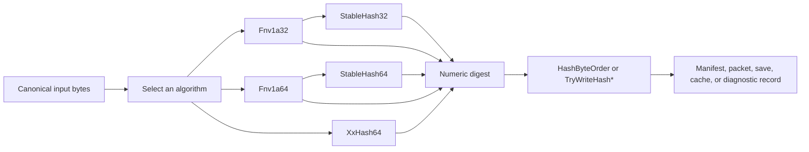

# CycloneGames.Hash

[English | 简体中文](README.SCH.md)

CycloneGames.Hash provides deterministic, non-cryptographic hashing primitives for Unity projects, build pipelines, and pure C# services. It packages FNV-1a (32/64-bit), XXH64, stable non-zero identifiers, and explicit byte-order helpers behind a pure C# core with no `UnityEngine` dependency, so the same hashing contract produces identical digests across Runtime, Editor, CLI, headless, and server environments.

## Table of Contents

- [Overview](#overview)
- [Architecture](#architecture)
- [Quick Start](#quick-start)
- [Core Concepts](#core-concepts)
- [Usage Guide](#usage-guide)
- [Advanced Topics](#advanced-topics)
- [Common Scenarios](#common-scenarios)
- [Performance and Memory](#performance-and-memory)
- [Troubleshooting](#troubleshooting)

## Overview

A hash function answers one question: given the same algorithm and the same input bytes, what fixed-width digest should every producer compute? CycloneGames.Hash answers that question with a small set of focused algorithms, each exposing its contract (algorithm, seed, byte order) explicitly at the call site.

The module exists for the moments when a project needs a compact fingerprint of canonical data: asset content, build inputs, protocol schemas, deterministic-state snapshots, named definitions, or cache keys. The owner decides what bytes to hash; this module turns those bytes into a stable digest that can be compared, cached, transmitted, or logged.

Use this module when:

- Authoring tools, build pipelines, or Runtime code need a compact, repeatable fingerprint of ordered data.
- The same logical value must produce the same digest across machines, processes, and Unity backends.
- You want span-based, allocation-free hashing on hot paths.

Do not use this module for cryptographic authentication, tamper resistance, password storage, or guaranteed-unique identifiers. Those concerns belong to a security-owned layer with a cryptographic digest plus a signature or MAC.

### Key features

- **FNV-1a 32-bit and 64-bit** for ordered composition of small fields and bytes.
- **XXH64** one-shot and streaming for fast digests of larger payloads.
- **StableHash32 / StableHash64** that reserve `0` as an unset sentinel.
- **HashByteOrder** explicit little-endian and big-endian read/write helpers.
- **Pure C# core** with `noEngineReferences: true`, span-based APIs, and zero module-owned heap allocation on the hot paths.

## Architecture

The module is one assembly plus its tests:

| Assembly | Path | Purpose |
| --- | --- | --- |
| `CycloneGames.Hash.Core` | `Core/` | Algorithms, state, and byte-order helpers. No `UnityEngine` reference. |
| `CycloneGames.Hash.Tests.Editor` | `Tests/Editor/` | Known vectors, chunk-boundary, contract, and allocation tests. |
| `CycloneGames.Hash.Tests.Performance` | `Tests/Performance/` | Throughput and managed-GC measurements (requires Performance Testing package). |



The owner converts meaningful data into canonical bytes; the module turns those bytes into a digest; the owner decides what to do with the result. Algorithm choice, seed, field order, encoding, and byte order are visible at the call site, never hidden behind ambient configuration.

## Quick Start

Add an asmdef reference to `CycloneGames.Hash.Core`, then import the namespace:

```csharp
using CycloneGames.Hash.Core;
```

### Hash a byte payload

```csharp
public static ulong ComputePayloadHash(ReadOnlySpan<byte> payload)
{
    return XxHash64.Compute(payload);
}
```

The same bytes and seed produce the same `ulong` digest across every environment.

### Hash a string identifier

```csharp
public static ulong ComputeAbilityId(string canonicalName)
{
    return StableHash64.ComputeUtf16Ordinal(canonicalName);
}
```

`StableHash64` maps a final zero digest to a non-zero fallback, so `0` can be reserved as an "unset" sentinel.

### Hash ordered chunks without concatenation

```csharp
public static ulong ComputePacketHash(
    ReadOnlySpan<byte> header,
    ReadOnlySpan<byte> payload,
    ReadOnlySpan<byte> footer)
{
    XxHash64 hash = XxHash64.Create();
    hash.Append(header);
    hash.Append(payload);
    hash.Append(footer);
    return hash.GetDigest();
}
```

Appending `A`, then `B`, then `C` produces the same digest as hashing the concatenated byte sequence `A || B || C`.

## Core Concepts

### Algorithm selection

Choose the narrowest API that matches the data contract:

| Requirement | Recommended API | Reason |
| --- | --- | --- |
| Fast digest of a complete byte payload | `XxHash64.Compute` | One-shot entry point |
| Large payload arriving in ordered chunks | `XxHash64.Create` + `Append` + `GetDigest` | Fixed inline state; no concatenation buffer |
| Ordered composition of small integer fields | `Fnv1a64` | Direct running-state composition |
| Compact 32-bit field with collision handling | `Fnv1a32` or `StableHash32` | Only when the contract requires 32 bits |
| Non-zero 64-bit identifier | `StableHash64` | Reserves `0` as an unset sentinel |
| Ordinal .NET string identifier | `ComputeUtf16Ordinal` | One XOR/multiply per UTF-16 code unit |
| Cross-language text or protocol data | Encode canonical bytes, then FNV-1a or XXH64 | Makes encoding and normalization explicit |
| Serialize a numeric digest | `HashByteOrder` or `TryWriteHash*` | Prevents machine-endian ambiguity |

Algorithm count is not a measure of quality. A reliable contract benefits more from a precise input definition, explicit byte order, and collision handling than from interchangeable algorithms with unclear semantics.

### Deterministic contracts

A numeric digest is deterministic only when the entire input contract is deterministic. Persisted, networked, or cross-process data should fix every property in this list:

1. Algorithm and digest width.
2. Initial seed or running state.
3. Field order.
4. Field boundaries or length prefixes.
5. Text encoding and Unicode normalization.
6. Integer and floating-point representation.
7. Digest byte order.
8. Null, empty, missing, and default-value rules.
9. Schema or protocol revision.

For example, without an encoded boundary, these two field sequences collapse to the same input bytes:

```text
["ab", "c"]  -> "abc"
["a", "bc"]  -> "abc"
```

Add a fixed-width length prefix before variable data, or hash the output of a canonical serializer, so distinct logical values cannot collide before the hash even runs.

### Seed semantics

`XxHash64` accepts a numeric seed that initializes the algorithm. The seed overloads on `Fnv1a32.Compute` and `Fnv1a64.Compute` accept a running FNV state, which is what makes ordered incremental composition work:

```csharp
public static ulong ComputeManifestHash(
    uint contractRevision,
    ulong contentLength,
    ReadOnlySpan<byte> content)
{
    ulong hash = Fnv1a64.OffsetBasis;
    hash = Fnv1a64.CombineUInt32LittleEndian(hash, contractRevision);
    hash = Fnv1a64.CombineUInt64LittleEndian(hash, contentLength);
    hash = Fnv1a64.Compute(content, hash);
    return hash;
}
```

An FNV running state is not a secret key and provides no protection against malicious input.

## Usage Guide

### Hashing text

Text must have an explicit contract. Visually identical strings can differ in Unicode code points, normalization form, case, line endings, or whitespace.

**Ordinal UTF-16 identifiers** — `ComputeUtf16Ordinal` performs one XOR/multiply step per .NET `char`. It does not encode the string as UTF-8 or UTF-16LE bytes. Use it when every producer uses the same .NET UTF-16 code-unit definition and ordinal case-sensitive behavior is acceptable.

**UTF-8 for interchange** — for network, file, toolchain, or cross-language data, define normalization explicitly and encode text as UTF-8 bytes before hashing:

```csharp
using System.Text;

public static ulong ComputeCanonicalTextHash(string text)
{
    if (text == null) throw new ArgumentNullException(nameof(text));
    string normalized = text.Normalize(NormalizationForm.FormC);
    byte[] utf8 = Encoding.UTF8.GetBytes(normalized);
    return XxHash64.Compute(utf8);
}
```

This beginner-friendly example allocates the normalized string and UTF-8 array. On a hot path, normalize during authoring or ingestion and let the caller supply scratch memory:

```csharp
using System.Text;

public static bool TryComputeUtf8Hash(
    ReadOnlySpan<char> text,
    Span<byte> utf8Scratch,
    out ulong digest)
{
    int byteCount = Encoding.UTF8.GetByteCount(text);
    if (byteCount > utf8Scratch.Length)
    {
        digest = 0UL;
        return false;
    }

    int written = Encoding.UTF8.GetBytes(text, utf8Scratch);
    digest = XxHash64.Compute(utf8Scratch.Slice(0, written));
    return true;
}
```

### Hashing structured data

Never hash object memory, reflection order, `GetHashCode()`, Unity instance IDs, or arbitrary serializer output. Convert the meaningful fields into canonical bytes first:

```csharp
public static ulong ComputeStateRecordHash(
    uint contractRevision,
    ulong entityId,
    uint stateFlags,
    ReadOnlySpan<byte> payload)
{
    const int HEADER_SIZE = 20;
    Span<byte> header = stackalloc byte[HEADER_SIZE];

    HashByteOrder.WriteUInt32LittleEndian(header.Slice(0, 4), contractRevision);
    HashByteOrder.WriteUInt64LittleEndian(header.Slice(4, 8), entityId);
    HashByteOrder.WriteUInt32LittleEndian(header.Slice(12, 4), stateFlags);
    HashByteOrder.WriteUInt32LittleEndian(header.Slice(16, 4), checked((uint)payload.Length));

    XxHash64 hash = XxHash64.Create();
    hash.Append(header);
    hash.Append(payload);
    return hash.GetDigest();
}
```

The length field gives the payload an unambiguous boundary. The byte-order helpers make the integer representation independent of machine endianness.

#### Canonicalization checklist

Before hashing structured data, define:

- Sorting for dictionaries, sets, entities, and components.
- Fixed field order.
- Width and signedness for every integer.
- Representation of enums and flags.
- Handling of null and missing values.
- Text encoding, normalization, case, and line endings.
- Path separator and case policy.
- Float quantization and handling of `NaN`, infinities, `-0`, and `+0`.
- Inclusion or exclusion of timestamps and transient fields.

Hashing detects byte differences. It does not make simulation, serialization, or floating-point calculations deterministic.

### Streaming and state reuse

Use one-shot hashing when the complete payload is already contiguous:

```csharp
ulong digest = XxHash64.Compute(payloadBytes, seed: 0UL);
```

Use streaming when data arrives in chunks or when concatenating would require an extra buffer:

```csharp
using System.IO;

public static ulong ComputeStreamHash(Stream stream, byte[] buffer)
{
    if (stream == null) throw new ArgumentNullException(nameof(stream));
    if (buffer == null || buffer.Length == 0)
        throw new ArgumentException("A non-empty caller-owned buffer is required.", nameof(buffer));

    XxHash64 hash = XxHash64.Create();
    int bytesRead;
    while ((bytesRead = stream.Read(buffer, 0, buffer.Length)) > 0)
    {
        hash.Append(buffer, 0, bytesRead);
    }
    return hash.GetDigest();
}
```

The I/O and buffer belong to the caller. `XxHash64` only consumes the bytes provided to `Append`.

State behavior:

- `Create(seed)` initializes a new state.
- `default(XxHash64)` is a valid seed-0 state.
- `Append` processes bytes in call order.
- `GetDigest` is non-destructive; more bytes may be appended afterward.
- `Reset(seed)` clears the state and its inline tail buffer for reuse.
- Copying the struct creates an independent snapshot of accumulators and buffered bytes.

```csharp
XxHash64 hash = XxHash64.Create();
hash.Append(firstPayload);
ulong firstDigest = hash.GetDigest();

hash.Reset(seed: 42UL);
hash.Append(secondPayload);
ulong secondDigest = hash.GetDigest();
```

Pass a mutable state by `ref` when calling helpers repeatedly and snapshot semantics are not required.

### Serializing digests

The numeric `ulong` digest and its eight serialized bytes are separate contracts:

- Canonical XXH64 byte representation is **big-endian**.
- Interoperable FNV byte vectors use **little-endian**.
- A project-local format may choose another order, but only when the format defines it explicitly.

```csharp
Span<byte> xxHashBytes = stackalloc byte[XxHash64.HashSizeInBytes];
XxHash64 state = XxHash64.Create();
state.Append(payload);

bool written = state.TryWriteHashBigEndian(xxHashBytes);
if (!written) throw new InvalidOperationException("Digest buffer too small.");

ulong receivedDigest = HashByteOrder.ReadUInt64BigEndian(xxHashBytes);
```

`TryWriteHash` writes the canonical big-endian representation. `TryWriteHashBigEndian` states the same contract explicitly. `TryWriteHashLittleEndian` writes the numeric digest in little-endian order. All `TryWriteHash*` methods return `false` without writing when the destination is shorter than eight bytes.

### Stable identifiers and collision handling

A non-cryptographic hash is a compact fingerprint, not a proof of uniqueness. For uniformly distributed values, the birthday approximation gives:

| Width | ~1% probability of at least one collision | ~50% probability |
| --- | ---: | ---: |
| 32-bit | 9,300 distinct values | 77,000 distinct values |
| 64-bit | 609 million distinct values | 5.06 billion distinct values |

Use 32-bit identifiers only when storage or protocol constraints require them and the owner detects collisions. Prefer 64-bit identifiers for large registries.

`StableHash32` and `StableHash64` map a final zero digest to `NonZeroFallback`. This lets a system reserve `0` as "unset", but it does not create uniqueness and adds one collision with the fallback value.

Cold-path registries should retain the canonical key alongside the hash:

```csharp
using System.Collections.Generic;

public static ulong RegisterAbilityId(
    Dictionary<ulong, string> registry,
    string canonicalName)
{
    ulong id = StableHash64.ComputeUtf16Ordinal(canonicalName);

    if (registry.TryGetValue(id, out string registeredName))
    {
        if (!string.Equals(registeredName, canonicalName, StringComparison.Ordinal))
            throw new InvalidOperationException("A stable hash collision was detected.");
        return id;
    }

    registry.Add(id, canonicalName);
    return id;
}
```

Reserve and validate such registries during authoring, loading, or composition, not in a per-frame hot path.

## Advanced Topics

### Combining digests from independent partitions

Digest values from independent partitions cannot be combined arbitrarily. Hashing `A` and `B` separately, then hashing their digests, is **not** equivalent to hashing `A || B`. Preserve input order, or define a separate tree-hash contract in the owning system.

### Cross-language contracts

When a digest must match a non-.NET producer (a C++ server, a Rust tool, a Python build script), the contract must fix every property listed in [Deterministic contracts](#deterministic-contracts). The most common pitfalls are:

- .NET strings are UTF-16; many other languages default to UTF-8.
- .NET `BitConverter` uses machine endianness; explicit `HashByteOrder` calls avoid ambiguity.
- `GetHashCode()` is not stable across machines, processes, or .NET versions. Never persist or transmit it.

### When to use a cryptographic digest instead

Switch to a cryptographic digest (SHA-256 with a signature or MAC) when the hashed data crosses a trust boundary:

- Remote executable content or paid content.
- Account data or anti-cheat evidence.
- Trusted updates delivered over an untrusted channel.

FNV-1a and XXH64 detect accidental differences. They do not prove origin, prevent tampering, or resist deliberate collision construction.

## Common Scenarios

### Content cache invalidation

A build tool wants to reuse expensive generated output only when every relevant input is identical:

```text
Source asset + import settings + dependency identifiers
    -> canonical input bytes
    -> XXH64 digest
    -> cache key
    -> reuse output when the key matches
    -> rebuild output when the key differs
```

Use `XxHash64` streaming when inputs are large or arrive in chunks.

### Deterministic-state diagnostics

Client, server, replay, or simulation tools need to locate the first divergent checkpoint:

```text
Authoritative state at checkpoint N
    -> canonical snapshot bytes
    -> XXH64 digest
    -> compare client/server/replay values
    -> capture detailed field diagnostics when values differ
```

Hashing detects that canonical bytes differ; it does not explain the difference or make the simulation deterministic. The owning diagnostic system decides which fields to capture and how to report them.

### Protocol and schema checks

Peers must reject incompatible layouts before interpreting payloads. Hash the canonical field/type description used by the handshake:

```csharp
public static ulong ComputeSchemaHash(uint revision, ReadOnlySpan<byte> schemaBytes)
{
    ulong hash = Fnv1a64.OffsetBasis;
    hash = Fnv1a64.CombineUInt32LittleEndian(hash, revision);
    hash = Fnv1a64.Compute(schemaBytes, hash);
    return hash;
}
```

### Stable named definitions

Authoring uses readable names; Runtime lookup needs compact numeric keys:

```csharp
public static ulong ComputeTagId(string canonicalName)
{
    return StableHash64.ComputeUtf16Ordinal(canonicalName);
}
```

The owner retains the canonical name and rejects collisions during authoring.

## Performance and Memory

| Path | Time complexity | Module-owned allocation | Working state |
| --- | --- | --- | --- |
| FNV-1a byte or UTF-16 hashing | `O(n)` | 0 bytes | Numeric accumulator |
| XXH64 one-shot | `O(n)` | 0 bytes | Value state with inline 32-byte tail |
| XXH64 streaming | `O(n)` across all chunks | 0 bytes | Caller-owned mutable state |
| Byte-order read/write | `O(1)` | 0 bytes | None |

The span-based core paths do not allocate managed memory. XXH64 processes 32-byte stripes and keeps up to 31 unprocessed bytes in an inline 32-byte buffer.

The module does not cache input buffers, strings, paths, digests, reflection results, or encoding buffers. This avoids cache invalidation, retained-memory growth, synchronization, and cleanup ownership. Reuse `XxHash64` with `Reset` rather than pooling its small value state.

Caller code can still allocate through `Encoding.GetBytes(string)`, new arrays and collection growth, LINQ, delegates, closures, iterators, stream/task wrappers, `ToString`, and hexadecimal formatting. Profile the complete call path before attributing allocations to the hashing layer.

### Threading

- `Fnv1a32`, `Fnv1a64`, `StableHash32`, `StableHash64`, and `HashByteOrder` have no mutable static state and may be called concurrently.
- A mutable `XxHash64` value has one mutation owner. Do not call `Append` or `Reset` concurrently on the same state.
- Independent `XxHash64` values can run on separate workers without locks.
- The module does not create threads, choose schedulers, or introduce synchronization.

### Platform behavior

The Runtime assembly is enabled for all Unity platforms, has no `UnityEngine` or platform SDK reference, uses portable integer arithmetic, spans, and `BinaryPrimitives`, uses explicit endianness, uses no unsafe code, native plugin, reflection, or dynamic code generation, and owns no thread, file, socket, handle, or native container. Release validation should run the same known vectors and chunk-boundary tests under the target scripting backend, followed by target-specific performance and allocation measurements.

## Troubleshooting

| Symptom | Likely cause | Resolution |
| --- | --- | --- |
| The same visible text hashes differently | Encoding, normalization, case, whitespace, or line-ending rules differ | Compare the canonical text contract and hash explicit bytes |
| Numeric digests match but serialized bytes differ | Producers use different byte order | Use explicit `HashByteOrder` or `TryWriteHash*` methods |
| One-shot and streaming XXH64 differ | Seed, order, offset, count, or chunk coverage differs | Verify that chunks cover the exact byte sequence once and in order |
| A stable identifier collides | The owner treated a fingerprint as a unique key | Store canonical keys, detect collisions, and use a wider contract |
| A hot path allocates | Encoding, buffers, enumeration, or formatting allocates in caller code | Profile the complete call path and supply reusable spans/buffers |
| Different platforms report different state hashes | Canonical serialization or simulation differs before hashing | Compare serialized bytes at field boundaries before inspecting the hash |
| A digest is being used as proof of trust | A non-cryptographic hash crossed a security boundary | Use a cryptographic digest with signature or MAC in the security owner |

## Validation

Run focused tests from Unity Test Runner:

```text
<UnityEditor> -batchmode -nographics -projectPath <repo-root>/UnityStarter -runTests -testPlatform EditMode -assemblyNames CycloneGames.Hash.Tests.Editor -testResults <result-path> -quit
```

When `com.unity.test-framework.performance` is installed, also run `CycloneGames.Hash.Tests.Performance`. Run known vectors and performance checks in each release Player and scripting backend that consumes the contract.

## References

- [xxHash reference implementation](https://github.com/Cyan4973/xxHash)
- [IETF FNV draft](https://datatracker.ietf.org/doc/draft-eastlake-fnv/)
