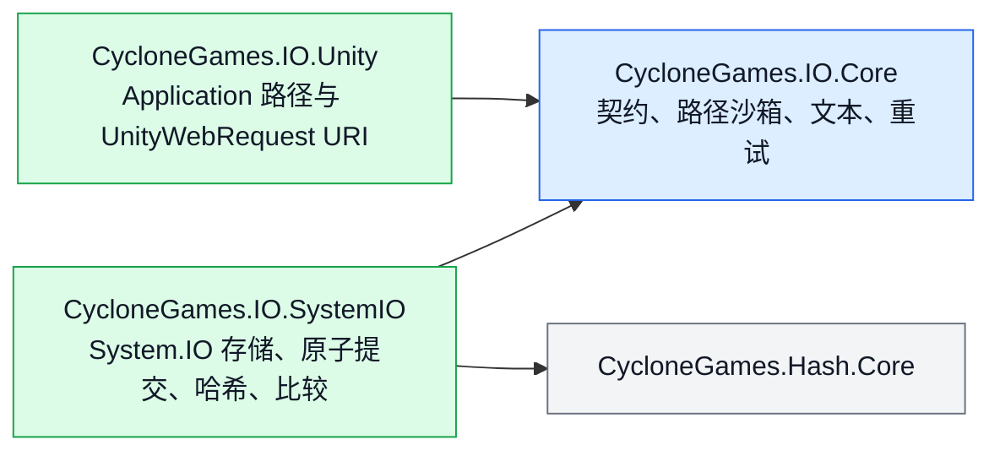

# CycloneGames.IO

CycloneGames.IO 是 CycloneGames 模块唯一的文件 IO 底座。它提供有上限的整文件读取、流式传输、严格原子提交、精确比较、哈希、可移植路径沙箱、确定性文本解码、显式重试策略，以及 Unity 文件 URI 构造。

本包面向长期商业项目设计，分配上限、失败语义、所有权、平台边界和损坏行为都必须直接体现在 API 中。它不自动记录日志、不隐藏异常、不接管产品策略，也不依赖任何 DI 容器。

## 范围与设计

本包包含三个单向依赖的程序集：



- `CycloneGames.IO.Core` 是纯 C#，不依赖 Unity 或 Logger。
- `CycloneGames.IO.SystemIO` 是纯 C#，负责操作系统文件行为。
- `CycloneGames.IO.Unity` 只负责 Unity 路径和 URI 适配。
- Core 与 SystemIO 的公共 API 使用 `CycloneGames.IO` namespace；Unity 专属 API 使用 `CycloneGames.IO.Unity`。
- 异步文件 API 返回 `Task`，因为这里定义的是可移植 BCL 边界。Unity 调用方可以从 `UniTask` 工作流中直接 await，而不必把 Unity 类型带入核心契约。

本包不提供存档 schema、云同步、压缩、加密密钥管理、虚拟文件系统、内容寻址存储或应用日志。此类产品策略应构建在 `IFileStore`、`IAtomicFileStore` 和 `IStreamFileStore` 之上。

## 目录结构

| 目录 | 职责 |
| --- | --- |
| `Core/Storage/` | 能力契约与传输进度。 |
| `Core/Paths/` | 可移植相对路径校验和沙箱解析。 |
| `Core/Text/` | 严格、确定性的文本解码。 |
| `Core/Retry/` | 显式、有上限的重试策略。 |
| `Runtime/SystemIO/Storage/` | `SystemFileStore`、options、复制行为和 buffer 策略。 |
| `Runtime/SystemIO/Atomic/` | 同目录临时文件事务与提交操作。 |
| `Runtime/SystemIO/Hashing/` | 文件/内容哈希与标准小写十六进制输出。 |
| `Runtime/SystemIO/Comparison/` | 精确字节与文件比较。 |
| `Runtime/Unity/` | Unity 文件位置和 UnityWebRequest URI 构造。 |
| `Editor/` | 当前硬件上的 benchmark window。 |
| `Tests/` | Core、SystemIO、Unity 和性能测试程序集。 |

## 核心类型

| 类型 | 用途 |
| --- | --- |
| `SystemFileStore` | 基于 System.IO 的默认实现，提供有界读取、直接写入、stream、原子写入和原子复制。 |
| `IFileStore` | 字节存储能力；每次整文件读取都必须显式提供最大值。 |
| `IAtomicFileStore` | 原子字节与 stream 提交能力。 |
| `IStreamFileStore` | 由调用方持有和释放 stream 的能力。 |
| `SystemFileStoreOptions` | 不可变 buffer 大小和池化 buffer 清理策略。 |
| `FileTransferProgress` | 已处理字节数、已知/未知总量和比例。 |
| `FileComparer` / `BinaryContentComparer` | 精确相等；绝不把 hash 当作相等证明。 |
| `FileHasher` / `ContentHasher` | MD5、SHA-256 和 xxHash64。 |
| `FilePathSandbox` | 在固定可信根目录下解析校验后的可移植相对路径。 |
| `TextCodec` | 严格 BOM 感知解码，并只使用一个显式 fallback encoding。 |
| `FileRetry` / `FileRetryPolicy` | 对显式判定的瞬态 IO 故障做可选、有上限的重试。 |
| `UnityFileUri` | 为 UnityWebRequest 构造带类型、跨平台正确的 URI。 |

## 常用工作流

### 原子持久化

设置、manifest、journal、checkpoint，以及任何不能接受部分覆盖的文件都应使用原子写入：

```csharp
using CycloneGames.IO;

SystemFileStore.Default.WriteTextAtomically(savePath, json);

await SystemFileStore.Default.WriteBytesAtomicallyAsync(
    cacheIndexPath,
    indexBytes,
    cancellationToken);
```

大型或即时生成的 source 可直接流式写入原子事务：

```csharp
await SystemFileStore.Default.WriteStreamAtomicallyAsync(
    destinationPath,
    sourceStream,
    progress,
    cancellationToken);
```

原子提交行为刻意保持严格：

1. 在目标文件所在目录创建唯一临时文件。
2. 写入内容，并在平台支持时调用 `FileStream.Flush(true)`。
3. 新目标通过 `File.Move` 提交。
4. 已有目标通过 `File.Replace` 提交。
5. 平台不支持替换时 fail closed；实现绝不会先删除目标，再移动临时文件。
6. 失败或取消后会尽力清理临时文件，并保留之前的目标文件。

操作本身是原子的，但业务顺序仍由调用方负责。并发 writer 的每个成功结果都是完整文件，最后一次成功的操作系统提交获胜。如果顺序重要，应在上层使用 revision、compare-and-swap 或 owner queue。

同一规范化目标的 commit 会在进程内串行，避免 Windows `File.Replace` 竞争；不相关目标仍完全并行，最后一个 holder 退出后协调 entry 会被删除。跨进程竞争仍保持为可见 IO failure；操作幂等时，可在外层显式使用 `FileRetry`。

`Flush(true)` 会提高文件内容持久性，但不存在一个可移植的 managed API，能对所有 filesystem、存储控制器、主机 SDK、移动系统和突然断电模型保证目录项已经持久化。关键产品必须在目标文件系统和平台上验证恢复策略。

### 有上限的读取

每个整文件读取都必须提供分配上限：

```csharp
const int MAX_MANIFEST_BYTES = 4 * 1024 * 1024;

byte[] bytes = await SystemFileStore.Default.ReadBytesAsync(
    manifestPath,
    MAX_MANIFEST_BYTES,
    cancellationToken);

string text = SystemFileStore.Default.ReadText(
    settingsPath,
    MAX_MANIFEST_BYTES);
```

Store 会在分配前校验文件长度，精确读取该长度，并拒绝读取期间观察到的截断或增长。大型或不可信内容应使用 stream，而不是未经分析就提高上限。

### 流式传输

返回的 stream 由调用方持有并释放：

```csharp
using (Stream source = files.OpenRead(sourcePath))
{
    await files.WriteStreamAtomicallyAsync(
        destinationPath,
        source,
        progress,
        cancellationToken);
}
```

`CreateWrite` 总是创建或完整截断文件。`OpenAppend` 保留已有内容、只追加、允许并发 reader，并拒绝其他 writer。命名刻意明确，避免调用方混淆 overwrite 与 append 语义。

取消在 buffer 边界协作完成。在 Unity 2022 + Windows 上，实现会在 chunk 之间检查 token，同时向操作系统 `FileStream` 调用传入 `CancellationToken.None`。这避免了已经复现的运行时死锁，同时保持有界取消延迟。

原子操作在进入 commit 阶段前响应取消；一旦目标 commit 开始，就会执行到底并报告真实结果。Progress callback 抛出的异常会在 commit 前终止操作；成功 commit 后不会再调用 callback。

### 精确比较与原子复制

```csharp
bool equal = await FileComparer.AreEqualAsync(
    firstPath,
    secondPath,
    progress,
    cancellationToken);

FileCopyResult result = await SystemFileStore.Default.CopyAtomicallyAsync(
    sourcePath,
    destinationPath,
    FileCopyBehavior.SkipIfIdentical,
    progress,
    cancellationToken);
```

比较会精确校验长度和每个字节。`SkipIfIdentical` 会避免替换未发生变化的目标；其他情况会把复制内容流式写入原子事务。

### 哈希

```csharp
string sha256 = await FileHasher.ComputeHexAsync(
    filePath,
    FileHashAlgorithm.Sha256,
    progress,
    cancellationToken);

Span<byte> hash = stackalloc byte[ContentHasher.GetHashSize(FileHashAlgorithm.XxHash64)];
ContentHasher.WriteHash(content, FileHashAlgorithm.XxHash64, hash);
```

- 内容完整性和 trust workflow 使用 SHA-256。
- xxHash64 快速且稳定，但不是密码学算法。
- MD5 只用于与外部既有格式互操作，不得作为安全原语。
- 当正确性要求证明全部字节一致时，hash 比较不能替代精确比较。

### 路径沙箱

来自 manifest、服务器、mod、archive 或用户输入的不可信相对路径，绝不能只用 `Path.Combine`：

```csharp
var sandbox = new FilePathSandbox(contentRoot);
string filePath = sandbox.Resolve(manifestEntry.Location);
```

`FilePathSandbox` 会拒绝 rooted input、dot segment、空 segment、控制字符、不可移植文件名字符、结尾的点/空格和 Windows device name。默认 `FileLinkPolicy.RejectExistingLinks` 还会拒绝已有的 reparse point/link segment。

词法校验和已有 link 检查无法消除恶意进程并发修改文件系统造成的 TOCTOU 竞争。若本地文件系统本身是敌对安全边界，需要在本包上层使用平台专属的 handle-relative API 和 directory handle 所有权。

### 文本编码

`TextCodec` 识别 UTF-8、UTF-16 LE/BE 和 UTF-32 LE/BE BOM。无 BOM 内容只使用调用方选择的 fallback encoding，默认是严格 UTF-8 without BOM。它不会根据零字节模式猜测 UTF-16/UTF-32，也不会静默替换损坏输入。

```csharp
string text = TextCodec.Decode(downloadHandler.data);
byte[] utf8 = TextCodec.Encode(text);

if (!TextCodec.TryDecode(bytes, out string optionalText))
{
    // Explicitly handle malformed UTF-8.
}
```

### UnityWebRequest URI

```csharp
using CycloneGames.IO.Unity;

string defaultUri = UnityFileUri.Create(
    "Config/input.yaml",
    UnityFileLocation.StreamingAssets);

if (!UnityFileUri.TryCreate(
        "Settings/user.yaml",
        UnityFileLocation.PersistentData,
        out string userUri,
        out UnityFileUriError error))
{
    // Convert the typed error into product-specific diagnostics.
}
```

`StreamingAssets` 和 `PersistentData` 接受校验后的相对路径。`AbsolutePathOrUri` 接受绝对文件路径或 `http`、`https`、`file`、`jar` URI。本包不会自动记录失败日志。

### 重试

重试永远不会自动发生。只有明确理解瞬态故障分类且操作幂等时，才应显式包装：

```csharp
var policy = new FileRetryPolicy(
    maxAttempts: 4,
    initialDelay: TimeSpan.FromMilliseconds(20),
    backoffMultiplier: 2.0,
    maxDelay: TimeSpan.FromMilliseconds(500));

await FileRetry.ExecuteAsync(
    () => SystemFileStore.Default.WriteBytesAtomicallyAsync(path, bytes),
    policy,
    cancellationToken);
```

默认 classifier 只重试 Windows sharing violation 和 lock violation，不会重试权限错误、非法路径、磁盘已满、内容损坏、平台不支持原子替换或任意 `IOException`。

## 内存、性能与所有权

- 默认传输 buffer 为 64 KiB，可在 4 KiB 到 1 MiB 之间配置。
- 流式传输、哈希、比较和原子 stream copy 从 `ArrayPool<byte>.Shared` 租用 buffer。
- 默认 `PooledBufferClearMode.UsedRegion` 会在归还前清空所有实际写入的字节。
- `EntireBuffer` 会清空整个租用数组，隔离更强但 CPU 成本更高。
- `None` 只适用于内容不敏感且吞吐优先的场景。
- 文本便捷方法会清零临时编码/解码 byte array；失败或取消的 bounded read 也会在交给 GC 前清零已部分填充的 allocation。
- 直接写入方法在失败或取消时可能留下部分目标；不能接受部分状态时必须使用原子方法。
- 同目标 commit 协调范围很窄并会自动回收；不使用全局 IO lock、隐藏 scheduler、自动 retry loop、Logger、Service Locator 或可变全局配置。
- Progress callback 在异步操作的 continuation context 执行；访问 Unity object 前应切回主线程。

可通过 `Window > CycloneGames > IO Benchmark` 在当前机器上做探索性测量。性能测试记录 timing 和 GC sample，不使用依赖硬件的固定吞吐阈值。

## 失败模型

参数与契约错误抛出 `ArgumentException`、`ArgumentOutOfRangeException` 或 `ArgumentNullException`。文件系统和平台错误保持对应异常。平台不支持原子替换时抛出 `PlatformNotSupportedException`，取消抛出 `OperationCanceledException`。

除明确命名的 `Try...` API 外，本包绝不会把错误转换成 `false`、`null`、空内容或仅日志失败。恢复、telemetry、脱敏和用户提示都由拥有业务语义的产品层处理。

## 平台说明

| 平台 | 说明 |
| --- | --- |
| Windows Editor/Player | 路径 containment 不区分大小写；遵循 Windows sharing 语义；已有目标通过 `File.Replace` 提交。chunk 协作取消避免 Unity 2022 FileStream 取消死锁。 |
| macOS/Linux Editor/Player | 路径 containment 区分大小写；atomic replace 和 durability 取决于 filesystem mount options。 |
| Android | 打包的 StreamingAssets 通过 UnityWebRequest URI 访问；persistent file 使用应用 sandbox。 |
| iOS/tvOS | persistent path 由应用拥有，可能参与系统 backup；产品需要明确备份和排除策略。 |
| WebGL | StreamingAssets 使用 URI；System.IO persistence、quota、同步和 durability 取决于 Unity/Emscripten filesystem 配置。 |
| 主机平台 | 文件权限、quota、mount lifecycle、认证规则和 atomic replace 支持必须结合目标 SDK 与真机验证。 |
| Headless/CLI | Core 和 SystemIO 不依赖 UnityEngine，可用于服务器与离线工具进程。 |

## 持久化清单

Runtime 包在未被调用时不会创建文件，也不持有隐式持久状态。

| 数据 | 位置 | 格式 | Owner | Git | 清理与迁移 |
| --- | --- | --- | --- | --- | --- |
| 调用方内容 | 调用方传入路径 | 调用方定义 | 调用产品/模块 | 调用方定义 | 调用方负责 schema、保留、备份、迁移和恢复。 |
| 原子临时文件 | 目标文件所在目录 | 写入中的原始内容 | 单次原子事务 | 否 | 失败/取消后尽力删除；没有事务运行时，可清理匹配 `.cyclone-*.tmp` 的陈旧文件。 |
| Benchmark 数据 | `Application.temporaryCachePath/CycloneGames.IO.Benchmark/<run-id>/` | 生成的 binary file | Editor benchmark window | 否 | 每次运行后删除；benchmark 未运行时可安全删除。 |

本包不使用 `PlayerPrefs`、`EditorPrefs`、`SessionState`、registry、plist 或隐藏配置文件。

## API 替换

本次重构刻意采用 breaking change，只保留一条实现路径，不提供 compatibility assembly 或 forwarding facade。

| 已移除的 API 形态 | 唯一 API |
| --- | --- |
| 静态全能文件 facade | 按职责拆分为 `SystemFileStore`、`FileHasher`、`FileComparer`、`BinaryContentComparer` 和 `TextCodec`。 |
| Service/backend 命名 | 能力契约 `IFileStore`、`IAtomicFileStore` 和 `IStreamFileStore`。 |
| Runtime namespace 和 assembly | `CycloneGames.IO.Core` / `CycloneGames.IO.SystemIO` 中的 `CycloneGames.IO`；Unity 类型位于 `CycloneGames.IO.Unity`。 |
| 带 hash 参数的 equality 方法 | 不接受 hash 参数的精确 comparison 方法。 |
| 隐式无上限整文件读取 | 强制提供最大 byte count 的 `ReadBytes` / `ReadText`。 |
| 静态路径安全 helper | 构造时固定 root 的不可变 `FilePathSandbox`。 |
| 自动记录日志的 URI helper | `UnityFileUri.Create` 或 typed `TryCreate`。 |

调用方必须把 asmdef reference 更新为所需的最小程序集。被移除 API 中没有 Unity serialized type，因此不需要 serialized asset migration。

## 验证

自动化 EditMode 测试覆盖：

- 严格文本解码和 BOM 行为；
- 可移植 sandbox 校验与 containment；
- retry classifier 与尝试次数上限；
- bounded read 与精确 hash；
- 严格原子替换和确定性注入的 replacement failure；
- 并发原子 writer 不产生 mixed-content commit；
- copy 中途取消时保留旧目标并清理临时文件；
- 精确 comparison 与 skip-if-identical copy；
- Unity URI traversal、scheme 和 location 行为；
- 4 MiB 精确比较、SHA-256 和 xxHash64 性能 sample。

最小 Unity 验证步骤：

1. 等待脚本编译完成，确认 Console 无 error。
2. 运行 `CycloneGames.IO.Tests.Core`、`CycloneGames.IO.Tests.SystemIO` 和 `CycloneGames.IO.Tests.Unity` EditMode tests。
3. 安装 performance test package 时运行 `CycloneGames.IO.Tests.Performance`。
4. 在 Android/WebGL Player build 中验证 StreamingAssets URI。
5. 在每个发布平台和目标文件系统上验证 atomic replace、quota 行为与进程突然终止后的恢复。
