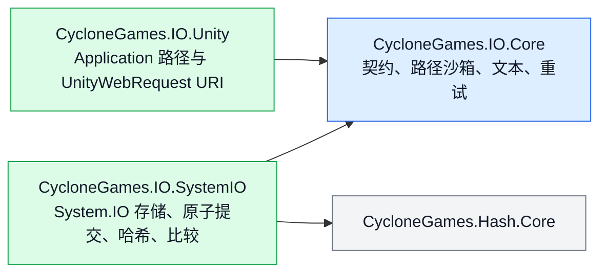

# CycloneGames.IO

[English | 简体中文](README.md)

CycloneGames.IO 是 CycloneGames 模块唯一的文件 IO 底座。它提供有上限的整文件读取、流式传输、严格原子提交、精确比较、哈希、可移植路径沙箱、确定性文本解码、显式重试策略，以及 Unity 文件 URI 构造。分配上限、失败语义、所有权、平台边界和损坏行为都直接体现在 API 中。

## 目录

- [概述](#概述)
- [架构](#架构)
- [快速上手](#快速上手)
- [核心概念](#核心概念)
- [使用指南](#使用指南)
- [进阶主题](#进阶主题)
- [常见场景](#常见场景)
- [性能与内存](#性能与内存)
- [故障排查](#故障排查)

## 概述

本包暴露少量能力契约（`IFileStore`、`IAtomicFileStore`、`IStreamFileStore`）与一个默认 System.IO 实现（`SystemFileStore`）。每次整文件读取都必须显式提供分配上限。每次原子提交都通过同目录临时文件加 `File.Move` 或 `File.Replace` 完成，绝不会先删除再移动。比较会精确校验长度和每个字节；绝不把 hash 当作相等证明。路径沙箱、文本解码、重试与 Unity URI 构造各自是独立契约，调用方只组合需要的部分。

本包不自动记录日志、不隐藏异常、不接管产品策略，也不依赖任何 DI 容器。存档 schema、云同步、压缩、加密密钥管理、虚拟文件系统、内容寻址存储和应用日志应构建在存储契约之上的层中。

参数与契约错误抛出 `ArgumentException`、`ArgumentOutOfRangeException` 或 `ArgumentNullException`。文件系统和平台错误保持对应异常。平台不支持原子替换时抛出 `PlatformNotSupportedException`，取消抛出 `OperationCanceledException`。除明确命名的 `Try...` API 外，本包绝不会把错误转换成 `false`、`null`、空内容或仅日志失败。

### 主要特性

- **有上限的读取**：每次整文件操作都显式提供最大值。
- **原子提交**：通过同目录临时文件加 `File.Move`/`File.Replace` 完成；绝不先删除再移动。
- **流式传输**：chunk 级协作取消，stream 由调用方持有。
- **精确比较**：通过 `FileComparer` / `BinaryContentComparer`；hash 不作为相等证明。
- **哈希**：通过 `FileHasher` / `ContentHasher`（MD5、SHA-256、xxHash64），输出标准小写十六进制。
- **可移植路径沙箱**：通过 `FilePathSandbox` 拒绝 rooted input、dot segment、控制字符、Windows device name 和已有 reparse point。
- **严格文本解码**：通过 `TextCodec` 支持 BOM 感知，并只使用一个显式 fallback encoding。
- **显式重试**：通过 `FileRetry` / `FileRetryPolicy` 面向已理解瞬态分类的幂等操作。
- **Unity 文件 URI**：通过 `UnityFileUri` 跨越 StreamingAssets、PersistentData 和绝对路径为 `UnityWebRequest` 构造 URI。

## 架构



| 程序集 | 用途 |
| --- | --- |
| `CycloneGames.IO.Core` | 纯 C# 契约、路径沙箱、文本 codec、重试策略。不依赖 Unity 或 Logger。 |
| `CycloneGames.IO.SystemIO` | 纯 C# System.IO 实现：`SystemFileStore`、原子提交、哈希、比较。 |
| `CycloneGames.IO.Unity` | Unity 路径适配和 `UnityWebRequest` URI 构造。 |
| `CycloneGames.IO.Editor` | 当前硬件上的 benchmark window。 |
| `CycloneGames.IO.Tests.Core` / `.SystemIO` / `.Unity` | EditMode 契约与集成测试。 |
| `CycloneGames.IO.Tests.Performance` | timing 和 GC sample，不使用依赖硬件的阈值。 |

| 目录 | 职责 |
| --- | --- |
| `Core/Storage/` | 能力契约与传输进度。 |
| `Core/Paths/` | 可移植相对路径校验和沙箱解析。 |
| `Core/Text/` | 严格、确定性的文本解码。 |
| `Core/Retry/` | 显式、有上限的重试策略。 |
| `Runtime/SystemIO/Storage/` | `SystemFileStore`、options、复制行为和 buffer 策略。 |
| `Runtime/SystemIO/Atomic/` | 同目录临时文件事务与提交操作。 |
| `Runtime/SystemIO/Hashing/` | 文件/内容哈希与标准小写十六进制输出。 |
| `Runtime/SystemIO/Comparison/` | 精确字节与文件比较。 |
| `Runtime/Unity/` | Unity 文件位置和 `UnityWebRequest` URI 构造。 |

Core 与 SystemIO 的公共 API 使用 `CycloneGames.IO` namespace；Unity 专属 API 使用 `CycloneGames.IO.Unity`。异步文件 API 返回 `Task`，因为这里定义的是可移植 BCL 边界——Unity 调用方可以从 `UniTask` 工作流中直接 await，而不必把 Unity 类型带入核心契约。

## 快速上手

在 asmdef 中添加对 `CycloneGames.IO.SystemIO`（Unity 路径支持另加 `CycloneGames.IO.Unity`）的引用，然后导入命名空间：

```csharp
using CycloneGames.IO;
```

### 原子写入设置文件

```csharp
SystemFileStore.Default.WriteTextAtomically(savePath, json);
```

如果写入失败或被取消，之前的目标文件会被保留。

### 读取有上限的 manifest

```csharp
const int MAX_MANIFEST_BYTES = 4 * 1024 * 1024;

byte[] bytes = await SystemFileStore.Default.ReadBytesAsync(
    manifestPath,
    MAX_MANIFEST_BYTES,
    cancellationToken);
```

Store 会在分配前校验文件长度，精确读取该长度，并拒绝读取期间观察到的截断或增长。

### 解析沙箱化的 content 路径

```csharp
var sandbox = new FilePathSandbox(contentRoot);
string filePath = sandbox.Resolve(manifestEntry.Location);
```

`FilePathSandbox` 会拒绝 rooted input、dot segment、空 segment、控制字符、不可移植文件名字符、结尾的点/空格和 Windows device name。

## 核心概念

### 能力契约

本包把存储能力拆成三个契约，调用方只依赖最窄的一个：

| 契约 | 用途 |
| --- | --- |
| `IFileStore` | 字节存储能力；每次整文件读取都必须显式提供最大值。 |
| `IAtomicFileStore` | 原子字节与 stream 提交能力。 |
| `IStreamFileStore` | 由调用方持有和释放 stream 的能力。 |

`SystemFileStore` 实现了全部三个契约。`SystemFileStoreOptions` 是不可变 buffer 大小和池化 buffer 清理策略。`FileTransferProgress` 报告已处理字节数、已知/未知总量和比例。

### 原子提交语义

原子写入适用于设置、manifest、journal、checkpoint，以及任何不能接受部分覆盖的文件：

```csharp
SystemFileStore.Default.WriteTextAtomically(savePath, json);

await SystemFileStore.Default.WriteBytesAtomicallyAsync(
    cacheIndexPath,
    indexBytes,
    cancellationToken);
```

提交行为刻意保持严格：

1. 在目标文件所在目录创建唯一临时文件。
2. 写入内容，并在平台支持时调用 `FileStream.Flush(true)`。
3. 新目标通过 `File.Move` 提交。
4. 已有目标通过 `File.Replace` 提交。
5. 平台不支持替换时 fail closed——实现绝不会先删除目标，再移动临时文件。
6. 失败或取消后会尽力清理临时文件，并保留之前的目标文件。

操作本身是原子的，但业务顺序仍由调用方负责。并发 writer 的每个成功结果都是完整文件，最后一次成功的操作系统提交获胜。如果顺序重要，应在上层使用 revision、compare-and-swap 或 owner queue。

`Flush(true)` 会提高文件内容持久性，但不存在一个可移植的 managed API，能对所有 filesystem、存储控制器、主机 SDK、移动系统和突然断电模型保证目录项已经持久化。关键产品必须在目标文件系统和平台上验证恢复策略。

### 有上限的读取

每个整文件读取都必须提供分配上限。Store 会在分配前校验文件长度，精确读取该长度，并拒绝读取期间观察到的截断或增长。大型或不可信内容应使用 stream，而不是未经分析就提高上限。

### 流式传输与取消

返回的 stream 由调用方持有并释放。`CreateWrite` 总是创建或完整截断文件。`OpenAppend` 保留已有内容、只追加、允许并发 reader，并拒绝其他 writer。命名刻意明确，避免调用方混淆 overwrite 与 append 语义。

取消在 buffer 边界协作完成。在 Unity 2022 + Windows 上，实现会在 chunk 之间检查 token，同时向操作系统 `FileStream` 调用传入 `CancellationToken.None`。这避免了已经复现的运行时死锁，同时保持有界取消延迟。

原子操作在进入 commit 阶段前响应取消；一旦目标 commit 开始，就会执行到底并报告真实结果。Progress callback 抛出的异常会在 commit 前终止操作；成功 commit 后不会再调用 callback。

### 路径沙箱

`FilePathSandbox` 在固定可信根目录下解析校验后的可移植相对路径。它拒绝 rooted input、dot segment、空 segment、控制字符、不可移植文件名字符、结尾的点/空格和 Windows device name。默认 `FileLinkPolicy.RejectExistingLinks` 还会拒绝已有的 reparse point/link segment。

词法校验和已有 link 检查无法消除恶意进程并发修改文件系统造成的 TOCTOU 竞争。若本地文件系统本身是敌对安全边界，需要在本包上层使用平台专属的 handle-relative API 和 directory handle 所有权。

### 文本解码

`TextCodec` 识别 UTF-8、UTF-16 LE/BE 和 UTF-32 LE/BE BOM。无 BOM 内容只使用调用方选择的 fallback encoding，默认是严格 UTF-8 without BOM。它不会根据零字节模式猜测 UTF-16/UTF-32，也不会静默替换损坏输入。

```csharp
string text = TextCodec.Decode(downloadHandler.data);
byte[] utf8 = TextCodec.Encode(text);

if (!TextCodec.TryDecode(bytes, out string optionalText))
{
    // Handle malformed UTF-8 explicitly.
}
```

## 使用指南

### 从大型 source 原子流式写入

大型或即时生成的 source 可直接流式写入原子事务：

```csharp
using (Stream source = files.OpenRead(sourcePath))
{
    await files.WriteStreamAtomicallyAsync(
        destinationPath,
        source,
        progress,
        cancellationToken);
}
```

Source stream 由调用方持有；原子事务拥有临时文件和 commit。

### 精确比较与原子复制

```csharp
bool equal = await FileComparer.AreEqualAsync(
    firstPath,
    secondPath,
    progress,
    cancellationToken);

FileCopyResult result = await SystemFileStore.Default.CopyAtomicallyAsync(
    sourcePath,
    destinationPath,
    FileCopyBehavior.SkipIfIdentical,
    progress,
    cancellationToken);
```

比较会精确校验长度和每个字节。`SkipIfIdentical` 会避免替换未发生变化的目标；其他情况会把复制内容流式写入原子事务。

### 哈希

```csharp
string sha256 = await FileHasher.ComputeHexAsync(
    filePath,
    FileHashAlgorithm.Sha256,
    progress,
    cancellationToken);

Span<byte> hash = stackalloc byte[ContentHasher.GetHashSize(FileHashAlgorithm.XxHash64)];
ContentHasher.WriteHash(content, FileHashAlgorithm.XxHash64, hash);
```

- 内容完整性和 trust workflow 使用 SHA-256。
- xxHash64 快速且稳定，但不是密码学算法。
- MD5 只用于与外部既有格式互操作，不得作为安全原语。
- 当正确性要求证明全部字节一致时，hash 比较不能替代精确比较。

### UnityWebRequest URI

```csharp
using CycloneGames.IO.Unity;

string defaultUri = UnityFileUri.Create(
    "Config/input.yaml",
    UnityFileLocation.StreamingAssets);

if (!UnityFileUri.TryCreate(
        "Settings/user.yaml",
        UnityFileLocation.PersistentData,
        out string userUri,
        out UnityFileUriError error))
{
    // Convert the typed error into product-specific diagnostics.
}
```

`StreamingAssets` 和 `PersistentData` 接受校验后的相对路径。`AbsolutePathOrUri` 接受绝对文件路径或 `http`、`https`、`file`、`jar` URI。本包不会自动记录失败日志。

### 重试

重试永远不会自动发生。只有明确理解瞬态故障分类且操作幂等时，才应显式包装：

```csharp
var policy = new FileRetryPolicy(
    maxAttempts: 4,
    initialDelay: TimeSpan.FromMilliseconds(20),
    backoffMultiplier: 2.0,
    maxDelay: TimeSpan.FromMilliseconds(500));

await FileRetry.ExecuteAsync(
    () => SystemFileStore.Default.WriteBytesAtomicallyAsync(path, bytes),
    policy,
    cancellationToken);
```

默认 classifier 只重试 Windows sharing violation 和 lock violation，不会重试权限错误、非法路径、磁盘已满、内容损坏、平台不支持原子替换或任意 `IOException`。

## 进阶主题

### 同目标 commit 协调

同一规范化目标的 commit 会在进程内串行，避免 Windows `File.Replace` 竞争；不相关目标仍完全并行，最后一个 holder 退出后协调 entry 会被删除。跨进程竞争仍保持为可见 IO failure；操作幂等时，可在外层显式使用 `FileRetry`。

本包不使用全局 IO lock、隐藏 scheduler、自动 retry loop、Logger、Service Locator 或可变全局配置。

### Buffer 池化与清理

默认传输 buffer 为 64 KiB，可在 4 KiB 到 1 MiB 之间通过 `SystemFileStoreOptions` 配置。流式传输、哈希、比较和原子 stream copy 从 `ArrayPool<byte>.Shared` 租用 buffer。

| `PooledBufferClearMode` | 行为 |
| --- | --- |
| `UsedRegion`（默认） | 归还前清空所有实际写入的字节。 |
| `EntireBuffer` | 清空整个租用数组，隔离更强但 CPU 成本更高。 |
| `None` | 只适用于内容不敏感且吞吐优先的场景。 |

文本便捷方法会清零临时编码/解码 byte array；失败或取消的 bounded read 也会在交给 GC 前清零已部分填充的 allocation。直接写入方法在失败或取消时可能留下部分目标——不能接受部分状态时必须使用原子方法。

### Progress callback

Progress callback 在异步操作的 continuation context 执行；访问 Unity object 前应切回主线程。Callback 抛出的异常会在 commit 前终止操作；成功 commit 后不会再调用 callback。

### Editor benchmark

通过 `Window > CycloneGames > IO Benchmark` 在当前机器上做探索性测量。性能测试记录 timing 和 GC sample，不使用依赖硬件的固定吞吐阈值。

## 常见场景

### 带崩溃恢复的存档持久化

存档系统需要保证崩溃的写入不会留下部分存档文件：

```csharp
public async Task SaveAsync(string savePath, SaveData data, CancellationToken ct)
{
    string json = Serialize(data);
    await SystemFileStore.Default.WriteBytesAtomicallyAsync(
        savePath,
        Encoding.UTF8.GetBytes(json),
        ct);
}
```

如果进程在写入中被杀死，之前的存档文件保持完整。目标目录可能留下陈旧的 `.cyclone-*.tmp` 文件；只有没有事务运行时才能清理。

### 把大型下载流式写入磁盘

下载 handler 把大型 asset 直接流式写入缓存文件，不在内存中缓冲整个负载：

```csharp
using (Stream downloadStream = await OpenDownloadStreamAsync(url, ct))
{
    await SystemFileStore.Default.WriteStreamAtomicallyAsync(
        cachePath,
        downloadStream,
        progress: new Progress<FileTransferProgress>(p => ReportProgress(p.Ratio)),
        cancellationToken: ct);
}
```

原子事务拥有临时文件；下载 stream 由调用方持有并由 `using` 释放。

### 用 SHA-256 校验 asset 完整性

构建管线在安装下载 asset 前校验其哈希是否匹配：

```csharp
string actualHash = await FileHasher.ComputeHexAsync(
    downloadedPath,
    FileHashAlgorithm.Sha256,
    progress: null,
    cancellationToken: ct);

if (!string.Equals(actualHash, expectedSha256, StringComparison.OrdinalIgnoreCase))
{
    File.Delete(downloadedPath);
    throw new InvalidOperationException("Asset hash mismatch.");
}
```

内容完整性和 trust workflow 使用 SHA-256。非密码学缓存键使用 xxHash64。

### 在 Android 上从 StreamingAssets 读取配置

Android 的 StreamingAssets 被打包进 APK，必须通过 `UnityWebRequest` 而不是 `File.OpenRead` 访问：

```csharp
string uri = UnityFileUri.Create("Config/settings.json", UnityFileLocation.StreamingAssets);

using (UnityWebRequest request = UnityWebRequest.Get(uri))
{
    request.downloadHandler = new DownloadHandlerBuffer();
    await request.SendWebRequest();

    if (request.result != UnityWebRequest.Result.Success)
    {
        throw new IOException($"Failed to load config: {request.error}");
    }

    string text = TextCodec.Decode(request.downloadHandler.data);
    Settings settings = ParseSettings(text);
}
```

`TextCodec.Decode` 处理 BOM 感知解码，不会猜测。对于不在 APK 中的 persistent 文件，使用 `UnityFileLocation.PersistentData` 并通过 `SystemFileStore` 直接读取。

### 沙箱化的 mod 加载

Mod 加载器不能允许 mod 提供的路径逃出 mod content root：

```csharp
var modSandbox = new FilePathSandbox(modContentRoot);

foreach (ModManifestEntry entry in manifest.Assets)
{
    string resolvedPath = modSandbox.Resolve(entry.Location);
    // resolvedPath is guaranteed to be inside modContentRoot.
    byte[] assetBytes = await SystemFileStore.Default.ReadBytesAsync(
        resolvedPath,
        maxBytes: 64 * 1024 * 1024,
        cancellationToken: ct);
    LoadAsset(entry.Name, assetBytes);
}
```

`FilePathSandbox` 拒绝路径穿越尝试、rooted 路径，以及（启用 `RejectExistingLinks` 时）可能重定向到可信根之外的 reparse point。

## 性能与内存

- 默认传输 buffer 为 64 KiB，可在 4 KiB 到 1 MiB 之间配置。
- 流式传输、哈希、比较和原子 stream copy 从 `ArrayPool<byte>.Shared` 租用 buffer。
- 默认 `PooledBufferClearMode.UsedRegion`；`EntireBuffer` 隔离更强但 CPU 成本更高；`None` 适用于内容不敏感且吞吐优先的场景。
- 文本便捷方法会清零临时编码/解码 byte array。
- 失败或取消的 bounded read 会在交给 GC 前清零已部分填充的 allocation。
- 直接写入方法在失败或取消时可能留下部分目标——不能接受部分状态时必须使用原子方法。
- 同目标 commit 协调范围很窄并会自动回收；不使用全局 IO lock、隐藏 scheduler 或自动 retry loop。
- Progress callback 在 continuation context 执行；访问 Unity object 前应切回主线程。

### 平台行为

| 平台 | 说明 |
| --- | --- |
| Windows Editor/Player | 路径 containment 不区分大小写；遵循 Windows sharing 语义；已有目标通过 `File.Replace` 提交。chunk 协作取消避免 Unity 2022 `FileStream` 取消死锁。 |
| macOS/Linux Editor/Player | 路径 containment 区分大小写；atomic replace 和 durability 取决于 filesystem mount options。 |
| Android | 打包的 StreamingAssets 通过 `UnityWebRequest` URI 访问；persistent file 使用应用 sandbox。 |
| iOS/tvOS | persistent path 由应用拥有，可能参与系统 backup；产品需要明确备份和排除策略。 |
| WebGL | StreamingAssets 使用 URI；System.IO persistence、quota、同步和 durability 取决于 Unity/Emscripten filesystem 配置。 |
| 主机平台 | 文件权限、quota、mount lifecycle、认证规则和 atomic replace 支持必须结合目标 SDK 与真机验证。 |
| Headless/CLI | Core 和 SystemIO 不依赖 UnityEngine，可用于服务器与离线工具进程。 |

### 持久化清单

Runtime 包在未被调用时不会创建文件，也不持有隐式持久状态。

| 数据 | 位置 | Owner | 清理 |
| --- | --- | --- | --- |
| 调用方内容 | 调用方传入路径 | 调用产品/模块 | 调用方负责 schema、保留、备份、迁移和恢复 |
| 原子临时文件 | 目标文件所在目录 | 单次原子事务 | 失败/取消后尽力删除；没有事务运行时，可清理匹配 `.cyclone-*.tmp` 的陈旧文件 |
| Benchmark 数据 | `Application.temporaryCachePath/CycloneGames.IO.Benchmark/<run-id>/` | Editor benchmark window | 每次运行后删除；benchmark 未运行时可安全删除 |

本包不使用 `PlayerPrefs`、`EditorPrefs`、`SessionState`、registry、plist 或隐藏配置文件。

## 故障排查

| 现象 | 可能原因 | 解决方法 |
| --- | --- | --- |
| `ReadBytesAsync` 在合法文件上抛异常 | 文件在长度检查与读取之间增长 | 重试读取；不可信 source 改用 stream 而非提高上限 |
| 原子写入留下 `.cyclone-*.tmp` 文件 | 上一次事务被中断 | 只有在没有事务运行时才能清理陈旧 temp 文件 |
| `PlatformNotSupportedException` 出现在原子替换 | 目标 filesystem 不支持 `File.Replace` | 验证目标平台；只有在能接受部分状态时才回退到非原子写入 |
| `FileRetry` 不重试某个 `IOException` | 默认 classifier 只重试 Windows sharing/lock violation | 确认故障是瞬态的；不理解幂等性时不要扩大 classifier |
| `UnityFileUri.TryCreate` 返回 `false` | 路径是 rooted、包含 dot segment 或使用不支持的 scheme | `StreamingAssets`/`PersistentData` 使用校验后的相对路径；绝对路径或 `http`/`https`/`file`/`jar` URI 使用 `AbsolutePathOrUri` |
| `TextCodec.TryDecode` 返回 `false` | 无 BOM 内容中存在损坏的 UTF-8 | 提供显式 fallback encoding，或把输入判定为损坏 |
| `FileComparer.AreEqualAsync` 对相同内容返回 `false` | 文件长度或字节不同 | 先比较长度；长度相同再比较字节——不要仅凭 hash 比较作为相等证明 |
| 取消未能中止原子 commit | Commit 阶段已经开始 | 符合预期；commit 会执行到底并报告真实结果 |
| WebGL 持久化行为不稳定 | System.IO persistence 取决于 Unity/Emscripten filesystem 配置 | 在 `IFileStore` 之上使用 IndexedDB 后端持久化；验证目标浏览器行为 |
| 跨进程原子写入失败 | 跨进程的 `File.Replace` 竞争 | 把幂等操作包装在 `FileRetry` 中；顺序重要时用外部 lock 协调 writer |
| Progress callback 从 worker thread 访问 Unity object | Callback 在异步 continuation context 执行 | 访问 Unity object 前切回主线程 |

## 验证

自动化 EditMode 测试覆盖：严格文本解码和 BOM 行为；可移植 sandbox 校验与 containment；retry classifier 与尝试次数上限；bounded read 与精确 hash；严格原子替换和确定性注入的 replacement failure；并发原子 writer 不产生 mixed-content commit；copy 中途取消时保留旧目标并清理临时文件；精确 comparison 与 skip-if-identical copy；Unity URI traversal、scheme 和 location 行为；4 MiB 精确比较、SHA-256 和 xxHash64 性能 sample。

运行测试程序集：

```text
<UnityEditor> -batchmode -nographics -projectPath <repo-root>/UnityStarter -runTests -testPlatform EditMode -assemblyNames CycloneGames.IO.Tests.Core;CycloneGames.IO.Tests.SystemIO;CycloneGames.IO.Tests.Unity -testResults <result-path> -quit
```

最小 Unity 验证步骤：

1. 等待脚本编译完成，确认 Console 无 error。
2. 运行 `CycloneGames.IO.Tests.Core`、`CycloneGames.IO.Tests.SystemIO` 和 `CycloneGames.IO.Tests.Unity` EditMode tests。
3. 安装 performance test package 时运行 `CycloneGames.IO.Tests.Performance`。
4. 在 Android/WebGL Player build 中验证 StreamingAssets URI。
5. 在每个发布平台和目标文件系统上验证 atomic replace、quota 行为与进程突然终止后的恢复。
