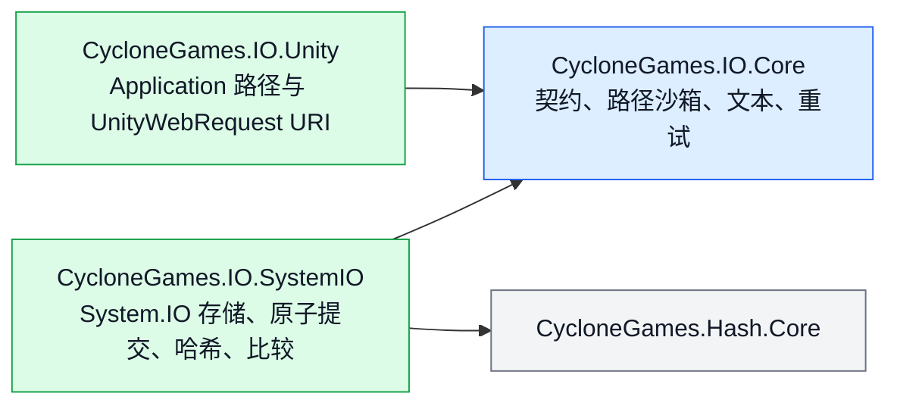

# CycloneGames.IO

[English | 简体中文](README.md)

CycloneGames.IO 为 Unity 项目与纯 C# 服务提供有上限的整文件读取、流式传输、严格原子提交、精确比较、文件哈希、可移植路径沙箱、确定性文本解码与显式重试。三个能力契约 —— `IFileStore`、`IAtomicFileStore`、`IStreamFileStore` —— 定义存储面；`SystemFileStore` 实现了全部三个契约。

## 目录

- [概述](#概述)
- [架构](#架构)
- [快速上手](#快速上手)
- [核心概念](#核心概念)
- [使用指南](#使用指南)
- [进阶主题](#进阶主题)
- [常见场景](#常见场景)
- [性能与内存](#性能与内存)
- [故障排查](#故障排查)

## 概述

每次整文件读取都必须显式提供分配上限。每次原子提交都先写入同目录临时文件，再调用 `File.Move` 或 `File.Replace`——绝不先删除再移动。比较会精确校验长度和每个字节；hash 不作为相等证明。参数与契约错误抛出 `ArgumentException`、`ArgumentOutOfRangeException` 或 `ArgumentNullException`。文件系统和平台错误保持对应异常。取消抛出 `OperationCanceledException`。

### 主要特性

- **有上限的读取**：每次整文件操作都显式提供最大字节数。
- **原子提交**：通过同目录临时文件加 `File.Move`/`File.Replace` 完成。
- **流式传输**：chunk 级协作取消，stream 由调用方持有。
- **精确比较**：通过 `FileComparer` 与 `BinaryContentComparer` 完成。
- **文件哈希**：通过 `FileHasher` 与 `ContentHasher`（MD5、SHA-256、xxHash64）输出标准小写十六进制。
- **路径沙箱**：通过 `FilePathSandbox` 拒绝 rooted input、dot segment、控制字符和 Windows device name。
- **文本解码**：通过 `TextCodec` 支持 BOM 感知与一个显式 fallback encoding。
- **重试**：通过 `FileRetry` 与 `FileRetryPolicy` 面向已理解瞬态分类的幂等操作。
- **Unity 文件 URI**：通过 `UnityFileUri` 为 `UnityWebRequest` 跨越 `StreamingAssets`、`PersistentData` 和绝对路径构造 URI。

## 架构



| 程序集 | 路径 | 用途 |
| --- | --- | --- |
| `CycloneGames.IO.Core` | `Core/` | 纯 C# 契约、路径沙箱、文本 codec、重试策略。`noEngineReferences: true`。 |
| `CycloneGames.IO.SystemIO` | `Runtime/SystemIO/` | `SystemFileStore`、原子提交、哈希、比较。引用 `CycloneGames.Hash.Core`。 |
| `CycloneGames.IO.Unity` | `Runtime/Unity/` | Unity 路径适配和 `UnityWebRequest` URI 构造。 |
| `CycloneGames.IO.Editor` | `Editor/` | 本地 benchmark 窗口。 |
| `CycloneGames.IO.Tests.Core` | `Tests/Core/` | 契约测试。 |
| `CycloneGames.IO.Tests.SystemIO` | `Tests/SystemIO/` | 存储、原子、哈希与比较集成测试。 |
| `CycloneGames.IO.Tests.Unity` | `Tests/Unity/` | Unity URI 行为测试。 |
| `CycloneGames.IO.Tests.Performance` | `Tests/Performance/` | 耗时与 GC sample。 |

| 目录 | 职责 |
| --- | --- |
| `Core/Storage/` | 能力契约与传输进度。 |
| `Core/Paths/` | 可移植相对路径校验与沙箱解析。 |
| `Core/Text/` | 严格确定性文本解码。 |
| `Core/Retry/` | 显式有上限的重试策略。 |
| `Runtime/SystemIO/Storage/` | `SystemFileStore`、options、复制行为与 buffer 策略。 |
| `Runtime/SystemIO/Atomic/` | 同目录临时文件事务与提交。 |
| `Runtime/SystemIO/Hashing/` | 文件/内容哈希与标准小写十六进制输出。 |
| `Runtime/SystemIO/Comparison/` | 精确字节与文件比较。 |
| `Runtime/Unity/` | Unity 文件位置和 `UnityWebRequest` URI 构造。 |

Core 与 SystemIO 的公共 API 使用 `CycloneGames.IO` namespace；Unity 专属 API 使用 `CycloneGames.IO.Unity`。

## 快速上手

在 asmdef 中添加对 `CycloneGames.IO.SystemIO` 的引用（Unity 路径支持另加 `CycloneGames.IO.Unity`）：

```csharp
using CycloneGames.IO;
```

### 原子写入设置文件

```csharp
SystemFileStore.Default.WriteTextAtomically(savePath, json);
```

### 读取有上限的 manifest

```csharp
const int MAX_MANIFEST_BYTES = 4 * 1024 * 1024;

byte[] bytes = await SystemFileStore.Default.ReadBytesAsync(
    manifestPath,
    MAX_MANIFEST_BYTES,
    cancellationToken);
```

Store 在分配前校验文件长度，精确读取该长度，并拒绝读写期间观察到的截断或增长。

### 解析沙箱化内容路径

```csharp
var sandbox = new FilePathSandbox(contentRoot);
string filePath = sandbox.Resolve(manifestEntry.Location);
```

`FilePathSandbox` 拒绝 rooted input、dot segment、空 segment、控制字符、不可移植文件名字符、结尾的点/空格和 Windows device name。

## 核心概念

### 能力契约

三个契约让调用方只依赖最窄的能力：

| 契约 | 用途 |
| --- | --- |
| `IFileStore` | 字节存储能力；每次整文件读取都显式提供最大值。 |
| `IAtomicFileStore` | 原子字节与 stream 提交。 |
| `IStreamFileStore` | 由调用方持有和释放 stream 的能力。 |

`SystemFileStore` 实现了全部三个契约。`SystemFileStoreOptions` 是不可变 buffer 大小和池化 buffer 清理策略。`FileTransferProgress` 报告已处理字节数、已知/未知总量和比例。

### 原子提交语义

原子写入适用于设置、manifest、journal、checkpoint，以及任何不能接受部分覆盖的文件：

```csharp
SystemFileStore.Default.WriteTextAtomically(savePath, json);

await SystemFileStore.Default.WriteBytesAtomicallyAsync(
    cacheIndexPath,
    indexBytes,
    cancellationToken);
```

提交行为：

1. 在目标目录中创建唯一临时文件。
2. 写入内容，平台支持时调用 `FileStream.Flush(true)`。
3. 新目标通过 `File.Move` 提交。
4. 已有目标通过 `File.Replace` 提交。
5. 平台不支持替换时 fail closed——实现绝不会先删除目标再移动临时文件。
6. 失败或取消后尝试清理临时文件，保留之前的目标。

操作对单个目标是原子的。并发 writer 的每个成功结果都是完整文件，最后一次操作系统提交获胜。顺序重要时使用上层 revision 或 compare-and-swap 策略。

`Flush(true)` 提高文件内容持久性，但不存在可移植 managed API 能对所有文件系统、存储控制器或突然断电模型保证目录项已持久化。

### 有上限的读取

每次整文件读取都必须提供分配上限。Store 在分配前校验文件长度，精确读取该长度，并拒绝读写期间观察到的截断或增长。

### 流式传输与取消

返回的 stream 由调用方持有和释放。`CreateWrite` 总是创建或完整截断文件。`OpenAppend` 保留已有内容、只追加、允许并发 reader、拒绝其他 writer。

取消在 buffer 边界协作完成。在 Unity 2022 + Windows 上，token 在 chunk 之间检查，同时向 OS `FileStream` 调用传入 `CancellationToken.None`，避免已知的运行时死锁。

原子操作在 commit 阶段开始前响应取消；commit 开始后执行到底并报告真实结果。

### 路径沙箱

`FilePathSandbox` 在固定可信根目录下解析校验后的可移植相对路径。它拒绝 rooted input、dot segment、空 segment、控制字符、不可移植文件名字符、结尾的点/空格和 Windows device name。默认 `FileLinkPolicy.RejectExistingLinks` 拒绝已有 reparse-point/link segment。

### 文本解码

`TextCodec` 识别 UTF-8、UTF-16 LE/BE、UTF-32 LE/BE BOM。无 BOM 内容使用调用方选择的 fallback encoding（默认：严格 UTF-8 without BOM）。它不会根据零字节模式猜测 UTF-16/UTF-32，也不会静默替换损坏输入。

```csharp
string text = TextCodec.Decode(downloadHandler.data);
byte[] utf8 = TextCodec.Encode(text);

if (!TextCodec.TryDecode(bytes, out string optionalText))
{
    // Handle malformed UTF-8.
}
```

## 使用指南

### 从大型 source 原子流式写入

```csharp
using (Stream source = files.OpenRead(sourcePath))
{
    await files.WriteStreamAtomicallyAsync(
        destinationPath,
        source,
        progress,
        cancellationToken);
}
```

### 精确比较与原子复制

```csharp
bool equal = await FileComparer.AreEqualAsync(
    firstPath,
    secondPath,
    progress,
    cancellationToken);

FileCopyResult result = await SystemFileStore.Default.CopyAtomicallyAsync(
    sourcePath,
    destinationPath,
    FileCopyBehavior.SkipIfIdentical,
    progress,
    cancellationToken);
```

`SkipIfIdentical` 避免替换未发生变化的目标。

### 哈希

```csharp
string sha256 = await FileHasher.ComputeHexAsync(
    filePath,
    FileHashAlgorithm.Sha256,
    progress,
    cancellationToken);

Span<byte> hash = stackalloc byte[ContentHasher.GetHashSize(FileHashAlgorithm.XxHash64)];
ContentHasher.WriteHash(content, FileHashAlgorithm.XxHash64, hash);
```

- 内容完整性和 trust workflow 使用 SHA-256。
- xxHash64 快速稳定，但不是密码学算法。
- MD5 仅用于与现有外部格式互操作。
- Hash 比较不能替代精确相等。

### UnityWebRequest URI

```csharp
using CycloneGames.IO.Unity;

string defaultUri = UnityFileUri.Create(
    "Config/input.yaml",
    UnityFileLocation.StreamingAssets);

if (!UnityFileUri.TryCreate(
        "Settings/user.yaml",
        UnityFileLocation.PersistentData,
        out string userUri,
        out UnityFileUriError error))
{
    // 将强类型 error 转换为产品专属诊断信息。
}
```

`StreamingAssets` 和 `PersistentData` 接受校验后的相对路径。`AbsolutePathOrUri` 接受绝对文件路径或 `http`、`https`、`file`、`jar` URI。

### 重试

仅对已理解瞬态分类的幂等操作显式包装：

```csharp
var policy = new FileRetryPolicy(
    maxAttempts: 4,
    initialDelay: TimeSpan.FromMilliseconds(20),
    backoffMultiplier: 2.0,
    maxDelay: TimeSpan.FromMilliseconds(500));

await FileRetry.ExecuteAsync(
    () => SystemFileStore.Default.WriteBytesAtomicallyAsync(path, bytes),
    policy,
    cancellationToken);
```

默认 classifier 只重试 Windows sharing violation 和 lock violation。

## 进阶主题

### 同目标 commit 协调

同一规范化目标的 commit 在进程内串行以避免 Windows `File.Replace` 竞争；不相关目标仍完全并行。最后一个 holder 退出后删除协调 entry。跨进程竞争仍保持为可见 I/O failure。

### Buffer 池化与清理

默认传输 buffer 为 64 KiB，可在 4 KiB 到 1 MiB 之间通过 `SystemFileStoreOptions` 配置。流式传输、哈希、比较和原子 stream copy 从 `ArrayPool<byte>.Shared` 租用 buffer。

| `PooledBufferClearMode` | 行为 |
| --- | --- |
| `UsedRegion`（默认） | 归还前清空所有实际写入的字节。 |
| `EntireBuffer` | 清空整个租用数组。 |
| `None` | 适用于内容不敏感且吞吐优先的场景。 |

文本便捷方法清零临时编码/解码 byte array。失败或取消的 bounded read 清零已部分填充的 allocation。直接写入方法可能留下部分目标——不能接受部分状态时使用原子方法。

### Progress callback

Progress callback 在异步 continuation context 执行。访问 Unity object 前切回主线程。Callback 异常在 commit 前终止操作。

### Editor benchmark

通过 `Window > CycloneGames > IO Benchmark` 在当前机器上做探索性测量。

## 常见场景

### 带崩溃恢复的存档持久化

```csharp
public async Task SaveAsync(string savePath, SaveData data, CancellationToken ct)
{
    string json = Serialize(data);
    await SystemFileStore.Default.WriteBytesAtomicallyAsync(
        savePath,
        Encoding.UTF8.GetBytes(json),
        ct);
}
```

进程在写入中被杀死时，之前存档文件保持完整。

### 把大型下载流式写入磁盘

```csharp
using (Stream downloadStream = await OpenDownloadStreamAsync(url, ct))
{
    await SystemFileStore.Default.WriteStreamAtomicallyAsync(
        cachePath,
        downloadStream,
        progress: new Progress<FileTransferProgress>(p => ReportProgress(p.Ratio)),
        cancellationToken: ct);
}
```

### 用 SHA-256 校验 asset 完整性

```csharp
string actualHash = await FileHasher.ComputeHexAsync(
    downloadedPath,
    FileHashAlgorithm.Sha256,
    progress: null,
    cancellationToken: ct);

if (!string.Equals(actualHash, expectedSha256, StringComparison.OrdinalIgnoreCase))
{
    File.Delete(downloadedPath);
    throw new InvalidOperationException("Asset hash mismatch.");
}
```

### 在 Android 上从 StreamingAssets 读取配置

```csharp
string uri = UnityFileUri.Create("Config/settings.json", UnityFileLocation.StreamingAssets);

using (UnityWebRequest request = UnityWebRequest.Get(uri))
{
    request.downloadHandler = new DownloadHandlerBuffer();
    await request.SendWebRequest();

    if (request.result != UnityWebRequest.Result.Success)
    {
        throw new IOException($"Failed to load config: {request.error}");
    }

    string text = TextCodec.Decode(request.downloadHandler.data);
    Settings settings = ParseSettings(text);
}
```

### 沙箱化的 mod 加载

```csharp
var modSandbox = new FilePathSandbox(modContentRoot);

foreach (ModManifestEntry entry in manifest.Assets)
{
    string resolvedPath = modSandbox.Resolve(entry.Location);
    byte[] assetBytes = await SystemFileStore.Default.ReadBytesAsync(
        resolvedPath,
        maxBytes: 64 * 1024 * 1024,
        cancellationToken: ct);
    LoadAsset(entry.Name, assetBytes);
}
```

## 性能与内存

- 默认传输 buffer：64 KiB，可配置 4 KiB 到 1 MiB。
- 流式传输、哈希、比较和原子 stream copy 从 `ArrayPool<byte>.Shared` 租用 buffer。
- 默认 `PooledBufferClearMode.UsedRegion`；`EntireBuffer` 隔离更强；`None` 适用于非敏感内容。
- 文本便捷方法清零临时编码/解码 byte array。
- 失败或取消的 bounded read 清零已部分填充的 allocation。
- 同目标 commit 协调范围窄且自回收。

### 平台行为

| 平台 | 说明 |
| --- | --- |
| Windows Editor/Player | 路径 containment 不区分大小写。已有目标通过 `File.Replace` 提交。chunk 协作取消避免 Unity 2022 `FileStream` 死锁。 |
| macOS/Linux Editor/Player | 路径 containment 区分大小写。atomic replace 和 durability 取决于文件系统 mount options。 |
| Android | 打包 StreamingAssets 通过 `UnityWebRequest` URI 访问；persistent file 使用应用 sandbox。 |
| iOS/tvOS | Persistent path 由应用拥有；产品需分类文件以决定备份与排除。 |
| WebGL | StreamingAssets 使用 URI。System.IO persistence 取决于 Unity/Emscripten 文件系统配置。 |
| 主机平台 | 文件权限、quota、mount lifecycle 和 atomic replace 支持必须结合目标 SDK 验证。 |
| Headless/CLI | Core 与 SystemIO 不依赖 `UnityEngine`。 |

### 持久化清单

Runtime 包在未被调用时不会创建文件。

| 数据 | 位置 | Owner | 清理 |
| --- | --- | --- | --- |
| 调用方内容 | 调用方传入路径 | 调用产品/模块 | 调用方定义 schema、保留、备份、迁移与恢复 |
| 原子临时文件 | 目标目录 | 单次原子事务 | 失败/取消后尽力删除；无事务时可清理匹配 `.cyclone-*.tmp` 的陈旧文件 |
| Benchmark 数据 | `Application.temporaryCachePath/CycloneGames.IO.Benchmark/<run-id>/` | Editor benchmark window | 每次运行后删除 |

本包不使用 `PlayerPrefs`、`EditorPrefs`、`SessionState`、registry、plist 或隐藏配置文件。

## 故障排查

| 现象 | 可能原因 | 解决方法 |
| --- | --- | --- |
| `ReadBytesAsync` 在合法文件上抛异常 | 文件在长度检查与读取之间增长 | 重试读取；不可信 source 改用 streaming |
| 原子写入留下 `.cyclone-*.tmp` 文件 | 上一次事务被中断 | 无事务时才清理陈旧 temp 文件 |
| `PlatformNotSupportedException` 出现在原子替换 | 目标文件系统不支持 `File.Replace` | 验证目标平台；仅能接受部分状态时才回退到非原子写入 |
| `FileRetry` 不重试某个 `IOException` | 默认 classifier 只重试 Windows sharing/lock violation | 确认故障是瞬态的 |
| `UnityFileUri.TryCreate` 返回 `false` | 路径 rooted、包含 dot segment 或使用不支持的 scheme | `StreamingAssets`/`PersistentData` 使用校验后相对路径；绝对路径使用 `AbsolutePathOrUri` |
| `TextCodec.TryDecode` 返回 `false` | 无 BOM 内容中存在损坏的 UTF-8 | 提供显式 fallback encoding 或判定输入为损坏 |
| `FileComparer.AreEqualAsync` 对相同内容返回 `false` | 文件长度或字节不同 | 先比较长度，再比较字节 |
| 取消未能中止原子 commit | Commit 阶段已经开始 | 符合预期；commit 会执行到底 |

## 验证

运行 EditMode 测试：

```text
<UnityEditor> -batchmode -nographics -projectPath <repo-root>/UnityStarter -runTests -testPlatform EditMode -assemblyNames CycloneGames.IO.Tests.Core;CycloneGames.IO.Tests.SystemIO;CycloneGames.IO.Tests.Unity -testResults <result-path> -quit
```

最小验证步骤：

1. 等待脚本编译完成，确认 Console 无 error。
2. 运行 `CycloneGames.IO.Tests.Core`、`CycloneGames.IO.Tests.SystemIO` 和 `CycloneGames.IO.Tests.Unity` EditMode 测试。
3. 安装 performance test package 时运行 `CycloneGames.IO.Tests.Performance`。
4. 在 Android/WebGL Player build 中验证 StreamingAssets URI。
5. 在每个发布平台上验证 atomic replace、quota 行为与进程突然终止后的恢复。
