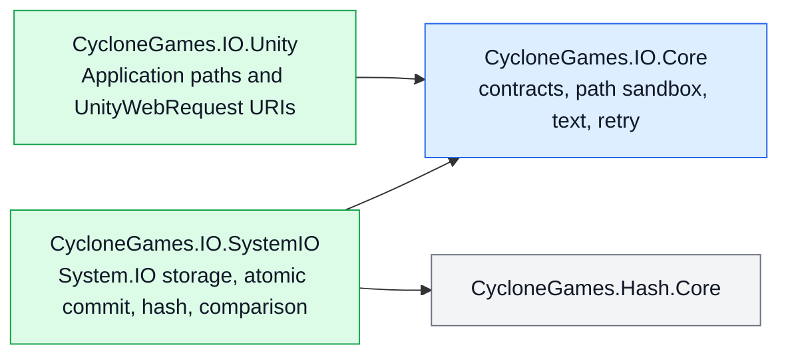

# CycloneGames.IO

[English | 简体中文](README.SCH.md)

CycloneGames.IO provides bounded whole-file reads, streaming transfer, strict atomic commits, exact comparison, file hashing, portable path sandboxing, deterministic text decoding, and explicit retry for Unity projects and pure C# services. Three capability contracts — `IFileStore`, `IAtomicFileStore`, `IStreamFileStore` — define the storage surface; `SystemFileStore` implements all three.

## Table of Contents

- [Overview](#overview)
- [Architecture](#architecture)
- [Quick Start](#quick-start)
- [Core Concepts](#core-concepts)
- [Usage Guide](#usage-guide)
- [Advanced Topics](#advanced-topics)
- [Common Scenarios](#common-scenarios)
- [Performance and Memory](#performance-and-memory)
- [Troubleshooting](#troubleshooting)

## Overview

Every whole-file read requires an explicit allocation ceiling. Every atomic commit writes to a same-directory temporary file, then calls `File.Move` or `File.Replace` — never delete-then-move. Comparison checks length and bytes exactly; hashes are not accepted as equality proof. Argument and contract violations throw `ArgumentException`, `ArgumentOutOfRangeException`, or `ArgumentNullException`. Filesystem and platform failures remain visible as their corresponding exceptions. Cancellation throws `OperationCanceledException`.

### Key features

- **Bounded reads** with an explicit maximum byte count for every whole-file operation.
- **Atomic commits** through same-directory temporary file plus `File.Move`/`File.Replace`.
- **Streaming transfer** with cooperative chunk-level cancellation and caller-owned streams.
- **Exact comparison** via `FileComparer` and `BinaryContentComparer`.
- **File hashing** via `FileHasher` and `ContentHasher` (MD5, SHA-256, xxHash64) with canonical lowercase hexadecimal output.
- **Path sandbox** via `FilePathSandbox` rejecting rooted input, dot segments, control characters, and Windows device names.
- **Text decoding** via `TextCodec` with BOM awareness and one explicit fallback encoding.
- **Retry** via `FileRetry` and `FileRetryPolicy` for idempotent operations with understood transient classification.
- **Unity file URIs** via `UnityFileUri` for `UnityWebRequest` across `StreamingAssets`, `PersistentData`, and absolute paths.

## Architecture



| Assembly | Path | Purpose |
| --- | --- | --- |
| `CycloneGames.IO.Core` | `Core/` | Pure C# contracts, path sandbox, text codec, retry policy. `noEngineReferences: true`. |
| `CycloneGames.IO.SystemIO` | `Runtime/SystemIO/` | `SystemFileStore`, atomic commit, hashing, comparison. References `CycloneGames.Hash.Core`. |
| `CycloneGames.IO.Unity` | `Runtime/Unity/` | Unity path adaptation and `UnityWebRequest` URI construction. |
| `CycloneGames.IO.Editor` | `Editor/` | Hardware-local benchmark window. |
| `CycloneGames.IO.Tests.Core` | `Tests/Core/` | Contract tests. |
| `CycloneGames.IO.Tests.SystemIO` | `Tests/SystemIO/` | Storage, atomic, hash, and comparison integration tests. |
| `CycloneGames.IO.Tests.Unity` | `Tests/Unity/` | Unity URI behavior tests. |
| `CycloneGames.IO.Tests.Performance` | `Tests/Performance/` | Timing and GC samples. |

| Directory | Responsibility |
| --- | --- |
| `Core/Storage/` | Capability contracts and transfer progress. |
| `Core/Paths/` | Portable relative-path validation and sandbox resolution. |
| `Core/Text/` | Strict deterministic text decoding. |
| `Core/Retry/` | Explicit bounded retry policy. |
| `Runtime/SystemIO/Storage/` | `SystemFileStore`, options, copy behavior, buffer policy. |
| `Runtime/SystemIO/Atomic/` | Same-directory temporary-file transaction and commit. |
| `Runtime/SystemIO/Hashing/` | File/content hashing and canonical lowercase hex output. |
| `Runtime/SystemIO/Comparison/` | Exact byte and file comparison. |
| `Runtime/Unity/` | Unity file locations and `UnityWebRequest` URI construction. |

Core and SystemIO public APIs use the `CycloneGames.IO` namespace. Unity-specific APIs use `CycloneGames.IO.Unity`.

## Quick Start

Add an asmdef reference to `CycloneGames.IO.SystemIO` (and `CycloneGames.IO.Unity` for Unity path support):

```csharp
using CycloneGames.IO;
```

### Write a settings file atomically

```csharp
SystemFileStore.Default.WriteTextAtomically(savePath, json);
```

### Read a bounded manifest

```csharp
const int MAX_MANIFEST_BYTES = 4 * 1024 * 1024;

byte[] bytes = await SystemFileStore.Default.ReadBytesAsync(
    manifestPath,
    MAX_MANIFEST_BYTES,
    cancellationToken);
```

The store validates file length before allocation, reads exactly that length, and rejects truncation or growth observed during the read.

### Resolve a sandboxed content path

```csharp
var sandbox = new FilePathSandbox(contentRoot);
string filePath = sandbox.Resolve(manifestEntry.Location);
```

`FilePathSandbox` rejects rooted input, dot segments, empty segments, control characters, non-portable filename characters, trailing dots/spaces, and Windows device names.

## Core Concepts

### Capability contracts

Three contracts let callers depend on the narrowest capability:

| Contract | Purpose |
| --- | --- |
| `IFileStore` | Byte-oriented storage with an explicit maximum for every whole-file read. |
| `IAtomicFileStore` | Atomic byte and stream commit. |
| `IStreamFileStore` | Caller-owned stream capability. |

`SystemFileStore` implements all three. `SystemFileStoreOptions` is an immutable buffer-size and pooled-buffer clearing policy. `FileTransferProgress` reports processed bytes, known/unknown total, and ratio.

### Atomic commit semantics

Atomic writes are for settings, manifests, journals, checkpoints, and any file whose partial replacement is unacceptable:

```csharp
SystemFileStore.Default.WriteTextAtomically(savePath, json);

await SystemFileStore.Default.WriteBytesAtomicallyAsync(
    cacheIndexPath,
    indexBytes,
    cancellationToken);
```

Commit behavior:

1. A uniquely named temporary file is created in the destination directory.
2. Content is written, then flushed with `FileStream.Flush(true)` where supported.
3. A new destination is committed with `File.Move`.
4. An existing destination is committed with `File.Replace`.
5. Unsupported replacement fails closed — the destination is never deleted before moving the temporary file.
6. Failed or cancelled operations attempt to remove their temporary file and preserve the previous destination.

The operation is atomic per destination. With concurrent writers, each committed file is complete and the last successful OS commit wins. Use a higher-level revision or compare-and-swap policy when ordering matters.

`Flush(true)` improves file-content durability, but no portable managed API can guarantee directory-entry persistence across every filesystem, device controller, or sudden power-loss model.

### Bounded reads

Every whole-file read requires an allocation ceiling. The store validates file length before allocation, reads exactly that length, and rejects truncation or growth observed during the read.

### Streaming and cancellation

Returned streams are owned and disposed by the caller. `CreateWrite` creates or fully truncates a file. `OpenAppend` preserves existing content, appends only, permits concurrent readers, and rejects other writers.

Cancellation is cooperative at buffer boundaries. On Unity 2022 and Windows, the token is checked between chunks while `CancellationToken.None` is passed into OS `FileStream` calls, avoiding a reproducible runtime deadlock.

For atomic operations, cancellation is honored until the commit phase starts. Once commit begins, it runs to completion and reports its real result.

### Path sandbox

`FilePathSandbox` resolves validated portable relative paths under one trusted root. It rejects rooted input, dot segments, empty segments, control characters, non-portable filename characters, trailing dots/spaces, and Windows device names. The default `FileLinkPolicy.RejectExistingLinks` rejects existing reparse-point/link segments.

### Text decoding

`TextCodec` recognizes UTF-8, UTF-16 LE/BE, and UTF-32 LE/BE byte-order marks. BOM-less content uses the caller-selected fallback encoding (default: strict UTF-8 without BOM). It does not guess UTF-16/UTF-32 from zero-byte patterns and does not silently replace malformed input.

```csharp
string text = TextCodec.Decode(downloadHandler.data);
byte[] utf8 = TextCodec.Encode(text);

if (!TextCodec.TryDecode(bytes, out string optionalText))
{
    // Handle malformed UTF-8.
}
```

## Usage Guide

### Atomic streaming from a large source

```csharp
using (Stream source = files.OpenRead(sourcePath))
{
    await files.WriteStreamAtomicallyAsync(
        destinationPath,
        source,
        progress,
        cancellationToken);
}
```

### Exact comparison and atomic copy

```csharp
bool equal = await FileComparer.AreEqualAsync(
    firstPath,
    secondPath,
    progress,
    cancellationToken);

FileCopyResult result = await SystemFileStore.Default.CopyAtomicallyAsync(
    sourcePath,
    destinationPath,
    FileCopyBehavior.SkipIfIdentical,
    progress,
    cancellationToken);
```

`SkipIfIdentical` avoids replacing an unchanged destination.

### Hashing

```csharp
string sha256 = await FileHasher.ComputeHexAsync(
    filePath,
    FileHashAlgorithm.Sha256,
    progress,
    cancellationToken);

Span<byte> hash = stackalloc byte[ContentHasher.GetHashSize(FileHashAlgorithm.XxHash64)];
ContentHasher.WriteHash(content, FileHashAlgorithm.XxHash64, hash);
```

- SHA-256 for content-integrity and trust workflows.
- xxHash64 is fast and stable but not cryptographic.
- MD5 only for interoperability with existing external formats.
- Hash comparison does not replace exact equality.

### UnityWebRequest URIs

```csharp
using CycloneGames.IO.Unity;

string defaultUri = UnityFileUri.Create(
    "Config/input.yaml",
    UnityFileLocation.StreamingAssets);

if (!UnityFileUri.TryCreate(
        "Settings/user.yaml",
        UnityFileLocation.PersistentData,
        out string userUri,
        out UnityFileUriError error))
{
    // Convert the typed error into product-specific diagnostics.
}
```

`StreamingAssets` and `PersistentData` accept validated relative paths. `AbsolutePathOrUri` accepts an absolute file path or an `http`, `https`, `file`, or `jar` URI.

### Retry

Wrap only idempotent operations whose transient classification is understood:

```csharp
var policy = new FileRetryPolicy(
    maxAttempts: 4,
    initialDelay: TimeSpan.FromMilliseconds(20),
    backoffMultiplier: 2.0,
    maxDelay: TimeSpan.FromMilliseconds(500));

await FileRetry.ExecuteAsync(
    () => SystemFileStore.Default.WriteBytesAtomicallyAsync(path, bytes),
    policy,
    cancellationToken);
```

The default classifier retries Windows sharing and lock violations only.

## Advanced Topics

### Same-destination commit coordination

Commits to the same normalized destination are serialized inside the process to avoid Windows `File.Replace` contention. Unrelated destinations remain fully parallel. The coordination entry is removed after the final holder exits. Cross-process contention remains visible as an I/O failure.

### Buffer pooling and clearing

Default transfer buffer is 64 KiB, configurable from 4 KiB to 1 MiB via `SystemFileStoreOptions`. Streaming, hashing, comparison, and atomic stream copy rent buffers from `ArrayPool<byte>.Shared`.

| `PooledBufferClearMode` | Behavior |
| --- | --- |
| `UsedRegion` (default) | Clears every written byte before returning the buffer. |
| `EntireBuffer` | Clears the entire rented array. |
| `None` | For non-sensitive content with maximum throughput. |

Text convenience methods clear temporary encoded/decoded byte arrays. Failed or cancelled bounded reads clear their partially filled allocation. Direct write methods may leave a partial destination — use atomic methods when partial state is unacceptable.

### Progress callbacks

Progress callbacks run on the async continuation context. Marshal to the Unity main thread before touching Unity objects. A callback exception aborts before commit.

### Editor benchmark

Use `Window > CycloneGames > IO Benchmark` for exploratory measurements on the current machine.

## Common Scenarios

### Save-file persistence with crash recovery

```csharp
public async Task SaveAsync(string savePath, SaveData data, CancellationToken ct)
{
    string json = Serialize(data);
    await SystemFileStore.Default.WriteBytesAtomicallyAsync(
        savePath,
        Encoding.UTF8.GetBytes(json),
        ct);
}
```

If the process is killed mid-write, the previous save file remains intact.

### Streaming a large download to disk

```csharp
using (Stream downloadStream = await OpenDownloadStreamAsync(url, ct))
{
    await SystemFileStore.Default.WriteStreamAtomicallyAsync(
        cachePath,
        downloadStream,
        progress: new Progress<FileTransferProgress>(p => ReportProgress(p.Ratio)),
        cancellationToken: ct);
}
```

### Verifying asset integrity with SHA-256

```csharp
string actualHash = await FileHasher.ComputeHexAsync(
    downloadedPath,
    FileHashAlgorithm.Sha256,
    progress: null,
    cancellationToken: ct);

if (!string.Equals(actualHash, expectedSha256, StringComparison.OrdinalIgnoreCase))
{
    File.Delete(downloadedPath);
    throw new InvalidOperationException("Asset hash mismatch.");
}
```

### Reading configuration from StreamingAssets on Android

```csharp
string uri = UnityFileUri.Create("Config/settings.json", UnityFileLocation.StreamingAssets);

using (UnityWebRequest request = UnityWebRequest.Get(uri))
{
    request.downloadHandler = new DownloadHandlerBuffer();
    await request.SendWebRequest();

    if (request.result != UnityWebRequest.Result.Success)
    {
        throw new IOException($"Failed to load config: {request.error}");
    }

    string text = TextCodec.Decode(request.downloadHandler.data);
    Settings settings = ParseSettings(text);
}
```

### Sandboxed mod loading

```csharp
var modSandbox = new FilePathSandbox(modContentRoot);

foreach (ModManifestEntry entry in manifest.Assets)
{
    string resolvedPath = modSandbox.Resolve(entry.Location);
    byte[] assetBytes = await SystemFileStore.Default.ReadBytesAsync(
        resolvedPath,
        maxBytes: 64 * 1024 * 1024,
        cancellationToken: ct);
    LoadAsset(entry.Name, assetBytes);
}
```

## Performance and Memory

- Default transfer buffer: 64 KiB, configurable 4 KiB to 1 MiB.
- Streaming, hashing, comparison, and atomic stream copy rent buffers from `ArrayPool<byte>.Shared`.
- `PooledBufferClearMode.UsedRegion` is default; `EntireBuffer` is stronger isolation; `None` is for non-sensitive content.
- Text convenience methods clear temporary encoded/decoded byte arrays.
- Failed or cancelled bounded reads clear partially filled allocations.
- Same-destination commit coordination is narrow and self-removing.

### Platform behavior

| Platform | Notes |
| --- | --- |
| Windows Editor/Player | Exact case-insensitive path containment. `File.Replace` for existing destinations. Cooperative chunk cancellation avoids Unity 2022 `FileStream` deadlock. |
| macOS/Linux Editor/Player | Case-sensitive containment. Filesystem mount options determine atomic replace and durability behavior. |
| Android | Packaged StreamingAssets through `UnityWebRequest` URI paths; persistent files use application sandbox. |
| iOS/tvOS | Persistent paths are application-owned; products must classify files for backup/exclusion. |
| WebGL | StreamingAssets use URI access. System.IO persistence depends on Unity/Emscripten filesystem configuration. |
| Consoles | File permissions, quotas, mount lifecycle, and atomic replace support must be verified with the target SDK. |
| Headless/CLI | Core and SystemIO assemblies do not require `UnityEngine`. |

### Persistence inventory

The runtime package creates no file until called.

| Data | Location | Owner | Cleanup |
| --- | --- | --- | --- |
| Caller content | Caller-provided path | Calling product/module | Caller defines schema, retention, backup, migration, and recovery |
| Atomic temporary file | Destination directory | One atomic transaction | Removed after failure/cancellation when possible; stale `.cyclone-*.tmp` files can be removed only when no transaction is active |
| Benchmark data | `Application.temporaryCachePath/CycloneGames.IO.Benchmark/<run-id>/` | Editor benchmark window | Deleted after each run |

The package does not use `PlayerPrefs`, `EditorPrefs`, `SessionState`, registry, plist, or hidden configuration files.

## Troubleshooting

| Symptom | Likely cause | Resolution |
| --- | --- | --- |
| `ReadBytesAsync` throws on a valid file | File grew between length check and read | Retry the read; for untrusted sources, use streaming |
| Atomic write leaves a `.cyclone-*.tmp` file | Previous transaction was interrupted | Remove stale temp file only when no transaction is active |
| `PlatformNotSupportedException` on atomic replace | Target filesystem does not support `File.Replace` | Verify the target platform; fall back to non-atomic write only if partial state is acceptable |
| `FileRetry` does not retry an `IOException` | Default classifier only retries Windows sharing/lock violations | Confirm the failure is transient |
| `UnityFileUri.TryCreate` returns `false` | Path is rooted, contains dot segments, or uses an unsupported scheme | Use validated relative path for `StreamingAssets`/`PersistentData`; use `AbsolutePathOrUri` for absolute paths |
| `TextCodec.TryDecode` returns `false` | Malformed UTF-8 in BOM-less content | Provide an explicit fallback encoding or reject the input |
| `FileComparer.AreEqualAsync` returns `false` for identical content | Files differ in length or bytes | Compare lengths first; if equal, compare bytes |
| Cancellation does not abort an atomic commit | Commit phase already started | Expected; commit runs to completion |
| WebGL persistence behaves inconsistently | System.IO persistence depends on Unity/Emscripten configuration | Use IndexedDB-backed persistence above `IFileStore` |

## Validation

Run EditMode tests:

```text
<UnityEditor> -batchmode -nographics -projectPath <repo-root>/UnityStarter -runTests -testPlatform EditMode -assemblyNames CycloneGames.IO.Tests.Core;CycloneGames.IO.Tests.SystemIO;CycloneGames.IO.Tests.Unity -testResults <result-path> -quit
```

Minimum verification:

1. Allow script compilation; confirm Console has no errors.
2. Run `CycloneGames.IO.Tests.Core`, `CycloneGames.IO.Tests.SystemIO`, and `CycloneGames.IO.Tests.Unity` EditMode tests.
3. Run `CycloneGames.IO.Tests.Performance` when the performance-test package is available.
4. Validate Android/WebGL StreamingAssets URI behavior in a Player build.
5. Validate atomic replacement, quota behavior, and sudden-termination recovery on each shipping platform.
