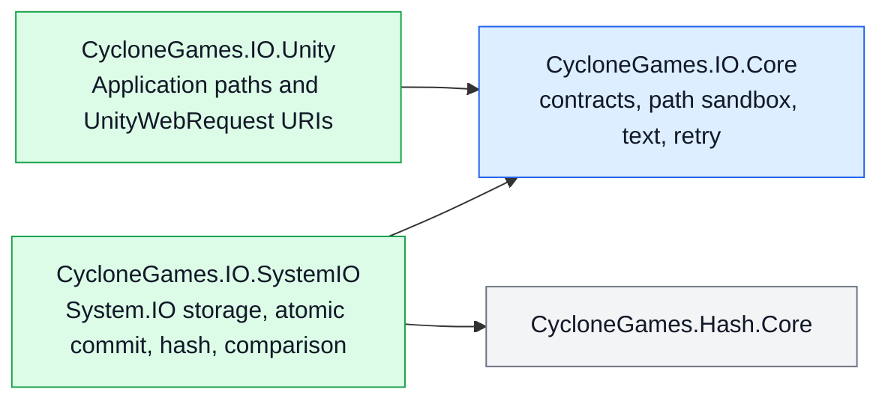

# CycloneGames.IO

[English | 简体中文](README.SCH.md)

CycloneGames.IO is the canonical file-I/O foundation for CycloneGames modules. It provides bounded whole-file reads, streaming transfer, strict atomic commits, exact comparison, hashing, portable path sandboxing, deterministic text decoding, explicit retry policy, and Unity file-URI construction. Allocation limits, failure semantics, ownership, platform boundaries, and corruption behavior are visible in the API.

## Table of Contents

- [Overview](#overview)
- [Architecture](#architecture)
- [Quick Start](#quick-start)
- [Core Concepts](#core-concepts)
- [Usage Guide](#usage-guide)
- [Advanced Topics](#advanced-topics)
- [Common Scenarios](#common-scenarios)
- [Performance and Memory](#performance-and-memory)
- [Troubleshooting](#troubleshooting)

## Overview

The package exposes a small set of capability contracts (`IFileStore`, `IAtomicFileStore`, `IStreamFileStore`) and one default System.IO implementation (`SystemFileStore`). Every whole-file read requires an explicit allocation ceiling. Every atomic commit goes through a same-directory temporary file followed by `File.Move` or `File.Replace`, never a delete-then-move. Comparison checks length and bytes exactly; hashes are never accepted as equality proof. Path sandboxing, text decoding, retry, and Unity URI construction are each isolated contracts so callers compose only what they need.

The package does not log, hide exceptions, own application policy, or depend on a DI container. Save-game schemas, cloud synchronization, compression, encryption key management, virtual filesystems, content-addressable storage, and application logging belong in layers built on top of the storage contracts.

Argument and contract violations throw `ArgumentException`, `ArgumentOutOfRangeException`, or `ArgumentNullException`. Filesystem and platform failures remain visible as their corresponding exceptions. Atomic replacement support failures throw `PlatformNotSupportedException`. Cancellation throws `OperationCanceledException`. The package never converts errors into `false`, `null`, empty content, or log-only failures, except for explicitly named `Try...` APIs.

### Key Features

- **Bounded reads** with an explicit maximum for every whole-file operation.
- **Atomic commits** through same-directory temporary file plus `File.Move`/`File.Replace`; never delete-then-move.
- **Streaming transfer** with cooperative chunk-level cancellation and caller-owned streams.
- **Exact comparison** via `FileComparer` / `BinaryContentComparer`; hashes are not equality proof.
- **Hashing** via `FileHasher` / `ContentHasher` (MD5, SHA-256, xxHash64) with canonical lowercase hexadecimal output.
- **Portable path sandbox** via `FilePathSandbox` rejecting rooted input, dot segments, control characters, Windows device names, and existing reparse points.
- **Strict text decoding** via `TextCodec` with BOM awareness and one explicit fallback encoding.
- **Explicit retry** via `FileRetry` / `FileRetryPolicy` for idempotent operations with understood transient classification.
- **Unity file URIs** via `UnityFileUri` for `UnityWebRequest` across StreamingAssets, PersistentData, and absolute paths.

## Architecture



| Assembly | Purpose |
| --- | --- |
| `CycloneGames.IO.Core` | Pure C# contracts, path sandbox, text codec, retry policy. No Unity or logging dependency. |
| `CycloneGames.IO.SystemIO` | Pure C# System.IO implementation: `SystemFileStore`, atomic commit, hashing, comparison. |
| `CycloneGames.IO.Unity` | Unity path adaptation and `UnityWebRequest` URI construction. |
| `CycloneGames.IO.Editor` | Hardware-local benchmark window. |
| `CycloneGames.IO.Tests.Core` / `.SystemIO` / `.Unity` | EditMode contract and integration tests. |
| `CycloneGames.IO.Tests.Performance` | Timing and GC samples without hardware-dependent thresholds. |

| Directory | Responsibility |
| --- | --- |
| `Core/Storage/` | Capability contracts and transfer progress. |
| `Core/Paths/` | Portable relative-path validation and sandbox resolution. |
| `Core/Text/` | Strict deterministic text decoding. |
| `Core/Retry/` | Explicit bounded retry policy. |
| `Runtime/SystemIO/Storage/` | `SystemFileStore`, options, copy behavior, buffer policy. |
| `Runtime/SystemIO/Atomic/` | Same-directory temporary-file transaction and commit operations. |
| `Runtime/SystemIO/Hashing/` | File/content hashing and canonical lowercase hexadecimal output. |
| `Runtime/SystemIO/Comparison/` | Exact byte and file comparison. |
| `Runtime/Unity/` | Unity file locations and `UnityWebRequest` URI construction. |

Core and SystemIO public APIs use the `CycloneGames.IO` namespace. Unity-specific APIs use `CycloneGames.IO.Unity`. Async file APIs return `Task` because they define a portable BCL boundary — Unity consumers can await them from `UniTask` workflows without moving Unity types into the core contract.

## Quick Start

Add an asmdef reference to `CycloneGames.IO.SystemIO` (and `CycloneGames.IO.Unity` for Unity path support), then import the namespace:

```csharp
using CycloneGames.IO;
```

### Write a settings file atomically

```csharp
SystemFileStore.Default.WriteTextAtomically(savePath, json);
```

If the write fails or is cancelled, the previous destination is preserved.

### Read a bounded manifest

```csharp
const int MAX_MANIFEST_BYTES = 4 * 1024 * 1024;

byte[] bytes = await SystemFileStore.Default.ReadBytesAsync(
    manifestPath,
    MAX_MANIFEST_BYTES,
    cancellationToken);
```

The store validates file length before allocation, reads exactly that length, and rejects truncation or growth observed during the read.

### Resolve a sandboxed content path

```csharp
var sandbox = new FilePathSandbox(contentRoot);
string filePath = sandbox.Resolve(manifestEntry.Location);
```

`FilePathSandbox` rejects rooted input, dot segments, empty segments, control characters, non-portable filename characters, trailing dots/spaces, and Windows device names.

## Core Concepts

### Capability contracts

The package separates storage capabilities into three contracts so callers depend on the narrowest one:

| Contract | Purpose |
| --- | --- |
| `IFileStore` | Byte-oriented capability with an explicit maximum for every whole-file read. |
| `IAtomicFileStore` | Atomic byte and stream commit capability. |
| `IStreamFileStore` | Caller-owned stream capability. |

`SystemFileStore` implements all three. `SystemFileStoreOptions` is an immutable buffer-size and pooled-buffer clearing policy. `FileTransferProgress` reports processed bytes, known/unknown total, and ratio.

### Atomic commit semantics

Atomic writes are designed for settings, manifests, journals, checkpoints, and any file whose partial replacement is unacceptable:

```csharp
SystemFileStore.Default.WriteTextAtomically(savePath, json);

await SystemFileStore.Default.WriteBytesAtomicallyAsync(
    cacheIndexPath,
    indexBytes,
    cancellationToken);
```

Commit behavior is deliberately strict:

1. A uniquely named temporary file is created in the destination directory.
2. Content is written, then flushed with `FileStream.Flush(true)` where supported.
3. A new destination is committed with `File.Move`.
4. An existing destination is committed with `File.Replace`.
5. Unsupported replacement fails closed — the implementation never deletes the destination and then moves the temporary file.
6. Failed or cancelled operations attempt to remove their temporary file and preserve the previous destination.

The operation is atomic, but business ordering remains caller-owned. With concurrent writers, each committed file is complete and the last successful operating-system commit wins. Use a higher-level revision, compare-and-swap policy, or owner queue when ordering matters.

`Flush(true)` improves file-content durability, but no portable managed API can guarantee directory-entry persistence across every filesystem, device controller, console SDK, mobile OS, or sudden power-loss model. Critical products should validate their target filesystem and platform recovery policy.

### Bounded reads

Every whole-file read requires an allocation ceiling. The store validates file length before allocation, reads exactly that length, and rejects truncation or growth observed during the read. Large or untrusted content should use streams instead of increasing the bound without analysis.

### Streaming and cancellation

Returned streams are owned and disposed by the caller. `CreateWrite` always creates or fully truncates a file. `OpenAppend` preserves existing content, appends only, permits concurrent readers, and rejects other writers. These methods are intentionally explicit so a caller cannot confuse overwrite and append semantics.

Cancellation is cooperative at buffer boundaries. On Unity 2022 and Windows, the implementation intentionally checks the token between chunks while passing `CancellationToken.None` into operating-system `FileStream` calls. This avoids a reproducible runtime deadlock while retaining bounded cancellation latency.

For atomic operations, cancellation is honored until the commit phase starts. Once the destination commit begins, it runs to completion and reports its real result. A progress callback exception aborts before commit; no callback is invoked after a successful commit.

### Path sandbox

`FilePathSandbox` resolves validated portable relative paths under one trusted root. It rejects rooted input, dot segments, empty segments, control characters, non-portable filename characters, trailing dots/spaces, and Windows device names. The default `FileLinkPolicy.RejectExistingLinks` also rejects existing reparse-point/link segments.

Lexical checks and existing-link inspection cannot close a time-of-check/time-of-use race against a hostile process that can mutate the filesystem concurrently. A hostile local-filesystem security boundary requires platform-specific handle-relative APIs and directory-handle ownership above this package.

### Text decoding

`TextCodec` recognizes UTF-8, UTF-16 LE/BE, and UTF-32 LE/BE byte-order marks. BOM-less content uses exactly the caller-selected fallback encoding, which defaults to strict UTF-8 without BOM. It does not guess UTF-16/UTF-32 from zero-byte patterns and does not silently replace malformed input.

```csharp
string text = TextCodec.Decode(downloadHandler.data);
byte[] utf8 = TextCodec.Encode(text);

if (!TextCodec.TryDecode(bytes, out string optionalText))
{
    // Handle malformed UTF-8 explicitly.
}
```

## Usage Guide

### Atomic streaming from a large source

For a large or generated source, stream directly into the atomic transaction:

```csharp
using (Stream source = files.OpenRead(sourcePath))
{
    await files.WriteStreamAtomicallyAsync(
        destinationPath,
        source,
        progress,
        cancellationToken);
}
```

The source stream is caller-owned; the atomic transaction owns the temporary file and the commit.

### Exact comparison and atomic copy

```csharp
bool equal = await FileComparer.AreEqualAsync(
    firstPath,
    secondPath,
    progress,
    cancellationToken);

FileCopyResult result = await SystemFileStore.Default.CopyAtomicallyAsync(
    sourcePath,
    destinationPath,
    FileCopyBehavior.SkipIfIdentical,
    progress,
    cancellationToken);
```

Comparison checks length and bytes exactly. `SkipIfIdentical` avoids replacing an unchanged destination; otherwise the copy is streamed into an atomic transaction.

### Hashing

```csharp
string sha256 = await FileHasher.ComputeHexAsync(
    filePath,
    FileHashAlgorithm.Sha256,
    progress,
    cancellationToken);

Span<byte> hash = stackalloc byte[ContentHasher.GetHashSize(FileHashAlgorithm.XxHash64)];
ContentHasher.WriteHash(content, FileHashAlgorithm.XxHash64, hash);
```

- Use SHA-256 for content-integrity and trust workflows.
- xxHash64 is fast and stable but is not cryptographic.
- MD5 is available only for interoperability with existing external formats; do not use it as a security primitive.
- Hash comparison does not replace exact equality when correctness requires proof that all bytes match.

### UnityWebRequest URIs

```csharp
using CycloneGames.IO.Unity;

string defaultUri = UnityFileUri.Create(
    "Config/input.yaml",
    UnityFileLocation.StreamingAssets);

if (!UnityFileUri.TryCreate(
        "Settings/user.yaml",
        UnityFileLocation.PersistentData,
        out string userUri,
        out UnityFileUriError error))
{
    // Convert the typed error into product-specific diagnostics.
}
```

`StreamingAssets` and `PersistentData` accept validated relative paths. `AbsolutePathOrUri` accepts an absolute file path or an `http`, `https`, `file`, or `jar` URI. The package does not log failures.

### Retry

Retry is never automatic. Wrap only an idempotent operation whose transient classification is understood:

```csharp
var policy = new FileRetryPolicy(
    maxAttempts: 4,
    initialDelay: TimeSpan.FromMilliseconds(20),
    backoffMultiplier: 2.0,
    maxDelay: TimeSpan.FromMilliseconds(500));

await FileRetry.ExecuteAsync(
    () => SystemFileStore.Default.WriteBytesAtomicallyAsync(path, bytes),
    policy,
    cancellationToken);
```

The default classifier retries Windows sharing and lock violations only. It does not retry permission errors, invalid paths, disk-full failures, corruption, unsupported atomic replacement, or arbitrary `IOException` values.

## Advanced Topics

### Same-destination commit coordination

Commits to the same normalized destination are serialized inside the process to avoid Windows `File.Replace` contention. Unrelated destinations remain fully parallel, and the coordination entry is removed after the final holder exits. Cross-process contention remains visible as an I/O failure and can be wrapped in an explicit `FileRetry` policy when the operation is idempotent.

There is no global I/O lock, hidden scheduler, automatic retry loop, logger, service locator, or mutable global configuration.

### Buffer pooling and clearing

The default transfer buffer is 64 KiB and can be configured from 4 KiB to 1 MiB via `SystemFileStoreOptions`. Streaming, hashing, comparison, and atomic stream copy rent buffers from `ArrayPool<byte>.Shared`.

| `PooledBufferClearMode` | Behavior |
| --- | --- |
| `UsedRegion` (default) | Clears every written byte before returning the buffer. |
| `EntireBuffer` | Clears the entire rented array for stronger isolation at higher CPU cost. |
| `None` | Appropriate only when buffer contents are non-sensitive and maximum throughput is required. |

Text convenience methods clear their temporary encoded/decoded byte arrays, and failed or cancelled bounded reads clear their partially filled allocation before releasing it to the GC. Direct write methods may leave a partial destination if they fail or are cancelled — use atomic methods when partial state is unacceptable.

### Progress callbacks

Progress callbacks run on the continuation context of the async operation; marshal to the Unity main thread before touching Unity objects. A callback exception aborts before commit; no callback is invoked after a successful commit.

### Editor benchmark

Use `Window > CycloneGames > IO Benchmark` for exploratory measurements on the current machine. Performance tests record timing and GC samples without fixed hardware-dependent throughput thresholds.

## Common Scenarios

### Save-file persistence with crash recovery

A save system needs to guarantee that a crashed write never leaves a partial save file:

```csharp
public async Task SaveAsync(string savePath, SaveData data, CancellationToken ct)
{
    string json = Serialize(data);
    await SystemFileStore.Default.WriteBytesAtomicallyAsync(
        savePath,
        Encoding.UTF8.GetBytes(json),
        ct);
}
```

If the process is killed mid-write, the previous save file remains intact. A stale `.cyclone-*.tmp` file may remain in the destination directory; it can be removed only when no transaction is active.

### Streaming a large download to disk

A download handler streams a large asset directly to a cache file without buffering the entire payload in memory:

```csharp
using (Stream downloadStream = await OpenDownloadStreamAsync(url, ct))
{
    await SystemFileStore.Default.WriteStreamAtomicallyAsync(
        cachePath,
        downloadStream,
        progress: new Progress<FileTransferProgress>(p => ReportProgress(p.Ratio)),
        cancellationToken: ct);
}
```

The atomic transaction owns the temporary file; the download stream is caller-owned and disposed by the `using`.

### Verifying asset integrity with SHA-256

A build pipeline verifies that a downloaded asset matches an expected hash before installing it:

```csharp
string actualHash = await FileHasher.ComputeHexAsync(
    downloadedPath,
    FileHashAlgorithm.Sha256,
    progress: null,
    cancellationToken: ct);

if (!string.Equals(actualHash, expectedSha256, StringComparison.OrdinalIgnoreCase))
{
    File.Delete(downloadedPath);
    throw new InvalidOperationException("Asset hash mismatch.");
}
```

Use SHA-256 for content-integrity and trust workflows. xxHash64 is appropriate for non-cryptographic cache keys.

### Reading configuration from StreamingAssets on Android

Android StreamingAssets are packed into an APK and must be accessed through `UnityWebRequest`, not `File.OpenRead`:

```csharp
string uri = UnityFileUri.Create("Config/settings.json", UnityFileLocation.StreamingAssets);

using (UnityWebRequest request = UnityWebRequest.Get(uri))
{
    request.downloadHandler = new DownloadHandlerBuffer();
    await request.SendWebRequest();

    if (request.result != UnityWebRequest.Result.Success)
    {
        throw new IOException($"Failed to load config: {request.error}");
    }

    string text = TextCodec.Decode(request.downloadHandler.data);
    Settings settings = ParseSettings(text);
}
```

`TextCodec.Decode` handles BOM-aware decoding without guessing. For persistent files (not in the APK), use `UnityFileLocation.PersistentData` and read them directly with `SystemFileStore`.

### Sandboxed mod loading

A mod loader must not allow mod-provided paths to escape the mod content root:

```csharp
var modSandbox = new FilePathSandbox(modContentRoot);

foreach (ModManifestEntry entry in manifest.Assets)
{
    string resolvedPath = modSandbox.Resolve(entry.Location);
    // resolvedPath is guaranteed to be inside modContentRoot.
    byte[] assetBytes = await SystemFileStore.Default.ReadBytesAsync(
        resolvedPath,
        maxBytes: 64 * 1024 * 1024,
        cancellationToken: ct);
    LoadAsset(entry.Name, assetBytes);
}
```

`FilePathSandbox` rejects path traversal attempts, rooted paths, and (with `RejectExistingLinks`) reparse points that could redirect outside the trusted root.

## Performance and Memory

- Default transfer buffer is 64 KiB, configurable from 4 KiB to 1 MiB.
- Streaming, hashing, comparison, and atomic stream copy rent buffers from `ArrayPool<byte>.Shared`.
- `PooledBufferClearMode.UsedRegion` is the default; `EntireBuffer` is stronger isolation at higher CPU cost; `None` is for non-sensitive content with maximum throughput.
- Text convenience methods clear temporary encoded/decoded byte arrays.
- Failed or cancelled bounded reads clear their partially filled allocation before releasing it to the GC.
- Direct write methods may leave a partial destination if they fail or are cancelled — use atomic methods when partial state is unacceptable.
- Same-destination commit coordination is narrow and self-removing; no global I/O lock, hidden scheduler, or automatic retry loop.
- Progress callbacks run on the continuation context; marshal to the Unity main thread before touching Unity objects.

### Platform behavior

| Platform | Notes |
| --- | --- |
| Windows Editor/Player | Exact case-insensitive path containment, Windows sharing semantics, `File.Replace` for existing destinations. Cooperative chunk cancellation avoids the Unity 2022 `FileStream` cancellation deadlock. |
| macOS/Linux Editor/Player | Case-sensitive containment. Filesystem mount options determine atomic replace and durability behavior. |
| Android | Packaged StreamingAssets addressed through `UnityWebRequest` URI paths; persistent files use the application sandbox. |
| iOS/tvOS | Persistent paths are application-owned and may participate in OS backup policy; products must classify files for backup/exclusion. |
| WebGL | StreamingAssets use URI access. System.IO persistence, quotas, synchronization, and durability depend on Unity/Emscripten filesystem configuration. |
| Consoles | File permissions, quotas, mount lifecycle, certification rules, and atomic replace support must be verified with the target SDK and hardware. |
| Headless/CLI | Core and SystemIO assemblies do not require `UnityEngine` and can be composed in server or tool processes. |

### Persistence inventory

The runtime package creates no file until called and owns no implicit persistent state.

| Data | Location | Owner | Cleanup |
| --- | --- | --- | --- |
| Caller content | Caller-provided path | Calling product/module | Caller defines schema, retention, backup, migration, and recovery |
| Atomic temporary file | Destination directory | One atomic transaction | Removed after failure/cancellation when possible; stale files matching `.cyclone-*.tmp` can be removed only when no transaction is active |
| Benchmark data | `Application.temporaryCachePath/CycloneGames.IO.Benchmark/<run-id>/` | Editor benchmark window | Deleted after each run; safe to delete while the benchmark is not running |

The package does not use `PlayerPrefs`, `EditorPrefs`, `SessionState`, registry, plist, or hidden configuration files.

## Troubleshooting

| Symptom | Likely cause | Resolution |
| --- | --- | --- |
| `ReadBytesAsync` throws on a valid file | File grew between length check and read | Retry the read; for untrusted sources, use streaming instead of a large bound |
| Atomic write leaves a `.cyclone-*.tmp` file | Previous transaction was interrupted | Remove the stale temp file only when no transaction is active |
| `PlatformNotSupportedException` on atomic replace | Target filesystem does not support `File.Replace` | Verify the target platform; fall back to non-atomic write only if partial state is acceptable |
| `FileRetry` does not retry an `IOException` | Default classifier only retries Windows sharing/lock violations | Confirm the failure is transient; do not broaden the classifier without understanding idempotency |
| `UnityFileUri.TryCreate` returns `false` | Path is rooted, contains dot segments, or uses an unsupported scheme | Use a validated relative path for `StreamingAssets`/`PersistentData`; use `AbsolutePathOrUri` for absolute paths or `http`/`https`/`file`/`jar` URIs |
| `TextCodec.TryDecode` returns `false` | Malformed UTF-8 in BOM-less content | Provide an explicit fallback encoding, or reject the input as corrupt |
| `FileComparer.AreEqualAsync` returns `false` for identical content | Files differ in length or bytes | Compare lengths first; if equal, compare bytes — do not trust hash comparison alone for equality proof |
| Cancellation does not abort an atomic commit | Commit phase already started | Expected; the commit runs to completion and reports its real result |
| WebGL persistence behaves inconsistently | System.IO persistence depends on Unity/Emscripten filesystem configuration | Use IndexedDB-backed persistence above `IFileStore`; validate target browser behavior |
| Cross-process atomic write fails | `File.Replace` contention across processes | Wrap the idempotent operation in `FileRetry`; coordinate writers with an external lock if ordering matters |
| Progress callback touches Unity objects from a worker thread | Callback runs on the async continuation context | Marshal to the Unity main thread before touching Unity objects |

## Validation

Automated EditMode suites cover strict text decoding and BOM behavior, portable sandbox validation and containment, retry classification and attempt limits, bounded reads and exact hashing, strict atomic replacement and deterministic injected replacement failures, concurrent atomic writers without mixed-content commits, mid-copy cancellation preserving the previous destination and cleaning temporary files, exact comparison and skip-if-identical copy, Unity URI traversal, scheme, and location behavior, and 4 MiB exact comparison, SHA-256, and xxHash64 performance samples.

Run the test assemblies:

```text
<UnityEditor> -batchmode -nographics -projectPath <repo-root>/UnityStarter -runTests -testPlatform EditMode -assemblyNames CycloneGames.IO.Tests.Core;CycloneGames.IO.Tests.SystemIO;CycloneGames.IO.Tests.Unity -testResults <result-path> -quit
```

Minimum Unity verification:

1. Allow script compilation and confirm that the Console has no errors.
2. Run EditMode tests for `CycloneGames.IO.Tests.Core`, `CycloneGames.IO.Tests.SystemIO`, and `CycloneGames.IO.Tests.Unity`.
3. Run `CycloneGames.IO.Tests.Performance` when the performance-test package is available.
4. Validate Android/WebGL StreamingAssets URI behavior in a Player build.
5. Validate atomic replacement, quota behavior, and sudden-termination recovery on each shipping platform and target filesystem.
