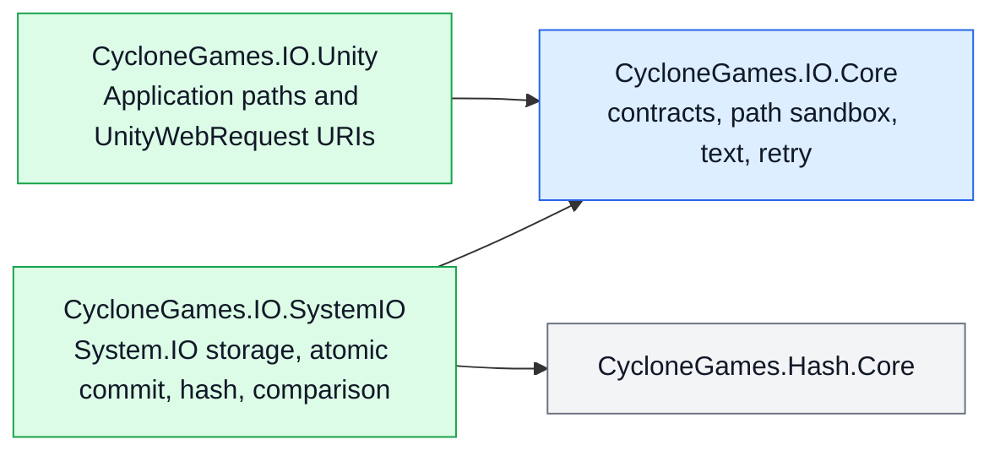

# CycloneGames.IO

CycloneGames.IO is the canonical file-I/O foundation for CycloneGames modules. It provides bounded whole-file reads, streaming transfer, strict atomic commits, exact comparison, hashing, portable path sandboxing, deterministic text decoding, explicit retry policy, and Unity file-URI construction.

The package is designed for long-lived commercial projects where allocation limits, failure semantics, ownership, platform boundaries, and corruption behavior must be visible in the API. It does not log, hide exceptions, own application policy, or depend on a DI container.

## Scope and design

The package has three assemblies with one-way dependencies:



- `CycloneGames.IO.Core` is pure C# and has no Unity or logging dependency.
- `CycloneGames.IO.SystemIO` is pure C# and owns operating-system file behavior.
- `CycloneGames.IO.Unity` contains only Unity path and URI adaptation.
- Public Core and SystemIO APIs use the `CycloneGames.IO` namespace. Unity-specific APIs use `CycloneGames.IO.Unity`.
- Async file APIs return `Task` because they define a portable BCL boundary. Unity consumers can await them from `UniTask` workflows without moving Unity types into the core contract.

This package does not provide save-game schemas, cloud synchronization, compression, encryption key management, virtual filesystems, content-addressable storage, or application logging. Build those policies above `IFileStore`, `IAtomicFileStore`, and `IStreamFileStore`.

## Directory layout

| Directory | Responsibility |
| --- | --- |
| `Core/Storage/` | Capability contracts and transfer progress. |
| `Core/Paths/` | Portable relative-path validation and sandbox resolution. |
| `Core/Text/` | Strict deterministic text decoding. |
| `Core/Retry/` | Explicit bounded retry policy. |
| `Runtime/SystemIO/Storage/` | `SystemFileStore`, options, copy behavior, and buffer policy. |
| `Runtime/SystemIO/Atomic/` | Same-directory temporary-file transaction and commit operations. |
| `Runtime/SystemIO/Hashing/` | File/content hashing and canonical lowercase hexadecimal output. |
| `Runtime/SystemIO/Comparison/` | Exact byte and file comparison. |
| `Runtime/Unity/` | Unity file locations and UnityWebRequest URI construction. |
| `Editor/` | Hardware-local benchmark window. |
| `Tests/` | Core, SystemIO, Unity, and performance test assemblies. |

## Core types

| Type | Purpose |
| --- | --- |
| `SystemFileStore` | Default System.IO implementation for bounded reads, direct writes, streams, atomic writes, and atomic copy. |
| `IFileStore` | Byte-oriented capability with an explicit maximum for every whole-file read. |
| `IAtomicFileStore` | Atomic byte and stream commit capability. |
| `IStreamFileStore` | Caller-owned stream capability. |
| `SystemFileStoreOptions` | Immutable buffer size and pooled-buffer clearing policy. |
| `FileTransferProgress` | Processed bytes, known/unknown total, and ratio. |
| `FileComparer` / `BinaryContentComparer` | Exact equality; hashes are never accepted as equality proof. |
| `FileHasher` / `ContentHasher` | MD5, SHA-256, and xxHash64 computation. |
| `FilePathSandbox` | Resolves validated portable relative paths under one trusted root. |
| `TextCodec` | Strict BOM-aware decoding with one explicit fallback encoding. |
| `FileRetry` / `FileRetryPolicy` | Opt-in bounded retry for explicitly classified transient I/O failures. |
| `UnityFileUri` | Creates typed, platform-correct URIs for UnityWebRequest. |

## Common workflows

### Atomic persistence

Use atomic writes for settings, manifests, journals, checkpoints, and any file whose partial replacement is unacceptable:

```csharp
using CycloneGames.IO;

SystemFileStore.Default.WriteTextAtomically(savePath, json);

await SystemFileStore.Default.WriteBytesAtomicallyAsync(
    cacheIndexPath,
    indexBytes,
    cancellationToken);
```

For a large or generated source, stream directly into the atomic transaction:

```csharp
await SystemFileStore.Default.WriteStreamAtomicallyAsync(
    destinationPath,
    sourceStream,
    progress,
    cancellationToken);
```

Atomic commit behavior is deliberately strict:

1. A uniquely named temporary file is created in the destination directory.
2. Content is written, then flushed with `FileStream.Flush(true)` where supported.
3. A new destination is committed with `File.Move`.
4. An existing destination is committed with `File.Replace`.
5. Unsupported replacement fails closed. The implementation never deletes the destination and then moves the temporary file.
6. Failed or cancelled operations attempt to remove their temporary file and preserve the previous destination.

The operation is atomic, but business ordering remains caller-owned. With concurrent writers, each committed file is complete and the last successful operating-system commit wins. Use a higher-level revision, compare-and-swap policy, or owner queue when ordering matters.

Commits to the same normalized destination are serialized inside the process to avoid Windows `File.Replace` contention. Unrelated destinations remain fully parallel, and the coordination entry is removed after the final holder exits. Cross-process contention remains visible as an I/O failure and can be wrapped in an explicit `FileRetry` policy when the operation is idempotent.

`Flush(true)` improves file-content durability, but no portable managed API can guarantee directory-entry persistence across every filesystem, device controller, console SDK, mobile OS, or sudden power-loss model. Critical products should validate their target filesystem and platform recovery policy.

### Bounded reads

Every whole-file read requires an allocation ceiling:

```csharp
const int MAX_MANIFEST_BYTES = 4 * 1024 * 1024;

byte[] bytes = await SystemFileStore.Default.ReadBytesAsync(
    manifestPath,
    MAX_MANIFEST_BYTES,
    cancellationToken);

string text = SystemFileStore.Default.ReadText(
    settingsPath,
    MAX_MANIFEST_BYTES);
```

The store validates file length before allocation, reads exactly that length, and rejects truncation or growth observed during the read. Large or untrusted content should use streams instead of increasing the bound without analysis.

### Streaming

Returned streams are owned and disposed by the caller:

```csharp
using (Stream source = files.OpenRead(sourcePath))
{
    await files.WriteStreamAtomicallyAsync(
        destinationPath,
        source,
        progress,
        cancellationToken);
}
```

`CreateWrite` always creates or fully truncates a file. `OpenAppend` preserves existing content, appends only, permits concurrent readers, and rejects other writers. These methods are intentionally explicit so a caller cannot confuse overwrite and append semantics.

Cancellation is cooperative at buffer boundaries. On Unity 2022 and Windows, the implementation intentionally checks the token between chunks while passing `CancellationToken.None` into operating-system `FileStream` calls. This avoids a reproducible runtime deadlock while retaining bounded cancellation latency.

For atomic operations, cancellation is honored until the commit phase starts. Once the destination commit begins, it runs to completion and reports its real result. A progress callback exception aborts before commit; no callback is invoked after a successful commit.

### Exact comparison and atomic copy

```csharp
bool equal = await FileComparer.AreEqualAsync(
    firstPath,
    secondPath,
    progress,
    cancellationToken);

FileCopyResult result = await SystemFileStore.Default.CopyAtomicallyAsync(
    sourcePath,
    destinationPath,
    FileCopyBehavior.SkipIfIdentical,
    progress,
    cancellationToken);
```

Comparison checks length and bytes exactly. `SkipIfIdentical` avoids replacing an unchanged destination; otherwise the copy is streamed into an atomic transaction.

### Hashing

```csharp
string sha256 = await FileHasher.ComputeHexAsync(
    filePath,
    FileHashAlgorithm.Sha256,
    progress,
    cancellationToken);

Span<byte> hash = stackalloc byte[ContentHasher.GetHashSize(FileHashAlgorithm.XxHash64)];
ContentHasher.WriteHash(content, FileHashAlgorithm.XxHash64, hash);
```

- Use SHA-256 for content-integrity and trust workflows.
- xxHash64 is fast and stable but is not cryptographic.
- MD5 is available only for interoperability with existing external formats; do not use it as a security primitive.
- Hash comparison does not replace exact equality when correctness requires proof that all bytes match.

### Sandboxed paths

Never combine untrusted manifest, server, mod, archive, or user-provided relative paths with `Path.Combine` alone:

```csharp
var sandbox = new FilePathSandbox(contentRoot);
string filePath = sandbox.Resolve(manifestEntry.Location);
```

`FilePathSandbox` rejects rooted input, dot segments, empty segments, control characters, non-portable filename characters, trailing dots/spaces, and Windows device names. The default `FileLinkPolicy.RejectExistingLinks` also rejects existing reparse-point/link segments.

Lexical checks and existing-link inspection cannot close a time-of-check/time-of-use race against a hostile process that can mutate the filesystem concurrently. A hostile local-filesystem security boundary requires platform-specific handle-relative APIs and directory-handle ownership above this package.

### Text encoding

`TextCodec` recognizes UTF-8, UTF-16 LE/BE, and UTF-32 LE/BE byte-order marks. BOM-less content uses exactly the caller-selected fallback encoding, which defaults to strict UTF-8 without BOM. It does not guess UTF-16/UTF-32 from zero-byte patterns and does not silently replace malformed input.

```csharp
string text = TextCodec.Decode(downloadHandler.data);
byte[] utf8 = TextCodec.Encode(text);

if (!TextCodec.TryDecode(bytes, out string optionalText))
{
    // Handle malformed UTF-8 explicitly.
}
```

### UnityWebRequest URIs

```csharp
using CycloneGames.IO.Unity;

string defaultUri = UnityFileUri.Create(
    "Config/input.yaml",
    UnityFileLocation.StreamingAssets);

if (!UnityFileUri.TryCreate(
        "Settings/user.yaml",
        UnityFileLocation.PersistentData,
        out string userUri,
        out UnityFileUriError error))
{
    // Convert the typed error into product-specific diagnostics.
}
```

`StreamingAssets` and `PersistentData` accept validated relative paths. `AbsolutePathOrUri` accepts an absolute file path or an `http`, `https`, `file`, or `jar` URI. The package does not log failures.

### Retry

Retry is never automatic. Wrap only an idempotent operation whose transient classification is understood:

```csharp
var policy = new FileRetryPolicy(
    maxAttempts: 4,
    initialDelay: TimeSpan.FromMilliseconds(20),
    backoffMultiplier: 2.0,
    maxDelay: TimeSpan.FromMilliseconds(500));

await FileRetry.ExecuteAsync(
    () => SystemFileStore.Default.WriteBytesAtomicallyAsync(path, bytes),
    policy,
    cancellationToken);
```

The default classifier retries Windows sharing and lock violations only. It does not retry permission errors, invalid paths, disk-full failures, corruption, unsupported atomic replacement, or arbitrary `IOException` values.

## Memory, performance, and ownership

- The default transfer buffer is 64 KiB and can be configured from 4 KiB to 1 MiB.
- Streaming, hashing, comparison, and atomic stream copy rent buffers from `ArrayPool<byte>.Shared`.
- `PooledBufferClearMode.UsedRegion` is the default and clears every written byte before returning the buffer.
- `EntireBuffer` clears the entire rented array for stronger isolation at higher CPU cost.
- `None` is appropriate only when buffer contents are non-sensitive and maximum throughput is required.
- Text convenience methods clear their temporary encoded/decoded byte arrays, and failed or cancelled bounded reads clear their partially filled allocation before releasing it to the GC.
- Direct write methods may leave a partial destination if they fail or are cancelled. Use atomic methods when partial state is unacceptable.
- Same-destination commit coordination is narrow and self-removing; there is no global I/O lock, hidden scheduler, automatic retry loop, logger, service locator, or mutable global configuration.
- Progress callbacks run on the continuation context of the async operation; marshal to the Unity main thread before touching Unity objects.

Use `Window > CycloneGames > IO Benchmark` for exploratory measurements on the current machine. Performance tests record timing and GC samples without fixed hardware-dependent throughput thresholds.

## Failure model

Argument and contract violations throw `ArgumentException`, `ArgumentOutOfRangeException`, or `ArgumentNullException`. Filesystem and platform failures remain visible as their corresponding exceptions. Atomic replacement support failures throw `PlatformNotSupportedException`. Cancellation throws `OperationCanceledException`.

The package never converts errors into `false`, `null`, empty content, or log-only failures, except for explicitly named `Try...` APIs. This keeps recovery, telemetry, redaction, and user messaging in the owning product layer.

## Platform notes

| Platform | Notes |
| --- | --- |
| Windows Editor/Player | Uses exact case-insensitive path containment, Windows sharing semantics, and `File.Replace` for existing destinations. Cooperative chunk cancellation avoids the Unity 2022 FileStream cancellation deadlock. |
| macOS/Linux Editor/Player | Uses case-sensitive containment. Filesystem mount options determine atomic replace and durability behavior. |
| Android | Packaged StreamingAssets are addressed through UnityWebRequest URI paths; persistent files use the application sandbox. |
| iOS/tvOS | Persistent paths are application-owned and may participate in OS backup policy; products must classify files for backup/exclusion. |
| WebGL | StreamingAssets use URI access. System.IO persistence, quotas, synchronization, and durability depend on Unity/Emscripten filesystem configuration. |
| Consoles | File permissions, quotas, mount lifecycle, certification rules, and atomic replace support must be verified with the target SDK and hardware. |
| Headless/CLI | Core and SystemIO assemblies do not require UnityEngine and can be composed in server or tool processes. |

## Persistence inventory

The runtime package creates no file until called and owns no implicit persistent state.

| Data | Location | Format | Owner | Git | Cleanup and migration |
| --- | --- | --- | --- | --- | --- |
| Caller content | Caller-provided path | Caller-defined | Calling product/module | Caller-defined | Caller defines schema, retention, backup, migration, and recovery. |
| Atomic temporary file | Destination directory | Raw in-progress content | One atomic transaction | No | Removed after failure/cancellation when possible; stale files matching `.cyclone-*.tmp` can be removed only when no transaction is active. |
| Benchmark data | `Application.temporaryCachePath/CycloneGames.IO.Benchmark/<run-id>/` | Generated binary files | Editor benchmark window | No | Deleted after each run; safe to delete while the benchmark is not running. |

The package does not use `PlayerPrefs`, `EditorPrefs`, `SessionState`, registry, plist, or hidden configuration files.

## API replacement

This refactor is intentionally breaking and provides one implementation path. No compatibility assembly or forwarding facade remains.

| Removed API shape | Canonical API |
| --- | --- |
| Static all-purpose file facade | `SystemFileStore`, `FileHasher`, `FileComparer`, `BinaryContentComparer`, and `TextCodec` by responsibility. |
| Service/backend naming | Capability contracts `IFileStore`, `IAtomicFileStore`, and `IStreamFileStore`. |
| Runtime namespace and assembly | `CycloneGames.IO` in `CycloneGames.IO.Core` / `CycloneGames.IO.SystemIO`; Unity types in `CycloneGames.IO.Unity`. |
| Hash-parameter equality methods | Exact comparison methods without a hash parameter. |
| Implicit unbounded whole-file reads | `ReadBytes` / `ReadText` with a required maximum byte count. |
| Static path-security helpers | Immutable `FilePathSandbox` rooted at construction. |
| Logging URI helper | `UnityFileUri.Create` or typed `TryCreate`. |

Consumers must update asmdef references to the smallest required assembly. Serialized Unity types were not part of the removed API, so no serialized asset migration is required.

## Validation

Automated EditMode suites cover:

- strict text decoding and BOM behavior;
- portable sandbox validation and containment;
- retry classification and attempt limits;
- bounded reads and exact hashing;
- strict atomic replacement and deterministic injected replacement failures;
- concurrent atomic writers without mixed-content commits;
- mid-copy cancellation preserving the previous destination and cleaning temporary files;
- exact comparison and skip-if-identical copy;
- Unity URI traversal, scheme, and location behavior;
- 4 MiB exact comparison, SHA-256, and xxHash64 performance samples.

Minimum Unity verification:

1. Allow script compilation and confirm that the Console has no errors.
2. Run EditMode tests for `CycloneGames.IO.Tests.Core`, `CycloneGames.IO.Tests.SystemIO`, and `CycloneGames.IO.Tests.Unity`.
3. Run `CycloneGames.IO.Tests.Performance` when the performance-test package is available.
4. Validate Android/WebGL StreamingAssets URI behavior in a Player build.
5. Validate atomic replacement, quota behavior, and sudden-termination recovery on each shipping platform and target filesystem.
