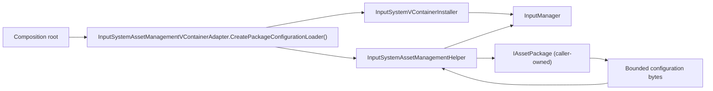

# CycloneGames.InputSystem.AssetManagement

[English | 简体中文](README.md)

CycloneGames.InputSystem.AssetManagement 是 `CycloneGames.InputSystem`、`CycloneGames.AssetManagement` 与 VContainer 之间的显式可选集成边界。它采用独立物理包，确保只安装 InputSystem 而不安装 AssetManagement 时不会遗留指向缺失本地模块的 asmdef 引用；未安装 VContainer 时该程序集完全不参与编译。

## 目录

- [概述](#概述)
- [架构](#架构)
- [快速上手](#快速上手)
- [核心概念](#核心概念)
- [使用指南](#使用指南)
- [进阶主题](#进阶主题)
- [常见场景](#常见场景)
- [性能与内存](#性能与内存)
- [故障排查](#故障排查)

## 概述

当产品从 asset package 加载输入配置时，需要在三个 owner 之间搭桥：InputSystem runtime（校验并提交配置）、AssetManagement runtime（从 package 加载字节）与 VContainer composition root（持有 manager 生命周期）。本包以一个程序集、一个公开 adapter 和一个 helper 提供该桥梁，使 InputSystem 基础 VContainer 集成永远不直接依赖 AssetManagement。

adapter 不拥有缓存、Unity object 或全局服务。调用方拥有 AssetManagement package 与 VContainer scope。用户配置仍由 `Application.persistentDataPath` 下的 `FileInputConfigurationStore` 管理；本集成不新增文件或 preference。

当 InputSystem 配置在运行时从 AssetManagement package 加载时使用本包。当配置来自 serialized `TextAsset`、StreamingAssets 或 in-memory source 时不要安装本包 —— InputSystem 基础 VContainer 集成无需本 adapter 即可处理这些来源。

### 主要特性

- **物理隔离**：独立 package，使不带 AssetManagement 的 InputSystem 没有悬空 asmdef 引用。
- **Package-derived 激活**：`autoReferenced: false` 配合 `VCONTAINER_PRESENT` `defineConstraints`；未安装 VContainer 时排除。
- **有界 acquisition**：1 MiB acquisition 完成后的 acceptance/copy limit；strict UTF-8；复制前检查 `TextAsset.dataSize`。
- **Cancellation 安全的清理**：provider load、Unity object access 与 handle disposal 在 Unity main thread 执行；cleanup 使用非取消 token，cancellation 不会跳过 disposal。
- **Location 安全**：`configLocation` 超过 512 字符或 1,024 UTF-8 bytes、包含无效 Unicode 或 control/format/private-use separator 时在 provider 使用前被拒绝。

## 架构

| 程序集 | 路径 | 用途 |
| --- | --- | --- |
| `CycloneGames.InputSystem.Runtime.Integrations.VContainer.AssetManagement` | `Runtime/Integrations/VContainer/` | `InputSystemAssetManagementVContainerAdapter` 与 `InputSystemAssetManagementHelper`。依赖 UniTask、InputSystem.Runtime、InputSystem.Runtime.Integrations.VContainer、AssetManagement.Runtime、Logger。 |

该程序集设 `autoReferenced: false`，并使用 package-derived `VCONTAINER_PRESENT` constraint（来自 `jp.hadashikick.vcontainer`）。未安装 VContainer 时不参与编译。消费者必须显式引用 `CycloneGames.InputSystem.Runtime.Integrations.VContainer.AssetManagement`。不要添加 `PlayerSettings` scripting define —— 物理 integration package 及其 asmdef 使该边界在 assembly graph 中显式可见。



adapter 创建一个 loader delegate，由基础 VContainer installer 消费。`ReinitializeFromPackageAsync` 执行时，helper 把传入对象验证为 `IAssetPackage`，加载有界配置内容，再把验证、runtime 原子提交与可选用户持久化交给 InputSystem 基础集成。

## 快速上手

在 asmdef 中添加对 `CycloneGames.InputSystem.Runtime.Integrations.VContainer.AssetManagement` 的引用，然后创建 package loader 并传给基础 VContainer installer：

```csharp
var packageLoader =
    InputSystemAssetManagementVContainerAdapter.CreatePackageConfigurationLoader();

builder.Install(new InputSystemVContainerInstaller(
    "input_config.yaml",
    "user_input_settings.yaml",
    packageLoader));
```

`ReinitializeFromPackageAsync` 随后从 AssetManagement package 加载配置、校验、提交 runtime snapshot，并可选地把 default 持久化到 user store。

## 核心概念

### 物理边界

本包作为 `CycloneGames.InputSystem` 的 sibling 存在，使基础 VContainer 集成（`CycloneGames.InputSystem.Runtime.Integrations.VContainer`）不引用 AssetManagement。没有这层物理隔离，单独安装 InputSystem 会留下指向缺失本地模块的 asmdef 引用。

### Package-derived 激活

程序集的 `defineConstraints` 为 `VCONTAINER_PRESENT`，由 `jp.hadashikick.vcontainer` 的 `versionDefines` 项设置。未安装 VContainer 时 constraint 不满足，程序集被排除在编译之外。不需要也不应手动添加 `PlayerSettings` scripting define。

### Acquisition 与 Acceptance

helper 的 1 MiB 限制是 **acquisition 完成后的 acceptance/copy limit**，不是 acquisition budget。它约束的是 provider 已经 acquire 资产之后 helper 复制到自己 buffer 的内容大小，不约束 provider catalog lookup、download、decompression、cache、native allocation 或 disk materialization。所选 AssetManagement provider 与 composition root 必须在调用本 adapter 前实施这些 acquisition budget。

## 使用指南

### 从 package 加载配置

```csharp
var packageLoader =
    InputSystemAssetManagementVContainerAdapter.CreatePackageConfigurationLoader();

builder.Install(new InputSystemVContainerInstaller(
    "input_config.yaml",          // default configuration key
    "user_input_settings.yaml",   // user configuration key
    packageLoader));
```

没有该 delegate 时，`ReinitializeFromPackageAsync` 会报告未注册 package loader。

### Cancellation 与清理

loader delegate 接收调用方的 `CancellationToken`，并把它传递到 AssetManagement、bounded raw-file I/O、runtime replacement 与 persistence。runtime commit 成功是 cancellation 能阻止 runtime mutation 的最后边界。随后 persistence 中的 cancellation 会转换为明确的 persistence incomplete 结果，而不是继续向上传播并造成 commit 未发生的假象。

provider load、Unity object access 与 handle disposal 都在 Unity main thread 执行。cleanup 切换到非取消 token，因此 cancellation 不会跳过 handle disposal。

### Configuration location 安全

`configLocation` 是由 application 控制的 provider catalog key，不是用于接收不可信 path 或 URL 的通用入口。在 provider 使用前会被拒绝的情况：

- 超过 512 个字符或 1,024 个 UTF-8 bytes；
- 包含无效 Unicode；
- 包含 control、format 或 private-use separator。

不要直接传入 remote configuration field、command-line argument、console input、save data 或其他 user-controlled text。如果产品必须从不可信边界选择 location，composition root 必须先通过 provider-specific allowlist 与 canonicalization policy 完成映射，再创建或调用 loader。

### Raw-file 与 TextAsset 加载

当 provider 公开 local `FilePath` 时，helper 优先使用 bounded raw-file loading，以便在分配前检查长度。只有 bounded raw-file capability 不可用时才会自动回退到 TextAsset：package 未实现 `IAssetRawFileLoader`，或已完成的 raw handle 无法公开 local path。对于以 TextAsset authoring 的 catalog entry，应预先选择 `useTextAsset: true`。

## 进阶主题

### Raw attempt 结果

raw 加载尝试有四种内部结果：

| 结果 | 含义 |
| --- | --- |
| `Success` | raw file 加载成功，长度已验证，UTF-8 已解码，bytes 已复制。 |
| `CapabilityUnavailable` | provider 未实现 `IAssetRawFileLoader`，或已完成 raw handle 无 local path。回退到 TextAsset。 |
| `ProviderLoadFailed` | provider load 失败。fail closed；不发起第二次 acquisition，不回退 TextAsset。 |
| `PolicyRejected` | 内容超限、无效或非 local provider path、无效 UTF-8，或读取时文件变化/short-read。不回退 TextAsset。 |

provider failure 会 fail closed，不会发起第二次 acquisition。policy rejection（内容超限、无效或非 local provider path、无效 UTF-8、文件变化或 short-read）同样不回退 TextAsset。

### 所有权与持久化

adapter 不拥有缓存、Unity object 或全局服务。调用方拥有 AssetManagement package 与 VContainer scope。用户配置仍由 `Application.persistentDataPath` 下的 `FileInputConfigurationStore` 管理；本集成不新增文件或 preference。

## 常见场景

### Package 支持的配置热更新

Live-service 游戏把输入配置存储在 AssetManagement package 中。配置变化时，composition root 在移除 active player 后用新 package 和 location 调用 `ReinitializeFromPackageAsync`。helper 加载有界内容，基础集成校验并提交 runtime snapshot，user store 可选地持久化已验证 default。

### TextAsset authoring 的 catalog entry

产品以 `TextAsset` asset 形式在 AssetManagement catalog 中创作输入配置。loader 创建时传入 `useTextAsset: true`，helper 直接使用 TextAsset acceptance 路径，在复制 bytes 前检查 `TextAsset.dataSize` 并执行 strict UTF-8 decode。

## 性能与内存

| 路径 | 模块级分配 | 说明 |
| --- | --- | --- |
| Loader 创建 | 0 字节 | adapter 创建 delegate；无缓存或 buffer。 |
| 配置 acquisition | 调用方所有 | provider download、decompression、cache 归 AssetManagement provider。 |
| Acceptance/copy | 1 MiB 有界 buffer | acquisition 完成后的限制；分配前检查 `TextAsset.dataSize` 或 raw-file 长度。 |
| Runtime commit | 模块级 0 字节 | 交给基础 InputSystem 集成；helper 在 handoff 后释放自己的 buffer。 |

helper 在把内容交给基础集成后不再保留配置 bytes。provider load、Unity object access 与 handle disposal 在 Unity main thread 执行；helper 不创建线程或同步原语。

## 故障排查

| 现象 | 可能原因 | 解决方法 |
| --- | --- | --- |
| `ReinitializeFromPackageAsync` 报告未注册 package loader | 未把 adapter delegate 传给 `InputSystemVContainerInstaller` | 调用 `CreatePackageConfigurationLoader()` 并传给 installer |
| 程序集未编译 | 未安装 VContainer package | 安装 `jp.hadashikick.vcontainer`；`VCONTAINER_PRESENT` constraint 由 package 派生 |
| raw load 报告 `PolicyRejected` | 内容超 1 MiB、UTF-8 无效或 provider path 非 local | 缩小配置、修复编码，或使用公开 local `FilePath` 的 provider |
| `ProviderLoadFailed` 且无回退 | provider load 失败；helper fail closed | 检查 provider diagnostic；修复 package 或 location |
| 意料之外的 TextAsset 回退 | provider 缺少 `IAssetRawFileLoader` 或 raw handle 无 local path | 实现 `IAssetRawFileLoader`，或预先选择 `useTextAsset: true` |
| `configLocation` 被拒绝 | 超过 512 字符 / 1,024 UTF-8 bytes、无效 Unicode 或 control/format/private-use separator | 使用简短有效的 provider catalog key；在 composition root 中规范化不可信输入 |
| cancellation 未跳过 disposal | 预期行为 | cleanup 按设计使用非取消 token；cancellation 不会跳过 handle disposal |

## 验证

1. 在包含 VContainer、InputSystem 与 AssetManagement 的验证项目中，编译两个集成程序集，并从测试 package 初始化。
2. 在不包含该物理包的验证项目中，确认 InputSystem 及基础 VContainer 集成在没有 AssetManagement 时仍可编译。
3. 在不包含 VContainer 的验证项目中，确认本程序集会被 package-derived constraint 排除。
4. 在声明 IL2CPP、stripping、平台或长时间运行结论前，执行目标 Player build。

## 参考

- [CycloneGames.InputSystem README](../CycloneGames.InputSystem/README.SCH.md) —— 基础 InputSystem 模块，本 adapter 扩展的 VContainer 集成所属
- [CycloneGames.InputSystem Runtime 指南](../CycloneGames.InputSystem/Documents~/RuntimeGuide.SCH.md) —— 配置加载、持久化与 shutdown
