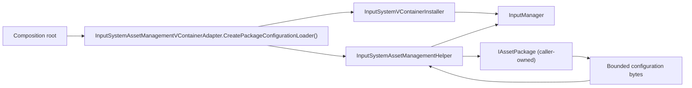

# CycloneGames.InputSystem.AssetManagement

[English | 简体中文](README.SCH.md)

CycloneGames.InputSystem.AssetManagement is the explicit optional integration boundary between `CycloneGames.InputSystem`, `CycloneGames.AssetManagement`, and VContainer. It is physically separate so installing InputSystem without AssetManagement never leaves an asmdef reference to a missing local module, and it is excluded from compilation entirely when VContainer is not installed.

## Table of Contents

- [Overview](#overview)
- [Architecture](#architecture)
- [Quick Start](#quick-start)
- [Core Concepts](#core-concepts)
- [Usage Guide](#usage-guide)
- [Advanced Topics](#advanced-topics)
- [Common Scenarios](#common-scenarios)
- [Performance and Memory](#performance-and-memory)
- [Troubleshooting](#troubleshooting)

## Overview

A product that loads input configuration from an asset package needs a bridge between three owners: the InputSystem runtime (which validates and commits configuration), the AssetManagement runtime (which loads bytes from a package), and the VContainer composition root (which owns the manager lifetime). This package provides that bridge as one assembly with one public adapter and one helper, so the base InputSystem VContainer integration never takes a direct dependency on AssetManagement.

The adapter owns no cache, Unity object, or global service. The caller owns the AssetManagement package and VContainer scope. User configuration persistence remains owned by `FileInputConfigurationStore` under `Application.persistentDataPath`; this integration introduces no additional files or preferences.

Use this package when InputSystem configuration is loaded from an AssetManagement package at runtime. Do not install it when configuration comes from a serialized `TextAsset`, StreamingAssets, or an in-memory source — the base InputSystem VContainer integration handles those without this adapter.

### Key Features

- **Physical isolation**: Separate package so InputSystem without AssetManagement has no dangling asmdef reference.
- **Package-derived activation**: `autoReferenced: false` with `VCONTAINER_PRESENT` `defineConstraints`; excluded when VContainer is missing.
- **Bounded acquisition**: 1 MiB post-acquisition acceptance/copy limit; strict UTF-8; `TextAsset.dataSize` checked before copying.
- **Cancellation-safe cleanup**: Provider load, Unity-object access, and handle disposal run on the Unity main thread; cleanup runs without the canceled caller token so cancellation cannot skip disposal.
- **Location safety**: `configLocation` rejected before provider use when it exceeds 512 characters or 1,024 UTF-8 bytes, contains invalid Unicode, or contains control/format/private-use separators.

## Architecture

| Assembly | Path | Purpose |
| --- | --- | --- |
| `CycloneGames.InputSystem.Runtime.Integrations.VContainer.AssetManagement` | `Runtime/Integrations/VContainer/` | `InputSystemAssetManagementVContainerAdapter` and `InputSystemAssetManagementHelper`. Depends on UniTask, InputSystem.Runtime, InputSystem.Runtime.Integrations.VContainer, AssetManagement.Runtime, Logger. |

The assembly is `autoReferenced: false` and uses a package-derived `VCONTAINER_PRESENT` constraint (from `jp.hadashikick.vcontainer`). It is absent from compilation when VContainer is not installed. Consumers must explicitly reference `CycloneGames.InputSystem.Runtime.Integrations.VContainer.AssetManagement`. Do not add a `PlayerSettings` scripting define — the physical integration package and its asmdef make the boundary explicit in the assembly graph.



The adapter creates a loader delegate that the base VContainer installer consumes. When `ReinitializeFromPackageAsync` runs, the helper validates the supplied object as `IAssetPackage`, loads bounded configuration content, and delegates validation, atomic runtime commit, and optional user persistence to the base InputSystem integration.

## Quick Start

Add an asmdef reference to `CycloneGames.InputSystem.Runtime.Integrations.VContainer.AssetManagement`, then create the package loader and pass it to the base VContainer installer:

```csharp
var packageLoader =
    InputSystemAssetManagementVContainerAdapter.CreatePackageConfigurationLoader();

builder.Install(new InputSystemVContainerInstaller(
    "input_config.yaml",
    "user_input_settings.yaml",
    packageLoader));
```

`ReinitializeFromPackageAsync` then loads configuration from the AssetManagement package, validates it, commits the runtime snapshot, and optionally persists the default into the user store.

## Core Concepts

### Physical Boundary

The package exists as a sibling to `CycloneGames.InputSystem` so the base VContainer integration (`CycloneGames.InputSystem.Runtime.Integrations.VContainer`) has no AssetManagement reference. Without this physical separation, installing InputSystem alone would leave an asmdef reference to a missing local module.

### Package-Derived Activation

The assembly's `defineConstraints` is `VCONTAINER_PRESENT`, which is set by a `versionDefines` entry from `jp.hadashikick.vcontainer`. When VContainer is not installed, the constraint is unsatisfied and the assembly is excluded from compilation. No manual `PlayerSettings` scripting define is needed or correct.

### Acquisition vs. Acceptance

The helper's 1 MiB limit is a **post-acquisition acceptance/copy limit**, not an acquisition budget. It bounds what the helper copies into its own buffer after the provider has already acquired the asset. It does not bound provider catalog lookup, download, decompression, cache, native allocation, or disk materialization. The selected AssetManagement provider and composition root must enforce those acquisition budgets before invoking this adapter.

## Usage Guide

### Loading configuration from a package

```csharp
var packageLoader =
    InputSystemAssetManagementVContainerAdapter.CreatePackageConfigurationLoader();

builder.Install(new InputSystemVContainerInstaller(
    "input_config.yaml",          // default configuration key
    "user_input_settings.yaml",   // user configuration key
    packageLoader));
```

Without the delegate, `ReinitializeFromPackageAsync` reports that no package loader is registered.

### Cancellation and cleanup

The loader delegate receives the caller's `CancellationToken` and propagates it through AssetManagement, bounded raw-file I/O, runtime replacement, and persistence. A successful runtime commit is the final point at which cancellation can prevent runtime mutation. Cancellation during subsequent persistence becomes an explicit incomplete-persistence result instead of escaping as if the commit had not happened.

Provider load calls, Unity-object access, and handle disposal run on the Unity main thread. Cleanup switches to a non-canceled token so cancellation cannot skip handle disposal.

### Configuration location safety

`configLocation` is an application-controlled provider catalog key, not a general-purpose untrusted path or URL. It is rejected before provider use when it:

- exceeds 512 characters or 1,024 UTF-8 bytes;
- contains invalid Unicode;
- contains control, format, or private-use separators.

Do not pass remote configuration fields, command-line arguments, console input, save data, or other user-controlled text directly. If a product must select a location from an untrusted boundary, its composition root must map it through a provider-specific allowlist and canonicalization policy before creating or invoking the loader.

### Raw-file vs. TextAsset loading

The helper prefers bounded raw-file loading when the provider exposes a local `FilePath`, so length can be checked before allocation. Automatic TextAsset fallback occurs only when bounded raw-file capability is unavailable: either the package does not implement `IAssetRawFileLoader`, or a completed raw handle cannot expose a local path. Choose `useTextAsset: true` up front for catalog entries authored as TextAsset.

## Advanced Topics

### Raw attempt outcomes

Raw loading attempts have four internal outcomes:

| Outcome | Meaning |
| --- | --- |
| `Success` | Raw file loaded, length verified, UTF-8 decoded, bytes copied. |
| `CapabilityUnavailable` | Provider does not implement `IAssetRawFileLoader`, or completed raw handle has no local path. Falls back to TextAsset. |
| `ProviderLoadFailed` | Provider load failed. Fails closed; no second acquisition, no TextAsset fallback. |
| `PolicyRejected` | Oversized content, invalid/non-local provider path, invalid UTF-8, or file changed/short-read during I/O. Fails without TextAsset fallback. |

Provider failures fail closed rather than starting a second acquisition. Policy rejections (oversized content, invalid/non-local provider path, invalid UTF-8, file changed or short-read) also fail without TextAsset fallback.

### Ownership and persistence

The adapter owns no cache, Unity object, or global service. The caller owns the AssetManagement package and VContainer scope. User configuration persistence remains owned by `FileInputConfigurationStore` under `Application.persistentDataPath`; this integration introduces no additional files or preferences.

## Common Scenarios

### Package-backed configuration hot-update

A live-service game stores input configuration in an AssetManagement package. On a configuration change, the composition root calls `ReinitializeFromPackageAsync` with the new package and location after removing active players. The helper loads the bounded content, the base integration validates and commits the runtime snapshot, and the user store optionally persists the validated default.

### TextAsset-authored catalog entries

A product authors input configuration as `TextAsset` assets in the AssetManagement catalog. The loader is created with `useTextAsset: true` so the helper uses the TextAsset acceptance path directly, checking `TextAsset.dataSize` before copying bytes and performing strict UTF-8 decoding.

## Performance and Memory

| Path | Module-owned allocation | Notes |
| --- | --- | --- |
| Loader creation | 0 bytes | Adapter creates a delegate; no cache or buffer. |
| Configuration acquisition | Caller-owned | Provider download, decompression, cache belong to the AssetManagement provider. |
| Acceptance/copy | 1 MiB bounded buffer | Post-acquisition limit; `TextAsset.dataSize` or raw-file length checked before allocation. |
| Runtime commit | 0 bytes module-owned | Delegated to base InputSystem integration; helper releases its buffer after handoff. |

The helper does not retain the configuration bytes after handing them to the base integration. Provider load, Unity-object access, and handle disposal run on the Unity main thread; the helper does not create threads or synchronization primitives.

## Troubleshooting

| Symptom | Likely cause | Resolution |
| --- | --- | --- |
| `ReinitializeFromPackageAsync` reports no package loader | Adapter delegate not passed to `InputSystemVContainerInstaller` | Call `CreatePackageConfigurationLoader()` and pass it to the installer |
| Assembly not compiled | VContainer package not installed | Install `jp.hadashikick.vcontainer`; the `VCONTAINER_PRESENT` constraint is package-derived |
| `PolicyRejected` on raw load | Content exceeds 1 MiB, invalid UTF-8, or non-local provider path | Reduce configuration size, fix encoding, or use a provider with local `FilePath` |
| `ProviderLoadFailed` with no fallback | Provider load failed; helper fails closed | Check provider diagnostics; fix the package or location |
| TextAsset fallback unexpected | Provider lacks `IAssetRawFileLoader` or raw handle has no local path | Implement `IAssetRawFileLoader`, or choose `useTextAsset: true` up front |
| `configLocation` rejected | Exceeds 512 chars / 1,024 UTF-8 bytes, invalid Unicode, or control/format/private-use separators | Use a short, valid provider catalog key; canonicalize untrusted input in the composition root |
| Cancellation did not skip disposal | Expected behavior | Cleanup runs on a non-canceled token by design; cancellation cannot skip handle disposal |

## Validation

1. In a validation project with VContainer, InputSystem, and AssetManagement, compile both integration assemblies and initialize from a test package.
2. In a validation project that omits this physical package, verify InputSystem and its base VContainer integration compile without AssetManagement.
3. In a validation project without VContainer, verify this assembly is excluded by its package-derived constraint.
4. Run an intended Player build before making IL2CPP, stripping, platform, or long-session claims.

## References

- [CycloneGames.InputSystem README](../CycloneGames.InputSystem/README.md) — base InputSystem module, including the VContainer integration this adapter extends
- [CycloneGames.InputSystem Runtime guide](../CycloneGames.InputSystem/Documents~/RuntimeGuide.md) — configuration loading, persistence, and shutdown
