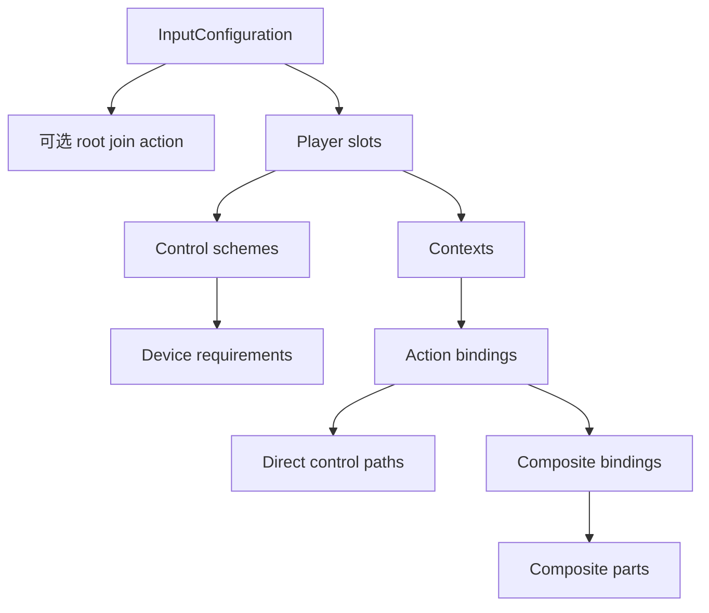

# 配置指南

[English | 简体中文](Configuration.md)

相关：[快速上手](GettingStarted.SCH.md) | [Runtime 指南](RuntimeGuide.SCH.md) | [模块参考](../README.SCH.md)

## 概述

本指南说明 YAML、Input System Editor 与 runtime validation 共用的 authoring model。Editor 与 YAML 表达相同数据：Editor 提供可发现字段、Tooltip、验证、安全写入与 code generation；YAML 是便于 review 的 source format。

## 核心概念

### 配置层级



### Root 字段

| 字段 | 必需 | 含义 |
| --- | --- | --- |
| `schemaVersion` | 是 | Runtime format version。新文件使用 `InputConfiguration.CurrentSchemaVersion`。 |
| `schemaFingerprint` | 否 | Editor diagnostic value。Runtime acceptance 由 schema 与 validation 决定。 |
| `joinAction` | 否 | Lobby listening active 时，所有 player slot 共用的 join action。 |
| `playerSlots` | 是 | 声明的本地玩家配置；每个 `playerId` 必须唯一。 |

### Player slot

| 字段 | 必需 | 含义 |
| --- | --- | --- |
| `playerId` | 是 | Join、lookup、persistence 与 diagnostic 使用的 stable local-player identity。 |
| `joinAction` | 否 | 该 slot 专用的 join action。 |
| `defaultControlScheme` | 否 | 首选 declared scheme；留空时从可用设备中选择最佳 scheme。 |
| `controlSchemes` | 通常需要 | Join 与设备分配使用的 named device requirement set。 |
| `contexts` | 是 | Context definition 与 action binding。 |

Player ID 是配置 identity，不是 list position。只要处于配置 limit 内，也可以使用非连续 ID。

### Control scheme

```yaml
controlSchemes:
  - name: KeyboardMouse
    bindingGroup: KeyboardMouse
    deviceRequirements:
      - controlPath: "<Keyboard>"
        isOptional: false
        isOr: false
      - controlPath: "<Mouse>"
        isOptional: true
        isOr: false
```

| 字段 | 含义 |
| --- | --- |
| `name` | `defaultControlScheme` 使用的 stable scheme name。 |
| `bindingGroup` | 与 action `bindingGroups` 匹配的 group。 |
| `controlPath` | Unity Input System device layout path，例如 `<Keyboard>` 或 `<Gamepad>`。 |
| `isOptional` | 缺少该 requirement 时仍允许 scheme match。 |
| `isOr` | 将该 requirement 与前一项组成 alternative。 |

键盘可以独立操作时，可将 mouse requirement 设为 optional。只有设备规则明确表示 alternative 时才使用 `isOr`。

### Context

Context 按产品状态组织 action：`Gameplay` 用于角色控制，`Vehicle` 用于载具控制，`Menu` 用于菜单导航，`Modal` 用于需要 capture input 的对话框。

| 字段 | 必需 | 含义 |
| --- | --- | --- |
| `name` | 是 | Runtime lookup 与 generated constants 使用的 context identity。 |
| `actionMap` | 是 | 为该 context 构建的 Unity Input System action-map 名称。 |
| `priority` | 是 | 多个 active context 竞争时，较大值优先。 |
| `blocksLowerPriority` | 是 | Active 时阻止较低优先级 context dispatch。 |
| `bindings` | 是 | 该 context 可用的 action definition。 |

Runtime `InputContext` 引用已配置的 context/action-map identity，并持有 command subscription。配置定义可用 action；runtime code 决定哪些 context active。

## 使用指南

### Action binding：基础字段

| 字段 | 必需 | 含义 | 示例 |
| --- | --- | --- | --- |
| `Type` | 是 | Action 暴露的 value shape。 | `Button`、`Vector2` |
| `Action Name` | 是 | Stable action identity。 | `Confirm`、`Move` |
| `Update Mode` | 是 | `EventDriven` 发布变化；`Polling` 从 frame provider 采样。 | `EventDriven` |
| `Device Bindings` | 至少一种 binding source | Direct Unity Input System control path。 | `<Keyboard>/enter` |
| `Composite Bindings` | 至少一种 binding source | Structured composite，常用于键盘移动。 | `2DVector` |
| `Long Press Ms` | 否 | 模块级 long-press duration；`0` 表示关闭。 | `500` |
| `Press Threshold` | 否 | Long-press timing 使用的 actuation threshold。 | `0.5` |

Direct 与 composite binding 可以同时存在。同一 action 内每个 direct path 必须唯一。

#### 选择 `Type`

| Type | 常见 control | Runtime access |
| --- | --- | --- |
| `Button` | keyboard key、gamepad button | `GetButtonObservable`、`GetLongPressObservable` |
| `Float` | trigger、axis | `GetScalarObservable`、同步 float read |
| `Vector2` | stick、pointer delta、2D composite | `GetVector2Observable` |

选择 product code 实际消费的 value shape。Validation 会检查 configured control 与 action construction 是否满足声明。

### Action binding：高级字段

Editor 将可选 metadata 放在 `Advanced Options` 中：

| 字段 | 使用时机 | 语法 |
| --- | --- | --- |
| `Expected Type` | 要求特定 Input System control layout。 | `Button`、`Vector2` |
| `Interactions` | 修改 actuation timing 或 phase。 | `Tap`、`Hold(duration=0.5)` |
| `Processors` | Consumer 读取前转换 value。 | `NormalizeVector2`、`Scale(factor=2)` |
| `Scheme Groups` | 将 binding 限制到 declared scheme group。 | `KeyboardMouse;Gamepad` |

不需要额外约束时应保持为空。Interaction 配置在 action binding 上。Composite part 可以定义 part-local processor；part-local interaction 必须为空。

### Composite binding 示例

```yaml
compositeBindings:
  - name: 2DVector
    parameters: mode=2
    bindingGroups: KeyboardMouse
    parts:
      - name: up
        path: "<Keyboard>/w"
      - name: down
        path: "<Keyboard>/s"
      - name: left
        path: "<Keyboard>/a"
      - name: right
        path: "<Keyboard>/d"
```

Composite part name 必须与 selected composite 一致。Validation 会针对 active Input System registry 构建 temporary action graph，因此 unknown composite、part、processor、interaction 与 path 会在 runtime commit 前失败。

### Join action

只有 `StartListeningForPlayers` active 时才使用 join action。Root join path 是 shared candidate。Slot join path 是 slot-specific candidate。Device-locking mode 将触发设备分配给 joined player。同一个 join action 内不要重复 direct path。

### Editor 命令与文件 owner

| 命令 | 写入内容 | 不写入内容 |
| --- | --- | --- |
| `Load User` | 无 | 将 configured user file 读入 working copy。 |
| `Load Default` | 无 | 将 selected project-default file 读入 working copy。 |
| `Generate Default` | Project-default file | 不写 user file 或 generated code。 |
| `Save User Config` | User file | 不写 project default 或 generated code。 |
| `Save User + Generate Code` | User file 与 `InputActions.cs` | 不写 project default。 |
| `Save Project Default` | Project-default file | 不写 user file 或 generated code。 |
| `Restore User from Default` | 加载并验证 project default 后写入 user file | 不修改 project default。 |
| `Clear` | 无 | 只销毁 in-memory working copy。 |

所有写入操作都会先验证配置。已存在的 target 使用 transactional replacement，并保留有界 recovery backup。

### Validation 状态

| 状态 | 含义 | 可执行操作 |
| --- | --- | --- |
| `WAITING` | 没有 loaded working configuration。 | Load 或 generate。 |
| `EDITABLE` | Working copy 已存在。 | 无论 validation state 如何都可以编辑字段。 |
| `VALID` | Structural 与 runtime validation 通过。 | Save 或 generate code。 |
| `REVIEW` | Document 可用，但存在 review note。 | 保存前检查 message。 |
| `INVALID` | Field、identity、budget 或 Input System registration 验证失败。 | 编辑指示字段；persistence 保持 blocked。 |

### Authoring 检查清单

- Player ID 唯一。
- 每个 player 内 context name 唯一。
- `context/actionMap/action` identity 明确且稳定。
- Action name 不包含 control character。
- 同一 action 内 direct binding 唯一。
- Control scheme name 与 binding group 精确匹配。
- 每个 composite 与 part 都存在于已安装 Input System registry。
- 文件提交前 Editor 状态为 `VALID`。

## 故障排除

| 症状 | 可能原因 | 解决方法 |
| --- | --- | --- |
| Editor 无法保存 | Validation 报告 `INVALID` 状态 | 检查指示字段；解决 identity、budget 或 Input System registration 问题。 |
| `REVIEW` 状态 | 存在非关键配置问题 | 检查 review message；仍然可以保存。 |
| Composite validation 失败 | Part 名称不匹配、unknown composite 或 missing Input System registration | 对照 composite type 验证 part 名称；在 Editor 使用前注册自定义 composite。 |
| `FileInputConfigurationStore` 返回 `InvalidKey` | 路径包含 rooted segment、traversal 或不安全字符 | 使用相对 logical key，仅用 `/` 分隔符。 |
