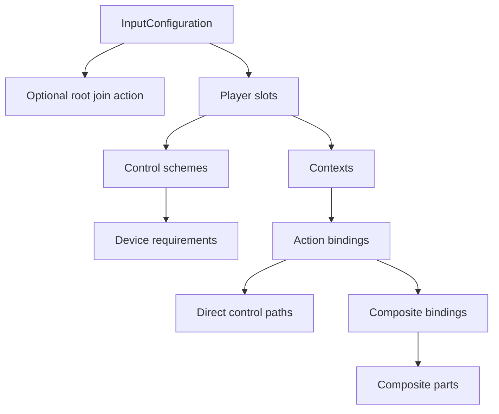

# Configuration Guide

[English | 简体中文](Configuration.SCH.md)

Related: [Getting started](GettingStarted.md) | [Runtime guide](RuntimeGuide.md) | [Module reference](../README.md)

This guide explains the authoring model shared by YAML, the Input System Editor, and runtime validation. The Editor and YAML represent the same data: the Editor provides discoverable fields, tooltips, validation, safe writes, and code generation; YAML remains the reviewable source format.

## Configuration Hierarchy



## Root Fields

| Field | Required | Meaning |
| --- | --- | --- |
| `schemaVersion` | Yes | Runtime format version. Author new files with the current value exposed by `InputConfiguration.CurrentSchemaVersion`. |
| `schemaFingerprint` | No | Editor diagnostic value. Runtime acceptance is determined by schema and validation. |
| `joinAction` | No | Shared join action considered for every player slot when lobby listening is active. |
| `playerSlots` | Yes | Declared local-player configurations. Each `playerId` must be unique. |

## Player Slot

| Field | Required | Meaning |
| --- | --- | --- |
| `playerId` | Yes | Stable local-player identity used by join, lookup, persistence, and diagnostics. |
| `joinAction` | No | Join action specific to this slot. |
| `defaultControlScheme` | No | Preferred declared scheme. Leave empty to select the best scheme supported by available devices. |
| `controlSchemes` | Usually | Named device requirement sets used during join and device assignment. |
| `contexts` | Yes | Context definitions and their action bindings. |

Player IDs are configuration identities, not list positions. A two-player product commonly uses `0` and `1`, but sparse IDs are accepted when they remain within configured limits.

## Control Scheme

A control scheme describes which devices can satisfy a player slot.

```yaml
controlSchemes:
  - name: KeyboardMouse
    bindingGroup: KeyboardMouse
    deviceRequirements:
      - controlPath: "<Keyboard>"
        isOptional: false
        isOr: false
      - controlPath: "<Mouse>"
        isOptional: true
        isOr: false
```

| Field | Meaning |
| --- | --- |
| `name` | Stable scheme name used by `defaultControlScheme`. |
| `bindingGroup` | Group matched by action `bindingGroups`. |
| `controlPath` | Unity Input System device layout path, such as `<Keyboard>` or `<Gamepad>`. |
| `isOptional` | Allows the scheme to match without this requirement. |
| `isOr` | Joins this requirement to the previous requirement as an alternative. |

Use optional mouse requirements when keyboard-only operation is valid. Use `isOr` only when the intended device rule is an explicit alternative.

## Context

Contexts group actions by product state: `Gameplay` for character control, `Vehicle` for vehicle control, `Menu` for navigation, `Modal` for dialogs that must capture input.

| Field | Required | Meaning |
| --- | --- | --- |
| `name` | Yes | Context identity used by runtime lookup and generated constants. |
| `actionMap` | Yes | Unity Input System action-map name built for this context. |
| `priority` | Yes | Higher values win when active contexts compete. |
| `blocksLowerPriority` | Yes | Prevents lower-priority contexts from dispatching while this context is active. |
| `bindings` | Yes | Action definitions available in the context. |

Runtime `InputContext` instances refer to configured context/action-map identities and own command subscriptions. Configuration defines available actions; runtime code decides which contexts are active.

## Action Binding: Basic Fields

| Field | Required | Meaning | Example |
| --- | --- | --- | --- |
| `Type` | Yes | Value shape exposed by the action. | `Button`, `Vector2` |
| `Action Name` | Yes | Stable action identity. | `Confirm`, `Move` |
| `Update Mode` | Yes | `EventDriven` publishes changes; `Polling` samples from the frame provider. | `EventDriven` |
| `Device Bindings` | One binding source | Direct Unity Input System control paths. | `<Keyboard>/enter` |
| `Composite Bindings` | One binding source | Structured composites, commonly keyboard movement. | `2DVector` |
| `Long Press Ms` | No | Module-level long-press duration. Zero disables it. | `500` |
| `Press Threshold` | No | Actuation threshold used by long-press timing. | `0.5` |

Direct and composite bindings may coexist. Each direct path must be unique inside one action.

### Choosing `Type`

| Type | Typical controls | Runtime access |
| --- | --- | --- |
| `Button` | keyboard key, gamepad button | `GetButtonObservable`, `GetLongPressObservable` |
| `Float` | trigger, axis | `GetScalarObservable`, synchronous float read |
| `Vector2` | stick, pointer delta, 2D composite | `GetVector2Observable` |

Choose the value shape consumed by product code. Validation checks that configured controls and action construction can satisfy the declaration.

## Action Binding: Advanced Fields

The Editor places optional metadata under `Advanced Options`.

| Field | When to use it | Syntax |
| --- | --- | --- |
| `Expected Type` | Require a specific Input System control layout. | `Button`, `Vector2` |
| `Interactions` | Change actuation timing or phases. | `Tap`, `Hold(duration=0.5)` |
| `Processors` | Transform values before consumers read them. | `NormalizeVector2`, `Scale(factor=2)` |
| `Scheme Groups` | Limit a binding to declared scheme groups. | `KeyboardMouse;Gamepad` |

Leave these fields empty when their constraint is not needed. Empty advanced fields are normal and reduce configuration coupling.

Interactions belong to the action binding. Composite parts can define part-local processors; part-local interactions must remain empty.

## Direct Paths and Picker Behavior

Device-binding rows contain an editable text field for any valid Input System control path and a compact picker for known project constants. Examples:

```text
<Keyboard>/space
<Gamepad>/buttonSouth
<Mouse>/delta
<Pen>/tip
```

The picker is a convenience list, not the set of all accepted Input System paths.

## Composite Binding Example

```yaml
compositeBindings:
  - name: 2DVector
    parameters: mode=2
    bindingGroups: KeyboardMouse
    parts:
      - name: up
        path: "<Keyboard>/w"
      - name: down
        path: "<Keyboard>/s"
      - name: left
        path: "<Keyboard>/a"
      - name: right
        path: "<Keyboard>/d"
```

Composite part names must match the selected composite. Validation constructs a temporary action graph against the active Input System registry, so unknown composites, parts, processors, interactions, and paths fail before runtime commit.

## Join Actions

Join actions are used only when `StartListeningForPlayers` is active.

- Root join paths are shared candidates.
- Slot join paths identify slot-specific candidates.
- Device-locking mode assigns the triggering device to the joined player.
- Shared-device mode allows multiple declared players to use the same physical device.

Do not duplicate the same direct path inside one join action. A root join action and slot join actions may deliberately share a control when the lobby policy handles candidate selection.

## Editor Commands and File Ownership

| Command | Writes | Does not write |
| --- | --- | --- |
| `Load User` | Nothing | Reads the configured user file into the working copy. |
| `Load Default` | Nothing | Reads the selected project-default file into the working copy. |
| `Generate Default` | Project-default file | Does not write the user file or generated code. |
| `Save User Config` | User file | Does not write project default or generated code. |
| `Save User + Generate Code` | User file and `InputActions.cs` | Does not write project default. |
| `Save Project Default` | Project-default file | Does not write user file or generated code. |
| `Restore User from Default` | User file after loading and validating project default | Does not alter project default. |
| `Clear` | Nothing | Destroys only the in-memory working copy. |

All writes validate the configuration first. Existing targets use transactional replacement and retain a bounded recovery backup.

## Validation States

| State | Meaning | Available action |
| --- | --- | --- |
| `WAITING` | No working configuration is loaded. | Load or generate one. |
| `EDITABLE` | A working copy exists. | Fields can be changed regardless of validation state. |
| `VALID` | Structural and runtime validation passed. | Save or generate code. |
| `REVIEW` | The document is usable with a review note. | Inspect the message before saving. |
| `INVALID` | A field, identity, budget, or Input System registration failed validation. | Edit the indicated field; persistence remains blocked. |

## Authoring Checklist

- Player IDs are unique.
- Context names are unique per player.
- `context/actionMap/action` identities are intentional and stable.
- Action names do not contain control characters.
- Each direct binding is unique inside its action.
- Control scheme names and binding groups match exactly.
- Every composite and part exists in the installed Input System registry.
- The Editor reports `VALID` before the file is committed.
