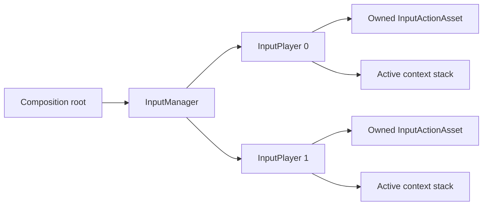

# Runtime 指南

[English | 简体中文](RuntimeGuide.md)

相关：[快速上手](GettingStarted.SCH.md) | [配置指南](Configuration.SCH.md) | [模块参考](../README.SCH.md)

## 概述

本指南覆盖 runtime ownership、配置加载、player 创建、context routing、本地多人、rebind、persistence 与 shutdown。

## 核心概念

### Runtime ownership

Composition root 为一个 input session 持有一个 `InputManager`：



Owner 负责选择并验证 configuration、创建与移除 player、订阅与取消订阅 manager event、dispose scene 或 feature 持有的 context，以及 shutdown 时 dispose manager。除非 API 明确声明其他 thread，Unity object 与 Input System operation 都属于 Unity main thread。

### 加载策略

`InputSystemBootstrapOptions` 声明 configuration disabled、optional 或 required：

```csharp
var options = new InputSystemBootstrapOptions(
    InputSystemBootstrapMode.Optional,
    defaultSource: new UriInputConfigurationSource(),
    defaultKey: defaultUri,
    userStore: new FileInputConfigurationStore(Application.persistentDataPath),
    userKey: "input/user_input_settings.yaml",
    persistDefaultToUser: true);

InputSystemLoadResult load = await InputSystemLoader.LoadAndInitializeAsync(
    options,
    manager,
    cancellationToken: cancellationToken);
```

| Mode | 未找到配置 | Manager state |
| --- | --- | --- |
| `Disabled` | 不读取 source，返回 `NotConfigured`。 | Uninitialized |
| `Optional` | Configured source 报告 absence 时返回 `NotConfigured`。 | Uninitialized |
| `Required` | 返回 `DefaultConfigurationUnavailable`。 | Uninitialized |

Invalid、inaccessible 或 oversized content 在所有 mode 下都会报告 failure。`IsBootstrapComplete` 包含 `NotConfigured`；`IsSuccess` 表示 validated runtime configuration 已 commit。

## 使用指南

### Player 创建模式

**单玩家与最佳可用 scheme：**

```csharp
IInputPlayer player = manager.JoinSinglePlayer(0);
if (player == null)
{
    // Available device 无法满足任何 declared scheme。
}
```

设备可能稍后出现时使用 async form：

```csharp
IInputPlayer player = await manager.JoinSinglePlayerAsync(
    0,
    timeoutInSeconds: 5,
    cancellationToken);
```

**共享键盘或共享设备：**

```csharp
IInputPlayer player0 = await manager.JoinPlayerOnSharedDeviceAsync(0);
IInputPlayer player1 = await manager.JoinPlayerOnSharedDeviceAsync(1);
```

两个 slot 都必须声明适用于 shared device 的 action 与 scheme。除非产品明确允许同时响应，否则应避免 control overlap。

**Lobby join：**

```csharp
manager.OnPlayerInputReady += HandlePlayerReady;
manager.StartListeningForPlayers(lockDeviceOnJoin: true);
```

产品允许 shared device 时传入 `false`。离开 lobby 时停止 listening：

```csharp
manager.StopListeningForPlayers();
manager.OnPlayerInputReady -= HandlePlayerReady;
```

**移除 player：**

```csharp
bool removed = manager.RemovePlayer(playerId);
```

Remove 会 dispose player-owned input resource。Product code 仍负责 despawn 对应 gameplay object，并释放 feature-owned context。

### Context routing

`InputContext` 将 configured observable 绑定到 product command：

```csharp
var gameplay = new InputContext(
        actionMapName: "PlayerActions",
        name: "Gameplay",
        priority: 0,
        blocksLowerPriority: true)
    .AddBinding(
        player.GetVector2Observable("Gameplay", "PlayerActions", "Move"),
        new MoveCommand(Move))
    .AddBinding(
        player.GetButtonObservable("Gameplay", "PlayerActions", "Confirm"),
        new ActionCommand(Confirm));

player.PushContext(gameplay);
```

较高 priority context 先执行。Blocking context 会禁止较低 priority context dispatch。

**Menu 覆盖 Gameplay：**

```csharp
var menu = new InputContext(
        actionMapName: "MenuActions",
        name: "Menu",
        priority: 100,
        blocksLowerPriority: true)
    .AddBinding(
        player.GetButtonObservable("Menu", "MenuActions", "Submit"),
        new ActionCommand(Submit));

player.PushContext(menu);
```

Dispose 或 pop menu context 后恢复 gameplay dispatch：

```csharp
menu.Dispose();
```

多个系统需要在 nested operation 后可靠恢复 context state 时，使用 capture scope 持有临时 modal ownership。

### Event-driven 与 polling input

产品 event-driven behavior 使用 observable API：

```csharp
player.GetButtonObservable(actionId)
    .Subscribe(_ => Confirm())
    .AddTo(owner.destroyCancellationToken);
```

产品需要 context arbitration、blocking 与明确 subscription owner 时，优先使用 `InputContext` command binding。Direct subscription 适合 diagnostic 或具有显式 lifetime owner 的窄 feature。

Polling action 由 configured frame provider 采样。Frame-loop read 应保持 allocation-free，hot path 内不要构造 identity 或 collection。

### Long press

配置通过 `longPressMs` 与 `longPressValueThreshold` 启用 module-level long press：

```csharp
var context = new InputContext("PlayerActions", "Gameplay")
    .AddBinding(
        player.GetLongPressObservable(actionId),
        new ActionCommand(OpenRadialMenu));
```

不需要 long-press 时将 `longPressMs` 设为 `0`。Action 需要 Input System phase semantics 时使用 Input System `Interactions`。

### Rebind

修改 declared direct binding：

```csharp
bool rebound = player.RebindAction(
    contextName: "Gameplay",
    actionMapName: "PlayerActions",
    actionName: "Confirm",
    oldBinding: "<Keyboard>/enter",
    newBinding: "<Keyboard>/space");
```

Reset 单个 action 或某个 player 的全部 binding：

```csharp
player.ResetActionBinding("Gameplay", "PlayerActions", "Confirm");
player.ResetAllActionBindings();
```

接受 settings change 前检查 conflict：

```csharp
List<BindingConflict> conflicts = manager.CheckBindingConflicts(0, "Gameplay");
string report = InputManager.FormatConflictsReport(conflicts);
```

Rebind 与 conflict report 应在 settings flow 中执行，不要放入 gameplay hot path。

### Binding profile

Manager 可以 export 覆盖 declared player 的 profile：

```csharp
string json = manager.ExportBindingOverrideProfileJson();
```

Import 会在 application 前验证：

```csharp
bool applied = manager.ImportBindingOverrideProfileJson(json);
```

产品拥有 profile key、save timing、retention、account association、cloud synchronization 与 reset UX。Profile 被拒绝时保持 configured default active，并提供显式 reset 操作。

### 更新配置

Configuration replacement 是 session boundary：

1. Stop lobby listening。
2. Remove active player。
3. Dispose scene 与 feature context。
4. 使用 validated YAML 调用 `ReinitializeWithResult`。
5. Recreate player。
6. Restore accepted binding-profile data。

Replacement failure 时，manager 保留当前 committed configuration。

### Persistence ownership

`IInputConfigurationSource` 读取 configuration；`IInputConfigurationStore` 增加 save 与 delete。Store implementation 拥有 root 或 remote endpoint、path/key rule、size 与 timeout budget、atomic replacement、backup 与 recovery、cancellation 与 shutdown behavior，以及产品需要时的 encryption 与 account policy。

`FileInputConfigurationStore` 将 key 限制在 configured root 内，通过 temporary file 写入，并保留一个 recovery backup。WebGL 产品应提供 browser-oriented store implementation。

### Shutdown

按 ownership 顺序执行 shutdown：

```csharp
manager.StopListeningForPlayers();
manager.OnPlayerInputReady -= HandlePlayerReady;

gameplayContext?.Dispose();
menuContext?.Dispose();

manager.Dispose();
```

不要再次初始化 disposed manager；新的 session 应构造新的 manager。

## 故障排除

| 症状 | 可能原因 | 解决方法 |
| --- | --- | --- |
| Player 创建返回 `null` | 没有 device 匹配 declared scheme，或 device 已配对/保留 | 检查 Input Debugger 中的 paired user 和 device availability。 |
| Context command 不触发 | Context 未 push、identity 大小写不匹配或 context 被更高 priority 阻止 | 验证 `ActiveContextName` 和 context push 顺序。 |
| `ActiveDeviceKind` 持续显示 `Unknown` | 尚无 action 收到有意义的 device input | 触发一个已配置的 action；`ActiveDeviceKind` 反映观察到的 activity。 |
| Rebind 不生效 | `oldBinding` 使用错误路径或 action identity 不匹配 | 使用 context-qualified 重载和原始配置路径。 |
| Binding profile import 失败 | Schema 不匹配、identity selector 过时或 budget 超出 | 保持 defaults active、保留 profile、提供产品自有 reset。 |
| Manager 意外 disposed | Domain-reload-disabled play 时触发 subsystem registration | 在 teardown 时显式 dispose manager；下一 session 构造新实例。 |

### 生产检查清单

- 一个 composition owner 控制 manager lifetime。
- 每个 async operation 接收产品 cancellation token。
- Context 有可见 owner 与确定性 disposal。
- Player join policy 显式选择 locked 或 shared device。
- Configuration 与 profile store 有有限 budget。
- Log 记录 status 与有界 diagnostic，不记录 raw user configuration。
- Target Player build 验证 device layout、AOT/stripping、storage、suspend/resume 与 reconnect behavior。
