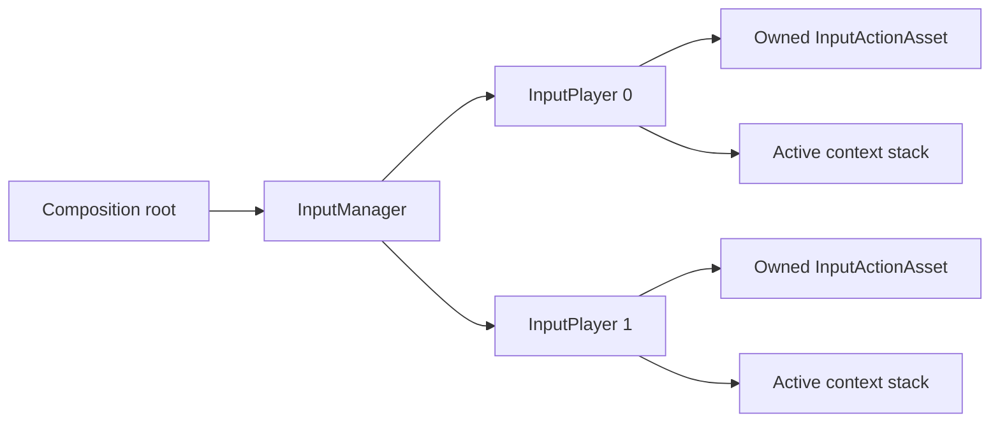

# Runtime Guide

[English | 简体中文](RuntimeGuide.SCH.md)

Related: [Getting started](GettingStarted.md) | [Configuration guide](Configuration.md) | [Module reference](../README.md)

## Overview

This guide covers runtime ownership, configuration loading, player creation, context routing, local multiplayer, rebinding, persistence, and shutdown.

## Core Concepts

### Runtime Ownership

The composition root owns one `InputManager` for one input session:



The owner is responsible for selecting and validating configuration, creating and removing players, subscribing and unsubscribing manager events, disposing contexts owned by scenes or features, and disposing the manager during shutdown. Unity objects and Input System operations belong to the Unity main thread unless an API explicitly documents another thread.

### Loading Policy

`InputSystemBootstrapOptions` declares whether configuration is disabled, optional, or required:

```csharp
var options = new InputSystemBootstrapOptions(
    InputSystemBootstrapMode.Optional,
    defaultSource: new UriInputConfigurationSource(),
    defaultKey: defaultUri,
    userStore: new FileInputConfigurationStore(Application.persistentDataPath),
    userKey: "input/user_input_settings.yaml",
    persistDefaultToUser: true);

InputSystemLoadResult load = await InputSystemLoader.LoadAndInitializeAsync(
    options,
    manager,
    cancellationToken: cancellationToken);
```

| Mode | No configuration found | Manager state |
| --- | --- | --- |
| `Disabled` | Returns `NotConfigured` without reading a source. | Uninitialized |
| `Optional` | Returns `NotConfigured` when configured sources report absence. | Uninitialized |
| `Required` | Returns `DefaultConfigurationUnavailable`. | Uninitialized |

Invalid, inaccessible, or oversized content is reported as a failure in every mode. `IsBootstrapComplete` includes `NotConfigured`; `IsSuccess` means a validated runtime configuration was committed.

## Usage Guide

### Player Creation Patterns

**One player, best available scheme:**

```csharp
IInputPlayer player = manager.JoinSinglePlayer(0);
if (player == null)
{
    // No declared scheme can be satisfied by available devices.
}
```

Use the async form when a device may appear shortly:

```csharp
IInputPlayer player = await manager.JoinSinglePlayerAsync(
    0,
    timeoutInSeconds: 5,
    cancellationToken);
```

**Shared keyboard or shared device:**

```csharp
IInputPlayer player0 = await manager.JoinPlayerOnSharedDeviceAsync(0);
IInputPlayer player1 = await manager.JoinPlayerOnSharedDeviceAsync(1);
```

Both slots must declare actions and schemes that make sense for the shared device. Avoid overlapping controls unless the product deliberately allows simultaneous responses.

**Lobby join:**

```csharp
manager.OnPlayerInputReady += HandlePlayerReady;
manager.StartListeningForPlayers(lockDeviceOnJoin: true);
```

Use `false` when the product permits shared devices. Stop listening when leaving the lobby:

```csharp
manager.StopListeningForPlayers();
manager.OnPlayerInputReady -= HandlePlayerReady;
```

**Remove a player:**

```csharp
bool removed = manager.RemovePlayer(playerId);
```

Removal disposes player-owned input resources. Product code remains responsible for despawning the corresponding gameplay object and releasing feature-owned contexts.

### Context Routing

An `InputContext` binds configured observables to product commands:

```csharp
var gameplay = new InputContext(
        actionMapName: "PlayerActions",
        name: "Gameplay",
        priority: 0,
        blocksLowerPriority: true)
    .AddBinding(
        player.GetVector2Observable("Gameplay", "PlayerActions", "Move"),
        new MoveCommand(Move))
    .AddBinding(
        player.GetButtonObservable("Gameplay", "PlayerActions", "Confirm"),
        new ActionCommand(Confirm));

player.PushContext(gameplay);
```

Higher-priority contexts are evaluated first. A blocking context suppresses dispatch from lower-priority contexts.

**Menu over gameplay:**

```csharp
var menu = new InputContext(
        actionMapName: "MenuActions",
        name: "Menu",
        priority: 100,
        blocksLowerPriority: true)
    .AddBinding(
        player.GetButtonObservable("Menu", "MenuActions", "Submit"),
        new ActionCommand(Submit));

player.PushContext(menu);
```

Dispose or pop the menu context to restore gameplay dispatch:

```csharp
menu.Dispose();
```

Use capture scopes for temporary modal ownership when several systems must restore context state reliably after nested operations.

### Event-Driven and Polled Input

Use observable APIs for event-driven product behavior:

```csharp
player.GetButtonObservable(actionId)
    .Subscribe(_ => Confirm())
    .AddTo(owner.destroyCancellationToken);
```

Use `InputContext` command binding when a product wants context arbitration, blocking, and one clear subscription owner. Direct subscriptions are suitable for diagnostics or narrowly scoped features that explicitly own their lifetime.

Polling actions are sampled by the configured frame provider. Keep frame-loop reads allocation-free and avoid constructing identities or collections in the hot path.

### Long Press

Configuration enables module-level long press with `longPressMs` and `longPressValueThreshold`:

```csharp
var context = new InputContext("PlayerActions", "Gameplay")
    .AddBinding(
        player.GetLongPressObservable(actionId),
        new ActionCommand(OpenRadialMenu));
```

Set `longPressMs` to zero when long-press behavior is not required. Use Input System `Interactions` when the action needs Input System phase semantics rather than the module-level long-press observable.

### Rebinding

Rebind a declared direct binding:

```csharp
bool rebound = player.RebindAction(
    contextName: "Gameplay",
    actionMapName: "PlayerActions",
    actionName: "Confirm",
    oldBinding: "<Keyboard>/enter",
    newBinding: "<Keyboard>/space");
```

Reset one action or all bindings for a player:

```csharp
player.ResetActionBinding("Gameplay", "PlayerActions", "Confirm");
player.ResetAllActionBindings();
```

Inspect conflicts before accepting a settings change:

```csharp
List<BindingConflict> conflicts = manager.CheckBindingConflicts(0, "Gameplay");
string report = InputManager.FormatConflictsReport(conflicts);
```

Run rebinding and conflict reports in settings flows, not gameplay hot paths.

### Binding Profiles

The manager exports one profile covering declared players:

```csharp
string json = manager.ExportBindingOverrideProfileJson();
```

Import is validated before application:

```csharp
bool applied = manager.ImportBindingOverrideProfileJson(json);
```

The product owns the profile key, save timing, retention, account association, cloud synchronization, and reset UX. Keep the configured defaults active when a profile is rejected and present a deliberate reset action.

### Updating Configuration

Configuration replacement is a session boundary:

1. Stop lobby listening.
2. Remove active players.
3. Dispose scene and feature contexts.
4. Call `ReinitializeWithResult` with validated YAML.
5. Recreate players.
6. Restore accepted binding-profile data.

If replacement fails, the manager retains its current committed configuration.

### Persistence Ownership

`IInputConfigurationSource` reads configuration. `IInputConfigurationStore` adds save and delete. A store implementation owns its root or remote endpoint, path/key rules, size and timeout budgets, atomic replacement, backup and recovery, cancellation and shutdown behavior, and encryption and account policy when required.

`FileInputConfigurationStore` confines keys to its configured root, writes through a temporary file, and keeps one recovery backup. WebGL products provide a browser-oriented store implementation.

### Shutdown

Perform shutdown in ownership order:

```csharp
manager.StopListeningForPlayers();
manager.OnPlayerInputReady -= HandlePlayerReady;

gameplayContext?.Dispose();
menuContext?.Dispose();

manager.Dispose();
```

Do not initialize a disposed manager. Construct a new manager for a new session.

## Troubleshooting

| Symptom | Likely cause | Resolution |
| --- | --- | --- |
| Player creation returns `null` | No device matches the declared scheme, or device is already paired/reserved | Check Input Debugger for paired users and device availability. |
| Context commands don't fire | Context not pushed, case mismatch in identity, or context blocked by higher priority | Verify `ActiveContextName` and context push order. |
| `ActiveDeviceKind` shows `Unknown` consistently | No action has received meaningful device input yet | Trigger a configured action; `ActiveDeviceKind` reflects observed activity. |
| Rebind doesn't take effect | Wrong binding path used as `oldBinding`, or action identity mismatch | Use context-qualified overloads and the original configured path. |
| Binding profile import fails | Schema mismatch, identity selectors outdated, or budget exceeded | Keep defaults active, preserve the profile, and provide a product-owned reset. |
| Manager disposed unexpectedly | Subsystem registration triggered during domain-reload-disabled play | Dispose the manager explicitly during teardown; construct a new one for the next session. |

### Production Checklist

- One composition owner controls the manager lifetime.
- Every async operation receives a product cancellation token.
- Contexts have visible owners and deterministic disposal.
- Player join policy explicitly selects locked or shared devices.
- Configuration and profile stores have finite budgets.
- Logs contain status and bounded diagnostics, not raw user configuration.
- Target Player builds verify device layouts, AOT/stripping, storage, suspend/resume, and reconnect behavior.
