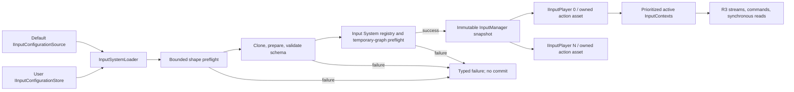

# CycloneGames.InputSystem

[English | 简体中文](README.md)

CycloneGames.InputSystem 是基于 Unity Input System 的 YAML 驱动输入层。它在提交前验证配置，为每个本地玩家创建独立的输入服务，通过优先级映射上下文路由 action，提供 R3 数据流、同步读取，并为配置和绑定 profile 持久化提供显式边界。

## 目录

- [概述](#概述)
- [架构](#架构)
- [快速开始](#快速开始)
- [核心概念](#核心概念)
- [使用指南](#使用指南)
- [进阶主题](#进阶主题)
- [常见场景](#常见场景)
- [性能与内存](#性能与内存)
- [故障排除](#故障排除)

## 概述

本模块将 authoring（在 Input System Editor 中编辑 YAML 配置）与 runtime dispatch（`InputManager` 验证并提交不可变快照）以及 per-player delivery（`IInputPlayer` 持有 `InputUser`、action asset、active context 与 R3 stream）三者分离。Owner 在 YAML 中定义 context、action、binding、composite、interaction、processor 与 control scheme；manager 在提交前根据当前 Unity Input System registry 验证这些定义；每个 joined player 获得一份独立构建的 action asset。

适用于需要可审阅的 YAML authoring、有界验证、per-player `InputUser` 与设备所有权（本地多人）、优先级 context（Gameplay、Vehicle、Menu、Modal）、事件驱动和轮询读取、长按进度和和 chord、具有版本化模块自有 JSON profile 的运行时 rebind、以及显式配置 source 和 store 的产品。

### 核心特性

- **已验证的 YAML authoring**：有界形状预检、schema validation、以及提交前的 Unity Input System registry/graph preflight。
- **Per-player ownership**：每个 joined player 获得自己的 `InputUser`、action asset、context、stream 和 binding override。
- **优先级映射 context**：`InputContext` 支持 priority 和 `BlocksLowerPriority`；capture 和全局 blocking scope。
- **R3 stream 和同步读取**：`GetButtonObservable`、`GetVector2Observable`、`GetScalarObservable`、`TryReadValue<T>`、长按进度和 chord。
- **Context-qualified identity**：`InputHashUtility.GetActionId(context, map, action)` 生成确定性 FNV-1a 32 位 hash。
- **运行时 rebind**：`RebindAction` 应用选定路径；per-player 和 manager 级 JSON profile，支持 import/export 和有界预算。
- **显式配置存储**：`IInputConfigurationSource`（读取）和 `IInputConfigurationStore`（读/写/删除）；内置 `UriInputConfigurationSource` 和 `FileInputConfigurationStore`。
- **Editor 工具和代码生成**：Input System Editor 窗口、validation、确定性 `InputActions.cs` 生成，含 context-qualified action ID。
- **可选集成**：UGUI adapter、VContainer composition、AssetManagement 支持的 package loading、诊断 `InputRecorder`/`InputReplayCursor`。

## 架构

| Assembly | Path | 用途 |
| --- | --- | --- |
| `CycloneGames.InputSystem.Runtime` | `Runtime/Scripts/` | 配置、manager、player、context、响应式输入、存储边界。依赖 Unity Input System、UniTask、R3、VYaml、CycloneGames.Hash、Logger。 |
| `CycloneGames.InputSystem.Editor` | `Editor/` | YAML authoring、validation、安全写入、常量生成。仅 Editor。 |
| `CycloneGames.InputSystem.Runtime.Integrations.UGUI` | `Runtime/Scripts/Integrations/UGUI/` | `InputDeviceIconSet`、`InputDeviceIconSwitcher`、菜单导航组件。`autoReferenced: false`。 |
| `CycloneGames.InputSystem.Runtime.Integrations.VContainer` | `Runtime/Scripts/Integrations/DI/VContainer/Base/` | 容器持有的 manager、async startup、resolver adapter。无 AssetManagement 依赖。 |
| `CycloneGames.InputSystem.Runtime.Integrations.VContainer.AssetManagement` | sibling package | Package-configuration loader adapter；由 `CycloneGames.InputSystem.AssetManagement` 提供。 |
| `CycloneGames.InputSystem.Tools.Runtime` | `Runtime/Tools/` | `InputRecorder` 和 `InputReplayCursor` 诊断工具。 |
| `CycloneGames.InputSystem.Sample` | `Samples/` | 可选的 scene 和 bootstrap 示例。 |
| `CycloneGames.InputSystem.Tests.Editor` | `Tests/Editor/` | EditMode validation 和回归覆盖。 |

可选 assembly 设置 `autoReferenced: false`。仅在用到对应功能时添加显式 asmdef 引用。UGUI 和 VContainer 使用 package 派生的 `versionDefines` 和 `defineConstraints` 激活；缺少对应 package 时排除该 assembly。AssetManagement 支持物理上位于同级 `CycloneGames.InputSystem.AssetManagement` package 中。



初始化路径是事务性的：先执行有界形状预检再 clone，然后对 clone 进行 schema preparation 和语义 validation。在 Unity main thread 上根据当前 Input System registry 验证 layout、path、interaction、processor、composite 和 control scheme，构建并解析临时 action graph，然后释放这些 graph。只有成功的 preflight 才允许 immutable runtime snapshot 生效。之后每个 joined player 会收到一份独立构建的 action asset。

## 快速开始

打开 `Tools > CycloneGames > Input System Editor` 生成或编辑配置。模块不要求 `Assets/StreamingAssets` 下有项目级默认文件。产品 composition root 决定配置来自 serialized `TextAsset`、StreamingAssets、asset package、有界远程 source、user store 还是显式 in-memory content。

最简单的 scene 级集成使用 serialized `TextAsset` 直接提供已验证的 YAML：

```csharp
using CycloneGames.InputSystem.Runtime;
using UnityEngine;

public sealed class PlayerInputBootstrap : MonoBehaviour
{
    [SerializeField] private TextAsset _configuration;

    private InputManager _manager;
    private InputContext _gameplay;

    private void Awake()
    {
        _manager = new InputManager();
        InputManagerInitializationResult initialized =
            _manager.InitializeWithResult(_configuration.text);

        if (!initialized.IsSuccess)
        {
            Debug.LogError($"Input initialization failed: {initialized.Status}: {initialized.Message}");
            enabled = false;
            return;
        }

        IInputPlayer player = _manager.JoinSinglePlayer(0);
        if (player == null)
        {
            Debug.LogError("No declared control scheme can be matched for player 0.");
            enabled = false;
            return;
        }

        _gameplay = new InputContext("PlayerActions", "Gameplay")
            .AddBinding(
                player.GetVector2Observable("Gameplay", "PlayerActions", "Move"),
                new MoveCommand(OnMove));

        player.PushContext(_gameplay);
    }

    private void OnMove(Vector2 direction)
    {
        // Forward the value to a gameplay-owned movement service.
    }

    private void OnDestroy()
    {
        _gameplay?.Dispose();
        _manager?.Dispose();
    }
}
```

`InputManager` 的 owner 应在 composition root 中显式持有。`InputManager.Instance` 是全局入口；显式构造使 shutdown、测试、多 scope 和 DI ownership 更为清晰。已 dispose 的 manager 不能再次初始化，应构造新实例。配置定义了可用 context 但不推送 gameplay state —— 在对应产品状态开始时创建并 push `InputContext` 对象。

更多内容参见 [Documents~](Documents~/GettingStarted.md) 文件夹。

## 核心概念

| 概念 | 表示形式 | 职责 |
| --- | --- | --- |
| Action | `ActionBindingConfig` 和内部 Unity `InputAction` | 为一个或多个 binding 赋予逻辑名称和值类型。 |
| Mapping Context | YAML `ContextDefinitionConfig` 加 runtime `InputContext` | 按优先级和低优先级阻止策略组织 action 和 command binding。 |
| Interaction | Action 级 `interactions` | 使用 Unity Input System interaction 语法决定 action 何时 started、performed 或 cancelled。composite part 的 interaction 会被拒绝；将表达式放在 action 上。 |
| Processor | `processors` 或 composite-part `processors` | 使用 Unity Input System processor 语法在 consumer 读取前转换值。 |
| Composite | `CompositeBindingConfig` | 从命名 part 构建如 `2DVector` 等值，无需将 composite 编码为 control path。 |
| Control Scheme | `ControlSchemeConfig` | 声明 binding group 及必需、可选或替代 device layout 用于匹配。 |
| Player | `IInputPlayer` 由 `InputUser` 支持 | 持有配对设备、内部 action asset、active context、stream 和 binding override。 |
| Binding Profile | `InputBindingOverrideProfile` 或 per-player override JSON | 独立于配置存储，持久化稳定的 context/map/action binding selector。 |

[Unity Input System 手册](https://docs.unity3d.com/Manual/com.unity.inputsystem.html) 是底层 Unity action、binding、interaction、processor 和 device 语义的权威参考。

### Mapping context 仲裁

`PushContext` 将 runtime context 放入普通 context set 中。Active normal context 按降序 priority 排序；相同 priority 保持栈顺序。Evaluation 从该顺序的顶部开始，直到某个 active context 的 `BlocksLowerPriority` 为 `true`。这使得非阻塞 overlay 可以与 Gameplay 共存，而 Menu 可以阻止 Gameplay。

双参数 `InputContext(actionMapName, name)` 构造从匹配的 YAML context 获取 priority 和 blocking policy。四参数构造提供显式 runtime policy：

```csharp
var gameplay = new InputContext("PlayerActions", "Gameplay");
var menu = new InputContext("UIActions", "Menu", priority: 100, blocksLowerPriority: true);
```

名称区分大小写。

### Capture 和全局 blocking

`CaptureContext` 临时选择一个 capture context 排在所有 normal context 之前。它返回幂等的 `IDisposable`；dispose scope 后揭示下一个 capture 或 normal priority set。

`BlockInputScope` 禁用 player 的所有 action map，同样返回幂等 scope。block 按深度计数，只有所有匹配 scope 或 `UnblockInput` 调用都释放后输入才会恢复。异步加载和转场场景优先使用 scoped form。

```csharp
using IDisposable modalCapture = player.CaptureContext(modalContext);
using IDisposable loadingBlock = player.BlockInputScope();
```

不要保留 scope 超出其持有流程的声明周期，并在 Unity main thread 上 dispose。

### Event stream、polling 和读取

`EventDriven` 值 action 在 performed 时发射，cancel 时发射中性值。`Polling` `Vector2` 和 `Float` action 在 map enabled 时由 player 的单个 update pump 读取。需要连续采样的值用 polling，离散状态变化用 event-driven。每个 subscription 需要可见的 lifetime；由 `InputContext`、`CompositeDisposable` 或 owning component 负责 dispose。

生成或计算出的 action ID 避免重复 string lookup 并包含 context identity：

```csharp
int moveId = InputHashUtility.GetActionId("Gameplay", "PlayerActions", "Move");
player.GetVector2Observable(moveId).Subscribe(MoveCharacter);

if (player.TryReadValue(moveId, out Vector2 move))
{
    ApplyMove(move);
}
```

简短的 action-only 和 map/action 重载仍可用，但在请求 identity 不明确时返回空 observable。Context-qualified API 是稳定选择。

## 使用指南

### Context、priority、capture 和 blocking

Push context 前先绑定 command。Context 持有 command mapping；player 持有该 context active 期间的 live subscription。

```csharp
InputContext gameplay = new InputContext("PlayerActions", "Gameplay")
    .AddBinding(
        player.GetVector2Observable("Gameplay", "PlayerActions", "Move"),
        new MoveCommand(MoveCharacter))
    .AddBinding(
        player.GetButtonObservable("Gameplay", "PlayerActions", "Confirm"),
        new ActionCommand(Confirm));

InputContext menu = new InputContext("UIActions", "Menu")
    .AddBinding(
        player.GetVector2Observable("Menu", "UIActions", "Navigate"),
        new MoveCommand(NavigateMenu));

player.PushContext(gameplay);
player.PushContext(menu); // YAML priority 100 和 blocking policy 使 Menu 成为权威。

player.RemoveContext(menu); // Gameplay 恢复 active。
gameplay.Dispose();
menu.Dispose();
```

`ActiveContextName` 报告最高 active context。产品状态应作为推送哪些 context 的事实来源。

Context stack/capture 变更先提交 model，再重建 Unity action-map projection。如果 map enablement 或自定义 observable subscription 抛出异常，model 变更保持提交，所有 projected map/subscription 故障关闭，`ActiveContextName` 被清空，发起 API 重新抛出。移除失败的 binding/subscriber，然后调用 `RefreshActiveContext()` 重试。同步重入刷新被合并，上限 16 次；超过上限也会禁用输入而非让 main thread 自旋。

### 本地多人和设备 ownership

| API | 设备策略 | 典型用途 |
| --- | --- | --- |
| `JoinSinglePlayer` / `JoinSinglePlayerAsync` | 从 unclaimed device 匹配首选再剩余 control scheme。 | 标准本地 player 创建。 |
| `JoinPlayerAndLockDevice` | 要求提供设备参与有效 declared scheme；声明所有匹配 scheme device。 | 用户从已知 gamepad 加入。 |
| `JoinPlayerOnSharedDevice` | 配对当前键盘，存在 mouse 时配对 mouse，不独占声明。 | 明确的共享键盘模式。 |
| `StartListeningForPlayers` | 合并配置的 join path。在 locking mode 中，执行 join binding 的设备创建 primary player 或仅在其 layout 为该 slot 声明时配对到已有 player。 | Lobby join flow。 |
| `RemovePlayer` | Dispose player、unpair 其 `InputUser`、释放声明。 | 离开、slot reset 或重新初始化前关闭。 |

Async 重载接受 `CancellationToken`。单 player 超时返回 `null`；caller cancellation 被传播。Batch aggregate timeout 或 manager shutdown 返回成功 joined 前缀。Caller cancellation 仅回滚该 batch 创建的 player，保留已有 registration，然后抛出。Join 方法对已注册 player ID 幂等，返回该 player。

Control-scheme 匹配由 `deviceRequirements` 驱动。`isOptional` 允许缺失设备。`isOr` 按 Unity Input System scheme 顺序表达替代要求。Binding 应使用同一 player slot 声明的 group。如未声明 scheme，从 configured direct 和 composite-part path 派生的 layout 作为替代：选择首个可声明的匹配 device。当选中的 device 是 keyboard 或 mouse 时，另一个可声明的 keyboard/mouse 设备作为 companion 加入。推荐使用显式 scheme，因为可审计。

每个 player 暴露配对设备生命周期变化：

```csharp
private void ObserveDevices(IInputPlayer player)
{
    player.OnDeviceStatusChanged += status =>
    {
        switch (status.ChangeKind)
        {
            case InputPlayerDeviceChangeKind.Lost:
                PauseForMissingDevice(status.DeviceId);
                break;
            case InputPlayerDeviceChangeKind.Regained:
                ResumeAfterDeviceReturn(status.DeviceId);
                break;
            case InputPlayerDeviceChangeKind.Paired:
            case InputPlayerDeviceChangeKind.Unpaired:
                RefreshDevicePresentation(status.DeviceKind, status.Layout);
                break;
        }
    };
}
```

`ActiveDeviceKind` 在观察到有意义 action 活动时变化；用于 glyph 展示。

### Interaction、processor、long press 和 chord

Action-level `interactions` 和 `processors` 在创建内部 action 时转发给 Unity Input System。Composite part 可添加 `processors`；part-level `interactions` 会被拒绝。初始化 preflight 根据当前注册的 Unity Input System 环境解析 expression name/参数、layout、control path、composite 和 composite part。在调用 `InitializeWithResult` 或 `ReinitializeWithResult` 之前注册产品定义的 layout、interaction、processor 和 composite。

模块的 long-press completion stream 支持 `Button` 和 `Float`，由 `longPressMs > 0` 启用，与 Unity `hold(...)` interaction 独立。长按进度仅适用于 `Button` action：

```csharp
player.GetLongPressObservable("Gameplay", "PlayerActions", "Confirm")
    .Subscribe(_ => OpenConfirmDetails());

player.GetLongPressProgressObservable("Gameplay", "PlayerActions", "Confirm")
    .Subscribe(progress => UpdateHoldMeter(progress));
```

Button 进度在按下期间为 `0..1`。未完成释放时发射 `-1`。对于 `Float` 长按，`longPressValueThreshold` 必须在 `(0,1]` 且有限；长按禁用时接受范围为 `0..1`。

Chord 需要两个已配置的 button action。名称可能复用时使用 context-qualified ID：

```csharp
int first = InputHashUtility.GetActionId("Gameplay", "PlayerActions", "Confirm");
int second = InputHashUtility.GetActionId("Gameplay", "PlayerActions", "Cancel");

player.GetChordObservable(first, second, windowMs: 200f)
    .Subscribe(_ => OpenShortcut());
```

Chord stream 在请求窗口内识别两次按下，释放后重置。

### Rebind 和 binding profile

Rebind 操作 player 内部 Unity action。推荐使用 context-qualified 重载并传入原始配置路径：

```csharp
bool changed = player.RebindAction(
    "Gameplay", "PlayerActions", "Confirm",
    "<Keyboard>/space",
    "<Keyboard>/f");

string[] effectivePaths = player.GetActionBindings("Gameplay", "PlayerActions", "Confirm");

player.ResetActionBinding("Gameplay", "PlayerActions", "Confirm");
player.ResetAllActionBindings();
```

此 API 应用已选定的路径。产品拥有的 rebind UI 负责捕获候选 control、执行保留键和可访问性策略、与当前有效路径比较、向用户询问冲突解决方案，最后应用 override。`CheckBindingConflicts` 是 configured direct binding 的 authoring diagnostic；不评估待定候选或 runtime override。

Per-player JSON 使用模块自有 schema，含 context/map/action identity 加 binding ordinal 和原始 binding metadata。Import 先分段验证文档再替换 active override。Per-player document 上限 128 条 override record 和 1 MiB strict UTF-8。Manager profile 聚合 per-player JSON，总预算 4 MiB，可在 player join 前 import；待处理条目在 player 构造时应用。

Binding-profile 持久化属于产品 composition root。使用 `CycloneGames.Persistence` 时，注入产品选择的 `IPersistenceStorage` 和 `IPersistenceCodec<string>`，然后将导出的 profile 作为 opaque JSON 存储。Codec 可以将字符串编码为 strict UTF-8，但不能解析或重写 InputSystem schema。`InputManager` 是唯一的 profile validator。

以下类属于产品代码或产品自有 integration assembly：

```csharp
using System.Threading;
using System.Threading.Tasks;
using CycloneGames.InputSystem.Runtime;
using CycloneGames.Persistence;

public sealed class InputBindingProfilePersistence
{
    private const int StoredContentVersion = 1;
    private const int MaximumPayloadBytes = 1024 * 1024;

    private readonly InputManager _manager;
    private readonly PersistenceStore<string> _store;

    public InputBindingProfilePersistence(
        InputManager manager,
        IPersistenceStorage storage,
        IPersistenceCodec<string> strictUtf8Codec)
    {
        _manager = manager;
        _store = new PersistenceStore<string>(
            storage,
            new PersistenceProfile<string>(
                strictUtf8Codec,
                new PersistenceLimits(MaximumPayloadBytes)));
    }

    public async Task<PersistenceOperationResult> SaveAsync(
        CancellationToken cancellationToken)
    {
        string opaqueJson = _manager.ExportBindingOverrideProfileJson();
        return await _store.SaveAsync(
            in opaqueJson,
            StoredContentVersion,
            cancellationToken);
    }

    public async Task<string> LoadAndApplyAsync(CancellationToken cancellationToken)
    {
        PersistenceLoadResult<string> loaded = await _store.LoadAsync(
            StoredContentVersion,
            cancellationToken);
        if (loaded.Status == PersistenceLoadStatus.Missing)
            return null;

        if (!loaded.IsSuccess)
            return loaded.ErrorCode.ToString();

        if (!_manager.ImportBindingOverrideProfileJson(loaded.Value))
            return "The binding profile does not match the active input configuration.";

        return null;
    }
}
```

在 composition root 构造一次，player join 前加载，仅在显式 settings commit 或生命周期检查点保存。预算耗尽是可预期失败路径时使用 `TryExportBindingOverridesJson` 或 `TryExportBindingOverrideProfile`。Profile JSON 包含输入偏好而非敏感信息，但其存储、账户关联、保留、完整性、加密和平台提供者仍属于产品 save policy。

### 配置加载和持久化

`IInputConfigurationSource` 为只读。`IInputConfigurationStore` 增加 save 和 delete。`FileInputConfigurationStore` 接受固定 root 和相对 Unicode Form C 的逻辑 key。`/` 是唯一的逻辑段分隔符；`\` 被拒绝。Store 拒绝 rooted path、URI、traversal、不安全字符、以及在操作边界包含可检测符号链接或 reparse point 的路径，限制 strict UTF-8 content，通过临时文件写入，并保留一个固定 `.bak` 用于恢复。

`UriInputConfigurationSource` 从本地 `StreamingAssets`、Android `jar:file`、same-origin StreamingAssets web URL 或显式提供给 allowlist 的 HTTPS host 读取默认配置。逻辑 URI 上限 4,096 字符。HTTPS allowlist 最多接受 64 个有界 DNS/IPv4 host，每个不超过 253 字符。本地路径必须保持在 `StreamingAssets` 内。Allowlisted HTTPS endpoint 必须使用 port 443 且不含凭据或 fragment。Redirect 被禁用，读取有 byte budget 和 timeout。

```csharp
using System.IO;
using CycloneGames.InputSystem.Runtime;
using UnityEngine;

var manager = new InputManager();
var defaults = new UriInputConfigurationSource();
var users = new FileInputConfigurationStore(Application.persistentDataPath);

string defaultUri = Path.Combine(Application.streamingAssetsPath, "input_config.yaml");
InputSystemLoadResult load = await InputSystemLoader.LoadAndInitializeAsync(
    new InputSystemBootstrapOptions(
        InputSystemBootstrapMode.Optional,
        defaults,
        defaultUri,
        users,
        "input/user_input_settings.yaml",
        persistDefaultToUser: true),
    manager,
    forceReinitialize: false,
    cancellationToken: cancellationToken);

if (!load.IsBootstrapComplete)
{
    Debug.LogError($"Input load failed: {load.Status}: {load.Error}");
}
```

`Disabled`：不执行读取。`Optional`：user 和 default content 都缺失时返回 `NotConfigured`。`Required`：无可用配置时报告 `DefaultConfigurationUnavailable`。User file 有效时直接使用。缺失时使用已验证的 default 并复制到 user store。存在但无效时保留并暂用有效 default。主文件缺失但 `.bak` 可读时 store 报告 backup recovery。只有在 schema validation 和 Input System preflight 都成功后配置才会被 commit。

更换配置需要生命周期决策。`ReinitializeWithResult` 在 player 活跃时拒绝替换。移除 player、释放 context、reinitialize，然后重建 player service 并重新应用已接受的 binding profile。Reinitialize 失败时保留当前已提交的配置。

## 进阶主题

### 配置参考

| 层级 | 字段 | 含义 |
| --- | --- | --- |
| Root | `schemaVersion` | Runtime schema 权威。新文件使用值 `1` 编写。 |
| Root | `schemaFingerprint` | 可选 Editor diagnostic。不批准也不拒绝 runtime data。 |
| Root | `joinAction` | 可选共享 join binding。Player-slot join binding 也会考虑。 |
| Root | `playerSlots` | 经过验证的 player template，由唯一非负 `playerId` 标识。 |
| Player | `controlSchemes` | 可选确定性设备匹配 scheme。 |
| Player | `defaultControlScheme` | 首选 scheme；无法匹配时尝试其他声明的 scheme。 |
| Player | `contexts` | 该 player 的命名 mapping context。 |
| Context | `name`、`actionMap` | Context identity 和公开 action-map identity。 |
| Context | `priority` | 值越高优先考虑。默认限制接受 `-100000..100000`。 |
| Context | `blocksLowerPriority` | `true` 时阻止低于此 context 的 activation。 |
| Action | `type` | `Button`、`Vector2` 或 `Float`。 |
| Action | `action` | 逻辑 action 名称。Context、map 和 action 构成稳定 identity。 |
| Action | `expectedControlType` | Unity 预期 control layout（`Button`、`Vector2`、`Axis`）。 |
| Action | `deviceBindings` | 直接 Unity control path。 |
| Action | `compositeBindings` | 结构化 composite name、parameters、groups 和 parts。 |
| Action | `bindingGroups` | 分号分隔的 control-scheme binding group。 |
| Action | `interactions`、`processors` | 应用于 action 的 Unity Input System 表达式。 |
| Composite part | `name`、`path`、`processors` | Named part control path，可选 part-local processor。非空 part `interactions` 值被拒绝。 |
| Action | `updateMode` | `EventDriven` 或 `Polling`。Delta path 视为 polling。 |
| Action | `longPressMs` | `Button` 或 `Float` 的模块级长按完成时长；`0` 禁用。 |
| Action | `longPressValueThreshold` | `Float` actuation threshold。Float 长按启用时必须在 `(0,1]`；长按禁用时可为 `0..1`。 |

`deviceBindings` 仅包含直接 control path。Composite 必须使用 `compositeBindings`；不要将 `2DVector(...)` 放在 `deviceBindings` 中。Composite `parameters` 省略外层括号。Composite part 仅支持 `processors`；非空 part `interactions` 值导致 validation 失败。将 interaction 放在包含的 action 上。

### Validation 预算

默认 validation budget：8 players、每 player 32 contexts、每 context 128 actions、每 player 1,024 total actions、每 action 16 total direct/composite-part binding entries、每 action 16 composites、每 composite 16 parts、每 player 16 control schemes、每 scheme 16 device requirements、每技术字符串 256 字符。可在 `InputManager` 构造注入更严格的 `InputConfigurationLimits`。

VYaml materialization 前，runtime 和 Editor YAML 入口还将输入限制为 1 MiB strict UTF-8 without BOM、16,384 lines、4,096 characters/line、64 indentation spaces、65,536 structural tokens、nesting depth 64。YAML anchor、alias、explicit tag、directive/document marker、block scalar、tab indentation、禁止的 control/format/private-use character、以及非 CR/LF 行分隔符不在此严格子集中。

### Editor 工作流和代码生成

打开 `Tools > CycloneGames > Input System Editor`。左侧 project-settings panel 显示 runtime 和代码生成路径，提供 reveal/ping 快捷方式。右侧 workspace 将 serialized configuration 与文件操作分离。彩色徽章区分 editable、valid、review、invalid 和 optional 状态。Validation error 阻止 persistence 但不禁用 working-copy 字段。

1. 在 `Assets` 下选择 default-config folder；文件名为 `input_config.yaml`。
2. 在 `Application.persistentDataPath` 下选择可选相对 user-config subdirectory。
3. Load user 或 default file，或 generate 默认 working configuration。
4. 编辑 join action、player slot、control scheme、context、direct binding、composite、interaction、processor、priority 和 blocking policy。
5. 保存前解决 validation error。
6. 根据目标 owner 使用 `Save User Config`、`Save User + Generate Code`、`Save Project Default` 或 `Restore User from Default`。
7. 在 `Assets` 下选择 codegen folder 和 namespace，然后 generate `InputActions.cs`。

Editor 使用隐藏的 in-memory `ScriptableObject` working copy 和 `SerializedObject`/`SerializedProperty`，因此 Undo/Redo 和 serialized-field 处理在 Editor path 中。

生成的代码包含 `InputActions.Contexts`、`InputActions.ActionMaps` 和 `InputActions.Actions` 下的 context-qualified ID。每个 signed `int` action ID 是 `context/map/action` 的确定性 FNV-1a 32 位 hash。Context、map 或 action identity 变更后应重新生成。

### 可选集成

**UGUI** — 添加 asmdef 引用到 `CycloneGames.InputSystem.Runtime.Integrations.UGUI`，使用 `InputDeviceIconSet`、`InputDeviceIconSwitcher` 和 horizontal/vertical menu-navigation 组件。Assembly 仅拥有 presentation adapter；core runtime 不引用 UGUI。

**VContainer** — 基础集成注册容器持有的 `InputManager`、`IInputPlayerResolver`、`IInputSystemInitializer`、diagnostics，以及 auto-initialization enabled 时的 `IAsyncStartable`。向 `InputSystemVContainerInstaller` 传入显式 `InputSystemBootstrapOptions`；`Optional` 和 `Disabled` 在 auto-start 时不抛出异常。该 scope 中所有 consumer 必须 resolve/inject 相同的 manager；同时使用 `InputManager.Instance` 会创建独立 session。

AssetManagement-backed package loading 需要安装同级 `CycloneGames.InputSystem.AssetManagement` package 并引用 `CycloneGames.InputSystem.Runtime.Integrations.VContainer.AssetManagement`：

```csharp
var packageLoader =
    InputSystemAssetManagementVContainerAdapter.CreatePackageConfigurationLoader();

builder.Install(new InputSystemVContainerInstaller(
    "input_config.yaml",
    "user_input_settings.yaml",
    packageLoader));
```

**Tools** — `CycloneGames.InputSystem.Tools.Runtime` 是可选诊断工具。`InputRecorder` 将选定的 context-qualified stream 记录到固定容量 in-memory buffer。溢出递增 `DroppedSampleCount`；录制期间永不扩展 sample buffer。`StopRecording` 创建不可变快照，`InputReplayCursor` 允许 caller 按录制的 tick/order 消费 sample。

**Sample** — Sample assembly、scene 和 fixture 是可选的，不会自动引用或添加到 Build Settings。参见 [Samples/README.md](Samples/README.md)。

### 失败模型

在操作有可恢复边界的地方，失败通过类型化 result 返回：

- `InputConfigurationReadResult` 和 `InputConfigurationStoreResult` 报告 `NotFound`、`InvalidKey`、`TooLarge`、`Unsupported`、`AccessDenied` 或 `IoError`。
- `InputSystemLoadResult` 区分 user/default success、unavailable defaults、invalid configuration 和 manager initialization failure。
- `InputManagerInitializationResult` 报告 empty content、wrong thread、active players、disposed manager、parse failure、schema validation failure 或 `InputSystemPreflightFailed`。暴露 `Validation` 以及 registry/graph preflight 执行时的 `Preflight`。
- Join 方法在 slot、device 或 scheme 无法解析时返回 `null`；caller cancellation 不转换为 success。
- Rebind/profile API 对于 unknown identity、selector mismatch、unsupported schema、duplicate entry 或 budget violation 返回 `false`。

`schemaVersion` 是权威来源。用 schema `1` 编写当前文件；负值和未来值被拒绝。Preparation 和 validation 在 clone 上操作，不重写 source file。only通过显式 Editor save 或产品自有 transaction 持久化配置，含 backup 和 rollback。

## 常见场景

### Bootstrap single player

从 serialized `TextAsset` 构造 `InputManager`，用最佳匹配 control scheme join player 0，push Gameplay context（参见[快速开始](#快速开始)）。

### 本地多人 with device locking

本地合作游戏使用 `JoinPlayerAndLockDevice` 从已知 gamepad join 每个 player，或使用 `StartListeningForPlayers(lockDeviceOnJoin: true)` 让每个 unclaimed device 执行其 join binding 成为 primary player。`RemovePlayer` 在离开或 slot reset 时释放声明。

```csharp
IInputPlayer player1 = manager.JoinPlayerAndLockDevice(0, gamepad1);
IInputPlayer player2 = manager.JoinPlayerAndLockDevice(1, gamepad2);
```

### Modal capture 和 input blocking

Modal dialog 在其生命周期内 capture input；loading transition 在完成前 block 所有输入：

```csharp
IDisposable capture = player.CaptureContext(modalDialogContext);
try
{
    // Drive the modal flow.
}
finally
{
    capture.Dispose();
}

using (player.BlockInputScope())
{
    // Synchronous transition。async code 在 try/finally 中持有 scope。
}
```

### Long press 和 chord

```csharp
player.GetLongPressObservable("Gameplay", "PlayerActions", "Confirm")
    .Subscribe(_ => OpenConfirmDetails());

player.GetLongPressProgressObservable("Gameplay", "PlayerActions", "Confirm")
    .Subscribe(progress => UpdateHoldMeter(progress));

int confirm = InputHashUtility.GetActionId("Gameplay", "PlayerActions", "Confirm");
int cancel = InputHashUtility.GetActionId("Gameplay", "PlayerActions", "Cancel");
player.GetChordObservable(confirm, cancel, windowMs: 200f)
    .Subscribe(_ => OpenShortcut());
```

### Rebind profile save 和 load

```csharp
PersistenceOperationResult saved = await profilePersistence.SaveAsync(cancellationToken);
if (!saved.IsSuccess)
    Debug.LogWarning($"Binding profile save failed: {saved.ErrorCode}");

string loadError = await profilePersistence.LoadAndApplyAsync(cancellationToken);
if (loadError != null)
    Debug.LogWarning($"Binding profile load failed: {loadError}");
```

加载失败时保持 configured default active。缺失数据是正常的首次运行状态；损坏、未来版本或 schema 不兼容的数据不得静默应用。不要直接暴露 persistence exception message —— 将详细异常仅发送到产品拥有的日志管道进行脱敏和访问控制。

## 性能与内存

| 领域 | Runtime behavior | 工程指导 |
| --- | --- | --- |
| 初始化 | 有界形状检查、clone/migrate/validate DTO、验证 Input System registration、构建/解析/dispose temporary action graph、提交 immutable snapshot。 | 在输入敏感帧之外、所有自定义 Input System registration 后初始化。复用已提交的 manager。 |
| Event-driven action | Action map enabled 时 Unity callback 转发到预创建的 subject。 | button 和离散值首选。Subscription callback 必须保持有界。 |
| Polling 和 hold | 每 player 一个 update subscription 服务所有 polling action 和 hold progress。 | 仅在需要连续采样时使用 `Polling`。 |
| Context 变更 | Dispose active command subscription、禁用 map、排序 active context、启用选定 map、重建 command subscription。 | 在状态转场时变更 context，不每帧变更。 |
| Rebind/profile 操作 | Export、import、conflict check、report 时遍历 binding 并分配数组/JSON。Manager import 为每个 staged player 构建并 dispose 临时 action graph。 | 在 settings/save flow 中执行，不在 gameplay hot path。 |
| 设备活动 | 使用 action activity 和 Input System device/user notification；`ActiveDeviceKind` 是展示提示。 | 如果 noisy hardware 导致快速 glyph change，debounce 产品 UI。 |
| Tools recording | 录制时固定容量 list；snapshot 创建时拷贝 sample。 | 检查 `WasTruncated`/`DroppedSampleCount`；不无意间保持 diagnostics enabled。 |

使用 Unity Profiler marker `CycloneGames.Input.Initialize`、`CycloneGames.Input.JoinPlayer` 和 `CycloneGames.Input.BuildAsset` 分析初始化和 player 构造。

### Ownership

- Composition root 持有并 dispose `InputManager`。
- Subsystem registration 使每个 still-active manager 失效，因此禁用 domain reload 的 play session 无法保留 user、action、listener 或静态 listening count；产品 owner 仍需在正常 teardown 时 dispose manager。
- `InputManager` 持有 registered player，在 removal 或 manager disposal 时 dispose 它们。
- `InputPlayer` 持有其 `InputUser`、生成的 `InputActionAsset`、subject、update subscription 和 device subscription。
- 产品状态持有 `InputContext` 实例和 capture/block scope；dispose context 会将其从所有使用它的 player 中移除。
- Subscription owner dispose 未通过 active `InputContext` 管理的 direct R3 subscription。
- Storage owner 选择 root、key、retention、encryption、backup 和 format-update policy。

### 线程

Unity API 和 player/context 操作限制在 main thread。`UriInputConfigurationSource` 在使用 `UnityWebRequest` 前切换到 Unity main thread。`FileInputConfigurationStore` 暴露异步 I/O，但不使 `InputManager`、`IInputPlayer` 或 `InputContext` 线程安全。Carry cancellation through async loading，在 manager mutation 前返回 Unity main thread，并在该线程上 dispose Unity-owned state。

### 平台支持

| 目标 | Default configuration path | User persistence | 所需验证 |
| --- | --- | --- | --- |
| Windows Editor/Player | 通过 `UriInputConfigurationSource` 的本地 `StreamingAssets` | `FileInputConfigurationStore` under `persistentDataPath` | EditMode tests、Player build、unplug/replug、filesystem fault tests。 |
| macOS Editor/Player | 本地 `StreamingAssets` file | `FileInputConfigurationStore` | Path casing、replacement/backup behavior、permissions、notarized build、device layouts。 |
| Linux Editor/Player | 本地 `StreamingAssets` file | `FileInputConfigurationStore` | Case-sensitive paths、controller layouts、filesystem semantics、headless behavior。 |
| Android | 通过 `UnityWebRequest` 的 `jar:file`/StreamingAssets | `FileInputConfigurationStore` under app persistent data | APK/AAB reads、cancellation、lifecycle resume、controller reconnect、IL2CPP。 |
| iOS | 本地 StreamingAssets URI/file path | `FileInputConfigurationStore` under app persistent data | Sandbox backup policy、atomic replacement、controller lifecycle、stripping、device suspension。 |
| WebGL | Same-origin StreamingAssets web URI | 产品提供的 `IInputConfigurationStore` | 实现有界浏览器持久化；测试 quota、corruption、format updates、refresh、cancellation。 |
| Consoles | Platform-approved source adapter 或 packaged StreamingAssets path | Platform-approved store adapter | 根据 NDA review SDK storage、suspend/resume、user ownership、controller assignment、AOT/stripping、certification。 |
| Remote HTTPS | Allowlisted HTTPS host、port 443、no credentials/fragments/redirects | 产品选择 store | Certificate policy、timeout、payload budget、offline fallback、update authenticity、rollout/rollback。 |

Input control path 和 device layout 因平台和 package version 而异。使用 Unity Input Debugger 和代表性硬件验证每个 shipped scheme。

### 持久化

| 数据 | Owner | Default path/key | 格式 | Cleanup 和 recovery |
| --- | --- | --- | --- | --- |
| Default input configuration | 产品 composition root | 产品选择 source/key；StreamingAssets 可选 | YAML、schema-versioned | 仅在变更 bootstrap policy 或提供其他验证 source 后移除。 |
| User input configuration | 产品 runtime via `IInputConfigurationStore` | `input/user_input_settings.yaml` under `persistentDataPath` | YAML 加一个同级 `.bak` | 缺失时从已验证 defaults 创建；invalid content 保留；`DeleteAsync` 移除 primary 和 `.bak`。 |
| Binding override profile | 产品 composition root | 产品选择 bound entry | 模块自有 opaque JSON、schema `1`；产品选择可选外层 Persistence Record V1 | 重置 binding 并持久化新 profile，或通过选定 provider 删除 bound entry。Per-player：128 records/1 MiB；manager：4 MiB。 |
| Editor-local settings | Input System Editor | `UserSettings/CycloneGames.InputSystem.EditorSettings.asset` | Unity serialized Editor settings | 关闭窗口并删除文件恢复默认值。 |
| Generated constants | Project/code owner | `Assets/.../InputActions.cs` | Generated C# | 从 YAML 重新生成；不手动编辑。 |

模块对这些记录不使用 `PlayerPrefs`、`EditorPrefs` 或 `SessionState`。

## 故障排除

| 症状 | 可能原因 | 解决方法 |
| --- | --- | --- |
| 初始化不成功 | Empty/oversized content、YAML parse error、schema error、invalid identity、duplicate、configured limit、unavailable Input System registration 或 graph-resolution failure | 检查 `InputManagerInitializationResult.Status`、`Message`、`Validation.Issues`、`Preflight.Issues`。在初始化前注册自定义 layout/interaction/processor/composite。 |
| Valid user settings 被忽略 | 读取或验证失败 | 检查 `InputSystemLoadResult.UserStorageStatus`；保留 user file 并与 default 比较。 |
| `JoinSinglePlayer` 返回 `null` | Unknown player ID、无成功 scheme match、所需设备缺失或设备已被声明 | 检查 Input Debugger 中的 player slot scheme 和当前已配对/保留设备。 |
| 无 action stream event | Context 未 push、context/map/action 大小写不匹配、context blocked/captured、输入全局 blocked、错误的 value getter 或 action ambiguous | 使用 context-qualified getter 并检查 `ActiveContextName`。 |
| Polling value 保持中性 | Map disabled、device not paired、binding 被 scheme 屏蔽、错误 control layout 或 value type mismatch | 验证 active context、scheme groups、paired devices 和 control path。 |
| Long-press getter empty | `longPressMs` 为 `0`、action missing 或 identity ambiguous | 启用有界 duration 并使用 context-qualified getter。 |
| Reinitialize 报告 `ActivePlayers` | Registered player 仍持有 action asset 和配置派生状态 | 移除 player 和 context，然后 reinitialize 并重建。 |
| Binding-profile import 返回 `false` | Profile schema/size invalid，或 context/map/action/binding selector 不再匹配 | 保持 configured defaults、保留 profile、提供产品自有 reset。 |
| File store 报告 `InvalidKey` | Rooted path、URI、traversal、empty segment、unsafe character 或 reparse-point path | 在 store 固定 root 下传入相对 logical key。 |
| VContainer types unavailable | Package-derived define 缺失或 consumer asmdef 缺少可选引用 | 通过项目依赖源安装 package 并添加 integration asmdef 引用。 |
| Constant generation 失败 | Invalid namespace/identifier、duplicate generated name、action-ID collision 或 unsafe output path | 修复 YAML identity 或 Editor settings；不编辑生成文件。 |

## 验证

从 Unity Test Runner 运行聚焦测试：

```text
<UnityEditor> -batchmode -nographics -projectPath <repo-root>/UnityStarter -runTests -testPlatform EditMode -assemblyNames CycloneGames.InputSystem.Tests.Editor -testResults <result-path> -quit
```

使用与 `UnityStarter/ProjectSettings/ProjectVersion.txt` 匹配的 Unity 可执行文件。通过 EditMode 运行不替代 PlayMode、Player、IL2CPP、hardware、persistence-fault 或 target-platform validation。

## API 参考

| 类型 | 用途 |
| --- | --- |
| `InputManager` | 验证/提交配置、join/remove player、listen for joins、聚合 profile、持有 player service。 |
| `InputManagerInitializationResult` | 通过 `Status`、`Validation`、`Preflight`、`WasMigrated` 检查 parse、schema validation、Input System preflight、lifecycle、preparation outcome。 |
| `InputConfigurationPreflightResult` | 通过 `Status`、有界 `Issues`、`WasTruncated` 检查 main-thread registry 和 temporary action-graph validation。 |
| `IInputPlayer` | 读取 action、管理 context、观察 device state、rebind、导入/导出 per-player override。 |
| `InputContext` | 绑定 R3 stream 到 command；提供 priority/blocking policy。 |
| `InputConfigurationValidator` / `InputConfigurationLimits` | 在显式 allocation/iteration budget 下验证 untrusted DTO。 |
| `InputConfigurationYamlPreflight` / `InputConfigurationYamlCodec` | 强制严格 pre-materialization YAML subset；将准备好的配置序列化为有界 canonical YAML。 |
| `IInputConfigurationSource` / `IInputConfigurationStore` | 实现显式 read 和 persistence adapter。 |
| `UriInputConfigurationSource` / `FileInputConfigurationStore` | 内置有界 default-source 和 root-confined local-store 实现。 |
| `InputSystemLoader` | 选择 user/default content、保留 invalid user data、仅从 validated content 初始化。 |
| `InputHashUtility` | 生成确定性 map hash 和 context-qualified action ID。 |
| `InputBindingValidator` | 检测 player 或 context 的 configured direct-binding conflict。 |
| `InputRx` | 低级 R3 wrapper，用于 keyboard、pointer、gamepad、touch、users、actions、`PlayerInput`。 |

## 参考

- [Unity Input System 手册](https://docs.unity3d.com/Manual/com.unity.inputsystem.html) — 底层 Unity action、binding、interaction、processor、device 语义
- [快速上手](Documents~/GettingStarted.SCH.md) | [配置指南](Documents~/Configuration.SCH.md) | [Runtime 指南](Documents~/RuntimeGuide.SCH.md) | [Sample](Samples/README.md)
