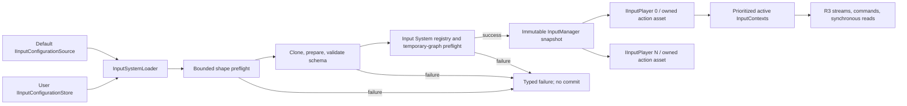

# CycloneGames.InputSystem

[English | 简体中文](README.md)

CycloneGames.InputSystem 是构建在 Unity Input System 之上的 YAML authoring 输入层。它在提交配置前执行验证，为每个本地玩家创建独立输入服务，通过带优先级的 mapping context 路由 action，并提供 R3 stream、同步读取，以及显式的配置和 binding profile 持久化边界。它是底层模块，不是玩法框架：玩法 command、UI 状态、存档策略、设备 UX、无障碍规则和平台认证仍由产品负责。

## 目录

- [概述](#概述)
- [架构](#架构)
- [快速上手](#快速上手)
- [核心概念](#核心概念)
- [使用指南](#使用指南)
- [进阶主题](#进阶主题)
- [常见场景](#常见场景)
- [性能与内存](#性能与内存)
- [故障排查](#故障排查)

## 概述

输入系统回答两个问题：玩家执行了哪个逻辑 action，以及哪个 consumer 应该处理它。CycloneGames.InputSystem 把创作（在 Input System Editor 中编辑的 YAML 配置）、运行时分发（`InputManager` 校验并提交不可变 snapshot）与每玩家交付（`IInputPlayer` 持有 `InputUser`、action asset、active context 与 R3 stream）解耦。所有者在 YAML 中创作 context、action、binding、composite、interaction、processor 与 control scheme；manager 在 commit 前针对当前 Unity Input System registry 校验它们；每个 joined player 获得独立构建的 action asset。

本模块采用 action-based input system 的常用概念（action、mapping context、interaction、processor、composite、control scheme），同时保留 Unity Input System 语义。它面向需要可审查 YAML authoring 与有预算上限的验证、面向本地多人的每玩家 `InputUser` 和设备所有权、带优先级的 context（Gameplay、Vehicle、Menu、Modal）、event-driven 与 polling value 读取、长按进度和 chord、runtime rebind 与带版本的模块自有 JSON profile，以及显式 configuration source/store 的产品。

当项目需要基于 Unity Input System 的经过校验、按玩家、按 context 路由的输入层时使用本模块。不要将其作为玩法状态机、ability system、command buffer、anti-cheat、replay simulation 或网络预测层 —— 这些职责由产品承担。cursor 外观、focus presentation、pause 策略、UI navigation 布局、账号/云同步、加密、存档槽选择、设备 glyph 资源和无障碍默认值不由本模块负责。

### 主要特性

- **经过校验的 YAML authoring**：commit 前执行有容量上限的 shape preflight、schema validation 与 Unity Input System registry/graph preflight。
- **每玩家所有权**：每个 joined player 拥有自己的 `InputUser`、action asset、context、stream 与 binding override。
- **带优先级的 mapping context**：`InputContext` 支持 priority 与 `BlocksLowerPriority`；capture 与全局 blocking scope。
- **R3 stream 与同步读取**：`GetButtonObservable`、`GetVector2Observable`、`GetScalarObservable`、`TryReadValue<T>`、长按进度与 chord。
- **Context-qualified identity**：`InputHashUtility.GetActionId(context, map, action)` 生成确定性 FNV-1a 32-bit hash；名称复用时仍无歧义。
- **Runtime rebind**：`RebindAction` 应用已选 path；每玩家与 manager 级 JSON profile，支持 import/export 与有界预算。
- **显式 configuration storage**：`IInputConfigurationSource`（读）与 `IInputConfigurationStore`（读/写/删）；内置 `UriInputConfigurationSource` 与 `FileInputConfigurationStore`。
- **Editor 工具与 codegen**：Input System Editor 窗口、validation、确定性 `InputActions.cs` 生成（含 context-qualified action ID）。
- **可选 integration**：UGUI adapter、VContainer composition、AssetManagement 支持的 package 加载、诊断 `InputRecorder`/`InputReplayCursor`。

## 架构

| 程序集 | 路径 | 用途 |
| --- | --- | --- |
| `CycloneGames.InputSystem.Runtime` | `Runtime/Scripts/` | 配置、manager、player、context、reactive input、storage boundary。依赖 Unity Input System、UniTask、R3、VYaml、CycloneGames.Hash、Logger。 |
| `CycloneGames.InputSystem.Editor` | `Editor/` | YAML authoring、validation、安全文件写入、常量生成。仅 Editor。 |
| `CycloneGames.InputSystem.Runtime.Integrations.UGUI` | `Runtime/Scripts/Integrations/UGUI/` | `InputDeviceIconSet`、`InputDeviceIconSwitcher`、menu-navigation component。`autoReferenced: false`。 |
| `CycloneGames.InputSystem.Runtime.Integrations.VContainer` | `Runtime/Scripts/Integrations/DI/VContainer/Base/` | container-owned manager、异步启动、resolver adapter。不依赖 AssetManagement。 |
| `CycloneGames.InputSystem.Runtime.Integrations.VContainer.AssetManagement` | sibling package | package-configuration loader adapter；由 `CycloneGames.InputSystem.AssetManagement` 提供。 |
| `CycloneGames.InputSystem.Tools.Runtime` | `Runtime/Tools/` | `InputRecorder` 与 `InputReplayCursor` 诊断工具。 |
| `CycloneGames.InputSystem.Sample` | `Samples/` | opt-in scene 与 bootstrap 示例。 |
| `CycloneGames.InputSystem.Tests.Editor` | `Tests/Editor/` | EditMode validation 与 regression coverage。 |

optional assembly 设置了 `autoReferenced: false`。只有使用该能力的 assembly 才应增加显式 asmdef reference。UGUI 与 VContainer 都使用 package-derived `versionDefines` 配合 `defineConstraints` 激活；缺少对应 package 时，其 assembly 会被排除。不要手动增加 PlayerSettings scripting define。AssetManagement 支持在 sibling `CycloneGames.InputSystem.AssetManagement` package 中物理隔离。



初始化路径是事务式的。系统先执行有容量上限的 shape preflight，再对 clone 执行 schema preparation 与 semantic validation。在 Unity main thread 上，它针对当前 Input System registry 验证 layout、path、interaction、processor、composite 与 control scheme，构建并解析 temporary action graph，随后 dispose 这些 graph。只有 preflight 成功后，不可变 runtime snapshot 才会成为 active configuration。每个 joined player 之后会获得独立构建且由该 player 持有的 action asset。

## 快速上手

打开 `Tools > CycloneGames > Input System Editor` 生成或编辑配置。本模块不要求 `Assets/StreamingAssets` 下的 project-owned default。产品 composition root 应明确选择 serialized `TextAsset`、StreamingAssets、asset package、有界 remote source、user store 或 in-memory content。

最短的 scene-level 接入可以通过 serialized `TextAsset` 直接提供已验证 YAML。以下 component 创建并持有 manager，使用最佳匹配的已声明 control scheme 加入 player 0，绑定 command，激活 Gameplay，并释放其持有的全部对象：

```csharp
using CycloneGames.InputSystem.Runtime;
using UnityEngine;

public sealed class PlayerInputBootstrap : MonoBehaviour
{
    [SerializeField] private TextAsset _configuration;

    private InputManager _manager;
    private InputContext _gameplay;

    private void Awake()
    {
        _manager = new InputManager();
        InputManagerInitializationResult initialized =
            _manager.InitializeWithResult(_configuration.text);

        if (!initialized.IsSuccess)
        {
            Debug.LogError($"Input initialization failed: {initialized.Status}: {initialized.Message}");
            enabled = false;
            return;
        }

        IInputPlayer player = _manager.JoinSinglePlayer(0);
        if (player == null)
        {
            Debug.LogError("No declared control scheme can be matched for player 0.");
            enabled = false;
            return;
        }

        _gameplay = new InputContext("PlayerActions", "Gameplay")
            .AddBinding(
                player.GetVector2Observable("Gameplay", "PlayerActions", "Move"),
                new MoveCommand(OnMove));

        player.PushContext(_gameplay);
    }

    private void OnMove(Vector2 direction)
    {
        // Forward the value to a gameplay-owned movement service.
    }

    private void OnDestroy()
    {
        _gameplay?.Dispose();
        _manager?.Dispose();
    }
}
```

在 composition root 中显式保留 `InputManager` owner。`InputManager.Instance` 是全局入口；显式构造能让 shutdown、test、multiple scope 与 DI ownership 更清楚。已 dispose 的 manager 不能再次初始化；应构造新实例。配置只定义可用 context，不会自动 push gameplay state —— 产品状态开始时再创建并 push 对应的 `InputContext`。

更深入的配置、runtime 与 integration 主题，参见 [Documents~](Documents~/GettingStarted.SCH.md) 目录。

## 核心概念

| 概念 | 表示 | 职责 |
| --- | --- | --- |
| Action | `ActionBindingConfig` 与内部 Unity `InputAction` | 为一个或多个 binding 提供逻辑名称和值类型。 |
| Mapping Context | YAML `ContextDefinitionConfig` 与 runtime `InputContext` | 按优先级和 lower-context blocking 策略组织 action 与 command binding。 |
| Interaction | Action 级 `interactions` | 使用 Unity Input System interaction 语法决定 action 何时 start、perform 或 cancel。Composite-part interaction 会被拒绝；expression 应配置在 action 上。 |
| Processor | `processors` 或 composite part 的 `processors` | 使用 Unity Input System processor 语法，在 consumer 读取前变换值。 |
| Composite | `CompositeBindingConfig` | 通过命名 part 构建 `2DVector` 等值，避免把 composite 编码成 control path。 |
| Control Scheme | `ControlSchemeConfig` | 声明 binding group，以及用于匹配的 required、optional 或 alternative device layout。 |
| Player | 由 `InputUser` 支撑的 `IInputPlayer` | 持有 paired device、内部 action asset、active context、stream 与 binding override。 |
| Binding Profile | `InputBindingOverrideProfile` 或每玩家 override JSON | 使用独立于配置存储的稳定 context/map/action binding selector 持久化。 |

[Unity Input System manual](https://docs.unity3d.com/Manual/com.unity.inputsystem.html) 是底层 Unity action、binding、interaction、processor 与 device 语义的权威来源。

### Mapping context 仲裁

`PushContext` 把 runtime context 放入普通 context 集合。active normal context 按优先级从高到低排序；优先级相同时保留 stack 顺序。系统从最高项向下选取 context，直到遇到 `BlocksLowerPriority` 为 `true` 的 active context。由此，non-blocking overlay 可以与 Gameplay 并存，而 Menu 可以阻断 Gameplay。

双参数 `InputContext(actionMapName, name)` constructor 从匹配的 YAML context 获取 priority 和 blocking policy。四参数 constructor 提供显式 runtime policy：

```csharp
var gameplay = new InputContext("PlayerActions", "Gameplay");
var menu = new InputContext("UIActions", "Menu", priority: 100, blocksLowerPriority: true);
```

名称采用 ordinal、case-sensitive 比较。当 action-map 名称被复用时，也必须提供准确的 context name。

### Capture 与全局 blocking

`CaptureContext` 临时选择一个优先于所有 normal context 的 capture context。它返回幂等 `IDisposable`；dispose scope 后，会恢复下一个 capture 或 normal priority set。适合已有明确 owner 的 modal dialog 生命周期。

`BlockInputScope` 禁用该玩家的全部 action map，也返回幂等 scope。block 使用 depth counter；只有所有对应 scope 或 `UnblockInput` 调用都释放后才恢复输入。异步 loading 和 transition 优先使用 scoped 形式。

```csharp
using IDisposable modalCapture = player.CaptureContext(modalContext);
using IDisposable loadingBlock = player.BlockInputScope();
```

不要让 scope 超出所属流程的生命周期，并在 Unity main thread 上 dispose。

### Event stream、polling 与读取

`EventDriven` value action 在 performed 时发出值，在 cancel 时发出 neutral value。`Polling` `Vector2` 与 `Float` action 在 map enabled 时由 player 的单一 update pump 读取。必须连续采样的值使用 polling；离散状态变化使用 event-driven。每个 subscription 仍需可见生命周期，应由 `InputContext`、`CompositeDisposable` 或 owning component dispose。

generated 或 computed action ID 可避免重复 string lookup，并包含 context identity：

```csharp
int moveId = InputHashUtility.GetActionId("Gameplay", "PlayerActions", "Move");
player.GetVector2Observable(moveId).Subscribe(MoveCharacter);

if (player.TryReadValue(moveId, out Vector2 move))
{
    ApplyMove(move);
}
```

短 action-only 与 map/action overload 仍可使用，但 identity 有歧义时返回 empty observable。context-qualified API 是稳定选择。

## 使用指南

### Context、priority、capture 与 blocking

在 push context 前绑定 command。context 持有 command mapping；context active 时，player 持有 live subscription。

```csharp
InputContext gameplay = new InputContext("PlayerActions", "Gameplay")
    .AddBinding(
        player.GetVector2Observable("Gameplay", "PlayerActions", "Move"),
        new MoveCommand(MoveCharacter))
    .AddBinding(
        player.GetButtonObservable("Gameplay", "PlayerActions", "Confirm"),
        new ActionCommand(Confirm));

InputContext menu = new InputContext("UIActions", "Menu")
    .AddBinding(
        player.GetVector2Observable("Menu", "UIActions", "Navigate"),
        new MoveCommand(NavigateMenu));

player.PushContext(gameplay);
player.PushContext(menu); // YAML priority 100 and blocking policy make Menu authoritative.

player.RemoveContext(menu); // Gameplay becomes active again.
gameplay.Dispose();
menu.Dispose();
```

`ActiveContextName` 报告最高层 active context。`OnContextChanged` 与 `ActiveContextName` 可用于 diagnostic 或 presentation，但产品状态仍应是决定 push 哪些 context 的事实来源。

Context stack/capture mutation 会先提交 model，再重建 Unity action-map projection。若 map enable 或 custom observable subscription 抛出异常，model change 保持已提交，所有 projected map/subscription 会 fail closed，`ActiveContextName` 被清空，并由发起 API 重新抛出异常。移除失败 binding/subscriber 后，显式调用 `RefreshActiveContext()` 重试。同步重入 refresh 会被合并且最多执行 16 轮；超过上限时也会禁用输入，而不是让 main thread 自旋。

### 本地多人和设备所有权

| API | 设备策略 | 常见用途 |
| --- | --- | --- |
| `JoinSinglePlayer` / `JoinSinglePlayerAsync` | 从 unclaimed device 中依次匹配 preferred scheme 和其余 control scheme。 | 标准本地玩家创建。 |
| `JoinPlayerAndLockDevice` | 要求指定设备参与一个有效已声明 scheme，并 claim 该 scheme 匹配的全部设备。 | 用户从已知 gamepad 或其他设备加入。 |
| `JoinPlayerOnSharedDevice` | 配对当前 keyboard，并在存在时配对 mouse，不执行 exclusive claim。 | 明确设计的 shared-keyboard 模式。 |
| `StartListeningForPlayers` | 合并已配置 join path。在 locking 模式下，实际触发 join binding 的设备会创建 primary player；primary player 已存在时，仅当该设备 layout 已为 slot 声明时才可配对。 | 具有显式 locking policy 的 Lobby join 流程。 |
| `RemovePlayer` | dispose player、unpair 其 `InputUser` 并释放 claim。 | 离开、slot reset 或 reinitialize 前的 shutdown。 |

async overload 接受 `CancellationToken`。单玩家 timeout 返回 `null`；caller cancellation 向上传播。batch aggregate timeout 或 manager shutdown 返回已成功 join 的 prefix。caller cancellation 则只回滚本 batch 新建的 player、保留既有 registration，然后抛出异常。对于已注册 player ID，join method 是幂等的，并返回该 player。

Control scheme matching 由 `deviceRequirements` 驱动。`isOptional` 允许设备缺失。`isOr` 按 Unity Input System scheme 顺序表达 alternative requirement。Binding 应使用同一 player slot 声明的 group。没有声明 scheme 时，从 direct binding 与 composite-part path 推导出的 layout 彼此是 alternative：系统选择第一个可 claim 的匹配设备。选中的设备是 keyboard 或 mouse 时，另一个可 claim 的 keyboard/mouse 会作为 companion 加入。显式 scheme 能让所有权更易审查，因此应优先使用。

每个 player 都会公开 paired-device lifecycle change：

```csharp
private void ObserveDevices(IInputPlayer player)
{
    player.OnDeviceStatusChanged += status =>
    {
        switch (status.ChangeKind)
        {
            case InputPlayerDeviceChangeKind.Lost:
                PauseForMissingDevice(status.DeviceId);
                break;
            case InputPlayerDeviceChangeKind.Regained:
                ResumeAfterDeviceReturn(status.DeviceId);
                break;
            case InputPlayerDeviceChangeKind.Paired:
            case InputPlayerDeviceChangeKind.Unpaired:
                RefreshDevicePresentation(status.DeviceKind, status.Layout);
                break;
        }
    };
}
```

`ActiveDeviceKind` 在观察到有意义的 action activity 时改变；它适合 glyph presentation，不应用作 ownership 或 security decision。

### Interaction、processor、长按与 chord

创建内部 action 时，action-level `interactions` 与 `processors` 会转交 Unity Input System。Composite part 可添加 `processors`；part-level `interactions` 会被拒绝。初始化 preflight 针对当前注册的 Unity Input System 环境解析 expression name/parameter、layout、control path、composite 与 composite part，并构建和 dispose temporary graph。产品自定义 registration 必须在调用 `InitializeWithResult` 或 `ReinitializeWithResult` 前完成。

模块的 long-press completion stream 支持 `Button` 与 `Float`，由 `longPressMs > 0` 启用，并与 Unity `hold(...)` interaction 相互独立。Long-press progress 只适用于 `Button` action：

```csharp
player.GetLongPressObservable("Gameplay", "PlayerActions", "Confirm")
    .Subscribe(_ => OpenConfirmDetails());

player.GetLongPressProgressObservable("Gameplay", "PlayerActions", "Confirm")
    .Subscribe(progress => UpdateHoldMeter(progress));
```

Button 按住期间 progress 为 `0..1`。完成前释放会发出 `-1`，presentation 应据此 reset。`GetPressStateObservable` 为 button action 发出 press/release state。对于 `Float` 长按，`longPressValueThreshold` 必须是有限值并位于 `(0,1]`；禁用长按时可位于 `0..1`。

Chord 要求两个已配置 button action。名称可能复用时，使用 context-qualified ID：

```csharp
int first = InputHashUtility.GetActionId("Gameplay", "PlayerActions", "Confirm");
int second = InputHashUtility.GetActionId("Gameplay", "PlayerActions", "Cancel");

player.GetChordObservable(first, second, windowMs: 200f)
    .Subscribe(_ => OpenShortcut());
```

chord stream 识别在指定窗口内的两次 press，并在 release 后 reset。它是本地 convenience signal，不是网络 combo、权威 timeline 或带 buffer 的 fighting-game command parser。

### Rebind 与 binding profile

Rebind 作用于 player 的内部 Unity action。优先使用 context-qualified overload，并用原始 configured path 标识 binding：

```csharp
bool changed = player.RebindAction(
    "Gameplay", "PlayerActions", "Confirm",
    "<Keyboard>/space",
    "<Keyboard>/f");

string[] effectivePaths = player.GetActionBindings("Gameplay", "PlayerActions", "Confirm");

player.ResetActionBinding("Gameplay", "PlayerActions", "Confirm");
player.ResetAllActionBindings();
```

该 API 应用已经选定的 path。product-owned rebind UI 需要自行捕获候选 control、执行 reserved-key 与无障碍策略、与当前 effective path 比较、询问用户冲突解决方式，然后应用 override。`CheckBindingConflicts` 是面向 configured direct binding 的 authoring diagnostic，不会评估 pending candidate 或 runtime override。

每玩家 JSON 使用模块自有 schema，包含 context/map/action identity、binding ordinal 和原始 binding metadata。Import 会先 stage 并验证 document，再替换 active override。每玩家 document 最多包含 128 条 override record，并受 1 MiB strict UTF-8 上限约束。Manager profile 在 4 MiB 总预算下聚合每玩家 JSON，并可在 player join 前 import；pending entry 会在 player construction 时应用。

```csharp
var profileStore = new FileInputConfigurationStore(Application.persistentDataPath);
const string ProfileKey = "input/binding-profile.json";

string profileJson = manager.ExportBindingOverrideProfileJson();
InputConfigurationStoreResult saved =
    await profileStore.SaveAsync(ProfileKey, profileJson, cancellationToken);

InputConfigurationReadResult loaded =
    await profileStore.LoadAsync(ProfileKey, cancellationToken);
if (loaded.IsSuccess && !manager.ImportBindingOverrideProfileJson(loaded.Content))
{
    Debug.LogWarning("The binding profile does not match this configuration.");
}
```

预算耗尽属于预期失败路径时，应使用 `TryExportBindingOverridesJson` 或 `TryExportBindingOverrideProfile`。对应 `Export...` method 超出 export budget 时会抛出 `InvalidOperationException`。不要手工编辑 JSON，也不要用 Unity generated binding-override JSON 替换；这里只接受模块自有格式。Profile JSON 保存输入偏好而非 secret，但其 storage 仍应服从产品存档策略。

### 配置加载与持久化

`IInputConfigurationSource` 只读；`IInputConfigurationStore` 增加 save 与 delete。`FileInputConfigurationStore` 接受固定 root 与相对 Unicode Form C logical key。`/` 是唯一 logical segment separator；`\` 会被拒绝，避免它在 Windows 与 Linux 上产生不同含义。store 拒绝 rooted path、URI、traversal、unsafe character，以及在操作边界检查时可检测到 symbolic link 或 reparse point 的 path；它限制 strict UTF-8 content，通过 temporary file 写入，并保留一个固定 `.bak` 用于恢复。`DeleteAsync` 先删除 recovery backup，再删除 primary。store 不会隐式选择全局目录。

`UriInputConfigurationSource` 从本地 `StreamingAssets`、Android `jar:file` location、同源 StreamingAssets web URL，或显式加入 allowlist 的 HTTPS host 读取 default。logical URI 在解析前最多允许 4,096 个字符；HTTPS allowlist 最多接受 64 个有界 DNS/IPv4 host，每个最多 253 个字符。本地路径必须保留在 `StreamingAssets` 内。allowlisted HTTPS endpoint 必须使用 443 端口，且不能包含 credential 或 fragment。它禁用 redirect，并设置 byte budget 与 timeout。任意 HTTP 会被拒绝。

```csharp
using System.IO;
using CycloneGames.InputSystem.Runtime;
using UnityEngine;

var manager = new InputManager();
var defaults = new UriInputConfigurationSource();
var users = new FileInputConfigurationStore(Application.persistentDataPath);

string defaultUri = Path.Combine(Application.streamingAssetsPath, "input_config.yaml");
InputSystemLoadResult load = await InputSystemLoader.LoadAndInitializeAsync(
    new InputSystemBootstrapOptions(
        InputSystemBootstrapMode.Optional,
        defaults,
        defaultUri,
        users,
        "input/user_input_settings.yaml",
        persistDefaultToUser: true),
    manager,
    forceReinitialize: false,
    cancellationToken: cancellationToken);

if (!load.IsBootstrapComplete)
{
    Debug.LogError($"Input load failed: {load.Status}: {load.Error}");
}
```

`Disabled` 不执行读取。`Optional` 在 user 与 default content 都缺失时返回 `NotConfigured`。`Required` 在没有可用配置时报告 `DefaultConfigurationUnavailable`。user file 有效时使用它；缺失时使用已验证 default，并复制到 user store；存在但无效时保留原文件，本次 session 使用有效 default；primary file 缺失但 `.bak` 可读时，store 会报告 backup recovery。只有 schema validation 与 Input System preflight 都成功后，配置才会 commit。

修改配置需要明确 lifecycle decision。存在 active player 时，`ReinitializeWithResult` 拒绝替换。应先 remove player、release context，再 reinitialize，然后重建 player service 并重新应用已接受的 binding profile。reinitialize 失败时保留原已提交配置。

## 进阶主题

### 配置参考

YAML technical name、enum value、control path、interaction expression 与 processor expression，在底层 API 要求时采用 case-sensitive 语义。技术内容使用普通技术标点和 UTF-8 without BOM。

| 层级 | 字段 | 含义 |
| --- | --- | --- |
| Root | `schemaVersion` | Runtime schema 权威字段。新建文件填写 `1`。 |
| Root | `schemaFingerprint` | 可选 Editor diagnostic，不负责批准或拒绝 runtime data。 |
| Root | `joinAction` | 可选共享 join binding；同时也会考虑 player-slot join binding。 |
| Root | `playerSlots` | 经过验证、以唯一非负 `playerId` 标识的 player template。 |
| Player | `controlSchemes` | 可选的确定性 device matching scheme。 |
| Player | `defaultControlScheme` | preferred scheme；匹配失败时继续尝试其他已声明 scheme。 |
| Player | `contexts` | 该玩家的 named mapping context。 |
| Context | `name`、`actionMap` | context identity 与公开 action-map identity。 |
| Context | `priority` | 值越高越先处理。默认限制接受 `-100000..100000`。 |
| Context | `blocksLowerPriority` | 为 `true` 时停止激活更低 context。 |
| Action | `type` | `Button`、`Vector2` 或 `Float`。 |
| Action | `action` | 逻辑 action name；context、map 与 action 构成稳定 identity。 |
| Action | `expectedControlType` | Unity expected control layout（`Button`、`Vector2`、`Axis`）。 |
| Action | `deviceBindings` | 直接 Unity control path。 |
| Action | `compositeBindings` | 结构化 composite name、parameter、group 与 part。 |
| Action | `bindingGroups` | 以分号分隔的 control-scheme binding group。 |
| Action | `interactions`、`processors` | 应用于 action 的 Unity Input System expression。 |
| Composite part | `name`、`path`、`processors` | named part control path 与可选的 part-local processor。非空 part `interactions` 会被拒绝。 |
| Action | `updateMode` | `EventDriven` 或 `Polling`；delta path 按 polling 处理。 |
| Action | `longPressMs` | `Button` 或 `Float` 的模块长按完成时长；`0` 禁用该 stream。 |
| Action | `longPressValueThreshold` | `Float` actuation threshold。启用 Float 长按时必须位于 `(0,1]`；禁用长按时可位于 `0..1`。 |

`deviceBindings` 只放直接 control path。composite 必须使用 `compositeBindings`；不要把 `2DVector(...)` 放入 `deviceBindings`。Composite `parameters` 不包含外层括号。Composite part 只支持 `processors`；非空 part `interactions` 会导致 validation failure。Interaction 应放在所属 action 上。完整 YAML 示例见[配置指南](Documents~/Configuration.SCH.md)。

### 验证预算

默认验证预算：8 个 player；每玩家 32 个 context；每 context 128 个 action；每玩家总计 1,024 个 action；每 action 合计 16 个 direct/composite-part binding entry；每 action 16 个 composite；每 composite 16 个 part；每玩家 16 个 control scheme；每 scheme 16 个 device requirement；每个 technical string 256 个字符。产品可以向 `InputManager` constructor 注入更严格的 `InputConfigurationLimits`。

VYaml materialization 前，runtime 与 Editor YAML entry point 还限制为 1 MiB strict UTF-8 without BOM、16,384 行、每行 4,096 字符、64 个 indentation space、65,536 个 structural token 和 64 层 nesting。YAML anchor、alias、explicit tag、directive/document marker、block scalar、tab indentation、forbidden control/format/private-use character 与非 CR/LF line separator 不属于该 strict subset。每个 mapping scope 只接受 schema 已知且唯一的 plain block-style key；quoted/explicit key、flow mapping 与非空 flow sequence 会被拒绝，`[]` 保留为受支持的空 sequence 形式。

### Editor 工作流与 code generation

打开 `Tools > CycloneGames > Input System Editor`。左侧 project-settings panel 持续展示 runtime 与 code-generation 路径，并提供 reveal/ping 快捷操作；右侧 workspace 将 serialized configuration 与文件操作分离。彩色 badge 用于区分 editable、valid、review、invalid 与 optional 状态。validation error 会阻止持久化，但不会禁用 working-copy field。

1. 选择 `Assets` 下的 default-config folder；文件名固定为 `input_config.yaml`。
2. 可选设置 `Application.persistentDataPath` 下的相对 user-config subdirectory。
3. 加载 user/default file，或生成 default working configuration。
4. 编辑 join action、player slot、control scheme、context、direct binding、composite、interaction、processor、priority 和 blocking policy。
5. 保存前解决 validation error。
6. 根据 owner 选择 `Save User Config`、`Save User + Generate Code`、`Save Project Default` 或 `Restore User from Default`。
7. 选择 `Assets` 下的 codegen folder 和 namespace，再生成 `InputActions.cs`。

Editor 使用隐藏的 in-memory `ScriptableObject` working copy，以及 `SerializedObject`/`SerializedProperty`，因此 Undo/Redo 和 serialized-field 处理均位于 Editor 路径。它只在 working copy dirty 时验证；限制 output path；执行 transactional write；仅 import 受影响 asset，而不刷新整个项目。

Generated code 包含 `InputActions.Contexts`、`InputActions.ActionMaps`，以及 `InputActions.Actions` 下的 context-qualified ID。每个 signed `int` action ID 都是 `context/map/action` 的确定性 FNV-1a 32-bit hash；出现负数只是 signed representation，且每条 generated declaration 都会用注释标出其 source path。检测到 collision 时 generation 会失败。Generated ID 只对应已接受的准确 YAML。context、map 或 action identity 改变后应重新生成并 compile。

### 可选 integration

**UGUI** —— 为使用 `InputDeviceIconSet`、`InputDeviceIconSwitcher` 和横向/纵向 menu-navigation component 的 asmdef 增加 `CycloneGames.InputSystem.Runtime.Integrations.UGUI` reference。该 assembly 只持有 presentation adapter；core runtime 不引用 UGUI。安装 UGUI 时，package-derived `com.unity.ugui` version define 会满足 assembly constraint；不要手动定义 `CYCLONEGAMES_INPUTSYSTEM_HAS_UGUI`。

**VContainer** —— 启用 auto-initialization 时，基础 integration 注册 container-owned `InputManager`、`IInputPlayerResolver`、`IInputSystemInitializer`、diagnostics 与 `IAsyncStartable`。向 `InputSystemVContainerInstaller` 传入显式 `InputSystemBootstrapOptions`；`Optional` 与 `Disabled` 会完成 auto-start 而不抛出异常。该 scope 的全部 consumer 必须 resolve/inject 同一个 manager；同时使用 `InputManager.Instance` 会创建另一个 session。assembly 由 package-derived `VCONTAINER_PRESENT` define 激活；不要手工增加 symbol。基础 integration 不引用 AssetManagement。

通过 AssetManagement package 加载配置时，必须显式安装 sibling `CycloneGames.InputSystem.AssetManagement` package，并引用 `CycloneGames.InputSystem.Runtime.Integrations.VContainer.AssetManagement`：

```csharp
var packageLoader =
    InputSystemAssetManagementVContainerAdapter.CreatePackageConfigurationLoader();

builder.Install(new InputSystemVContainerInstaller(
    "input_config.yaml",
    "user_input_settings.yaml",
    packageLoader));
```

没有该 delegate 时，`ReinitializeFromPackageAsync` 会报告未注册 package loader。`configLocation` 是由 application 控制的 provider-specific catalog key；不得直接传入 remote configuration、CLI、save data 或其他 user input。composition root 必须按所选 provider 进行 canonicalization 与 allowlist 校验。helper 默认的 1 MiB 限制是 acquisition 完成后的 acceptance/copy limit；它不约束 provider catalog lookup、download、decompression、cache、native allocation 或 disk materialization。

**Tools** —— `CycloneGames.InputSystem.Tools.Runtime` 是 opt-in diagnostic tooling。`InputRecorder` 把选定的 context-qualified stream 记录到固定容量的 in-memory buffer。overflow 增加 `DroppedSampleCount`；recording 期间 sample buffer 不会增长。`StopRecording` 创建 immutable snapshot，`InputReplayCursor` 允许 caller 按 recorded tick/order 消费 sample。Recorder 不会把 event 注回 Unity Input System，不复现 physics，不保证 cross-build determinism，也不提供权威 replay/anti-cheat pipeline。

**Sample** —— sample assembly、scene 与 fixture 均为 opt-in，不会自动 reference，也不会加入 Build Settings。参见 [Samples/README.SCH.md](Samples/README.SCH.md)。

### 失败模型与 schema 规则

具有 recoverable boundary 的 operation 尽量返回 typed result：

- `InputConfigurationReadResult` 与 `InputConfigurationStoreResult` 报告 `NotFound`、`InvalidKey`、`TooLarge`、`Unsupported`、`AccessDenied` 或 `IoError`。
- `InputSystemLoadResult` 区分 user/default success、default unavailable、configuration invalid 与 manager initialization failure。
- `InputManagerInitializationResult` 报告 empty content、wrong thread、active player、disposed manager、parse failure、schema validation failure 或 `InputSystemPreflightFailed`。它公开 `Validation`，并在执行 registry/graph preflight 后公开 `Preflight`。
- slot、device 或 scheme 无法解析时，join method 返回 `null`；caller cancellation 不会被转换为成功。
- identity 未知、selector mismatch、schema 不受支持、entry 重复或超出预算时，rebind/profile API 返回 `false`。

`schemaVersion` 是权威字段。当前文件应填写 schema `1`；negative 与 future value 会被拒绝。Preparation 与 validation 在 clone 上执行，不会重写 source file。只有通过显式 Editor save，或带 backup/rollback 的 product-owned transaction，才能持久化配置。`schemaFingerprint` 是可选 Editor diagnostic metadata；mismatch 可提示 review，但不能单独批准或拒绝 runtime data。

## 常见场景

### 单玩家 bootstrap

单玩家游戏从 serialized `TextAsset` 构造 `InputManager`，用最佳匹配的 control scheme 加入 player 0，并 push Gameplay context（见 [快速上手](#快速上手)）。

### 带设备锁定的本地多人

本地合作游戏使用 `JoinPlayerAndLockDevice` 从已知 gamepad 加入每个玩家，或使用 `StartListeningForPlayers(lockDeviceOnJoin: true)` 让每个未 claim 的设备执行其 join binding 成为 primary player。`RemovePlayer` 在离开或 slot reset 时释放 claim。

```csharp
IInputPlayer player1 = manager.JoinPlayerAndLockDevice(0, gamepad1);
IInputPlayer player2 = manager.JoinPlayerAndLockDevice(1, gamepad2);
```

### Modal capture 与 input blocking

Modal dialog 在其生命周期内 capture 输入；loading transition 阻断全部输入直到完成：

```csharp
IDisposable capture = player.CaptureContext(modalDialogContext);
try
{
    // Drive the modal flow.
}
finally
{
    capture.Dispose();
}

using (player.BlockInputScope())
{
    // 同步 transition。异步代码应把 scope 放在 try/finally 中。
}
```

### 长按与 chord

UI 按钮在长按时显示详情，并在 Confirm 与 Cancel 在 200 ms 内同时按下时触发快捷键：

```csharp
player.GetLongPressObservable("Gameplay", "PlayerActions", "Confirm")
    .Subscribe(_ => OpenConfirmDetails());

player.GetLongPressProgressObservable("Gameplay", "PlayerActions", "Confirm")
    .Subscribe(progress => UpdateHoldMeter(progress));

int confirm = InputHashUtility.GetActionId("Gameplay", "PlayerActions", "Confirm");
int cancel = InputHashUtility.GetActionId("Gameplay", "PlayerActions", "Cancel");
player.GetChordObservable(confirm, cancel, windowMs: 200f)
    .Subscribe(_ => OpenShortcut());
```

### Rebinding profile 保存与加载

设置界面在变化时把 manager profile 导出到 user store，并在启动时、player join 之前导入：

```csharp
string profileJson = manager.ExportBindingOverrideProfileJson();
await profileStore.SaveAsync("input/binding-profile.json", profileJson, cancellationToken);

InputConfigurationReadResult loaded = await profileStore.LoadAsync("input/binding-profile.json", cancellationToken);
if (loaded.IsSuccess)
    manager.ImportBindingOverrideProfileJson(loaded.Content);
```

### 通过 package loader 热更新配置

Live-service 游戏从 AssetManagement package 加载配置。composition root 安装 sibling `CycloneGames.InputSystem.AssetManagement` package，把 `CreatePackageConfigurationLoader()` 注入 VContainer installer，并在配置变化时先 remove player 再调用 `ReinitializeFromPackageAsync`（见 [可选 integration](#可选-integration)）。

## 性能与内存

| 区域 | Runtime 行为 | 工程指导 |
| --- | --- | --- |
| Initialization | 执行 bounded shape check，clone/prepare/validate DTO，验证当前 Input System registration，构建/解析/dispose temporary action graph，并 commit immutable snapshot。 | 在非 input-sensitive frame 且所有自定义 Input System registration 完成后初始化。复用已提交 manager。 |
| Event-driven action | map enabled 时，Unity callback 转发到预先创建的 subject。 | button 与离散值优先使用。subscription callback 必须有执行预算。 |
| Polling 与 hold | 每玩家一个 update subscription 处理全部 polling action 与 hold progress。 | 仅在需要连续采样时使用 `Polling`；对代表性 player/action 数量进行 profiling。 |
| Context change | dispose active command subscription、disable map、排序 active context、enable selected map 并重建 command subscription。 | 只在状态切换时变更 context，不要每帧执行。 |
| Rebind/profile operation | export、import、conflict check 与 report 时枚举 binding 并分配 array/JSON。manager import 会为每个 staged player 构建并 dispose temporary action graph。 | 放在 settings/save 流程，不要放入 gameplay hot path。 |
| Device activity | 使用 action activity 与 Input System device/user notification；`ActiveDeviceKind` 是 presentation hint。 | 如果不稳定硬件导致 glyph 快速变化，应在产品 UI 层 debounce。 |
| Tools recording | recording 时使用 fixed-capacity list；创建 snapshot 时复制 sample。 | 检查 `WasTruncated`/`DroppedSampleCount`；不要无意间长期启用 diagnostic。 |

通过 Unity Profiler marker `CycloneGames.Input.Initialize`、`CycloneGames.Input.JoinPlayer` 与 `CycloneGames.Input.BuildAsset` 分析 initialization 和 player construction。比较代表性 capture 时，应随结果记录目标平台、backend、device set 与 configured action count。

### 所有权

- composition root 持有并 dispose `InputManager`。
- Subsystem registration 会使所有仍 active 的 manager 失效，避免 domain-reload-disabled play session 保留 user、action、listener 或 static listening count；正常 teardown 仍必须由产品 owner dispose manager。
- `InputManager` 持有 registered player，并在 remove 或 manager dispose 时 dispose 它们。
- `InputPlayer` 持有其 `InputUser`、generated `InputActionAsset`、subject、update subscription 与 device subscription。
- 产品状态持有 `InputContext` instance 与 capture/block scope；dispose context 会从所有使用它的 player 中移除。
- subscription owner 负责 dispose 未通过 active `InputContext` 管理的直接 R3 subscription。
- storage owner 选择 root、key、retention、encryption、backup 与 format-update policy。

### 线程

Unity API 与 player/context operation 具有 main-thread affinity。`UriInputConfigurationSource` 在使用 `UnityWebRequest` 前切换到 Unity main thread。`FileInputConfigurationStore` 暴露 asynchronous I/O，但不会让 `InputManager`、`IInputPlayer` 或 `InputContext` 具备 thread safety。异步加载应传递 cancellation；变更 manager 前回到 Unity main thread；在该线程 dispose Unity-owned state。

`InputRx.OnEvent` 把 event metadata 复制到 `InputEventSnapshot`；`InputRx.OnUnpairedDeviceUsed` 返回 `UnpairedDeviceUseSnapshot`，其中保留 managed `InputControl` reference 与已复制的 event metadata。两者都不会保留 Unity Input System borrowed native event pointer。snapshot 有意不包含 raw event payload。应在 Unity main thread 使用 control 并处理 device removal。

### 平台支持

| 目标 | Default configuration 路径 | User persistence | 必需验证 |
| --- | --- | --- | --- |
| Windows Editor/Player | 通过 `UriInputConfigurationSource` 读取本地 `StreamingAssets` | `persistentDataPath` 下的 `FileInputConfigurationStore` | EditMode test、Player build、设备拔插、filesystem fault test。 |
| macOS Editor/Player | 本地 `StreamingAssets` file | `FileInputConfigurationStore` | path casing、replacement/backup 行为、permission、notarized build、device layout。 |
| Linux Editor/Player | 本地 `StreamingAssets` file | `FileInputConfigurationStore` | case-sensitive path、controller layout、filesystem semantics、headless behavior。 |
| Android | 通过 `UnityWebRequest` 读取 `jar:file`/StreamingAssets | app persistent data 下的 `FileInputConfigurationStore` | APK/AAB read、cancellation、lifecycle resume、controller reconnect、IL2CPP。 |
| iOS | 本地 StreamingAssets URI/file path | app persistent data 下的 `FileInputConfigurationStore` | sandbox backup policy、atomic replacement、controller lifecycle、stripping、device suspension。 |
| WebGL | 同源 StreamingAssets web URI | 产品提供的 `IInputConfigurationStore` | `FileInputConfigurationStore` 返回 `Unsupported`。需要实现有上限的 browser persistence；测试 quota、corruption、format update、refresh、cancellation。 |
| Consoles | 平台批准的 source adapter 或 packaged StreamingAssets path | 平台批准的 store adapter | 按 NDA 审查 SDK storage、suspend/resume、user ownership、controller assignment、AOT/stripping、认证。 |
| Remote HTTPS | 显式 allowlist 的 HTTPS host、443 端口、无 credential/fragment/redirect | 产品选择的 store | certificate policy、timeout、payload budget、offline fallback、update authenticity、rollout/rollback。source 不提供签名。 |

Input control path 与 device layout 会随平台和 package version 变化。每个 shipped scheme 都必须通过 Unity Input Debugger 与代表性硬件验证；不能仅凭通用 `<Gamepad>` binding 推断平台支持。

### 持久化与清理

| 数据 | Owner | 默认路径/key | 格式 | 清理与恢复 |
| --- | --- | --- | --- | --- |
| Default input configuration | 产品 composition root | 产品选择的 source/key；StreamingAssets 可选 | 带 schema version 的 YAML | 只有切换 bootstrap policy 或提供其他已验证 source 后才能移除。 |
| User input configuration | 通过 `IInputConfigurationStore` 接入的产品 runtime | `persistentDataPath` 下的 `input/user_input_settings.yaml` | YAML 与一个同级 `.bak` | 缺失时从已验证 default 创建；无效内容会保留；`DeleteAsync` 同时删除 primary 与 `.bak`。 |
| Binding override profile | 产品 save owner | `input/binding-profile.json` | 模块自有 JSON，schema `1`，以及 store-managed `.bak` | reset binding 并保存 empty profile，或 `DeleteAsync`。每玩家：128 条 record/1 MiB；manager：4 MiB。 |
| Editor-local settings | Input System Editor | `UserSettings/CycloneGames.InputSystem.EditorSettings.asset` | Unity serialized Editor settings | 关闭窗口后删除文件即可恢复默认值。 |
| Generated constants | 项目/code owner | `Assets/.../InputActions.cs` | generated C# | 从 YAML 重新生成，不要手工编辑。确认变更后审查并删除 transactional backup file。 |

本模块不使用 `PlayerPrefs`、`EditorPrefs` 或 `SessionState` 保存这些记录。WebGL build 中，`FileInputConfigurationStore` 返回 `Unsupported`；应提供显式 browser-store `IInputConfigurationStore` implementation。

## 故障排查

| 现象 | 可能原因 | 解决方法 |
| --- | --- | --- |
| Initialization 未成功 | empty/oversized content、YAML parse error、schema error、invalid identity、duplicate、超出配置限制、Input System registration 不可用或 graph resolution failure | 检查 `InputManagerInitializationResult.Status`、`Message`、`Validation.Issues`、`Preflight.Issues`。自定义 layout/interaction/processor/composite 必须在初始化前注册。 |
| 有效 user settings 未被使用 | read failure 或 validation failure | 检查 `InputSystemLoadResult.UserStorageStatus`；保留 user file 并与 default 对比。 |
| `JoinSinglePlayer` 返回 `null` | player ID 未知、没有 scheme 匹配成功、required device 缺失或设备已被 claim | 在 Input Debugger 检查 player slot scheme 与当前 paired/reserved device。 |
| action stream 没有 event | context 未 push、context/map/action 大小写不符、context 被 block/capture、全局 input blocked、使用了错误 value getter 或 action 有歧义 | 使用 context-qualified getter，并检查 `ActiveContextName`。 |
| polling value 始终为 neutral | map disabled、device 未 pair、binding 被 scheme mask、control layout 错误或 value type 不匹配 | 检查 active context、scheme group、paired device 与 control path。 |
| long-press getter 为空 | `longPressMs` 为 `0`、action 缺失或 identity 有歧义 | 配置有上限的 duration，并使用 context-qualified getter。 |
| Reinitialize 报告 `ActivePlayers` | registered player 仍持有 action asset 与 configuration-derived state | remove player 与 context，再 reinitialize 并重建。 |
| Binding-profile import 返回 `false` | profile schema/size 无效，或 context/map/action/binding selector 不再匹配 | 保持 configured default，保留 profile，并提供 product-owned reset。 |
| File store 报告 `InvalidKey` | rooted path、URI、traversal、empty segment、unsafe character 或 reparse-point path | 传入 fixed root 下的相对 logical key。 |
| WebGL 上 file store 报告 `Unsupported` | 未安装 browser persistence adapter | 实现并注入 `IInputConfigurationStore`；不要 fallback 到 `PlayerPrefs`。 |
| VContainer type 不可用 | package-derived define 缺失，或 consumer asmdef 未引用 optional assembly | 通过项目 dependency source 安装 package，并增加 integration asmdef reference。 |
| 常量生成失败 | namespace/identifier 无效、generated name 重复、action-ID collision 或 output path 不安全 | 修正 YAML identity 或 Editor setting；不要修改 generated file。 |

## 验证

通过 Unity Test Runner 运行聚焦测试：

```text
<UnityEditor> -batchmode -nographics -projectPath <repo-root>/UnityStarter -runTests -testPlatform EditMode -assemblyNames CycloneGames.InputSystem.Tests.Editor -testResults <result-path> -quit
```

Unity executable 必须匹配 `UnityStarter/ProjectSettings/ProjectVersion.txt`。EditMode 通过不能替代 PlayMode、Player、IL2CPP、真实硬件、persistence-fault 或目标平台验证。

## API 参考

| 类型 | 用途 |
| --- | --- |
| `InputManager` | validate/commit configuration、join/remove player、监听 join、聚合 profile，并持有 player service。 |
| `InputManagerInitializationResult` | 通过 `Status`、`Validation`、`Preflight`、`WasMigrated` 检查 parse、schema validation、Input System preflight、lifecycle 与 preparation outcome。 |
| `InputConfigurationPreflightResult` | 通过 `Status`、有上限的 `Issues`、`WasTruncated` 检查 main-thread registry 与 temporary action-graph validation。 |
| `IInputPlayer` | 读取 action、管理 context、观察 device state、rebind，并 import/export 每玩家 override。 |
| `InputContext` | 把 R3 stream 绑定到 command，并提供 priority/blocking policy。 |
| `InputConfigurationValidator` / `InputConfigurationLimits` | 在显式 allocation/iteration budget 下验证不可信 DTO。 |
| `InputConfigurationYamlPreflight` / `InputConfigurationYamlCodec` | 执行 materialization 前的 strict YAML subset，并把 prepared configuration 序列化为有上限的 canonical YAML。 |
| `IInputConfigurationSource` / `IInputConfigurationStore` | 实现显式 read 与 persistence adapter。 |
| `UriInputConfigurationSource` / `FileInputConfigurationStore` | 内置有上限 default source 与限定 root 的 local store implementation。 |
| `InputSystemLoader` | 选择 user/default content，保留无效 user data，并只从已验证内容初始化。 |
| `InputHashUtility` | 生成 deterministic map hash 与 context-qualified action ID。 |
| `InputBindingValidator` | 检测 player 或 context 的 configured direct-binding conflict。 |
| `InputRx` | 面向 keyboard、pointer、gamepad、touch、user、action、`PlayerInput` 的低层 R3 wrapper。 |

## 参考

- [Unity Input System manual](https://docs.unity3d.com/Manual/com.unity.inputsystem.html) —— 底层 Unity action、binding、interaction、processor、device 语义
- [快速上手](Documents~/GettingStarted.SCH.md) | [配置指南](Documents~/Configuration.SCH.md) | [Runtime 指南](Documents~/RuntimeGuide.SCH.md) | [示例](Samples/README.SCH.md)
