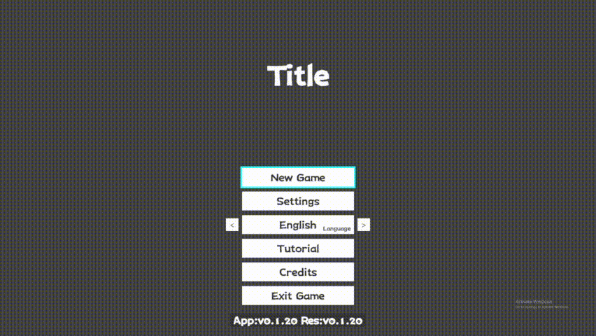

# CycloneGames.InputSystem

> Note: The CycloneGames.InputSystem code was authored by the project's developer; this documentation was prepared with AI assistance.

A reactive wrapper around Unity Input System with context stacks, multi-player joining, device locking, YAML-based configuration, and an Editor tool.

English | [简体中文](./README.SCH.md)

## Features

- **Context Stack**: Push/pop contexts to manage input states (e.g., Gameplay, UI, Cutscene).
- **Rich Multi-Player Modes**:
  - **Single-Player**: Auto-joins and locks all required devices to one player.
  - **Lobby (Device Locking)**: The first device joins as Player 0. Subsequent devices are automatically paired to this single player, ideal for allowing one player to switch between keyboard and gamepad seamlessly.
  - **Lobby (Shared Devices)**: Each new device joins as a new player (Player 0, 1, 2...), perfect for local co-op.
- **Configurable Code Generation**:
  - Automatically generate a static `InputActions` class from your YAML config.
  - Customize the output directory and namespace to fit your project structure, keeping your `Packages` folder clean.
- **Reactive API (R3)**: Provides `Observable` streams for button presses, long presses, analog values, and more.
- **Intelligent Hot-Swapping**: Automatically pairs newly connected devices to the correct player _after_ the lobby phase.
- **Active Device Detection**: `ActiveDeviceKind` property tracks whether the last input came from Keyboard/Mouse or a Gamepad.

## SamplePreview


## Install

- Unity 2022.3+
- Enable Input System package
- Dependencies: UniTask, R3, VYaml, CycloneGames.Utility, CycloneGames.Logger

## Quick Start

### Step 1: Generate Default Config

Open the editor window: `Tools → CycloneGames → Input System Editor`, then click **Generate Default Config** to create the default YAML configuration file.

### Step 2: Configure Code Generation (Recommended)

In the editor window:

1. Set the **Output Directory** (e.g., `Assets/Scripts/Generated`) and **Namespace** (e.g., `YourGame.Input.Generated`).
2. Click **Save and Generate Constants** to save the configuration and generate the `InputActions.cs` file.

The generated file will contain:

- `InputActions.Contexts.*` - String constants for context names (e.g., `InputActions.Contexts.Gameplay`)
- `InputActions.ActionMaps.*` - String constants for action map names (e.g., `InputActions.ActionMaps.PlayerActions`)
- `InputActions.Actions.*` - Integer hash IDs for actions (e.g., `InputActions.Actions.Gameplay_Move`)

These constants enable type-safe, zero-GC input access at runtime.

### Step 3: Initialize at Boot

Load the configuration at game startup (e.g., in `MonoBehaviour.Start()` or an initialization script):

```csharp
using CycloneGames.Utility.Runtime;
using CycloneGames.InputSystem.Runtime;
using Cysharp.Threading.Tasks;

// Call at startup
var defaultUri = FilePathUtility.GetUnityWebRequestUri("input_config.yaml", UnityPathSource.StreamingAssets);
var userUri = FilePathUtility.GetUnityWebRequestUri("user_input_settings.yaml", UnityPathSource.PersistentData);
await InputSystemLoader.InitializeAsync(defaultUri, userUri);
```

`InputSystemLoader` will prioritize loading the user configuration (`PersistentData`), falling back to the default configuration (`StreamingAssets`) if it doesn't exist. On first run, it will automatically copy the default configuration to the user configuration directory.

### Step 4: Join Player and Set Context

**Using generated constants (recommended):**

```csharp
// Make sure to import R3 namespace
using R3;
// Make sure to import your custom namespace
using YourGame.Input.Generated;
using CycloneGames.InputSystem.Runtime;

var svc = InputManager.Instance.JoinSinglePlayer(0);

// Create Context (name parameter is optional, defaults to actionMapName)
// Option 1: Only ActionMap (name will be "PlayerActions")
var ctx = new InputContext(InputActions.ActionMaps.PlayerActions)
  .AddBinding(svc.GetVector2Observable(InputActions.Actions.Gameplay_Move), new MoveCommand(dir => {/*...*/}))
  .AddBinding(svc.GetButtonObservable(InputActions.Actions.Gameplay_Confirm), new ActionCommand(() => {/*...*/}));

// Option 2: ActionMap + custom name for debugging
// var ctx = new InputContext(InputActions.ActionMaps.PlayerActions, InputActions.Contexts.Gameplay)
//   .AddBinding(...);

// Bind lifecycle to current component (this) - automatically removes Context from stack when component is destroyed
// Note: AddTo returns a CancellationTokenRegistration, so call it separately, do not assign back to ctx
ctx.AddTo(this);

// Push the context object directly to the stack
svc.PushContext(ctx);
```

**Using string-based API (compatibility mode):**

```csharp
var svc = InputManager.Instance.JoinSinglePlayer(0);
// Only ActionMap required (name defaults to "PlayerActions")
var ctx = new InputContext("PlayerActions")
  .AddBinding(svc.GetVector2Observable("PlayerActions", "Move"), new MoveCommand(dir => {/*...*/}))
  .AddBinding(svc.GetButtonObservable("PlayerActions", "Confirm"), new ActionCommand(() => {/*...*/}));

// Or with custom name for debugging:
// var ctx = new InputContext("PlayerActions", "Gameplay")...

svc.PushContext(ctx);
```

## YAML Schema

```yaml
joinAction:
  type: Button
  action: JoinGame
  deviceBindings:
    - "<Keyboard>/enter"
    - "<Gamepad>/start"
playerSlots:
  - playerId: 0
    contexts:
      - name: Gameplay
        actionMap: PlayerActions
        bindings:
          - type: Vector2
            action: Move
            deviceBindings:
              - "<Gamepad>/leftStick"
              - "2DVector(mode=2,up=<Keyboard>/w,down=<Keyboard>/s,left=<Keyboard>/a,right=<Keyboard>/d)"
              - "<Mouse>/delta"
          - type: Button
            action: Confirm
            longPressMs: 500 # optional, emits long-press after 500ms
            deviceBindings:
              - "<Gamepad>/buttonSouth"
              - "<Keyboard>/space"
          - type: Float
            action: FireTrigger
            longPressMs: 600 # optional long-press for float
            longPressValueThreshold: 0.6 # threshold (0-1) considered as pressed
            deviceBindings:
              - "<Gamepad>/leftTrigger"
```

## Minimal Example (Beginner Friendly)

Create a simple player controller:

```csharp
using UnityEngine;
using CycloneGames.InputSystem.Runtime;

public class SimplePlayer : MonoBehaviour
{
  private IInputPlayer _input;
  private InputContext _context;

  private void Start()
  {
    // Join player 0 and create a gameplay context.
    _input = InputManager.Instance.JoinSinglePlayer(0);
    // Only ActionMap required (name defaults to "PlayerActions")
    _context = new InputContext("PlayerActions")
      .AddBinding(_input.GetVector2Observable("PlayerActions", "Move"), new MoveCommand(OnMove))
      .AddBinding(_input.GetButtonObservable("PlayerActions", "Confirm"), new ActionCommand(OnConfirm))
      // Optional long-press (requires YAML: longPressMs on "Confirm")
      .AddBinding(_input.GetLongPressObservable("PlayerActions", "Confirm"), new ActionCommand(OnConfirmLongPress));

    // Bind lifecycle to this MonoBehaviour (requires R3 namespace)
    // using R3;
    _context.AddTo(this);

    _input.PushContext(_context);
  }

  private void OnMove(Vector2 dir)
  {
    // Move your character with dir.x, dir.y
    transform.position += new Vector3(dir.x, 0f, dir.y) * Time.deltaTime * 5f;
  }

  private void OnConfirm()
  {
    Debug.Log("Confirm pressed");
  }

  private void OnConfirmLongPress()
  {
    Debug.Log("Confirm long-pressed");
  }

  // OnDestroy is no longer needed for context cleanup if AddTo(this) is used!
  /*
  private void OnDestroy()
  {
    if (_input != null && _context != null)
    {
        _input.RemoveContext(_context);
    }
  }
  */
}
```

## Context Management Mechanism (Object Reference)

`InputSystem` uses **Context object references** to manage the input stack as unique identifiers.

### Core Features

1.  **Independent Instances**: Every `new InputContext(...)` creates an independent object. Even if they share the same name (e.g., "Gameplay"), they are distinct instances.
2.  **Stack Management**: `PushContext(ctx)` pushes the object onto the stack. The top context is active.
3.  **Auto-Focus**: If you `PushContext` an object that is already in the stack, it automatically moves to the top (focus behavior).
4.  **Precise Removal**: `RemoveContext(ctx)` removes only the specified object instance, preventing accidental removal of other contexts with the same name.

### Example: UI Overlay Scenario

When UI B overlays UI A, use the Context Stack to manage input priority:

```csharp
using R3; // Required for AddTo extension

// UI A
public class UIWindowA : MonoBehaviour
{
    private InputContext _context;

    private void OnEnable()
    {
        var input = InputManager.Instance.GetInputPlayer(0);
        // ActionMap required, name optional (defaults to "UIActions")
        _context = new InputContext("UIActions", "UI")
            .AddBinding(..., new ActionCommand(OnConfirmA));

        // Bind lifecycle to this component - automatically removes when disabled/destroyed
        _context.AddTo(this);

        input.PushContext(_context); // Stack: [A]
    }

    // OnDisable is no longer needed - AddTo(this) handles cleanup automatically!
}

// UI B (Overlays A)
public class UIWindowB : MonoBehaviour
{
    private InputContext _context;

    private void OnEnable()
    {
        var input = InputManager.Instance.GetInputPlayer(0);
        // Same name is fine, different instance
        _context = new InputContext("UIActions", "UI")
            .AddBinding(..., new ActionCommand(OnConfirmB));

        // Bind lifecycle to this component
        _context.AddTo(this);

        input.PushContext(_context); // Stack: [A, B]. B is top, A is paused.
    }

    // OnDisable is no longer needed - AddTo(this) handles cleanup automatically!
    // When B is destroyed, it's automatically removed from stack, and A resumes.
}
```

## Multiple Contexts Sharing the Same ActionMap

```
Can different Contexts use the same ActionMap name (e.g., both use "PlayerActions")?
Yes, this is safe and fully supported!
```

Each Context's bindings are stored independently in the Context object. When switching between contexts that share the same ActionMap name:

1. The ActionMap is enabled/disabled correctly (Unity Input System handles this safely)
2. Only the **top context's bindings** are subscribed and active
3. Other contexts' bindings are automatically paused (their subscriptions are disposed)

### Example: Gameplay and Pause Menu

Both contexts use "PlayerActions", but bind different commands:

```csharp
using R3;

// Gameplay Context - binds movement and combat
public class GameplayController : MonoBehaviour
{
    private InputContext _gameplayContext;

    private void Start()
    {
        var input = InputManager.Instance.GetInputPlayer(0);
        _gameplayContext = new InputContext("PlayerActions", "Gameplay")
            .AddBinding(input.GetVector2Observable("PlayerActions", "Move"), new MoveCommand(OnMove))
            .AddBinding(input.GetButtonObservable("PlayerActions", "Jump"), new ActionCommand(OnJump))
            .AddBinding(input.GetButtonObservable("PlayerActions", "Attack"), new ActionCommand(OnAttack));

        _gameplayContext.AddTo(this);
        input.PushContext(_gameplayContext); // Stack: [Gameplay]
    }
}

// Pause Menu Context - also uses "PlayerActions", but only binds menu navigation
public class PauseMenu : MonoBehaviour
{
    private InputContext _pauseContext;

    private void OnEnable()
    {
        var input = InputManager.Instance.GetInputPlayer(0);
        // Same ActionMap name "PlayerActions", but different bindings
        _pauseContext = new InputContext("PlayerActions", "PauseMenu")
            .AddBinding(input.GetVector2Observable("PlayerActions", "Move"), new MoveCommand(OnMenuNavigate)) // Menu navigation
            .AddBinding(input.GetButtonObservable("PlayerActions", "Confirm"), new ActionCommand(OnMenuConfirm))
            .AddBinding(input.GetButtonObservable("PlayerActions", "Cancel"), new ActionCommand(OnMenuCancel));

        _pauseContext.AddTo(this);
        input.PushContext(_pauseContext); // Stack: [Gameplay, PauseMenu]. Only PauseMenu bindings are active.
    }

    // When PauseMenu is destroyed, Gameplay context automatically resumes
}
```

**Key Points**:

- ✅ Multiple contexts can safely share the same ActionMap name
- ✅ Each context's bindings are independent and stored in the context object
- ✅ Switching contexts correctly activates only the top context's bindings
- ✅ No conflicts or interference between contexts

## Context-specific Short vs Long Press

If the same physical button should trigger a short press in one context and a long press in another (mutually exclusive), define two contexts and configure the action differently.

YAML example:

```yaml
playerSlots:
  - playerId: 0
    contexts:
      - name: Inspect
        actionMap: PlayerActions
        bindings:
          - type: Button
            action: Confirm
            # short press only (omit longPressMs)
            deviceBindings:
              - "<Keyboard>/space"
              - "<Gamepad>/buttonSouth"
      - name: Charge
        actionMap: PlayerActions
        bindings:
          - type: Button
            action: Confirm
            longPressMs: 600 # long press only for this context
            deviceBindings:
              - "<Keyboard>/space"
              - "<Gamepad>/buttonSouth"
```

Runtime usage:

```csharp
// In Inspect context: bind short press only
var ctxInspect = new InputContext("PlayerActions", "Inspect");
ctxInspect.AddBinding(_input.GetButtonObservable("PlayerActions", "Confirm"), new ActionCommand(OnInspectConfirm));

// In Charge context: bind long press only
var ctxCharge = new InputContext("PlayerActions", "Charge");
ctxCharge.AddBinding(_input.GetLongPressObservable("PlayerActions", "Confirm"), new ActionCommand(OnChargeConfirm));

// Switch contexts as needed
_input.PushContext(ctxInspect); // Switch to Inspect
// later:
_input.PushContext(ctxCharge); // Switch to Charge
```

## Advanced Usage

### Multi-Player Modes

#### Single-Player Mode (Auto-Lock Devices)

```csharp
// Automatically join player 0 and lock all required devices to that player
var svc = InputManager.Instance.JoinSinglePlayer(0);

// If player is already joined, JoinSinglePlayer returns the existing service
// This allows you to call it multiple times safely
var svc2 = InputManager.Instance.JoinSinglePlayer(0); // Returns same service, no event triggered
```

**Note**: If the player is already joined, `JoinSinglePlayer` returns the existing service without triggering `OnPlayerInputReady` event. This is useful when you need to get the service multiple times, but if you need to rebind input contexts after the player has already joined, use `RefreshPlayerInput` instead.

#### Lobby Mode (Device Locking)

The first device joins as Player 0, and subsequent devices are automatically paired to that player. Ideal for single players switching between keyboard and gamepad:

```csharp
InputManager.Instance.OnPlayerInputReady += HandlePlayerInputReady;
InputManager.Instance.StartListeningForPlayers(true); // true = device locking mode
```

#### Lobby Mode (Shared Devices)

Each new device creates a new player, perfect for local co-op:

```csharp
InputManager.Instance.OnPlayerInputReady += HandlePlayerInputReady;
InputManager.Instance.StartListeningForPlayers(false); // false = shared devices mode
```

#### Batch Join Players

```csharp
// Synchronous batch join
var players = InputManager.Instance.JoinPlayersBatch(new List<int> { 0, 1, 2 });

// Asynchronous batch join (with timeout)
var players = await InputManager.Instance.JoinPlayersBatchAsync(
    new List<int> { 0, 1, 2 },
    timeoutPerPlayerInSeconds: 5
);
```

#### Async Join Player (Wait for Device Connection)

```csharp
// Wait for device connection, timeout 5 seconds
var svc = await InputManager.Instance.JoinSinglePlayerAsync(0, timeoutInSeconds: 5);
if (svc != null)
{
    // Player successfully joined
}
```

#### Manual Device Locking

```csharp
// Lock a specific device to a specific player
var svc = InputManager.Instance.JoinPlayerAndLockDevice(0, Keyboard.current);
```

#### Shared Device Mode

```csharp
// Multiple players share keyboard (suitable for turn-based games)
var player0 = InputManager.Instance.JoinPlayerOnSharedDevice(0);
var player1 = InputManager.Instance.JoinPlayerOnSharedDevice(1);
```

### Configuration Hot Reload

Reload configuration at runtime (e.g., when player modifies key bindings):

```csharp
bool success = await InputManager.Instance.ReloadConfigurationAsync();
if (success)
{
    Debug.Log("Configuration reloaded");
    // Newly joined players will use the new configuration
}
```

### Save User Configuration

Save the current configuration to the user configuration directory:

```csharp
await InputManager.Instance.SaveUserConfigurationAsync();
```

### Event Callbacks

```csharp
// Listen for player input ready events
InputManager.Instance.OnPlayerInputReady += (IInputPlayer playerInput) =>
{
    Debug.Log($"Player {((InputPlayer)playerInput)?.PlayerId ?? -1} input ready");
    // Set up player input context, etc.
};

// Listen for configuration reload events
InputManager.Instance.OnConfigurationReloaded += () =>
{
    Debug.Log("Configuration reloaded");
};

// Refresh player input by triggering OnPlayerInputReady event for an already joined player
// Useful when you dynamically bind input contexts after the player has already joined (e.g., in a different scene)
// Example: LaunchScene initializes input system, GameplayScene binds input contexts
InputManager.Instance.OnPlayerInputReady += HandlePlayerInputReady;
// ... later, in GameplayScene after binding contexts ...
if (InputManager.Instance.GetInputPlayer(0) != null)
{
    InputManager.Instance.RefreshPlayerInput(0); // Triggers OnPlayerInputReady event to activate newly bound contexts
}

// Listen for context change events
inputService.OnContextChanged += (string contextName) =>
{
    Debug.Log($"Context switched to: {contextName}");
};
```

### Input Blocking

Temporarily disable all input (e.g., when showing pause menu):

```csharp
// Block input
inputService.BlockInput();

// Restore input
inputService.UnblockInput();
```

### Context Stack Management

```csharp
using R3; // Required for AddTo extension

// Only ActionMap required (name defaults to "UIActions")
var menuContext = new InputContext("UIActions", "Menu");

// Push new context (e.g., open menu)
inputService.PushContext(menuContext);

// ⚠️ WARNING: Do not use PopContext() if you use AddTo(this) for lifecycle binding.
// PopContext blindly removes the top element. If the stack order has changed (e.g. dynamic UI),
// you might pop the wrong context. Use RemoveContext(context) or AddTo(this) instead.
// inputService.PopContext(); // Not recommended when using lifecycle binding

// Recommended: Remove specific context by object reference
inputService.RemoveContext(menuContext);

// Or bind lifecycle to a component (automatically removes when component is destroyed)
// menuContext.AddTo(this);

// View current active context
string currentContext = inputService.ActiveContextName.CurrentValue;

// Subscribe to context changes
inputService.ActiveContextName.Subscribe(ctxName =>
{
    Debug.Log($"Current context: {ctxName}");
});
```

### Create-First-Bind-Later Pattern (Recommended for Game Initialization)

During game initialization, you can create Contexts first, then dynamically add bindings and Push when needed. This pattern is suitable for scenarios requiring delayed binding or dynamic management:

```csharp
// During game initialization - create Contexts
// Only ActionMap required (name defaults to ActionMapName)
var gameplayContext = new InputContext(InputActions.ActionMaps.PlayerActions, InputActions.Contexts.Gameplay);
var uiContext = new InputContext(InputActions.ActionMaps.UIActions, InputActions.Contexts.UI);
var inputPlayer = inputManager.GetInputPlayer(0);

// No Register needed, Context is an independent object

// Later, dynamically add bindings when needed
gameplayContext.AddBinding(
    inputPlayer.GetVector2Observable(InputActions.Actions.Gameplay_Move),
    new MoveCommand(OnMove)
);
gameplayContext.AddBinding(
    inputPlayer.GetButtonObservable(InputActions.Actions.Gameplay_Jump),
    new ActionCommand(OnJump)
);

// If this is in a MonoBehaviour, bind lifecycle
// gameplayContext.AddTo(this);

// Activate Context (bindings are already added, will take effect immediately)
inputPlayer.PushContext(gameplayContext);

// Or, if Context is already active, refresh after adding bindings
if (inputPlayer.ActiveContextName.Value == InputActions.Contexts.Gameplay)
{
    // ... add more bindings ...
    inputPlayer.RefreshActiveContext(); // Make new bindings take effect
}
```

**Important Notes:**

- ✅ Context is an independent object, no pre-registration needed
- ✅ If Context is not yet active (not Push), add bindings then Push, bindings will take effect immediately
- ⚠️ If Context is already active (already Push), after adding bindings you need to call `RefreshActiveContext()` to make new bindings take effect

### Fine-Grained Binding Management

When you dynamically add bindings to contexts in gameplay scenes, you can remove specific bindings without affecting the entire context.

```csharp
using R3; // Required for AddTo extension

// In gameplay scene
var gameplayContext = new InputContext(InputActions.ActionMaps.PlayerActions, InputActions.Contexts.Gameplay)
    .AddBinding(inputPlayer.GetVector2Observable(InputActions.Actions.Gameplay_Move), new MoveCommand(OnMove));

// Bind lifecycle to this component (automatically removes context when component is destroyed)
gameplayContext.AddTo(this);

inputPlayer.PushContext(gameplayContext);

// Later, add a dynamic binding
var jumpObservable = inputPlayer.GetButtonObservable(InputActions.Actions.Gameplay_Jump);
var jumpCommand = new ActionCommand(OnJump);
gameplayContext.AddBinding(jumpObservable, jumpCommand);

// Important: After adding bindings, if the context is currently active, refresh it to make new bindings take effect
inputPlayer.RefreshActiveContext();

// When leaving gameplay scene - no OnDestroy needed if using AddTo(this)!
// The context will be automatically removed when this component is destroyed.

// However, if you need to remove specific bindings before component destruction:
// inputPlayer.RemoveBindingFromContext(gameplayContext, jumpObservable);
```

**Important Notes:**

- `RemoveBindingFromContext` allows you to remove specific bindings from a context without affecting other bindings
- `RemoveContext` removes the entire context and all its bindings, **and automatically removes it from the stack** (if it's in the stack)

### InputContext Lifecycle Management

`InputContext` is a regular C# class and **can be created multiple times**. You can choose different usage patterns based on your project needs:

#### Pattern 1: Shared Context Instance (Recommended for Static Bindings)

If multiple scenes use the same binding configuration, you can create a shared Context instance:

```csharp
using R3; // Required for AddTo extension

// Create in a global manager or singleton
public class InputContextManager
{
    private static InputContext _sharedGameplayContext;

    public static InputContext GetGameplayContext(IInputPlayer inputPlayer)
    {
        if (_sharedGameplayContext == null)
        {
            _sharedGameplayContext = new InputContext(InputActions.ActionMaps.PlayerActions, InputActions.Contexts.Gameplay)
                .AddBinding(inputPlayer.GetVector2Observable(InputActions.Actions.Gameplay_Move), new MoveCommand(OnMove))
                .AddBinding(inputPlayer.GetButtonObservable(InputActions.Actions.Gameplay_Confirm), new ActionCommand(OnConfirm));
        }
        return _sharedGameplayContext;
    }
}

// Use in Scene A
public class SceneA : MonoBehaviour
{
    private void Start()
    {
        var inputPlayer = InputManager.Instance.GetInputPlayer(0);
        var ctx = InputContextManager.GetGameplayContext(inputPlayer);

        // For shared contexts, you may want to manually manage removal
        // Or bind to a persistent GameObject that outlives scene changes
        inputPlayer.PushContext(ctx);
    }

    private void OnDestroy()
    {
        // For shared contexts, manually remove when scene unloads
        var inputPlayer = InputManager.Instance.GetInputPlayer(0);
        inputPlayer.RemoveContext(InputContextManager.GetGameplayContext(inputPlayer));
    }
}
```

#### Pattern 2: Per-Scene Context Instance (Recommended for Dynamic Bindings)

If each scene needs different binding configurations, each scene creates its own Context instance:

```csharp
using R3; // Required for AddTo extension

// Scene A - creates its own Context
public class SceneA : MonoBehaviour
{
    private InputContext _gameplayContext;

    private void Start()
    {
        var inputPlayer = InputManager.Instance.GetInputPlayer(0);
        _gameplayContext = new InputContext(InputActions.ActionMaps.PlayerActions, InputActions.Contexts.Gameplay)
            .AddBinding(inputPlayer.GetVector2Observable(InputActions.Actions.Gameplay_Move), new MoveCommand(OnMoveA))
            .AddBinding(inputPlayer.GetButtonObservable(InputActions.Actions.Gameplay_Jump), new ActionCommand(OnJumpA));

        // Bind lifecycle to this component - automatically removes when scene unloads
        _gameplayContext.AddTo(this);

        inputPlayer.PushContext(_gameplayContext);
    }

    // OnDestroy is no longer needed - AddTo(this) handles cleanup automatically!
}
```

## API Overview

### IInputPlayer

Input interface for a single player.

#### Properties

- `ReadOnlyReactiveProperty<string> ActiveContextName` - Name of the currently active context
- `ReadOnlyReactiveProperty<InputDeviceKind> ActiveDeviceKind` - Current active device type (keyboard/mouse/gamepad/other)
- `event Action<string> OnContextChanged` - Context change event
- `int PlayerId` - Player ID (InputPlayer implementation only)
- `InputUser User` - Unity Input System user object (InputPlayer implementation only)

#### Constant Param based API (Recommended)

Use generated constants to completely avoid runtime string operations:

- `Observable<Vector2> GetVector2Observable(int actionId)`
- `Observable<Unit> GetButtonObservable(int actionId)`
- `Observable<Unit> GetLongPressObservable(int actionId)`
- `Observable<bool> GetPressStateObservable(int actionId)` - Press state stream (true=pressed, false=released)
- `Observable<float> GetScalarObservable(int actionId)` - Scalar value stream (for Float type actions)

#### Context Management

- `void PushContext(InputContext context)` - Push context to stack (if already in stack, moves to top)
- `void PopContext()` - ⚠️ **Not recommended when using lifecycle binding (`AddTo`)**. PopContext blindly removes the top element. If the stack order has changed (e.g. dynamic UI), you might pop the wrong context. Use `RemoveContext(context)` or `AddTo(this)` instead.
- `bool RemoveContext(InputContext context)` - Remove specific context from stack by object reference
- `void RefreshActiveContext()` - Refresh the currently active context, re-subscribe to all bindings

#### Binding Management

- `bool RemoveBindingFromContext(InputContext context, Observable<Unit> source)` - Remove binding
- `bool RemoveBindingFromContext(InputContext context, Observable<Vector2> source)`
- `bool RemoveBindingFromContext(InputContext context, Observable<float> source)`

#### Input Control

- `void BlockInput()` - Block all input
- `void UnblockInput()` - Restore input (restores the currently active context's ActionMap)

### InputManager

Singleton manager for the input system.

#### Static Properties

- `static InputManager Instance` - Singleton instance
- `static bool IsListeningForPlayers` - Whether currently listening for player joins

#### Events

- `event Action<IInputPlayer> OnPlayerInputReady` - Player input ready event (triggered when player joins or input is refreshed)
- `event Action OnConfigurationReloaded` - Configuration reload event

#### Initialization

- `void Initialize(string yamlContent, string userConfigUri)` - Initialize manager (usually called by `InputSystemLoader`)

#### Player Join Methods

- `IInputPlayer JoinSinglePlayer(int playerIdToJoin = 0)` - Synchronously join a single player (auto-lock devices). If player is already joined, returns existing service without triggering `OnPlayerInputReady` event.
- `UniTask<IInputPlayer> JoinSinglePlayerAsync(int playerIdToJoin = 0, int timeoutInSeconds = 5)` - Asynchronously join a single player (wait for device connection)
- `List<IInputPlayer> JoinPlayersBatch(List<int> playerIds)` - Batch synchronously join players
- `UniTask<List<IInputPlayer>> JoinPlayersBatchAsync(List<int> playerIds, int timeoutPerPlayerInSeconds = 5)` - Batch asynchronously join players
- `IInputPlayer JoinPlayerOnSharedDevice(int playerIdToJoin)` - Join player on shared device
- `IInputPlayer JoinPlayerAndLockDevice(int playerIdToJoin, InputDevice deviceToLock)` - Lock specific device to player
- `IInputPlayer GetInputPlayer(int playerId)` - Get existing input player for the specified player ID, or null if not joined
- `bool RefreshPlayerInput(int playerId)` - Refreshes player input by triggering `OnPlayerInputReady` event for an already joined player. Useful when you dynamically bind input contexts after the player has already joined (e.g., in a different scene). This allows the InputSystem to recognize and manage newly bound input contexts. Returns true if player exists and event was triggered, false otherwise.

#### Lobby Mode

- `void StartListeningForPlayers(bool lockDeviceOnJoin)` - Start listening for player joins
  - `lockDeviceOnJoin = true`: Device locking mode (all devices paired to player 0)
  - `lockDeviceOnJoin = false`: Shared devices mode (each device creates a new player)
- `void StopListeningForPlayers()` - Stop listening for player joins

#### Configuration Management

- `async UniTask<bool> ReloadConfigurationAsync()` - Reload configuration
- `async UniTask SaveUserConfigurationAsync()` - Save user configuration

#### Cleanup

- `void Dispose()` - Release all resources (including all players' `InputPlayer` instances)

### InputContext

Input context containing action bindings and commands. Implements `IDisposable` for automatic lifecycle management.

#### Constructor

- `InputContext(string actionMapName, string name = null)` - Create context
  - `actionMapName` (required): The Unity Input System ActionMap name (functionally required)
  - `name` (optional): Display name for debugging. If null, defaults to `actionMapName`
  - **Recommended**: Use generated constants: `new InputContext(InputActions.ActionMaps.PlayerActions, InputActions.Contexts.Gameplay)`
  - **Simplified**: `new InputContext(InputActions.ActionMaps.PlayerActions)` - name will be "PlayerActions"

#### Methods

- `InputContext AddBinding(Observable<Unit> source, IActionCommand command)` - Add button action binding
- `InputContext AddBinding(Observable<Vector2> source, IMoveCommand command)` - Add Vector2 action binding
- `InputContext AddBinding(Observable<float> source, IScalarCommand command)` - Add scalar action binding
- `bool RemoveBinding(Observable<Unit> source)` - Remove button action binding
- `bool RemoveBinding(Observable<Vector2> source)` - Remove Vector2 action binding
- `bool RemoveBinding(Observable<float> source)` - Remove scalar action binding

#### Lifecycle Management

- `void Dispose()` - Automatically removes this context from all active InputPlayers. Designed to be called via R3's `AddTo(this)` extension method.

## Dependency Injection (VContainer) Integration

### Installation

The package includes a VContainer installer. Register it in your DI container setup:

#### Option 1: URI-based Loading (StreamingAssets/PersistentData)

```csharp
using VContainer;
using VContainer.Unity;
using CycloneGames.InputSystem.Runtime.Integrations.VContainer;

public class GameLifetimeScope : LifetimeScope
{
    protected override void Configure(IContainerBuilder builder)
    {
        // Install InputSystem with URI-based config loading
        var inputSystemInstaller = new InputSystemVContainerInstaller(
            defaultConfigFileName: "input_config.yaml",
            userConfigFileName: "user_input_settings.yaml",
            postInitCallback: async resolver =>
            {
                //  ...
                var inputResolver = resolver.Resolve<IInputPlayerResolver>();
                var player0Input = inputResolver.GetInputPlayer(0);
            }
        );
        inputSystemInstaller.Install(builder);

        // Register your game systems that depend on input
        builder.Register<PlayerController>(Lifetime.Scoped);
    }
}
```

### Usage Patterns

#### Pattern 1: Inject IInputPlayerResolver (Recommended)

Use the resolver to get input services when needed:

```csharp
using CycloneGames.InputSystem.Runtime;
using CycloneGames.InputSystem.Runtime.Integrations.VContainer;
using VContainer;

public class PlayerController
{
    private readonly IInputPlayerResolver _inputResolver;
    private IInputPlayer _input;

    [Inject]
    public PlayerController(IInputPlayerResolver inputResolver)
    {
        _inputResolver = inputResolver;
    }

    public void Initialize(int playerId)
    {
        _input = _inputResolver.GetInputPlayer(playerId);

        // Only ActionMap required (name defaults to "PlayerActions")
        var ctx = new InputContext("PlayerActions", "Gameplay")
            .AddBinding(_input.GetVector2Observable("Move"), new MoveCommand(OnMove))
            .AddBinding(_input.GetButtonObservable("Confirm"), new ActionCommand(OnConfirm));

        _input.PushContext(ctx);
    }

    private void OnMove(Vector2 dir) { /* ... */ }
    private void OnConfirm() { /* ... */ }
}
```
