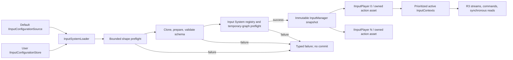

# CycloneGames.InputSystem

[English | 简体中文](README.SCH.md)

CycloneGames.InputSystem is a YAML-authored input layer over Unity Input System. It validates configuration before committing it, creates an independent input service for each local player, routes actions through prioritized mapping contexts, and exposes R3 streams, synchronous reads, and explicit boundaries for configuration and binding-profile persistence.

## Table of Contents

- [Overview](#overview)
- [Architecture](#architecture)
- [Quick Start](#quick-start)
- [Core Concepts](#core-concepts)
- [Usage Guide](#usage-guide)
- [Advanced Topics](#advanced-topics)
- [Common Scenarios](#common-scenarios)
- [Performance and Memory](#performance-and-memory)
- [Troubleshooting](#troubleshooting)

## Overview

The module separates authoring (YAML configuration edited in the Input System Editor) from runtime dispatch (`InputManager` validating and committing an immutable snapshot) and from per-player delivery (`IInputPlayer` owning an `InputUser`, an action asset, active contexts, and R3 streams). The owner authors contexts, actions, bindings, composites, interactions, processors, and control schemes in YAML; the manager validates them against the current Unity Input System registry before commit; each joined player receives an independently constructed action asset.

It targets products that need reviewable YAML authoring with bounded validation, per-player `InputUser` and device ownership for local multiplayer, prioritized contexts (Gameplay, Vehicle, Menu, Modal), event-driven and polling value reads, long-press progress and chords, runtime rebinding with a versioned module-owned JSON profile, and explicit configuration sources and stores.

### Key Features

- **Validated YAML authoring**: Bounded shape preflight, schema validation, and Unity Input System registry/graph preflight before commit.
- **Per-player ownership**: Each joined player gets its own `InputUser`, action asset, contexts, streams, and binding overrides.
- **Prioritized mapping contexts**: `InputContext` with priority and `BlocksLowerPriority`; capture and global blocking scopes.
- **R3 streams and synchronous reads**: `GetButtonObservable`, `GetVector2Observable`, `GetScalarObservable`, `TryReadValue<T>`, long-press progress, and chords.
- **Context-qualified identities**: `InputHashUtility.GetActionId(context, map, action)` produces deterministic FNV-1a 32-bit hashes.
- **Runtime rebinding**: `RebindAction` applies a chosen path; per-player and manager-level JSON profiles with import/export and bounded budgets.
- **Explicit configuration storage**: `IInputConfigurationSource` (read) and `IInputConfigurationStore` (read/write/delete); built-in `UriInputConfigurationSource` and `FileInputConfigurationStore`.
- **Editor tooling and codegen**: Input System Editor window, validation, deterministic `InputActions.cs` generation with context-qualified action IDs.
- **Optional integrations**: UGUI adapters, VContainer composition, AssetManagement-backed package loading, diagnostic `InputRecorder`/`InputReplayCursor`.

## Architecture

| Assembly | Path | Purpose |
| --- | --- | --- |
| `CycloneGames.InputSystem.Runtime` | `Runtime/Scripts/` | Configuration, manager, players, contexts, reactive input, storage boundaries. Depends on Unity Input System, UniTask, R3, VYaml, CycloneGames.Hash, Logger. |
| `CycloneGames.InputSystem.Editor` | `Editor/` | YAML authoring, validation, safe file writes, constant generation. Editor-only. |
| `CycloneGames.InputSystem.Runtime.Integrations.UGUI` | `Runtime/Scripts/Integrations/UGUI/` | `InputDeviceIconSet`, `InputDeviceIconSwitcher`, menu-navigation components. `autoReferenced: false`. |
| `CycloneGames.InputSystem.Runtime.Integrations.VContainer` | `Runtime/Scripts/Integrations/DI/VContainer/Base/` | Container-owned manager, async startup, resolver adapters. No AssetManagement dependency. |
| `CycloneGames.InputSystem.Runtime.Integrations.VContainer.AssetManagement` | sibling package | Package-configuration loader adapter; supplied by `CycloneGames.InputSystem.AssetManagement`. |
| `CycloneGames.InputSystem.Tools.Runtime` | `Runtime/Tools/` | `InputRecorder` and `InputReplayCursor` diagnostic tooling. |
| `CycloneGames.InputSystem.Sample` | `Samples/` | Opt-in scene and bootstrap example. |
| `CycloneGames.InputSystem.Tests.Editor` | `Tests/Editor/` | EditMode validation and regression coverage. |

Optional assemblies have `autoReferenced: false`. Add an explicit asmdef reference only where the feature is used. UGUI and VContainer activation use package-derived `versionDefines` with `defineConstraints`; missing packages exclude the corresponding assembly. AssetManagement support is physically separated into the sibling `CycloneGames.InputSystem.AssetManagement` package.


```mermaid
flowchart LR
    A["Default IInputConfigurationSource"] --> L["InputSystemLoader"]
    U["User IInputConfigurationStore"] --> L
    L --> S["Bounded shape preflight"]
    S --> V["Clone, prepare, validate schema"]
    V --> P["Input System registry and temporary-graph preflight"]
    P -->|success| M["Immutable InputManager snapshot"]
    S -->|failure| F["Typed failure; no commit"]
    V -->|failure| F
    P -->|failure| F
    M --> P1["IInputPlayer 0 / owned action asset"]
    M --> P2["IInputPlayer N / owned action asset"]
    P1 --> C["Prioritized active InputContexts"]
    C --> R["R3 streams, commands, synchronous reads"]
```

The initialization path is transactional. It performs a bounded shape preflight before cloning, then schema preparation and semantic validation on the clone. On the Unity main thread it validates layouts, paths, interactions, processors, composites, and control schemes against the current Input System registry, constructs and resolves temporary action graphs, and disposes those graphs. Only a successful preflight permits the immutable runtime snapshot to become active. Each joined player later receives a separately constructed action asset that the player owns.

## Quick Start

Open `Tools > CycloneGames > Input System Editor` to generate or edit a configuration. The module does not require a project-owned default under `Assets/StreamingAssets`. A product composition root chooses whether configuration comes from a serialized `TextAsset`, StreamingAssets, an asset package, a bounded remote source, a user store, or explicit in-memory content.

For the shortest scene-level integration, a serialized `TextAsset` supplies validated YAML directly:

```csharp
using CycloneGames.InputSystem.Runtime;
using UnityEngine;

public sealed class PlayerInputBootstrap : MonoBehaviour
{
    [SerializeField] private TextAsset _configuration;

    private InputManager _manager;
    private InputContext _gameplay;

    private void Awake()
    {
        _manager = new InputManager();
        InputManagerInitializationResult initialized =
            _manager.InitializeWithResult(_configuration.text);

        if (!initialized.IsSuccess)
        {
            Debug.LogError($"Input initialization failed: {initialized.Status}: {initialized.Message}");
            enabled = false;
            return;
        }

        IInputPlayer player = _manager.JoinSinglePlayer(0);
        if (player == null)
        {
            Debug.LogError("No declared control scheme can be matched for player 0.");
            enabled = false;
            return;
        }

        _gameplay = new InputContext("PlayerActions", "Gameplay")
            .AddBinding(
                player.GetVector2Observable("Gameplay", "PlayerActions", "Move"),
                new MoveCommand(OnMove));

        player.PushContext(_gameplay);
    }

    private void OnMove(Vector2 direction)
    {
        // Forward the value to a gameplay-owned movement service.
    }

    private void OnDestroy()
    {
        _gameplay?.Dispose();
        _manager?.Dispose();
    }
}
```

Keep the `InputManager` owner explicit in a composition root. `InputManager.Instance` is the global entry point; explicit construction makes shutdown, tests, multiple scopes, and DI ownership visible. A disposed manager cannot be initialized again; construct a new one. The configuration defines available contexts but does not push gameplay state — create and push `InputContext` objects when the corresponding product state begins.

For deeper topics, see the [Documents~](Documents~/GettingStarted.md) folder.

## Core Concepts

| Concept | Representation | Responsibility |
| --- | --- | --- |
| Action | `ActionBindingConfig` and an internal Unity `InputAction` | Gives a logical name and value type to one or more bindings. |
| Mapping Context | YAML `ContextDefinitionConfig` plus runtime `InputContext` | Groups actions and command bindings under a priority and lower-context blocking policy. |
| Interaction | Action-level `interactions` | Uses Unity Input System interaction syntax to decide when an action starts, performs, or cancels. Composite-part interactions are rejected; place the expression on the action. |
| Processor | `processors` or composite-part `processors` | Uses Unity Input System processor syntax to transform values before consumers read them. |
| Composite | `CompositeBindingConfig` | Builds values such as `2DVector` from named parts without encoding a composite as a control path. |
| Control Scheme | `ControlSchemeConfig` | Declares a binding group and required, optional, or alternative device layouts for matching. |
| Player | `IInputPlayer` backed by an `InputUser` | Owns paired devices, an internal action asset, active contexts, streams, and binding overrides. |
| Binding Profile | `InputBindingOverrideProfile` or per-player override JSON | Persists stable context/map/action binding selectors independently of configuration storage. |

The [Unity Input System manual](https://docs.unity3d.com/Manual/com.unity.inputsystem.html) is the authority for underlying Unity action, binding, interaction, processor, and device semantics.

### Mapping-Context Arbitration

`PushContext` places a runtime context in the normal context set. Active normal contexts are sorted by descending priority; equal priorities retain stack order. Evaluation includes contexts from the top of that order until an active context whose `BlocksLowerPriority` is `true` is reached. A non-blocking overlay can coexist with Gameplay while a Menu blocks Gameplay.

The two-argument `InputContext(actionMapName, name)` constructor obtains priority and blocking policy from the matching YAML context. The four-argument constructor supplies an explicit runtime policy:

```csharp
var gameplay = new InputContext("PlayerActions", "Gameplay");
var menu = new InputContext("UIActions", "Menu", priority: 100, blocksLowerPriority: true);
```

Names are ordinal and case-sensitive.

### Capture and Global Blocking

`CaptureContext` temporarily selects one capture context ahead of all normal contexts. It returns an idempotent `IDisposable`; disposing the scope reveals the next capture or the normal priority set.

`BlockInputScope` disables all action maps for the player and returns an idempotent scope. Blocks are depth-counted, so input resumes only after all matching scopes or `UnblockInput` calls are released. Prefer the scoped form for asynchronous loading and transitions.

```csharp
using IDisposable modalCapture = player.CaptureContext(modalContext);
using IDisposable loadingBlock = player.BlockInputScope();
```

Do not retain either scope beyond its owning flow, and dispose it on the Unity main thread.

### Event Streams, Polling, and Reads

`EventDriven` value actions emit on performed and emit a neutral value on cancel. `Polling` `Vector2` and `Float` actions are read by the player's single update pump while their map is enabled. Use polling for values that must be sampled continuously, and event-driven mode for discrete state changes. Every subscription needs a visible lifetime; an `InputContext`, `CompositeDisposable`, or owning component should dispose it.

Generated or computed action IDs avoid repeated string lookup and include context identity:

```csharp
int moveId = InputHashUtility.GetActionId("Gameplay", "PlayerActions", "Move");
player.GetVector2Observable(moveId).Subscribe(MoveCharacter);

if (player.TryReadValue(moveId, out Vector2 move))
{
    ApplyMove(move);
}
```

Short action-only and map/action overloads remain available, but return an empty observable when the requested identity is ambiguous. Context-qualified APIs are the stable choice.

## Usage Guide

### Contexts, Priority, Capture, and Blocking

Bind commands before pushing a context. The context owns command mappings; the player owns the live subscriptions while that context is active.

```csharp
InputContext gameplay = new InputContext("PlayerActions", "Gameplay")
    .AddBinding(
        player.GetVector2Observable("Gameplay", "PlayerActions", "Move"),
        new MoveCommand(MoveCharacter))
    .AddBinding(
        player.GetButtonObservable("Gameplay", "PlayerActions", "Confirm"),
        new ActionCommand(Confirm));

InputContext menu = new InputContext("UIActions", "Menu")
    .AddBinding(
        player.GetVector2Observable("Menu", "UIActions", "Navigate"),
        new MoveCommand(NavigateMenu));

player.PushContext(gameplay);
player.PushContext(menu); // YAML priority 100 and blocking policy make Menu authoritative.

player.RemoveContext(menu); // Gameplay becomes active again.
gameplay.Dispose();
menu.Dispose();
```

`ActiveContextName` reports the highest active context. Product state should remain the source of truth for which contexts it pushes.

Context stack/capture mutations commit the model before rebuilding the Unity action-map projection. If map enablement or a custom observable subscription throws, the model change remains committed, all projected maps/subscriptions are failed closed, `ActiveContextName` is cleared, and the initiating API rethrows. Remove the failing binding/subscriber, then call `RefreshActiveContext()` to retry. Synchronous reentrant refreshes are coalesced and capped at 16 passes; exceeding the cap leaves input disabled instead of spinning the main thread.

### Local Multiplayer and Device Ownership

| API | Device policy | Typical use |
| --- | --- | --- |
| `JoinSinglePlayer` / `JoinSinglePlayerAsync` | Matches the preferred then remaining control schemes from unclaimed devices. | Standard local player creation. |
| `JoinPlayerAndLockDevice` | Requires the supplied device to participate in a valid declared scheme; claims all matched scheme devices. | A user joined from a known gamepad. |
| `JoinPlayerOnSharedDevice` | Pairs current keyboard and, when present, mouse without exclusive claiming. | Deliberate shared-keyboard modes. |
| `StartListeningForPlayers` | Combines configured join paths. In locking mode, the device that performs a join binding creates the primary player or may be paired to that existing player only when its layout is declared for the slot. | Lobby join flow. |
| `RemovePlayer` | Disposes the player, unpairs its `InputUser`, and releases claims. | Leave, slot reset, or pre-reinitialize shutdown. |

Async overloads accept a `CancellationToken`. A single-player timeout returns `null`; caller cancellation is propagated. Batch aggregate timeout or manager shutdown returns the successfully joined prefix. Caller cancellation rolls back only players created by that batch, preserves pre-existing registrations, and then throws. Join methods are idempotent for an already registered player ID and return that player.

Control-scheme matching is driven by `deviceRequirements`. `isOptional` permits a missing device. `isOr` expresses an alternative requirement in Unity Input System scheme order. Bindings should use groups declared by the same player slot. If no schemes are declared, layouts derived from configured direct and composite-part paths are alternatives: the first claimable matching device is selected. When that selected device is a keyboard or mouse, the other claimable keyboard/mouse device is added as its companion. Explicit schemes are preferred because they make ownership reviewable.

Each player exposes paired-device lifecycle changes:

```csharp
private void ObserveDevices(IInputPlayer player)
{
    player.OnDeviceStatusChanged += status =>
    {
        switch (status.ChangeKind)
        {
            case InputPlayerDeviceChangeKind.Lost:
                PauseForMissingDevice(status.DeviceId);
                break;
            case InputPlayerDeviceChangeKind.Regained:
                ResumeAfterDeviceReturn(status.DeviceId);
                break;
            case InputPlayerDeviceChangeKind.Paired:
            case InputPlayerDeviceChangeKind.Unpaired:
                RefreshDevicePresentation(status.DeviceKind, status.Layout);
                break;
        }
    };
}
```

`ActiveDeviceKind` changes when meaningful action activity is observed; use it for glyph presentation.

### Interactions, Processors, Long Press, and Chords

Action-level `interactions` and `processors` are forwarded to Unity Input System when internal actions are created. Composite parts can add `processors`; part-level `interactions` are rejected. Initialization preflight resolves expression names and parameters, layouts, control paths, composites, and composite parts against the currently registered Unity Input System environment. Register product-defined layouts, interactions, processors, and composites before calling `InitializeWithResult` or `ReinitializeWithResult`.

The module's long-press completion stream supports `Button` and `Float`, is enabled by `longPressMs > 0`, and is separate from a Unity `hold(...)` interaction. Long-press progress is available only for `Button` actions:

```csharp
player.GetLongPressObservable("Gameplay", "PlayerActions", "Confirm")
    .Subscribe(_ => OpenConfirmDetails());

player.GetLongPressProgressObservable("Gameplay", "PlayerActions", "Confirm")
    .Subscribe(progress => UpdateHoldMeter(progress));
```

Button progress is in `0..1` while held. A release before completion emits `-1`. For a `Float` long press, `longPressValueThreshold` must be finite and in `(0,1]`; when long press is disabled, the accepted range is `0..1`.

Chords require two configured button actions. Use context-qualified IDs when names may be reused:

```csharp
int first = InputHashUtility.GetActionId("Gameplay", "PlayerActions", "Confirm");
int second = InputHashUtility.GetActionId("Gameplay", "PlayerActions", "Cancel");

player.GetChordObservable(first, second, windowMs: 200f)
    .Subscribe(_ => OpenShortcut());
```

The chord stream recognizes the two presses within the requested window and resets after release.

### Rebinding and Binding Profiles

Rebinding operates on the player's internal Unity actions. Prefer the context-qualified overload and pass the original configured path:

```csharp
bool changed = player.RebindAction(
    "Gameplay", "PlayerActions", "Confirm",
    "<Keyboard>/space",
    "<Keyboard>/f");

string[] effectivePaths = player.GetActionBindings("Gameplay", "PlayerActions", "Confirm");

player.ResetActionBinding("Gameplay", "PlayerActions", "Confirm");
player.ResetAllActionBindings();
```

This API applies an already chosen path. A product-owned rebind UI must capture a candidate control, enforce reserved-key and accessibility policy, compare it with current effective paths, ask the user how to resolve a conflict, then apply the override. `CheckBindingConflicts` is an authoring diagnostic for configured direct bindings; it does not evaluate a pending candidate or runtime overrides.

Per-player JSON uses a module-owned schema with context/map/action identity plus a binding ordinal and original binding metadata. Import stages and validates the document before replacing active overrides. A per-player document is limited to 128 override records and 1 MiB of strict UTF-8. Manager profiles aggregate per-player JSON under a 4 MiB total budget and can be imported before players join; pending entries are applied during player construction.

Binding-profile persistence belongs to the product composition root. When a product uses `CycloneGames.Persistence`, inject a product-selected `IPersistenceStorage` and `IPersistenceCodec<string>`, then store the exported profile as opaque JSON. The codec may encode the string as strict UTF-8, but it must not interpret or rewrite the InputSystem schema. `InputManager` is the only profile validator.

The following class belongs in product code or a product-owned integration assembly:

```csharp
using System.Threading;
using System.Threading.Tasks;
using CycloneGames.InputSystem.Runtime;
using CycloneGames.Persistence;

public sealed class InputBindingProfilePersistence
{
    private const int StoredContentVersion = 1;
    private const int MaximumPayloadBytes = 1024 * 1024;

    private readonly InputManager _manager;
    private readonly PersistenceStore<string> _store;

    public InputBindingProfilePersistence(
        InputManager manager,
        IPersistenceStorage storage,
        IPersistenceCodec<string> strictUtf8Codec)
    {
        _manager = manager;
        _store = new PersistenceStore<string>(
            storage,
            new PersistenceProfile<string>(
                strictUtf8Codec,
                new PersistenceLimits(MaximumPayloadBytes)));
    }

    public async Task<PersistenceOperationResult> SaveAsync(
        CancellationToken cancellationToken)
    {
        string opaqueJson = _manager.ExportBindingOverrideProfileJson();
        return await _store.SaveAsync(
            in opaqueJson,
            StoredContentVersion,
            cancellationToken);
    }

    public async Task<string> LoadAndApplyAsync(CancellationToken cancellationToken)
    {
        PersistenceLoadResult<string> loaded = await _store.LoadAsync(
            StoredContentVersion,
            cancellationToken);
        if (loaded.Status == PersistenceLoadStatus.Missing)
            return null;

        if (!loaded.IsSuccess)
            return loaded.ErrorCode.ToString();

        if (!_manager.ImportBindingOverrideProfileJson(loaded.Value))
            return "The binding profile does not match the active input configuration.";

        return null;
    }
}
```

Construct this owner once at the composition root, load before players join, and save only at explicit settings commits or lifecycle checkpoints. Use `TryExportBindingOverridesJson` or `TryExportBindingOverrideProfile` when budget exhaustion is an expected failure path. Profile JSON contains input preferences rather than secrets, but its storage, account association, retention, integrity, encryption, and platform provider still belong to the product save policy.

### Configuration Loading and Persistence

`IInputConfigurationSource` is read-only. `IInputConfigurationStore` adds save and delete. `FileInputConfigurationStore` accepts a fixed root and relative Unicode Form C logical keys. `/` is the only logical segment separator; `\` is rejected. The store rejects rooted paths, URIs, traversal, unsafe characters, and paths that contain a detectable symbolic link or reparse point at the operation boundary, bounds strict UTF-8 content, writes through a temporary file, and retains one fixed `.bak` for recovery.

`UriInputConfigurationSource` reads defaults from local `StreamingAssets`, Android `jar:file` locations, same-origin StreamingAssets web URLs, or an HTTPS host explicitly supplied to its allowlist. Logical URIs are capped at 4,096 characters. The HTTPS allowlist accepts at most 64 bounded DNS/IPv4 hosts, each no longer than 253 characters. Local paths must remain inside `StreamingAssets`. Allowlisted HTTPS endpoints must use port 443 and contain no credentials or fragment. Redirects are disabled and the read has a byte budget and timeout.

```csharp
using System.IO;
using CycloneGames.InputSystem.Runtime;
using UnityEngine;

var manager = new InputManager();
var defaults = new UriInputConfigurationSource();
var users = new FileInputConfigurationStore(Application.persistentDataPath);

string defaultUri = Path.Combine(Application.streamingAssetsPath, "input_config.yaml");
InputSystemLoadResult load = await InputSystemLoader.LoadAndInitializeAsync(
    new InputSystemBootstrapOptions(
        InputSystemBootstrapMode.Optional,
        defaults,
        defaultUri,
        users,
        "input/user_input_settings.yaml",
        persistDefaultToUser: true),
    manager,
    forceReinitialize: false,
    cancellationToken: cancellationToken);

if (!load.IsBootstrapComplete)
{
    Debug.LogError($"Input load failed: {load.Status}: {load.Error}");
}
```

`Disabled` performs no reads. `Optional` returns `NotConfigured` when both user and default content are absent. `Required` reports `DefaultConfigurationUnavailable` when no usable configuration exists. When the user file is valid, it is used. When it is missing, the validated default is used and copied into the user store. When it exists but is invalid, it is preserved and the valid default is used for that session. When the primary file is missing but its `.bak` is readable, the store reports backup recovery. A configuration is never committed until schema validation and Input System preflight both succeed.

Changing configuration requires a lifecycle decision. `ReinitializeWithResult` refuses replacement while players are active. Remove players, release contexts, reinitialize, then rebuild player services and reapply an accepted binding profile. A failed reinitialize leaves the committed configuration unchanged.

## Advanced Topics

### Configuration Reference

| Level | Field | Meaning |
| --- | --- | --- |
| Root | `schemaVersion` | Runtime schema authority. Author new files with value `1`. |
| Root | `schemaFingerprint` | Optional Editor diagnostic. Does not approve or reject runtime data. |
| Root | `joinAction` | Optional shared join binding. Player-slot join bindings are also considered. |
| Root | `playerSlots` | Validated player templates identified by unique non-negative `playerId` values. |
| Player | `controlSchemes` | Optional deterministic device-matching schemes. |
| Player | `defaultControlScheme` | Preferred scheme; other declared schemes are tried if it cannot match. |
| Player | `contexts` | Named mapping contexts for that player. |
| Context | `name`, `actionMap` | Context identity and public action-map identity. |
| Context | `priority` | Higher values are considered first. Default limits accept `-100000..100000`. |
| Context | `blocksLowerPriority` | Stops activation below this context when `true`. |
| Action | `type` | `Button`, `Vector2`, or `Float`. |
| Action | `action` | Logical action name. Context, map, and action form the stable identity. |
| Action | `expectedControlType` | Unity expected control layout (`Button`, `Vector2`, `Axis`). |
| Action | `deviceBindings` | Direct Unity control paths. |
| Action | `compositeBindings` | Structured composite name, parameters, groups, and parts. |
| Action | `bindingGroups` | Semicolon-separated control-scheme binding groups. |
| Action | `interactions`, `processors` | Unity Input System expressions applied to the action. |
| Composite part | `name`, `path`, `processors` | Named part control path with optional part-local processors. A non-empty part `interactions` value is rejected. |
| Action | `updateMode` | `EventDriven` or `Polling`. Delta paths are treated as polling. |
| Action | `longPressMs` | Module long-press completion duration for `Button` or `Float`; `0` disables the stream. |
| Action | `longPressValueThreshold` | `Float` actuation threshold. Must be in `(0,1]` when Float long press is enabled; may be `0..1` when long press is disabled. |

`deviceBindings` contains only direct control paths. A composite must use `compositeBindings`; do not place `2DVector(...)` in `deviceBindings`. Composite `parameters` omits the outer parentheses. Composite parts support `processors` only; a non-empty part `interactions` value fails validation. Put the interaction on the containing action.

### Validation Budgets

Default validation budgets: 8 players, 32 contexts per player, 128 actions per context, 1,024 total actions per player, 16 total direct/composite-part binding entries per action, 16 composites per action, 16 parts per composite, 16 control schemes per player, 16 device requirements per scheme, and 256 characters per technical string. Inject stricter `InputConfigurationLimits` into the `InputManager` constructor.

Before VYaml materialization, runtime and Editor YAML entry points also limit input to 1 MiB strict UTF-8 without BOM, 16,384 lines, 4,096 characters per line, 64 indentation spaces, 65,536 structural tokens, and nesting depth 64. YAML anchors, aliases, explicit tags, directives/document markers, block scalars, tab indentation, forbidden control/format/private-use characters, and non-CR/LF line separators are outside this strict subset.

### Editor Workflow and Code Generation

Open `Tools > CycloneGames > Input System Editor`. The left project-settings panel keeps runtime and code-generation paths visible with reveal/ping shortcuts. The right workspace keeps the serialized configuration separate from file operations. Colored badges distinguish editable, valid, review, invalid, and optional states. Validation errors block persistence but never disable the working-copy fields.

1. Select a default-config folder under `Assets`; the file name is `input_config.yaml`.
2. Select an optional relative user-config subdirectory under `Application.persistentDataPath`.
3. Load the user or default file, or generate a default working configuration.
4. Edit join actions, player slots, control schemes, contexts, direct bindings, composites, interactions, processors, priorities, and blocking policies.
5. Resolve validation errors before saving.
6. Use `Save User Config`, `Save User + Generate Code`, `Save Project Default`, or `Restore User from Default`.
7. Select a codegen folder under `Assets` and a namespace, then generate `InputActions.cs`.

The Editor uses a hidden in-memory `ScriptableObject` working copy and `SerializedObject`/`SerializedProperty`, so Undo/Redo and serialized-field handling remain in the Editor path.

Generated code contains `InputActions.Contexts`, `InputActions.ActionMaps`, and context-qualified IDs under `InputActions.Actions`. Each signed `int` action ID is the deterministic FNV-1a 32-bit hash of `context/map/action`. Regenerate after changing context, map, or action identities.

### Optional Integrations

**UGUI** — Add an asmdef reference to `CycloneGames.InputSystem.Runtime.Integrations.UGUI` for `InputDeviceIconSet`, `InputDeviceIconSwitcher`, and horizontal/vertical menu-navigation components. The assembly owns presentation adapters only; core runtime does not reference UGUI.

**VContainer** — The base integration registers a container-owned `InputManager`, `IInputPlayerResolver`, `IInputSystemInitializer`, diagnostics, and an `IAsyncStartable` when auto-initialization is enabled. Pass an explicit `InputSystemBootstrapOptions` to `InputSystemVContainerInstaller`; `Optional` and `Disabled` complete auto-start without throwing. Every consumer in that scope must resolve/inject the same manager; using `InputManager.Instance` alongside it creates a separate session.

AssetManagement-backed package loading requires installing the sibling `CycloneGames.InputSystem.AssetManagement` package and referencing `CycloneGames.InputSystem.Runtime.Integrations.VContainer.AssetManagement`:

```csharp
var packageLoader =
    InputSystemAssetManagementVContainerAdapter.CreatePackageConfigurationLoader();

builder.Install(new InputSystemVContainerInstaller(
    "input_config.yaml",
    "user_input_settings.yaml",
    packageLoader));
```

**Tools** — `CycloneGames.InputSystem.Tools.Runtime` is opt-in diagnostic tooling. `InputRecorder` records selected context-qualified streams into a fixed-capacity in-memory buffer. Overflow increments `DroppedSampleCount`; it never grows the sample buffer while recording. `StopRecording` creates an immutable snapshot, and `InputReplayCursor` lets a caller consume samples in recorded tick/order.

**Sample** — The sample assembly, scene, and fixture are opt-in and are not automatically referenced or added to Build Settings. See [Samples/README.md](Samples/README.md).

### Failure Model

Failures are returned through typed results wherever the operation has a recoverable boundary:

- `InputConfigurationReadResult` and `InputConfigurationStoreResult` report `NotFound`, `InvalidKey`, `TooLarge`, `Unsupported`, `AccessDenied`, or `IoError`.
- `InputSystemLoadResult` distinguishes user/default success, unavailable defaults, invalid configuration, and manager initialization failure.
- `InputManagerInitializationResult` reports empty content, wrong thread, active players, disposed manager, parse failure, schema validation failure, or `InputSystemPreflightFailed`. It exposes `Validation` and, when registry/graph preflight ran, `Preflight`.
- Join methods return `null` when a slot, device, or scheme cannot be resolved; caller cancellation is not converted into success.
- Rebind/profile APIs return `false` for an unknown identity, selector mismatch, unsupported schema, duplicate entry, or budget violation.

`schemaVersion` is authoritative. Author current files with schema `1`; negative and future values are rejected. Preparation and validation operate on a clone and never rewrite the source file. Persist configuration only through an explicit Editor save or product-owned transaction with backup and rollback.

## Common Scenarios

### Bootstrap a single player

Construct an `InputManager` from a serialized `TextAsset`, join player 0 with the best matching control scheme, and push a Gameplay context (see [Quick Start](#quick-start)).

### Local multiplayer with device locking

A local-coop game joins each player from a known gamepad using `JoinPlayerAndLockDevice`, or uses `StartListeningForPlayers(lockDeviceOnJoin: true)` to let each unclaimed device perform its join binding and become a primary player. `RemovePlayer` releases claims on leave or slot reset.

```csharp
IInputPlayer player1 = manager.JoinPlayerAndLockDevice(0, gamepad1);
IInputPlayer player2 = manager.JoinPlayerAndLockDevice(1, gamepad2);
```

### Modal capture and input blocking

A modal dialog captures input for its lifetime; a loading transition blocks all input until it completes:

```csharp
IDisposable capture = player.CaptureContext(modalDialogContext);
try
{
    // Drive the modal flow.
}
finally
{
    capture.Dispose();
}

using (player.BlockInputScope())
{
    // Synchronous transition. For async code, keep the scope in a try/finally.
}
```

### Long-press and chord

```csharp
player.GetLongPressObservable("Gameplay", "PlayerActions", "Confirm")
    .Subscribe(_ => OpenConfirmDetails());

player.GetLongPressProgressObservable("Gameplay", "PlayerActions", "Confirm")
    .Subscribe(progress => UpdateHoldMeter(progress));

int confirm = InputHashUtility.GetActionId("Gameplay", "PlayerActions", "Confirm");
int cancel = InputHashUtility.GetActionId("Gameplay", "PlayerActions", "Cancel");
player.GetChordObservable(confirm, cancel, windowMs: 200f)
    .Subscribe(_ => OpenShortcut());
```

### Rebinding profile save and load

```csharp
PersistenceOperationResult saved = await profilePersistence.SaveAsync(cancellationToken);
if (!saved.IsSuccess)
    Debug.LogWarning($"Binding profile save failed: {saved.ErrorCode}");

string loadError = await profilePersistence.LoadAndApplyAsync(cancellationToken);
if (loadError != null)
    Debug.LogWarning($"Binding profile load failed: {loadError}");
```

Keep the configured defaults active when loading fails. Missing data is a normal first-run state; corrupted, future-version, or schema-incompatible data must not be applied silently. Do not expose persistence exception messages directly — send detailed exceptions only to a product-owned logging pipeline that applies redaction and access control.

## Performance and Memory

| Area | Runtime behavior | Engineering guidance |
| --- | --- | --- |
| Initialization | Bounded shape checks, clones/migrates/validates DTOs, validates Input System registrations, constructs/resolves/disposes temporary action graphs, commits immutable snapshot. | Initialize outside input-sensitive frames and after all custom Input System registrations. Reuse the committed manager. |
| Event-driven actions | Unity callbacks forward to pre-created subjects while the action map is enabled. | Prefer for buttons and discrete values. Subscription callbacks must remain bounded. |
| Polling and holds | One update subscription per player services all polling actions and hold progress. | Use `Polling` only when continuous sampling is required. |
| Context changes | Disposes active command subscriptions, disables maps, sorts active contexts, enables selected maps, recreates command subscriptions. | Change contexts on state transitions, not every frame. |
| Rebinding/profile operations | Enumerates bindings and allocates arrays/JSON during export, import, conflict checks, reporting. Manager import builds and disposes a temporary action graph for each staged player. | Keep these operations in settings/save flows, not gameplay hot paths. |
| Device activity | Uses action activity and Input System device/user notifications; `ActiveDeviceKind` is a presentation hint. | Debounce product UI if noisy hardware causes rapid glyph changes. |
| Tools recording | Fixed-capacity list while recording; snapshot creation copies samples. | Inspect `WasTruncated`/`DroppedSampleCount`; do not leave diagnostics enabled unintentionally. |

Profile initialization and player construction with Unity Profiler markers `CycloneGames.Input.Initialize`, `CycloneGames.Input.JoinPlayer`, and `CycloneGames.Input.BuildAsset`.

### Ownership

- The composition root owns and disposes `InputManager`.
- Subsystem registration invalidates every still-active manager so domain-reload-disabled play sessions cannot retain users, actions, listeners, or the static listening count; product owners must still dispose managers during normal teardown.
- `InputManager` owns registered players and disposes them on removal or manager disposal.
- `InputPlayer` owns its `InputUser`, generated `InputActionAsset`, subjects, update subscription, and device subscriptions.
- Product state owns `InputContext` instances and capture/block scopes; disposing a context removes it from every player using it.
- Subscription owners dispose direct R3 subscriptions not managed through an active `InputContext`.
- Storage owners choose roots, keys, retention, encryption, backup, and format-update policy.

### Threading

Unity API and player/context operations are main-thread confined. `UriInputConfigurationSource` switches to the Unity main thread before using `UnityWebRequest`. `FileInputConfigurationStore` exposes asynchronous I/O but does not make `InputManager`, `IInputPlayer`, or `InputContext` thread-safe. Carry cancellation through async loading, return to the Unity main thread before manager mutation, and dispose Unity-owned state on that thread.

### Platform Support

| Target | Default configuration path | User persistence | Required validation |
| --- | --- | --- | --- |
| Windows Editor/Player | Local `StreamingAssets` through `UriInputConfigurationSource` | `FileInputConfigurationStore` under `persistentDataPath` | EditMode tests, Player build, unplug/replug, filesystem fault tests. |
| macOS Editor/Player | Local `StreamingAssets` file | `FileInputConfigurationStore` | Path casing, replacement/backup behavior, permissions, notarized build, device layouts. |
| Linux Editor/Player | Local `StreamingAssets` file | `FileInputConfigurationStore` | Case-sensitive paths, controller layouts, filesystem semantics, headless behavior. |
| Android | `jar:file`/StreamingAssets through `UnityWebRequest` | `FileInputConfigurationStore` under app persistent data | APK/AAB reads, cancellation, lifecycle resume, controller reconnect, IL2CPP. |
| iOS | Local StreamingAssets URI/file path | `FileInputConfigurationStore` under app persistent data | Sandbox backup policy, atomic replacement, controller lifecycle, stripping, device suspension. |
| WebGL | Same-origin StreamingAssets web URI | Product-supplied `IInputConfigurationStore` | Implement bounded browser persistence; test quota, corruption, format updates, refresh, cancellation. |
| Consoles | Platform-approved source adapter or packaged StreamingAssets path | Platform-approved store adapter | Review SDK storage, suspend/resume, user ownership, controller assignment, AOT/stripping, certification under NDA. |
| Remote HTTPS | Allowlisted HTTPS host, port 443, no credentials/fragments/redirects | Product-selected store | Certificate policy, timeout, payload budget, offline fallback, update authenticity, rollout/rollback. |

Input control paths and device layouts vary by platform and package version. Validate every shipped scheme with Unity Input Debugger and representative hardware.

### Persistence

| Data | Owner | Default path/key | Format | Cleanup and recovery |
| --- | --- | --- | --- | --- |
| Default input configuration | Product composition root | Product-selected source/key; StreamingAssets optional | YAML, schema-versioned | Remove only after changing bootstrap policy or supplying another validated source. |
| User input configuration | Product runtime via `IInputConfigurationStore` | `input/user_input_settings.yaml` under `persistentDataPath` | YAML plus one sibling `.bak` | Created from validated defaults when missing; invalid content preserved; `DeleteAsync` removes both primary and `.bak`. |
| Binding override profile | Product composition root | Product-selected bound entry | Module-owned opaque JSON, schema `1`; optional outer Persistence Record V1 selected by the product | Reset bindings and persist the new profile, or delete the bound entry through the selected provider. Per-player: 128 records/1 MiB; manager: 4 MiB. |
| Editor-local settings | Input System Editor | `UserSettings/CycloneGames.InputSystem.EditorSettings.asset` | Unity serialized Editor settings | Close window and delete file to restore defaults. |
| Generated constants | Project/code owner | `Assets/.../InputActions.cs` | Generated C# | Regenerate from YAML; do not hand-edit. |

The module does not use `PlayerPrefs`, `EditorPrefs`, or `SessionState` for these records.

## Troubleshooting

| Symptom | Likely cause | Resolution |
| --- | --- | --- |
| Initialization not successful | Empty/oversized content, YAML parse error, schema error, invalid identity, duplicate, configured limit, unavailable Input System registration, or graph-resolution failure | Inspect `InputManagerInitializationResult.Status`, `Message`, `Validation.Issues`, `Preflight.Issues`. Register custom layouts/interactions/processors/composites before initialization. |
| Valid user settings ignored | Read or validation failure | Inspect `InputSystemLoadResult.UserStorageStatus`; preserve and compare the user file with the default. |
| `JoinSinglePlayer` returns `null` | Unknown player ID, no successful scheme match, required device absent, or device already claimed | Inspect player slot schemes and currently paired/reserved devices in Input Debugger. |
| No action stream events | Context not pushed, context/map/action case mismatch, context blocked/captured, input globally blocked, wrong value getter, or action ambiguous | Use context-qualified getters and inspect `ActiveContextName`. |
| Polling value stays neutral | Map disabled, device not paired, binding masked by scheme, wrong control layout, or value type mismatch | Verify active context, scheme groups, paired devices, and control path. |
| Long-press getter empty | `longPressMs` is `0`, action missing, or identity ambiguous | Enable a bounded duration and use the context-qualified getter. |
| Reinitialize reports `ActivePlayers` | Registered players still own action assets and configuration-derived state | Remove players and contexts, then reinitialize and recreate them. |
| Binding-profile import returns `false` | Profile schema/size invalid, or context/map/action/binding selectors no longer match | Keep configured defaults, preserve the profile, offer a product-owned reset. |
| File store reports `InvalidKey` | Rooted path, URI, traversal, empty segment, unsafe character, or reparse-point path | Pass a relative logical key under the store's fixed root. |
| VContainer types unavailable | Package-derived define absent or consumer asmdef lacks the optional reference | Install the package through the project dependency source and add the integration asmdef reference. |
| Constant generation fails | Invalid namespace/identifier, duplicate generated name, action-ID collision, or unsafe output path | Fix YAML identities or Editor settings; do not edit the generated file. |

## Validation

Run focused tests from Unity Test Runner:

```text
<UnityEditor> -batchmode -nographics -projectPath <repo-root>/UnityStarter -runTests -testPlatform EditMode -assemblyNames CycloneGames.InputSystem.Tests.Editor -testResults <result-path> -quit
```

Use the Unity executable matching `UnityStarter/ProjectSettings/ProjectVersion.txt`. A passing EditMode run does not replace PlayMode, Player, IL2CPP, hardware, persistence-fault, or target-platform validation.

## API Reference

| Type | Use |
| --- | --- |
| `InputManager` | Validate/commit configuration, join/remove players, listen for joins, aggregate profiles, own player services. |
| `InputManagerInitializationResult` | Inspect parse, schema validation, Input System preflight, lifecycle, preparation outcomes through `Status`, `Validation`, `Preflight`, `WasMigrated`. |
| `InputConfigurationPreflightResult` | Inspect main-thread registry and temporary action-graph validation through `Status`, bounded `Issues`, `WasTruncated`. |
| `IInputPlayer` | Read actions, manage contexts, observe device state, rebind, import/export per-player overrides. |
| `InputContext` | Bind R3 streams to commands; supply priority/blocking policy. |
| `InputConfigurationValidator` / `InputConfigurationLimits` | Validate untrusted DTOs under explicit allocation/iteration budgets. |
| `InputConfigurationYamlPreflight` / `InputConfigurationYamlCodec` | Enforce the strict pre-materialization YAML subset; serialize a prepared configuration into bounded canonical YAML. |
| `IInputConfigurationSource` / `IInputConfigurationStore` | Implement explicit read and persistence adapters. |
| `UriInputConfigurationSource` / `FileInputConfigurationStore` | Built-in bounded default-source and root-confined local-store implementations. |
| `InputSystemLoader` | Select user/default content, preserve invalid user data, initialize only from validated content. |
| `InputHashUtility` | Generate deterministic map hashes and context-qualified action IDs. |
| `InputBindingValidator` | Detect configured direct-binding conflicts for a player or context. |
| `InputRx` | Low-level R3 wrappers for keyboard, pointer, gamepad, touch, users, actions, `PlayerInput`. |

## References

- [Unity Input System manual](https://docs.unity3d.com/Manual/com.unity.inputsystem.html) — underlying Unity action, binding, interaction, processor, device semantics
- [Getting Started](Documents~/GettingStarted.md) | [Configuration guide](Documents~/Configuration.md) | [Runtime guide](Documents~/RuntimeGuide.md) | [Sample](Samples/README.md)
