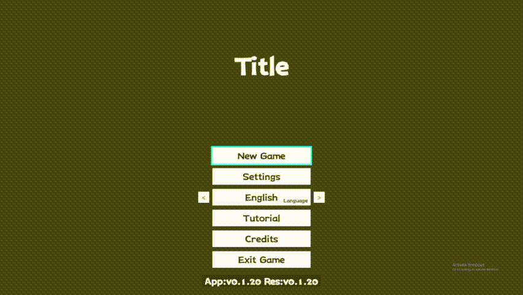

# CycloneGames.InputSystem

A production-grade, reactive input wrapper around Unity Input System with context stacks, multi-player device pairing, YAML-driven configuration, and optional analysis tools for recording, gesture recognition, and anti-cheat validation.

English | [简体中文](./README.SCH.md)

## Install

- Unity 2022.3+
- Enable Input System package
- Dependencies: UniTask, R3, VYaml, CycloneGames.Utility, CycloneGames.Logger

## Quick Start

### Step 1: Generate Default Config

Open the editor window: `Tools → CycloneGames → Input System Editor`, then click **Generate Default Config** to create the default YAML configuration file.

### Step 2: Configure Code Generation (Recommended)

In the editor window:

1. Set the **Output Directory** (e.g., `Assets/Scripts/Generated`) and **Namespace** (e.g., `YourGame.Input.Generated`).
2. Click **Save and Generate Constants** to save the configuration and generate the `InputActions.cs` file.

The generated file contains:

- `InputActions.Contexts.*` — String constants for context names
- `InputActions.ActionMaps.*` — String constants for action map names
- `InputActions.Actions.*` — Integer hash IDs for actions (zero-GC access)

These constants enable type-safe, allocation-free input access at runtime.

### Step 3: Initialize at Boot

Load the configuration at game startup:

```csharp
using CycloneGames.IO.Runtime;
using CycloneGames.InputSystem.Runtime;
using Cysharp.Threading.Tasks;

var defaultUri = FilePathUtility.GetUnityWebRequestUri("input_config.yaml", UnityPathSource.StreamingAssets);
var userUri = FilePathUtility.GetUnityWebRequestUri("user_input_settings.yaml", UnityPathSource.PersistentData);
await InputSystemLoader.InitializeAsync(defaultUri, userUri);
```

`InputSystemLoader` prioritizes the user configuration (`PersistentData`), falling back to the default (`StreamingAssets`). On first run, it automatically copies the default to the user directory.

### Step 4: Join Player and Create First Context

```csharp
using UnityEngine;
using CycloneGames.InputSystem.Runtime;
using R3;
using YourGame.Input.Generated;

public class SimplePlayer : MonoBehaviour
{
    private IInputPlayer _input;
    private InputContext _context;

    private void Start()
    {
        _input = InputManager.Instance.JoinSinglePlayer(0);

        _context = new InputContext(InputActions.ActionMaps.PlayerActions, InputActions.Contexts.Gameplay)
            .AddBinding(_input.GetVector2Observable(InputActions.Actions.Gameplay_Move), new MoveCommand(OnMove))
            .AddBinding(_input.GetButtonObservable(InputActions.Actions.Gameplay_Confirm), new ActionCommand(OnConfirm))
            .AddBinding(_input.GetLongPressObservable(InputActions.Actions.Gameplay_Confirm), new ActionCommand(OnConfirmLongPress));

        _context.AddTo(this);        // Auto-cleanup on destroy
        _input.PushContext(_context);
    }

    private void OnMove(Vector2 dir) => transform.position += new Vector3(dir.x, 0f, dir.y) * Time.deltaTime * 5f;
    private void OnConfirm() => Debug.Log("Confirm pressed");
    private void OnConfirmLongPress() => Debug.Log("Confirm long-pressed");
}
```

## Core Concepts

### 4.1 Context Stack

A **Context** is a named collection of input bindings. The **Context Stack** is a LIFO stack: only the top context's bindings are active. This models UI overlays, gameplay/pause transitions, and cutscene interruptions naturally.

**Key behaviors:**

| Action | Behavior |
|--------|----------|
| `PushContext(ctx)` | Deactivates the current top, pushes `ctx` to top, then activates it |
| `CaptureContext(ctx)` | Temporarily activates `ctx` above the normal stack until the returned scope is disposed |
| `RemoveContext(ctx)` | Removes `ctx` by object reference from anywhere in the stack |
| `PopContext()` | Removes the top element (avoid when using `AddTo`) |
| `AddTo(component)` | Binds lifecycle to a `MonoBehaviour` — auto-removes on destroy |
| Auto-Focus | Pushing a context already in the stack moves it to the top |

Each `new InputContext(...)` creates an independent object. Even contexts with the same name are distinct instances — `RemoveContext` only removes the specified instance.

```csharp
// UI A (gameplay HUD)
var ctxA = new InputContext("UIActions", "HUD")
    .AddBinding(input.GetButtonObservable("UIActions", "Pause"), new ActionCommand(Pause));
ctxA.AddTo(this);
input.PushContext(ctxA);  // Stack: [HUD]

// UI B (pause menu) overlays A
var ctxB = new InputContext("UIActions", "PauseMenu")
    .AddBinding(input.GetButtonObservable("UIActions", "Resume"), new ActionCommand(Resume));
ctxB.AddTo(this);
input.PushContext(ctxB);  // Stack: [HUD, PauseMenu]. HUD paused, PauseMenu active.

// OnDisable of ctxB's owner → ctxB auto-removed. HUD resumes automatically.
```

Multiple contexts can safely share the same ActionMap name. Each context's bindings are independent — only the top context's bindings subscribe.

### 4.1.1 Scoped Input Capture

`CaptureContext(ctx)` temporarily makes a context the active input owner without blocking normal stack updates. It is designed for full-screen loading screens, movies, modal dialogs, and other overlays that must keep receiving input while gameplay systems continue to initialize underneath.

During a capture:

| Operation | Behavior |
|----------|----------|
| `CaptureContext(ctx)` | Activates `ctx` above the normal context stack and returns an `IDisposable` scope |
| `PushContext(gameplayCtx)` | Still updates the normal stack, but does not steal active input while a capture exists |
| `RemoveContext(ctx)` / `ctx.Dispose()` | Removes the context from both the normal stack and the capture stack |
| Disposing the capture scope | Restores the next captured context, or the normal stack top if no captures remain |

```csharp
var loadingContext = new InputContext("UIActions", "Loading")
    .AddBinding(input.GetButtonObservable("UIActions", "Cancel"), new ActionCommand(CancelLoading));

loadingContext.AddTo(this);
using (input.CaptureContext(loadingContext))
{
    await LoadWorldAsync();

    // These can safely push contexts while the loading UI stays active.
    input.PushContext(gameplayContext);
    input.PushContext(playerControllerContext);
}

// Loading capture is released. The active input returns to the real stack top.
```

Captures are stack-based and nest naturally. If a loading screen opens a confirmation dialog, capture the dialog context; disposing it returns input to the loading context.

### 4.2 InputPlayer & IInputPlayer

`IInputPlayer` is the public contract for a single player's input. `InputPlayer` is the engine: it holds the action asset, manages the context stack, wires observables, and detects device changes.

**Joining a player** pairs required devices with an `InputUser`. The manager discovers devices from the YAML config:

```csharp
// Single-player: auto-locks all required devices
var input = InputManager.Instance.JoinSinglePlayer(0);

// Async: wait for devices to connect (with timeout)
var input = await InputManager.Instance.JoinSinglePlayerAsync(0, timeoutInSeconds: 5);

// Get an already-joined player
var input = InputManager.Instance.GetInputPlayer(0);
```

**`ActiveDeviceKind`** is a reactive property (`InputDeviceKind.KeyboardMouse`, `Gamepad`, `Touchscreen`, `Other`) that tracks the last-used device. It is only updated when a context is active on top of the stack, so device detection respects input priority.

### 4.3 Commands

Commands are the contract between observable streams and your game logic. Four interfaces define the handler signatures:

| Command Interface | Signature | For Type |
|-------------------|-----------|----------|
| `IActionCommand` | `void Execute()` | Button |
| `IMoveCommand` | `void Execute(Vector2 direction)` | Vector2 |
| `IScalarCommand` | `void Execute(float value)` | Float |
| `IBoolCommand` | `void Execute(bool value)` | Bool (press state) |

Convenience classes wrap delegates:

```csharp
new ActionCommand(() => Debug.Log("Pressed"));
new MoveCommand(dir => MoveCharacter(dir));
new ScalarCommand(value => SetVolume(value));
new BoolCommand(pressed => HandlePressState(pressed));
```

### 4.4 Observables

Every action produces reactive streams. The following observables are available on `IInputPlayer`:

| Observable | Returns | Description |
|------------|---------|-------------|
| `GetButtonObservable` | `Observable<Unit>` | Emits on button press |
| `GetVector2Observable` | `Observable<Vector2>` | Emits analog/digital direction |
| `GetScalarObservable` | `Observable<float>` | Emits scalar value (triggers, axis) |
| `GetLongPressObservable` | `Observable<Unit>` | Emits after configured hold duration |
| `GetLongPressProgressObservable` | `Observable<float>` | Continuous 0→1 progress; emits -1 on cancel |
| `GetPressStateObservable` | `Observable<bool>` | `true` on press start, `false` on release |
| `GetChordObservable` | `Observable<Unit>` | Emits when two buttons overlap in time window |

Each observable has three API variants:

```csharp
// String-based (compatibility)
input.GetButtonObservable("PlayerActions", "Confirm");
input.GetButtonObservable("Confirm");                            // uses active context's ActionMap

// Int-based (zero-GC, uses generated constants)
input.GetButtonObservable(InputActions.Actions.Gameplay_Confirm);
```

## Features Guide

### 5.1 Runtime Key Rebinding

Override bindings at runtime without modifying the YAML config:

```csharp
// Override a specific binding
input.RebindAction("PlayerActions", "Jump", "<Keyboard>/space", "<Keyboard>/j");

// Reset a specific action to defaults
input.ResetActionBinding("PlayerActions", "Jump");

// Reset all actions
input.ResetAllActionBindings();

// Get current effective bindings (includes overrides)
string[] bindings = input.GetActionBindings("PlayerActions", "Jump");
```

Also available via `InputManager.Instance` with a `playerId` parameter.

### 5.2 Chord (Combo) Detection

Detect two buttons pressed within a time window (e.g., A+B combo):

```csharp
// Emits when both "Jump" and "Attack" are held within 200ms
input.GetChordObservable("PlayerActions", "Jump", "Attack", windowMs: 200f)
    .Subscribe(_ => PerformSpecialMove());
```

The chord resets when either button is released and can fire again on the next overlap.

### 5.3 Long Press

Configure long-press duration per action in YAML (`longPressMs`). At runtime, subscribe to either the completion event or the continuous progress stream:

```csharp
// Completion event
input.GetLongPressObservable("PlayerActions", "Interact")
    .Subscribe(_ => StartInteraction());

// Progress stream (0→1) for UI bars
input.GetLongPressProgressObservable("PlayerActions", "Interact")
    .Subscribe(progress =>
    {
        if (progress < 0f) progressBar.SetActive(false);   // cancelled
        else if (progress >= 1f) CompleteAction();          // done
        else { progressBar.SetActive(true); progressBar.fillAmount = progress; }
    });
```

Progress value meanings:

| Value | Meaning |
|-------|---------|
| `0~1` | Progress (0% → 100%) |
| `1.0` | Completed (emits once) |
| `-1` | Cancelled (released early) |

### 5.4 Context-Specific Short/Long Press

The same physical button can trigger short press in one context and long press in another. Define two contexts with different YAML `longPressMs`:

```yaml
contexts:
  - name: Inspect
    actionMap: PlayerActions
    bindings:
      - type: Button
        action: Confirm
        # No longPressMs — short press only
        deviceBindings:
          - "<Keyboard>/space"
          - "<Gamepad>/buttonSouth"
  - name: Charge
    actionMap: PlayerActions
    bindings:
      - type: Button
        action: Confirm
        longPressMs: 600
        deviceBindings:
          - "<Keyboard>/space"
          - "<Gamepad>/buttonSouth"
```

```csharp
var ctxInspect = new InputContext("PlayerActions", "Inspect")
    .AddBinding(input.GetButtonObservable("PlayerActions", "Confirm"), new ActionCommand(OnInspect));
var ctxCharge = new InputContext("PlayerActions", "Charge")
    .AddBinding(input.GetLongPressObservable("PlayerActions", "Confirm"), new ActionCommand(OnCharge));

input.PushContext(ctxInspect);  // short press
// later:
input.PushContext(ctxCharge);   // long press
```

### 5.5 Input Blocking

Temporarily disable all input without destroying contexts:

```csharp
input.BlockInput();    // Disables the entire InputActionAsset
input.UnblockInput();  // Re-enables the active context's ActionMap
```

`BlockInput` / `UnblockInput` are nest-safe: input is restored only after every block has been released. Prefer the scoped form for async flows:

```csharp
using (input.BlockInputScope())
{
    await LoadWorldAsync();

    // Gameplay systems may still push contexts here, but no input is emitted.
    input.PushContext(gameplayContext);
    input.PushContext(playerControllerContext);
}

// Input resumes from the current capture context or normal stack top.
```

Useful for transitions or hard pauses where no layer should receive input. Prefer `CaptureContext` for loading screens or modal overlays that still need their own buttons while gameplay content loads underneath.

### 5.6 Loading / Modal Input Pattern

Use scoped capture when an overlay must stay interactive while lower layers register their own input contexts.

```csharp
private IDisposable _loadingInputCapture;
private InputContext _loadingContext;

private async UniTask ShowLoadingAndEnterGameplayAsync()
{
    _loadingContext = new InputContext("UIActions", "Loading")
        .AddBinding(_input.GetButtonObservable("UIActions", "Skip"), new ActionCommand(TrySkip));

    _loadingContext.AddTo(this);
    _loadingInputCapture = _input.CaptureContext(_loadingContext);

    await InitializeGameplayAsync(); // PlayerController/HUD may PushContext here.

    _loadingInputCapture.Dispose();
    _loadingInputCapture = null;
}
```

Use `try/finally` for long-running tasks so capture is released even when the loading operation fails or is cancelled.

### 5.7 Device Icon Switching

`InputDeviceIconSet` is a `ScriptableObject` that maps `InputDeviceKind` to sprites. `InputDeviceIconSwitcher` is a `MonoBehaviour` that auto-updates a `UI.Image` when the active device changes.

```
1. Create the asset: Assets → Create → CycloneGames → Input → Device Icon Set
2. Assign keyboard, gamepad, and touch sprites
3. Attach InputDeviceIconSwitcher to a GameObject with an Image component
4. Assign the icon set in the Inspector
```

The switcher subscribes to player 0's `ActiveDeviceKind` and updates on change. No code required.

### 5.8 Mouse Button Polling

Three polling properties for direct mouse button state, safe to call even when no mouse is present:

```csharp
bool leftDown = input.IsLeftMouseButtonPressed;
bool rightDown = input.IsRightMouseButtonPressed;
bool middleDown = input.IsMiddleMouseButtonPressed;
```

## YAML Configuration

The input configuration is a single YAML file. The schema supports `schemaFingerprint` for automatic version tracking.

### Complete Schema Reference

```yaml
schemaFingerprint: "..."      # Auto-generated schema version hash

joinAction:                   # Global: action for player join detection
  type: Button
  action: JoinGame
  deviceBindings:
    - "<Keyboard>/enter"
    - "<Gamepad>/start"

playerSlots:
  - playerId: 0               # Player slot ID
    joinAction:               # Per-slot join override (optional)
      type: Button
      action: JoinGame
      deviceBindings:
        - "<Keyboard>/enter"
    contexts:
      - name: Gameplay        # Context display name (for debugging)
        actionMap: PlayerActions  # Unity Input System ActionMap name
        bindings:
          - type: Vector2     # ActionValueType: Button | Vector2 | Float
            action: Move      # Action identifier within the ActionMap
            updateMode: Polling  # EventDriven (default) | Polling (for delta/mouse input)
            deviceBindings:
              - "<Gamepad>/leftStick"
              - "2DVector(mode=2,up=<Keyboard>/w,down=<Keyboard>/s,left=<Keyboard>/a,right=<Keyboard>/d)"
              - "<Mouse>/delta"
          - type: Button
            action: Confirm
            longPressMs: 500           # Optional: long-press duration in ms (>0 enables)
            deviceBindings:
              - "<Gamepad>/buttonSouth"
              - "<Keyboard>/space"
          - type: Float
            action: FireTrigger
            longPressMs: 600           # Optional: long-press for float actions
            longPressValueThreshold: 0.6  # Threshold (0-1) for float long-press activation
            deviceBindings:
              - "<Gamepad>/leftTrigger"
```

### All YAML Fields

| Field | Type | Required | Description |
|-------|------|----------|-------------|
| `schemaFingerprint` | string | auto | Schema version hash; auto-computed on save |
| `joinAction.type` | Button/Vector2/Float | yes | Action value type |
| `joinAction.action` | string | yes | Action name |
| `joinAction.deviceBindings` | string[] | yes | Device binding paths |
| `playerSlots[].playerId` | int | yes | Player slot index |
| `playerSlots[].joinAction` | object | no | Per-slot join override |
| `contexts[].name` | string | yes | Context display name |
| `contexts[].actionMap` | string | yes | Unity Input System ActionMap name |
| `bindings[].type` | Button/Vector2/Float | yes | Value type |
| `bindings[].action` | string | yes | Action name |
| `bindings[].deviceBindings` | string[] | yes | Device paths (supports inline 2DVector composites) |
| `bindings[].updateMode` | EventDriven/Polling | no | Auto-detect if omitted; Polling needed for mouse delta |
| `bindings[].longPressMs` | int | no | Long-press duration; 0 or omitted = disabled |
| `bindings[].longPressValueThreshold` | float | no | Float threshold (0-1) for long-press; default 0.5 |

## Multi-Player Modes

### Single-Player (Auto-Lock Devices)

All required devices are locked to one player. Call it multiple times safely — returns the existing service if already joined.

```csharp
var input = InputManager.Instance.JoinSinglePlayer(0);
```

### Lobby Mode — Device Locking

The first device creates Player 0. Subsequent devices are paired to the same player. Ideal for letting a single player switch between keyboard and gamepad.

```csharp
InputManager.Instance.OnPlayerInputReady += OnPlayerReady;
InputManager.Instance.StartListeningForPlayers(true);  // lockDeviceOnJoin = true
```

### Lobby Mode — Shared Devices

Each new device creates a new player (Player 0, 1, 2...). Perfect for local co-op.

```csharp
InputManager.Instance.StartListeningForPlayers(false);  // lockDeviceOnJoin = false
```

### Batch Join

```csharp
// Synchronous
var players = InputManager.Instance.JoinPlayersBatch(new List<int> { 0, 1, 2 });

// Asynchronous with timeout
var players = await InputManager.Instance.JoinPlayersBatchAsync(
    new List<int> { 0, 1, 2 }, timeoutPerPlayerInSeconds: 5);
```

### Async Join (Wait for Devices)

```csharp
var input = await InputManager.Instance.JoinSinglePlayerAsync(0, timeoutInSeconds: 5);
if (input != null) { /* player joined */ }
```

### Manual Device Locking

```csharp
var input = InputManager.Instance.JoinPlayerAndLockDevice(0, Keyboard.current);
```

### Shared Device Mode

Multiple players share the same keyboard — suitable for turn-based or hot-seat games.

```csharp
var p0 = InputManager.Instance.JoinPlayerOnSharedDevice(0);
var p1 = InputManager.Instance.JoinPlayerOnSharedDevice(1);
```

## Runtime Configuration Management

### Hot Reload

Reload configuration at runtime — existing players keep their current config; new players use the updated one.

```csharp
bool success = await InputManager.Instance.ReloadConfigurationAsync();
```

### Save User Configuration

Persist the current configuration to the user directory.

```csharp
await InputManager.Instance.SaveUserConfigurationAsync();
```

### Reset to Default

Delete user config and reinitialize from the default. Cross-platform: Windows, macOS, Linux, Android, iOS, WebGL.

```csharp
var defaultUri = FilePathUtility.GetUnityWebRequestUri("input_config.yaml", UnityPathSource.StreamingAssets);
var userUri = FilePathUtility.GetUnityWebRequestUri("user_input_settings.yaml", UnityPathSource.PersistentData);
bool success = await InputSystemLoader.ResetToDefaultAsync(defaultUri, userUri);
```

### Events

```csharp
// Player joins or input is refreshed
InputManager.Instance.OnPlayerInputReady += (IInputPlayer player) => { /* setup contexts */ };

// Configuration reloaded
InputManager.Instance.OnConfigurationReloaded += () => { /* re-bind UI */ };

// Refresh an already-joined player (e.g., when switching scenes)
InputManager.Instance.RefreshPlayerInput(0);

// Context changes on a specific player
input.OnContextChanged += (string contextName) => Debug.Log($"Context: {contextName}");
```

### Lifecycle Patterns

**Pattern 1: Shared Context Instance** — For static bindings used across scenes:

```csharp
public static class InputContextManager
{
    private static InputContext _shared;
    public static InputContext GetGameplay(IInputPlayer input)
    {
        if (_shared == null)
            _shared = new InputContext(InputActions.ActionMaps.PlayerActions, InputActions.Contexts.Gameplay)
                .AddBinding(input.GetVector2Observable(InputActions.Actions.Gameplay_Move), new MoveCommand(OnMove))
                .AddBinding(input.GetButtonObservable(InputActions.Actions.Gameplay_Confirm), new ActionCommand(OnConfirm));
        return _shared;
    }
}
```

**Pattern 2: Per-Scene Context** — For dynamic bindings, create a new context in each scene and use `AddTo(this)`.

**Pattern 3: Create-First-Bind-Later** — Create context objects early, add bindings dynamically later, then push:

```csharp
var ctx = new InputContext(InputActions.ActionMaps.PlayerActions, InputActions.Contexts.Gameplay);
// ... later:
ctx.AddBinding(input.GetButtonObservable(InputActions.Actions.Gameplay_Jump), new ActionCommand(OnJump));
input.PushContext(ctx);  // bindings take effect immediately

// If context is already active, refresh after adding bindings:
if (input.ActiveContextName.CurrentValue == InputActions.Contexts.Gameplay)
{
    ctx.AddBinding(input.GetButtonObservable(InputActions.Actions.Gameplay_Attack), new ActionCommand(OnAttack));
    input.RefreshActiveContext();  // re-subscribes all bindings
}
```

### Fine-Grained Binding Management

Remove individual bindings without affecting the entire context:

```csharp
var observable = input.GetButtonObservable(InputActions.Actions.Gameplay_Jump);
ctx.AddBinding(observable, new ActionCommand(OnJump));
// ... later:
input.RemoveBindingFromContext(ctx, observable);  // removes only this binding
```

### Cursor Visibility Management

`InputManager` can auto-manage cursor visibility based on active device:

```csharp
InputManager.Instance.ManageCursorVisibility = true;  // Hide cursor on gamepad, show on keyboard
InputManager.Instance.ResetCursorToCenter = true;      // Warp cursor to center when showing
```

## Input Tools

Tools are in `CycloneGames.InputSystem.Tools.Runtime.asmdef`. Import only when needed.

### 9.1 InputRecorder — Recording & Replay

Record input actions over time and replay them as observable streams. Useful for automated testing, tutorial demos, or ghost runs.

```csharp
using CycloneGames.InputSystem.Runtime;

var recorder = new InputRecorder();
recorder.RecordAction("PlayerActions", "Move");
recorder.RecordAction("PlayerActions", "Jump");
recorder.RecordAction("PlayerActions", "Attack");

recorder.StartRecording(input);     // recording begins
// ... player plays ...
var recording = recorder.StopRecording();

// Replay as observables
recording.CreateReplayVector2Observable()
    .Subscribe(dir => MoveCharacter(dir));
recording.CreateReplayUnitObservable()
    .Subscribe(_ => Jump());
```

| Replay Method | Returns |
|---------------|---------|
| `CreateReplayVector2Observable()` | `Observable<Vector2>` |
| `CreateReplayFloatObservable()` | `Observable<float>` |
| `CreateReplayUnitObservable()` | `Observable<Unit>` |

### 9.2 InputSequenceMatcher — Sequence & Gesture Recognition

Detect sequences of button/direction inputs in a recording. Built-in gesture definitions for fighting game motions.

**Sequence Matching:**

```csharp
using CycloneGames.InputSystem.Runtime;

// Record a fight sequence
var recorder = new InputRecorder();
recorder.RecordAction("PlayerActions", "Move");
recorder.StartRecording(input);
// ... player performs inputs ...
var recording = recorder.StopRecording();

// Define: Punch → Kick within 400ms, Kick within 200ms of Punch
var sequence = new SequenceStep[]
{
    new SequenceStep { ActionMapName = "PlayerActions", ActionName = "Punch", ExpectedType = ActionValueType.Button, MaxDelayMs = 400 },
    new SequenceStep { ActionMapName = "PlayerActions", ActionName = "Kick", ExpectedType = ActionValueType.Button, MaxDelayMs = 200 }
};

var result = InputSequenceMatcher.DetectSequence(recording, sequence);
if (result.Matched)
    Debug.Log($"Combo detected {result.OccurrenceCount} times. Best: {result.BestTotalDuration:F2}s");
```

**Gesture Recognition (Fighting Game Motions):**

```csharp
// Record analog stick
var recorder = new InputRecorder();
recorder.RecordAction("PlayerActions", "Move");
recorder.StartRecording(input);
// ... player performs quarter-circle forward ...
var recording = recorder.StopRecording();

// Detect quarter-circle forward (↓↘→)
var result = InputGestureRecognizer.DetectGesture(recording, GestureDefinition.QuarterCircleForward);
if (result.Matched)
    Debug.Log($"Quarter Circle Forward detected! Duration: {result.Duration:F3}s");

// Available built-in gestures:
//   QuarterCircleForward, QuarterCircleBack, DragonPunch
//   HalfCircleForward, HalfCircleBack, FullCircle
//   DashForward, DashBack
```

Define custom gestures:

```csharp
var myGesture = new GestureDefinition(
    "Super Move",
    new[] { Direction8Way.Right, Direction8Way.Down, Direction8Way.DownRight },
    timeWindowSec: 0.35f,
    inputDeadZone: 0.3f
);
var result = InputGestureRecognizer.DetectGesture(recording, myGesture);
```

### 9.3 InputTimingValidator — Anti-Cheat Timing Validation

Analyze input timing for statistical anomalies indicating automation/bots.

**Anti-Cheat Timing Validation:**

```csharp
using CycloneGames.InputSystem.Runtime;

var recorder = new InputRecorder();
recorder.RecordAction("RhythmActions", "Hit");
recorder.StartRecording(input);
// ... player plays a rhythm section ...
var recording = recorder.StopRecording();

float[] beats = { 0.0f, 0.5f, 1.0f, 1.5f, 2.0f, 2.5f, 3.0f, 3.5f };

var result = InputTimingValidator.ValidateTiming(
    recording, beats, "RhythmActions", "Hit",
    TimingValidationConfig.Normal,
    timingWindowMs: 100f
);

Debug.Log($"Human score: {result.HumanLikenessScore:F2}");
Debug.Log($"Mean deviation: {result.MeanDeviationMs:F1}ms");
Debug.Log($"Definitively bot: {result.IsDefinitivelyBot}");
Debug.Log($"Suspicious perfect: {result.IsSuspiciousPerfect}");
Debug.Log($"Autocorrelation: {result.AutocorrelationLag1:F3}");
```

**Tier 1 — Hard blocks** (physically impossible for humans → near-zero false positive):
- `IsSuspiciousPerfect` — impossibly consistent timing
- `IsSuspiciousSubFrame` — 80%+ hits within sub-frame precision
- `IsSuspiciousUniform` — chi-square test on deviation distribution
- `IsDefinitivelyBot` — any Tier 1 trigger → definitive bot

**Tier 2 — Soft scoring indicators** (statistical anomalies):
- `IsSuspiciousRandom` — autocorrelation ≈ 0 (independent timing — no human inertia)
- `IsSuspiciousDriftless` — no drift slope (humans naturally drift ahead or behind)
- `IsSuspiciousZeroMean` — near-zero mean deviation with high variance

**Config presets:** `Casual`, `Normal`, `Hard`, `Pro`, `Tournament`, `AntiCheatFocus`.


### 9.4 InputBindingValidator — Context-Aware Conflict Detection

Detect binding path conflicts within a context, with severity classification:

```csharp
// Check all contexts for a player
var conflicts = InputManager.Instance.CheckBindingConflicts(playerId: 0);

// Check a specific context
var conflicts = InputManager.Instance.CheckBindingConflicts(0, "Gameplay");

// Format a readable report
string report = InputManager.FormatConflictsReport(conflicts);
Debug.Log(report);
```

Conflict severity:
- **Critical** — Same type, same binding path (ambiguous)
- **Warning** — Different type, same binding path
- **Info** — Same binding path but differentiated by long-press timing

## UGUI Integration: ItemNavigator

`ItemNavigator` is a zero-GC UGUI navigation component set for gamepad and keyboard navigation, with seamless mouse and touch support.



### Key Features

- **Zero GC**: all runtime operations are allocation-free
- **Multi-control**: Button, Toggle, Slider, custom Transform
- **Vertical and Horizontal** navigators
- **Smart focus**: movable indicator, auto-skips disabled items
- **Touch Confirmation Gate**: first touch focuses, second confirms — prevents accidental triggers when switching from gamepad
- **Unified events**: no need to bind `onClick` / `onValueChanged` separately — use `OnConfirm` callback for everything

### Usage

```csharp
using UnityEngine;
using UnityEngine.UI;
using CycloneGames.InputSystem.Runtime;
using R3;

public class SettingsMenu : MonoBehaviour
{
    [SerializeField] private Slider _volumeSlider;
    [SerializeField] private Slider _brightnessSlider;
    [SerializeField] private Toggle _fullscreenToggle;
    [SerializeField] private Button _backButton;
    [SerializeField] private Transform _focusIndicator;

    private MenuNavigatorVertical _navigator;
    private IInputPlayer _input;
    private InputContext _context;

    private void Start()
    {
        _navigator = gameObject.AddComponent<MenuNavigatorVertical>();
        _input = InputManager.Instance.GetInputPlayer(0);

        _navigator.Initialize(
            setupData: new NavigableItemSetup[]
            {
                new NavigableItemSetup
                {
                    Slider = _volumeSlider,
                    SliderConfig = SliderConfig.Default,
                    OnFocused = t => Debug.Log("Volume focused"),
                    OnConfirm = () => Debug.Log("Volume confirmed")
                },
                new NavigableItemSetup
                {
                    Slider = _brightnessSlider,
                    SliderConfig = new SliderConfig { Step = 0.05f }
                },
                new NavigableItemSetup
                {
                    Toggle = _fullscreenToggle,
                    OnConfirm = () => _fullscreenToggle.isOn = !_fullscreenToggle.isOn
                },
                new NavigableItemSetup
                {
                    Button = _backButton,
                    OnConfirm = () => CloseMenu()
                }
            },
            focusIndicator: _focusIndicator,
            defaultFocusIndex: 0,
            allowLooping: true,
            focusIndicatorOnTop: true,
            inputPlayer: _input
        );

        _context = new InputContext("UIActions", "Settings")
            .AddBinding(_input.GetVector2Observable("UIActions", "Navigate"),
                new MoveCommand(dir => _navigator.Navigate(dir)))
            .AddBinding(_input.GetButtonObservable("UIActions", "Confirm"),
                new ActionCommand(() => _navigator.ConfirmSelection()))
            .AddBinding(_input.GetButtonObservable("UIActions", "Cancel"),
                new ActionCommand(() => _navigator.TryCancelEdit()));

        _context.AddTo(this);
        _input.PushContext(_context);
    }

    private void Update()
    {
        if (_input != null)
            _navigator.UpdateSmoothSlider(_input.GetVector2Observable("UIActions", "Navigate")
                .ToReadOnlyReactiveProperty().CurrentValue);
    }

    private void CloseMenu() { /* ... */ }
}
```

### SliderConfig

| Mode | Step | SmoothSpeed | Behavior |
|------|------|-------------|----------|
| **Step** (default) | 0.1 | 0 | Press = discrete step |
| **Smooth** | 0 | 1.0 | Hold = continuous per-second |
| **Hybrid** | 0.1 | 0.5 | Press = step, Hold = smooth |

Presets: `SliderConfig.Default`, `SliderConfig.Smooth`, `SliderConfig.Hybrid`.

`RequireConfirmToEdit` — requires confirm to enter Slider edit mode, preventing accidental value changes.

### Horizontal Navigation

For tabs, pagination, etc.:

```csharp
var navigator = gameObject.AddComponent<MenuNavigatorHorizontal>();
navigator.Initialize(
    setupData: new HorizontalNavItemSetup[]
    {
        new HorizontalNavItemSetup { Button = tab1, OnConfirm = () => SwitchTab(0) },
        new HorizontalNavItemSetup { Button = tab2, OnConfirm = () => SwitchTab(1) }
    },
    focusIndicator: indicator,
    defaultFocusIndex: 0,
    allowLooping: true,
    inputPlayer: InputManager.Instance.GetInputPlayer(0)
);
```

### Custom Transform Navigation

For non-Selectable components:

```csharp
new NavigableItemSetup
{
    CustomTransform = customComponent.transform,
    OnConfirm = () => customComponent.Confirm(),
    OnNavigateLeft = () => customComponent.Previous(),
    OnNavigateRight = () => customComponent.Next(),
    OnFocused = t => customComponent.OnFocus(),
    OnUnfocused = t => customComponent.OnUnfocus()
}
```

## VContainer Integration

The package includes a VContainer installer for dependency injection.

### Installation

```csharp
using VContainer;
using VContainer.Unity;
using CycloneGames.InputSystem.Runtime.Integrations.VContainer;

public class GameLifetimeScope : LifetimeScope
{
    protected override void Configure(IContainerBuilder builder)
    {
        var installer = new InputSystemVContainerInstaller(
            defaultConfigFileName: "input_config.yaml",
            userConfigFileName: "user_input_settings.yaml",
            postInitCallback: async resolver =>
            {
                var inputResolver = resolver.Resolve<IInputPlayerResolver>();
                var player0 = inputResolver.GetInputPlayer(0);
                // setup contexts...
            }
        );
        installer.Install(builder);

        builder.Register<PlayerController>(Lifetime.Scoped);
    }
}
```

### Usage Pattern

```csharp
using CycloneGames.InputSystem.Runtime;
using CycloneGames.InputSystem.Runtime.Integrations.VContainer;
using VContainer;

public class PlayerController
{
    private readonly IInputPlayerResolver _inputResolver;
    private IInputPlayer _input;

    [Inject]
    public PlayerController(IInputPlayerResolver inputResolver)
    {
        _inputResolver = inputResolver;
    }

    public void Initialize(int playerId)
    {
        _input = _inputResolver.GetInputPlayer(playerId);
        var ctx = new InputContext(InputActions.ActionMaps.PlayerActions, InputActions.Contexts.Gameplay)
            .AddBinding(_input.GetVector2Observable(InputActions.Actions.Gameplay_Move), new MoveCommand(OnMove))
            .AddBinding(_input.GetButtonObservable(InputActions.Actions.Gameplay_Confirm), new ActionCommand(OnConfirm));
        _input.PushContext(ctx);
    }

    private void OnMove(Vector2 dir) { /* ... */ }
    private void OnConfirm() { /* ... */ }
}
```

## API Reference

### IInputPlayer

| Member | Type | Description |
|--------|------|-------------|
| `ActiveContextName` | `ReadOnlyReactiveProperty<string>` | Current active context name |
| `ActiveDeviceKind` | `ReadOnlyReactiveProperty<InputDeviceKind>` | Active device: KeyboardMouse/Gamepad/Touchscreen/Other |
| `OnContextChanged` | `event Action<string>` | Fires when context stack top changes |
| `PlayerId` | `int` | Player ID (InputPlayer only) |
| `User` | `InputUser` | Unity Input System user (InputPlayer only) |

**Observables** (3 overloads each: `actionName`, `map+action`, `actionId`):

| Method | Returns | Description |
|--------|---------|-------------|
| `GetButtonObservable` | `Observable<Unit>` | Button press stream |
| `GetVector2Observable` | `Observable<Vector2>` | 2D directional stream |
| `GetScalarObservable` | `Observable<float>` | Scalar value stream |
| `GetLongPressObservable` | `Observable<Unit>` | Long-press completion |
| `GetLongPressProgressObservable` | `Observable<float>` | Long-press 0→1 progress, -1 on cancel |
| `GetPressStateObservable` | `Observable<bool>` | Press state (true/false) |
| `GetChordObservable` | `Observable<Unit>` | Two-button chord within window |
| `GetActiveDeviceKindObservableForContext` | `Observable<InputDeviceKind>` | Device kind scoped to context |

**Context Management:**

| Method | Description |
|--------|-------------|
| `PushContext(InputContext)` | Push to stack (auto-focus if already present) |
| `CaptureContext(InputContext)` | Temporarily capture active input above the normal stack; dispose the returned scope to release |
| `RemoveContext(InputContext)` | Remove by object reference from anywhere |
| `PopContext()` | Remove top (avoid with `AddTo`) |
| `RefreshActiveContext()` | Re-subscribe all bindings for active context |

**Input Control:**

| Method | Description |
|--------|-------------|
| `BlockInput()` / `UnblockInput()` | Temporarily disable/re-enable all input |
| `BlockInputScope()` | Scoped, nest-safe input block for `using` / async loading flows |
| `RebindAction(map, action, old, new)` | Override a binding at runtime |
| `ResetActionBinding(map, action)` | Reset single action to default |
| `ResetAllActionBindings()` | Reset all actions to defaults |
| `GetActionBindings(map, action)` | Get current effective binding paths |
| `IsLeftMouseButtonPressed` | Left mouse button polling |
| `IsRightMouseButtonPressed` | Right mouse button polling |
| `IsMiddleMouseButtonPressed` | Middle mouse button polling |

### InputManager

| Member | Type | Description |
|--------|------|-------------|
| `Instance` | `static InputManager` | Singleton instance |
| `IsListeningForPlayers` | `static bool` | Lobby listening state |
| `ManageCursorVisibility` | `bool` | Auto-hide cursor on gamepad |
| `ResetCursorToCenter` | `bool` | Warp cursor to center on show |

**Events:**

| Event | Signature | Description |
|-------|-----------|-------------|
| `OnPlayerInputReady` | `Action<IInputPlayer>` | Player joined or refreshed |
| `OnConfigurationReloaded` | `Action` | Config hot-reloaded |

**Player Join:**

| Method | Description |
|--------|-------------|
| `JoinSinglePlayer(id)` | Sync join, auto-lock devices |
| `JoinSinglePlayerAsync(id, timeout)` | Async join with device wait |
| `JoinPlayersBatch(ids)` | Sync batch join |
| `JoinPlayersBatchAsync(ids, timeout)` | Async batch join |
| `JoinPlayerOnSharedDevice(id)` | Shared keyboard join |
| `JoinPlayerAndLockDevice(id, device)` | Lock specific device |
| `GetInputPlayer(id)` | Get existing player or null |
| `RefreshPlayerInput(id)` | Re-fire `OnPlayerInputReady` |
| `RemovePlayer(id)` | Remove and dispose player |

**Lobby:**

| Method | Description |
|--------|-------------|
| `StartListeningForPlayers(lockDevice)` | Begin join detection |
| `StopListeningForPlayers()` | Stop join detection |

**Configuration:**

| Method | Description |
|--------|-------------|
| `ReloadConfigurationAsync()` | Hot-reload config |
| `SaveUserConfigurationAsync()` | Persist current config |

**Conflict Detection:**

| Method | Description |
|--------|-------------|
| `CheckBindingConflicts(playerId)` | All contexts for a player |
| `CheckBindingConflicts(playerId, contextName)` | Specific context only |
| `FormatConflictsReport(conflicts)` | Human-readable report |

### InputContext

| Member | Description |
|--------|-------------|
| `Name` | Display name (defaults to ActionMapName) |
| `ActionMapName` | Unity Input System ActionMap |
| `AddBinding(Observable<Unit>, IActionCommand)` | Button binding |
| `AddBinding(Observable<Vector2>, IMoveCommand)` | Vector2 binding |
| `AddBinding(Observable<float>, IScalarCommand)` | Float binding |
| `AddBinding(Observable<bool>, IBoolCommand)` | Bool binding |
| `RemoveBinding(Observable<T>)` | Remove specific binding |
| `Dispose()` | Auto-remove from all owners |

### InputRecorder

| Member | Description |
|--------|-------------|
| `IsRecording` | Whether currently recording |
| `RecordAction(map, action)` | Register action to record |
| `StartRecording(IInputPlayer)` | Begin recording |
| `StopRecording()` | Stop and return `InputRecording` |
| `Dispose()` | Cleanup |

**InputRecording:**

| Member | Description |
|--------|-------------|
| `Duration` | Total recording duration |
| `FrameCount` | Number of recorded frames |
| `CreateReplayVector2Observable()` | Replay as `Observable<Vector2>` |
| `CreateReplayFloatObservable()` | Replay as `Observable<float>` |
| `CreateReplayUnitObservable()` | Replay as `Observable<Unit>` |

### InputSequenceMatcher (static)

| Method | Description |
|--------|-------------|
| `DetectSequence(recording, sequence)` | Find sequence occurrences in recording |

### InputGestureRecognizer (static)

| Method | Description |
|--------|-------------|
| `DetectGesture(recording, gesture)` | Detect a gesture in recording |
| `QuantizeDirection(input, deadZone)` | Convert Vector2 to 8-way direction |

**Built-in GestureDefinition presets:** `QuarterCircleForward`, `QuarterCircleBack`, `DragonPunch`, `HalfCircleForward`, `HalfCircleBack`, `FullCircle`, `DashForward`, `DashBack`.

### InputTimingValidator (static)

| Method | Description |
|--------|-------------|
| `ValidateTiming(recording, beats, map, action, config, window)` | Anti-cheat timing analysis |

**TimingValidationConfig presets:** `Casual`, `Normal`, `Hard`, `Pro`, `Tournament`, `AntiCheatFocus`.

### InputBindingValidator (static)

| Method | Description |
|--------|-------------|
| `DetectConflicts(config)` | All contexts |
| `DetectConflicts(config, contextName)` | Specific context |
| `FormatConflictsReport(conflicts)` | Human-readable report |

## Game Genre Adaptation Guide

| Game Genre | Core Input | Chord | Recorder | Gesture | Anti-Cheat |
|------------|:---:|:---:|:---:|:---:|:---:|
| FPS/Shooter | ✓ | ✓ | — | — | — | — |
| Fighting | ✓ | ✓ | — | — | — |
| Rhythm | ✓ | — | ✓ | — | ✓ | ✓ |
| Action RPG | ✓ | ✓ | — | — | — |
| Platformer | ✓ | ✓ | — | — | — |
| Local Multiplayer | ✓ | ✓ | — | — | — |
| Puzzle | ✓ | ✓ | — | — | — |
| Turn-Based | ✓ | — | — | — | — | — |
| Racing | ✓ | — | ✓ | — | — | — |
| Sports | ✓ | ✓ | ✓ | — | ✓ | ✓ |
