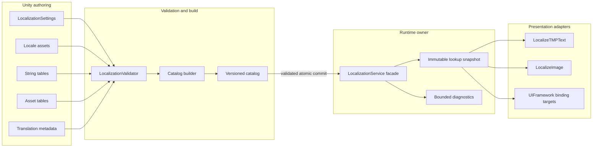

# CycloneGames.Localization

[English | 简体中文](README.md)

CycloneGames.Localization 是面向长期项目的 Unity 本地化模块，用于管理版本化文本与本地化资产内容。模块将 locale-aware runtime lookup、有界 catalog 安装、显式表现层绑定和适合长期项目分批翻译的 Editor 工作流组合在一起。它适用于桌面、移动端、WebGL、Headless Unity Player，以及提供兼容 asset backend 的主机平台集成，且不要求 DI 容器、全局 Service Locator、运行时反射或 worker thread。

## 目录

- [概述](#概述)
- [架构](#架构)
- [快速上手](#快速上手)
- [核心概念](#核心概念)
- [使用指南](#使用指南)
- [进阶主题](#进阶主题)
- [常见场景](#常见场景)
- [性能与内存](#性能与内存)
- [故障排查](#故障排查)

## 概述

本地化系统回答两个问题：玩家应该看到哪段文本或哪个资源，以及当前提交的是哪个 locale。CycloneGames.Localization 把创作（在 Editor 中编辑的 `LocalizationSettings`、`Locale`、`StringTable`、`AssetTable`、`StringTableMetadata`）、运行时分发（基于不可变 lookup snapshot 的 `LocalizationService` facade）与表现层（`LocalizeTMPText`、`LocalizeImage`、`LocalizationWindowBinder`）解耦。所有者负责创作 table 与 catalog；service 把它们作为一个原子事务校验并安装；表现层组件订阅已提交的变更并按需刷新。

本模块负责：经过校验的 locale identifier、显式 fallback graph、分区 string/asset table、plural selection、composite formatting、pseudo-localization、事务化 runtime catalog ownership、TMP 与 UGUI 绑定，以及多语言创作、validation、CSV 交换和 catalog build 的 Editor 工作流。字体 fallback、双向文字 shaping、远程翻译平台 API、下载/鉴权/补丁/CDN 策略，以及保存玩家语言偏好的应用级存档格式不由本模块负责 —— 它们留在各自的 owner adapter 中，使翻译数据不依赖产品专用网络、持久化和 UI composition。UI 导航和 locale-specific Prefab 布局在使用时由 `CycloneGames.UIFramework` 提供。

当项目需要版本化、分区、事务化的本地化能力，并需要在长 live-service 生命周期内支持增量翻译交付时使用本模块。不要将其作为字体/字形覆盖方案或翻译管理供应商桥接使用。

### 主要特性

- **经过校验的 `LocaleId`**：长度受限的 BCP 47 风格 tag，规范化大小写；不可信边界使用 `TryCreate`。
- **显式 fallback graph**：每个 `Locale` 的显式 fallback 引用，确定且 cycle-safe 的 chain。
- **分区 table**：每个 `(table ID, locale)` 一个 `StringTable` / `AssetTable`；支持独立 locale pack。
- **Plural selection 与 composite formatting**：确定的 integer cardinal rule set（`CLDR-48-integer-cardinal-subset`）；译者可控的 composite format。
- **事务化 catalog**：`LocalizationCatalog` 以 owner 范围原子事务安装多个 table，并做 schema、hash、duplicate、size 校验。
- **表现层绑定**：`LocalizeTMPText`、`LocalizeImage`、`LocalizationWindowBinder` 只在 enabled 时订阅；无 per-frame polling。
- **Pseudo-localization**：保护 placeholder 与 tag 的文本变换，用于布局和内容 QA。
- **Editor workspace**：多语言 table workspace、增量 CSV 交换（RFC 4180）、validation 窗口、分区 catalog build。
- **纯 C# 核心**：`CycloneGames.Localization.Core` 设 `noEngineReferences: true`；Runtime 与 Components 依赖 `UniTask` 和 `CycloneGames.AssetManagement`。

## 架构

| 程序集 | 路径 | 用途 |
| --- | --- | --- |
| `CycloneGames.Localization.Core` | `Core/` | `LocaleId`、fallback traversal、plural category、pseudo-localization。不引用 `UnityEngine`。 |
| `CycloneGames.Localization.Runtime` | `Runtime/` | Authoring bridge、`LocalizationService`、catalog、table、selector。依赖 Core、UniTask、AssetManagement。 |
| `CycloneGames.Localization.Components` | `Runtime/Components/` | `LocalizeTMPText`、`LocalizeImage`。依赖 Runtime、TMP、UGUI、AssetManagement、UniTask。 |
| `CycloneGames.Localization.Editor` | `Editor/` | Inspector、table workspace、validation、CSV、catalog build。依赖 Runtime、UnityEditor。 |
| `CycloneGames.Localization.Runtime.Integrations.YarnSpinner` | `Runtime/Integrations/YarnSpinner/` | Yarn locale 同步；仅安装 Yarn Spinner 时参与编译。 |
| `CycloneGames.Localization.Tests.Editor` | `Tests/Editor/` | Pure core、runtime、catalog 与 Editor workflow 测试。 |



运行时内容按 table 与 locale 分区。项目可以安装基础 catalog 和独立可下载语言包，无需让所有语言常驻同一个资产。只有在候选内容完整通过 schema、hash、duplicate 和 size validation 后，catalog owner 才会被替换。

## 快速上手

在 asmdef 中添加对 `CycloneGames.Localization.Runtime`（以及表现层用到的 `CycloneGames.Localization.Components`）的引用，然后导入命名空间：

```csharp
using CycloneGames.Localization.Runtime;
```

### 创建 authoring 资产

1. 创建一个 `LocalizationSettings` 资产。
2. 创建一个 `StringTable`，填写 table ID，然后双击该资产打开组合 table workspace。
3. 在 **+ Locale** 左侧输入首个 locale code（例如 `en` 或 `zh-CN`）。如果该 locale 尚未注册，workspace 会询问是否创建或复用对应 `Locale` 资产、加入 `Available Locales`，并填充尚为空的 default/authoring 字段。
4. 在每个 `Locale` 资产上配置 display name 和显式 fallback 引用。
5. 点击 **+ Key**，在 authoring-locale column 中输入 source text。
6. 进入 Play Mode 或构建 catalog 前运行 **Tools > CycloneGames > Localization > Validation > Window**。

### 不使用 DI 初始化

```csharp
using System;
using CycloneGames.Localization.Runtime;
using UnityEngine;

public sealed class GameLocalization : MonoBehaviour
{
    [SerializeField] private LocalizationSettings settings;
    [SerializeField] private StringTable[] bootstrapTables;

    public LocalizationService Service { get; private set; }

    private void Awake()
    {
        Service = new LocalizationService();
        Service.Initialize(settings.ToOptions());

        for (int i = 0; i < bootstrapTables.Length; i++)
        {
            if (!Service.RegisterStringTable(bootstrapTables[i]))
                throw new InvalidOperationException("Localization bootstrap table was rejected.");
        }
    }

    private void OnDestroy() => Service?.Dispose();
}
```

### 解析字符串与 plural

```csharp
string title = service.GetString("menu", "main.title");

if (service.TryGetString("inventory", "item.potion.name", out string potionName))
    nameLabel.text = potionName;

// Plural：以分类后缀保存变体（item_count.one / item_count.other）
string countText = service.GetPluralString("inventory", "item_count", count);
```

### 格式化消息

```csharp
string message = service.GetFormattedString("combat", "damage.received", actorName, damage);
```

### 切换 locale

```csharp
LocaleId japanese = new LocaleId("ja");
if (!service.TrySetLocale(japanese))
{
    // 该 service 配置中不可用。
}
```

### 绑定 TMP 文本

```csharp
var context = new LocalizationBindingContext(service);
localizeText.Bind(in context);
```

组件只在 enabled 期间订阅，不执行 per-frame polling，并在 locale、content 或 pseudo change 时刷新。

## 核心概念

### Locale identity

`LocaleId` 接受长度受限的 BCP 47 风格 language tag，并规范化大小写（`en`、`en-US`、`pt-BR`、`zh-Hans-CN`、`sr-Latn`）。无效、空或超长 tag 会在进入 runtime registry 前被拒绝。在命令行、远程配置或存档数据等不可信边界使用 `LocaleId.TryCreate`；经过验证的常量可以直接构造。

```csharp
if (!LocaleId.TryCreate(untrustedCode, out LocaleId locale))
{
    // 拒绝该值或使用配置的 default locale。
}
```

Locale equality 对规范 code 使用 ordinal 比较。`Language` 会被缓存，重复 plural 或 fallback lookup 不会创建 substring。

### Default、authoring 与 current locale

三个 locale 角色相互独立：

- **Default locale** —— 请求语言不可用时的最终运行时 fallback。
- **Authoring locale** —— 开发者创建和修改 source text 的语言；未单独指定时使用 default locale。
- **Current locale** —— 运行时 query 使用的已提交语言。

这种分离允许团队使用工作语言创作内容，同时发布另一种默认语言；Editor 也能在处理其他语言时让 source column 始终可见。

### Fallback

每个 `Locale` 资产可以引用显式 fallback locale。Runtime 在初始化期间构建确定、cycle-safe 的 chain：

```text
fr-CA -> fr -> en
```

Regional table 可以是 sparse：缺少 `fr-CA` entry 时可从 `fr` 解析。Cycle、重复 locale code、无效引用和超出配置深度的 chain 都是 validation error。

### Tables

每个 `StringTable` 或 `AssetTable` 表示一个 locale 下的一个 table ID。这种布局支持独立 locale pack 和明确的内存所有权。

- Table ID 和 entry key 使用 ordinal matching；编译时拒绝 duplicate key。
- 空字符串或纯空格 string value 表示缺失内容（不阻断 fallback）；有意隐藏 label 应由 presentation state 表达，而不是通过 translation data。
- Compiled table 会将 authoring data 复制为 read-only lookup state。
- Asset entry 将 Editor object GUID 与 provider-neutral runtime location 分开保存；runtime location 必须适用于所选 `IAssetPackage` provider。
- 空或无效的 table ID、locale code、key、超长 value 与 asset location 会按照 `LocalizationLimits` 被拒绝。

Entry key 应视为稳定契约。使用 `menu.settings.audio` 这类语义 key，不使用显示文本。

### 翻译工作流 metadata

`StringTableMetadata` 保存译者上下文，不进入常规 string lookup 路径。Entry 可以包含：source revision；每个 locale 的状态（`Missing`、`Draft`、`NeedsReview`、`Approved`、`Stale`）；每份翻译基于的 source revision；译者备注、最大长度、锁定状态、tag 和 Editor screenshot。Source text 变更会推进 revision，并将基于旧 revision 的翻译标记为 stale。Locked entry 在显式解锁前拒绝 table workspace 和 CSV 写入。

`StringTableMetadata` 不会嵌入 catalog。只有明确使用可选 runtime `GetMaxLength` 契约的产品才需要加载并注册所需 metadata 资产；普通 string/asset lookup 与翻译工作流不加载它们。

### Runtime state 与线程

`LocalizationService` 使用 single writer 和 immutable read snapshot：

- `Initialize` 必须在 Unity main thread 执行，并将该线程捕获为 mutation owner。
- `TrySetLocale`、table/catalog mutation、`Shutdown` 和 `Dispose` 在该 owner thread 上执行。
- Pure lookup method 捕获 immutable snapshot，可并发执行。
- Worker-thread lookup code 不访问 Unity object。
- WebGL 使用同一设计，不要求 worker thread 或同步原语。

`Changed` 在 state commit 后由 owner thread 同步发布。每个事件包含 previous locale、current locale、reason 和单调递增 revision。Subscriber exception 相互隔离并发送至配置的 diagnostic sink。Reentrant mutation 使用有界 queue 串行化，避免 nested commit 后后续 subscriber 仍观察过期的外层 transition。

### 内存与缓存策略

Service 不使用全局 mutable lookup cache。每个 service instance 拥有：immutable compiled table snapshot；预计算 locale fallback chain；catalog ownership record；有界 missing-key diagnostic set；有界 reentrant mutation queue。`Shutdown` 释放 runtime registry 与 fallback data。`Dispose` 结束 service lifetime 并释放 event ownership。Pseudo-localized 与 formatted string 按需创建；频繁渲染不变值的调用方应缓存解析结果，并在 `Changed` 时失效。

## 使用指南

### 使用 DI 初始化

Service 支持在任意 composition root 中通过 constructor 注册。Container 拥有 service lifetime；模块不依赖该 container。

```csharp
// VContainer 示例
builder.Register<LocalizationService>(Lifetime.Singleton)
       .AsImplementedInterfaces()
       .AsSelf();
```

### 解析 string、asset 与 plural

```csharp
// String lookup
string title = service.GetString("menu", "main.title");
bool found = service.TryGetString("inventory", "item.potion.name", out string name);

// Plural lookup（变体以 .one/.other/.few/... 后缀保存）
string countText = service.GetPluralString("inventory", "item_count", count);
```

Value 缺失时 `GetString` 返回 `null`，并对每个有界 missing-key identity 最多发出一次 diagnostic。需要显式 fallback UI 或 gameplay behavior 时优先使用 `TryGetString`。

### 格式化消息

```csharp
string message = service.GetFormattedString("combat", "damage.received", actorName, damage);
```

Composite format 是译者可控制的输入。Catalog build 前会校验 placeholder。Runtime formatting 使用配置的 `IFormatProvider`（默认 `CultureInfo.InvariantCulture`），malformed format 会被报告且不会破坏已提交状态。Formatting 会创建 result string（使用 `params` 时还会创建 `params` array）；不要对未变化内容每帧调用。对于频繁更新的 numeric label，`LocalizeTMPText.SetNumericArguments` 使用 TMP numeric formatting path。

### 切换 locale 并观察变更

```csharp
LocaleId japanese = new LocaleId("ja");
if (!service.TrySetLocale(japanese)) { /* 不可用 */ }

service.Changed += change =>
{
    Debug.Log($"Localization revision {change.Revision}: {change.Reason}");
};
```

切换 locale 是同步操作，因为它提交已经常驻的 lookup state。Network 或 disk work 属于 catalog provider：先加载并校验 catalog，在 owner thread 提交，再选择 locale。

### Locale selection 与持久化

初始化按顺序评估 `ILocaleSelector` instance。Built-in chain 可以在 configured default 前使用 command-line 与 system UI culture selection。

```csharp
ILocaleSelector[] selectors =
{
    new CommandLineLocaleSelector(),
    new SavedLocaleSelector(applicationSettings),
    new SystemLocaleSelector(),
};

var options = new LocalizationOptions(
    defaultLocale,
    locales,
    localeSelectors: selectors);
```

Application-owned selector 从拥有其他用户偏好的同一个显式、versioned save/settings service 读取。Localization 模块不写入 `PlayerPrefs`、`EditorPrefs`、registry、plist 或隐藏的全局文件。通过 application save service 保存选择的 locale，并沿用它的 schema、migration、atomic-write、integrity 和 recovery policy。

### 绑定表现层组件

```csharp
// TMP 文本 —— 不需要 asset package
var textContext = new LocalizationBindingContext(service);
localizeText.Bind(in textContext);

// 本地化图片 —— 需要 IAssetPackage
var imageContext = new LocalizationBindingContext(service, assetPackage);
localizeImage.Bind(in imageContext);

// UIFramework window（存在 CycloneGames.UIFramework 时）
var binder = new LocalizationWindowBinder(service, assetPackage);
```

`LocalizeImage` 保留最后一个有效 handle，直到 current locale 的 candidate 成功完成。Cancellation、provider fault、stale completion、disable、unbind 和 destruction 都会释放各自拥有的 handle；candidate 失败不会提前 Dispose last-known-good image。`LocalizationWindowBinder` 对实例化的 window hierarchy 扫描一次，按 hierarchy 顺序 Bind；任意 Bind 失败时按逆序 rollback；window 销毁时也按逆序 Unbind。

### Runtime catalog

`LocalizationCatalog` 是 versioned、hashed payload，用于将多个 string/asset table 作为一个 owner transaction 安装。

```csharp
if (!service.TryRegisterCatalog("base-content", baseCatalog))
{
    // 保持在之前提交的 snapshot 上运行。
}

if (!service.TryRegisterCatalog("season-12", downloadedCatalog))
{
    // 之前的 season-12 owner 保持活跃。
}

service.RemoveCatalog("season-12"); // 只移除该 ID 拥有的内容
```

替换 owner 时会在发布前校验完整 candidate。Schema、hash、limit、locale、duplicate table、duplicate key 或 location validation 失败都会保持之前 snapshot 不变。`RemoveCatalog(ownerId)` 只移除该 ID 拥有的内容，并重新发布剩余 immutable snapshot。Catalog 加载顺序不是 override priority：两个 owner 若包含相同 `(table type, table ID, locale)` 会发生冲突，后加载的 candidate 会被拒绝。使用同一 owner ID 重新安装是 atomic replacement —— 正常 patch 路径。

建议 ownership：

| Owner | 典型内容 | Lifetime |
| --- | --- | --- |
| `base-content` | 必需的 default-locale UI 与 gameplay string | 整个进程 |
| `locale-ja` | 日语 string 与本地化 asset | 语言包 resident 期间 |
| `season-12` | 支持语言共享的 live-service 内容 | Season 或 patch lifetime |
| `mod:<stable-id>` | 经过校验的用户/mod 内容 | Mod session |

### Diagnostics

`LocalizationOptions` 接受 `Action<LocalizationDiagnostic>`。Diagnostic 包含稳定 code、severity、message 和可选 exception。Sink 只在 diagnostic 时运行，不参与正常成功 lookup；sink exception 会被隔离。

```csharp
void ReportLocalization(LocalizationDiagnostic diagnostic)
{
    telemetry.Record(diagnostic.Code.ToString(), diagnostic.Severity.ToString(), diagnostic.Message);
}

var options = new LocalizationOptions(defaultLocale, locales, diagnosticSink: ReportLocalization);
```

## 进阶主题

### 热更新启动顺序

对于未被 Scene 或 Inspector 引用的内容，按以下顺序初始化：

1. 初始化选定的 `IAssetPackage`，并完成远程 manifest/catalog 更新。
2. 加载顶层 `LocalizationSettings` 资产并保留该 handle；其中引用的 `Locale` 资产是 provider dependency。
3. 通过 `settings.ToOptions()` 创建并初始化 `LocalizationService`。
4. 加载并安装必需的 default-locale/base catalog。
5. 加载并安装可选 locale、feature、season 或 mod catalog partition。
6. 只有当前 locale 与 fallback 所需内容已提交后，才选择保存或请求的 locale。
7. 绑定 TMP、image、UIFramework window 和其他 presentation target。
8. shutdown 时先解除 presentation binding，再 dispose service，最后释放保留的 settings handle。

```csharp
using System;
using System.Threading;
using CycloneGames.AssetManagement.Runtime;
using CycloneGames.Localization.Core;
using CycloneGames.Localization.Runtime;
using Cysharp.Threading.Tasks;

public sealed class HotUpdateLocalizationOwner : IDisposable
{
    private IAssetHandle<LocalizationSettings> _settingsHandle;
    public LocalizationService Service { get; private set; }

    public async UniTask InitializeAsync(
        IAssetPackage package,
        string settingsLocation,
        string baseCatalogLocation,
        string savedLocaleCode,
        CancellationToken cancellationToken)
    {
        _settingsHandle = package.LoadAssetAsync<LocalizationSettings>(
            settingsLocation,
            bucket: "localization/config",
            owner: "localization-session",
            cancellationToken: cancellationToken);

        try
        {
            await _settingsHandle.Task;
            LocalizationSettings settings = _settingsHandle.Asset
                ?? throw new InvalidOperationException("Localization settings did not load.");

            Service = new LocalizationService();
            Service.Initialize(settings.ToOptions());

            bool installed = await Service.LoadAndRegisterCatalogAsync(
                package,
                ownerId: "base-content",
                location: baseCatalogLocation,
                bucket: "localization/catalogs",
                cancellationToken: cancellationToken);
            if (!installed)
                throw new InvalidOperationException("The base localization catalog was rejected.");

            if (LocaleId.TryCreate(savedLocaleCode, out LocaleId savedLocale))
                Service.TrySetLocale(savedLocale);
        }
        catch
        {
            Dispose();
            throw;
        }
    }

    public void Dispose()
    {
        Service?.Dispose();
        Service = null;
        _settingsHandle?.Dispose();
        _settingsHandle = null;
    }
}
```

`LoadAndRegisterCatalogAsync` 拥有临时 catalog handle，并在成功、拒绝、取消或 provider failure 时释放它。成功提交后，service 拥有复制后的 managed lookup data。Settings handle 不同：初始化后的 locale configuration 仍持有其 `Locale` 资产，因此 composition root 必须保留该 handle，直到 service 被 dispose。

如果 patch 改变 available locale identity 或 fallback graph，应从替换后的 settings 资产创建并初始化一个 replacement service，安装其必需 catalog，然后在受控 application transition 中重新绑定。仅替换 catalog 只会改变内容，不会修改 service 初始化时确定的 locale configuration。

### Editor workspace

String 与 asset workspace 将 parallel locale asset 呈现为一个表格：

- 双击已配置 table 或 metadata 资产会打开对应 workspace 与 table ID。
- Authoring key 保持 serialized order；**Sort** 菜单可以显式按 ordinal A→Z、ordinal Z→A 或 natural A→Z（`item.2` 位于 `item.10` 前）重排。filter 激活时排序禁用，执行前必须确认，并且可通过一次 Undo 撤销。
- Key 与 authoring-locale column 保持固定；其他 locale column 横向滚动。Visible row 使用 virtualization。
- 每行提供明确的 **Details** / **Hide** 按钮；打开 details 不会静默创建 metadata。Details 将 metadata 显示为垂直分隔且带 label 的字段，并为当前 Key 的 metadata entry 提供需确认、感知 lock、可单次 Undo 的删除操作。
- 单个 active text cell 持有 Editor-only draft；点击其他 control 或按 Enter 时通过一个 Undo transaction 提交。
- Target-locale 的空字符串或纯空格 edit 会删除该 override 并恢复可见 fallback；authoring locale 则报告 missing source value。
- Locked entry 拒绝 direct edit 和 import write。

### 增量 CSV 交换

CSV import/export 面向分批交付：

- **Export** 打开一个 configuration window，同时显示 destination、Key scope、language scope、encoding 与最终数量。
- 人工交付（Excel 等）选择 **Spreadsheet (Recommended)**，机器 pipeline 选择 **Automation & CI**。Spreadsheet 写入 UTF-8 with BOM；Automation & CI 写入 UTF-8 without BOM；两者共用同一个有界 RFC 4180 writer。
- **All Keys (N)** 与 **Current Results (N)** 显示准确 row scope。可从单一 selector 选择 **All Languages (N)**、**All Registered Languages (N)** 或 **Source + &lt;locale&gt;**。
- Quoted comma、quote、newline 和 Unicode 通过 RFC 4180 parser 往返。Import 接受两种 UTF-8 形式，存在一个开头 BOM 时会移除，并拒绝无效 UTF-8。
- 在 temporary model 中先校验 parsing、limit、header、key、revision、lock state 与 locale membership。Commit 前显示 change summary。
- 只更新文件中存在的 locale column 和 key row；项目中未出现在文件里的 key 保持不变，因此翻译交付可以只包含任意经过校验的 subset。
- Target value 为空或只有空格时按 `Missing` 导入，并移除已有 override 以恢复 fallback。
- 使用一个 Undo group 提交接受的变更；parse、validation 或 commit failure 不修改现有翻译。

将 exchange file 放在显式项目目录或外部交付目录中。它们不会自动导入，也不是 runtime source of truth。Export configuration 仅存在于当前 session，不写入 `EditorPrefs`、project settings 或 asset。

### Validation 与 catalog build

在 locale、table、metadata 或 catalog 变化后运行 **Tools > CycloneGames > Localization > Validation**。Validation 覆盖：无效或重复 locale code；无效 default/authoring locale 配置；fallback cycle 和 excessive depth；重复 `(table ID, locale)` 资产与 duplicate key；按 effective fallback semantic 检查 sparse regional override；composite-format placeholder 一致性；metadata revision/status bound；缺失 runtime asset location；catalog schema、hash、ownership、count 与 string length limit。Validation 对大型项目有界且可取消。Error 会阻止 catalog creation；warning 表示内容可能有意如此，但需要确认。

`LocalizationCatalogBuildSettings` 显式引用项目 `LocalizationSettings` 资产和 output location。`Included Locales`、`Included Table IDs` 与 `Content Kind` 定义一个 partition；include list 为空表示包含全部已配置值。多个 build-settings 资产可分别生成 base catalog、per-locale pack、feature pack 或 live-service partition。Builder 会规范化 output 并限制在 `Assets/` 下，拒绝 traversal、无效名称、duplicate data 与配置的 limit violation，在 temporary memory 中构建 deterministic content，计算 canonical content hash，仅在完整 validation 成功后更新 target asset。Builder 不会对无关 dirty asset 调用全局 save 操作。

## 常见场景

### 不使用 DI 的 bootstrap

小型游戏在 `Awake` 中直接从 `LocalizationSettings` 资产初始化 service，并注册 bootstrap `StringTable` 资产（见 [快速上手](#快速上手)）。`MonoBehaviour` 拥有 service lifetime，并在 `OnDestroy` 中 dispose。

### 热更新 owner

Live-service 游戏通过 Addressables/YooAsset 加载 `LocalizationSettings`，初始化 service，安装 base catalog，再按需安装 per-locale pack。Owner 保留 settings handle 直到 service 生命周期结束，并在 shutdown 时释放（见 [热更新启动顺序](#热更新启动顺序)）。

### Per-locale pack 安装

游戏发布时只带 `base-content` catalog（含 default locale），并按需下载 `locale-ja` / `locale-zh-Hans` pack。每个 pack 是独立 `LocalizationCatalog`，以各自 owner ID 安装；卸载 pack 时调用 `RemoveCatalog(ownerId)` 并重新发布剩余 snapshot。

### Pseudo-localization QA

QA 启用 pseudo-localization，在真实本地化到达前发现布局溢出和缺失翻译：

```csharp
service.SetPseudoLocalizerEnabled(true);
// 表现层组件会在下一次 Changed 时刷新。
```

`PseudoLocalizer` 保护 placeholder 与 tag：在扩展和加重周围文本的同时保留 composite-format placeholder 与 markup tag。

### 绑定 UIFramework window

存在 `CycloneGames.UIFramework` 时，在 window composition 注册一个 `LocalizationWindowBinder`。Binder 对实例化的 window hierarchy 扫描一次，找到 `ILocalizationBindingTarget` component，按 hierarchy 顺序 Bind；任意 Bind 失败时按逆序 rollback；window 销毁时也按逆序 Unbind。`UILocaleLayout`、`LocalizeTMPText` 与 `LocalizeImage` 共享同一 window lifetime。

## 性能与内存

Runtime lookup 是 event-driven，不包含 per-frame module loop。

| 操作 | 预期成本 | Allocation 说明 |
| --- | --- | --- |
| Exact string/asset lookup | O(1) dictionary probe | Warm-up 后 raw string lookup 不创建 result |
| Fallback lookup | O(configured fallback depth) | Chain 已预计算 |
| Locale change | Owner-thread state commit 加 subscriber work | Cold operation；不执行 asset I/O |
| Catalog replacement | O(candidate + committed table content) | Cold path；atomic publication 前构建 candidate |
| Composite formatting | O(template + arguments) | 创建 formatted result；可能创建调用方 `params` array |
| Pseudo-localization | O(text) | 创建 transformed output；用于 QA |
| TMP/image refresh | Event-driven | Image loading 遵循 provider allocation behavior |

`LocalizationLimits` 为 locale count、fallback depth、table count、entry、key/value length、owner ID、diagnostic 和 reentrant mutation 提供保守默认值。应根据实测 content profile 设置产品值。在 live registration 前拒绝 oversized catalog 比依赖 out-of-memory failure 更安全。

### 线程

- `Initialize` 必须在 Unity main thread 执行；该线程成为 mutation owner。
- `TrySetLocale`、table/catalog mutation、`Shutdown` 和 `Dispose` 在 owner thread 上执行。
- Pure lookup method 捕获 immutable snapshot，可并发执行。
- Worker-thread lookup code 不访问 Unity object。
- 本模块不创建线程，WebGL 上也不要求同步原语。

### 平台行为

- **Windows、Linux、macOS**：支持 command-line selection 和 system culture；filesystem 与 download behavior 属于产品 catalog provider。
- **iOS 与 Android**：避免让未使用 locale pack 常驻；在设备上测试 OS culture mapping、background cancellation 和 low-memory recovery。
- **WebGL**：Runtime state 不要求线程。Catalog download/decode 必须使用 WebGL-compatible provider；大型同步 parsing 会阻塞 browser frame 时应使用有界增量工作。
- **Dedicated Server**：Presentation component 可选。在 Unity server main thread 初始化和修改；只含 managed data 时 pure snapshot query 可供 worker job 使用。
- **主机平台**：提供平台批准的 storage/download 与 asset adapter，遵守认证约束并验证 AOT/stripping。没有 target SDK build 证据时不声称主机支持已验证。

Runtime code 使用显式构造，不依赖 runtime reflection 或 dynamic code generation。

### 持久化与清理

| 数据 | Owner 与路径 | 格式 | 清理与恢复 |
| --- | --- | --- | --- |
| Locale/settings/table/metadata 资产 | Project，在显式 `Assets/...` authoring folder 下 | Unity YAML assets | 从 VCS 恢复；merge 后 validation |
| Built catalog | Project 选择的 `Assets/...` output | Unity ScriptableObject | 从 authoring asset 确定性重建 |
| Translation CSV | 用户选择的交付目录 | UTF-8 with/without BOM、RFC 4180 | 从 authoring asset 重新导出；不会自动导入 |
| Current locale preference | Application save/settings service | Application-defined、schema-versioned | 使用应用的 migration 与 corruption recovery |
| Runtime snapshot 与 diagnostics | `LocalizationService` instance memory | Managed objects | 由 `Shutdown`/`Dispose` 释放；从 catalog 重建 |

Localization configuration 或 production preference 不写入 `EditorPrefs`、`PlayerPrefs` 或其他隐藏全局位置。

## 故障排查

| 现象 | 可能原因 | 解决方法 |
| --- | --- | --- |
| `TrySetLocale` 返回 `false` | Locale 不在 `Available Locales`，或其 catalog 未安装 | 先安装该 locale 的 catalog 再选择；检查 `LocalizationSettings` |
| `GetString` 返回 `null` | Key 缺失、locale 缺失，或 fallback chain 耗尽 | 查看有界 missing-key diagnostic；确认 key 拼写与 table ID |
| Catalog 安装返回 `false` | Schema、hash、limit、locale、duplicate table/key 或 location validation 失败 | 运行 validation 窗口；检查 `LocalizationLimits` 与 partition ownership |
| 两个 owner 冲突 | 都包含相同 `(table type, table ID, locale)` | 让各 partition ownership 互不重叠；重新安装同一 owner ID 以替换 |
| 翻译显示 stale 内容 | Source text 推进了 revision；基于旧 revision 的翻译为 `Stale` | 重新翻译或 approve 受影响 entry；检查 `StringTableMetadata` 状态 |
| CSV import 后翻译未变 | Parse、validation 或 commit failure 回滚了事务 | 查看 change summary；修复 header、encoding 或 lock state 后重新导入 |
| `LocalizeImage` 不显示图片 | Asset provider fault、cancellation 或 stale completion | 查看 provider diagnostic；有效 last-known-good handle 会保留 |
| Locale 切换无可见效果 | Presentation 未绑定，或 subscriber 抛出异常被隔离 | 确认调用了 `Bind`；查看 diagnostic sink 中的 subscriber exception |
| Reentrant `Changed` handler 看到过期状态 | Nested commit 在外层 commit 之后串行化 | 使用有界 reentrant queue；把重活推迟到 `Changed` 爆发之后 |
| 多次 catalog 安装后内存增长 | 旧 catalog 未移除，或 settings handle 未释放 | 对未用 owner 调用 `RemoveCatalog`；shutdown 时释放 settings handle |
| IL2CPP/stripping 破坏 lookup | 假设了 runtime reflection（不支持） | 在目标 backend 上验证 AOT/stripping；本模块使用显式构造 |

## 验证

通过 Unity Test Runner 运行聚焦测试：

```text
<UnityEditor> -batchmode -nographics -projectPath <repo-root>/UnityStarter -runTests -testPlatform EditMode -assemblyNames CycloneGames.Localization.Tests.Editor -testResults <result-path> -quit
```

模块变更的最低验证：编译 Core、Runtime、Components、Editor、active UI integration 和 tests；运行 editor test assembly；校验 locale/table/catalog fixture（含 malformed 与 oversized input）；验证 CSV multiline Unicode round-trip、BOM/no-BOM byte output、transaction rollback 和 lock behavior；测试 component enable/disable、bind/unbind、image cancellation/fault/stale completion 和 service shutdown；profile 代表性 table size 与 locale switch；在产品 CI 环境执行所需 Player/AOT/platform matrix。Editor test 不能证明 IL2CPP、目标主机、设备内存、browser frame 或长期稳定性 —— 应分别记录。

## API 参考

| API | 用途 |
| --- | --- |
| `LocaleId` | 经过校验的规范 locale identity |
| `Locale` | Unity authoring metadata 与显式 fallback 引用 |
| `LocalizationSettings` | Default、authoring 与 available locale 配置 |
| `LocalizationOptions` | Immutable service initialization snapshot |
| `LocalizationLimits` | 不可信内容与内存容量边界 |
| `ILocalizationService` / `LocalizationService` | Runtime lookup、locale state、content ownership、lifecycle facade |
| `LocalizationChange` | 带 revision 的 post-commit change notification |
| `StringTable` / `AssetTable` | Per-table、per-locale authoring 与 direct bootstrap data |
| `LocalizationCatalog` | Versioned、hashed、transactional content payload |
| `LocalizedString` / `LocalizedAsset<T>` | Component 与 game data 使用的 serializable table/key reference |
| `ILocaleSelector` | 无副作用的 startup locale selection policy |
| `StringTableMetadata` | 译者上下文、source revision、status、lock、limit |
| `ILocalizationBindingTarget` | 显式 presentation binding lifecycle |
| `LocalizeTMPText` / `LocalizeImage` | TMP 与 UGUI presentation adapter |
| `LocalizationWindowBinder` | UIFramework window binding lifecycle |
| `PseudoLocalizer` | QA 使用、保护 placeholder/tag 的文本变换 |

在不可信或 optional boundary 使用 `Try...` API。Authoring validation error 应阻止 build；network、persistence 与 asset-provider failure policy 保持在各自 owner adapter 中。

## 参考

- [Unicode CLDR language plural rules](https://www.unicode.org/cldr/charts/48/supplemental/language_plural_rules.html) —— `PluralRules.RuleSetVersion` subset 来源
- [BCP 47](https://www.rfc-editor.org/rfc/rfc5646) —— `LocaleId` 参考的 language tag 结构
- [RFC 4180](https://www.rfc-editor.org/rfc/rfc4180) —— import/export 使用的 CSV 格式
