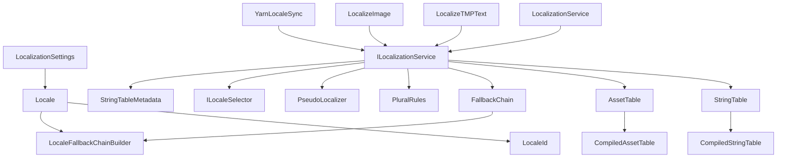

# CycloneGames.Localization

<div align="left"><a href="./README.md">English</a> | 简体中文</div>

面向商业级项目设计的 Unity **本地化框架**。提供完整的字符串与资产本地化管线，支持 BCP 47 语言标识符、自动回退链、覆盖 25+ 种语言的 CLDR 复数规则、通过可选 UIFramework 集成提供逐语言布局快照，并使用由 ScriptableObject 配置生成的运行时编译查找数据。

## 功能特性

### 🌍 核心本地化

| 功能                        | 详情                                                                                             |
| --------------------------- | ------------------------------------------------------------------------------------------------ |
| **LocaleId 值类型**         | `readonly struct`，由 BCP 47 code 字符串表示；使用 ordinal 等值比较，比较过程不产生临时分配 |
| **BCP 47 支持**             | 标准语言代码：`en`、`zh-CN`、`ja-JP`、`pt-BR` 等                                                 |
| **Locale ScriptableObject** | 每种语言配置显示名称、母语名称和回退链 — 设计师在 Inspector 中配置                               |
| **自动回退链**              | BFS 遍历加去重：`zh-CN → zh → en` 仅解析一次并缓存                                               |
| **系统语言检测**            | 通过 `CultureInfo`（BCP 47）检测系统语言，回退到 `Application.systemLanguage`                    |

### 📝 字符串表

| 功能                    | 详情                                                                             |
| ----------------------- | -------------------------------------------------------------------------------- |
| **ScriptableObject 表** | 每个表 ID 每种语言对应一个 `StringTable` 资产；通过项目启动流程加载并注册 |
| **编译后运行时查找**    | 序列化列表在注册或预热时编译为 `CompiledStringTable`；查找使用 `StringComparer.Ordinal` |
| **回退链解析**          | 如果 `zh-CN` 中缺少某个 Key，自动检查 `zh`，然后 `en`，依此类推                  |
| **预热支持**            | 可在加载阶段编译表数据，使 UI 刷新路径只执行字典查找                              |
| **参数化文本**          | `GetFormattedString("ui", "damage", weaponName, amount)` → `"造成 {0} {1} 伤害"` |

### 🔢 复数规则（CLDR）

| 功能           | 详情                                                                                                                                         |
| -------------- | -------------------------------------------------------------------------------------------------------------------------------------------- |
| **25+ 种语言** | 完整 CLDR 基数复数规则：东斯拉夫语、波兰语、捷克语、阿拉伯语、罗马尼亚语、立陶宛语、拉脱维亚语、爱尔兰语、斯洛文尼亚语、威尔士语、马耳他语等 |
| **6 个类别**   | `Zero`、`One`、`Two`、`Few`、`Many`、`Other` — 每种语言使用其所需的子集                                                                      |
| **后缀约定**   | 基础 Key `"item_count"` → 条目 `"item_count.one"`、`"item_count.other"` 等                                                                   |
| **自动回退**   | 解析的类别 → `.other` 回退 → 缺失 Key 警告                                                                                                   |
| **静态解析器** | 纯静态方法 + 整数运算；解析后的 Key 使用已有的编译表查找路径                                                                                  |

### 🎨 资产表

| 功能               | 详情                                                           |
| ------------------ | -------------------------------------------------------------- |
| **逐语言资产变体** | 将逻辑 Key 映射到不同语言的精灵图、音频剪辑或字体              |
| **回退链解析**     | 与字符串表相同的 BFS 回退 — `ja-JP → ja → en`                  |
| **AssetRef 集成**  | 解析为兼容 `CycloneGames.AssetManagement` 管线的 `AssetRef<T>` |
| **编译后运行时查找** | `AssetTable` 编辑数据会先编译为 `CompiledAssetTable`，再进入运行时查找路径 |
| **类型安全**       | `LocalizedAsset<Sprite>`、`LocalizedAsset<AudioClip>` 等       |

### 🧩 组件

| 功能                    | 详情                                                             |
| ----------------------- | ---------------------------------------------------------------- |
| **LocalizeTMPText**     | 语言切换时自动更新 `TMP_Text` — 支持纯文本、格式化文本和复数文本 |
| **LocalizeImage**       | 语言切换时自动更新 `Image.sprite`，正确管理资产句柄生命周期      |
| **事件驱动**            | 零逐帧开销 — 仅在 `OnLocaleChanged` 事件触发时刷新               |
| **优雅的缺失 Key 处理** | 缺失 Key 返回 `null` → 保留预制体原始文本（设计师占位符）        |

### 🔌 集成

| 功能                         | 详情                                                                                                                               |
| ---------------------------- | ---------------------------------------------------------------------------------------------------------------------------------- |
| **Yarn Spinner**             | `YarnLocaleSync` 将语言变更桥接到 `LineProviderBehaviour.LocaleCode` — 无需修改 Yarn Spinner 源代码                                |
| **CycloneGames.UIFramework** | 通过 `UILocaleLayout` 实现可选的逐语言布局快照 — [查看 UIFramework 文档](../CycloneGames.UIFramework/README.SCH.md#本地化集成可选) |

### 🧪 伪本地化

| 功能              | 详情                                                                                                                           |
| ----------------- | ------------------------------------------------------------------------------------------------------------------------------ |
| **5 种变换模式**  | `Accents`（à→é）、`Elongate`（~33% 填充）、`Brackets`（text）、`Mirror`（RTL 反转）、`Full`（Accents + Elongate + Brackets） |
| **按位组合**      | `[Flags]` 枚举 — 通过 `\|` 组合任意模式创建自定义 QA 预设                                                                      |
| **零内存分配**    | 字符串 ≤ 512 字符时使用 `stackalloc`；`PseudoLocaleMode.None` 时直接返回原字符串引用                                           |
| **运行时切换**    | `ILocalizationService.PseudoMode` — 运行时切换模式无需重启                                                                     |
| **Settings 集成** | `LocalizationSettings` 上的 `PseudoLocaleMode` 字段 — 在 Inspector 中配置，通过 `ToOptions()` 自动传递                         |

### 🔗 语言选择链

| 功能                          | 详情                                                                        |
| ----------------------------- | --------------------------------------------------------------------------- |
| **优先级排序选择器**          | `ILocaleSelector` 接口 — 第一个返回非 null 的匹配胜出                       |
| **CommandLineLocaleSelector** | `--locale zh-CN` — 最高优先级，首次调用后缓存；用于 QA 测试                 |
| **PlayerPrefsLocaleSelector** | 读写 `PlayerPrefs` 键 `"CycloneGames.Locale"` — 玩家语言设置持久化          |
| **SystemLocaleSelector**      | `CultureInfo.CurrentUICulture`（BCP 47）+ `Application.systemLanguage` 回退 |
| **自定义选择器**              | 实现 `ILocaleSelector` 添加项目特定来源（服务器配置、Steam API 等）         |
| **默认链**                    | CommandLine → PlayerPrefs → System → Default Locale（未提供自定义链时）     |

### 📋 条目元数据

| 功能           | 详情                                                                       |
| -------------- | -------------------------------------------------------------------------- |
| **译者上下文** | `Comment` 字段 — 描述上下文、语气或约束的译者注释                          |
| **字符限制**   | `MaxLength` — 最大字符数；运行时可通过 `GetMaxLength()` 查询，用于输入验证 |
| **锁定状态**   | `Locked` 标志 — 标记已定稿的条目，译者不应修改                             |
| **标签系统**   | 逗号分隔的 `Tags`，用于分类和过滤（例如 `"menu,button,short"`）            |
| **截图引用**   | `Texture2D` 引用，展示文本在 UI 中的位置（仅 Editor）                      |
| **独立存储**   | `StringTableMetadata` ScriptableObject — 保持运行时 `StringTable` 资产轻量 |
| **表类型分离** | `TableType` 枚举（`String` / `Asset`）— 同一表 ID 可按类型拥有独立元数据   |

### 🛠️ 编辑器工具

| 功能                     | 详情                                                                                         |
| ------------------------ | -------------------------------------------------------------------------------------------- |
| **多语言字符串表编辑器** | 并排编辑所有语言，冻结 Key 列、水平/垂直滚动、元数据子行、重复检测、CSV 导入/导出            |
| **多语言资产表编辑器**   | 相同架构的资产表编辑器 — 冻结 Key 列、逐语言 `AssetRef` 字段、元数据集成                     |
| **CSV 导入/导出**        | 批量导入导出，便于交付给翻译人员                                                             |
| **Property Drawer**      | `LocalizedString` 和 `LocalizedAsset<T>` 的下拉表和 Key 选择器                               |
| **Locale Inspector**     | 自定义编辑器，展示 BCP 47 代码、显示名称、母语名称和回退链                                   |
| **版本缓存发现**         | `LocalizedFieldHelper` 配合 `AssetPostprocessor` — 表/Key 列表仅在资产导入时更新，零逐帧开销 |
| **验证窗口**             | 项目级扫描空 ID、非法语言、重复 Key 和 fallback 环                                           |

## 核心架构



## 依赖项

| 包                               | 用途                                                              |
| -------------------------------- | ----------------------------------------------------------------- |
| **CycloneGames.AssetManagement** | `AssetRef<T>`、`IAssetPackage`、`IAssetHandle<T>`，用于资产表解析 |
| **UniTask**                      | 异步初始化和语言切换                                              |
| **TextMeshPro**                  | `LocalizeTMPText` 组件                                            |
| **Unity UI**                     | `LocalizeImage` 组件                                              |
| **Yarn Spinner** _（可选）_      | `YarnLocaleSync` — 仅在 Yarn Spinner 存在时编译                   |

---

## 模块结构

```
CycloneGames.Localization/
  Core/        纯 C# LocaleId、复数规则、伪本地化、fallback helper
  Runtime/     Unity 运行时服务、设置、表、组件和集成
  Editor/      Inspector、Drawer、多语言表编辑器和验证工具
  Tests/       Core 与 Editor 相关行为的 EditMode 测试
```

`Core` 不引用 Unity Engine，可复用于工具、测试、服务器代码或未来非 Unity 适配层。Runtime 中的 ScriptableObject 是编辑数据；`LocalizationService` 注册时会使用编译后的运行时表数据进行查找。

### 运行时数据包

`LocalizationCatalog` 是生成后的运行时数据包，用于一次性注册本地化字符串表和资产表。它包含 schema 版本、catalog 版本、内容 hash、字符串表条目和资产表条目。

Catalog 提供生成后的运行时数据包，可用于启动载荷、构建验证、热更新清单、加密交付和二进制解码。运行时服务只依赖 catalog 数据契约，不依赖固定存储后端。

支持的注册路径：

1. 在项目启动流程中分别注册 `StringTable` 和 `AssetTable` 资产。
2. 构建并注册 `LocalizationCatalog`。
3. 在独立集成程序集中将外部数据解码为 `LocalizationCatalog`、`CompiledStringTable` 或 `CompiledAssetTable`。

可选的 DataTable、二进制、MessagePack 或加密支持应放在 integration 程序集中实现。这些集成程序集依赖 `CycloneGames.Localization.Runtime`；基础 Runtime 程序集不应依赖 DataTable 或固定资源加载后端。

需要异步加载 catalog 的项目可以实现 `ILocalizationCatalogProvider`。Provider 实现可以从 `CycloneGames.AssetManagement`、加密文件、远端清单、测试内存数据或任意项目自定义来源加载 catalog。Provider 返回 catalog 后，通过 `ILocalizationService.RegisterCatalog` 注册。

---

## 快速上手

基础接入流程使用 `Locale`、`LocalizationSettings` 和 `StringTable` 资产。初始化 `LocalizationService`，加载所需表，并通过 `RegisterStringTable` 注册。该流程不要求创建 `LocalizationCatalog`。

### 1. 创建 Locale 资产

为每种支持的语言创建一个 `Locale` ScriptableObject：

**Create → CycloneGames → Localization → Locale**

| 字段         | 示例（英语） | 示例（简体中文）     |
| ------------ | ------------ | -------------------- |
| Locale Code  | `en`         | `zh-CN`              |
| Display Name | `English`    | `Simplified Chinese` |
| Native Name  | `English`    | `简体中文`           |
| Fallbacks    | _（空）_     | `en`                 |

回退链按语言定义。例如，`zh-CN` 回退到 `en`，意味着中文表中缺失的任何 Key 都将自动从英文表中解析。

### 2. 创建 LocalizationSettings

创建唯一的 `LocalizationSettings` 资产：

**Create → CycloneGames → Localization → Settings**

| 字段                   | 描述                                                                       |
| ---------------------- | -------------------------------------------------------------------------- |
| Default Locale         | 系统检测失败时的回退语言                                                   |
| Available Locales      | 项目支持的所有语言（将 Locale 资产拖入此处）                               |
| Detect System Language | 启用后，系统在首次启动时自动选择最匹配的语言                               |
| Pseudo Locale Mode     | QA 测试模式：`None`、`Accents`、`Elongate`、`Brackets`、`Mirror` 或 `Full` |

### 3. 创建字符串表

每个表组每种语言创建一个 `StringTable`：

**Create → CycloneGames → Localization → String Table**

示例结构：

```
Localization/
├── StringTables/
│   ├── UI_en.asset        (tableId: "ui", locale: "en")
│   ├── UI_zh-CN.asset     (tableId: "ui", locale: "zh-CN")
│   ├── Items_en.asset     (tableId: "items", locale: "en")
│   └── Items_zh-CN.asset  (tableId: "items", locale: "zh-CN")
```

使用**字符串表编辑器窗口**（Tools → CycloneGames → Localization → Tables → String Table Editor）进行可视化编辑，或从 CSV 导入。

### 4. 初始化服务

```csharp
// VContainer 方式
public class LocalizationInstaller : LifetimeScope
{
    [SerializeField] private LocalizationSettings settings;

    protected override void Configure(IContainerBuilder builder)
    {
        builder.Register<LocalizationService>(Lifetime.Singleton)
               .As<ILocalizationService>();

        builder.RegisterBuildCallback(resolver =>
        {
            var service = resolver.Resolve<ILocalizationService>();
            service.InitializeAsync(settings.ToOptions()).Forget();
        });
    }
}
```

```csharp
// 手动初始化
var service = new LocalizationService();
await service.InitializeAsync(settings.ToOptions());
```

### 5. 注册字符串表

```csharp
// 通过项目启动流程或资产包流程加载并注册表。
service.RegisterStringTable(uiTableEn);
service.RegisterStringTable(uiTableZhCN);
```

`RegisterStringTable` 会将每个 `StringTable` 编译为 `CompiledStringTable`。请在加载流程或场景启动阶段注册表，不要在逐帧 UI 刷新中注册。

### 6. 注册资产表

```csharp
service.RegisterAssetTable(flagsEn);
service.RegisterAssetTable(flagsZhCN);
```

`RegisterAssetTable` 会将每个 `AssetTable` 编译为 `CompiledAssetTable`。运行时查找会解析当前语言 fallback 链并返回 `AssetRef`，不会在查找时重建表字典。

### 7. 验证项目数据

发布或交付翻译前，打开 **Tools > CycloneGames > Localization > Validation > Validate Project**。验证工具会扫描字符串表、资产表、元数据和语言 fallback 链中的空 ID、非法语言、重复 Key、缺失的 plural `.other`、自 fallback 和 fallback 环。

### 8. 运行时 Catalog 流程

当项目需要面向发布构建、CI 验证、热更新交付、加密文件或二进制解码的生成数据包时，使用 `LocalizationCatalog`。直接资产注册流程可跳过本节，在加载阶段或场景启动阶段注册 `StringTable` 或 `AssetTable` 资产。

为团队协作和 CI 流程创建 `LocalizationCatalogBuildSettings` 资产：

**Create > CycloneGames > Localization > Catalog Build Settings**

在 Inspector 中配置输出文件夹、输出文件名、catalog 版本和验证选项。输出文件夹是文件夹资产引用，因此该设置可以提交到版本控制，并在不同机器上复用，无需修改包源码。

使用 **Tools > CycloneGames > Localization > Catalog > Build From Settings** 从项目中找到的第一个 settings 资产构建 catalog。构建器会先执行验证，保留条目顺序，并写入确定性的 `SHA256` 内容 hash，便于版本检查、热更新和未来差量包流程。

仅在需要一次性手动选择输出路径时，使用 **Tools > CycloneGames > Localization > Catalog > Build Once...**。

```csharp
// 通过 CycloneGames.AssetManagement 或项目自己的包流程加载 Catalog。
service.RegisterCatalog(localizationCatalog);
```

`LocalizationCatalog` 与具体后端无关。生成后的资产可以放入首包、通过热更新包交付，或由项目自定义解码器生成后再注册。

`LocalizationCatalog` Inspector 是只读的生成数据视图。它会展示 schema 版本、catalog 版本、`ContentHash`、字符串表数量、资产表数量和条目总数，并提供复用 `LocalizationCatalogBuildSettings` 的构建操作。请修改源表和构建设置，不要直接编辑生成后的 catalog 字段。

---

## 用法

### 基本字符串查找

```csharp
// 通过 LocalizedString（Inspector 中赋值）
[SerializeField] private LocalizedString greeting;

string text = localizationService.GetString(greeting);
// 例如 "欢迎回来，英雄！"

// 通过表 ID + Key
string text = localizationService.GetString("ui", "greeting");
```

### 参数化文本

字符串表条目：`"damage_dealt" → "造成 {0} {1} 伤害"`

```csharp
[SerializeField] private LocalizedString damageDealt;

string text = localizationService.GetFormattedString(damageDealt, weaponName, amount);
// 例如 "造成 圣剑 150 伤害"
```

### 复数字符串

字符串表条目：

```
"item_count.one"   → "{0} item"
"item_count.other" → "{0} items"
```

对于东斯拉夫语（俄语、乌克兰语等）：

```
"item_count.one"   → "{0} предмет"
"item_count.few"   → "{0} предмета"
"item_count.many"  → "{0} предметов"
```

```csharp
[SerializeField] private LocalizedString itemCount;

string text = localizationService.GetPluralString(itemCount, count);
// count=1  → "1 item"     (en)
// count=5  → "5 items"    (en)
// count=3  → "3 предмета" (ru, "few" 形式)
```

带额外参数：

```csharp
// "item_count.one"   → "You have {0} {1} item"
// "item_count.other" → "You have {0} {1} items"

string text = localizationService.GetPluralString(itemCount, count, playerName);
// count 始终是 {0}，额外参数是 {1}、{2}……
```

### 运行时切换语言

```csharp
await localizationService.SetLocaleAsync(new LocaleId("zh-CN"));
// 所有订阅的组件（LocalizeTMPText、LocalizeImage 等）自动刷新

// 保存玩家选择，下次启动时生效
PlayerPrefsLocaleSelector.Save(new LocaleId("zh-CN"));
```

### 伪本地化（QA 测试）

启用伪本地化来测试 UI 布局和发现硬编码字符串，无需真实翻译：

```csharp
// 方式 1：在 LocalizationSettings Inspector 中配置（Pseudo Locale Mode 字段）

// 方式 2：运行时切换
localizationService.PseudoMode = PseudoLocaleMode.Full;
// 所有 GetString / GetFormattedString / GetPluralString 结果现在被变换：
// "Settings" → "Šéťťíñĝš~~~"

// 自定义组合
localizationService.PseudoMode = PseudoLocaleMode.Accents | PseudoLocaleMode.Brackets;
// "Settings" → "Šéťťíñĝš"

// 禁用
localizationService.PseudoMode = PseudoLocaleMode.None;
```

| 模式       | 效果                          | 用途                                 |
| ---------- | ----------------------------- | ------------------------------------ |
| `Accents`  | `a→à, e→é, s→š`               | 验证文本在变音符下的渲染（编码问题） |
| `Elongate` | 追加 `~~~`（约长 33%）        | 捕捉截断问题 — 模拟德语/芬兰语长度   |
| `Brackets` | `text`                      | 发现绕过本地化的硬编码字符串         |
| `Mirror`   | 反转字符顺序                  | 基本 RTL 布局测试                    |
| `Full`     | Accents + Elongate + Brackets | 综合 QA 测试                         |

### 语言选择链

初始化时，服务按优先级顺序评估选择器以确定起始语言：

```
CommandLine → PlayerPrefs → System → Default Locale
```

```csharp
// 通过命令行强制语言（最高优先级）
// 启动：MyGame.exe --locale ja

// 保存/清除玩家偏好
PlayerPrefsLocaleSelector.Save(new LocaleId("fr"));  // 持久化到 PlayerPrefs
PlayerPrefsLocaleSelector.Clear();                     // 恢复为系统语言检测

// 自定义选择器链
var options = new LocalizationOptions(
    defaultLocale: enLocale,
    availableLocales: allLocales,
    localeSelectors: new ILocaleSelector[]
    {
        new CommandLineLocaleSelector(),
        new PlayerPrefsLocaleSelector(),
        new MyServerConfigSelector(),    // 你的自定义实现
        new SystemLocaleSelector(),
    });
await service.InitializeAsync(options);
```

实现 `ILocaleSelector` 添加项目特定来源：

```csharp
public class SteamLocaleSelector : ILocaleSelector
{
    public string GetPreferredLocaleCode()
    {
        // 返回 BCP 47 代码或 null（无偏好时）
        return SteamApps.GameLanguage switch
        {
            "schinese" => "zh-CN",
            "japanese" => "ja",
            _ => null
        };
    }
}
```

### 条目元数据

通过 `StringTableMetadata` 为译者提供上下文 — 独立的 ScriptableObject，保持运行时表资产轻量：

**Create → CycloneGames → Localization → String Table Metadata**

```csharp
// 注册元数据用于运行时 MaxLength 查询
service.RegisterMetadata(uiMetadata);

// 查询字符限制（例如玩家名输入验证）
int maxLen = localizationService.GetMaxLength("ui", "player_name");
if (maxLen > 0 && input.Length > maxLen)
    input = input.Substring(0, maxLen);
```

| 字段         | 类型                 | 描述                                      |
| ------------ | -------------------- | ----------------------------------------- |
| `Comment`    | `string`（TextArea） | 译者注释：上下文、语气、约束              |
| `MaxLength`  | `int`                | 字符限制（0 = 无限制）— 运行时可用        |
| `Locked`     | `bool`               | 标记已定稿的条目                          |
| `Tags`       | `string`             | 逗号分隔的分类标签：`"menu,button,short"` |
| `Screenshot` | `Texture2D`          | UI 参考截图（仅 Editor）                  |

### 区域变体（en-US / en-GB、zh-CN / zh-TW）

同一语言的不同地区常有差异 — 美式与英式英语的拼写不同，简体与繁体中文的词汇不同。回退链天然支持此场景：**创建一张完整的基础表，区域表中只覆盖有差异的条目。**

示例：英语 + 英式覆盖

```
Locale 资产:
  en     (基础英语 — 完整表，500 条)
  en-GB  → fallback: [en]  (仅 30 条差异)
```

```
UI_en.asset:
  settings_color    → "Color"
  settings_favorite → "Favorite"
  btn_ok            → "OK"

UI_en-GB.asset (仅覆盖):
  settings_color    → "Colour"
  settings_favorite → "Favourite"
```

`en-GB` 玩家的查找过程：

- `"btn_ok"` → `en-GB` 表中没有 → 回退到 `en` → `"OK"` ✅
- `"settings_color"` → 在 `en-GB` 表中找到 → `"Colour"` ✅（无需回退）

中文同理：

```
Locale 资产:
  zh-CN  (基础中文 — 完整表)
  zh-TW  → fallback: [zh-CN, en]  (覆盖: 信息→資訊, 软件→軟體, 鼠标→滑鼠 等)
```

系统语言检测会自动选择最佳匹配：`zh-TW` 系统会找到 `zh-TW` 语言；如果该 Locale 不存在，则回退到语言级匹配 `zh-CN`。

> **提示**：如果两个区域变体共享大部分内容，使用覆盖模式（节省翻译工作量）。如果语气和风格差异很大，使用两张独立的完整表。

### 资产本地化

```csharp
// 解析逐语言的精灵图
[SerializeField] private LocalizedAsset<Sprite> flagIcon;

AssetRef<Sprite> assetRef = localizationService.ResolveAsset(flagIcon);
var handle = assetPackage.LoadAsync(assetRef);
await handle.Task;
image.sprite = handle.Asset;
```

---

## 组件用法

### LocalizeTMPText

挂载到任意 `TMP_Text` 上。在 Inspector 中赋值 `LocalizedString`。调用 `Bind()` 连接服务。

```csharp
var locText = GetComponent<LocalizeTMPText>();
locText.Bind(localizationService);

// 运行时更换 Key
locText.LocalizedString = new LocalizedString("ui", "new_key");

// 设置格式化参数
locText.SetArguments(playerName, score);

// 设置复数参数（count 自动确定复数形式）
locText.SetPluralArguments(itemCount, itemName);
```

**缺失 Key 行为**：如果 Key 未找到，`Refresh()` 返回 `null`，TMP_Text 保留其现有内容 — 适用于翻译尚未完成的开发阶段。

### LocalizeImage

挂载到任意 `Image` 上。在 Inspector 中赋值 `LocalizedAsset<Sprite>`。

```csharp
var locImg = GetComponent<LocalizeImage>();
locImg.Bind(localizationService, assetPackage);
// 语言切换时精灵图自动更新；旧句柄被正确释放
```

---

## Yarn Spinner 集成

`YarnLocaleSync` 将语言变更桥接到 Yarn Spinner 的 `LineProviderBehaviour`。无需修改 Yarn Spinner 源代码。

```csharp
var yarnSync = GetComponent<YarnLocaleSync>();
yarnSync.Bind(localizationService);
// 语言变更时，DialogueRunner.LineProvider.LocaleCode 自动更新
```

设置步骤：

1. 将 `YarnLocaleSync` 添加到与 `DialogueRunner` 相同的 GameObject（或任何持久对象）。
2. 在 Inspector 中赋值 `DialogueRunner` 引用。
3. 使用 `ILocalizationService` 调用 `Bind()`。

---

## 编辑器工具

### 多语言字符串表编辑器

**Tools → CycloneGames → Localization → Tables → String Table Editor**

在单个窗口中并排编辑字符串表的所有语言变体。

| 功能          | 描述                                                               |
| ------------- | ------------------------------------------------------------------ |
| 多语言视图    | 所有语言以列显示 — 在一个界面编辑所有翻译                          |
| 冻结 Key 列   | Key 和操作列在水平滚动时保持固定                                   |
| 自动滚动条    | 语言超出视口时显示水平滚动；条目过多时显示垂直滚动                 |
| 元数据子行    | 可展开的逐条目元数据：Comment、MaxLength、Locked、Tags、Screenshot |
| 搜索过滤      | 实时关键字/值搜索，跨所有语言                                      |
| 添加/删除条目 | 以自动生成的唯一 Key 添加；删除同步所有语言表                      |
| 重复检测      | 状态栏显示重复 Key 数量 — 重复项高亮显示                           |
| CSV 导入/导出 | 批量导入导出，便于交付给翻译人员                                   |

### 多语言资产表编辑器

**Tools → CycloneGames → Localization → Tables → Asset Table Editor**

与字符串表编辑器相同的架构，适配资产表。

| 功能        | 描述                                                  |
| ----------- | ----------------------------------------------------- |
| 多语言视图  | 逐语言的 `AssetRef` 对象字段以列显示                  |
| 冻结 Key 列 | Key 列在水平滚动时保持固定                            |
| 元数据集成  | 可展开的元数据子行：Comment、Locked、Tags、Screenshot |
| 自动滚动条  | 适应任意数量的语言和条目                              |

### Property Drawer

#### LocalizedString Drawer

Inspector 中的两行下拉布局：

1. **表选择器** — 列出所有已发现的 `StringTable` 资产
2. **Key 选择器** — 列出所选表中的所有 Key

#### LocalizedAsset Drawer

`LocalizedAsset<T>` 的相同模式 — 从 `AssetTable` 资产中获取类型感知的 Key 下拉菜单。

两个 Drawer 都使用 `LocalizedFieldHelper` 的版本缓存：表和 Key 列表仅在资产导入/删除时重建，而非每个 `OnGUI` 帧。

### Locale Inspector

`Locale` ScriptableObject 的自定义编辑器，展示：

- BCP 47 语言代码
- 显示名称和母语名称
- 可视化回退链

---

## 缺失 Key 调试

在 **Editor** 和 **Development 构建** 中，系统在首次遇到缺失 Key 时向控制台输出警告：

```
[Localization] Missing key "ui/greeting" (locale: zh-CN)
```

每个唯一 Key 仅报告一次（通过 `HashSet` 去重）。这防止了控制台刷屏，同时确保不会遗漏任何缺失的 Key。

### 行为概要

| 场景                               | 返回值         | 副作用                                      |
| ---------------------------------- | -------------- | ------------------------------------------- |
| Key 已找到                         | 解析后的字符串 | —                                           |
| Key 缺失                           | `null`         | 控制台警告（每个 Key 仅一次，仅限开发构建） |
| `LocalizeTMPText` 收到 `null`      | 保持现有文本   | 预制体占位符被保留                          |
| `LocalizedString.IsValid == false` | `string.Empty` | —                                           |

### 控制警告

```csharp
#if UNITY_EDITOR || DEVELOPMENT_BUILD
LocalizationService.LogMissingKeys = false; // 抑制警告
#endif
```

---

## 复数规则参考

下表展示各语言组使用的 `PluralCategory` 值。大多数项目只需关注前三行。

| 类别                                     | 语言                                                                              |
| ---------------------------------------- | --------------------------------------------------------------------------------- |
| 仅 `Other`                               | zh、ja、ko、vi、th、id、ms                                                        |
| `One` / `Other`                          | en、de、nl、sv、da、it、es、el、hu、fi、tr、bg、hi、bn 等                         |
| `One`（n ≤ 1）/ `Other`                  | fr、pt（pt-PT 除外）                                                              |
| `One` / `Few` / `Many`                   | ru、uk、be、hr、sr、bs、pl                                                        |
| `One` / `Few` / `Other`                  | cs、sk、ro、mo、lt                                                                |
| `Zero` / `One` / `Other`                 | lv                                                                                |
| 全部 6 个类别                            | ar、cy — 完整规则见 [CLDR](https://cldr.unicode.org/index/cldr-spec/plural-rules) |
| `One` / `Two` / `Few` / `Many` / `Other` | ga、mt                                                                            |
| `One` / `Two` / `Few` / `Other`          | sl                                                                                |

---

## API 参考

### `ILocalizationService`

| 成员                                                        | 描述                                                    |
| ----------------------------------------------------------- | ------------------------------------------------------- |
| `CurrentLocale`                                             | 当前激活的 `LocaleId`                                   |
| `AvailableLocales`                                          | 所有已配置 `Locale` 资产的只读列表                      |
| `IsInitialized`                                             | `InitializeAsync` 是否已完成                            |
| `PseudoMode`                                                | 获取/设置当前的 `PseudoLocaleMode` — 运行时切换 QA 变换 |
| `OnLocaleChanged`                                           | 活跃语言变更时触发的事件                                |
| `InitializeAsync(LocalizationOptions)`                      | 使用 `LocalizationSettings.ToOptions()` 的选项初始化    |
| `SetLocaleAsync(LocaleId)`                                  | 切换活跃语言并触发 `OnLocaleChanged`                    |
| `GetString(in LocalizedString)`                             | 通过回退链解析本地化字符串                              |
| `GetString(string, string)`                                 | 通过表 ID 和 Key 解析                                   |
| `GetFormattedString(in LocalizedString, params object[])`   | 解析并使用参数格式化                                    |
| `GetFormattedString(string, string, params object[])`       | 通过表 ID 和 Key 解析并格式化                           |
| `GetPluralString(in LocalizedString, int)`                  | 按 CLDR 规则解析复数形式                                |
| `GetPluralString(in LocalizedString, int, params object[])` | 解析复数形式并附带额外参数                              |
| `GetPluralString(string, string, int)`                      | 通过表 ID 和 Key 解析复数形式                           |
| `GetPluralString(string, string, int, params object[])`     | 通过表 ID、Key 和额外参数解析复数                       |
| `ResolveAsset(string, string)`                              | 通过表和 Key 解析资产引用                               |
| `ResolveAsset<T>(LocalizedAsset<T>)`                        | 类型安全的资产解析                                      |
| `GetMaxLength(string, string)`                              | 返回条目的最大字符限制（0 = 无限制）                    |
| `RegisterStringTable(StringTable)`                          | 注册字符串表以供查找                                    |
| `UnregisterStringTable(string, LocaleId)`                   | 移除字符串表                                            |
| `RegisterAssetTable(AssetTable)`                            | 注册资产表                                              |
| `UnregisterAssetTable(string, LocaleId)`                    | 移除资产表                                              |
| `RegisterCatalog(LocalizationCatalog)`                      | 注册由生成器或包系统提供的编译 Catalog 数据              |
| `RegisterMetadata(StringTableMetadata)`                     | 注册元数据用于 `GetMaxLength` 查询                      |
| `UnregisterMetadata(string)`                                | 按表 ID 移除元数据                                      |

### `ILocalizationCatalogProvider`

| 成员                                           | 描述                                  |
| ---------------------------------------------- | ------------------------------------- |
| `LoadCatalogAsync(CancellationToken)`          | 从项目定义的数据来源异步加载 catalog |

### `LocaleId`

| 成员       | 描述                                   |
| ---------- | -------------------------------------- |
| `Code`     | BCP 47 字符串（如 `"zh-CN"`） |
| `IsValid`  | 当 `Code` 非 null 时为 `true`          |
| `Language` | 仅语言部分：`"zh-CN"` → `"zh"`         |
| `Invalid`  | 静态只读默认值（null code）            |

### `StringTable`

| 成员                              | 描述                                                  |
| --------------------------------- | ----------------------------------------------------- |
| `TableId`                         | 此表所有语言变体共享的标识符                          |
| `LocaleId`                        | 此表提供翻译的语言                                    |
| `Count`                           | 序列化编辑条目数                                      |
| `Compile()`                       | 构建或返回缓存的 `CompiledStringTable` 运行时查找数据 |
| `TryGetValue(string, out string)` | 通过编译后的运行时数据进行 O(1) 查找                  |

### `AssetTable`

| 成员                               | 描述                                                 |
| ---------------------------------- | ---------------------------------------------------- |
| `TableId`                          | 此资产表的标识符                                     |
| `LocaleId`                         | 此表提供资产变体的语言                               |
| `Count`                            | 序列化编辑条目数                                     |
| `Compile()`                        | 构建或返回缓存的 `CompiledAssetTable` 运行时查找数据 |
| `TryGetValue(string, out AssetRef)` | 通过编译后的运行时数据进行 O(1) 查找                 |

### `PluralRules`

| 成员                        | 描述                                                               |
| --------------------------- | ------------------------------------------------------------------ |
| `Resolve(LocaleId, int)`    | 返回对应语言和数量的 `PluralCategory`                              |
| `GetSuffix(PluralCategory)` | 返回后缀字符串：`.zero`、`.one`、`.two`、`.few`、`.many`、`.other` |

### `PseudoLocaleMode`

| 值         | 描述                                                 |
| ---------- | ---------------------------------------------------- |
| `None`     | 禁用 — 直接返回原文本                                |
| `Accents`  | 将 ASCII 字母替换为变音变体（`a→à`、`e→é`）          |
| `Elongate` | 填充约 33% 额外字符，模拟较长的翻译                  |
| `Brackets` | 用 `` 包裹文本，检测截断和硬编码字符串             |
| `Mirror`   | 反转字符顺序，用于 RTL 测试                          |
| `Full`     | `Accents \| Elongate \| Brackets` — 最常用的 QA 预设 |

### `PseudoLocalizer`

| 成员                                  | 描述                                          |
| ------------------------------------- | --------------------------------------------- |
| `Transform(string, PseudoLocaleMode)` | 按活跃的伪模式变换字符串；`None` 时返回原引用 |

### `ILocaleSelector`

| 成员                       | 描述                                              |
| -------------------------- | ------------------------------------------------- |
| `GetPreferredLocaleCode()` | 返回 BCP 47 语言代码，或 `null`（此来源无偏好时） |

### `CommandLineLocaleSelector`

| 成员                       | 描述                                                     |
| -------------------------- | -------------------------------------------------------- |
| `GetPreferredLocaleCode()` | 从命令行参数解析 `--locale <code>`；结果在首次调用后缓存 |

### `PlayerPrefsLocaleSelector`

| 成员                       | 描述                                                    |
| -------------------------- | ------------------------------------------------------- |
| `PrefsKey`                 | `"CycloneGames.Locale"` — 用于持久化的 `PlayerPrefs` 键 |
| `GetPreferredLocaleCode()` | 从 `PlayerPrefs` 读取；未保存偏好时返回 `null`          |
| `Save(LocaleId)`           | 静态方法 — 将语言保存到 `PlayerPrefs` 并调用 `Save()`   |
| `Clear()`                  | 静态方法 — 删除已保存的偏好（恢复为系统语言检测）       |

### `SystemLocaleSelector`

| 成员                       | 描述                                                                                       |
| -------------------------- | ------------------------------------------------------------------------------------------ |
| `GetPreferredLocaleCode()` | 通过 `CultureInfo.CurrentUICulture` 检测系统语言；回退到 `Application.systemLanguage` 映射 |

### `StringTableMetadata`

| 成员                                        | 描述                                                               |
| ------------------------------------------- | ------------------------------------------------------------------ |
| `TableId`                                   | 将此元数据链接到 `StringTable` 的标识符                            |
| `TableType`                                 | `TableType.String` 或 `TableType.Asset` — 允许按类型拥有独立元数据 |
| `Entries`                                   | `EntryMetadata` 的只读列表                                         |
| `TryGetMetadata(string, out EntryMetadata)` | 按条目 Key O(1) 查找                                               |
| `GetMaxLength(string)`                      | 返回 Key 的最大字符数（0 = 无限制）                                |

### `EntryMetadata`

| 字段         | 类型        | 描述                           |
| ------------ | ----------- | ------------------------------ |
| `Key`        | `string`    | 此元数据关联的条目 Key         |
| `Comment`    | `string`    | 译者注释（上下文、语气、约束） |
| `MaxLength`  | `int`       | 最大字符数（0 = 无限制）       |
| `Locked`     | `bool`      | 是否已定稿                     |
| `Tags`       | `string`    | 逗号分隔的过滤标签             |
| `Screenshot` | `Texture2D` | UI 参考截图（仅 Editor）       |

### `LocalizationOptions`

| 字段                   | 描述                                                             |
| ---------------------- | ---------------------------------------------------------------- |
| `DefaultLocale`        | 无选择器匹配时的回退 `Locale`                                    |
| `AvailableLocales`     | 项目支持的所有语言                                               |
| `DetectSystemLanguage` | 是否自动检测系统语言                                             |
| `LocaleSelectors`      | 有序的 `ILocaleSelector` 列表（第一个匹配胜出）；`null` = 默认链 |
| `PseudoMode`           | QA 测试的 `PseudoLocaleMode`；默认 `None`                        |

### `LocalizeTMPText`

| 成员                                       | 描述                                  |
| ------------------------------------------ | ------------------------------------- |
| `LocalizedString`                          | 获取/设置本地化字符串 Key（触发刷新） |
| `Bind(ILocalizationService)`               | 连接到本地化服务                      |
| `SetArguments(params object[])`            | 设置 `string.Format` 的格式化参数     |
| `SetPluralArguments(int, params object[])` | 设置复数 count 和可选额外参数         |

### `LocalizeImage`

| 成员                                        | 描述                   |
| ------------------------------------------- | ---------------------- |
| `Bind(ILocalizationService, IAssetPackage)` | 连接到本地化和资产服务 |

### 性能说明

- **预热后 low/zero GC**：编译表查找使用 `StringComparer.Ordinal`；`LocaleId` 等值比较使用 ordinal 字符串比较，不产生临时分配
- **事件驱动刷新**：组件仅在 `OnLocaleChanged` 触发时更新 — 零逐帧开销
- **回退链缓存**：BFS 遍历每种语言仅执行一次并缓存，供后续所有查找使用
- **复数规则**：复数类别解析使用纯静态整数运算。复数字符串查找可能构建带后缀的 Key，不应在未缓存的高频逐帧路径中调用。
- **伪本地化零分配**：字符串 ≤ 512 字符时使用 `stackalloc`；`None` 时内联直接返回
- **语言选择器缓存**：`CommandLineLocaleSelector` 和 `SystemLocaleSelector` 首次调用后缓存结果
- **缺失 Key 去重**：HashSet 防止同一 Key 重复输出控制台警告
