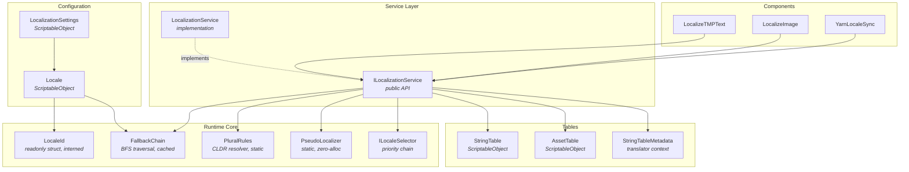

# CycloneGames.Localization

<div align="left">English | <a href="./README.SCH.md">简体中文</a></div>

**Localization framework** for Unity designed for commercial-grade projects. Provides a complete string & asset localization pipeline with BCP 47 locale identifiers, automatic fallback chains, CLDR plural rules for 25+ languages, per-locale layout snapshots (via UIFramework integration), and a zero-GC runtime core — all fully driven by ScriptableObject configuration with no code generation required.

## Features

### 🌍 Core Localization

| Feature                       | Detail                                                                                                              |
| ----------------------------- | ------------------------------------------------------------------------------------------------------------------- |
| **Interned LocaleId**         | `readonly struct` backed by `string.Intern()` — O(1) equality via `ReferenceEquals`, zero per-comparison allocation |
| **BCP 47 Support**            | Standard locale codes: `en`, `zh-CN`, `ja-JP`, `pt-BR`, etc.                                                        |
| **Locale ScriptableObject**   | Display name, native name, and fallback chain per locale — designers configure in Inspector                         |
| **Automatic Fallback Chain**  | BFS traversal with deduplication: `zh-CN → zh → en` resolved once and cached                                        |
| **System Language Detection** | Detects OS language via `CultureInfo` (BCP 47) with `Application.systemLanguage` fallback                           |

### 📝 String Tables

| Feature                       | Detail                                                                                                    |
| ----------------------------- | --------------------------------------------------------------------------------------------------------- |
| **ScriptableObject Tables**   | One `StringTable` asset per locale per table ID — drop into Resources or Addressables                     |
| **Lazy Dictionary Baking**    | Entries are stored as serialized lists; dictionary is built on first access with `StringComparer.Ordinal` |
| **Fallback Chain Resolution** | If a key is missing in `zh-CN`, automatically checks `zh`, then `en`, etc.                                |
| **Hot Reload**                | Dictionary is rebuilt on `OnEnable` — edit in Play mode and see changes immediately                       |
| **Parameterized Text**        | `GetFormattedString("ui", "damage", weaponName, amount)` → `"Deals {0} {1} damage"`                       |

### 🔢 Plural Rules (CLDR)

| Feature                | Detail                                                                                                                                         |
| ---------------------- | ---------------------------------------------------------------------------------------------------------------------------------------------- |
| **25+ Languages**      | Full CLDR cardinal plural rules: East Slavic, Polish, Czech, Arabic, Romanian, Lithuanian, Latvian, Irish, Slovenian, Welsh, Maltese, and more |
| **6 Categories**       | `Zero`, `One`, `Two`, `Few`, `Many`, `Other` — each language uses its required subset                                                          |
| **Suffix Convention**  | Base key `"item_count"` → entries `"item_count.one"`, `"item_count.other"`, etc.                                                               |
| **Automatic Fallback** | Resolved category → `.other` fallback → missing key warning                                                                                    |
| **Zero Allocation**    | Pure static methods with integer math — no string concat at resolve time                                                                       |

### 🎨 Asset Tables

| Feature                       | Detail                                                                            |
| ----------------------------- | --------------------------------------------------------------------------------- |
| **Per-Locale Asset Variants** | Map a logical key to different sprites, audio clips, or fonts per locale          |
| **Fallback Chain Resolution** | Same BFS fallback as string tables — `ja-JP → ja → en`                            |
| **AssetRef Integration**      | Resolves to `AssetRef<T>` compatible with `CycloneGames.AssetManagement` pipeline |
| **Type-Safe**                 | `LocalizedAsset<Sprite>`, `LocalizedAsset<AudioClip>`, etc.                       |

### 🧩 Components

| Feature                   | Detail                                                                                |
| ------------------------- | ------------------------------------------------------------------------------------- |
| **LocalizeTMPText**       | Auto-updates `TMP_Text` on locale change — supports plain, formatted, and plural text |
| **LocalizeImage**         | Auto-updates `Image.sprite` with proper asset handle lifetime management              |
| **Event-Driven**          | Zero per-frame cost — refresh only on `OnLocaleChanged` event                         |
| **Graceful Missing Keys** | Returns `null` on missing key → preserves Prefab original text (designer placeholder) |

### 🔌 Integrations

| Feature                      | Detail                                                                                                                                                      |
| ---------------------------- | ----------------------------------------------------------------------------------------------------------------------------------------------------------- |
| **Yarn Spinner**             | `YarnLocaleSync` bridges locale changes to `LineProviderBehaviour.LocaleCode` — zero source modification required                                           |
| **CycloneGames.UIFramework** | Optional per-locale layout snapshots via `UILocaleLayout` — [see UIFramework docs](../CycloneGames.UIFramework/README.md#localization-integration-optional) |

### 🧪 Pseudo-Localization

| Feature                  | Detail                                                                                                                           |
| ------------------------ | -------------------------------------------------------------------------------------------------------------------------------- |
| **5 Transform Modes**    | `Accents` (à→é), `Elongate` (~33% padding), `Brackets` (text), `Mirror` (RTL reversal), `Full` (Accents + Elongate + Brackets) |
| **Bitwise Combinable**   | `[Flags]` enum — combine any modes via `\|` for custom QA presets                                                                |
| **Zero Allocation**      | `stackalloc` for strings ≤ 512 chars; pass-through when `PseudoLocaleMode.None`                                                  |
| **Runtime Toggle**       | `ILocalizationService.PseudoMode` — switch modes at runtime without restart                                                      |
| **Settings Integration** | `PseudoLocaleMode` field on `LocalizationSettings` — configure in Inspector, auto-passed via `ToOptions()`                       |

### 🔗 Locale Selection Chain

| Feature                        | Detail                                                                                       |
| ------------------------------ | -------------------------------------------------------------------------------------------- |
| **Priority-Ordered Selectors** | `ILocaleSelector` interface — first non-null match wins                                      |
| **CommandLineLocaleSelector**  | `--locale zh-CN` — highest priority, cached after first call; ideal for QA                   |
| **PlayerPrefsLocaleSelector**  | Reads/writes `PlayerPrefs` key `"CycloneGames.Locale"` — player language settings            |
| **SystemLocaleSelector**       | `CultureInfo.CurrentUICulture` (BCP 47) with `Application.systemLanguage` fallback           |
| **Custom Selectors**           | Implement `ILocaleSelector` to add project-specific sources (server config, Steam API, etc.) |
| **Default Chain**              | CommandLine → PlayerPrefs → System → Default Locale (when no custom chain is provided)       |

### 📋 Entry Metadata

| Feature                   | Detail                                                                                                     |
| ------------------------- | ---------------------------------------------------------------------------------------------------------- |
| **Translator Context**    | `Comment` field — notes describing context, tone, or constraints for translators                           |
| **Character Limit**       | `MaxLength` — enforces max character count; queryable at runtime via `GetMaxLength()` for input validation |
| **Lock State**            | `Locked` flag — marks finalized entries that should not be modified                                        |
| **Tag System**            | Comma-separated `Tags` for categorization and filtering (e.g. `"menu,button,short"`)                       |
| **Screenshot Reference**  | `Texture2D` reference showing where text appears in the UI (Editor only)                                   |
| **Separate Storage**      | `StringTableMetadata` ScriptableObject — keeps runtime `StringTable` assets lean                           |
| **Table Type Separation** | `TableType` enum (`String` / `Asset`) — same table ID can have independent metadata per type               |

### 🛠️ Editor Tools

| Feature                                | Detail                                                                                                                                           |
| -------------------------------------- | ------------------------------------------------------------------------------------------------------------------------------------------------ |
| **Multi-Language String Table Editor** | Side-by-side editing of all locales with frozen Key column, horizontal/vertical scroll, metadata sub-row, duplicate detection, CSV import/export |
| **Multi-Language Asset Table Editor**  | Same architecture for asset tables — pinned Key column, per-locale `AssetRef` fields, metadata integration                                       |
| **CSV Import / Export**                | Batch import/export for translator handoff                                                                                                       |
| **Property Drawers**                   | Dropdown table & key selectors for `LocalizedString` and `LocalizedAsset<T>`                                                                     |
| **Locale Inspector**                   | Custom editor showing BCP 47 code, display name, native name, fallback chain                                                                     |
| **Version-Cached Discovery**           | `LocalizedFieldHelper` with `AssetPostprocessor` — table/key lists update on import, zero per-frame cost                                         |

## Core Architecture



## Dependencies

| Package                          | Usage                                                                        |
| -------------------------------- | ---------------------------------------------------------------------------- |
| **CycloneGames.AssetManagement** | `AssetRef<T>`, `IAssetPackage`, `IAssetHandle<T>` for asset table resolution |
| **UniTask**                      | Async initialization and locale switching                                    |
| **TextMeshPro**                  | `LocalizeTMPText` component                                                  |
| **Unity UI**                     | `LocalizeImage` component                                                    |
| **Yarn Spinner** _(optional)_    | `YarnLocaleSync` — compiled only when Yarn Spinner is present                |

---

## Getting Started

### 1. Create Locale Assets

Create a `Locale` ScriptableObject for each supported language:

**Create → CycloneGames → Localization → Locale**

| Field        | Example (English) | Example (Simplified Chinese) |
| ------------ | ----------------- | ---------------------------- |
| Locale Code  | `en`              | `zh-CN`                      |
| Display Name | `English`         | `Simplified Chinese`         |
| Native Name  | `English`         | `简体中文`                   |
| Fallbacks    | _(empty)_         | `en`                         |

Fallback chains are defined per locale. For example, `zh-CN` falls back to `en`, meaning any key missing from the Chinese table will automatically resolve from the English table.

### 2. Create Localization Settings

Create a single `LocalizationSettings` asset:

**Create → CycloneGames → Localization → Settings**

| Field                  | Description                                                                     |
| ---------------------- | ------------------------------------------------------------------------------- |
| Default Locale         | The fallback locale when system detection fails                                 |
| Available Locales      | All locales the project supports (drag Locale assets here)                      |
| Detect System Language | When enabled, the system auto-selects the best matching locale on first launch  |
| Pseudo Locale Mode     | QA testing mode: `None`, `Accents`, `Elongate`, `Brackets`, `Mirror`, or `Full` |

### 3. Create String Tables

Create one `StringTable` per locale per table group:

**Create → CycloneGames → Localization → String Table**

Example structure:

```
Localization/
├── StringTables/
│   ├── UI_en.asset        (tableId: "ui", locale: "en")
│   ├── UI_zh-CN.asset     (tableId: "ui", locale: "zh-CN")
│   ├── Items_en.asset     (tableId: "items", locale: "en")
│   └── Items_zh-CN.asset  (tableId: "items", locale: "zh-CN")
```

Use the **String Table Editor Window** (Tools → CycloneGames → Localization → String Table Editor) for visual editing, or import from CSV.

### 4. Initialize the Service

```csharp
// With VContainer
public class LocalizationInstaller : LifetimeScope
{
    [SerializeField] private LocalizationSettings settings;

    protected override void Configure(IContainerBuilder builder)
    {
        builder.Register<LocalizationService>(Lifetime.Singleton)
               .As<ILocalizationService>();

        builder.RegisterBuildCallback(resolver =>
        {
            var service = resolver.Resolve<ILocalizationService>();
            service.InitializeAsync(settings.ToOptions()).Forget();
        });
    }
}
```

```csharp
// Manual initialization
var service = new LocalizationService();
await service.InitializeAsync(settings.ToOptions());
```

### 5. Register String Tables

```csharp
// Load and register tables (e.g. from Addressables or Resources)
service.RegisterStringTable(uiTableEn);
service.RegisterStringTable(uiTableZhCN);
```

---

## Usage

### Basic String Lookup

```csharp
// Via LocalizedString (Inspector-assigned)
[SerializeField] private LocalizedString greeting;

string text = localizationService.GetString(greeting);
// e.g. "Welcome back, Hero!"

// Via table ID + key
string text = localizationService.GetString("ui", "greeting");
```

### Parameterized Text

StringTable entry: `"damage_dealt" → "Deals {0} {1} damage"`

```csharp
[SerializeField] private LocalizedString damageDealt;

string text = localizationService.GetFormattedString(damageDealt, weaponName, amount);
// e.g. "Deals Excalibur 150 damage"
```

### Plural Strings

StringTable entries:

```
"item_count.one"   → "{0} item"
"item_count.other" → "{0} items"
```

For East Slavic languages (Russian, Ukrainian, etc.):

```
"item_count.one"   → "{0} предмет"
"item_count.few"   → "{0} предмета"
"item_count.many"  → "{0} предметов"
```

```csharp
[SerializeField] private LocalizedString itemCount;

string text = localizationService.GetPluralString(itemCount, count);
// count=1  → "1 item"     (en)
// count=5  → "5 items"    (en)
// count=3  → "3 предмета" (ru, "few" form)
```

With extra arguments:

```csharp
// "item_count.one"   → "You have {0} {1} item"
// "item_count.other" → "You have {0} {1} items"

string text = localizationService.GetPluralString(itemCount, count, playerName);
// count is always {0}, extra args are {1}, {2}, ...
```

### Switching Locale at Runtime

```csharp
await localizationService.SetLocaleAsync(new LocaleId("zh-CN"));
// All subscribed components (LocalizeTMPText, LocalizeImage, etc.) auto-refresh

// Save player's choice so it persists across sessions
PlayerPrefsLocaleSelector.Save(new LocaleId("zh-CN"));
```

### Pseudo-Localization (QA Testing)

Enable pseudo-localization to test UI layout and find hardcoded strings without real translations:

```csharp
// Option 1: Configure in LocalizationSettings Inspector (Pseudo Locale Mode field)

// Option 2: Toggle at runtime
localizationService.PseudoMode = PseudoLocaleMode.Full;
// All GetString / GetFormattedString / GetPluralString results are now transformed:
// "Settings" → "Šéťťíñĝš~~~"

// Custom combination
localizationService.PseudoMode = PseudoLocaleMode.Accents | PseudoLocaleMode.Brackets;
// "Settings" → "Šéťťíñĝš"

// Disable
localizationService.PseudoMode = PseudoLocaleMode.None;
```

| Mode       | Effect                        | Use Case                                              |
| ---------- | ----------------------------- | ----------------------------------------------------- |
| `Accents`  | `a→à, e→é, s→š`               | Verify text renders with diacritics (encoding issues) |
| `Elongate` | Appends `~~~` (~33% longer)   | Catch truncation — simulates German / Finnish length  |
| `Brackets` | `text`                      | Spot hardcoded strings that bypass localization       |
| `Mirror`   | Reverses character order      | Basic RTL layout testing                              |
| `Full`     | Accents + Elongate + Brackets | Comprehensive QA pass                                 |

### Locale Selection Chain

On initialization, the service evaluates selectors in priority order to determine the starting locale:

```
CommandLine → PlayerPrefs → System → Default Locale
```

```csharp
// Force locale via command line (highest priority)
// Launch: MyGame.exe --locale ja

// Save/clear player preference
PlayerPrefsLocaleSelector.Save(new LocaleId("fr"));  // persists to PlayerPrefs
PlayerPrefsLocaleSelector.Clear();                     // reverts to system detection

// Custom selector chain
var options = new LocalizationOptions(
    defaultLocale: enLocale,
    availableLocales: allLocales,
    localeSelectors: new ILocaleSelector[]
    {
        new CommandLineLocaleSelector(),
        new PlayerPrefsLocaleSelector(),
        new MyServerConfigSelector(),    // your custom implementation
        new SystemLocaleSelector(),
    });
await service.InitializeAsync(options);
```

Implement `ILocaleSelector` for project-specific sources:

```csharp
public class SteamLocaleSelector : ILocaleSelector
{
    public string GetPreferredLocaleCode()
    {
        // Return BCP 47 code or null if no preference
        return SteamApps.GameLanguage switch
        {
            "schinese" => "zh-CN",
            "japanese" => "ja",
            _ => null
        };
    }
}
```

### Entry Metadata

Provide context for translators via `StringTableMetadata` — a separate ScriptableObject that keeps runtime tables lean:

**Create → CycloneGames → Localization → String Table Metadata**

```csharp
// Register metadata for runtime MaxLength queries
service.RegisterMetadata(uiMetadata);

// Query character limit (e.g. for player name input validation)
int maxLen = localizationService.GetMaxLength("ui", "player_name");
if (maxLen > 0 && input.Length > maxLen)
    input = input.Substring(0, maxLen);
```

| Field        | Type                | Description                                           |
| ------------ | ------------------- | ----------------------------------------------------- |
| `Comment`    | `string` (TextArea) | Translator notes: context, tone, constraints          |
| `MaxLength`  | `int`               | Character limit (0 = no limit) — available at runtime |
| `Locked`     | `bool`              | Marks finalized entries                               |
| `Tags`       | `string`            | Comma-separated categories: `"menu,button,short"`     |
| `Screenshot` | `Texture2D`         | UI reference screenshot (Editor only)                 |

### Regional Variants (en-US / en-GB, zh-CN / zh-TW)

Languages often have regional differences — American vs. British English spelling, Simplified vs. Traditional Chinese vocabulary. The fallback chain handles this naturally: **create a full base table and override only the differing entries in regional tables.**

Example: English with a British override

```
Locale Assets:
  en     (base English — full table, 500 entries)
  en-GB  → fallback: [en]  (only 30 entries that differ)
```

```
UI_en.asset:
  settings_color    → "Color"
  settings_favorite → "Favorite"
  btn_ok            → "OK"

UI_en-GB.asset (overrides only):
  settings_color    → "Colour"
  settings_favorite → "Favourite"
```

Lookup for `en-GB` player:

- `"btn_ok"` → not in `en-GB` table → fallback to `en` → `"OK"` ✅
- `"settings_color"` → found in `en-GB` table → `"Colour"` ✅ (no fallback needed)

The same pattern works for Chinese:

```
Locale Assets:
  zh-CN  (base Chinese — full table)
  zh-TW  → fallback: [zh-CN, en]  (overrides: 信息→資訊, 软件→軟體, etc.)
```

System language detection automatically selects the best match: a `zh-TW` system finds the `zh-TW` locale; if that locale doesn't exist, it falls back to the language-only match `zh-CN`.

> **Tip**: If two regional variants share most content, use the override pattern (saves translation effort). If they differ significantly in tone and style, use two independent full tables instead.

### Asset Localization

```csharp
// Resolve a per-locale sprite
[SerializeField] private LocalizedAsset<Sprite> flagIcon;

AssetRef<Sprite> assetRef = localizationService.ResolveAsset(flagIcon);
var handle = assetPackage.LoadAsync(assetRef);
await handle.Task;
image.sprite = handle.Asset;
```

---

## Component Usage

### LocalizeTMPText

Attach to any `TMP_Text`. Assign a `LocalizedString` in the Inspector. Call `Bind()` to connect.

```csharp
var locText = GetComponent<LocalizeTMPText>();
locText.Bind(localizationService);

// Change key at runtime
locText.LocalizedString = new LocalizedString("ui", "new_key");

// Set format arguments
locText.SetArguments(playerName, score);

// Set plural arguments (count auto-determines plural form)
locText.SetPluralArguments(itemCount, itemName);
```

**Missing key behavior**: If the key is not found, `Refresh()` returns `null` and the TMP_Text retains its existing content — perfect for development when translations aren't ready yet.

### LocalizeImage

Attach to any `Image`. Assign a `LocalizedAsset<Sprite>` in the Inspector.

```csharp
var locImg = GetComponent<LocalizeImage>();
locImg.Bind(localizationService, assetPackage);
// Sprite auto-updates when locale changes; old handle is disposed properly
```

---

## Yarn Spinner Integration

`YarnLocaleSync` bridges locale changes to Yarn Spinner's `LineProviderBehaviour`. No modification to Yarn Spinner source code required.

```csharp
var yarnSync = GetComponent<YarnLocaleSync>();
yarnSync.Bind(localizationService);
// When locale changes, DialogueRunner.LineProvider.LocaleCode is updated automatically
```

Setup:

1. Add `YarnLocaleSync` to the same GameObject as `DialogueRunner` (or any persistent object).
2. Assign the `DialogueRunner` reference in the Inspector.
3. Call `Bind()` with your `ILocalizationService`.

---

## Editor Tools

### Multi-Language String Table Editor

**Tools → CycloneGames → Localization → String Table Editor**

Edits all locale variants of a string table side-by-side in a single window.

| Feature             | Description                                                                      |
| ------------------- | -------------------------------------------------------------------------------- |
| Multi-Locale View   | All locales displayed as columns — edit every translation in one place           |
| Frozen Key Column   | Key and action columns stay pinned while scrolling horizontally through locales  |
| Auto Scrollbars     | Horizontal scroll when locales exceed viewport; vertical scroll for many entries |
| Metadata Sub-Row    | Expandable per-entry metadata: Comment, MaxLength, Locked, Tags, Screenshot      |
| Search Filter       | Real-time key/value search across all locales                                    |
| Add / Delete Entry  | Add with auto-generated unique key; delete syncs across all locale tables        |
| Duplicate Detection | Status bar shows duplicate key count — duplicates are highlighted                |
| CSV Import / Export | Batch import/export for translator handoff                                       |

### Multi-Language Asset Table Editor

**Tools → CycloneGames → Localization → Asset Table Editor**

Same architecture as the String Table Editor, adapted for asset tables.

| Feature              | Description                                                        |
| -------------------- | ------------------------------------------------------------------ |
| Multi-Locale View    | Per-locale `AssetRef` object fields displayed as columns           |
| Frozen Key Column    | Key column stays pinned during horizontal scroll                   |
| Metadata Integration | Expandable metadata sub-row with Comment, Locked, Tags, Screenshot |
| Auto Scrollbars      | Adapts to any number of locales and entries                        |

### Property Drawers

#### LocalizedString Drawer

Two-row dropdown layout in the Inspector:

1. **Table selector** — lists all discovered `StringTable` assets
2. **Key selector** — lists all keys in the selected table

#### LocalizedAsset Drawer

Same pattern for `LocalizedAsset<T>` — type-aware key dropdown from `AssetTable` assets.

Both drawers use `LocalizedFieldHelper` with version-based caching: table and key lists are rebuilt only when assets are imported/deleted, not every `OnGUI` frame.

### Locale Inspector

Custom editor for `Locale` ScriptableObject showing:

- BCP 47 locale code
- Display name and native name
- Visual fallback chain

---

## Missing Key Debugging

In **Editor** and **Development builds**, the system logs a warning to the Console the first time a missing key is encountered:

```
[Localization] Missing key "ui/greeting" (locale: zh-CN)
```

Each unique key is reported only once (deduplicated via `HashSet`). This prevents console spam while ensuring no missing key goes unnoticed.

### Behavior Summary

| Scenario                           | Return Value        | Side Effect                      |
| ---------------------------------- | ------------------- | -------------------------------- |
| Key found                          | Resolved string     | —                                |
| Key missing                        | `null`              | Console warning (once, dev only) |
| `LocalizeTMPText` receives `null`  | Keeps existing text | Prefab placeholder preserved     |
| `LocalizedString.IsValid == false` | `string.Empty`      | —                                |

### Controlling Warnings

```csharp
#if UNITY_EDITOR || DEVELOPMENT_BUILD
LocalizationService.LogMissingKeys = false; // suppress warnings
#endif
```

---

## Plural Rules Reference

The following table shows which `PluralCategory` values each language group uses. Most projects only need the first three rows.

| Categories                               | Languages                                                                                 |
| ---------------------------------------- | ----------------------------------------------------------------------------------------- |
| `Other` only                             | zh, ja, ko, vi, th, id, ms                                                                |
| `One` / `Other`                          | en, de, nl, sv, da, it, es, el, hu, fi, tr, bg, hi, bn, etc.                              |
| `One` (n ≤ 1) / `Other`                  | fr, pt (except pt-PT)                                                                     |
| `One` / `Few` / `Many`                   | ru, uk, be, hr, sr, bs, pl                                                                |
| `One` / `Few` / `Other`                  | cs, sk, ro, mo, lt                                                                        |
| `Zero` / `One` / `Other`                 | lv                                                                                        |
| All 6 categories                         | ar, cy — see [CLDR](https://cldr.unicode.org/index/cldr-spec/plural-rules) for full rules |
| `One` / `Two` / `Few` / `Many` / `Other` | ga, mt                                                                                    |
| `One` / `Two` / `Few` / `Other`          | sl                                                                                        |

---

## API Reference

### `ILocalizationService`

| Member                                                      | Description                                                             |
| ----------------------------------------------------------- | ----------------------------------------------------------------------- |
| `CurrentLocale`                                             | The currently active `LocaleId`                                         |
| `AvailableLocales`                                          | Read-only list of all configured `Locale` assets                        |
| `IsInitialized`                                             | Whether `InitializeAsync` has completed                                 |
| `PseudoMode`                                                | Get/set the active `PseudoLocaleMode` — toggle QA transforms at runtime |
| `OnLocaleChanged`                                           | Event fired when the active locale changes                              |
| `InitializeAsync(LocalizationOptions)`                      | Initialize with options from `LocalizationSettings.ToOptions()`         |
| `SetLocaleAsync(LocaleId)`                                  | Switch the active locale and fire `OnLocaleChanged`                     |
| `GetString(in LocalizedString)`                             | Resolve a localized string with fallback chain                          |
| `GetString(string, string)`                                 | Resolve by table ID and entry key                                       |
| `GetFormattedString(in LocalizedString, params object[])`   | Resolve and format with arguments                                       |
| `GetFormattedString(string, string, params object[])`       | Resolve and format by table ID and entry key                            |
| `GetPluralString(in LocalizedString, int)`                  | Resolve plural form by CLDR rules                                       |
| `GetPluralString(in LocalizedString, int, params object[])` | Resolve plural form with extra arguments                                |
| `GetPluralString(string, string, int)`                      | Resolve plural form by table ID and entry key                           |
| `GetPluralString(string, string, int, params object[])`     | Resolve plural form by table ID, key, and extra args                    |
| `ResolveAsset(string, string)`                              | Resolve an asset reference by table and key                             |
| `ResolveAsset<T>(LocalizedAsset<T>)`                        | Type-safe asset resolution                                              |
| `GetMaxLength(string, string)`                              | Returns max character limit for an entry (0 = no limit)                 |
| `RegisterStringTable(StringTable)`                          | Register a string table for lookup                                      |
| `UnregisterStringTable(string, LocaleId)`                   | Remove a string table                                                   |
| `RegisterAssetTable(AssetTable)`                            | Register an asset table                                                 |
| `UnregisterAssetTable(string, LocaleId)`                    | Remove an asset table                                                   |
| `RegisterMetadata(StringTableMetadata)`                     | Register metadata for `GetMaxLength` queries                            |
| `UnregisterMetadata(string)`                                | Remove metadata by table ID                                             |

### `LocaleId`

| Member     | Description                                 |
| ---------- | ------------------------------------------- |
| `Code`     | The interned BCP 47 string (e.g. `"zh-CN"`) |
| `IsValid`  | `true` if `Code` is not null                |
| `Language` | Language-only portion: `"zh-CN"` → `"zh"`   |
| `Invalid`  | Static readonly default (null code)         |

### `StringTable`

| Member                            | Description                                                |
| --------------------------------- | ---------------------------------------------------------- |
| `TableId`                         | Identifier shared across all locale variants of this table |
| `LocaleId`                        | The locale this table provides translations for            |
| `Count`                           | Number of entries                                          |
| `TryGetValue(string, out string)` | O(1) dictionary lookup with `StringComparer.Ordinal`       |

### `AssetTable`

| Member                                     | Description                         |
| ------------------------------------------ | ----------------------------------- |
| `TableId`                                  | Identifier for this asset table     |
| `Count`                                    | Number of entries                   |
| `TryGetEntry(string, out AssetTableEntry)` | O(1) lookup for asset table entries |

### `PluralRules`

| Member                      | Description                                                                   |
| --------------------------- | ----------------------------------------------------------------------------- |
| `Resolve(LocaleId, int)`    | Returns the `PluralCategory` for a locale and count                           |
| `GetSuffix(PluralCategory)` | Returns the suffix string: `.zero`, `.one`, `.two`, `.few`, `.many`, `.other` |

### `PseudoLocaleMode`

| Value      | Description                                                         |
| ---------- | ------------------------------------------------------------------- |
| `None`     | Disabled — pass-through original text                               |
| `Accents`  | Replace ASCII letters with accented variants (`a→à`, `e→é`)         |
| `Elongate` | Pad text with ~33% extra characters to simulate longer translations |
| `Brackets` | Wrap text in `` to detect truncation and hardcoded strings        |
| `Mirror`   | Reverse character order for RTL testing                             |
| `Full`     | `Accents \| Elongate \| Brackets` — the most common QA preset       |

### `PseudoLocalizer`

| Member                                | Description                                                                                         |
| ------------------------------------- | --------------------------------------------------------------------------------------------------- |
| `Transform(string, PseudoLocaleMode)` | Transforms a string according to the active pseudo mode; returns the original reference when `None` |

### `ILocaleSelector`

| Member                     | Description                                                              |
| -------------------------- | ------------------------------------------------------------------------ |
| `GetPreferredLocaleCode()` | Returns a BCP 47 locale code, or `null` if this source has no preference |

### `CommandLineLocaleSelector`

| Member                     | Description                                                                     |
| -------------------------- | ------------------------------------------------------------------------------- |
| `GetPreferredLocaleCode()` | Parses `--locale <code>` from command-line args; result cached after first call |

### `PlayerPrefsLocaleSelector`

| Member                     | Description                                                          |
| -------------------------- | -------------------------------------------------------------------- |
| `PrefsKey`                 | `"CycloneGames.Locale"` — the `PlayerPrefs` key used for persistence |
| `GetPreferredLocaleCode()` | Reads from `PlayerPrefs`; returns `null` if no preference saved      |
| `Save(LocaleId)`           | Static — saves the locale to `PlayerPrefs` and calls `Save()`        |
| `Clear()`                  | Static — deletes the saved preference (reverts to system detection)  |

### `SystemLocaleSelector`

| Member                     | Description                                                                                                |
| -------------------------- | ---------------------------------------------------------------------------------------------------------- |
| `GetPreferredLocaleCode()` | Detects OS language via `CultureInfo.CurrentUICulture`; falls back to `Application.systemLanguage` mapping |

### `StringTableMetadata`

| Member                                      | Description                                                                 |
| ------------------------------------------- | --------------------------------------------------------------------------- |
| `TableId`                                   | Identifier linking this metadata to a `StringTable`                         |
| `TableType`                                 | `TableType.String` or `TableType.Asset` — allows separate metadata per type |
| `Entries`                                   | Read-only list of `EntryMetadata`                                           |
| `TryGetMetadata(string, out EntryMetadata)` | O(1) lookup by entry key                                                    |
| `GetMaxLength(string)`                      | Returns max character count for a key (0 = no limit)                        |

### `EntryMetadata`

| Field        | Type        | Description                                   |
| ------------ | ----------- | --------------------------------------------- |
| `Key`        | `string`    | The entry key this metadata is attached to    |
| `Comment`    | `string`    | Translator notes (context, tone, constraints) |
| `MaxLength`  | `int`       | Maximum character count (0 = no limit)        |
| `Locked`     | `bool`      | Whether this entry is finalized               |
| `Tags`       | `string`    | Comma-separated tags for filtering            |
| `Screenshot` | `Texture2D` | UI reference screenshot (Editor only)         |

### `LocalizationOptions`

| Field                  | Description                                                               |
| ---------------------- | ------------------------------------------------------------------------- |
| `DefaultLocale`        | The fallback `Locale` when no selector matches                            |
| `AvailableLocales`     | All locales the project supports                                          |
| `DetectSystemLanguage` | Whether to auto-detect OS language                                        |
| `LocaleSelectors`      | Ordered `ILocaleSelector` list (first match wins); `null` = default chain |
| `PseudoMode`           | `PseudoLocaleMode` for QA testing; default `None`                         |

### `LocalizeTMPText`

| Member                                     | Description                                         |
| ------------------------------------------ | --------------------------------------------------- |
| `LocalizedString`                          | Get/set the localized string key (triggers refresh) |
| `Bind(ILocalizationService)`               | Connect to the localization service                 |
| `SetArguments(params object[])`            | Set format arguments for `string.Format`            |
| `SetPluralArguments(int, params object[])` | Set plural count and optional extra args            |

### `LocalizeImage`

| Member                                      | Description                                |
| ------------------------------------------- | ------------------------------------------ |
| `Bind(ILocalizationService, IAssetPackage)` | Connect to localization and asset services |

### Performance Notes

- **Zero GC after warmup**: Dictionary lookups use `StringComparer.Ordinal`; `LocaleId` equality is `ReferenceEquals` on interned strings
- **Event-driven refresh**: Components only update when `OnLocaleChanged` fires — zero per-frame overhead
- **Fallback chain cached**: BFS traversal runs once per locale and is cached for all subsequent lookups
- **Plural rules zero-alloc**: Static methods with pure integer math — no string concatenation at resolve time
- **Pseudo-localizer zero-alloc**: `stackalloc` for strings ≤ 512 chars; inline pass-through when `None`
- **Locale selector cached**: `CommandLineLocaleSelector` and `SystemLocaleSelector` cache results after first call
- **Missing key dedup**: HashSet prevents repeated Console warnings for the same key
