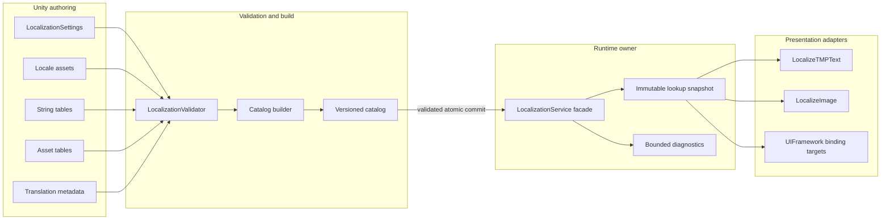

# CycloneGames.Localization

[English | 简体中文](README.SCH.md)

CycloneGames.Localization is a Unity localization module for versioned text and asset content in long-lived projects. It combines locale-aware runtime lookup, bounded catalog installation, explicit presentation binding, and editor workflows for teams that translate content incrementally over a long project lifetime. It targets desktop, mobile, WebGL, headless Unity players, and console integrations with a compatible asset backend, and does not require a DI container, a global service locator, runtime reflection, or worker threads.

## Table of Contents

- [Overview](#overview)
- [Architecture](#architecture)
- [Quick Start](#quick-start)
- [Core Concepts](#core-concepts)
- [Usage Guide](#usage-guide)
- [Advanced Topics](#advanced-topics)
- [Common Scenarios](#common-scenarios)
- [Performance and Memory](#performance-and-memory)
- [Troubleshooting](#troubleshooting)

## Overview

A localization system answers two questions: which text or asset should the player see, and which locale is currently committed. CycloneGames.Localization separates authoring (`LocalizationSettings`, `Locale`, `StringTable`, `AssetTable`, `StringTableMetadata` edited in the Editor) from runtime dispatch (`LocalizationService` facade over an immutable lookup snapshot), and from presentation (`LocalizeTMPText`, `LocalizeImage`, `LocalizationWindowBinder`). The owner authors tables and catalogs; the service validates and installs them as one atomic transaction; presentation components subscribe to committed changes and refresh on demand.

The module owns validated locale identifiers, explicit fallback graphs, partitioned string and asset tables, plural selection, composite formatting, pseudo-localization, transactional runtime catalog ownership, TMP and UGUI bindings, and the editor workflows for multi-language authoring, validation, CSV exchange, and catalog builds. Font fallback, bidirectional shaping, remote translation vendor APIs, download/auth/patch/CDN policy, and the application save format for the player's locale preference are not owned by this module — they stay in their owning adapters so translation data remains independent of product-specific networking, persistence, and UI composition. UI navigation and locale-specific prefab layout belong to `CycloneGames.UIFramework` when used.

Use this module when the project needs versioned, partitioned, transactional localization that survives a long live-service lifetime with incremental translation deliveries. Do not use it as a font/glyph coverage solution or a translation-management vendor bridge.

### Key Features

- **Validated `LocaleId`**: Bounded BCP 47-style tags with canonical casing; `TryCreate` at untrusted boundaries.
- **Explicit fallback graphs**: Per-`Locale` fallback references, deterministic cycle-safe chains.
- **Partitioned tables**: One `StringTable` / `AssetTable` per `(table ID, locale)`; supports independent locale packs.
- **Plural selection and composite formatting**: Deterministic integer cardinal rule set (`CLDR-48-integer-cardinal-subset`); translator-controlled composite formats.
- **Transactional catalogs**: `LocalizationCatalog` installs multiple tables as one owner-scoped atomic transaction with schema, hash, duplicate, and size validation.
- **Presentation bindings**: `LocalizeTMPText`, `LocalizeImage`, `LocalizationWindowBinder` subscribe only while enabled; no per-frame polling.
- **Pseudo-localization**: Placeholder- and tag-safe text transformation for layout and content QA.
- **Editor workspaces**: Multi-language table workspace, incremental CSV exchange (RFC 4180), validation window, partitioned catalog builds.
- **Pure C# core**: `CycloneGames.Localization.Core` has `noEngineReferences: true`; runtime and components depend on `UniTask` and `CycloneGames.AssetManagement`.

## Architecture

| Assembly | Path | Purpose |
| --- | --- | --- |
| `CycloneGames.Localization.Core` | `Core/` | `LocaleId`, fallback traversal, plural categories, pseudo-localization. No `UnityEngine` reference. |
| `CycloneGames.Localization.Runtime` | `Runtime/` | Authoring bridges, `LocalizationService`, catalogs, tables, selectors. Depends on Core, UniTask, AssetManagement. |
| `CycloneGames.Localization.Components` | `Runtime/Components/` | `LocalizeTMPText`, `LocalizeImage`. Depends on Runtime, TMP, UGUI, AssetManagement, UniTask. |
| `CycloneGames.Localization.Editor` | `Editor/` | Inspectors, table workspaces, validation, CSV, catalog build. Depends on Runtime, UnityEditor. |
| `CycloneGames.Localization.Runtime.Integrations.YarnSpinner` | `Runtime/Integrations/YarnSpinner/` | Yarn locale synchronization; compiles only when Yarn Spinner is installed. |
| `CycloneGames.Localization.Tests.Editor` | `Tests/Editor/` | Pure core, runtime, catalog, and editor workflow tests. |



Runtime content is partitioned by table and locale. Projects install a base catalog and independent downloadable locale packs without forcing every language into one resident asset. A catalog owner is replaced only after the complete candidate passes schema, hash, duplicate, and size validation.

## Quick Start

Add asmdef references to `CycloneGames.Localization.Runtime` (and `CycloneGames.Localization.Components` for presentation), then import the namespace:

```csharp
using CycloneGames.Localization.Runtime;
```

### Create authoring assets

1. Create a `LocalizationSettings` asset.
2. Create a `StringTable`, assign its table ID, then double-click it to open the combined table workspace.
3. Enter the first locale code (for example `en` or `zh-CN`) next to **+ Locale**. If the locale is not registered, the workspace offers to create or reuse its `Locale` asset, add it to `Available Locales`, and assign the empty default/authoring fields.
4. Configure display names and explicit fallback references on each `Locale` asset.
5. Click **+ Key** and enter source text in the authoring-locale column.
6. Run **Tools > CycloneGames > Localization > Validation > Window** before entering Play Mode or building a catalog.

### Initialize without DI

```csharp
using System;
using CycloneGames.Localization.Runtime;
using UnityEngine;

public sealed class GameLocalization : MonoBehaviour
{
    [SerializeField] private LocalizationSettings settings;
    [SerializeField] private StringTable[] bootstrapTables;

    public LocalizationService Service { get; private set; }

    private void Awake()
    {
        Service = new LocalizationService();
        Service.Initialize(settings.ToOptions());

        for (int i = 0; i < bootstrapTables.Length; i++)
        {
            if (!Service.RegisterStringTable(bootstrapTables[i]))
                throw new InvalidOperationException("Localization bootstrap table was rejected.");
        }
    }

    private void OnDestroy() => Service?.Dispose();
}
```

### Resolve strings and plurals

```csharp
string title = service.GetString("menu", "main.title");

if (service.TryGetString("inventory", "item.potion.name", out string potionName))
    nameLabel.text = potionName;

// Plural: store variants with category suffixes (item_count.one / item_count.other)
string countText = service.GetPluralString("inventory", "item_count", count);
```

### Format messages

```csharp
string message = service.GetFormattedString("combat", "damage.received", actorName, damage);
```

### Change locale

```csharp
LocaleId japanese = new LocaleId("ja");
if (!service.TrySetLocale(japanese))
{
    // Locale not available in this service configuration.
}
```

### Bind TMP text

```csharp
var context = new LocalizationBindingContext(service);
localizeText.Bind(in context);
```

The component subscribes only while enabled, performs no per-frame polling, and refreshes on locale, content, or pseudo changes.

## Core Concepts

### Locale Identity

`LocaleId` accepts bounded BCP 47-style language tags and canonicalizes their casing (`en`, `en-US`, `pt-BR`, `zh-Hans-CN`, `sr-Latn`). Invalid, empty, or oversized tags are rejected before they enter runtime registries. Use `LocaleId.TryCreate` at untrusted boundaries (command-line input, remote configuration, save data); direct construction is appropriate for validated constants.

```csharp
if (!LocaleId.TryCreate(untrustedCode, out LocaleId locale))
{
    // Reject the value or use the configured default locale.
}
```

Locale equality is ordinal over the canonical code. The `Language` property is cached and does not create a substring during repeated plural or fallback lookups.

### Default, Authoring, and Current Locale

Three locale roles are intentionally separate:

- **Default locale** — final runtime fallback when no requested variant is available.
- **Authoring locale** — language in which developers create and revise source text; defaults to the default locale when unset.
- **Current locale** — committed locale used by runtime queries.

This separation lets a team author content in its working language while shipping another default, and lets the editor keep the source column visible while translators work on other locales.

### Fallback

Each `Locale` asset can reference explicit fallback locales. The runtime builds a deterministic, cycle-safe chain during initialization:

```text
fr-CA -> fr -> en
```

Regional tables may be sparse: a missing `fr-CA` entry can resolve from `fr`. Cycles, duplicate locale codes, invalid references, and chains beyond configured limits are validation errors.

### Tables

A `StringTable` or `AssetTable` represents one table ID for one locale. This layout supports independent locale packs and predictable memory ownership.

- Table IDs and entry keys use ordinal matching; duplicate keys are rejected at compile time.
- Empty or whitespace-only string values are missing content (do not block fallback); an intentionally hidden label belongs to presentation state, not translation data.
- Compiled tables copy authoring data into read-only lookup state.
- Asset entries store an Editor object GUID separately from the provider-neutral runtime location; the runtime location must be valid for the selected `IAssetPackage` provider.
- Empty/invalid table IDs, locale codes, keys, oversized values, and asset locations are rejected according to `LocalizationLimits`.

Treat entry keys as stable contracts. Use semantic keys such as `menu.settings.audio` rather than display text.

### Translation Workflow Metadata

`StringTableMetadata` stores translator context without entering the normal string lookup path. An entry can include: source revision; per-locale status (`Missing`, `Draft`, `NeedsReview`, `Approved`, `Stale`); the source revision used by each translation; translator comments, maximum length, lock state, tags, and an Editor screenshot. Changing source text advances its revision and marks translations from earlier revisions as stale. Locked entries reject table-workspace and CSV writes until explicitly unlocked.

`StringTableMetadata` is not embedded in a catalog. Only products that use the optional runtime `GetMaxLength` contract need to load and register metadata assets; ordinary string/asset lookup and translation workflow do not load them.

### Runtime State and Threading

`LocalizationService` uses one writer and immutable read snapshots:

- `Initialize` must run on the Unity main thread and captures that thread as the mutation owner.
- `TrySetLocale`, table/catalog mutations, `Shutdown`, and `Dispose` run on that owner thread.
- Pure lookup methods capture an immutable snapshot and may run concurrently.
- Unity objects are never touched by worker-thread lookup code.
- WebGL uses the same design without requiring worker threads or synchronization primitives.

`Changed` is published synchronously on the owner thread after a state commit. Each event carries the previous locale, current locale, reason, and monotonic revision. Subscriber exceptions are isolated and sent to the configured diagnostic sink. Reentrant mutations are serialized with a bounded queue so later subscribers do not observe a stale outer transition after a nested commit.

### Memory and Cache Policy

The service has no global mutable lookup cache. A service instance owns: immutable compiled table snapshots; precomputed locale fallback chains; catalog ownership records; a bounded missing-key diagnostic set; and a bounded reentrant mutation queue. `Shutdown` releases the runtime registries and fallback data. `Dispose` ends the service lifetime and releases event ownership. Pseudo-localized and formatted strings are created on demand; callers that render unchanged values frequently should cache the resolved result and invalidate it on `Changed`.

## Usage Guide

### Initialize with DI

The service supports constructor registration in any composition root. The container owns the service lifetime; the module does not depend on the container.

```csharp
// VContainer example
builder.Register<LocalizationService>(Lifetime.Singleton)
       .AsImplementedInterfaces()
       .AsSelf();
```

### Resolve strings, assets, and plurals

```csharp
// String lookup
string title = service.GetString("menu", "main.title");
bool found = service.TryGetString("inventory", "item.potion.name", out string name);

// Plural lookup (variants stored with .one/.other/.few/... suffixes)
string countText = service.GetPluralString("inventory", "item_count", count);
```

`GetString` returns `null` for a missing value and emits at most one diagnostic per bounded missing-key identity. `TryGetString` is preferred when fallback UI or gameplay behavior is explicit.

### Format messages

```csharp
string message = service.GetFormattedString("combat", "damage.received", actorName, damage);
```

Composite formats are translator-controlled input. Validation checks placeholders before catalog build. Runtime formatting uses the configured `IFormatProvider` (default `CultureInfo.InvariantCulture`) and reports malformed formats without corrupting committed state. Formatting creates a result string (and a `params` array when the caller uses `params`); do not call it every frame for unchanged content. `LocalizeTMPText.SetNumericArguments` provides TMP's numeric formatting path for frequently updated numeric labels.

### Change locale and observe changes

```csharp
LocaleId japanese = new LocaleId("ja");
if (!service.TrySetLocale(japanese)) { /* not available */ }

service.Changed += change =>
{
    Debug.Log($"Localization revision {change.Revision}: {change.Reason}");
};
```

Switching locale is synchronous because it commits already resident lookup state. Network or disk work belongs to the catalog provider: load and validate the catalog first, commit it on the owner thread, then select the locale.

### Locale selection and persistence

Initialization evaluates `ILocaleSelector` instances in order. The built-in chain can use command-line and system UI culture selection before the configured default.

```csharp
ILocaleSelector[] selectors =
{
    new CommandLineLocaleSelector(),
    new SavedLocaleSelector(applicationSettings),
    new SystemLocaleSelector(),
};

var options = new LocalizationOptions(
    defaultLocale,
    locales,
    localeSelectors: selectors);
```

An application-owned selector reads from the same explicit, versioned save/settings service that owns the rest of the user's preferences. The localization module does not write `PlayerPrefs`, `EditorPrefs`, registry, plist, or a hidden global file. Persist the selected locale through the application's save service with its schema, migration, atomic-write, integrity, and recovery policy.

### Bind presentation components

```csharp
// TMP text — no asset package required
var textContext = new LocalizationBindingContext(service);
localizeText.Bind(in textContext);

// Localized image — requires IAssetPackage
var imageContext = new LocalizationBindingContext(service, assetPackage);
localizeImage.Bind(in imageContext);

// UIFramework window (when CycloneGames.UIFramework is present)
var binder = new LocalizationWindowBinder(service, assetPackage);
```

`LocalizeImage` keeps the last valid handle until the candidate for the current locale finishes successfully. Cancellation, provider faults, stale completions, disable, unbind, and destruction release the handles they own; a failed candidate does not dispose the last-known-good image prematurely. `LocalizationWindowBinder` scans the instantiated window hierarchy once, binds in hierarchy order, rolls back in reverse order if any bind fails, and unbinds in reverse order when the window is destroyed.

### Runtime catalogs

A `LocalizationCatalog` is a versioned, hashed payload for installing multiple string and asset tables as one owner transaction.

```csharp
if (!service.TryRegisterCatalog("base-content", baseCatalog))
{
    // Keep running on the previously committed snapshot.
}

if (!service.TryRegisterCatalog("season-12", downloadedCatalog))
{
    // The previous season-12 owner remains active.
}

service.RemoveCatalog("season-12"); // removes only content owned by that ID
```

Replacing an owner validates the entire candidate before publication. Failed schema, hash, limit, locale, duplicate table, duplicate key, or location validation leaves the previous snapshot untouched. `RemoveCatalog(ownerId)` removes only content owned by that ID and republishes the remaining immutable snapshot. Catalog load order is not an override priority: two owners containing the same `(table type, table ID, locale)` conflict, and the later candidate is rejected. Reinstalling the same owner ID is an atomic replacement — the normal patch path.

Recommended ownership:

| Owner | Typical contents | Lifetime |
| --- | --- | --- |
| `base-content` | Required default-locale UI and gameplay strings | Whole process |
| `locale-ja` | Japanese strings and localized assets | While language pack is resident |
| `season-12` | Live-service content shared by supported locales | Season or patch lifetime |
| `mod:<stable-id>` | Validated user/mod content | Mod session |

### Diagnostics

`LocalizationOptions` accepts `Action<LocalizationDiagnostic>`. Diagnostics have a stable code, severity, message, and optional exception. The sink runs only for diagnostics, not normal successful lookups; sink exceptions are contained.

```csharp
void ReportLocalization(LocalizationDiagnostic diagnostic)
{
    telemetry.Record(diagnostic.Code.ToString(), diagnostic.Severity.ToString(), diagnostic.Message);
}

var options = new LocalizationOptions(defaultLocale, locales, diagnosticSink: ReportLocalization);
```

## Advanced Topics

### Hot-update startup order

For content not referenced from a scene or Inspector, initialize in this order:

1. Initialize the selected `IAssetPackage` and complete its remote manifest/catalog update.
2. Load the top-level `LocalizationSettings` asset and retain that handle; its referenced `Locale` assets are provider dependencies.
3. Create and initialize `LocalizationService` from `settings.ToOptions()`.
4. Load and install the required default-locale/base catalog.
5. Load and install optional locale, feature, season, or mod catalog partitions.
6. Select the saved or requested locale only after the required current/fallback content is committed.
7. Bind TMP, images, UIFramework windows, and other presentation targets.
8. On shutdown, unbind presentation, dispose the service, then release the retained settings handle.

```csharp
using System;
using System.Threading;
using CycloneGames.AssetManagement.Runtime;
using CycloneGames.Localization.Core;
using CycloneGames.Localization.Runtime;
using Cysharp.Threading.Tasks;

public sealed class HotUpdateLocalizationOwner : IDisposable
{
    private IAssetHandle<LocalizationSettings> _settingsHandle;
    public LocalizationService Service { get; private set; }

    public async UniTask InitializeAsync(
        IAssetPackage package,
        string settingsLocation,
        string baseCatalogLocation,
        string savedLocaleCode,
        CancellationToken cancellationToken)
    {
        _settingsHandle = package.LoadAssetAsync<LocalizationSettings>(
            settingsLocation,
            bucket: "localization/config",
            owner: "localization-session",
            cancellationToken: cancellationToken);

        try
        {
            await _settingsHandle.Task;
            LocalizationSettings settings = _settingsHandle.Asset
                ?? throw new InvalidOperationException("Localization settings did not load.");

            Service = new LocalizationService();
            Service.Initialize(settings.ToOptions());

            bool installed = await Service.LoadAndRegisterCatalogAsync(
                package,
                ownerId: "base-content",
                location: baseCatalogLocation,
                bucket: "localization/catalogs",
                cancellationToken: cancellationToken);
            if (!installed)
                throw new InvalidOperationException("The base localization catalog was rejected.");

            if (LocaleId.TryCreate(savedLocaleCode, out LocaleId savedLocale))
                Service.TrySetLocale(savedLocale);
        }
        catch
        {
            Dispose();
            throw;
        }
    }

    public void Dispose()
    {
        Service?.Dispose();
        Service = null;
        _settingsHandle?.Dispose();
        _settingsHandle = null;
    }
}
```

`LoadAndRegisterCatalogAsync` owns the temporary catalog handle and releases it on success, rejection, cancellation, or provider failure. The service owns copied managed lookup data after a successful commit. The settings handle is different: the initialized locale configuration retains its `Locale` assets, so the composition root keeps that handle until the service is disposed.

If a patch changes available locale identities or fallback graphs, create and initialize a replacement service from the replacement settings asset, install its required catalogs, then rebind at a controlled application transition. Catalog replacement alone changes content; it does not mutate the service's initialized locale configuration.

### Editor workspace

The string and asset workspaces present parallel locale assets as one table:

- Double-click a configured table or metadata asset to open its matching workspace and table ID.
- Authoring keys keep their serialized order; the **Sort** menu explicitly reorders by ordinal A-to-Z, ordinal Z-to-A, or natural A-to-Z (`item.2` before `item.10`). Sorting is disabled while filters are active, requires confirmation, and is one Undo step.
- The Key and authoring-locale columns remain fixed; other locale columns scroll horizontally. Visible rows are virtualized.
- Each row exposes an explicit **Details** / **Hide** button; opening details does not silently create metadata. Details presents metadata in vertically separated labeled fields and provides confirmed, lock-aware, single-Undo removal for that Key's metadata entry.
- One active text cell owns an Editor-only draft; clicking another control or pressing Enter commits one Undo transaction.
- A target-locale blank or whitespace-only edit removes that override and restores the visible fallback state; the authoring locale instead reports a missing source value.
- Locked entries refuse direct edits and import writes.

### Incremental CSV exchange

CSV import and export are designed for partial handoff:

- **Export** opens one configuration window showing destination, Key scope, language scope, encoding, and final counts together.
- Choose **Spreadsheet (Recommended)** for human handoff (Excel, etc.) or **Automation & CI** for machine pipelines. Spreadsheet writes UTF-8 with BOM; Automation & CI writes UTF-8 without BOM. Both use the same bounded RFC 4180 writer.
- **All Keys (N)** and **Current Results (N)** expose the exact row scope. Choose **All Languages (N)**, **All Registered Languages (N)**, or **Source + &lt;locale&gt;** from one selector.
- Quoted commas, quotes, newlines, and Unicode round-trip through RFC 4180 parsing. Import accepts either UTF-8 form, removes one leading BOM when present, and rejects invalid UTF-8.
- Parsing, limits, headers, keys, revisions, lock state, and locale membership are validated in a temporary model. Import shows a change summary before commit.
- Only locale columns and key rows present in the file are updated; omitted keys remain unchanged, so translation deliveries may contain any validated subset.
- Blank or whitespace-only target values are imported as `Missing` and remove an existing override, restoring fallback.
- One Undo group commits the accepted change; parse, validation, or commit failure leaves existing translations unchanged.

Store exchange files in an explicit project or external delivery folder. They are not automatically imported and are not a runtime source of truth. The export configuration is session-local and is not written to `EditorPrefs`, project settings, or assets.

### Validation and catalog build

Run **Tools > CycloneGames > Localization > Validation** after locale, table, metadata, or catalog changes. Validation covers: invalid or duplicate locale codes; invalid default/authoring locale configuration; fallback cycles and excessive depth; duplicate `(table ID, locale)` assets and duplicate keys; sparse regional overrides using effective fallback semantics; composite-format placeholder consistency; metadata revision/status bounds; missing runtime asset locations; and catalog schema, hash, ownership, count, and string length limits. Validation is bounded and cancellable for large projects. Errors block catalog creation; warnings describe content that may be intentional but requires review.

`LocalizationCatalogBuildSettings` explicitly references the project `LocalizationSettings` asset and the output location. `Included Locales`, `Included Table IDs`, and `Content Kind` define a partition; empty include lists mean all configured values. Separate build-settings assets can produce a base catalog, per-locale packs, feature packs, or live-service partitions. The builder normalizes and confines output to `Assets/`, rejects traversal, invalid names, duplicate data, and configured limit violations, builds deterministic content in temporary memory, computes the canonical content hash, and updates only the target asset after all validation succeeds. The builder does not call a global save operation for unrelated dirty assets.

## Common Scenarios

### Bootstrap without DI

A small game initializes the service from a `LocalizationSettings` asset and registers bootstrap `StringTable` assets directly in `Awake` (see [Quick Start](#quick-start)). The `MonoBehaviour` owns the service lifetime and disposes it in `OnDestroy`.

### Hot-update owner

A live-service game loads `LocalizationSettings` via Addressables/YooAsset, initializes the service, installs the base catalog, then installs per-locale packs on demand. The owner retains the settings handle for the service lifetime and disposes it on shutdown (see [Hot-update startup order](#hot-update-startup-order)).

### Per-locale pack installation

A game ships with a `base-content` catalog containing the default locale, and downloads `locale-ja` / `locale-zh-Hans` packs on demand. Each pack is a separate `LocalizationCatalog` installed under its own owner ID; uninstalling a pack calls `RemoveCatalog(ownerId)` and republishes the remaining snapshot.

### Pseudo-localization QA

QA enables pseudo-localization to catch layout overflow and missing translations before real localization arrives:

```csharp
service.SetPseudoLocalizerEnabled(true);
// Presentation components refresh on the next Changed event.
```

`PseudoLocalizer` is placeholder- and tag-safe: it preserves composite-format placeholders and markup tags while expanding and accenting surrounding text.

### Bind a UIFramework window

When `CycloneGames.UIFramework` is present, register one `LocalizationWindowBinder` with the window composition. The binder scans the instantiated window hierarchy once, finds `ILocalizationBindingTarget` components, binds in hierarchy order, rolls back in reverse order if any bind fails, and unbinds in reverse order when the window is destroyed. `UILocaleLayout`, `LocalizeTMPText`, and `LocalizeImage` participate in the same window lifetime.

## Performance and Memory

Runtime lookup is event-driven and has no per-frame module loop.

| Operation | Expected cost | Allocation notes |
| --- | --- | --- |
| Exact string/asset lookup | O(1) dictionary probe | No result allocation for raw string lookup after warm-up |
| Fallback lookup | O(configured fallback depth) | Chain is precomputed |
| Locale change | Owner-thread state commit plus subscriber work | Cold operation; no asset I/O |
| Catalog replacement | O(candidate + committed table content) | Cold path; candidate is built before atomic publication |
| Composite formatting | O(template + arguments) | Creates the formatted result; may create caller `params` array |
| Pseudo-localization | O(text) | Creates transformed output; intended for QA |
| TMP/image refresh | Event-driven | Image loading follows provider allocation behavior |

`LocalizationLimits` supplies conservative defaults for locale counts, fallback depth, table counts, entries, key/value lengths, owner IDs, diagnostics, and reentrant mutations. Set product-specific values from measured content profiles. Rejecting an oversized catalog before live registration is safer than relying on an out-of-memory failure.

### Threading

- `Initialize` must run on the Unity main thread; that thread becomes the mutation owner.
- `TrySetLocale`, table/catalog mutations, `Shutdown`, and `Dispose` run on the owner thread.
- Pure lookup methods capture an immutable snapshot and may run concurrently.
- Worker-thread lookup code never touches Unity objects.
- The module does not create threads or require synchronization primitives on WebGL.

### Platform Behavior

- **Windows, Linux, macOS**: Command-line selection and system culture are available; filesystem and download behavior belong to the product catalog provider.
- **iOS and Android**: Avoid keeping unused locale packs resident; test OS culture mapping, background cancellation, and low-memory recovery on devices.
- **WebGL**: Runtime state does not require threads. Catalog download/decode must use a WebGL-compatible provider and bounded incremental work where large synchronous parsing would block the browser frame.
- **Dedicated Server**: Presentation components are optional. Initialize and mutate on the Unity server main thread; pure snapshot queries may be used by worker jobs when values remain managed-only.
- **Consoles**: Provide platform-approved storage/download and asset adapters, honor certification constraints, and verify AOT/stripping. No console support claim is implied without target SDK builds.

Runtime code uses explicit construction and does not rely on runtime reflection or dynamic code generation.

### Persistence and Cleanup

| Data | Owner and path | Format | Cleanup and recovery |
| --- | --- | --- | --- |
| Locale/settings/table/metadata assets | Project, under an explicit `Assets/...` authoring folder | Unity YAML assets | Restore from VCS; validate after merge |
| Built catalog | Project-selected `Assets/...` output | Unity ScriptableObject | Rebuild deterministically from authoring assets |
| Translation CSV | User-selected delivery folder | UTF-8 with or without BOM, RFC 4180 | Re-export from authoring assets; import never auto-runs |
| Current locale preference | Application save/settings service | Application-defined, schema-versioned | Use the application's migration and corruption recovery |
| Runtime snapshot and diagnostics | `LocalizationService` instance memory | Managed objects | Released by `Shutdown`/`Dispose`; rebuilt from catalogs |

No localization configuration or production preference is stored in `EditorPrefs`, `PlayerPrefs`, or another hidden global location.

## Troubleshooting

| Symptom | Likely cause | Resolution |
| --- | --- | --- |
| `TrySetLocale` returns `false` | Locale not in `Available Locales`, or its catalog not installed | Install the locale's catalog before selecting the locale; verify `LocalizationSettings` |
| `GetString` returns `null` | Missing key, missing locale, or fallback chain exhausted | Check the bounded missing-key diagnostic; verify key spelling and table ID |
| Catalog installation returns `false` | Schema, hash, limit, locale, duplicate table/key, or location validation failed | Run the validation window; check `LocalizationLimits` and partition ownership |
| Two owners collide | Both contain the same `(table type, table ID, locale)` | Partition content so ownership is disjoint; reinstall the same owner ID to replace |
| Translations show stale content | Source text advanced its revision; translations based on earlier revisions are `Stale` | Re-translate or approve the affected entries; check `StringTableMetadata` status |
| CSV import leaves translations unchanged | Parse, validation, or commit failure rolled back the transaction | Review the change summary; fix headers, encoding, or lock state before re-importing |
| `LocalizeImage` shows no image | Asset provider fault, cancellation, or stale completion | Check provider diagnostics; the last-known-good handle is retained when valid |
| Locale switch has no visible effect | Presentation not bound, or subscriber threw and was isolated | Confirm `Bind` was called; check the diagnostic sink for subscriber exceptions |
| Reentrant `Changed` handler sees stale state | Nested commit serialized after outer commit | Use the bounded reentrant queue; defer heavy work to after the `Changed` burst |
| Memory grows after many catalog installs | Old catalogs not removed, or settings handle not released | Call `RemoveCatalog` for unused owners; release the settings handle on shutdown |
| IL2CPP/stripping breaks lookup | Runtime reflection assumed (not supported) | Verify AOT/stripping on the target backend; the module uses explicit construction |

## Validation

Run focused tests from Unity Test Runner:

```text
<UnityEditor> -batchmode -nographics -projectPath <repo-root>/UnityStarter -runTests -testPlatform EditMode -assemblyNames CycloneGames.Localization.Tests.Editor -testResults <result-path> -quit
```

Minimum module verification for a change: compile Core, Runtime, Components, Editor, active UI integration, and tests; run the editor test assembly; validate locale/table/catalog fixtures including malformed and oversized inputs; verify CSV multiline Unicode round-trip, BOM/no-BOM byte output, transaction rollback, and lock behavior; exercise component enable/disable, bind/unbind, image cancellation/fault/stale completion, and service shutdown; profile representative table sizes and locale switches; run the required Player/AOT/platform matrix in the product CI environment. Editor tests do not prove IL2CPP, target-console, device-memory, browser-frame, or long-running stability — record those outcomes separately.

## API Reference

| API | Purpose |
| --- | --- |
| `LocaleId` | Validated canonical locale identity |
| `Locale` | Unity authoring metadata and explicit fallback references |
| `LocalizationSettings` | Default, authoring, and available locale configuration |
| `LocalizationOptions` | Immutable service initialization snapshot |
| `LocalizationLimits` | Untrusted-content and memory capacity bounds |
| `ILocalizationService` / `LocalizationService` | Runtime lookup, locale state, content ownership, lifecycle facade |
| `LocalizationChange` | Revisioned post-commit change notification |
| `StringTable` / `AssetTable` | Per-table, per-locale authoring and direct bootstrap data |
| `LocalizationCatalog` | Versioned, hashed, transactional content payload |
| `LocalizedString` / `LocalizedAsset<T>` | Serializable table/key references for components and game data |
| `ILocaleSelector` | Side-effect-free startup locale selection policy |
| `StringTableMetadata` | Translator context, source revision, status, locks, limits |
| `ILocalizationBindingTarget` | Explicit presentation binding lifecycle |
| `LocalizeTMPText` / `LocalizeImage` | TMP and UGUI presentation adapters |
| `LocalizationWindowBinder` | UIFramework window binding lifecycle |
| `PseudoLocalizer` | QA-only placeholder/tag-safe text transformation |

Use `Try...` APIs at untrusted or optional boundaries. Treat authoring validation errors as build blockers, and keep network, persistence, and asset-provider failure policies in their owning adapters.

## References

- [Unicode CLDR language plural rules](https://www.unicode.org/cldr/charts/48/supplemental/language_plural_rules.html) — `PluralRules.RuleSetVersion` subset source
- [BCP 47](https://www.rfc-editor.org/rfc/rfc5646) — language tag structure referenced by `LocaleId`
- [RFC 4180](https://www.rfc-editor.org/rfc/rfc4180) — CSV format used by import/export
