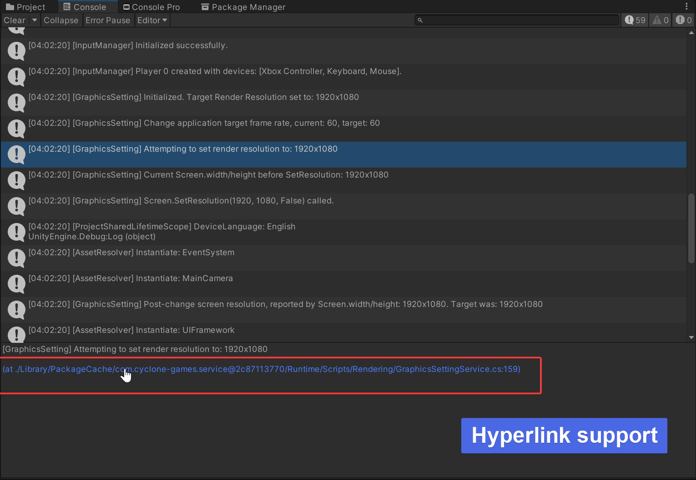
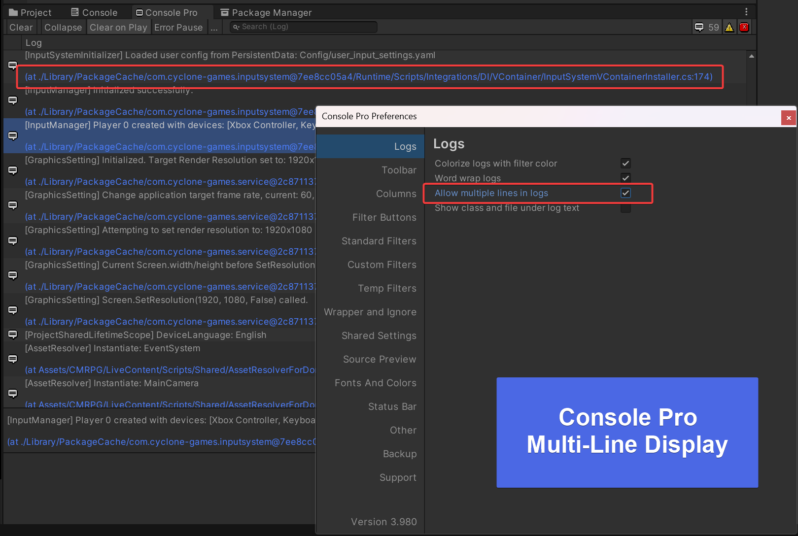
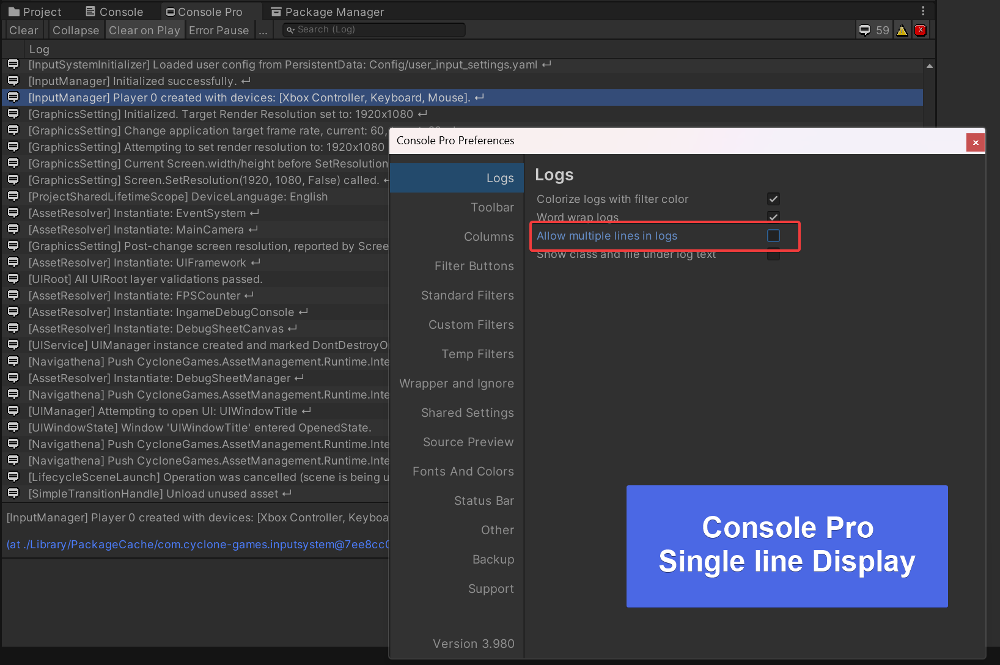

# CycloneGames.Logger

[English](README.md) | 简体中文

高性能、低/零 GC 的 Unity/.NET 日志模块，兼顾稳定与跨平台（Android、iOS、Windows、macOS、Linux、Web/WASM）。

## 功能特性

- **三级容量管理**：自适应对象池，支持自动扩充和收缩（Target/Peak/Max）
- **零 GC 日志**：Builder API 和池化对象消除热路径内存分配
- **跨平台处理**：线程化后台 worker 或单线程 Pump 处理策略
- **对象池监控**：统计 API 用于开发/调试（仅 Editor 和 Development 版本）
- **灵活过滤**：分类过滤（白名单/黑名单）和严重程度级别
- **Unity 集成**：Console 可点击跳转格式、自动引导
- **可选 FileLogger**：支持维护/轮转功能

## 快速开始（Unity）

默认引导在任意场景加载前自动运行：

- 自动检测平台并选择处理策略（WebGL -> 单线程；其他 -> 线程化）
- 默认注册 UnityLogger（可通过设置禁用）

立即开始记录日志：

```csharp
using CycloneGames.Logger;

void Start()
{
    CLogger.LogInfo("Hello from CycloneGames.Logger");
}
```

## Unity Console 集成

CLogger 在 Unity Editor Console 中提供可点击的超链接功能，方便快速跳转到源代码：

- **单击**超链接 `(at Assets/.../File.cs:27)` 即可在配置的代码编辑器中打开文件并跳转到对应行
- 超链接格式经过优化，在 Console 的单行预览中保持隐藏，使日志列表更加整洁



### Console Pro 用户

如果您使用 [Console Pro](https://assetstore.unity.com/packages/tools/utilities/console-pro-11889)，建议开启**单行显示模式**以获得更整洁的日志列表：

**多行模式：**



**单行模式（推荐）：**



> [!TIP]
> 单行模式会在日志列表中隐藏源代码位置超链接，减少视觉干扰，同时在选中日志条目时仍可使用点击跳转功能。

## 对象池架构

日志系统采用**三级自适应容量管理**，实现最优零 GC 性能：

```
Target容量        <- 正常稳态（StringBuilder为128，LogMessage为256）
     | 负载增加时自动扩充
Peak容量          <- 突发期间最大值（1024/4096）- 零GC！
     | 超出时异步收缩
Max容量           <- 硬上限（2048/8192）- 防止内存泄漏
```

**结果**：99.9%的场景下实现零 GC 操作，同时通过自动池收缩保证内存安全。

## 全局集中配置

可通过项目资源或代码集中配置。

### 使用 LoggerSettings 资源（推荐）

1. 创建资源：`Assets -> Create -> CycloneGames -> Logger -> LoggerSettings`
2. 放置到：`Assets/Resources/CycloneGames.Logger/LoggerSettings.asset`
   重要：不要重命名该资源或父目录；加载器期望路径为 `Resources/CycloneGames.Logger/LoggerSettings`。
3. 配置字段：
   - 处理策略：AutoDetect / ForceThreaded / ForceSingleThread
   - 注册：启用/禁用 UnityLogger、FileLogger
   - 文件 Logger：选择 persistentDataPath 或自定义文件路径/名称
   - 默认值：LogLevel 和 LogFilter

引导程序会在启动时自动加载此资源。

### 代码方式配置（高级）

在首次使用 `CLogger.Instance` 前调用：

```csharp
// 策略
CLogger.ConfigureThreadedProcessing();            // 支持线程的平台
// 或
CLogger.ConfigureSingleThreadedProcessing();      // Web/WASM（需要 Pump()）

// 注册后端
CLogger.Instance.AddLoggerUnique(new UnityLogger());
var path = System.IO.Path.Combine(Application.persistentDataPath, "App.log");
CLogger.Instance.AddLoggerUnique(new FileLogger(path));

// 默认值
CLogger.Instance.SetLogLevel(LogLevel.Info);
CLogger.Instance.SetLogFilter(LogFilter.LogAll);
```

## 日志 API

### 字符串重载（简单）

```csharp
CLogger.LogInfo("Connected", "Net");
CLogger.LogWarning("Low HP", "Gameplay");
```

### Builder 重载（零 GC）

```csharp
CLogger.LogDebug(sb => { sb.Append("PlayerId="); sb.Append(playerId); }, "Net");
CLogger.LogError(sb => { sb.Append("Err="); sb.Append(code); }, "Net");
```

### 带状态 Builder（高级，避免闭包分配）

```csharp
CLogger.LogInfo(player, (p, sb) =>
    sb.Append("玩家 ").Append(p.name).Append(" HP: ").Append(p.hp), "Combat");
```

## 对象池监控

在 Editor 或 Development 版本中监控池健康状况：

```csharp
#if UNITY_EDITOR || DEVELOPMENT_BUILD
var sbStats = CycloneGames.Logger.Util.StringBuilderPool.GetStatistics();
var msgStats = LogMessagePool.GetStatistics();

Debug.Log($@"
StringBuilder Pool - 当前: {sbStats.CurrentSize}, 峰值: {sbStats.PeakSize}
  命中率: {sbStats.HitRate:P}, 丢弃率: {sbStats.DiscardRate:P}

LogMessage Pool - 当前: {msgStats.CurrentSize}, 峰值: {msgStats.PeakSize}
  命中率: {msgStats.HitRate:P}, 丢弃率: {msgStats.DiscardRate:P}
");
#endif
```

**关键指标**：

- **PeakSize**：达到的最大池大小（应远低于 Max 容量）
- **DiscardRate**：应约为 0%以获得最佳性能
- **HitRate**：应约为 100%（从池中获取 vs 新分配）
- **TrimCount**：池自动收缩次数（验证收缩机制）

## WebGL 与 Pump()

- Web/WASM 不支持后台线程。引导程序会选择单线程模式，您应该定期调用 Pump()（例如，每帧一次）：

```csharp
void Update()
{
    CLogger.Instance.Pump(4096); // 限制每帧工作量
}
```

- 在线程化模式下 Pump() 为 no-op，因此可以在共享代码中无条件调用。

## FileLogger 配置与维护

基础用法：

```csharp
var path = System.IO.Path.Combine(Application.persistentDataPath, "App.log");
CLogger.Instance.AddLoggerUnique(new FileLogger(path));
```

轮转和预警（可选）：

```csharp
var options = new FileLoggerOptions
{
    MaintenanceMode = FileMaintenanceMode.Rotate, // 或 WarnOnly
    MaxFileBytes = 10 * 1024 * 1024,              // 10 MB
    MaxArchiveFiles = 5,                           // 保留最新5个
    ArchiveTimestampFormat = "yyyyMMdd_HHmmss"
};

var path = System.IO.Path.Combine(Application.persistentDataPath, "App.log");
CLogger.Instance.AddLoggerUnique(new FileLogger(path, options));
```

注意：

- WebGL 上避免使用 FileLogger（无文件系统）。引导程序默认不注册它。
- 在移动/主机平台，优先使用 persistentDataPath 以获得写权限。

## 过滤

```csharp
CLogger.Instance.SetLogLevel(LogLevel.Warning);        // 显示Warning及以上级别
CLogger.Instance.SetLogFilter(LogFilter.LogAll);

// 白名单 / 黑名单
CLogger.Instance.AddToWhiteList("Gameplay");
CLogger.Instance.SetLogFilter(LogFilter.LogWhiteList);
```

## 使用建议

**性能方面：**

- 在热路径中使用 Builder 重载实现零 GC
- 在开发期间监控 DiscardRate（应约为 0%）
- 设置适当的 LogLevel 以减少开销

**平台方面：**

- 为单线程处理调优 Pump(maxItems) 以适应帧预算
- 使用集中引导（设置资源或代码）避免重复注册

**质量方面：**

- 全局后端使用 AddLoggerUnique
- 专项后端使用 AddLogger（例如，基准文件）
- 在 Unity Editor 中，避免同时添加 ConsoleLogger 和 UnityLogger 以防止控制台重复条目

## 示例

查看 `/Samples` 文件夹：

- **LoggerPoolMonitor**：交互式池统计和突发测试
- **LoggerBenchmark**：性能对比与 GC 追踪
- **LoggerPerformanceTest**：大容量压力测试
- **LoggerSample**：基础使用示例

## 故障排查

**Unity Console 重复行**：  
如果在 Editor 中同时激活 ConsoleLogger 和 UnityLogger，Editor 可能会同时显示 stdout 和 Debug.Log。在 Editor 中跳过 ConsoleLogger 或仅保留 UnityLogger。

**无文件输出**：  
确保已添加 FileLogger（默认不注册）并且路径可写。

**池统计中 DiscardRate 高**：  
考虑在池源代码中增加 PeakPoolSize，或减少日志频率。

**内存持续增长**：  
在统计数据中验证 TrimCount > 0。池应该在突发后自动收缩。
