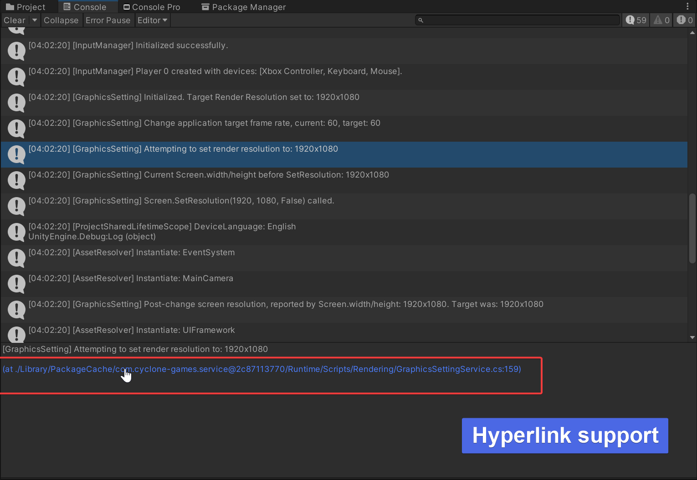
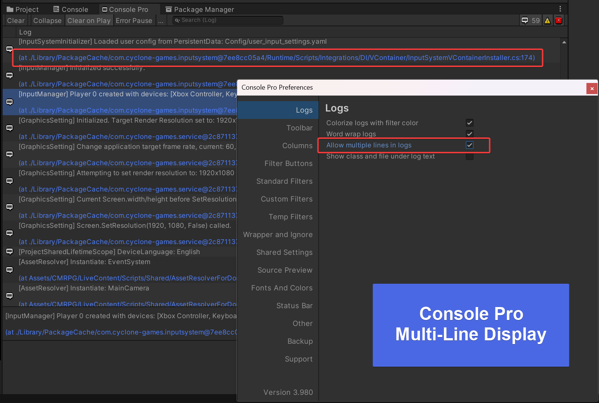
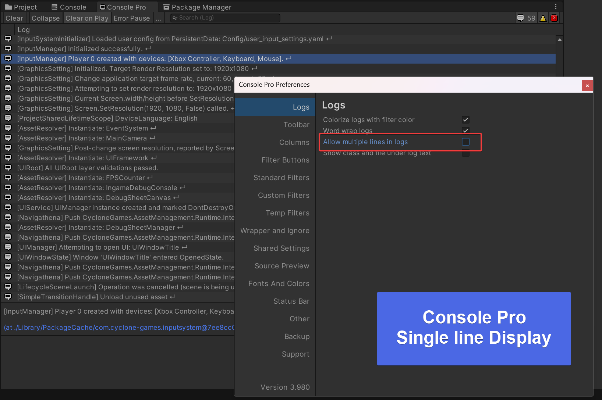

# CycloneGames.Logger

[English](README.md) | 简体中文

高性能、低/零 GC 的 Unity/.NET 日志模块，兼顾稳定与跨平台（Android、iOS、Windows、macOS、Linux、Web/WASM）。

## 功能特性

- **三级容量管理**：自适应对象池，支持自动扩充和收缩（Target/Peak/Max）
- **零 GC 日志**：Builder API 和池化对象消除热路径内存分配
- **跨平台处理**：线程化后台 worker 或单线程 Pump 处理策略
- **对象池监控**：统计 API 用于开发/调试（仅 Editor 和 Development 版本）
- **灵活过滤**：分类过滤（白名单/黑名单）和严重程度级别
- **Unity 集成**：Console 可点击跳转格式、自动引导
- **可选 FileLogger**：支持维护/轮转功能

## 快速开始（Unity）

默认引导在任意场景加载前自动运行：

- 自动检测平台并选择处理策略（WebGL -> 单线程；其他 -> 线程化）
- 默认注册 UnityLogger（可通过设置禁用）

立即开始记录日志：

```csharp
using CycloneGames.Logger;

void Start()
{
    CLogger.LogInfo("Hello from CycloneGames.Logger");
}
```

## Unity Console 集成

CLogger 在 Unity Editor Console 中提供可点击的超链接功能，方便快速跳转到源代码：

- **单击**超链接 `(at Assets/.../File.cs:27)` 即可在配置的代码编辑器中打开文件并跳转到对应行
- 超链接格式经过优化，在 Console 的单行预览中保持隐藏，使日志列表更加整洁



### Console Pro 用户

如果您使用 [Console Pro](https://assetstore.unity.com/packages/tools/utilities/console-pro-11889)，建议开启**单行显示模式**以获得更整洁的日志列表：

**多行模式：**



**单行模式（推荐）：**



> [!TIP]
> 单行模式会在日志列表中隐藏源代码位置超链接，减少视觉干扰，同时在选中日志条目时仍可使用点击跳转功能。

## 对象池架构

日志系统采用**三级自适应容量管理**，实现最优零 GC 性能：

```
Target容量        <- 正常稳态（StringBuilder为128，LogMessage为256）
     | 负载增加时自动扩充
Peak容量          <- 突发期间最大值（1024/4096）- 零GC！
     | 超出时异步收缩
Max容量           <- 硬上限（2048/8192）- 防止内存泄漏
```

**结果**：99.9%的场景下实现零 GC 操作，同时通过自动池收缩保证内存安全。

## 配置与打包教程

CLogger 有三层配置方式：项目默认使用 `LoggerSettings` 资源；CI 可以在单次构建中覆盖该资源；高级项目也可以完全通过代码注册输出端。

### 默认运行时行为

内置 `LoggerBootstrap` 会在首个场景加载前执行。

- 如果存在 `Assets/Resources/CycloneGames.Logger/LoggerSettings.asset`，运行时会自动加载它。
- 如果不存在 `LoggerSettings` 资源，默认注册 `UnityLogger`，因此 Editor 和 Player build 中 `CLogger.LogInfo(...)` 都能正常输出。
- Player build 不会因为 `DEVELOPMENT_BUILD` 自动关闭日志。正式包是否输出日志，由 `LoggerSettings`、构建命令行覆盖或 CI 环境变量决定。
- WebGL 使用单线程处理并跳过 `FileLogger`；其他平台默认使用线程化处理。

### 创建项目级 LoggerSettings

大多数项目推荐这样配置：

1. 使用 `Tools -> CycloneGames -> Logger -> Create Default LoggerSettings`。
2. 确认资源生成在 `Assets/Resources/CycloneGames.Logger/LoggerSettings.asset`。
3. 不要重命名 `LoggerSettings.asset` 或 `CycloneGames.Logger` 文件夹。运行时加载路径固定为 `Resources/CycloneGames.Logger/LoggerSettings`。

关键字段说明：

| 字段 | 作用 | 常用值 |
|------|------|--------|
| `processing` | 日志处理线程策略 | `AutoDetect` |
| `registerUnityLogger` | 输出到 `UnityEngine.Debug.*` / Unity Console | Editor/debug 包开启，低端正式包关闭 |
| `registerFileLogger` | 通过 `FileLogger` 写入文件 | Player 诊断包开启，WebGL 关闭 |
| `defaultLevel` | CLogger 接受的最低日志等级 | 开发期 `Info`，正式包 `Warning` 或 `Error` |
| `overflowPolicy` | 队列爆发超过容量时的处理方式 | `DropNewest`，优先保证帧稳定 |
| `guaranteedLevel` | 队列压力下仍尽量保留的日志等级 | `Error` |

### 推荐打包配置

可以先按下面的 profile 配置：

| 包类型 | UnityLogger | FileLogger | Level | 说明 |
|--------|-------------|------------|-------|------|
| Editor / 本地调试 | 开 | 可选 | `Info` | 方便 Console 跳转源码，适合日常开发 |
| QA / development Player | 开 | 开 | `Info` 或 `Warning` | 方便测试反馈，但避免高频刷 Unity Console |
| 低端正式 Player | 关 | 开 | `Warning` | 性能敏感平台推荐配置 |
| 静默正式 Player | 关 | 关 | 任意或 `Error` | 没有默认输出端时，static CLogger 调用会走低成本 no-op |
| WebGL | 开或关 | 关 | `Warning` | 不使用文件日志；单线程模式下需要每帧 `Pump()` |

高频运行时诊断优先使用 `FileLogger`，或直接通过日志等级过滤掉。不要把每帧大量日志输出到 Unity Console。

### 构建与 CI 覆盖

`CycloneGames.Logger.Editor` 内置 build processor，会读取 Unity 构建进程的同一组命令行参数。它可以在构建期间临时覆盖 `Assets/Resources/CycloneGames.Logger/LoggerSettings.asset`，构建完成后恢复项目中的资源。

这个设计保持了 `Build.Pipeline.Editor` 和 `CycloneGames.Logger` 的模块独立：Build 模块不引用 Logger 程序集，也不解析 Logger 专属参数；Logger 自己负责自己的构建集成。

常用命令行覆盖：

```text
-loggerMode File -loggerLevel Warning -loggerFileName Player.log
-loggerMode UnityAndFile -loggerLevel Info
-loggerMode Off
-loggerMode Settings
-loggerSettings Assets/Config/LoggerSettings.Release.asset
```

`-loggerMode` 可选值：

| 值 | 结果 |
|----|------|
| `Settings` | 使用项目资源，不应用 mode 覆盖 |
| `Off` | 同时关闭 UnityLogger 和 FileLogger |
| `Unity` | 只开启 UnityLogger |
| `File` | 只开启 FileLogger |
| `UnityAndFile` | 同时开启 UnityLogger 和 FileLogger |

Unity batchmode 示例：

```text
Unity.exe -batchmode -quit ^
  -projectPath "E:/Work/GitRepo/unity_starter/UnityStarter" ^
  -executeMethod Build.Pipeline.Editor.BuildScript.PerformBuild_CI ^
  -buildTarget Android ^
  -output "Builds/Android/Game.apk" ^
  -loggerMode File ^
  -loggerLevel Warning ^
  -loggerFileName Player.log
```

Windows、macOS、Linux、iOS 等平台同理，只要目标平台受项目构建脚本支持即可。

### CI 环境变量

如果 CI 系统更适合通过环境变量管理配置，可以使用：

```text
CG_LOGGER_SETTINGS=Assets/Config/LoggerSettings.Release.asset
CG_LOGGER_MODE=File
CG_LOGGER_UNITY=false
CG_LOGGER_FILE=true
CG_LOGGER_USE_PERSISTENT_DATA_PATH=true
CG_LOGGER_FILE_NAME=Player.log
CG_LOGGER_CUSTOM_FILE_PATH=
CG_LOGGER_LEVEL=Warning
CG_LOGGER_FILTER=LogAll
CG_LOGGER_PROCESSING=AutoDetect
CG_LOGGER_MAX_QUEUED_MESSAGES=8192
CG_LOGGER_UNITY_CONSOLE_MAX_QUEUED_MESSAGES=2048
CG_LOGGER_SHUTDOWN_DRAIN_TIMEOUT_MS=1000
CG_LOGGER_OVERFLOW_POLICY=DropNewest
CG_LOGGER_GUARANTEED_LEVEL=Error
```

优先级规则：

1. 命令行参数会覆盖同名环境变量。
2. 环境变量会在本次构建中覆盖项目资源。
3. `-loggerSettings` / `CG_LOGGER_SETTINGS` 会先加载一份 profile 资源，然后 `-loggerLevel`、`CG_LOGGER_FILE_NAME` 等单项配置再覆盖 profile 中的字段。
4. 如果没有任何 Logger 构建参数或 `CG_LOGGER_*` 环境变量，build processor 不做任何事。

不要在共享构建机器上设置全局 `CG_LOGGER_*` 环境变量。更推荐使用单个 pipeline/job 作用域的变量，避免一个构建任务意外影响另一个任务。

### 构建临时资源如何清理

如果 CI 覆盖需要 `LoggerSettings` 资源，而项目里原本没有这个资源，build processor 可能会在运行时加载路径下临时创建资源。

- 如果构建前资源已经存在，构建后会恢复原始 JSON 状态。
- 如果资源只为本次构建创建，构建后会删除它。
- 自动生成的 `.meta` 文件、空父目录以及父目录 `.meta` 会在 AssetDatabase 刷新后清理。
- 如果 Unity 在构建过程中异常退出，下次 Editor domain 加载时会根据备份自动恢复。

### 代码方式配置（高级）

在首次使用 `CLogger.Instance` 前调用：

```csharp
// 策略
CLogger.ConfigureThreadedProcessing();            // 支持线程的平台
// 或
CLogger.ConfigureSingleThreadedProcessing();      // Web/WASM（需要 Pump()）

// 注册后端
CLogger.Instance.AddLoggerUnique(new UnityLogger());
var path = System.IO.Path.Combine(Application.persistentDataPath, "App.log");
CLogger.Instance.AddLoggerUnique(new FileLogger(path));

// 默认值
CLogger.Instance.SetLogLevel(LogLevel.Info);
CLogger.Instance.SetLogFilter(LogFilter.LogAll);
```

## 日志 API

### 字符串重载（简单）

```csharp
CLogger.LogInfo("Connected", "Net");
CLogger.LogWarning("Low HP", "Gameplay");
```

### Builder 重载（低 GC）

```csharp
CLogger.LogDebug(sb => { sb.Append("PlayerId="); sb.Append(playerId); }, "Net");
CLogger.LogError(sb => { sb.Append("Err="); sb.Append(code); }, "Net");
```

> **注意**：如果 lambda 捕获了外部变量（例如 `playerId`），每次调用都会分配一个闭包对象。如需真正的零 GC，请使用下方的带状态 Builder。

### 带状态 Builder（零 GC，热路径推荐）

```csharp
CLogger.LogInfo(player, static (p, sb) =>
    sb.Append("玩家 ").Append(p.name).Append(" HP: ").Append(p.hp), "Combat");
```

`static` 关键字阻止编译器捕获任何外部变量，确保零闭包分配。

## 日志断言

使用 `CLogAssert` 可以把运行时不变量检查接入同一套日志管线。

`CLogAssert` 和单元测试断言不同：

- 可以在 Runtime 代码中使用。
- 可以只记录日志、只抛异常，或先记录日志再抛异常。
- 会保留调用点信息，因此失败日志仍能指向调用处。
- 断言成功时会在执行 message builder 前返回。
- 它由运行时配置控制，不依赖 `DEVELOPMENT_BUILD`。

基础用法：

```csharp
CLogAssert.IsTrue(player.IsAlive, "Player should be alive.", "Gameplay");
CLogAssert.IsNotNull(config, "Config must be loaded.", "Config");
CLogAssert.AreEqual(expectedState, currentState, "State mismatch.", "Net");
```

热路径友好的 builder 用法：

```csharp
CLogAssert.That(isValid, (entityId, systemName), static (state, sb) =>
{
    sb.Append("Invalid entity. EntityId=");
    sb.Append(state.entityId);
    sb.Append(", System=");
    sb.Append(state.systemName);
}, "Gameplay");
```

配置失败行为：

```csharp
CLogAssert.Configure(new CLogAssertOptions
{
    Enabled = true,
    FailureLevel = LogLevel.Error,
    FailureBehavior = CLogAssertFailureBehavior.LogOnly,
    Category = "Assert"
});
```

可选失败行为：

| 行为 | 结果 |
|------|------|
| `LogOnly` | 记录失败日志，然后继续运行 |
| `Throw` | 抛出 `CLogAssertionException`，不记录日志 |
| `LogAndThrow` | 先记录日志，再抛出 `CLogAssertionException` |

DI 友好用法：

```csharp
ICLogger logger = CLoggerFactory.CreateSingleThreaded();
ICLogAssert logAssert = new CLogAssertService(logger, new CLogAssertOptions
{
    FailureLevel = LogLevel.Warning,
    FailureBehavior = CLogAssertFailureBehavior.LogOnly
});

logAssert.AreEqual(10, currentCount, "Unexpected count.", "Inventory");
```

使用建议：

- 用 `CLogAssert` 检查理论上不应发生的状态、错误生命周期顺序和数据完整性问题。
- 不要用它替代单元测试。
- 公开正式包中除非是不可恢复错误，否则不要配置为抛异常。
- 断言消息中不要写入密钥、token、账号凭据等敏感信息。
- 高频检查使用 `static` builder 传入状态，不要使用字符串插值。

## 对象池监控

在 Editor 或 Development 版本中监控池健康状况：

```csharp
#if UNITY_EDITOR || DEVELOPMENT_BUILD
var sbStats = CycloneGames.Logger.Util.StringBuilderPool.GetStatistics();
var msgStats = LogMessagePool.GetStatistics();

Debug.Log($@"
StringBuilder Pool - 当前: {sbStats.CurrentSize}, 峰值: {sbStats.PeakSize}
  命中率: {sbStats.HitRate:P}, 未命中: {sbStats.TotalMisses}, 丢弃率: {sbStats.DiscardRate:P}

LogMessage Pool - 当前: {msgStats.CurrentSize}, 峰值: {msgStats.PeakSize}
  命中率: {msgStats.HitRate:P}, 未命中: {msgStats.TotalMisses}, 丢弃率: {msgStats.DiscardRate:P}
");
#endif
```

**关键指标**：

- **HitRate**：应约为 100%（从池中获取 vs 新分配）
- **TotalMisses**：因池空而执行 `new` 分配的次数；预热后应约为 0
- **PeakSize**：达到的最大池大小（应远低于 Max 容量）
- **DiscardRate**：应约为 0%以获得最佳性能
- **TrimCount**：池自动收缩次数（验证收缩机制）

## WebGL 与 Pump()

- Web/WASM 不支持后台线程。引导程序会选择单线程模式，您应该定期调用 Pump()（例如，每帧一次）：

```csharp
void Update()
{
    CLogger.Instance.Pump(4096); // 限制每帧工作量
}
```

- 在线程化模式下 Pump() 为 no-op，因此可以在共享代码中无条件调用。

## FileLogger 配置与维护

基础用法：

```csharp
var path = System.IO.Path.Combine(Application.persistentDataPath, "App.log");
CLogger.Instance.AddLoggerUnique(new FileLogger(path));
```

轮转和预警（可选）：

```csharp
var options = new FileLoggerOptions
{
    MaintenanceMode = FileMaintenanceMode.Rotate, // 或 WarnOnly
    MaxFileBytes = 10 * 1024 * 1024,              // 10 MB
    MaxArchiveFiles = 5,                           // 保留最新5个
    ArchiveTimestampFormat = "yyyyMMdd_HHmmss",
    FlushBatchSize = 64,                           // 每 N 次写入刷盘
    FlushIntervalMs = 1000                         // 或每 1 秒刷盘
};

var path = System.IO.Path.Combine(Application.persistentDataPath, "App.log");
CLogger.Instance.AddLoggerUnique(new FileLogger(path, options));
```

刷盘策略：写入会被批量处理以提高 I/O 吞吐量。Error/Fatal 级别的消息始终立即刷盘，不受批量设置影响。

注意：

- WebGL 上避免使用 FileLogger（无文件系统）。引导程序默认不注册它。
- 在移动/主机平台，优先使用 persistentDataPath 以获得写权限。

## 过滤

```csharp
CLogger.Instance.SetLogLevel(LogLevel.Warning);        // 显示Warning及以上级别
CLogger.Instance.SetLogFilter(LogFilter.LogAll);

// 白名单 / 黑名单
CLogger.Instance.AddToWhiteList("Gameplay");
CLogger.Instance.SetLogFilter(LogFilter.LogWhiteList);
```

## 打包检查清单

发布 Player build 前建议逐项确认：

- 先决定这个包是否需要日志。静默包使用 `-loggerMode Off`。
- 低端平台优先使用 `-loggerMode File -loggerLevel Warning`，不要把高频日志输出到 Unity Console。
- 除非这个包专门用于调试，否则高频正式包建议 `registerUnityLogger=false`。
- 除非平台负责人确认了自定义可写路径，否则保持 `usePersistentDataPath=true`。
- 正式包建议 `defaultLevel=Warning` 或 `Error`，不要在公开包里使用 `Trace` / `Debug`。
- 对帧稳定要求高的包，建议保持 `overflowPolicy=DropNewest` 和 `guaranteedLevel=Error`。
- WebGL 不要期望文件日志；使用 Unity console / 浏览器诊断，并定期调用 `Pump()`。
- CI 中优先使用 job 作用域的 `CG_LOGGER_*` 环境变量或显式 `-logger...` 参数，避免机器全局环境变量残留。

## 使用建议

**Runtime 性能：**

- 热路径使用带状态的 generic builder API：

```csharp
CLogger.LogInfo(playerId, static (id, sb) =>
{
    sb.Append("PlayerId=");
    sb.Append(id);
}, "Gameplay");
```

- 热路径避免字符串插值，因为字符串会在 CLogger 过滤前就被创建。
- 热路径避免捕获 lambda。`static` lambda 可以防止闭包分配。
- 不要把高频日志输出到 Unity Console；优先使用等级过滤或 `FileLogger`。
- 开发期间监控 `DiscardRate`，正常负载下应接近 `0%`。
- 压测前设置合适的 `LogLevel`。过滤是最便宜的优化。

**平台方面：**

- 为单线程处理调优 Pump(maxItems) 以适应帧预算
- 使用集中引导（设置资源或代码）避免重复注册
- 移动端和主机平台的 Player 文件日志优先使用 `persistentDataPath`
- 单独对待 WebGL：没有后台 worker，也没有常规文件输出

**质量方面：**

- 全局后端使用 AddLoggerUnique
- 专项后端使用 AddLogger（例如，基准文件）
- 在 Unity Editor 中，避免同时添加 ConsoleLogger 和 UnityLogger 以防止控制台重复条目
- 把构建期 Logger 控制放在 CI 参数或环境变量中，不要为了不同包手动反复修改资源
- Logger 构建集成保持在 Logger 模块内；Build pipeline 代码不需要直接依赖 Logger

## 示例

查看 `/Samples` 文件夹：

- **LoggerPoolMonitor**：交互式池统计和突发测试
- **LoggerBenchmark**：性能对比与 GC 追踪
- **LoggerPerformanceTest**：大容量压力测试
- **LoggerSample**：基础使用示例

## 故障排查

**Unity Console 重复行**：  
如果在 Editor 中同时激活 ConsoleLogger 和 UnityLogger，Editor 可能会同时显示 stdout 和 Debug.Log。在 Editor 中跳过 ConsoleLogger 或仅保留 UnityLogger。

**无文件输出**：  
确保已添加 FileLogger（默认不注册）并且路径可写。

**CI 构建出来的日志行为不符合预期**：
先检查 `-logger...` 命令行参数，再检查 job 作用域的 `CG_LOGGER_*` 环境变量，最后检查机器全局环境变量。命令行参数优先级最高。

**构建后出现 LoggerSettings.asset**：
如果它只是构建覆盖临时创建的资源，build processor 会在构建后恢复或删除。若 Unity 在构建中被强制关闭，重新打开一次 Editor，让 stale backup 自动恢复逻辑执行。

**正式包性能不符合预期**：
确认高频日志没有开启 `UnityLogger`。`CLogger + UnityLogger` 仍会调用 `UnityEngine.Debug.*`，最终成本主要来自 Unity Console / player log 输出。

**池统计中 DiscardRate 高**：  
考虑在池源代码中增加 PeakPoolSize，或减少日志频率。

**内存持续增长**：  
在统计数据中验证 TrimCount > 0。池应该在突发后自动收缩。
