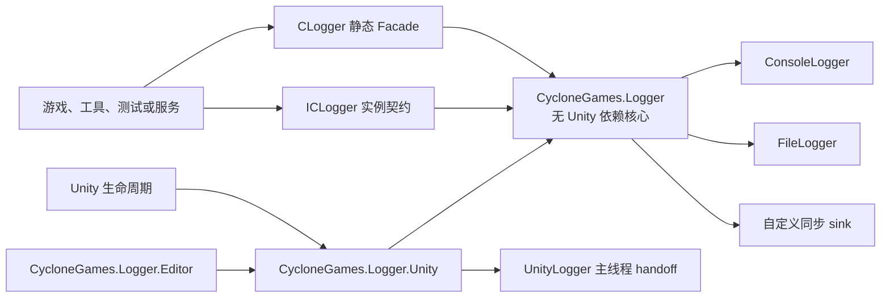
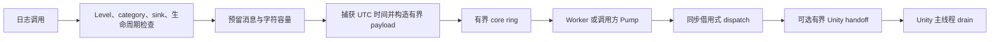

# CycloneGames.Logger

CycloneGames.Logger 是面向 Unity 应用、Unity Headless Player、命令行工具、测试和纯 C# 服务的有界、可观测日志底座。它提供无 Unity 依赖的核心、可选 Unity adapter、显式队列与内存预算、失败隔离 sink、具备恢复能力的文件输出，以及可以被监控而不是被假设成功的生命周期结果。

本指南从最短可运行接入开始，再逐步介绍配置、所有权、高吞吐用法、自定义 sink、失败恢复、内存行为、平台与验证。默认值是安全起点，不是适用于所有产品的生产预算。每个产品都应根据自身负载与目标硬件进行测量和调整。

## 模块提供什么

当应用需要比直接调用 `Debug.Log` 更强的控制能力时，可以使用 CycloneGames.Logger：

- 在构造延迟消息前执行 severity 和 category 过滤；
- 同时受消息数与保留字符数限制的有界队列；
- 后台 worker 模式与调用方主动 `Pump` 的模式；
- 多个同步 sink，以及按 sink 隔离的失败 quarantine；
- `UnityLogger`、`ConsoleLogger` 和 `FileLogger` adapter；
- 有界文件轮转、恢复尝试、flush 模式和健康统计；
- 显式 sink 所有权、flush、shutdown 与 disposal 行为；
- 队列、丢弃、失败、Unity handoff、文件与缓存统计；
- 静态与可注入断言 API；
- Unity 项目设置、自定义 Inspector 和隔离的构建期覆盖。

有限队列不能提供消息必达。本模块也不提供自动脱敏、加密、远程上传、服务端确认、事务审计存储或主机平台 SDK 集成。支付、账号、反作弊、合规和安全审计记录需要单独评审的持久化管线。没有产品负责的数据政策时，禁止记录 credential、token、个人数据或未经脱敏的用户内容。

## 五分钟完成 Unity 接入

### 1. 创建设置资产

在 Unity 中选择：

`Tools > CycloneGames > Logger > Create Default LoggerSettings`

该命令在以下路径创建项目设置资产：

`Assets/Resources/CycloneGames.Logger/LoggerSettings.asset`

默认配置注册 `UnityLogger`，接受 `Info` 及以上级别，允许所有 category，并在 WebGL Player 之外选择 threaded processing。

### 2. 校验资产

选择该资产，在自定义 Inspector 中点击 `Validate Settings`。无效容量、不受支持的 Unity Console policy 和不安全文件路径会在进入构建前被拒绝。

### 3. 写入日志

```csharp
using CycloneGames.Logger;
using UnityEngine;

public sealed class InventoryController : MonoBehaviour
{
    private void Start()
    {
        CLogger.LogInfo("Inventory initialized.", "Inventory");
    }

    public void ReportLoadFailure(string itemId)
    {
        CLogger.LogError(
            itemId,
            static (value, builder) => builder.Append("Failed to load item: ").Append(value),
            "Inventory");
    }
}
```

`LoggerBootstrap` 在第一个 Scene 之前运行。它加载设置资产、创建 runtime host、注册所选 sink，并应用默认 level 和 filter。应用暂停时请求 buffered flush；应用退出时封闭新的全局 producer，在配置 timeout 允许范围内排空已接受工作，并对 Unity Console 执行 best-effort drain。

如果没有任何 sink 能够注册，静态日志会被抑制，也不会创建未配置的全局实例。

## 五分钟完成纯 C# 或服务器接入

核心程序集设置了 `noEngineReferences: true`，可以在没有 `UnityEngine` 的环境中使用。

```csharp
using CycloneGames.Logger;

var options = new LoggerProcessingOptions
{
    MaxQueuedMessages = 2048,
    MaxQueuedCharacters = 1024 * 1024,
    OverflowPolicy = LogQueueOverflowPolicy.DropNewest,
    CriticalLevel = LogLevel.Error
};

CLogger logger = CLoggerFactory.CreateThreaded(options);
logger.AddLoggerUnique(new ConsoleLogger());

logger.Log(LogLevel.Info, "Service started.", "Bootstrap");

LoggerShutdownResult result = logger.ShutdownInstance(LogFlushMode.Buffered, 2000);
if (result.IsComplete)
{
    logger.Dispose();
}
else
{
    // Keep the instance, release the blocked external dependency, and retry shutdown.
}
```

宿主必须控制 dispatch affinity 时，使用 `CLoggerFactory.CreateSingleThreaded`，并从宿主 update loop 调用 `Pump`：

```csharp
ICLogger logger = CLoggerFactory.CreateSingleThreaded(options);

// Called by the host update loop.
logger.Pump(maxItems: 256);
```

向领域服务注入 `ICLogger`。Composition root 拥有具体 `CLogger`、sink 和最终 shutdown。领域代码不应通过 Service Locator 解析 `CLogger.Instance`。

## 架构与目录结构


```mermaid
flowchart LR
    Product["游戏、工具、测试或服务"] --> Facade["CLogger 静态 Facade"]
    Product --> Contract["ICLogger 实例契约"]
    Facade --> Core["CycloneGames.Logger<br/>无 Unity 依赖核心"]
    Contract --> Core
    UnityHost["Unity 生命周期"] --> UnityAdapter["CycloneGames.Logger.Unity"]
    UnityAdapter --> Core
    Editor["CycloneGames.Logger.Editor"] --> UnityAdapter
    Core --> Console["ConsoleLogger"]
    Core --> File["FileLogger"]
    Core --> Custom["自定义同步 sink"]
    UnityAdapter --> UnityConsole["UnityLogger 主线程 handoff"]
```

| 程序集 | 职责 | Unity 依赖 | 引用行为 |
| --- | --- | --- | --- |
| `CycloneGames.Logger` | 核心契约、处理、过滤、断言、`ConsoleLogger` 和 `FileLogger` | 无 | 自动引用；可复用 asmdef 应显式引用 |
| `CycloneGames.Logger.Unity` | `LoggerBootstrap`、`LoggerSettings`、`UnityLogger` 和 Unity 生命周期宿主 | `UnityEngine` | 自动引用；直接使用 Unity adapter 类型时应显式引用 |
| `CycloneGames.Logger.Editor` | 设置 Inspector、源码超链接和构建覆盖处理 | `UnityEditor` | 仅 Editor |
| `CycloneGames.Logger.Samples` | 可选用法与本地诊断示例 | Unity adapter | `autoReferenced: false` |
| `CycloneGames.Logger.Tests.Editor` | 功能与可靠性测试 | Unity Test Framework | 仅 Editor |
| `CycloneGames.Logger.Tests.Performance` | 性能 case 与稳态分配断言 | Performance Test Framework | 仅 Editor |

包目录布局如下：

```text
CycloneGames.Logger/
  Runtime/Scripts/          纯 C# 核心与内置非 Unity sink
  Runtime/Scripts/Unity/    Unity adapter 与设置 bridge
  Editor/                   Inspector、源码链接、构建覆盖
  Tests/Editor/             契约与可靠性测试
  Tests/Performance/        可复现本地性能 case
  Samples/                  隔离的 sample scene 与 component
  README.md                 英文指南
  README.SCH.md             简体中文指南
```

核心 public 契约不暴露 `GameObject`、`MonoBehaviour`、`ScriptableObject` 或其他 `UnityEngine` 类型。Unity 专属行为留在 adapter 程序集中。

## 核心心智模型

每条被接受的记录都经过相同的有界管线：


```mermaid
flowchart LR
    Call["日志调用"] --> Gate["Level、category、sink、生命周期检查"]
    Gate --> Reserve["预留消息与字符容量"]
    Reserve --> Build["捕获 UTC 时间并构造有界 payload"]
    Build --> Queue["有界 core ring"]
    Queue --> Processor["Worker 或调用方 Pump"]
    Processor --> Sinks["同步借用式 dispatch"]
    Sinks --> UnityQueue["可选有界 Unity handoff"]
    UnityQueue --> MainThread["Unity 主线程 drain"]
```

由此产生以下重要行为：

- 延迟 builder 执行前，会先检查过滤与 sink 可用性；
- 消息数与保留字符预算同时计入 queued、reserved 和 in-flight 工作；
- sink 调用是同步操作，timeout 无法抢占它；
- sink 只能借用 `LogMessage` 到 `ILogger.Log` 返回；
- Unity Console 使用第二个有界队列，因为 Unity API 要求主线程；
- 丢弃、失败和未完成 shutdown 均可观测，必须由产品 policy 处理。

## 日志 API

### 级别

Level 按严重程度从低到高排列：

`Trace`、`Debug`、`Info`、`Warning`、`Error`、`Fatal`、`None`

`SetLogLevel(LogLevel.Warning)` 会过滤 `Trace`、`Debug` 和 `Info`。`None` 禁用所有可接受日志级别。

```csharp
CLogger.Instance.SetLogLevel(LogLevel.Warning);

CLogger.LogInfo("Filtered.", "Loading");
CLogger.LogError("Accepted.", "Loading");
```

### 简单字符串

值已经存在或调用属于冷路径时，直接使用 string：

```csharp
CLogger.LogInfo("Matchmaking connected.", "Networking");
CLogger.LogWarning("Retry budget is low.", "Networking");
CLogger.LogError("Profile load failed.", "Save");
```

字符串插值发生在 logger 过滤之前：

```csharp
// The string is created before LogDebug checks the active level.
CLogger.LogDebug($"Entity {entityId} moved to {position}.", "Simulation");
```

### 延迟 builder

Builder callback 只在 admission 成功后运行：

```csharp
CLogger.LogDebug(
    builder => builder.Append("Entity ").Append(entityId).Append(" updated."),
    "Simulation");
```

捕获变量的 callback 可能分配 closure。它适合冷路径诊断，或经过 profiling 后确认可接受的路径。

### State 与缓存 builder

对已经测量的热路径，单独传递 state 并缓存 delegate：

```csharp
using System;
using System.Text;
using CycloneGames.Logger;

public static class CombatLog
{
    private static readonly Action<HitState, StringBuilder> AppendHit = AppendHitMessage;

    public static void Hit(int attackerId, int targetId, int damage)
    {
        CLogger.LogDebug(
            new HitState(attackerId, targetId, damage),
            AppendHit,
            "Combat");
    }

    private static void AppendHitMessage(HitState state, StringBuilder builder)
    {
        builder.Append("Attacker ").Append(state.AttackerId)
            .Append(" hit target ").Append(state.TargetId)
            .Append(" for ").Append(state.Damage).Append('.');
    }

    private readonly struct HitState
    {
        public readonly int AttackerId;
        public readonly int TargetId;
        public readonly int Damage;

        public HitState(int attackerId, int targetId, int damage)
        {
            AttackerId = attackerId;
            TargetId = targetId;
            Damage = damage;
        }
    }
}
```

该形式避免示例调用点产生 capturing closure，但它不是全局零分配承诺。Pool miss、builder 扩容、调用方 state、sink、异常和平台 I/O 仍可能分配。

### Builder 失败行为

已获准 builder 抛出非 `OutOfMemoryException` 时，异常不会逃逸到日志调用方。Logger 会：

1. 增加 `MessageBuilderFailureCount`；
2. 清空不完整消息；
3. 通过正常队列提交有界 `[log message builder failed: ExceptionType]` 记录；
4. 每个 logger 实例只为第一次 builder failure 输出 emergency diagnostic。

`OutOfMemoryException` 会传播。Reservation 与临时 pooled builder 仍由 `finally` 路径释放。

### 调用方信息

API 默认捕获 `CallerFilePath`、`CallerLineNumber` 和 `CallerMemberName`。File 与 Console sink 默认只输出文件名。`FullPath` 可能暴露构建机目录，只有在明确隐私 policy 下才能启用。

## Category 过滤

Category 匹配不区分大小写。

```csharp
ICLogger logger = CLogger.Instance;

logger.SetLogFilter(LogFilter.LogWhiteList);
logger.AddToWhiteList("Networking");
logger.AddToWhiteList("Save");

// Or accept everything except selected noisy categories.
logger.SetLogFilter(LogFilter.LogNoBlackList);
logger.AddToBlackList("AnimationTrace");
```

| Filter | 行为 |
| --- | --- |
| `LogAll` | 接受所有 category，包括空 category |
| `LogWhiteList` | 只接受已列出的 category；拒绝空 category |
| `LogNoBlackList` | 接受空 category 和所有未列入 blacklist 的 category |

Whitelist 与 blacklist 更新会复制相应集合。应把 mutation 视为初始化或配置工作，不能逐帧执行。两个集合共享 `MaxFilterCategories` 与 `MaxFilterCharacters`。Key 过长会抛 `ArgumentOutOfRangeException`；共享预算耗尽会抛 `InvalidOperationException`。两种失败都不会发布部分 filter snapshot。

在非 `LogAll` 模式中，长度超过 `MaxCategoryCharacters` 的 runtime category 会在 lookup 前 fail-closed，不会被截断成另一个 category key。

## 处理模式与线程

### Threaded

`CLoggerFactory.CreateThreaded` 以及受支持非 WebGL 目标上的 Unity `AutoDetect` 使用一个名为 `CLogger.Worker` 的后台线程。Producer 向同步有界 ring 预留并提交，worker 串行 dispatch 记录并执行周期性 sink maintenance。该模式下 `Pump` 不执行工作。

当 sink 可安全运行在 worker 上，且宿主可以承担一个 managed thread 时，threaded processing 适合一般 Unity client、桌面工具和服务。

### Single-threaded

`CreateSingleThreaded` 只在调用 `Pump` 时 dispatch。调用 `Pump` 的线程会执行该 batch 中所有 sink。

适用情景包括：

- WebGL 不具备所需线程模型；
- 宿主拥有确定的 dispatch affinity；
- 测试需要显式推进；
- 主线程集成没有使用 handoff adapter，而是直接执行。

Unity runtime host 每帧最多 pump 256 条 core record，并使用约 1 ms 的 between-item budget；Unity Console 独立最多 drain 256 条并使用约 2 ms 的 between-item budget。预算只在每个同步 item 返回后检查，因此一个阻塞 sink 可以突破预算。

### 有意义的线程安全

核心队列、registration snapshot、统计和内置 sink 会保护真实并发路径。自定义 sink 必须线程安全，因为 threaded processing 可以从 worker 调用它，而生命周期操作可能发生在其他线程。线程安全不意味着可以在 `ILogger.Log` 中执行阻塞网络请求、压缩、上传或无界文件工作。这类工作必须放在单独拥有的有界 adapter queue 后面。

## 队列容量与背压

核心队列同时施加两个限制：

- `MaxQueuedMessages`：queued + reserved + in-flight record 数量；
- `MaxQueuedCharacters`：queued + reserved + in-flight logger-owned 保留字符数。

字符限制是逻辑保留预算，不是精确 managed heap bytes。它包括有界消息和 metadata，但不包括 object header、array、调用方拥有的 string、callback 临时数据、sink buffer、native buffer 和操作系统 cache。

`MaxMessageCharacters` 会截断正文，并在格式化时追加 ` [truncated]`。Category、source path 和 member name 只复制到各自配置上限。

| Overflow policy | 容量满时的行为 | 注意事项 |
| --- | --- | --- |
| `DropNewest` | 拒绝传入记录 | Producer latency 稳定；可能丢失最新上下文 |
| `DropOldest` | 驱逐一个符合条件的 queued record | 保留较新上下文；过载时可能扫描并移动 entry |
| `Block` | 等待到 `EnqueueBlockTimeoutMs`，随后拒绝 | 可能阻塞调用方；避免用于 Unity 主线程和延迟敏感线程 |

Builder admission 在执行调用方代码前，会按最坏情况预留有界正文和 metadata。它在 `DropOldest` 下也不执行驱逐；reservation 不能立即容纳时，builder 不会运行，记录计为 `DroppedNewest`。String overload 因为 admission 前已知 retained size，可以使用 `DropOldest`。

### Critical reserve

`ReservedCriticalMessages` 和 `ReservedCriticalCharacters` 会保留部分容量，不允许低于 `CriticalLevel` 的记录使用。Critical record 可以使用完整队列，并在 policy 允许时优先驱逐非 critical record。

这是过载保护，不是消息必达。队列被 critical 工作占满、sink 阻塞、存储失败、shutdown 超时或进程终止时，critical record 仍可能丢失。

## Sink 与所有权

内置 sink：

| Sink | 目标宿主 | 执行与存储行为 |
| --- | --- | --- |
| `UnityLogger` | Unity client/Editor | 在借用 dispatch 中格式化，复制到有界 handoff，再从 Unity 主线程输出 |
| `ConsoleLogger` | CLI、headless 进程、Dedicated Server | 同步写入；低级别到 `Console.Out`，`Error`/`Fatal` 到 `Console.Error` |
| `FileLogger` | 支持且可写文件系统的目标 | 同步格式化 UTF-8 文本，在配置限制内轮转并报告健康状态 |

### 注册规则

- `AddLogger` 返回 `true` 时，该精确 sink 实例的所有权转移给 `CLogger`。
- `AddLogger` 返回 `false` 时没有建立新的所有权转移。它也可能表示同一 identity 已由 logger 拥有，因此不能只因为返回 `false` 就 Dispose。
- `AddLoggerUnique` 对同一精确 runtime type 最多接受一个。被拒绝的另一实例会在返回前 Dispose；重复引用不会 Dispose。
- `RemoveLogger` 不会 Dispose。只有 `true` 表示 dispatch 已静止，所有权转回该调用方。`false` 时绝不能 Dispose；解除 timeout 原因后重试。
- `ClearLoggers` retire 所有 active sink，并在静止后调度 logger-owned disposal。
- 每个 `CLogger` 对 active、retired、queued-for-disposal 或 disposing sink 的总拥有数量上限为 256。

Disposal 由每个 logger 一个惰性创建的 owner 串行执行。非 WebGL 目标使用 `CLogger.SinkDisposal` 后台 worker，WebGL 使用同步路径。普通自定义 sink 只执行一次 `Dispose` attempt。只有在较早 `Dispose` 中途抛异常后重试仍安全时，才能实现 `IIdempotentLoggerSinkDisposal`；marked sink 最多尝试三次。

## 编写自定义 Sink

`ILogger.Log(LogMessage)` 是同步 borrowed-payload 契约。只能在调用期间读取 payload，并通过 `AppendMessageTo` 使用正文；不得保留 `LogMessage` 或任何内部 pooled storage。

以下固定容量的近期消息 sink 使用了有明确用途的同步，因为 worker dispatch 与 UI 读取可能发生在不同线程。容量满时覆盖最早复制的 string，因此 retained entry 数量有界。

```csharp
using System;
using System.Text;
using CycloneGames.Logger;

public sealed class RecentLogSink : ILogger
{
    private readonly object _syncRoot = new object();
    private readonly string[] _entries;
    private readonly StringBuilder _scratch = new StringBuilder(256);
    private int _next;
    private bool _disposed;

    public RecentLogSink(int capacity)
    {
        if (capacity < 1)
        {
            throw new ArgumentOutOfRangeException(nameof(capacity));
        }

        _entries = new string[capacity];
    }

    public void Log(LogMessage message)
    {
        if (message == null)
        {
            throw new ArgumentNullException(nameof(message));
        }

        lock (_syncRoot)
        {
            if (_disposed)
            {
                return;
            }

            _scratch.Clear();
            message.AppendMessageTo(_scratch, escapeControlCharacters: true);
            _entries[_next] = _scratch.ToString();
            _next = (_next + 1) % _entries.Length;
        }
    }

    public void Dispose()
    {
        lock (_syncRoot)
        {
            if (_disposed)
            {
                return;
            }

            _disposed = true;
            Array.Clear(_entries, 0, _entries.Length);
            _scratch.Clear();
        }
    }
}
```

该示例限制了 entry 数，但每条被接受记录仍会分配一个复制后的 string。异步、远程或主线程 adapter 还需要 retained character/byte 预算、overflow policy、drop counter、线程亲和规则、flush 语义和显式 shutdown 所有权。

## 生命周期、Flush 与 Shutdown

### 全局 Logger

在 Unity bootstrap 之外，应在 `CLogger.Instance` 或第一条被接受的静态日志之前配置全局 processing：

```csharp
CLogger.ConfigureThreadedProcessing(options);
CLogger.ConfigureTimestampProvider(static () => DateTime.UtcNow);

ICLogger logger = CLogger.Instance;
```

全局实例存在后，processing 配置会返回 `false`。全局实例只能通过以下 API 停止：

```csharp
LoggerShutdownResult result = CLogger.Shutdown(LogFlushMode.Buffered);
```

对 `CLogger.Instance` 调用 `ShutdownInstance` 会抛异常，因为静态 shutdown 负责全局 detach 与重试协调。

### 显式 Logger

Factory 创建的 logger 使用：

```csharp
LoggerShutdownResult result = logger.ShutdownInstance(LogFlushMode.Durable, 5000);
```

Shutdown 超时时，应保留实例，释放或修复阻塞的外部依赖，然后重试。Timeout 不表示所有权已经完成。

### Flush 模式

| 模式 | 请求 |
| --- | --- |
| `Buffered` | 排空 core 工作并 flush managed sink buffer |
| `Durable` | 另外请求有能力的 sink 执行操作系统 durable flush |

`Durable` 不保证断电、控制器 cache、浏览器 storage 或远端 acknowledgement。

`TryFlush` 等待 core processing、active dispatch 和 logger-owned sink disposal，再调用 `IFlushableLogger` sink。Timeout 在同步操作之间检查，无法 cancel 已经阻塞的 `ILogger.Log`、`TryFlush`、`Dispose`、Console 调用或文件系统调用。

### Shutdown 结果

| 状态 | 含义 |
| --- | --- |
| `Completed` | Processing 与所请求 flush 完成，未观察到 drop 或终态失败 |
| `CompletedWithDrops` | Shutdown 完成，但 logger 观察到记录丢弃 |
| `CompletedWithFailures` | Shutdown 完成，但存在 sink flush 或 disposal 失败 |
| `TimedOut` | 工作或所有权仍未完成；保留实例并重试 |
| `AlreadyStopped` | 实例已经停止 |

对于 completed-with-drops 和 completed-with-failures，`IsComplete` 也为 `true`。必须同时检查 `Status`、`DroppedMessageCount` 和 `SinksFlushed`。

## 文件日志

### Unity 设置

启用 `registerFileLogger`。安全默认路径为：

`Application.persistentDataPath/App.log`

`fileName` 只能使用可移植 leaf name。自定义路径必须同时满足：

- `usePersistentDataPath = false`；
- `allowCustomFilePath = true`；
- `customFilePath` 是 fully qualified absolute path；
- 已在目标平台验证 sandbox、permission、quota、backup、可移动存储和 shutdown。

### 显式构造

```csharp
var fileOptions = new FileLoggerOptions
{
    MaintenanceMode = FileMaintenanceMode.Rotate,
    MaxFileBytes = 10L * 1024L * 1024L,
    MaxArchiveFiles = 5,
    FlushBatchSize = 64,
    FlushIntervalMs = 1000,
    DurableFlushOnFatal = false,
    SourcePathMode = LogSourcePathMode.FileName
};

var fileSink = new FileLogger(logPath, fileOptions);
logger.AddLoggerUnique(fileSink);
```

`FileLogger` 写入 UTF-8 without BOM。它会转义 message、category 和 source field 中的控制字符，避免一个 event 注入任意物理行。`Error` 与 `Fatal` 会触发 flush；启用 `DurableFlushOnFatal` 后，`Fatal` 请求 durable flush。

### 文件选项

| 字段 | 默认值 | 含义 |
| --- | ---: | --- |
| `MaintenanceMode` | `Rotate` | `None`、只在阈值处告警的 `WarnOnly`，或有界 `Rotate` |
| `MaxFileBytes` | 10 MiB | `Rotate` 模式下 active-file UTF-8 字节上限 |
| `MaxArchiveFiles` | 5 | Logger-owned archive 最大数量；为零时轮转后移除 archive |
| `FlushBatchSize` | 64 | Buffered flush 之间接受的记录数 |
| `FlushIntervalMs` | 1000 | 最大 buffered 间隔；为零时每条接受记录都 flush |
| `RecoveryRetryIntervalMs` | 5000 | Writer 不可用期间的最小重试间隔 |
| `DiagnosticIntervalMs` | 30000 | Emergency diagnostic 最小间隔；为零时禁用节流 |
| `DurableFlushOnFatal` | `false` | 为 `Fatal` 请求 OS durable flush |
| `SourcePathMode` | `FileName` | `None`、`FileName` 或隐私敏感的 `FullPath` |

在 `Rotate` 模式中，sink 会在写入前测量每条格式化记录。空 active file 也无法容纳的记录会被截断到配置字节上限；非空文件加上新记录会超限时先轮转。Archive name 属于实现细节，包含 Logger marker 和定长 UTC tick token；产品代码不应自行构造或解析。Cleanup 只声明严格识别为 Logger-owned 的文件，按 UTC 修改时间与 ordinal name 排序，并保留所有无关文件。

打开、轮转或写入都可能失败。触发操作的记录会被丢弃，而不是突破字节上限。Sink 会尝试有界恢复，并报告 `Healthy`、`Degraded`、`Faulted` 或 `Disposed`。显式构造无法建立 writer 时会抛异常。Unity bootstrap 会捕获该构造失败，通过 emergency 与 Unity 路径报告且不包含配置路径，并继续使用已成功初始化的 sink。

### 文件健康状态

`FileLogger.Statistics` 暴露：

- attempted、written 和 dropped entry 计数；
- write、flush、rotation、cleanup 和 recovery failure 计数；
- rotation 与成功 recovery 计数；
- 被节流 diagnostic 计数；
- 当前 active-file bytes；
- 当前 health；
- 最近 failure kind 与 UTC 时间。

应将累计 counter 与 health 一起使用。`Degraded` 可以表示 writer 已恢复，但仍保留失败证据。

## LoggerSettings 字段参考

Inspector 按用途对 serialized field 分组。新建资产使用以下默认值。

| 分组 | 字段 | 默认值 | 含义 |
| --- | --- | ---: | --- |
| Processing | `processing` | `AutoDetect` | 除 WebGL 外使用 threaded；受支持位置可强制 threaded 或 caller-pumped |
| Processing | `maxQueuedMessages` | 8192 | Core 消息容量 |
| Processing | `maxQueuedCharacters` | 4 Mi characters | Core 保留字符容量 |
| Processing | `maxMessageCharacters` | 16 Ki characters | 单条 message body 上限 |
| Processing | `maxCategoryCharacters` | 256 | 保留的 category prefix 上限 |
| Processing | `maxSourcePathCharacters` | 2048 | 保留的 caller path prefix 上限 |
| Processing | `maxMemberNameCharacters` | 256 | 保留的 member-name prefix 上限 |
| Processing | `maxFilterCategories` | 1024 | Whitelist 加 blacklist 的共享 entry 上限 |
| Processing | `maxFilterCharacters` | 64 Ki characters | 共享逻辑 filter-key 字符上限 |
| Processing | `reservedCriticalMessages` | 64 | 非 critical record 不可使用的 message slot |
| Processing | `reservedCriticalCharacters` | 64 Ki characters | 非 critical record 不可使用的字符预算 |
| Processing | `unityConsoleMaxQueuedMessages` | 4096 | Unity 主线程 handoff 消息容量 |
| Processing | `unityConsoleMaxQueuedCharacters` | 2 Mi characters | Unity handoff 保留字符容量 |
| Processing | `unityConsoleOverflowPolicy` | `DropNewest` | 独立 Unity handoff policy；只支持 `DropNewest` 或 `DropOldest` |
| Processing | `shutdownDrainTimeoutMs` | 2000 | 默认 drain 与静止等待 timeout |
| Processing | `enqueueBlockTimeoutMs` | 1 | Core `Block` producer 等待上限 |
| Processing | `maintenanceIntervalMs` | 250 | Threaded maintenance 间隔；最小 10 ms |
| Processing | `sinkFailureThreshold` | 3 | Sink 连续异常达到该数后 quarantine |
| Processing | `overflowPolicy` | `DropNewest` | Core queue overflow policy |
| Processing | `guaranteedLevel` | `Error` | 允许使用 reserved capacity 的 severity；不保证必达 |
| Registration | `registerUnityLogger` | `true` | 注册 Unity Console adapter，`UNITY_SERVER` 除外 |
| Registration | `registerConsoleLogger` | `false` | 注册 `System.Console` sink |
| Registration | `registerFileLogger` | `false` | 在受支持位置注册 file sink |
| File | `usePersistentDataPath` | `true` | 将 active file 直接放在 `Application.persistentDataPath` 下 |
| File | `fileName` | `App.log` | Persistent-data placement 使用的可移植 leaf name |
| File | `allowCustomFilePath` | `false` | 显式启用 custom path trust boundary |
| File | `customFilePath` | empty | 禁用 persistent-data placement 时的 fully qualified path |
| File | `fileMaintenanceMode` | `Rotate` | 文件大小处理模式 |
| File | `maxFileBytes` | 10 MiB | 按 mode 作为 active-file byte 阈值或上限 |
| File | `maxArchiveFiles` | 5 | Logger-owned archive 保留数 |
| File | `fileFlushBatchSize` | 64 | 每次 buffered flush 的记录数 |
| File | `fileFlushIntervalMs` | 1000 | 最大 buffered flush 间隔 |
| File | `durableFlushOnFatal` | `false` | 为 `Fatal` 请求 durable flush |
| File | `fileSourcePathMode` | `FileName` | Source path 披露 policy |
| Defaults | `defaultLevel` | `Info` | Sink 注册后的 runtime severity threshold |
| Defaults | `defaultFilter` | `LogAll` | Sink 注册后的 runtime category policy |

Serialized field 名为 `guaranteedLevel`，programmatic processing 配置使用 `LoggerProcessingOptions.CriticalLevel`。两者都表示 reserved capacity 的使用门槛，不代表消息必达。新代码应使用 `CriticalLevel`。

配置校验要求最大 body 与 metadata 合计能够放入 core queue character budget，并单独要求最大格式化 Unity record 能够放入 Unity handoff character budget。Critical reserve 会被 normalize，确保至少仍能容纳一条 normal record 与一个 normal slot。

## 构建期覆盖

构建覆盖创建隔离设置资产，绝不会编辑 canonical 项目资产。解析顺序如下：

1. Clone canonical asset；不存在时创建内存默认对象；
2. 可选地复制项目内 `LoggerSettings` profile；
3. 应用所选 sink mode；
4. 应用单项 environment option；
5. 应用单项 command-line option。

同一字段由 command-line 值覆盖 environment 值。单项 sink switch 在 mode 后应用，因此可以覆盖 mode。

| 环境变量 | 命令行参数 | 值 |
| --- | --- | --- |
| `CG_LOGGER_SETTINGS` | `-loggerSettings` | 项目内 `Assets/...` profile path |
| `CG_LOGGER_MODE` | `-loggerMode` | `Settings`、`Off`、`Unity`、`File` 或 `UnityAndFile` |
| `CG_LOGGER_UNITY` | `-loggerUnity` | Boolean |
| `CG_LOGGER_CONSOLE` | `-loggerConsole` | Boolean |
| `CG_LOGGER_FILE` | `-loggerFile` | Boolean |
| `CG_LOGGER_USE_PERSISTENT_DATA_PATH` | `-loggerUsePersistentDataPath` | Boolean |
| `CG_LOGGER_FILE_NAME` | `-loggerFileName` | 可移植 leaf name |
| `CG_LOGGER_CUSTOM_FILE_PATH` | `-loggerCustomFilePath` | 可选 fully qualified absolute path |
| `CG_LOGGER_LEVEL` | `-loggerLevel` | `LogLevel` name |
| `CG_LOGGER_FILTER` | `-loggerFilter` | `LogFilter` name |
| `CG_LOGGER_PROCESSING` | `-loggerProcessing` | `LoggerSettings.ProcessingMode` name |
| `CG_LOGGER_MAX_QUEUED_MESSAGES` | `-loggerMaxQueuedMessages` | 正整数 |
| `CG_LOGGER_UNITY_CONSOLE_MAX_QUEUED_MESSAGES` | `-loggerUnityConsoleMaxQueuedMessages` | 正整数 |
| `CG_LOGGER_SHUTDOWN_DRAIN_TIMEOUT_MS` | `-loggerShutdownDrainTimeoutMs` | 非负整数 |
| `CG_LOGGER_OVERFLOW_POLICY` | `-loggerOverflowPolicy` | Core `LogQueueOverflowPolicy` name |
| `CG_LOGGER_GUARANTEED_LEVEL` | `-loggerGuaranteedLevel` | 允许使用 reserved capacity 的 severity |

Boolean 接受 `true/false`、`1/0`、`yes/no`、`on/off` 和 `enabled/disabled`。显式存在但无效的值会使构建失败。

存在 override 时，preprocessing 创建：

`Assets/Generated/CycloneGames.Logger/Resources/CycloneGames.Logger/LoggerSettingsBuildOverride.asset`

Player 先加载该 Resources key，再回退 canonical key；Editor 始终使用 canonical asset。`Library/CycloneGames.Logger/LoggerSettingsBuildOverride.marker.json` 的 transaction marker 记录 project identity、path、asset GUID、transaction 和 phase。Cleanup 只在 identity 验证后删除生成资产。无效 marker 或被未经验证内容占用的 path 会被保留并阻断构建，等待检查，而不是删除未知数据。

## 断言

`CLogAssert` 是静态 Facade，`CLogAssert.CreateService(ICLogger, options)` 创建可注入的 `CLogAssertService`。

```csharp
CLogAssert.Configure(new CLogAssertOptions
{
    Enabled = true,
    FailureLevel = LogLevel.Error,
    FailureBehavior = CLogAssertFailureBehavior.LogAndThrow,
    Category = "GameplayInvariant",
    FlushBeforeThrow = true,
    FlushTimeoutMs = 100
});

CLogAssert.IsNotNull(playerState, "Player state must exist before simulation.");
```

支持 `That`、`IsTrue`、`IsFalse`、`IsNull`、`IsNotNull`、`AreEqual`、`AreNotEqual` 和 `Fail`。Builder overload 在条件成立时跳过消息构造。

`LogOnly` 只记录，`Throw` 只抛异常，`LogAndThrow` 同时执行两者。同时记录并抛出时，默认先请求一次 best-effort buffered flush。阻塞 sink 可能使实际 throw 晚于 `FlushTimeoutMs`，因为同步工作无法被抢占。Flush 失败不会抑制 `CLogAssertionException`。

断言不能替代输入校验、可恢复错误处理、authority check 或安全强制。

## 可观测性

### Core processing 统计

`GetProcessingStatistics()` 返回某一时刻的 `LogProcessingStatistics` 快照。

| 字段 | 含义 |
| --- | --- |
| `QueuedCount`, `QueuedCharacters` | Core queue 中等待处理的已提交工作 |
| `ReservedCount` | 尚未 commit 或 cancel 的 producer reservation |
| `InFlightCount`, `InFlightCharacters` | 正在执行 processor/sink dispatch 的记录 |
| `PeakQueuedCount`, `PeakQueuedCharacters` | Committed 加 in-flight 的累计 high-watermark |
| `EnqueuedMessageCount`, `ProcessedMessageCount` | 成功 commit 与完成的记录数 |
| `DroppedMessageCount` | Newest drop + oldest eviction + stop 后 rejection |
| `DroppedNewestCount`, `DroppedOldestCount` | Rejection 与 eviction 总数 |
| `DroppedCriticalCount` | 达到或高于 `CriticalLevel` 的 drop |
| `RejectedAfterStopCount` | 开始 stopping 后的 reservation 或 commit attempt |
| `SinkFailureCount`, `QuarantinedSinkCount` | Sink 异常与累计 quarantine event |
| `PendingSinkDisposalCount` | 等待静止或 disposal 完成的 owned sink |
| `SinkDisposalFailureCount` | 终态 sink disposal failure |
| `FilterCategoryCount`, `FilterCharacters` | 当前合并 filter 占用 |
| `RejectedFilterMutationCount` | 因长度或共享预算拒绝的 filter add |
| `TimestampProviderFailureCount` | Custom timestamp provider circuit-breaker event；每实例最多一次 |
| `MessageBuilderFailureCount` | 非 OOM 异常后被替代的延迟 builder |

### 缓存统计

`CLogger.GetMemoryStatistics()` 报告进程级 cache 观察，不是总 heap memory：

- 当前与峰值 retained `LogMessage` object；
- `LogMessage` pool miss、discard 和 invalid return；
- 当前与峰值 retained `StringBuilder` object；
- `StringBuilder` pool miss 和 discard。

### Unity handoff 统计

`UnityLogger.GetStatistics()` 报告第二层队列：

- queued、reserved 和 in-flight message/character 占用；
- 当前 generation high-watermark；
- 当前 generation 总 drop 与 critical drop；
- 成功 subsystem reset 时 abandon 的累计 entry 数。

Unity `TryFlush` 成功表示 handoff 已 idle，不会清除或使 drop/abandonment counter 失效。

### 建议健康检查

```csharp
LogProcessingStatistics core = logger.GetProcessingStatistics();
UnityLoggerStatistics unity = UnityLogger.GetStatistics();

if (core.DroppedCriticalCount > 0 || unity.DroppedCriticalCount > 0)
{
    // Escalate through a diagnostics path that cannot recurse into the same failed sink.
}
```

生产诊断视图至少应显示 critical/total drop、builder failure、rejected filter mutation、timestamp provider failure、pending disposal、quarantined sink、终态 disposal failure、Unity reset abandonment，以及 file `Degraded`/`Faulted` health。告警阈值必须来自可重复 load、device 与 soak 证据。

## 性能与内存指导

核心队列按 `MaxQueuedMessages` 预分配 entry array。Unity handoff 预分配第二个 entry array。`LogMessage` 与 `StringBuilder` 使用有界进程级 cache。Oversized builder 和超出 cache limit 的 return 会被 discard，不会无限期保留。Unity subsystem registration 会清理 cache state。

以下情况仍可能分配：

- 调用方创建 string 或 interpolated string；
- delegate 捕获 state；
- cache miss 或 builder 扩容；
- 超限 string 被复制为有界 substring；
- sink 格式化或复制文本；
- Unity Console、file rotation、archive enumeration、exception 或平台 I/O 分配。

Performance test assembly 对四条具体 warm 路径提供 current-thread 稳态零分配断言：filtered cached builder、accepted cached builder 加同步 pump、accepted constant short string 加同步 pump，以及过载 `DropOldest` head replacement。这些测试只描述相应 Editor test 条件，不能证明 Player、IL2CPP、所有 sink、所有消息形态或所有平台都零分配。

热路径应按以下顺序处理：

1. 构造前过滤；
2. 使用带 cached static delegate 的 `Log<T>`；
3. 保持 category 简短稳定；
4. 通过真实 sink set 预热；
5. 测量 queue peak、drop 和 cache miss；
6. 聚合或采样高频诊断；
7. 在代表性硬件上 profile Development 与 Release Player。

大型 entity 规模下，未经测量的逐 entity、逐 tick 日志不可接受。应优先使用 counter、histogram、sampled trace 或 state-transition record。

## Unity Editor 行为

- `LoggerSettingsEditor` 使用 `SerializedObject` 与 `SerializedProperty`，支持多对象编辑，并保持 Undo、asset serialization 与 Inspector workflow。
- Source link 将 caller path 与 line 嵌入 Unity Console 输出。Editor registry 有界为 2048 entry，并使用关注分配的值类型 key。
- Source line 格式化与解析使用 culture-invariant 数值行为。
- Unity Console record 禁用 Unity 附加 stack trace，因为 logger 已包含 caller source 信息。
- Build override 使用生成资产，绝不修改 canonical source settings asset。

不要把 Unity Console 当作 shipping throughput sink。其格式化、Editor rendering、stack 处理与可见 Console 状态可能主导 timing 和 allocation 测量。

## 平台行为

| 目标 | 已实现路径 | 产品集成与验证 |
| --- | --- | --- |
| Windows、Linux、macOS Unity Player | `AutoDetect` 选择 threaded processing；Unity、Console 与 file sink 可按配置启用 | 验证 Mono/IL2CPP、path permission、stdout、rotation、graceful quit、forced termination 与硬件预算 |
| iOS、Android | Threaded path；pause 请求 buffered flush | 验证 suspend/kill、sandbox、quota、低存储、thermal/load effect 和设备保留 policy |
| WebGL Player | 编译期 single-thread path；显式 threaded create 与 core `Block` fail-fast；bootstrap 将 serialized core `Block` 转为 `DropNewest`；不支持 `FileLogger` | 日志需要离开页面时提供有界 browser/remote adapter；测试 browser pump、memory、tab close 与 unload |
| Dedicated Server | `UNITY_SERVER` 下禁用 Unity Console sink；Console 与 file sink 仍可配置 | 优先显式 composition、stdout capture、container/service shutdown hook、file quota 和外部 rotation 协调 |
| 主机平台 | Core 与 Unity adapter 不包含 proprietary SDK integration | 获得 SDK 后添加窄有界 adapter；验证 thread affinity、storage sandbox、suspend/resume、认证规则、IL2CPP 与真实 devkit |

`FileLogger.IsSupported` 只编码 WebGL exclusion，不是 runtime permission、free-space、quota 或 storage-health probe。

平台兼容必须由 build 与目标证据证明。Runtime dispatch 架构避免反射并隔离平台 adapter，但 Editor test 不能单独证明 IL2CPP/AOT、设备文件系统、浏览器、server soak 或主机认证行为。

## 持久化与安全清单

| 数据 | 路径与格式 | Owner 与生命周期 | Git 与安全清理 |
| --- | --- | --- | --- |
| Canonical settings | `Assets/Resources/CycloneGames.Logger/LoggerSettings.asset` 加 `.meta`；Unity serialization | 项目；Unity bootstrap 加载 | 共享设置时提交。保留 asset GUID 与 serialized field name |
| Build override | `Assets/Generated/CycloneGames.Logger/Resources/CycloneGames.Logger/LoggerSettingsBuildOverride.asset` 加 `.meta` | Build transaction | 不提交。只通过验证后的 transaction cleanup 移除 |
| Build marker | `Library/CycloneGames.Logger/LoggerSettingsBuildOverride.marker.json`；UTF-8 JSON | Build processor recovery identity | 不提交。手动清理前与生成资产一起检查 |
| Active runtime log | 默认 `Application.persistentDataPath/App.log`；明文 UTF-8 without BOM | `FileLogger`；runtime 生命周期 | 不提交。产品负责 quota、privacy、collection、retention 与 deletion |
| Logger-owned archive | 与 active file 同目录；内部 file-name grammar | `FileLogger`；受 `MaxArchiveFiles` 限制 | 不提交。Cleanup 只声明严格识别的 Logger-owned 文件 |
| Sample load output | `Application.temporaryCachePath/CycloneGames.Logger/LoadExample.log` | Sample component；可丢弃 cache | Sample 停止后可安全删除 |
| Sample benchmark output | `temporaryCachePath/CycloneGames.Logger/LoggerBenchmarkReport.txt` 和 `LoggerBenchmarkFile.log` | Sample harness；可丢弃诊断 | 检查后可安全删除 |

模块不使用 `EditorPrefs`、`PlayerPrefs` 或 `SessionState` 保存 Logger 配置或 runtime 状态。Runtime log file 是明文，可能包含应用传入的敏感数据。脱敏必须在记录到达 sink 前完成。

## 故障排查

| 现象 | 检查与处理 |
| --- | --- |
| 没有输出 | 确认已注册 sink，level/filter 接受记录，设置资产校验通过，且 bootstrap 没有抑制无 sink 全局实例 |
| 延迟 builder 不运行 | 检查 level/category、active sink、lifecycle、capacity 和 `DroppedNewestCount` |
| 出现 builder failure 记录 | 检查 `MessageBuilderFailureCount` 并修复 callback；`OutOfMemoryException` 单独传播 |
| Filter mutation 抛异常 | 检查 filter occupancy 与 `RejectedFilterMutationCount`；减少 key 或提高经过测量的预算 |
| Custom timestamp 切换到 UTC | 检查 `TimestampProviderFailureCount`；首次观测到非 OOM failure 后，该实例会绕过 provider |
| Drop 增加 | 增加容量前比较消息/字符峰值、critical drop、sink latency、Unity queue statistics 与日志速率 |
| 主线程卡顿 | 避免 core `Block`、在 pumping thread 执行慢 sink、无界 `Pump` 和 string-heavy 热路径调用 |
| Sink 消失 | 检查 `SinkFailureCount` 与 `QuarantinedSinkCount`；外部依赖恢复后创建新 sink |
| Disposal 长期 pending | 检查 `PendingSinkDisposalCount`；一个阻塞 `Dispose` 会串行阻塞后续 owned disposal work |
| Shutdown 超时 | 保留实例，定位阻塞的同步 sink/disposal/reservation，释放依赖，再重试正确的全局或实例 shutdown API |
| Unity flush 一直为 false | 检查 Unity handoff 的 queued、reserved 与 in-flight 占用，并从主线程 drain |
| File health 为 degraded 或 faulted | 检查 `LastFailure`、permission、quota、file sharing、path validity 与 recovery counter |
| 文件增长超过预期 | 确认 `MaintenanceMode.Rotate`；`None` 与 `WarnOnly` 不限制 active-file size |
| WebGL 没有创建文件 | 符合预期；改用有界 browser 或 remote adapter |
| Build override 阻断构建 | 检查生成资产与 marker。Identity 不匹配会 fail-closed，并保留数据供审查 |
| Custom file path 被拒绝 | 启用显式 opt-in、禁用 persistent-data placement、使用 fully qualified path，并验证目标 sandbox |

## 验证

### 静态检查

从 `<repo-root>` 执行：

```text
git diff --check -- UnityStarter/Assets/ThirdParty/CycloneGames/CycloneGames.Logger
```

### 功能与可靠性测试

```text
<UnityEditor> -batchmode -nographics -projectPath <repo-root>/UnityStarter -runTests -testPlatform EditMode -assemblyNames CycloneGames.Logger.Tests.Editor -testResults <repo-root>/Artifacts/Logger.EditMode.xml -quit
```

### 性能测试

```text
<UnityEditor> -batchmode -nographics -projectPath <repo-root>/UnityStarter -runTests -testPlatform EditMode -assemblyNames CycloneGames.Logger.Tests.Performance -testResults <repo-root>/Artifacts/Logger.Performance.xml -quit
```

### Unity Editor 检查

1. Refresh Unity，确认所有 Logger assembly 无 warning/error 编译。
2. 创建或选择 `LoggerSettings`，执行 `Validate Settings` 并检查条件显示的 file field。
3. 分别运行 `CycloneGames.Logger.Tests.Editor` 与 `CycloneGames.Logger.Tests.Performance`。
4. 打开 `Samples/SampleScene.unity`，启用一个 scenario，检查输出与统计。
5. 在临时目录触发 rotation，检查 file health 与保留 archive 数。
6. 分别测试有、无显式 override 的 build；确认 canonical asset 不变，已验证临时输出得到清理。

### Player 与平台检查

对每个支持的 target/backend，验证 startup selection、Console/stdout/file output、path permission、rotation、pause/resume、graceful quit、forced termination、burst drop、低存储 recovery 与 `LoggerShutdownResult`。使用 IL2CPP 时单独测试。在代表性低端与推荐硬件上，使用已定义 workload、warmup、sampling 与 acceptance threshold。WebGL 需要 browser main-thread 与 unload 检查；Dedicated Server 需要 service/container shutdown 与 stdout 检查；主机平台需要 SDK、devkit 和认证证据。

一个 Editor 环境中的测试通过只证明对应已测试契约，不能单独证明 Player、IL2CPP、真机、长时间运行、存储失败或跨平台行为。

## 示例

`Samples/README.md` 和 `Samples/README.SCH.md` 介绍隔离的 sample scene、最小日志 component、有限负载生成器、queue/cache monitor 和本地 benchmark harness。Sample 是教学与诊断辅助，不是生产 bootstrap code 或 shipping 性能目标。
