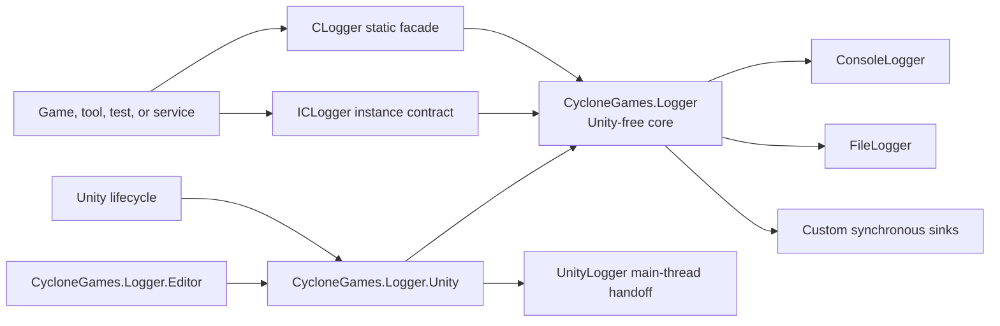

# CycloneGames.Logger

CycloneGames.Logger is a bounded and observable logging foundation for Unity applications, headless Unity players, command-line tools, tests, and pure C# services. It provides a Unity-free core, an optional Unity adapter, explicit queue and memory budgets, failure-isolated sinks, resilient file output, and lifecycle results that can be monitored instead of assumed.

This guide starts with the shortest working setup and then explains configuration, ownership, high-throughput usage, custom sinks, failure recovery, memory behavior, platforms, and validation. The defaults are safe starting points, not universal production budgets. Measure and tune them against the workload and hardware of each product.

## What the Module Provides

Use CycloneGames.Logger when an application needs more control than direct `Debug.Log` calls provide:

- severity and category filtering before deferred messages are built;
- bounded queues by both message count and retained character count;
- a background-worker mode and a caller-pumped mode;
- multiple synchronous sinks with per-sink failure quarantine;
- `UnityLogger`, `ConsoleLogger`, and `FileLogger` adapters;
- bounded file rotation, recovery attempts, flush modes, and health statistics;
- explicit sink ownership, flush, shutdown, and disposal behavior;
- queue, drop, failure, Unity handoff, file, and cache statistics;
- static and injectable assertion APIs;
- Unity project settings, a custom Inspector, and isolated build-time overrides.

The module does not turn a finite queue into guaranteed delivery. It also does not provide automatic redaction, encryption, remote upload, server acknowledgement, transactional audit storage, or platform-console SDK integrations. Payments, accounts, anti-cheat, compliance, and security audit records require a separately reviewed durable pipeline. Never log credentials, tokens, personal data, or unredacted user content without a product-owned data policy.

## Five-Minute Unity Setup

### 1. Create the settings asset

In Unity, select:

`Tools > CycloneGames > Logger > Create Default LoggerSettings`

The command creates the project settings asset at:

`Assets/Resources/CycloneGames.Logger/LoggerSettings.asset`

The default configuration registers `UnityLogger`, accepts `Info` and higher levels, uses all categories, and selects threaded processing except in WebGL players.

### 2. Validate the asset

Select the asset and press `Validate Settings` in the custom Inspector. Invalid capacities, unsupported Unity Console policies, and unsafe file paths are rejected before they reach a build.

### 3. Write logs

```csharp
using CycloneGames.Logger;
using UnityEngine;

public sealed class InventoryController : MonoBehaviour
{
    private void Start()
    {
        CLogger.LogInfo("Inventory initialized.", "Inventory");
    }

    public void ReportLoadFailure(string itemId)
    {
        CLogger.LogError(
            itemId,
            static (value, builder) => builder.Append("Failed to load item: ").Append(value),
            "Inventory");
    }
}
```

`LoggerBootstrap` runs before the first scene, loads the settings asset, creates the runtime host, registers the selected sinks, and applies the default level and filter. Application pause requests a buffered flush. Application quit seals new global producers, drains accepted work as far as the configured timeout allows, and performs a best-effort Unity Console drain.

If no sink can be registered, static logging is suppressed and does not create an unconfigured global instance.

## Five-Minute Pure C# or Server Setup

The core assembly has `noEngineReferences: true`; it can be used without `UnityEngine`.

```csharp
using CycloneGames.Logger;

var options = new LoggerProcessingOptions
{
    MaxQueuedMessages = 2048,
    MaxQueuedCharacters = 1024 * 1024,
    OverflowPolicy = LogQueueOverflowPolicy.DropNewest,
    CriticalLevel = LogLevel.Error
};

CLogger logger = CLoggerFactory.CreateThreaded(options);
logger.AddLoggerUnique(new ConsoleLogger());

logger.Log(LogLevel.Info, "Service started.", "Bootstrap");

LoggerShutdownResult result = logger.ShutdownInstance(LogFlushMode.Buffered, 2000);
if (result.IsComplete)
{
    logger.Dispose();
}
else
{
    // Keep the instance, release the blocked external dependency, and retry shutdown.
}
```

Use `CLoggerFactory.CreateSingleThreaded` when the host must control dispatch affinity. Call `Pump` from that host's update loop:

```csharp
ICLogger logger = CLoggerFactory.CreateSingleThreaded(options);

// Called by the host update loop.
logger.Pump(maxItems: 256);
```

Inject `ICLogger` into domain services. The composition root owns the concrete `CLogger`, its sinks, and final shutdown. Domain code should not resolve `CLogger.Instance` through a service locator.

## Architecture and Directory Layout



| Assembly | Responsibility | Unity dependency | Reference behavior |
| --- | --- | --- | --- |
| `CycloneGames.Logger` | Core contracts, processing, filtering, assertions, `ConsoleLogger`, and `FileLogger` | None | Auto-referenced; explicitly reference it from reusable asmdefs |
| `CycloneGames.Logger.Unity` | `LoggerBootstrap`, `LoggerSettings`, `UnityLogger`, and Unity lifecycle host | `UnityEngine` | Auto-referenced; explicitly reference it when directly using Unity adapter types |
| `CycloneGames.Logger.Editor` | Settings Inspector, source hyperlinks, and build override processing | `UnityEditor` | Editor only |
| `CycloneGames.Logger.Samples` | Optional usage and local diagnostic examples | Unity adapter | `autoReferenced: false` |
| `CycloneGames.Logger.Tests.Editor` | Functional and reliability tests | Unity Test Framework | Editor only |
| `CycloneGames.Logger.Tests.Performance` | Performance cases and steady-state allocation assertions | Performance Test Framework | Editor only |

The package uses this layout:

```text
CycloneGames.Logger/
  Runtime/Scripts/          Pure C# core and built-in non-Unity sinks
  Runtime/Scripts/Unity/    Unity adapter and settings bridge
  Editor/                   Inspector, source links, build overrides
  Tests/Editor/             Contract and reliability tests
  Tests/Performance/        Reproducible local performance cases
  Samples/                  Isolated sample scene and components
  README.md                 English guide
  README.SCH.md             Simplified Chinese guide
```

Core public contracts do not expose `GameObject`, `MonoBehaviour`, `ScriptableObject`, or other `UnityEngine` types. Unity-specific behavior remains in the adapter assembly.

## Core Mental Model

Every accepted record follows the same bounded pipeline:

```mermaid
flowchart LR
    Call["Log call"] --> Gate["Level, category, sink, lifecycle checks"]
    Gate --> Reserve["Reserve message and character capacity"]
    Reserve --> Build["Capture UTC timestamp and build bounded payload"]
    Build --> Queue["Bounded core ring"]
    Queue --> Processor["Worker or caller Pump"]
    Processor --> Sinks["Synchronous borrowed dispatch"]
    Sinks --> UnityQueue["Optional bounded Unity handoff"]
    UnityQueue --> MainThread["Unity main-thread drain"]
```



Important consequences:

- filtering and sink availability are checked before a deferred builder runs;
- message-count and retained-character budgets include queued, reserved, and in-flight work;
- sink calls are synchronous and cannot be preempted by a timeout;
- each sink sees a borrowed `LogMessage` valid only until `ILogger.Log` returns;
- Unity Console delivery uses a second bounded queue because Unity APIs require the main thread;
- drops, failures, and incomplete shutdown are observable and must be handled by product policy.

## Logging API

### Levels

Levels are ordered from least to most severe:

`Trace`, `Debug`, `Info`, `Warning`, `Error`, `Fatal`, `None`

`SetLogLevel(LogLevel.Warning)` filters `Trace`, `Debug`, and `Info`. `None` disables all accepted log levels.

```csharp
CLogger.Instance.SetLogLevel(LogLevel.Warning);

CLogger.LogInfo("Filtered.", "Loading");
CLogger.LogError("Accepted.", "Loading");
```

### Simple strings

Use a string when the value already exists or the call is cold:

```csharp
CLogger.LogInfo("Matchmaking connected.", "Networking");
CLogger.LogWarning("Retry budget is low.", "Networking");
CLogger.LogError("Profile load failed.", "Save");
```

Interpolation happens before the logger can filter the call:

```csharp
// The string is created before LogDebug checks the active level.
CLogger.LogDebug($"Entity {entityId} moved to {position}.", "Simulation");
```

### Deferred builder

The builder callback runs only after admission succeeds:

```csharp
CLogger.LogDebug(
    builder => builder.Append("Entity ").Append(entityId).Append(" updated."),
    "Simulation");
```

A capturing callback can allocate a closure. Use it for cold diagnostics or after profiling.

### State plus cached builder

For measured hot paths, pass state separately and cache the delegate:

```csharp
using System;
using System.Text;
using CycloneGames.Logger;

public static class CombatLog
{
    private static readonly Action<HitState, StringBuilder> AppendHit = AppendHitMessage;

    public static void Hit(int attackerId, int targetId, int damage)
    {
        CLogger.LogDebug(
            new HitState(attackerId, targetId, damage),
            AppendHit,
            "Combat");
    }

    private static void AppendHitMessage(HitState state, StringBuilder builder)
    {
        builder.Append("Attacker ").Append(state.AttackerId)
            .Append(" hit target ").Append(state.TargetId)
            .Append(" for ").Append(state.Damage).Append('.');
    }

    private readonly struct HitState
    {
        public readonly int AttackerId;
        public readonly int TargetId;
        public readonly int Damage;

        public HitState(int attackerId, int targetId, int damage)
        {
            AttackerId = attackerId;
            TargetId = targetId;
            Damage = damage;
        }
    }
}
```

This form avoids a capturing closure at the shown call site. It is not a blanket zero-allocation promise: pool misses, builder growth, caller state, sinks, exceptions, and platform I/O can still allocate.

### Builder failure behavior

If an admitted builder throws a non-`OutOfMemoryException`, the exception does not escape to the logging caller. The logger:

1. increments `MessageBuilderFailureCount`;
2. clears the partial message;
3. submits a bounded `[log message builder failed: ExceptionType]` record through the normal queue;
4. emits an emergency diagnostic only for the first builder failure of that logger instance.

`OutOfMemoryException` propagates. The reservation and temporary pooled builder are still released by the `finally` path.

### Caller information

The API captures `CallerFilePath`, `CallerLineNumber`, and `CallerMemberName` by default. File and Console sinks default to the leaf file name. `FullPath` can expose build-machine directories and should be enabled only under an explicit privacy policy.

## Category Filtering

Category matching is case-insensitive.

```csharp
ICLogger logger = CLogger.Instance;

logger.SetLogFilter(LogFilter.LogWhiteList);
logger.AddToWhiteList("Networking");
logger.AddToWhiteList("Save");

// Or accept everything except selected noisy categories.
logger.SetLogFilter(LogFilter.LogNoBlackList);
logger.AddToBlackList("AnimationTrace");
```

| Filter | Behavior |
| --- | --- |
| `LogAll` | Accept every category, including an empty category |
| `LogWhiteList` | Accept only listed categories; reject empty categories |
| `LogNoBlackList` | Accept empty categories and every category not listed |

Whitelist and blacklist updates copy their corresponding set. Treat mutations as initialization or configuration work, not per-frame work. Both sets share `MaxFilterCategories` and `MaxFilterCharacters`. An overlong key throws `ArgumentOutOfRangeException`; exhausting the shared budget throws `InvalidOperationException`. Neither publishes a partial filter snapshot.

In a non-`LogAll` mode, a runtime category longer than `MaxCategoryCharacters` fails closed before lookup. It is not truncated into another category key.

## Processing Modes and Threading

### Threaded

`CLoggerFactory.CreateThreaded` and Unity `AutoDetect` on supported non-WebGL targets use one background thread named `CLogger.Worker`. Producers reserve and commit into a synchronized bounded ring; the worker serially dispatches records and runs periodic sink maintenance. `Pump` is a no-op in this mode.

Use threaded processing for general Unity clients, desktop tools, and services when sinks are safe on the worker and the host can afford one managed thread.

### Single-threaded

`CreateSingleThreaded` dispatches only when `Pump` is called. The thread calling `Pump` executes every sink in that batch.

Use it when:

- WebGL does not provide the required threading model;
- a host owns deterministic dispatch affinity;
- a test needs explicit progress;
- a main-thread-only integration is implemented directly rather than through a handoff adapter.

Unity's runtime host pumps at most 256 core records per frame with an approximately 1 ms between-item budget. It separately drains at most 256 Unity Console entries with an approximately 2 ms between-item budget. The budgets are checked only after each synchronous item returns; one blocking sink can exceed them.

### Meaningful thread safety

The core queue, registration snapshots, statistics, and built-in sinks protect real concurrent paths. A custom sink must be thread-safe because threaded processing can call it from the worker while lifecycle operations occur elsewhere. Thread safety is not a license to perform blocking network requests, compression, uploads, or unbounded file work inside `ILogger.Log`. Put such work behind a separately owned bounded adapter queue.

## Queue Capacity and Backpressure

The core queue enforces two simultaneous limits:

- `MaxQueuedMessages`: queued + reserved + in-flight record count;
- `MaxQueuedCharacters`: queued + reserved + in-flight logger-owned retained characters.

The character limit is a logical retention budget, not exact managed heap bytes. It includes bounded message content and metadata, but excludes object headers, arrays, caller-owned strings, callback temporaries, sink buffers, native buffers, and operating-system caches.

`MaxMessageCharacters` truncates the body and adds ` [truncated]` when formatted. Category, source path, and member name are copied only up to their configured limits.

| Overflow policy | Full-capacity behavior | Use with care |
| --- | --- | --- |
| `DropNewest` | Reject the incoming record | Stable producer latency; newest context can be lost |
| `DropOldest` | Evict an eligible queued record | Preserves recent context; overload can scan and shift entries |
| `Block` | Wait up to `EnqueueBlockTimeoutMs`, then reject | Can stall the caller; avoid on Unity main thread and latency-critical threads |

Builder admission reserves the worst-case bounded body and metadata before invoking caller code. It does not evict under `DropOldest`; if that reservation cannot fit immediately, the builder is skipped and the record counts as `DroppedNewest`. A string overload can use `DropOldest` because its retained size is known before admission.

### Critical reserve

`ReservedCriticalMessages` and `ReservedCriticalCharacters` keep part of each capacity unavailable to records below `CriticalLevel`. Critical records can use the full queue and preferentially evict non-critical records when policy permits.

This is overload protection, not guaranteed delivery. Critical records can still be dropped when the queue is filled with critical work, a sink blocks, storage fails, shutdown times out, or the process terminates.

## Sinks and Ownership

Built-in sinks:

| Sink | Intended host | Execution and storage behavior |
| --- | --- | --- |
| `UnityLogger` | Unity client/Editor | Formats during borrowed dispatch, copies into a bounded handoff, emits on Unity main thread |
| `ConsoleLogger` | CLI, headless process, Dedicated Server | Synchronously writes lower levels to `Console.Out` and `Error`/`Fatal` to `Console.Error` |
| `FileLogger` | Targets with a supported and writable filesystem | Synchronously formats UTF-8 text, rotates within configured limits, and reports health |

### Registration rules

- `AddLogger` returning `true` transfers ownership of that exact sink instance to `CLogger`.
- `AddLogger` returning `false` does not establish a new transfer. It can also mean that the same identity is already logger-owned, so do not dispose solely because the call returned `false`.
- `AddLoggerUnique` accepts at most one exact runtime type. A distinct rejected instance is disposed before return; a repeated reference is not disposed.
- `RemoveLogger` does not dispose. Only `true` means dispatch is quiescent and ownership transferred back to that caller. Never dispose after `false`; retry after resolving a timeout.
- `ClearLoggers` retires every active sink and schedules logger-owned disposal after quiescence.
- Each `CLogger` owns at most 256 active, retired, queued-for-disposal, or disposing sinks in total.

Disposal is serialized by one lazily created owner per logger. On non-WebGL targets, it uses the `CLogger.SinkDisposal` background worker. WebGL uses a synchronous path. A normal custom sink receives one `Dispose` attempt. Implement `IIdempotentLoggerSinkDisposal` only when retry is safe even after an earlier `Dispose` threw partway through cleanup; marked sinks receive at most three attempts.

## Writing a Custom Sink

`ILogger.Log(LogMessage)` is a synchronous borrowed-payload contract. Read the payload only during the call and use `AppendMessageTo`; do not retain the `LogMessage` or any internal pooled storage.

The following fixed-size recent-message sink has purposeful thread synchronization because worker dispatch and UI reads can occur on different threads. It overwrites the oldest copied string when full, so retained entry count is bounded.

```csharp
using System;
using System.Text;
using CycloneGames.Logger;

public sealed class RecentLogSink : ILogger
{
    private readonly object _syncRoot = new object();
    private readonly string[] _entries;
    private readonly StringBuilder _scratch = new StringBuilder(256);
    private int _next;
    private bool _disposed;

    public RecentLogSink(int capacity)
    {
        if (capacity < 1)
        {
            throw new ArgumentOutOfRangeException(nameof(capacity));
        }

        _entries = new string[capacity];
    }

    public void Log(LogMessage message)
    {
        if (message == null)
        {
            throw new ArgumentNullException(nameof(message));
        }

        lock (_syncRoot)
        {
            if (_disposed)
            {
                return;
            }

            _scratch.Clear();
            message.AppendMessageTo(_scratch, escapeControlCharacters: true);
            _entries[_next] = _scratch.ToString();
            _next = (_next + 1) % _entries.Length;
        }
    }

    public void Dispose()
    {
        lock (_syncRoot)
        {
            if (_disposed)
            {
                return;
            }

            _disposed = true;
            Array.Clear(_entries, 0, _entries.Length);
            _scratch.Clear();
        }
    }
}
```

This example bounds entry count but allocates one copied string per accepted record. An asynchronous, remote, or main-thread adapter additionally needs a retained-character/byte budget, an overflow policy, drop counters, thread-affinity rules, flush semantics, and explicit shutdown ownership.

## Lifecycle, Flush, and Shutdown

### Global logger

Configure global processing before `CLogger.Instance` or the first accepted static log outside Unity bootstrap:

```csharp
CLogger.ConfigureThreadedProcessing(options);
CLogger.ConfigureTimestampProvider(static () => DateTime.UtcNow);

ICLogger logger = CLogger.Instance;
```

Once the global instance exists, processing configuration returns `false`. Stop the global instance only through:

```csharp
LoggerShutdownResult result = CLogger.Shutdown(LogFlushMode.Buffered);
```

Calling `ShutdownInstance` on `CLogger.Instance` throws because static shutdown owns global detachment and retry coordination.

### Explicit logger

Factory-created loggers use:

```csharp
LoggerShutdownResult result = logger.ShutdownInstance(LogFlushMode.Durable, 5000);
```

If shutdown times out, retain the instance. Release or repair the blocking external dependency, then retry. Do not treat timeout as ownership completion.

### Flush modes

| Mode | Request |
| --- | --- |
| `Buffered` | Drain core work and flush managed sink buffers |
| `Durable` | Also ask capable sinks for an operating-system durable flush |

`Durable` is not a power-loss, controller-cache, browser-storage, or remote-acknowledgement guarantee.

`TryFlush` waits for core processing, active dispatches, and logger-owned sink disposal, then invokes `IFlushableLogger` sinks. Timeouts are checked between synchronous operations. They cannot cancel an `ILogger.Log`, `TryFlush`, `Dispose`, Console call, or filesystem call that is already blocked.

### Shutdown results

| Status | Meaning |
| --- | --- |
| `Completed` | Processing and requested flush completed without observed drops or terminal failures |
| `CompletedWithDrops` | Shutdown completed, but the logger observed dropped records |
| `CompletedWithFailures` | Shutdown completed with a sink flush or disposal failure |
| `TimedOut` | Work or ownership remains; retain and retry the instance |
| `AlreadyStopped` | The instance was already stopped |

`IsComplete` is `true` for completed-with-drops and completed-with-failures. Always inspect `Status`, `DroppedMessageCount`, and `SinksFlushed`.

## File Logging

### Unity settings

Enable `registerFileLogger`. The safe default writes:

`Application.persistentDataPath/App.log`

Use `fileName` only as a portable leaf name. A custom path requires all of the following:

- `usePersistentDataPath = false`;
- `allowCustomFilePath = true`;
- a fully qualified absolute `customFilePath`;
- target-specific validation for sandbox, permissions, quota, backups, removable storage, and shutdown.

### Explicit construction

```csharp
var fileOptions = new FileLoggerOptions
{
    MaintenanceMode = FileMaintenanceMode.Rotate,
    MaxFileBytes = 10L * 1024L * 1024L,
    MaxArchiveFiles = 5,
    FlushBatchSize = 64,
    FlushIntervalMs = 1000,
    DurableFlushOnFatal = false,
    SourcePathMode = LogSourcePathMode.FileName
};

var fileSink = new FileLogger(logPath, fileOptions);
logger.AddLoggerUnique(fileSink);
```

`FileLogger` writes UTF-8 without BOM. It escapes control characters in message, category, and source fields so one event cannot inject arbitrary physical lines. `Error` and `Fatal` trigger a flush; `Fatal` requests a durable flush when `DurableFlushOnFatal` is enabled.

### File options

| Field | Default | Meaning |
| --- | ---: | --- |
| `MaintenanceMode` | `Rotate` | `None`, threshold-only `WarnOnly`, or bounded `Rotate` |
| `MaxFileBytes` | 10 MiB | Active-file UTF-8 byte cap in `Rotate` mode |
| `MaxArchiveFiles` | 5 | Maximum Logger-owned archives; zero removes an archive after rotation |
| `FlushBatchSize` | 64 | Accepted records between buffered flushes |
| `FlushIntervalMs` | 1000 | Maximum buffered interval; zero flushes each accepted record |
| `RecoveryRetryIntervalMs` | 5000 | Minimum retry interval while the writer is unavailable |
| `DiagnosticIntervalMs` | 30000 | Minimum emergency diagnostic interval; zero disables throttling |
| `DurableFlushOnFatal` | `false` | Request an OS durable flush for `Fatal` |
| `SourcePathMode` | `FileName` | `None`, `FileName`, or privacy-sensitive `FullPath` |

In `Rotate` mode, the sink measures each formatted record before writing. A record too large for an empty active file is truncated to the configured byte cap. A non-empty file rotates before a write that would exceed the cap. Archive names are implementation-owned and include a Logger marker and fixed-width UTC tick token; product code should not construct or parse them. Cleanup claims only strictly recognized Logger-owned files, orders them by UTC modification time and ordinal name, and leaves unrelated files untouched.

Opening, rotation, or writing can fail. The triggering record is dropped rather than exceeding the byte cap. The sink attempts bounded recovery and reports `Healthy`, `Degraded`, `Faulted`, or `Disposed`. Direct construction throws if initialization cannot establish a writer. Unity bootstrap catches that constructor failure, reports it through emergency and Unity paths without including the configured path, and continues with sinks that initialized successfully.

### File health

`FileLogger.Statistics` exposes:

- attempted, written, and dropped entry counts;
- write, flush, rotation, cleanup, and recovery failure counts;
- rotation and successful recovery counts;
- throttled diagnostic count;
- current active-file bytes;
- current health;
- last failure kind and UTC time.

Use cumulative counters with health. `Degraded` can describe a writer that recovered while retaining evidence of a failure.

## LoggerSettings Reference

The Inspector groups serialized fields by purpose. A new asset uses the following defaults.

| Group | Field | Default | Meaning |
| --- | --- | ---: | --- |
| Processing | `processing` | `AutoDetect` | Threaded except WebGL; can force threaded or caller-pumped processing where supported |
| Processing | `maxQueuedMessages` | 8192 | Core message capacity |
| Processing | `maxQueuedCharacters` | 4 Mi characters | Core retained-character capacity |
| Processing | `maxMessageCharacters` | 16 Ki characters | Per-message body limit |
| Processing | `maxCategoryCharacters` | 256 | Retained category prefix limit |
| Processing | `maxSourcePathCharacters` | 2048 | Retained caller path prefix limit |
| Processing | `maxMemberNameCharacters` | 256 | Retained member-name prefix limit |
| Processing | `maxFilterCategories` | 1024 | Shared whitelist-plus-blacklist entry cap |
| Processing | `maxFilterCharacters` | 64 Ki characters | Shared logical filter-key character cap |
| Processing | `reservedCriticalMessages` | 64 | Message slots unavailable to non-critical records |
| Processing | `reservedCriticalCharacters` | 64 Ki characters | Character budget unavailable to non-critical records |
| Processing | `unityConsoleMaxQueuedMessages` | 4096 | Unity main-thread handoff message capacity |
| Processing | `unityConsoleMaxQueuedCharacters` | 2 Mi characters | Unity handoff retained-character capacity |
| Processing | `unityConsoleOverflowPolicy` | `DropNewest` | Independent Unity handoff policy; only `DropNewest` or `DropOldest` |
| Processing | `shutdownDrainTimeoutMs` | 2000 | Default drain and quiescence timeout |
| Processing | `enqueueBlockTimeoutMs` | 1 | Core `Block` producer wait limit |
| Processing | `maintenanceIntervalMs` | 250 | Threaded maintenance interval; minimum 10 ms |
| Processing | `sinkFailureThreshold` | 3 | Consecutive sink exceptions before quarantine |
| Processing | `overflowPolicy` | `DropNewest` | Core queue overflow policy |
| Processing | `guaranteedLevel` | `Error` | Severity allowed to use reserved capacity; it does not guarantee delivery |
| Registration | `registerUnityLogger` | `true` | Register Unity Console adapter except on `UNITY_SERVER` |
| Registration | `registerConsoleLogger` | `false` | Register `System.Console` sink |
| Registration | `registerFileLogger` | `false` | Register file sink where supported |
| File | `usePersistentDataPath` | `true` | Place the active file directly under `Application.persistentDataPath` |
| File | `fileName` | `App.log` | Portable leaf name for persistent-data placement |
| File | `allowCustomFilePath` | `false` | Explicitly enable the custom path trust boundary |
| File | `customFilePath` | empty | Fully qualified path when persistent-data placement is disabled |
| File | `fileMaintenanceMode` | `Rotate` | File size handling mode |
| File | `maxFileBytes` | 10 MiB | Active-file byte threshold or cap, depending on mode |
| File | `maxArchiveFiles` | 5 | Logger-owned archive retention count |
| File | `fileFlushBatchSize` | 64 | Records per buffered flush |
| File | `fileFlushIntervalMs` | 1000 | Maximum buffered flush interval |
| File | `durableFlushOnFatal` | `false` | Request durable flush for `Fatal` |
| File | `fileSourcePathMode` | `FileName` | Source path disclosure policy |
| Defaults | `defaultLevel` | `Info` | Runtime severity threshold after sink registration |
| Defaults | `defaultFilter` | `LogAll` | Runtime category policy after sink registration |

The serialized field is named `guaranteedLevel`, while programmatic processing configuration uses `LoggerProcessingOptions.CriticalLevel`. Both describe access to reserved capacity, not guaranteed delivery. New code should use `CriticalLevel`.

Configuration validation requires the aggregate maximum body and metadata entry to fit the core queue character budget. It separately requires a maximally formatted Unity record to fit the Unity handoff character budget. Critical reserves are normalized so at least one normal record and one normal slot remain available.

## Build-Time Overrides

Build overrides create an isolated settings asset; they never edit the canonical project asset. Resolution order is:

1. clone the canonical asset, or create an in-memory default when it is absent;
2. optionally copy an in-project `LoggerSettings` profile;
3. apply the selected sink mode;
4. apply individual environment options;
5. apply individual command-line options.

Command-line values win over environment values for the same field. Individual sink switches are applied after the mode and can override it.

| Environment variable | Command-line option | Value |
| --- | --- | --- |
| `CG_LOGGER_SETTINGS` | `-loggerSettings` | Project-contained `Assets/...` profile path |
| `CG_LOGGER_MODE` | `-loggerMode` | `Settings`, `Off`, `Unity`, `File`, or `UnityAndFile` |
| `CG_LOGGER_UNITY` | `-loggerUnity` | Boolean |
| `CG_LOGGER_CONSOLE` | `-loggerConsole` | Boolean |
| `CG_LOGGER_FILE` | `-loggerFile` | Boolean |
| `CG_LOGGER_USE_PERSISTENT_DATA_PATH` | `-loggerUsePersistentDataPath` | Boolean |
| `CG_LOGGER_FILE_NAME` | `-loggerFileName` | Portable leaf name |
| `CG_LOGGER_CUSTOM_FILE_PATH` | `-loggerCustomFilePath` | Optional fully qualified absolute path |
| `CG_LOGGER_LEVEL` | `-loggerLevel` | `LogLevel` name |
| `CG_LOGGER_FILTER` | `-loggerFilter` | `LogFilter` name |
| `CG_LOGGER_PROCESSING` | `-loggerProcessing` | `LoggerSettings.ProcessingMode` name |
| `CG_LOGGER_MAX_QUEUED_MESSAGES` | `-loggerMaxQueuedMessages` | Positive integer |
| `CG_LOGGER_UNITY_CONSOLE_MAX_QUEUED_MESSAGES` | `-loggerUnityConsoleMaxQueuedMessages` | Positive integer |
| `CG_LOGGER_SHUTDOWN_DRAIN_TIMEOUT_MS` | `-loggerShutdownDrainTimeoutMs` | Non-negative integer |
| `CG_LOGGER_OVERFLOW_POLICY` | `-loggerOverflowPolicy` | Core `LogQueueOverflowPolicy` name |
| `CG_LOGGER_GUARANTEED_LEVEL` | `-loggerGuaranteedLevel` | Severity allowed to use reserved capacity |

Accepted booleans are `true/false`, `1/0`, `yes/no`, `on/off`, and `enabled/disabled`. An explicitly present invalid value fails the build.

When an override exists, preprocessing creates:

`Assets/Generated/CycloneGames.Logger/Resources/CycloneGames.Logger/LoggerSettingsBuildOverride.asset`

The Player loads this Resources key before the canonical key; the Editor always uses the canonical asset. A transaction marker at `Library/CycloneGames.Logger/LoggerSettingsBuildOverride.marker.json` records project identity, path, asset GUID, transaction, and phase. Cleanup deletes the generated asset only after identity validation. An invalid marker or an occupied unverified path is preserved and blocks the build for inspection instead of deleting unknown data.

## Assertions

`CLogAssert` is the static facade. `CLogAssert.CreateService(ICLogger, options)` creates an injectable `CLogAssertService`.

```csharp
CLogAssert.Configure(new CLogAssertOptions
{
    Enabled = true,
    FailureLevel = LogLevel.Error,
    FailureBehavior = CLogAssertFailureBehavior.LogAndThrow,
    Category = "GameplayInvariant",
    FlushBeforeThrow = true,
    FlushTimeoutMs = 100
});

CLogAssert.IsNotNull(playerState, "Player state must exist before simulation.");
```

Supported checks include `That`, `IsTrue`, `IsFalse`, `IsNull`, `IsNotNull`, `AreEqual`, `AreNotEqual`, and `Fail`. Builder overloads skip message construction when the condition succeeds.

`LogOnly` logs, `Throw` throws without logging, and `LogAndThrow` does both. When logging and throwing, the default requests a best-effort buffered flush first. A blocked sink can delay the throw beyond `FlushTimeoutMs` because synchronous work cannot be preempted. Flush failure does not suppress `CLogAssertionException`.

Assertions are not a replacement for input validation, recoverable error handling, authority checks, or security enforcement.

## Observability

### Core processing statistics

`GetProcessingStatistics()` returns a point-in-time `LogProcessingStatistics` snapshot.

| Fields | Meaning |
| --- | --- |
| `QueuedCount`, `QueuedCharacters` | Committed work waiting in the core queue |
| `ReservedCount` | Producer reservations not committed or cancelled |
| `InFlightCount`, `InFlightCharacters` | Records executing processor/sink dispatch |
| `PeakQueuedCount`, `PeakQueuedCharacters` | Cumulative committed-plus-in-flight high-water marks |
| `EnqueuedMessageCount`, `ProcessedMessageCount` | Successfully committed and completed records |
| `DroppedMessageCount` | Newest drops + oldest evictions + rejections after stop |
| `DroppedNewestCount`, `DroppedOldestCount` | Rejection and eviction totals |
| `DroppedCriticalCount` | Drops at or above `CriticalLevel` |
| `RejectedAfterStopCount` | Reservations or commits attempted after stopping began |
| `SinkFailureCount`, `QuarantinedSinkCount` | Sink exceptions and cumulative quarantine events |
| `PendingSinkDisposalCount` | Owned sinks waiting for quiescence or disposal completion |
| `SinkDisposalFailureCount` | Terminal sink disposal failures |
| `FilterCategoryCount`, `FilterCharacters` | Current combined filter occupancy |
| `RejectedFilterMutationCount` | Filter additions rejected by length or shared budget |
| `TimestampProviderFailureCount` | Custom timestamp provider circuit-breaker events; at most one per instance |
| `MessageBuilderFailureCount` | Deferred builders replaced after non-OOM exceptions |

### Cache statistics

`CLogger.GetMemoryStatistics()` reports process-wide cache observations, not total heap memory:

- retained and peak `LogMessage` objects;
- `LogMessage` pool misses, discards, and invalid returns;
- retained and peak `StringBuilder` objects;
- `StringBuilder` pool misses and discards.

### Unity handoff statistics

`UnityLogger.GetStatistics()` reports the second queue:

- queued, reserved, and in-flight message/character occupancy;
- current-generation high-water marks;
- current-generation total and critical drops;
- cumulative entries abandoned during successful subsystem resets.

A successful Unity `TryFlush` means the handoff is idle. It does not erase or invalidate drop and abandonment counters.

### Recommended health checks

```csharp
LogProcessingStatistics core = logger.GetProcessingStatistics();
UnityLoggerStatistics unity = UnityLogger.GetStatistics();

if (core.DroppedCriticalCount > 0 || unity.DroppedCriticalCount > 0)
{
    // Escalate through a diagnostics path that cannot recurse into the same failed sink.
}
```

A production diagnostics view should surface critical and total drops, builder failures, rejected filter mutations, timestamp provider failure, pending disposal, quarantined sinks, terminal disposal failures, Unity reset abandonment, and file `Degraded`/`Faulted` health. Derive alert thresholds from repeatable load, device, and soak evidence.

## Performance and Memory Guidance

The core queue preallocates its entry array from `MaxQueuedMessages`. The Unity handoff preallocates a second entry array. `LogMessage` and `StringBuilder` use bounded process-wide caches. Oversized builders and returns beyond cache limits are discarded instead of retained indefinitely. Unity subsystem registration clears cache state.

Allocation can still occur when:

- the caller creates a string or interpolated string;
- a delegate captures state;
- a cache misses or a builder grows;
- over-limit strings are copied into bounded substrings;
- a sink formats or copies text;
- Unity Console, file rotation, archive enumeration, exceptions, or platform I/O allocate.

The performance test assembly contains steady-state zero-current-thread-allocation assertions for four specific warmed paths: filtered cached builders, accepted cached builders with synchronous pump, accepted constant short strings with synchronous pump, and an overloaded `DropOldest` head replacement. These tests describe those exact Editor test conditions only. They do not prove Player, IL2CPP, every sink, every message shape, or every platform is allocation-free.

For a hot path:

1. filter before building;
2. use `Log<T>` with a cached static delegate;
3. keep categories short and stable;
4. prewarm through the actual sink set;
5. measure queue peaks, drops, and cache misses;
6. aggregate or sample high-frequency diagnostics;
7. profile Development and Release Players on representative hardware.

Do not emit one record per entity per tick at large entity counts without a measured diagnostic budget. Prefer counters, histograms, sampled traces, or state-transition records.

## Unity Editor Behavior

- `LoggerSettingsEditor` uses `SerializedObject` and `SerializedProperty`, supports multi-object editing, and preserves Undo, asset serialization, and Inspector workflows.
- Source links embed caller paths and lines into Unity Console output. The Editor registry is bounded to 2048 entries and uses an allocation-aware value key.
- Source line formatting and parsing use culture-invariant numeric behavior.
- Unity Console records suppress Unity's additional stack trace because caller source information is already included.
- Build overrides operate on a generated asset and never mutate the canonical source settings asset.

Avoid using the Unity Console as a shipping throughput sink. Its formatting, Editor rendering, stack handling, and visible Console state can dominate timing and allocation measurements.

## Platform Behavior

| Target | Implemented path | Product integration and validation |
| --- | --- | --- |
| Windows, Linux, macOS Unity Players | `AutoDetect` selects threaded processing; Unity, Console, and file sinks are available by configuration | Validate Mono/IL2CPP, path permissions, stdout, rotation, graceful quit, forced termination, and hardware budgets |
| iOS, Android | Threaded path; pause requests buffered flush | Validate suspend/kill, sandbox, quota, low storage, thermal/load effects, and device-specific retention |
| WebGL Player | Compile-time single-thread path; explicit threaded creation and core `Block` fail fast; bootstrap converts serialized core `Block` to `DropNewest`; `FileLogger` is unsupported | Provide a bounded browser/remote adapter when logs must leave the page; test browser pump, memory, tab close, and unload behavior |
| Dedicated Server | Unity Console sink is disabled under `UNITY_SERVER`; Console and file sinks remain configurable | Prefer explicit composition, stdout capture, container/service shutdown hooks, file quota, and external rotation coordination |
| Console platforms | Core and Unity adapter do not include proprietary SDK integrations | Add a narrow bounded adapter after SDK access; validate thread affinity, storage sandbox, suspend/resume, certification rules, IL2CPP, and real devkits |

`FileLogger.IsSupported` only encodes the WebGL exclusion. It is not a runtime permission, free-space, quota, or storage-health probe.

Platform compatibility must be demonstrated by builds and target evidence. The architecture avoids reflection in runtime dispatch and isolates platform adapters, but Editor tests alone do not establish IL2CPP/AOT, device filesystem, browser, server soak, or console certification behavior.

## Persistence and Security Inventory

| Data | Path and format | Owner and lifetime | Git and safe cleanup |
| --- | --- | --- | --- |
| Canonical settings | `Assets/Resources/CycloneGames.Logger/LoggerSettings.asset` plus `.meta`; Unity serialization | Project; loaded during Unity bootstrap | Commit when settings are shared. Preserve asset GUID and serialized field names |
| Build override | `Assets/Generated/CycloneGames.Logger/Resources/CycloneGames.Logger/LoggerSettingsBuildOverride.asset` plus `.meta` | Build transaction | Do not commit. Remove only through verified transaction cleanup |
| Build marker | `Library/CycloneGames.Logger/LoggerSettingsBuildOverride.marker.json`; UTF-8 JSON | Build processor recovery identity | Do not commit. Inspect it together with the generated asset before manual cleanup |
| Active runtime log | Default `Application.persistentDataPath/App.log`; plaintext UTF-8 without BOM | `FileLogger`; runtime lifetime | Do not commit. Product owns quota, privacy, collection, retention, and deletion |
| Logger-owned archives | Alongside the active file; internal file-name grammar | `FileLogger`; bounded by `MaxArchiveFiles` | Do not commit. Cleanup claims only strictly recognized Logger-owned files |
| Sample load output | `Application.temporaryCachePath/CycloneGames.Logger/LoadExample.log` | Sample component; disposable cache | Safe to delete after the sample stops |
| Sample benchmark outputs | `temporaryCachePath/CycloneGames.Logger/LoggerBenchmarkReport.txt` and `LoggerBenchmarkFile.log` | Sample harness; disposable diagnostics | Safe to delete after inspection |

The module does not use `EditorPrefs`, `PlayerPrefs`, or `SessionState` for Logger configuration or runtime state. Runtime log files are plaintext and can contain application-provided sensitive data. Redaction must happen before the record reaches sinks.

## Troubleshooting

| Symptom | Checks and action |
| --- | --- |
| No output | Confirm a sink is registered, level and filter accept the record, the settings asset validates, and bootstrap did not suppress a no-sink global |
| Deferred builder never runs | Check level/category, active sinks, lifecycle, capacity, and `DroppedNewestCount` |
| Builder failure record appears | Inspect `MessageBuilderFailureCount`; fix the callback. `OutOfMemoryException` is propagated separately |
| Filter mutation throws | Inspect filter occupancy and `RejectedFilterMutationCount`; reduce keys or raise a measured budget |
| Custom timestamps switch to UTC | Inspect `TimestampProviderFailureCount`; the provider is bypassed after its first observed non-OOM failure for that instance |
| Drops increase | Compare message and character peaks, critical drops, sink latency, Unity queue statistics, and log rate before increasing capacity |
| Main-thread hitch | Avoid core `Block`, direct slow sinks on the pumping thread, unbounded `Pump`, and string-heavy hot-path calls |
| Sink disappears | Inspect `SinkFailureCount` and `QuarantinedSinkCount`; recreate the recovered external dependency as a new sink |
| Disposal stays pending | Inspect `PendingSinkDisposalCount`; one blocked `Dispose` serializes later owned disposal work |
| Shutdown times out | Preserve the instance, identify the blocked synchronous sink/disposal/reservation, release the dependency, and retry the correct global or instance shutdown API |
| Unity flush remains false | Check queued, reserved, and in-flight Unity handoff occupancy; drain from the main thread |
| File health is degraded or faulted | Inspect `LastFailure`, permissions, quota, file sharing, path validity, and recovery counters |
| File grows beyond expectation | Confirm `MaintenanceMode.Rotate`; `None` and `WarnOnly` do not cap active-file size |
| WebGL creates no file | Expected; use a bounded browser or remote adapter |
| Build override blocks the build | Inspect the generated asset and marker. Identity mismatch fails closed and preserves data for review |
| Custom file path is rejected | Enable the explicit opt-in, disable persistent-data placement, use a fully qualified path, and validate the target sandbox |

## Validation

### Static checks

From `<repo-root>`:

```text
git diff --check -- UnityStarter/Assets/ThirdParty/CycloneGames/CycloneGames.Logger
```

### Functional and reliability tests

```text
<UnityEditor> -batchmode -nographics -projectPath <repo-root>/UnityStarter -runTests -testPlatform EditMode -assemblyNames CycloneGames.Logger.Tests.Editor -testResults <repo-root>/Artifacts/Logger.EditMode.xml -quit
```

### Performance tests

```text
<UnityEditor> -batchmode -nographics -projectPath <repo-root>/UnityStarter -runTests -testPlatform EditMode -assemblyNames CycloneGames.Logger.Tests.Performance -testResults <repo-root>/Artifacts/Logger.Performance.xml -quit
```

### Unity Editor checks

1. Refresh Unity and confirm all Logger assemblies compile without warnings or errors.
2. Create/select `LoggerSettings`, run `Validate Settings`, and inspect conditional file fields.
3. Run `CycloneGames.Logger.Tests.Editor` and `CycloneGames.Logger.Tests.Performance` separately.
4. Open `Samples/SampleScene.unity`, enable one scenario, and inspect output and statistics.
5. Exercise rotation in a temporary directory and inspect file health and retained archive count.
6. Test a build with and without explicit overrides; confirm the canonical asset is unchanged and verified temporary output is cleaned.

### Player and platform checks

For each supported target/backend, validate startup selection, Console/stdout/file output, path permissions, rotation, pause/resume, graceful quit, forced termination, burst drops, low-storage recovery, and `LoggerShutdownResult`. Test IL2CPP separately where used. Test representative low-end and recommended hardware with defined workload, warmup, sampling, and acceptance thresholds. WebGL requires browser-main-thread and unload checks; Dedicated Server requires service/container shutdown and stdout checks; console platforms require SDK, devkit, and certification evidence.

Passing tests in one Editor environment proves only those tested contracts. It does not by itself establish Player, IL2CPP, device, long-duration, storage-failure, or cross-platform behavior.

## Samples

`Samples/README.md` and `Samples/README.SCH.md` explain the isolated sample scene, minimal logging component, finite load generator, queue/cache monitor, and local benchmark harness. Samples are teaching and diagnostic aids; they are not production bootstrap code or shipping performance targets.
