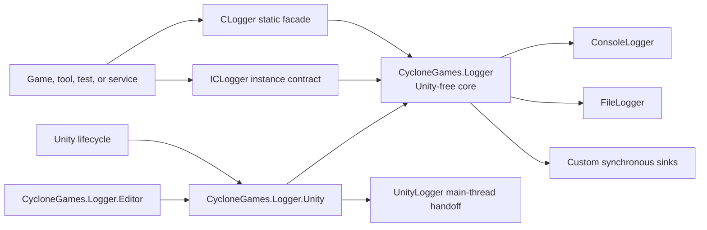

# CycloneGames.Logger

[English | 简体中文](README.SCH.md)

CycloneGames.Logger is a bounded, observable logging foundation for Unity applications, headless players, command-line tools, tests, and pure C# services. It provides a Unity-free core, an optional Unity adapter, explicit queue and memory budgets, failure-isolated sinks, resilient file output, and lifecycle results that can be monitored instead of assumed.

## Table of Contents

- [Overview](#overview)
- [Architecture](#architecture)
- [Quick Start](#quick-start)
- [Core Concepts](#core-concepts)
- [Usage Guide](#usage-guide)
- [Advanced Topics](#advanced-topics)
- [Common Scenarios](#common-scenarios)
- [Performance and Memory](#performance-and-memory)
- [Troubleshooting](#troubleshooting)

## Overview

When an application needs more control than direct `Debug.Log` calls provide, CycloneGames.Logger gives the producer a single bounded pipeline: severity and category filtering before deferred messages are built, a queue capped by both message count and retained character count, failure-isolated synchronous sinks, and lifecycle results that report drops, sink failures, and incomplete shutdowns rather than hiding them.

The core assembly has `noEngineReferences: true` and exposes no `UnityEngine` types. Unity-specific behavior (`LoggerBootstrap`, `LoggerSettings`, `UnityLogger`) lives in a separate adapter assembly, so the same logging contract runs in Editor, Runtime, headless players, Dedicated Server, CLI tools, tests, and pure C# services.

Bounded queues are overload protection, not guaranteed delivery. The module does not provide automatic redaction, encryption, remote upload, server acknowledgement, transactional audit storage, or platform-console SDK integrations. Payments, accounts, anti-cheat, compliance, and security audit records require a separately reviewed durable pipeline. Never log credentials, tokens, personal data, or unredacted user content without a product-owned data policy.

### Key Features

- **Bounded queue** with message-count and retained-character limits, overflow policies, and critical-record reserves.
- **Threaded and caller-pumped processing** via `CLoggerFactory.CreateThreaded` and `CreateSingleThreaded`.
- **Failure-isolated sinks**: `UnityLogger`, `ConsoleLogger`, `FileLogger`, and custom `ILogger` implementations; per-sink quarantine prevents one failing sink from blocking the others.
- **Resilient file output**: bounded rotation, recovery attempts, flush modes, and health statistics.
- **Observable lifecycle**: `LogProcessingStatistics`, `UnityLoggerStatistics`, `FileLogger.Statistics`, and `LoggerShutdownResult` expose drops, failures, and pending work.
- **Static and injectable assertions** via `CLogAssert` and `CLogAssertService`.
- **Unity settings asset** with custom Inspector, build-time overrides through environment variables and command-line options.

## Architecture



| Assembly | Purpose | Unity dependency |
| --- | --- | --- |
| `CycloneGames.Logger` | Core contracts, processing, filtering, assertions, `ConsoleLogger`, `FileLogger` | None (`noEngineReferences: true`) |
| `CycloneGames.Logger.Unity` | `LoggerBootstrap`, `LoggerSettings`, `UnityLogger`, Unity lifecycle host | `UnityEngine` |
| `CycloneGames.Logger.Editor` | Settings Inspector, source hyperlinks, build override processing | `UnityEditor` |
| `CycloneGames.Logger.Samples` | Isolated sample scene and diagnostic components | Unity adapter (`autoReferenced: false`) |
| `CycloneGames.Logger.Tests.Editor` | Functional and reliability tests | Unity Test Framework |
| `CycloneGames.Logger.Tests.Performance` | Performance cases and steady-state allocation assertions | Performance Test Framework |

Core public contracts do not expose `GameObject`, `MonoBehaviour`, `ScriptableObject`, or other `UnityEngine` types. Unity-specific behavior remains in the adapter assembly.

Every accepted record follows the same bounded pipeline:

```mermaid
flowchart LR
    Call["Log call"] --> Gate["Level, category, sink, lifecycle checks"]
    Gate --> Reserve["Reserve message and character capacity"]
    Reserve --> Build["Capture UTC timestamp and build bounded payload"]
    Build --> Queue["Bounded core ring"]
    Queue --> Processor["Worker or caller Pump"]
    Processor --> Sinks["Synchronous borrowed dispatch"]
    Sinks --> UnityQueue["Optional bounded Unity handoff"]
    UnityQueue --> MainThread["Unity main-thread drain"]
```



Filtering and sink availability are checked before a deferred builder runs. Message-count and retained-character budgets include queued, reserved, and in-flight work. Sink calls are synchronous and cannot be preempted by a timeout. Each sink sees a borrowed `LogMessage` valid only until `ILogger.Log` returns. Unity Console delivery uses a second bounded queue because Unity APIs require the main thread.

## Quick Start

### Unity setup

1. In Unity, select `Tools > CycloneGames > Logger > Create Default LoggerSettings`. This creates the asset at `Assets/Resources/CycloneGames.Logger/LoggerSettings.asset`.
2. Select the asset and press `Validate Settings` in the custom Inspector. Invalid capacities, unsupported Unity Console policies, and unsafe file paths are rejected before they reach a build.
3. Write logs from any code that references `CycloneGames.Logger` and `CycloneGames.Logger.Unity`:

```csharp
using CycloneGames.Logger;
using UnityEngine;

public sealed class InventoryController : MonoBehaviour
{
    private void Start()
    {
        CLogger.LogInfo("Inventory initialized.", "Inventory");
    }

    public void ReportLoadFailure(string itemId)
    {
        CLogger.LogError(
            itemId,
            static (value, builder) => builder.Append("Failed to load item: ").Append(value),
            "Inventory");
    }
}
```

`LoggerBootstrap` runs before the first scene, loads the settings asset, creates the runtime host, registers the selected sinks, and applies the default level and filter. If no sink can be registered, static logging is suppressed and does not create an unconfigured global instance.

### Pure C# or server setup

The core assembly has `noEngineReferences: true` and can be used without `UnityEngine`:

```csharp
using CycloneGames.Logger;

var options = new LoggerProcessingOptions
{
    MaxQueuedMessages = 2048,
    MaxQueuedCharacters = 1024 * 1024,
    OverflowPolicy = LogQueueOverflowPolicy.DropNewest,
    CriticalLevel = LogLevel.Error
};

CLogger logger = CLoggerFactory.CreateThreaded(options);
logger.AddLoggerUnique(new ConsoleLogger());

logger.Log(LogLevel.Info, "Service started.", "Bootstrap");

LoggerShutdownResult result = logger.ShutdownInstance(LogFlushMode.Buffered, 2000);
if (result.IsComplete)
{
    logger.Dispose();
}
else
{
    // Keep the instance, release the blocked external dependency, and retry shutdown.
}
```

Use `CLoggerFactory.CreateSingleThreaded` when the host must control dispatch affinity, and call `Pump` from that host's update loop:

```csharp
ICLogger logger = CLoggerFactory.CreateSingleThreaded(options);
logger.Pump(maxItems: 256);
```

Inject `ICLogger` into domain services. The composition root owns the concrete `CLogger`, its sinks, and final shutdown. Domain code should not resolve `CLogger.Instance` through a service locator.

## Core Concepts

### Levels and filtering

Levels are ordered from least to most severe: `Trace`, `Debug`, `Info`, `Warning`, `Error`, `Fatal`, `None`. `SetLogLevel(LogLevel.Warning)` filters `Trace`, `Debug`, and `Info`. `None` disables all accepted log levels.

```csharp
CLogger.Instance.SetLogLevel(LogLevel.Warning);

CLogger.LogInfo("Filtered.", "Loading");   // not enqueued
CLogger.LogError("Accepted.", "Loading");  // enqueued
```

Category matching is case-insensitive. `LogAll` accepts every category, `LogWhiteList` accepts only listed categories, and `LogNoBlackList` accepts everything except listed categories.

```csharp
ICLogger logger = CLogger.Instance;

logger.SetLogFilter(LogFilter.LogWhiteList);
logger.AddToWhiteList("Networking");
logger.AddToWhiteList("Save");

logger.SetLogFilter(LogFilter.LogNoBlackList);
logger.AddToBlackList("AnimationTrace");
```

Whitelist and blacklist updates copy their corresponding set and share `MaxFilterCategories` and `MaxFilterCharacters`. An overlong key throws `ArgumentOutOfRangeException`; exhausting the shared budget throws `InvalidOperationException`.

### Message construction

Three overloads cover cold paths to measured hot paths.

**Simple string** — the value already exists or the call is cold. Interpolation happens before the logger can filter the call, so prefer the deferred form when the level may be filtered:

```csharp
CLogger.LogInfo("Matchmaking connected.", "Networking");

// String is created before LogDebug checks the active level.
CLogger.LogDebug($"Entity {entityId} moved to {position}.", "Simulation");
```

**Deferred builder** — the callback runs only after admission succeeds:

```csharp
CLogger.LogDebug(
    builder => builder.Append("Entity ").Append(entityId).Append(" updated."),
    "Simulation");
```

**State plus cached builder** — for measured hot paths, pass state separately and cache the delegate to avoid a capturing closure:

```csharp
using System;
using System.Text;
using CycloneGames.Logger;

public static class CombatLog
{
    private static readonly Action<HitState, StringBuilder> AppendHit = AppendHitMessage;

    public static void Hit(int attackerId, int targetId, int damage)
    {
        CLogger.LogDebug(
            new HitState(attackerId, targetId, damage),
            AppendHit,
            "Combat");
    }

    private static void AppendHitMessage(HitState state, StringBuilder builder)
    {
        builder.Append("Attacker ").Append(state.AttackerId)
            .Append(" hit target ").Append(state.TargetId)
            .Append(" for ").Append(state.Damage).Append('.');
    }

    private readonly struct HitState
    {
        public readonly int AttackerId;
        public readonly int TargetId;
        public readonly int Damage;

        public HitState(int attackerId, int targetId, int damage)
        {
            AttackerId = attackerId;
            TargetId = targetId;
            Damage = damage;
        }
    }
}
```

This form avoids a capturing closure at the shown call site. It is not a blanket zero-allocation promise: pool misses, builder growth, caller state, sinks, exceptions, and platform I/O can still allocate.

The API captures `CallerFilePath`, `CallerLineNumber`, and `CallerMemberName` by default. File and Console sinks default to the leaf file name. `FullPath` can expose build-machine directories and should be enabled only under an explicit privacy policy.

### Builder failure behavior

If an admitted builder throws a non-`OutOfMemoryException`, the exception does not escape to the logging caller. The logger increments `MessageBuilderFailureCount`, clears the partial message, submits a bounded `[log message builder failed: ExceptionType]` record through the normal queue, and emits an emergency diagnostic only for the first builder failure of that instance. `OutOfMemoryException` propagates; the reservation and temporary pooled builder are still released by the `finally` path.

### Processing modes

**Threaded** — `CLoggerFactory.CreateThreaded` and Unity `AutoDetect` on supported non-WebGL targets use one background thread named `CLogger.Worker`. Producers reserve and commit into a synchronized bounded ring; the worker serially dispatches records and runs periodic sink maintenance. `Pump` is a no-op in this mode.

**Single-threaded** — `CreateSingleThreaded` dispatches only when `Pump` is called. The thread calling `Pump` executes every sink in that batch. Use it on WebGL, when the host owns deterministic dispatch affinity, when a test needs explicit progress, or when a main-thread-only integration is implemented directly.

Unity's runtime host pumps at most 256 core records per frame with an approximately 1 ms between-item budget, and separately drains at most 256 Unity Console entries with an approximately 2 ms between-item budget. The budgets are checked only after each synchronous item returns; one blocking sink can exceed them.

### Queue capacity and backpressure

The core queue enforces two simultaneous limits:

- `MaxQueuedMessages`: queued + reserved + in-flight record count.
- `MaxQueuedCharacters`: queued + reserved + in-flight logger-owned retained characters (a logical retention budget, not exact managed heap bytes).

`MaxMessageCharacters` truncates the body and adds ` [truncated]` when formatted. Category, source path, and member name are copied only up to their configured limits.

| Overflow policy | Full-capacity behavior | Trade-off |
| --- | --- | --- |
| `DropNewest` | Reject the incoming record | Stable producer latency; newest context can be lost |
| `DropOldest` | Evict an eligible queued record | Preserves recent context; overload can scan and shift entries |
| `Block` | Wait up to `EnqueueBlockTimeoutMs`, then reject | Can stall the caller; avoid on Unity main thread and latency-critical threads |

`ReservedCriticalMessages` and `ReservedCriticalCharacters` keep part of each capacity unavailable to records below `CriticalLevel`. Critical records can use the full queue and preferentially evict non-critical records when policy permits. This is overload protection, not guaranteed delivery — critical records can still be dropped when the queue is filled with critical work, a sink blocks, storage fails, shutdown times out, or the process terminates.

## Usage Guide

### Sinks and ownership

| Sink | Intended host | Execution and storage behavior |
| --- | --- | --- |
| `UnityLogger` | Unity client/Editor | Formats during borrowed dispatch, copies into a bounded handoff, emits on Unity main thread |
| `ConsoleLogger` | CLI, headless process, Dedicated Server | Synchronously writes lower levels to `Console.Out` and `Error`/`Fatal` to `Console.Error` |
| `FileLogger` | Targets with a supported and writable filesystem | Synchronously formats UTF-8 text, rotates within configured limits, and reports health |

Registration rules:

- `AddLogger` returning `true` transfers ownership of that exact sink instance to `CLogger`. Returning `false` does not establish a transfer; it can also mean the same identity is already logger-owned, so do not dispose solely because the call returned `false`.
- `AddLoggerUnique` accepts at most one exact runtime type. A distinct rejected instance is disposed before return; a repeated reference is not disposed.
- `RemoveLogger` does not dispose. Only `true` means dispatch is quiescent and ownership transferred back to that caller. Never dispose after `false`; retry after resolving a timeout.
- `ClearLoggers` retires every active sink and schedules logger-owned disposal after quiescence.
- Each `CLogger` owns at most 256 active, retired, queued-for-disposal, or disposing sinks in total.

Disposal is serialized by one lazily created owner per logger. On non-WebGL targets, it uses the `CLogger.SinkDisposal` background worker. WebGL uses a synchronous path. A normal custom sink receives one `Dispose` attempt. Implement `IIdempotentLoggerSinkDisposal` only when retry is safe even after an earlier `Dispose` threw partway through cleanup; marked sinks receive at most three attempts.

### Writing a custom sink

`ILogger.Log(LogMessage)` is a synchronous borrowed-payload contract. Read the payload only during the call and use `AppendMessageTo`; do not retain the `LogMessage` or any internal pooled storage.

The following fixed-size recent-message sink has purposeful thread synchronization because worker dispatch and UI reads can occur on different threads. It overwrites the oldest copied string when full, so retained entry count is bounded.

```csharp
using System;
using System.Text;
using CycloneGames.Logger;

public sealed class RecentLogSink : ILogger
{
    private readonly object _syncRoot = new object();
    private readonly string[] _entries;
    private readonly StringBuilder _scratch = new StringBuilder(256);
    private int _next;
    private bool _disposed;

    public RecentLogSink(int capacity)
    {
        if (capacity < 1) throw new ArgumentOutOfRangeException(nameof(capacity));
        _entries = new string[capacity];
    }

    public void Log(LogMessage message)
    {
        if (message == null) throw new ArgumentNullException(nameof(message));

        lock (_syncRoot)
        {
            if (_disposed) return;

            _scratch.Clear();
            message.AppendMessageTo(_scratch, escapeControlCharacters: true);
            _entries[_next] = _scratch.ToString();
            _next = (_next + 1) % _entries.Length;
        }
    }

    public void Dispose()
    {
        lock (_syncRoot)
        {
            if (_disposed) return;
            _disposed = true;
            Array.Clear(_entries, 0, _entries.Length);
            _scratch.Clear();
        }
    }
}
```

This example bounds entry count but allocates one copied string per accepted record. An asynchronous, remote, or main-thread adapter additionally needs a retained-character/byte budget, an overflow policy, drop counters, thread-affinity rules, flush semantics, and explicit shutdown ownership.

### Lifecycle, flush, and shutdown

**Global logger** — configure processing before `CLogger.Instance` or the first accepted static log outside Unity bootstrap:

```csharp
CLogger.ConfigureThreadedProcessing(options);
CLogger.ConfigureTimestampProvider(static () => DateTime.UtcNow);

ICLogger logger = CLogger.Instance;
```

Once the global instance exists, processing configuration returns `false`. Stop the global instance only through `CLogger.Shutdown(LogFlushMode.Buffered)`. Calling `ShutdownInstance` on `CLogger.Instance` throws because static shutdown owns global detachment and retry coordination.

**Explicit logger** — factory-created loggers use `logger.ShutdownInstance(LogFlushMode.Durable, 5000)`. If shutdown times out, retain the instance, release or repair the blocking external dependency, then retry. Timeout is not ownership completion.

| Flush mode | Request |
| --- | --- |
| `Buffered` | Drain core work and flush managed sink buffers |
| `Durable` | Also ask capable sinks for an operating-system durable flush |

`Durable` is not a power-loss, controller-cache, browser-storage, or remote-acknowledgement guarantee. `TryFlush` waits for core processing, active dispatches, and logger-owned sink disposal, then invokes `IFlushableLogger` sinks. Timeouts are checked between synchronous operations and cannot cancel an `ILogger.Log`, `TryFlush`, `Dispose`, Console call, or filesystem call that is already blocked.

| Shutdown status | Meaning |
| --- | --- |
| `Completed` | Processing and requested flush completed without observed drops or terminal failures |
| `CompletedWithDrops` | Shutdown completed, but the logger observed dropped records |
| `CompletedWithFailures` | Shutdown completed with a sink flush or disposal failure |
| `TimedOut` | Work or ownership remains; retain and retry the instance |
| `AlreadyStopped` | The instance was already stopped |

`IsComplete` is `true` for `CompletedWithDrops` and `CompletedWithFailures`. Always inspect `Status`, `DroppedMessageCount`, and `SinksFlushed`.

### File logging

Enable `registerFileLogger` in Unity settings. The safe default writes to `Application.persistentDataPath/App.log`. Use `fileName` only as a portable leaf name. A custom path requires `usePersistentDataPath = false`, `allowCustomFilePath = true`, a fully qualified absolute `customFilePath`, and target-specific validation for sandbox, permissions, quota, backups, removable storage, and shutdown.

```csharp
var fileOptions = new FileLoggerOptions
{
    MaintenanceMode = FileMaintenanceMode.Rotate,
    MaxFileBytes = 10L * 1024L * 1024L,
    MaxArchiveFiles = 5,
    FlushBatchSize = 64,
    FlushIntervalMs = 1000,
    DurableFlushOnFatal = false,
    SourcePathMode = LogSourcePathMode.FileName
};

var fileSink = new FileLogger(logPath, fileOptions);
logger.AddLoggerUnique(fileSink);
```

`FileLogger` writes UTF-8 without BOM. It escapes control characters in message, category, and source fields so one event cannot inject arbitrary physical lines. `Error` and `Fatal` trigger a flush; `Fatal` requests a durable flush when `DurableFlushOnFatal` is enabled.

| Field | Default | Meaning |
| --- | ---: | --- |
| `MaintenanceMode` | `Rotate` | `None`, threshold-only `WarnOnly`, or bounded `Rotate` |
| `MaxFileBytes` | 10 MiB | Active-file UTF-8 byte cap in `Rotate` mode |
| `MaxArchiveFiles` | 5 | Maximum Logger-owned archives; zero removes an archive after rotation |
| `FlushBatchSize` | 64 | Accepted records between buffered flushes |
| `FlushIntervalMs` | 1000 | Maximum buffered interval; zero flushes each accepted record |
| `RecoveryRetryIntervalMs` | 5000 | Minimum retry interval while the writer is unavailable |
| `DiagnosticIntervalMs` | 30000 | Minimum emergency diagnostic interval; zero disables throttling |
| `DurableFlushOnFatal` | `false` | Request an OS durable flush for `Fatal` |
| `SourcePathMode` | `FileName` | `None`, `FileName`, or privacy-sensitive `FullPath` |

Opening, rotation, or writing can fail. The triggering record is dropped rather than exceeding the byte cap. The sink attempts bounded recovery and reports `Healthy`, `Degraded`, `Faulted`, or `Disposed`. Direct construction throws if initialization cannot establish a writer; Unity bootstrap catches that failure, reports it through emergency and Unity paths without including the configured path, and continues with sinks that initialized successfully.

### Assertions

`CLogAssert` is the static facade. `CLogAssert.CreateService(ICLogger, options)` creates an injectable `CLogAssertService`.

```csharp
CLogAssert.Configure(new CLogAssertOptions
{
    Enabled = true,
    FailureLevel = LogLevel.Error,
    FailureBehavior = CLogAssertFailureBehavior.LogAndThrow,
    Category = "GameplayInvariant",
    FlushBeforeThrow = true,
    FlushTimeoutMs = 100
});

CLogAssert.IsNotNull(playerState, "Player state must exist before simulation.");
```

Supported checks include `That`, `IsTrue`, `IsFalse`, `IsNull`, `IsNotNull`, `AreEqual`, `AreNotEqual`, and `Fail`. Builder overloads skip message construction when the condition succeeds. `LogOnly` logs, `Throw` throws without logging, and `LogAndThrow` does both. When logging and throwing, the default requests a best-effort buffered flush first. A blocked sink can delay the throw beyond `FlushTimeoutMs` because synchronous work cannot be preempted. Flush failure does not suppress `CLogAssertionException`.

Assertions are not a replacement for input validation, recoverable error handling, authority checks, or security enforcement.

### Observability

`logger.GetProcessingStatistics()` returns a point-in-time `LogProcessingStatistics` snapshot with the most useful fields:

| Field | Meaning |
| --- | --- |
| `QueuedCount`, `QueuedCharacters` | Committed work waiting in the core queue |
| `ReservedCount` | Producer reservations not committed or cancelled |
| `InFlightCount`, `InFlightCharacters` | Records executing processor/sink dispatch |
| `PeakQueuedCount`, `PeakQueuedCharacters` | Cumulative committed-plus-in-flight high-water marks |
| `EnqueuedMessageCount`, `ProcessedMessageCount` | Successfully committed and completed records |
| `DroppedMessageCount` | Newest drops + oldest evictions + rejections after stop |
| `DroppedNewestCount`, `DroppedOldestCount` | Rejection and eviction totals |
| `DroppedCriticalCount` | Drops at or above `CriticalLevel` |
| `SinkFailureCount`, `QuarantinedSinkCount` | Sink exceptions and cumulative quarantine events |
| `PendingSinkDisposalCount` | Owned sinks waiting for quiescence or disposal completion |
| `MessageBuilderFailureCount` | Deferred builders replaced after non-OOM exceptions |

`CLogger.GetMemoryStatistics()` reports process-wide cache observations: retained and peak `LogMessage` and `StringBuilder` objects, pool misses, discards, and invalid returns. `UnityLogger.GetStatistics()` reports the second queue: queued/reserved/in-flight occupancy, current-generation high-water marks, current-generation drops, and cumulative entries abandoned during successful subsystem resets.

A production diagnostics view should surface critical and total drops, builder failures, pending disposal, quarantined sinks, terminal disposal failures, Unity reset abandonment, and file `Degraded`/`Faulted` health. Derive alert thresholds from repeatable load, device, and soak evidence.

```csharp
LogProcessingStatistics core = logger.GetProcessingStatistics();
UnityLoggerStatistics unity = UnityLogger.GetStatistics();

if (core.DroppedCriticalCount > 0 || unity.DroppedCriticalCount > 0)
{
    // Escalate through a diagnostics path that cannot recurse into the same failed sink.
}
```

## Advanced Topics

### LoggerSettings reference

The Inspector groups serialized fields by purpose. A new asset uses the following defaults.

| Group | Field | Default | Meaning |
| --- | --- | ---: | --- |
| Processing | `processing` | `AutoDetect` | Threaded except WebGL; can force threaded or caller-pumped |
| Processing | `maxQueuedMessages` | 8192 | Core message capacity |
| Processing | `maxQueuedCharacters` | 4 Mi characters | Core retained-character capacity |
| Processing | `maxMessageCharacters` | 16 Ki characters | Per-message body limit |
| Processing | `maxCategoryCharacters` | 256 | Retained category prefix limit |
| Processing | `reservedCriticalMessages` | 64 | Message slots unavailable to non-critical records |
| Processing | `reservedCriticalCharacters` | 64 Ki characters | Character budget unavailable to non-critical records |
| Processing | `unityConsoleMaxQueuedMessages` | 4096 | Unity main-thread handoff message capacity |
| Processing | `unityConsoleMaxQueuedCharacters` | 2 Mi characters | Unity handoff retained-character capacity |
| Processing | `unityConsoleOverflowPolicy` | `DropNewest` | Independent Unity handoff policy; only `DropNewest` or `DropOldest` |
| Processing | `shutdownDrainTimeoutMs` | 2000 | Default drain and quiescence timeout |
| Processing | `enqueueBlockTimeoutMs` | 1 | Core `Block` producer wait limit |
| Processing | `maintenanceIntervalMs` | 250 | Threaded maintenance interval; minimum 10 ms |
| Processing | `sinkFailureThreshold` | 3 | Consecutive sink exceptions before quarantine |
| Processing | `overflowPolicy` | `DropNewest` | Core queue overflow policy |
| Processing | `guaranteedLevel` | `Error` | Severity allowed to use reserved capacity; not guaranteed delivery |
| Registration | `registerUnityLogger` | `true` | Register Unity Console adapter except on `UNITY_SERVER` |
| Registration | `registerConsoleLogger` | `false` | Register `System.Console` sink |
| Registration | `registerFileLogger` | `false` | Register file sink where supported |
| File | `usePersistentDataPath` | `true` | Place the active file directly under `Application.persistentDataPath` |
| File | `fileName` | `App.log` | Portable leaf name for persistent-data placement |
| File | `allowCustomFilePath` | `false` | Explicitly enable the custom path trust boundary |
| File | `customFilePath` | empty | Fully qualified path when persistent-data placement is disabled |
| File | `fileMaintenanceMode` | `Rotate` | File size handling mode |
| File | `maxFileBytes` | 10 MiB | Active-file byte threshold or cap |
| File | `maxArchiveFiles` | 5 | Logger-owned archive retention count |
| File | `fileFlushBatchSize` | 64 | Records per buffered flush |
| File | `fileFlushIntervalMs` | 1000 | Maximum buffered flush interval |
| File | `durableFlushOnFatal` | `false` | Request durable flush for `Fatal` |
| File | `fileSourcePathMode` | `FileName` | Source path disclosure policy |
| Defaults | `defaultLevel` | `Info` | Runtime severity threshold after sink registration |
| Defaults | `defaultFilter` | `LogAll` | Runtime category policy after sink registration |

`LoggerSettings` exposes the serialized field `guaranteedLevel`, while `LoggerProcessingOptions` exposes `CriticalLevel` for programmatic configuration. Both describe access to reserved capacity, not guaranteed delivery.

### Build-time overrides

Build overrides create an isolated settings asset; they never edit the canonical project asset. Resolution order: clone the canonical asset (or create an in-memory default), optionally copy an in-project `LoggerSettings` profile, apply the selected sink mode, apply individual environment options, then apply individual command-line options. Command-line values win over environment values for the same field.

| Environment variable | Command-line option | Value |
| --- | --- | --- |
| `CG_LOGGER_SETTINGS` | `-loggerSettings` | Project-contained `Assets/...` profile path |
| `CG_LOGGER_MODE` | `-loggerMode` | `Settings`, `Off`, `Unity`, `File`, or `UnityAndFile` |
| `CG_LOGGER_UNITY` | `-loggerUnity` | Boolean |
| `CG_LOGGER_CONSOLE` | `-loggerConsole` | Boolean |
| `CG_LOGGER_FILE` | `-loggerFile` | Boolean |
| `CG_LOGGER_USE_PERSISTENT_DATA_PATH` | `-loggerUsePersistentDataPath` | Boolean |
| `CG_LOGGER_FILE_NAME` | `-loggerFileName` | Portable leaf name |
| `CG_LOGGER_CUSTOM_FILE_PATH` | `-loggerCustomFilePath` | Optional fully qualified absolute path |
| `CG_LOGGER_LEVEL` | `-loggerLevel` | `LogLevel` name |
| `CG_LOGGER_FILTER` | `-loggerFilter` | `LogFilter` name |
| `CG_LOGGER_PROCESSING` | `-loggerProcessing` | `LoggerSettings.ProcessingMode` name |
| `CG_LOGGER_MAX_QUEUED_MESSAGES` | `-loggerMaxQueuedMessages` | Positive integer |
| `CG_LOGGER_UNITY_CONSOLE_MAX_QUEUED_MESSAGES` | `-loggerUnityConsoleMaxQueuedMessages` | Positive integer |
| `CG_LOGGER_SHUTDOWN_DRAIN_TIMEOUT_MS` | `-loggerShutdownDrainTimeoutMs` | Non-negative integer |
| `CG_LOGGER_OVERFLOW_POLICY` | `-loggerOverflowPolicy` | Core `LogQueueOverflowPolicy` name |
| `CG_LOGGER_GUARANTEED_LEVEL` | `-loggerGuaranteedLevel` | Severity allowed to use reserved capacity |

Accepted booleans are `true/false`, `1/0`, `yes/no`, `on/off`, and `enabled/disabled`. An explicitly present invalid value fails the build.

When an override exists, preprocessing creates `Assets/Generated/CycloneGames.Logger/Resources/CycloneGames.Logger/LoggerSettingsBuildOverride.asset`. The Player loads this Resources key before the canonical key; the Editor always uses the canonical asset. A transaction marker at `Library/CycloneGames.Logger/LoggerSettingsBuildOverride.marker.json` records project identity, path, asset GUID, transaction, and phase. Cleanup deletes the generated asset only after identity validation. An invalid marker or an occupied unverified path is preserved and blocks the build for inspection instead of deleting unknown data.

### Unity Editor behavior

- `LoggerSettingsEditor` uses `SerializedObject` and `SerializedProperty`, supports multi-object editing, and preserves Undo, asset serialization, and Inspector workflows.
- Source links embed caller paths and lines into Unity Console output. Clicking the link opens the original logging call site. The Editor registry is bounded to 2048 entries.
- Unity Console records suppress Unity's additional stack trace because caller source information is already included.
- Build overrides operate on a generated asset and never mutate the canonical source settings asset.

Avoid using the Unity Console as a shipping throughput sink. Its formatting, Editor rendering, stack handling, and visible Console state can dominate timing and allocation measurements.

### Custom timestamp provider

`CLogger.ConfigureTimestampProvider` installs a custom UTC timestamp source. If the provider throws a non-`OutOfMemoryException`, the logger increments `TimestampProviderFailureCount`, bypasses the provider for the rest of the instance lifetime, and falls back to `DateTime.UtcNow`. The circuit-breaker fires at most once per instance.

## Common Scenarios

### Hot-path combat logging

A combat system needs per-hit logging without producing closures or string interpolation on every call:

```csharp
public static class CombatLog
{
    private static readonly Action<HitState, StringBuilder> AppendHit = AppendHitMessage;

    public static void Hit(int attackerId, int targetId, int damage)
    {
        if ((CLogger.Instance.GetLogLevel() & LogLevel.Debug) == 0) return;

        CLogger.LogDebug(new HitState(attackerId, targetId, damage), AppendHit, "Combat");
    }

    private static void AppendHitMessage(HitState s, StringBuilder b) =>
        b.Append("Attacker ").Append(s.AttackerId)
         .Append(" hit target ").Append(s.TargetId)
         .Append(" for ").Append(s.Damage).Append('.');
}
```

The cached `static` delegate avoids a closure; the early level check avoids the call entirely when `Debug` is filtered. Measure the actual sink set on representative hardware before relying on this pattern in a shipped build.

### Dedicated Server with stdout and rotating file

A headless server needs stdout for container capture and a rotating file for post-mortem analysis:

```csharp
var options = new LoggerProcessingOptions
{
    MaxQueuedMessages = 8192,
    MaxQueuedCharacters = 4 * 1024 * 1024,
    OverflowPolicy = LogQueueOverflowPolicy.DropNewest,
    CriticalLevel = LogLevel.Error
};

CLogger logger = CLoggerFactory.CreateThreaded(options);
logger.AddLoggerUnique(new ConsoleLogger());
logger.AddLoggerUnique(new FileLogger("/var/log/mygame/server.log", new FileLoggerOptions
{
    MaintenanceMode = FileMaintenanceMode.Rotate,
    MaxFileBytes = 50L * 1024L * 1024L,
    MaxArchiveFiles = 10,
    FlushBatchSize = 128,
    FlushIntervalMs = 2000
}));
```

Under `UNITY_SERVER`, `registerUnityLogger` defaults to `false`. Container orchestration should call `CLogger.Shutdown(LogFlushMode.Durable, timeoutMs)` during SIGTERM so the file sink drains before the process exits.

### WebGL single-threaded logging

WebGL cannot use threaded processing. The bootstrap compiles to the single-thread path and converts any serialized `Block` policy to `DropNewest`. The host pumps the queue from a Unity `Update` loop:

```csharp
public sealed class WebLogPump : MonoBehaviour
{
    private void Update()
    {
        CLogger.Instance.Pump(maxItems: 64);
    }
}
```

`FileLogger` is unsupported on WebGL. To send logs off-page, implement a bounded `ILogger` that buffers entries and ships them to a remote endpoint through a separate owned queue.

### Build pipeline override for CI

A CI build wants file logging enabled and Unity Console disabled without modifying the canonical asset:

```text
-playerSettings -loggerMode File -loggerUnity false -loggerFile true \
  -loggerCustomFilePath /build/logs/game.log -loggerLevel Info -loggerFilter LogAll
```

Preprocessing creates `LoggerSettingsBuildOverride.asset`. The canonical asset remains unchanged in source control. After the build, verified transaction cleanup removes the generated asset; an identity mismatch fails closed and preserves the generated asset for inspection.

## Performance and Memory

The core queue preallocates its entry array from `MaxQueuedMessages`. The Unity handoff preallocates a second entry array. `LogMessage` and `StringBuilder` use bounded process-wide caches. Oversized builders and returns beyond cache limits are discarded instead of retained indefinitely. Unity subsystem registration clears cache state.

Allocation can still occur when:

- the caller creates a string or interpolated string;
- a delegate captures state;
- a cache misses or a builder grows;
- over-limit strings are copied into bounded substrings;
- a sink formats or copies text;
- Unity Console, file rotation, archive enumeration, exceptions, or platform I/O allocate.

The performance test assembly contains steady-state zero-current-thread-allocation assertions for four specific warmed paths: filtered cached builders, accepted cached builders with synchronous pump, accepted constant short strings with synchronous pump, and an overloaded `DropOldest` head replacement. These tests describe those exact Editor test conditions only. They do not prove Player, IL2CPP, every sink, every message shape, or every platform is allocation-free.

For a hot path:

1. filter before building;
2. use `Log<T>` with a cached static delegate;
3. keep categories short and stable;
4. prewarm through the actual sink set;
5. measure queue peaks, drops, and cache misses;
6. aggregate or sample high-frequency diagnostics;
7. profile Development and Release Players on representative hardware.

Do not emit one record per entity per tick at large entity counts without a measured diagnostic budget. Prefer counters, histograms, sampled traces, or state-transition records.

### Threading

- The core queue, registration snapshots, statistics, and built-in sinks protect real concurrent paths.
- A custom sink must be thread-safe because threaded processing can call it from the worker while lifecycle operations occur elsewhere.
- Thread safety is not a license to perform blocking network requests, compression, uploads, or unbounded file work inside `ILogger.Log`. Put such work behind a separately owned bounded adapter queue.

### Platform behavior

| Target | Implemented path | Product validation |
| --- | --- | --- |
| Windows, Linux, macOS Players | `AutoDetect` selects threaded; Unity, Console, file sinks configurable | Mono/IL2CPP, path permissions, stdout, rotation, graceful quit, forced termination |
| iOS, Android | Threaded path; pause requests buffered flush | Suspend/kill, sandbox, quota, low storage, thermal effects |
| WebGL | Compile-time single-thread; `FileLogger` unsupported | Browser pump, memory, tab close, unload |
| Dedicated Server | `UNITY_SERVER` disables Unity Console sink; Console and file sinks configurable | Container/service shutdown hooks, stdout, file quota, external rotation |
| Console platforms | No proprietary SDK integrations | Add a bounded adapter after SDK access; validate thread affinity, storage, certification |

`FileLogger.IsSupported` only encodes the WebGL exclusion. It is not a runtime permission, free-space, quota, or storage-health probe. Platform compatibility must be demonstrated by builds and target evidence; Editor tests alone do not establish IL2CPP/AOT, device filesystem, browser, server soak, or console certification behavior.

### Persistence inventory

| Data | Path | Owner |
| --- | --- | --- |
| Canonical settings | `Assets/Resources/CycloneGames.Logger/LoggerSettings.asset` | Project; commit when shared |
| Build override | `Assets/Generated/CycloneGames.Logger/Resources/CycloneGames.Logger/LoggerSettingsBuildOverride.asset` | Build transaction; do not commit |
| Build marker | `Library/CycloneGames.Logger/LoggerSettingsBuildOverride.marker.json` | Build processor; inspect before manual cleanup |
| Active runtime log | Default `Application.persistentDataPath/App.log`; UTF-8 without BOM | `FileLogger`; product owns quota, privacy, retention |
| Logger-owned archives | Alongside the active file; internal name grammar | `FileLogger`; bounded by `MaxArchiveFiles` |

The module does not use `EditorPrefs`, `PlayerPrefs`, or `SessionState`. Runtime log files are plaintext and can contain application-provided sensitive data. Redaction must happen before the record reaches sinks.

## Troubleshooting

| Symptom | Likely cause | Resolution |
| --- | --- | --- |
| No output | No sink registered; level/filter rejects; settings invalid; bootstrap suppressed no-sink global | Confirm a sink is registered, level and filter accept the record, and the settings asset validates |
| Deferred builder never runs | Filtered, capacity full, or lifecycle stopped | Check level/category, active sinks, `DroppedNewestCount` |
| Builder failure record appears | Builder callback threw | Inspect `MessageBuilderFailureCount`; fix the callback. `OutOfMemoryException` propagates separately |
| Filter mutation throws | Overlong key or shared budget exhausted | Inspect `RejectedFilterMutationCount`; reduce keys or raise a measured budget |
| Custom timestamps switch to UTC | Provider threw; circuit-breaker fired | Inspect `TimestampProviderFailureCount`; the provider is bypassed after the first non-OOM failure |
| Drops increase | Queue capacity, sink latency, or log rate exceeded | Compare message/character peaks, critical drops, sink latency before increasing capacity |
| Main-thread hitch | Core `Block`, slow sinks, unbounded `Pump`, string-heavy calls | Avoid `Block` on main thread; move slow sinks to a separate owned queue |
| Sink disappears | Consecutive sink exceptions reached threshold | Inspect `SinkFailureCount`/`QuarantinedSinkCount`; recreate the recovered dependency as a new sink |
| Disposal stays pending | A blocked `Dispose` serializes later work | Inspect `PendingSinkDisposalCount`; release the blocking dependency |
| Shutdown times out | Blocked synchronous sink/disposal/reservation | Preserve the instance, release the dependency, retry the correct global or instance shutdown API |
| Unity flush remains false | Unity handoff queue not idle | Check queued/reserved/in-flight Unity handoff occupancy; drain from the main thread |
| File health degraded/faulted | Permissions, quota, sharing, path validity | Inspect `LastFailure` and recovery counters; verify target sandbox |
| File grows beyond expectation | `MaintenanceMode` not `Rotate` | Confirm `Rotate`; `None` and `WarnOnly` do not cap active-file size |
| WebGL creates no file | Expected | Use a bounded browser or remote adapter |
| Build override blocks build | Identity mismatch or unverified path occupied | Inspect the generated asset and marker; fail-closed preserves data for review |
| Custom file path rejected | Opt-in not enabled or path not fully qualified | Enable `allowCustomFilePath`, disable `usePersistentDataPath`, use an absolute path |

## Validation

Run functional and reliability tests:

```text
<UnityEditor> -batchmode -nographics -projectPath <repo-root>/UnityStarter -runTests -testPlatform EditMode -assemblyNames CycloneGames.Logger.Tests.Editor -testResults <result-path> -quit
```

Run performance tests:

```text
<UnityEditor> -batchmode -nographics -projectPath <repo-root>/UnityStarter -runTests -testPlatform EditMode -assemblyNames CycloneGames.Logger.Tests.Performance -testResults <result-path> -quit
```

For each supported target/backend, validate startup selection, Console/stdout/file output, path permissions, rotation, pause/resume, graceful quit, forced termination, burst drops, low-storage recovery, and `LoggerShutdownResult`. Test IL2CPP separately where used. WebGL requires browser-main-thread and unload checks; Dedicated Server requires service/container shutdown and stdout checks; console platforms require SDK, devkit, and certification evidence.

Passing tests in one Editor environment proves only those tested contracts. It does not by itself establish Player, IL2CPP, device, long-duration, storage-failure, or cross-platform behavior.

## Samples

`Samples/README.md` and `Samples/README.SCH.md` explain the isolated sample scene, minimal logging component, finite load generator, queue/cache monitor, and local benchmark harness. Samples are teaching and diagnostic aids; they are not production bootstrap code or shipping performance targets.
