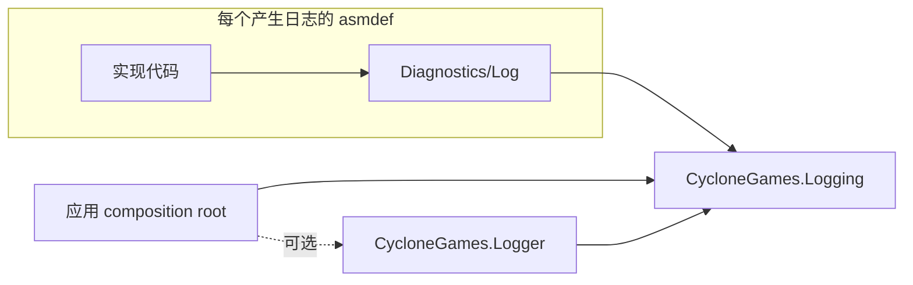

# CycloneGames.Logging

`CycloneGames.Logging` 是 CycloneGames 各包统一使用的引擎无关日志生产者契约。它统一严重级别、类别命名、延迟消息构建、异常报告、空实现默认值、显式注入和进程级后端替换，并且不依赖 Unity 或具体 sink。

## 职责

- `ILogWriter` 是仅供日志生产者使用的后端边界。
- `LogChannel` 将稳定类别绑定到显式 writer 或进程级 fallback。
- `LogWriterGuard` 为无法使用 channel 的 adapter 隔离 writer 与 formatter 的非灾难性故障。
- `LogRuntime` 以原子方式安装或替换进程级 fallback，但从不拥有或释放它。
- `NullLogWriter` 保证独立安装某个包且没有后端时仍可安全、静默运行。

sink 注册、队列、线程、文件输出、Unity 投递、flush 和 shutdown 属于 `CycloneGames.Logger` 等具体后端。

## 程序集与包模型



普通 Runtime、Unity、Editor、Sample 与 integration assembly 产生日志记录时直接引用 `CycloneGames.Logging`。严格 PureCore assembly 可以改为拥有模块本地 diagnostics port，从而不依赖 Logging package；该 port 到 `CycloneGames.Logging` 的桥接必须位于独立 `*.Integrations.Logging` assembly。业务程序集不引用 `CycloneGames.Logger`，具体 backend 只由 host 选择。

该设计明确不使用 PlayerSettings scripting symbol，也不把源码级 `#if` 分散到各包。`Assets/` 下的本地包不能依靠自身 `package.json` 自动判断依赖是否存在，而一个必需、与 Unity 解耦的小型契约在 UPM 与 asset-style 布局中都更确定。可选第三方 backend adapter 应继续放在独立 integration assembly。

## 统一契约

| 类型 | 契约 |
| --- | --- |
| `LogSeverity` | 从 `Trace` 到 `Fatal` 有序排列；`None` 是过滤 sentinel，不用于输出 |
| `ILogWriter` | 接纳检查、字符串/延迟/generic-state 写入，以及结构化异常写入 |
| `LogChannel` | 稳定 category，以及显式 writer 或当前进程 fallback |
| `LogWriterGuard` | 供 adapter 边界使用的 best-effort 保护调用；`TryWrite*` 表示调用完成，不表示成功交付 |
| `LogRuntime` | 原子安装/替换 fallback；不拥有、不 flush、不 dispose |
| `NullLogWriter` | backend 缺失时使用的零分配 disabled 默认实现 |

Category 使用 `CycloneGames.<Package>[.<Area>]`，例如 `CycloneGames.Audio.Editor`。它们可能被 filter 与 dashboard 当作标识符，因此必须保持稳定。消息文本不重复 category。异常应使用 `WriteException`/`Error(exception, message)`，不要只保留 `Exception.Message`，这样 backend 才能保存异常类型、stack 与 inner-exception 证据。

## Assembly 本地日志门面

每个产生日志记录的非 Core package assembly 都在 `Diagnostics/<FeatureName>Log.cs` 中拥有一个内部门面，Samples 与 Benchmarks 也包含在内。可复制示例与生产代码遵循同一契约，因此导入 Sample 不会重新引入另一套日志风格。类型名必须在包内唯一并以 `Log` 结尾；如果多个 assembly 都使用同名 `ModuleLog`，当测试或 integration 获得 internals 可见性后会产生类型歧义。

每个门面至少提供同一组成员：

```csharp
internal static class AudioRuntimeLog
{
    internal const string Category = "CycloneGames.Audio";
    internal static readonly LogChannel Channel = LogChannel.Create(Category);

    internal static LogChannel Create(ILogWriter logWriter)
    {
        return LogChannel.Create(
            Category,
            logWriter ?? throw new ArgumentNullException(nameof(logWriter)));
    }
}
```

- `Category` 拥有该 assembly 的稳定默认 category。
- `Channel` 是供 static 与 Unity 所有入口使用的 ambient channel。
- `Create(ILogWriter logWriter)` 为通过构造创建的服务生成显式绑定 channel。
- 如果 assembly 已有多个稳定 category，可以增加 `EditorChannel` 或 `CreateForCategory` 等含义明确的成员，但仍保留上述最小接口。

只有门面文件调用 `LogChannel.Create`。实现文件统一消费门面，因此 category 变更、writer 注入和策略审计都有单一可发现位置，同时无需再定义 package-specific logger interface。`CycloneGames.Analyzers` 中的 `CG0050` 会检查构造边界与文件约定。

### 严格 PureCore 边界

PureCore assembly 并非只要名称中包含 `Core`：它必须设置 `noEngineReferences: true`，并且完整 asmdef 依赖图不引用 Unity、`CycloneGames.Logging`、`CycloneGames.Logger` 或 Logging integration。架构测试会自动把 production `*.Core` 且 `noEngineReferences: true` 的 asmdef 识别为严格 profile；名称以 `Core` 结尾但明确依赖 Unity 的 assembly 不会被伪装成 PureCore。严格 Core 确实需要暴露 best-effort diagnostics 时，由模块自己持有小型且跨包同形的契约：`I<Module>Diagnostics`、`<Module>DiagnosticLevel`、`<Module>DiagnosticCategories.Root`、`Null<Module>Diagnostics`，以及 `IsEnabled`/`Write`/`WriteException`。静态 Core owner 可以额外公开原子 `<Module>Diagnostics` 替换点，但该替换点不拥有 sink 生命周期。可选 `<Module>LoggingDiagnostics` adapter 位于 `<Module>.Integrations.Logging`，同时引用 Core 和本包，设置 `autoReferenced: false`，并且可以跟随 `LogRuntime.Writer` 或绑定显式 `ILogWriter`。

只有真实的物理 package/assembly 独立需求才能使用本地 port。Core 不得因此引入竞争 backend 配置、文件、线程、队列、Unity bootstrap 或包专用 sink API。非 Core assembly 继续直接使用 `LogChannel`。

## 使用方式

纯 C# 服务优先显式注入：

```csharp
private readonly LogChannel _log;

public NetworkSession(ILogWriter logWriter)
{
    _log = NetworkingRuntimeLog.Create(logWriter);
}
```

静态入口或 Unity 所有的入口可以使用进程级 fallback：

```csharp
private static readonly LogChannel Log = AudioRuntimeLog.Channel;

Log.Warning("Voice budget was exhausted.");
```

Ambient static 字段统一命名为 `Log`，显式注入的 instance 字段统一命名为 `_log`，constructor 或 factory 参数统一命名为 `logWriter`。所有包都使用同一组六个严重级别方法：`Trace`、`Debug`、`Info`、`Warning`、`Error` 和 `Fatal`；每个级别也都支持 `(Exception exception, string message = null)`。消息文本不要重复类别前缀。热路径应使用延迟构建或 generic-state 重载，避免被过滤的日志产生分配。

显式注入不会把 `null` 当作隐含策略。调用方如果确实需要静默行为，应明确传入 `NullLogWriter.Instance`：

```csharp
public CacheService(ILogWriter logWriter)
{
    _log = AssetManagementLog.Create(logWriter);
}

var cache = new CacheService(NullLogWriter.Instance);
```

Ambient channel 不要缓存 `LogRuntime.Writer`：`LogChannel.Create(category)` 会在每次调用时解析它，以便受控 backend 替换能够立即生效。显式 channel 始终绑定注入的 writer。

## 故障与输入契约

通过 `LogChannel` 执行的 producer 操作属于 best-effort 观测旁路：writer 或延迟 formatter 抛出非灾难性 `Exception` 时，`IsEnabled` 返回 `false`，写入则直接返回，不改变业务控制流。直接持有 `ILogWriter` 的 integration adapter 可以通过 `LogWriterGuard` 获得相同边界。`TryWrite* == true` 只表示 writer 调用正常返回；接纳、入队、持久化和交付结果仍由 backend 管理。

这种隔离刻意不是绝对兜底。`OutOfMemoryException` 会继续传播，`StackOverflowException` 也不是可恢复的日志故障。非法构造输入（`null` writer 或空白 category）、`null` 延迟 builder 和 `null` exception 都是调用方编程错误，会在有效 channel 进入 writer 前抛出。`default(LogChannel)`、`LogSeverity.None`、未知 severity 和 `NullLogWriter.Instance` 都是安全静默路径，不会调用 writer 或 builder。直接调用 `ILogWriter` 会绕过 producer 保护。

## 性能契约

default/null 与非法 severity 路径会在 interface dispatch 和延迟 builder 执行前短路。符合契约的 `ILogWriter` 必须先完成接纳判断，再调用延迟 builder。generic-state 重载让热路径可以避免 capturing closure，但不承诺 backend 内部零分配。异常隔离不位于 null 快路径中。这些是聚焦测试覆盖的结构事实，不是已经测量的 Player 或 IL2CPP 性能结论；目标构建仍需使用 Profiler 验证。

## 生命周期与所有权

composition root 创建具体后端，通常通过 `LogRuntime.TryInstallWriter` 安装。`TryReplaceWriter(expected, replacement)` 与 `TryResetWriter(expected)` 使用引用身份 compare/exchange，支持 owner-safe 恢复。`ReplaceWriter` 是无条件管理级 handoff，返回此前未被拥有的 writer；API 不再提供无条件 reset。`LogRuntime` 不执行任何释放。CycloneGames 业务包不得初始化、flush、重启或关闭进程级后端。

`ILogWriter` 实现必须说明线程亲和性，并对 consumer 可能调用它的所有线程保持安全。`LogRuntime` 替换虽然是原子的，但不是完整 handoff protocol：composition root 必须停止新 producer、替换或重置 writer、排空自己拥有的 backend，最后才能 dispose。除非能独立证明所有权，否则不得 dispose `ReplaceWriter` 返回的值。

非法 category 会在创建 channel 时失败。缺少 backend 不是错误，默认保持静默。Writer 的 queue overflow、sink failure、持久化与 shutdown 行为不属于本契约，必须由具体 backend 报告。

## 持久化

本包不写文件或偏好设置，也不拥有序列化资产。文件输出及其保留策略属于具体后端。本包没有缓存，不需要清理。

Runtime 不使用反射、动态代码生成、Unity object 或隐式生命周期发现。静态 fallback 只包含通过 `Interlocked`/`Volatile` 更新的 interface 引用；IL2CPP、stripping 与平台结论仍需由消费它的 Player build 验证。

## UPM 组合

产生日志的包依赖 `com.cyclone-games.logging`。除 host 或具体后端 integration 外，不依赖 `com.cyclone-games.logger`。因此移除后端后，各包仍可编译，ambient channel 会回落到 `NullLogWriter`。

Assembly 独立与 package 安装独立是两个不同边界。严格 Core asmdef 可以完全不引用 Logging，但它所在的 UPM package 仍可能为了其他 assembly 声明 `com.cyclone-games.logging`；安装该 package 时仍会解析 Logging。若使用者必须在不安装 Logging package 的情况下单独安装 Core，就需要独立的物理 Core package root；`autoReferenced: false` 只改变 assembly inclusion，不会改变 UPM 依赖解析。

日志架构不包含 package-specific backend interface 或兼容 shim。非 Core assembly 通过 assembly 本地门面使用 `ILogWriter`/`LogChannel`；严格 PureCore assembly 只能使用标准化模块本地 diagnostics port 和向外的 Logging integration adapter。破坏性迁移会直接删除旧日志入口，不保留并行 API。

## 验证

1. 在没有 Unity engine reference 的条件下编译 `CycloneGames.Logging`。
2. 运行 `CycloneGames.Logging.Tests.Editor`。
3. 验证 ambient channel 会跟随 `LogRuntime.ReplaceWriter`，显式绑定 channel 则保持隔离。
4. 验证某业务包只安装 `com.cyclone-games.logging` 时仍可编译。
5. 运行 `CycloneGames.Analyzers` 测试，并验证 `CG0049`/`CG0050` 会拒绝直接输出 API 与临时 `LogChannel.Create` 调用。
6. 验证自动发现的严格 PureCore 依赖图与 `*.Integrations.Logging` 方向测试通过。
7. 验证源码后备扫描在 Logger backend 之外的受管 production 源码中找不到 `Debug.Log*`、`print`、`Console.Write*` 或直接 `CLogger` 使用。
