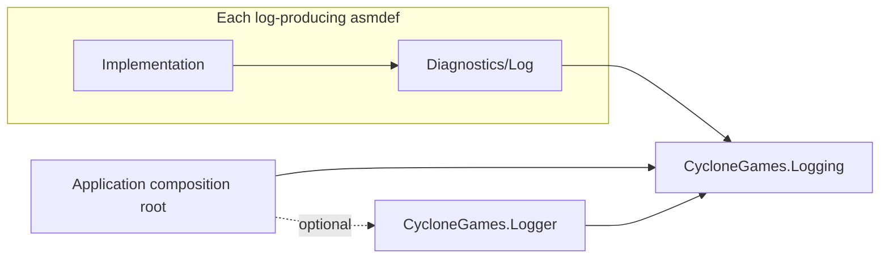

# CycloneGames.Logging

`CycloneGames.Logging` is the engine-independent producer contract used by CycloneGames packages. It standardizes severity, category naming, deferred message construction, exception reporting, null defaults, explicit injection, and process-level backend replacement without depending on Unity or a concrete sink.

## Responsibilities

- `ILogWriter` is the producer-only backend boundary.
- `LogChannel` binds a stable category to either an explicit writer or the process fallback.
- `LogWriterGuard` contains non-catastrophic writer and formatter failures for adapters that cannot use a channel.
- `LogRuntime` atomically installs or replaces the process fallback but never owns or disposes it.
- `NullLogWriter` keeps independently installed packages safe and silent when no backend is present.

Sink registration, queues, threads, file output, Unity delivery, flushing, and shutdown belong to a backend such as `CycloneGames.Logger`.

## Assembly and package model



Ordinary Runtime, Unity, Editor, Sample, and integration assemblies that produce records reference `CycloneGames.Logging` directly. A strict PureCore assembly may instead own a minimal module-local diagnostics port so it has no Logging package dependency; the bridge from that port to `CycloneGames.Logging` belongs to a separate `*.Integrations.Logging` assembly. Business assemblies never reference `CycloneGames.Logger`. The concrete backend is selected only by the host.

This design deliberately does not use PlayerSettings scripting symbols or distributed source-level `#if` blocks. Local packages under `Assets/` cannot use their `package.json` as an automatic presence condition, while a mandatory, Unity-free contract is small and deterministic in both UPM and asset-style layouts. Optional third-party backend adapters should remain in separate integration assemblies.

## Uniform contract

| Type | Contract |
| --- | --- |
| `LogSeverity` | Ordered `Trace` through `Fatal`; `None` is a filtering sentinel and is not emitted |
| `ILogWriter` | Admission check, string/deferred/generic-state writes, and structured exception writes |
| `LogChannel` | Stable category plus either an explicit writer or the current process fallback |
| `LogWriterGuard` | Best-effort protected calls for adapter boundaries; `TryWrite*` reports call completion, not delivery |
| `LogRuntime` | Atomic fallback installation/replacement; no ownership, flush, or disposal |
| `NullLogWriter` | Allocation-free disabled default when a backend is absent |

Categories use `CycloneGames.<Package>[.<Area>]`, for example `CycloneGames.Audio.Editor`. Keep them stable because filters and dashboards may treat them as identifiers. Message text does not repeat the category. Use `WriteException`/`Error(exception, message)` rather than flattening an exception to `Message`, so a backend can preserve type, stack, and inner-exception evidence.

## Assembly-local log facade

Every non-Core package assembly that emits records owns one internal facade at `Diagnostics/<FeatureName>Log.cs`, including Samples and Benchmarks. Copyable examples follow the same contract as production code so importing a sample cannot reintroduce a competing logging style. The type name must be unique across the package and end with `Log`; using the same generic `ModuleLog` name in several assemblies can become ambiguous when tests or integrations receive internals access.

Each facade provides the same minimum surface:

```csharp
internal static class AudioRuntimeLog
{
    internal const string Category = "CycloneGames.Audio";
    internal static readonly LogChannel Channel = LogChannel.Create(Category);

    internal static LogChannel Create(ILogWriter logWriter)
    {
        return LogChannel.Create(
            Category,
            logWriter ?? throw new ArgumentNullException(nameof(logWriter)));
    }
}
```

- `Category` owns the stable default category for that assembly.
- `Channel` is the ambient channel for static and Unity-owned entry points.
- `Create(ILogWriter logWriter)` creates an explicitly bound channel for constructed services.
- An assembly with multiple established categories may add clearly named members such as `EditorChannel` or `CreateForCategory`, but keeps the minimum surface above.

Only facade files call `LogChannel.Create`. Implementation files use the facade, which makes category changes, writer injection, and policy audits discoverable without introducing a package-specific logger interface. `CG0050` in `CycloneGames.Analyzers` checks the construction boundary and file convention.

### Strict PureCore boundary

A PureCore assembly is stricter than merely putting `Core` in its name: it sets `noEngineReferences: true` and its complete asmdef dependency graph references neither Unity, `CycloneGames.Logging`, `CycloneGames.Logger`, nor a Logging integration. The architecture tests automatically treat production `*.Core` asmdefs with `noEngineReferences: true` as this strict profile; a deliberately Unity-dependent assembly whose name ends in `Core` is not silently presented as PureCore. When strict Core must expose best-effort diagnostics, it owns a small module-named contract with the same shape across packages: `I<Module>Diagnostics`, `<Module>DiagnosticLevel`, `<Module>DiagnosticCategories.Root`, `Null<Module>Diagnostics`, and `IsEnabled`/`Write`/`WriteException`. Static Core owners may additionally expose an atomic `<Module>Diagnostics` replacement point that owns no sink lifetime. The optional `<Module>LoggingDiagnostics` adapter lives in `<Module>.Integrations.Logging`, references both Core and this package, sets `autoReferenced: false`, and may follow `LogRuntime.Writer` or bind an explicit `ILogWriter`.

This local port is reserved for a real physical package/assembly independence requirement. It is not permission to add competing backend configuration, files, threads, queues, Unity bootstrap code, or package-specific sink APIs to Core. Non-Core assemblies continue to use `LogChannel` directly.

## Usage

Use explicit injection for plain C# services:

```csharp
private readonly LogChannel _log;

public NetworkSession(ILogWriter logWriter)
{
    _log = NetworkingRuntimeLog.Create(logWriter);
}
```

Static or Unity-owned entry points may use the process fallback:

```csharp
private static readonly LogChannel Log = AudioRuntimeLog.Channel;

Log.Warning("Voice budget was exhausted.");
```

Use `Log` for an ambient static field, `_log` for an injected instance field, and `logWriter` for the constructor or factory parameter. Calls use the same six severity names in every package: `Trace`, `Debug`, `Info`, `Warning`, `Error`, and `Fatal`. Every severity also accepts `(Exception exception, string message = null)`. Messages should not repeat the category as a text prefix. Use deferred or generic-state overloads on hot paths so filtered messages do not allocate.

Explicit injection does not treat `null` as an implicit policy choice. A caller that deliberately wants silence passes `NullLogWriter.Instance`:

```csharp
public CacheService(ILogWriter logWriter)
{
    _log = AssetManagementLog.Create(logWriter);
}

var cache = new CacheService(NullLogWriter.Instance);
```

Do not cache `LogRuntime.Writer` in an ambient channel: `LogChannel.Create(category)` intentionally resolves it on every call so a controlled backend replacement is observed. Explicit channels remain bound to the injected writer.

## Failure and input contract

Producer operations through `LogChannel` are best-effort and observational: `IsEnabled` returns `false`, while writes return without changing business control flow, when a writer or deferred formatter throws a non-catastrophic `Exception`. `LogWriterGuard` provides the same boundary to integration adapters that hold an `ILogWriter` directly. `TryWrite* == true` means only that the writer call returned normally; admission, queueing, persistence, and delivery remain backend-owned outcomes.

This isolation is intentionally not absolute. `OutOfMemoryException` propagates, and `StackOverflowException` is not a recoverable logging failure. Invalid construction input (`null` writer or blank category), a `null` deferred builder, and a `null` exception are caller programming errors and throw before a valid channel enters the writer. `default(LogChannel)`, `LogSeverity.None`, unknown severity values, and `NullLogWriter.Instance` are safe silent paths and never invoke a writer or builder. Direct calls to `ILogWriter` bypass this producer protection.

## Performance contract

The default/null and invalid-severity paths short-circuit before interface dispatch and deferred-builder execution. A conforming `ILogWriter` performs admission before invoking a deferred builder. The generic-state overload allows hot code to avoid a capturing closure; it does not promise zero allocation inside a backend. Exception containment is kept outside the null fast path. These are structural properties verified by focused tests, not measured Player or IL2CPP performance claims; target builds still require profiling.

## Lifecycle and ownership

The composition root creates the concrete backend and normally installs it with `LogRuntime.TryInstallWriter`. `TryReplaceWriter(expected, replacement)` and `TryResetWriter(expected)` provide reference-identity compare/exchange for owner-safe restoration. `ReplaceWriter` is an unconditional administrative handoff and returns the previous unowned writer; there is no unconditional reset API. `LogRuntime` deliberately performs no disposal. CycloneGames packages must not initialize, flush, restart, or shut down the process backend.

`ILogWriter` implementations must document thread affinity and be safe for every thread from which their consumers can write. `LogRuntime` replacement is atomic, but it is not a handoff protocol: the composition root must stop new producers, replace/reset the writer, drain the backend it owns, and only then dispose it. Never dispose the value returned by `ReplaceWriter` unless ownership is independently known.

Invalid categories fail when a channel is created. A missing backend is not an error and stays silent. Writer-specific queue overflow, sink failure, persistence, and shutdown behavior are intentionally outside this contract and must be reported by that backend.

## Persistence

This package writes no files or preferences and owns no serialized assets. File output and its retention policy are backend concerns. The package has no cache and requires no cleanup.

The runtime uses no reflection, dynamic code generation, Unity object, or implicit lifecycle discovery. Its static fallback contains only an interface reference updated with `Interlocked`/`Volatile`; IL2CPP, stripping, and platform validation still belong to the consuming Player build.

## UPM composition

Packages that produce logs depend on `com.cyclone-games.logging`. They do not depend on `com.cyclone-games.logger` unless they are a host or concrete backend integration. Removing the backend therefore leaves packages compilable and routes ambient channels to `NullLogWriter`.

Assembly independence and package installation independence are different boundaries. A strict Core asmdef can have no Logging reference while its containing UPM package still declares `com.cyclone-games.logging` for another assembly. Installing that package will still resolve Logging. A consumer that must install Core without the Logging package needs a separate physical Core package root; `autoReferenced: false` changes assembly inclusion, not UPM dependency resolution.

Package-specific backend interfaces and compatibility shims are not part of the logging architecture. Non-Core assemblies use `ILogWriter`/`LogChannel` through assembly-local facades; strict PureCore assemblies may use only the standardized local diagnostics port and an outward Logging integration adapter. Breaking migrations remove old logging entry points instead of retaining parallel APIs.

## Validation

1. Compile `CycloneGames.Logging` without Unity engine references.
2. Run `CycloneGames.Logging.Tests.Editor`.
3. Verify a channel follows `LogRuntime.ReplaceWriter` while an explicitly bound channel remains isolated.
4. Verify a package compiles with only `com.cyclone-games.logging` installed.
5. Run `CycloneGames.Analyzers` tests and verify `CG0049`/`CG0050` reject direct output APIs and ad hoc `LogChannel.Create` calls.
6. Verify the automatically discovered strict PureCore dependency graphs and `*.Integrations.Logging` direction tests pass.
7. Verify the source backstop finds no `Debug.Log*`, `print`, `Console.Write*`, or direct `CLogger` use in governed production sources outside the Logger backend.
