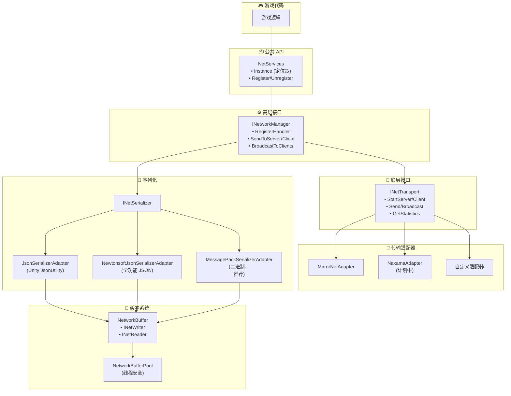
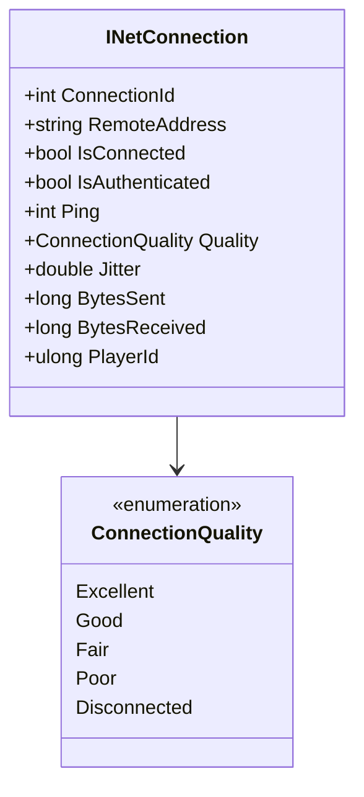
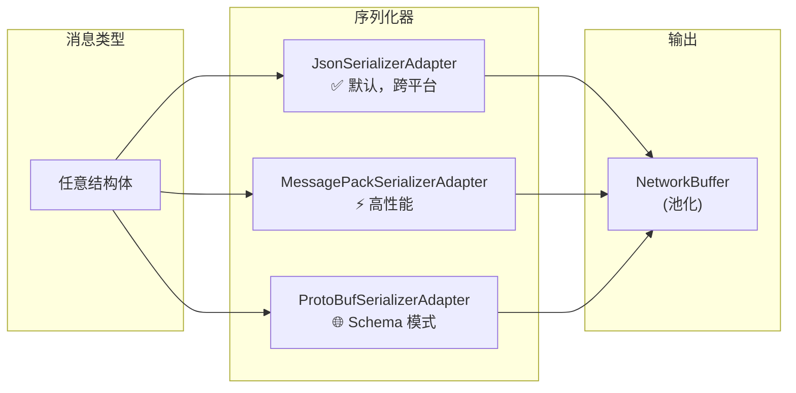
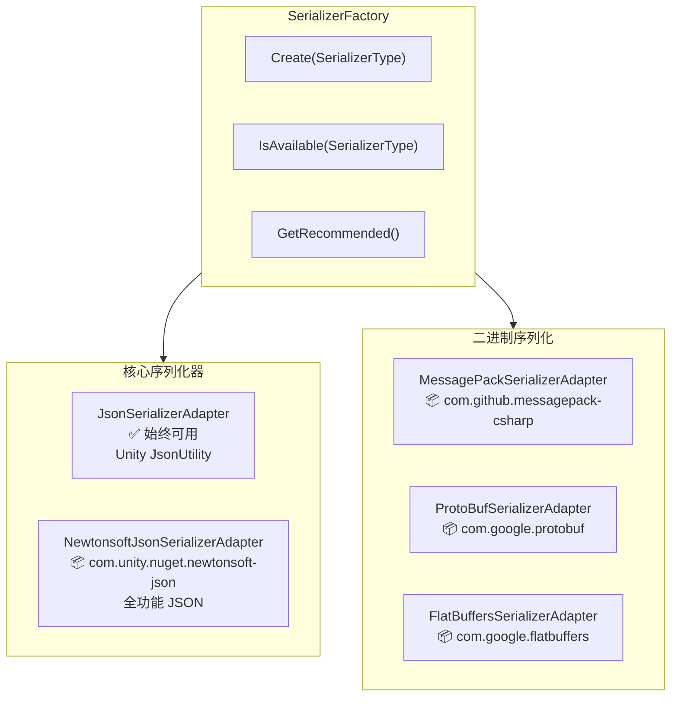

# CycloneGames.Networking

<div align="left"><a href="./README.md">English</a> | 简体中文</div>

一个为 Unity 设计的生产级网络抽象层，专注于**零 GC 运行时性能**、**线程安全**和**跨平台兼容性**。它提供了清晰的接口，将您的游戏逻辑代码与特定的网络实现（如 Mirror 或 Nakama）解耦。

## 特性

- **灵活的序列化**: 可插拔序列化方案 (Json, MessagePack, ProtoBuf, FlatBuffers)，支持跨平台
- **清晰的抽象**: 与传输层无关的接口（`INetTransport`, `INetworkManager`, `INetConnection`）
- **适配器模式**: 无需修改游戏逻辑即可切换底层传输层（Mirror、Nakama、自定义）
- **线程安全**: 使用 `ArrayPool` 的跨线程消息队列，支持安全的非主线程发送
- **全面的诊断**: 连接质量指标、统计跟踪和错误事件

## 核心架构

该框架由几个关键组件构建而成，它们协同工作，提供了一套全面的网络解决方案。



### 1. `NetServices` (服务定位器)

静态服务定位器，提供对活动 `INetworkManager` 的全局访问。同时支持依赖注入和服务定位器模式。

```csharp
// 通过服务定位器访问
var net = NetServices.Instance;
net.SendToServer(1001, new MyMessage { Value = 42 });
```

### 2. `INetworkManager` (高层接口)

游戏逻辑代码的主要接口。处理消息注册、类型化序列化和路由。

**核心方法:**

- `RegisterHandler<T>()` - 注册消息处理器
- `SendToServer<T>()` / `SendToClient<T>()` - 发送类型化消息
- `BroadcastToClients<T>()` - 广播给所有客户端

### 3. `INetTransport` (底层接口)

传输抽象层。处理原始字节 I/O、连接生命周期和传输特定功能。

**核心属性:**

- `IsServer` / `IsClient` / `IsRunning`
- `Available` - 平台可用性检查
- `GetMaxPacketSize()` - 最大负载大小
- `GetStatistics()` - 传输诊断

### 4. `INetConnection` (连接表示)

表示单个网络连接，包含全面的指标。



### 5. 序列化系统

框架支持多种跨平台序列化适配器：



## 依赖项

- `Mirror` (可选，通过条件编译 `#if MIRROR`)
- `Nakama` (计划中，通过条件编译)

## 快速上手指南

### 步骤 1: 场景设置 (Mirror)

1. **确保已安装 Mirror** 到您的项目中
2. **添加 MirrorNetAdapter** 到场景中的 GameObject：
   - 创建一个名为 "NetworkManager" 的新 GameObject
   - 添加 `MirrorNetAdapter` 组件
   - 按照常规配置您的 Mirror 传输层

```csharp
// MirrorNetAdapter 在 Awake 时自动注册自己
// 在代码的任何地方通过 NetServices 访问
var net = NetServices.Instance;
```

### 步骤 2: 定义网络消息

```csharp
// ✅ 零 GC 消息 - 仅基本类型，无引用
public struct PositionUpdate
{
    public int EntityId;
    public float X;
    public float Y;
    public float Z;
}

// ✅ 零 GC 消息 - 固定大小数组也可以
public unsafe struct ChatMessage
{
    public int SenderId;
    public fixed char Content[64]; // 固定缓冲区，无分配
}

// ⚠️ 非零 GC - 包含托管类型 (string)
// 对于这些类型使用 FallbackJsonSerializer
public struct PlayerInfo
{
    public int Id;
    // string 是引用类型 - 会导致内存分配！
}
```

### 步骤 3: 注册消息处理器

```csharp
using CycloneGames.Networking;
using UnityEngine;

public class NetworkExample : MonoBehaviour
{
    // 消息 ID - 使用常量保持一致性
    private const ushort MSG_POSITION = 1001;
    private const ushort MSG_CHAT = 1002;

    private void Start()
    {
        var net = NetServices.Instance;

        // 为传入消息注册处理器
        net.RegisterHandler<PositionUpdate>(MSG_POSITION, OnPositionReceived);
        net.RegisterHandler<ChatMessage>(MSG_CHAT, OnChatReceived);
    }

    private void OnPositionReceived(INetConnection conn, PositionUpdate msg)
    {
        Debug.Log($"玩家 {conn.ConnectionId} 移动到 ({msg.X}, {msg.Y}, {msg.Z})");
        Debug.Log($"连接质量: {conn.Quality}, 延迟: {conn.Ping}ms");
    }

    private void OnChatReceived(INetConnection conn, ChatMessage msg)
    {
        // 处理聊天消息
    }

    private void OnDestroy()
    {
        var net = NetServices.Instance;
        net.UnregisterHandler(MSG_POSITION);
        net.UnregisterHandler(MSG_CHAT);
    }
}
```

### 步骤 4: 发送消息

```csharp
public class PlayerController : MonoBehaviour
{
    private const ushort MSG_POSITION = 1001;

    private void Update()
    {
        // 仅在输入或位置变化时发送
        if (PositionChanged())
        {
            SendPosition();
        }
    }

    private void SendPosition()
    {
        var net = NetServices.Instance;
        var pos = transform.position;

        // 发送消息 - 使用配置的序列化器（默认 Json，如果可用则使用 MessagePack）
        net.SendToServer(MSG_POSITION, new PositionUpdate
        {
            EntityId = gameObject.GetInstanceID(),
            X = pos.x,
            Y = pos.y,
            Z = pos.z
        });
    }

    private bool PositionChanged() => true; // 您的逻辑
}
```

### 步骤 5: 服务端广播

```csharp
public class GameServer : MonoBehaviour
{
    private const ushort MSG_SPAWN = 1003;

    private void Start()
    {
        var net = NetServices.Instance;

        // 监听传输层事件
        net.Transport.OnClientConnected += OnClientConnected;
        net.Transport.OnClientDisconnected += OnClientDisconnected;
        net.Transport.OnError += OnNetworkError;
    }

    private void OnClientConnected(INetConnection conn)
    {
        Debug.Log($"客户端已连接: {conn.ConnectionId} 来自 {conn.RemoteAddress}");

        // 向所有客户端发送生成消息
        net.BroadcastToClients(MSG_SPAWN, new SpawnMessage
        {
            EntityId = conn.ConnectionId,
            X = 0, Y = 0, Z = 0
        });
    }

    private void OnClientDisconnected(INetConnection conn)
    {
        Debug.Log($"客户端已断开: {conn.ConnectionId}");
    }

    private void OnNetworkError(INetConnection conn, TransportError error, string message)
    {
        Debug.LogError($"网络错误 {conn?.ConnectionId}: {error} - {message}");
    }
}
```

## 高级用法

### 直接使用池化缓冲区

为了最大限度控制序列化：

```csharp
using CycloneGames.Networking;

public class AdvancedNetworking : MonoBehaviour
{
    private void SendCustomData()
    {
        // 获取池化缓冲区（零分配）
        using (var buffer = NetworkBufferPool.Get())
        {
            // 手动写入数据
            buffer.WriteInt(42);
            buffer.WriteFloat(3.14f);
            buffer.WriteBlittable(new Vector3(1, 2, 3)); // 仅非托管类型！

            // 发送原始字节
            var transport = NetServices.Instance.Transport;
            int channelId = transport.GetChannelId(NetworkChannel.Reliable);
            transport.Send(connection, buffer.ToArraySegment(), channelId);
        }
        // 缓冲区在 Dispose 时自动返回池
    }
}
```

### 连接质量监控

```csharp
public class ConnectionMonitor : MonoBehaviour
{
    private void Update()
    {
        if (!NetServices.IsAvailable) return;

        var stats = NetServices.Instance.Transport.GetStatistics();

        // 显示统计信息
        Debug.Log($"发送字节: {stats.BytesSent}");
        Debug.Log($"接收字节: {stats.BytesReceived}");
        Debug.Log($"发送包数: {stats.PacketsSent}");
        Debug.Log($"活动连接: {stats.ConnectionCount}");
    }

    private void MonitorConnectionQuality(INetConnection conn)
    {
        switch (conn.Quality)
        {
            case ConnectionQuality.Excellent:
                // < 50ms RTT，非常稳定
                break;
            case ConnectionQuality.Good:
                // 50-100ms RTT
                break;
            case ConnectionQuality.Fair:
                // 100-200ms RTT
                break;
            case ConnectionQuality.Poor:
                // > 200ms RTT 或不稳定
                ShowWarning("检测到连接不良！");
                break;
        }

        // 抖动表示连接稳定性
        if (conn.Jitter > 50)
        {
            ShowWarning("高抖动 - 考虑降低发送频率");
        }
    }
}
```

### 序列化器适配器

框架通过适配器模式支持多种序列化库。每个序列化器在其包安装后会自动启用。



#### 推荐策略

| 阶段         | 序列化器       | 原因                                 |
| ------------ | -------------- | ------------------------------------ |
| **开发阶段** | NewtonsoftJson | 人类可读，易于调试，全功能 JSON 支持 |
| **生产环境** | MessagePack    | 二进制格式，体积更小，解析更快       |

```csharp
// 根据构建类型配置
#if DEVELOPMENT_BUILD || UNITY_EDITOR
    adapter.SetSerializer(SerializerFactory.Create(SerializerType.NewtonsoftJson));
#else
    adapter.SetSerializer(SerializerFactory.GetRecommended()); // 如果可用则使用 MessagePack
#endif
```

#### 使用 SerializerFactory

```csharp
using CycloneGames.Networking;

public class GameInitializer : MonoBehaviour
{
    private void Start()
    {
        // 检查哪些序列化器可用
        Debug.Log($"MessagePack: {SerializerFactory.IsAvailable(SerializerType.MessagePack)}");
        Debug.Log($"ProtoBuf: {SerializerFactory.IsAvailable(SerializerType.ProtoBuf)}");
        Debug.Log($"FlatBuffers: {SerializerFactory.IsAvailable(SerializerType.FlatBuffers)}");

        // 获取推荐的序列化器 (MessagePack > NewtonsoftJson > Json)
        INetSerializer serializer = SerializerFactory.GetRecommended();

        // 或创建特定的序列化器
        if (SerializerFactory.IsAvailable(SerializerType.MessagePack))
        {
            serializer = SerializerFactory.Create(SerializerType.MessagePack);
        }

        // 注入到适配器
        var adapter = FindObjectOfType<MirrorNetAdapter>();
        adapter.SetSerializer(serializer);
    }
}
```

#### MessagePack 集成

[MessagePack-CSharp](https://github.com/MessagePack-CSharp/MessagePack-CSharp) 提供出色的性能和最小的内存分配。

**设置:**

1. 安装 `com.github.messagepack-csharp` 包
2. `MESSAGEPACK` 定义会自动设置
3. 在消息类型上添加 `[MessagePackObject]` 特性

```csharp
using MessagePack;

// MessagePack 消息定义
[MessagePackObject]
public struct PlayerState
{
    [Key(0)] public int PlayerId;
    [Key(1)] public float X;
    [Key(2)] public float Y;
    [Key(3)] public float Z;
    [Key(4)] public float Health;
}

// 使用
var serializer = SerializerFactory.Create(SerializerType.MessagePack);
adapter.SetSerializer(serializer);

// 现在消息使用 MessagePack 序列化
net.SendToServer(1001, new PlayerState { PlayerId = 1, X = 10, Y = 0, Z = 5, Health = 100 });
```

#### ProtoBuf 集成（计划中）

[Protocol Buffers](https://developers.google.com/protocol-buffers) 用于基于模式的序列化。

**设置:**

1. 安装 Google.Protobuf 包
2. 将 `PROTOBUF` 添加到 Scripting Define Symbols
3. 定义 `.proto` 模式并使用 `protoc` 生成 C# 代码

```protobuf
// player.proto
syntax = "proto3";
message PlayerState {
    int32 player_id = 1;
    float x = 2;
    float y = 3;
    float z = 4;
    float health = 5;
}
```

```csharp
// 使用生成的代码
var serializer = SerializerFactory.Create(SerializerType.ProtoBuf);
adapter.SetSerializer(serializer);
```

#### FlatBuffers 集成（计划中）

[FlatBuffers](https://google.github.io/flatbuffers/) 用于零拷贝反序列化。

**设置:**

1. 安装 com.google.flatbuffers 包
2. 将 `FLATBUFFERS` 添加到 Scripting Define Symbols
3. 定义 `.fbs` 模式并使用 `flatc` 生成 C# 代码

```csharp
// FlatBuffers 提供对底层缓冲区的零拷贝访问
using CycloneGames.Networking.Serializer.FlatBuffers;

// 包装接收到的缓冲区以进行零拷贝访问
var byteBuffer = FlatBuffersSerializerAdapter.WrapBuffer(receivedData);
var playerState = PlayerState.GetRootAsPlayerState(byteBuffer);

// 直接从缓冲区访问字段 - 没有反序列化开销！
float x = playerState.X;
float y = playerState.Y;
```

#### 自定义序列化器实现

如果您需要集成其他序列化库：

```csharp
public class MemoryPackSerializerAdapter : INetSerializer
{
    public void Serialize<T>(in T value, byte[] buffer, int offset, out int writtenBytes)
        where T : struct
    {
        var span = buffer.AsSpan(offset);
        writtenBytes = MemoryPackSerializer.Serialize(span, value);
    }

    public void Serialize<T>(in T value, INetWriter writer) where T : struct
    {
        // 对小消息使用 stackalloc
        Span<byte> temp = stackalloc byte[256];
        int written = MemoryPackSerializer.Serialize(temp, value);
        writer.WriteBytes(temp.Slice(0, written));
    }

    public T Deserialize<T>(ReadOnlySpan<byte> data) where T : struct
    {
        return MemoryPackSerializer.Deserialize<T>(data);
    }

    public T Deserialize<T>(INetReader reader) where T : struct
    {
        var span = reader.ReadBytesSpan(reader.Remaining);
        return Deserialize<T>(span);
    }
}

// 注册自定义序列化器
adapter.SetSerializer(new MemoryPackSerializerAdapter());
```

#### 序列化器对比

| 序列化器           | 零 GC | 格式              |  速度  | 大小 |  跨平台   | 最适合           |
| ------------------ | :---: | ----------------- | :----: | :--: | :-------: | ---------------- |
| **Json**           |  ❌   | 文本              |   ⚡   |  大  | ✅ 全平台 | 简单结构体       |
| **NewtonsoftJson** |  ❌   | 文本              |   ⚡   |  大  | ✅ 全平台 | 开发，调试       |
| **MessagePack**    | ✅\*  | 二进制 + 特性标注 |  ⚡⚡  |  小  | ✅ 全平台 | 生产环境（推荐） |
| **ProtoBuf**       | ✅\*  | 二进制 + Schema   |  ⚡⚡  |  小  | ✅ 全平台 | 前后端通信       |
| **FlatBuffers**    |  ✅   | 二进制 + Schema   | ⚡⚡⚡ |  中  | ✅ 全平台 | 零拷贝高频读取   |

> **说明:**
>
> - \*正确使用时；复杂类型可能会有一些分配
> - **跨平台**: 全平台 = 支持 Unity/C#, Go, Rust, Java, Python, C++ 等
> - **Json** 使用 Unity 的 JsonUtility (不支持 Dictionary)
> - **NewtonsoftJson** 支持 Dictionary, 多态, 自定义转换器

## 传输层适配器

### Mirror 适配器

**激活:**
将 `MIRROR` 添加到项目的 Scripting Define Symbols。

**功能:**

- 使用推荐的序列化器（MessagePack 如可用，否则 Json）
- 用于跨线程发送的线程安全消息队列
- 完整的统计跟踪
- 错误事件转发

### 创建自定义适配器

为自定义传输层实现 `INetTransport` 和 `INetworkManager`：

```csharp
public class CustomNetAdapter : MonoBehaviour, INetTransport, INetworkManager
{
    // 实现所有接口成员
    // 在 Awake 时调用 NetServices.Register(this)
}
```

## 最佳实践

### 1. 消息设计

```csharp
// ✅ 推荐：使用小而精的消息
public struct PositionUpdate
{
    public int EntityId;
    public float X, Y, Z;
} // 16 字节

// ❌ 不推荐：创建大型整体消息
public struct BadGameState
{
    public fixed byte Data[4096]; // 太大，可能超过 MTU
}
```

### 2. 发送频率控制

```csharp
private float _lastSendTime;
private const float SendInterval = 0.05f; // 20 Hz

private void Update()
{
    if (Time.time - _lastSendTime >= SendInterval)
    {
        SendPositionUpdate();
        _lastSendTime = Time.time;
    }
}
```

### 3. 错误处理

```csharp
private void Start()
{
    var transport = NetServices.Instance.Transport;
    transport.OnError += (conn, error, msg) =>
    {
        switch (error)
        {
            case TransportError.Timeout:
                AttemptReconnect();
                break;
            case TransportError.ConnectionClosed:
                ReturnToMainMenu();
                break;
        }
    };
}
```
