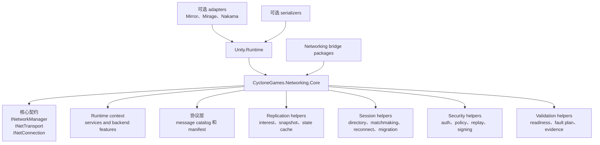
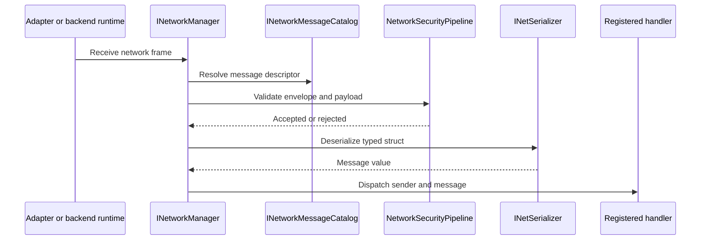

# CycloneGames.Networking

[English](./README.md) | 简体中文

`CycloneGames.Networking` 是 CycloneGames runtime packages 使用的传输无关网络基础包。它定义 network manager、transport、connection、serializer、message catalog、protocol manifest、runtime profile、replication planning、session discovery、reconnection、host migration、security validation 和可选 backend adapter 的通用契约。

本包是 framework layer，不是完整在线服务。具体 transport、platform identity、relay service、server orchestration、persistence 和游戏专属 replication rule 由 adapter 或项目 package 提供。

## 包结构

```text
CycloneGames.Networking/
  Core/
    Authentication/     Authentication provider contract 和 provider chain
    Buffers/            Managed buffer pooling helper
    Core/               INetworkManager、INetTransport、INetConnection、runtime context、message catalog
    Hardening/          Readiness scenario、fault plan、validation evidence 和 probe
    Lockstep/           Lockstep tick 和 command contract
    Profile/            Runtime profile、protocol manifest、node capabilities
    Replay/             Rollback 和 replay contract
    Replication/        Interest、snapshot、state cache、send budget、load simulation
    Routing/            Message routing contract
    Rpc/                RPC attribute 和 metadata
    Scene/              Network scene contract
    Security/           Message validation、security pipeline、replay guard、signer、crypto interface
    Serialization/      Serializer contract 和内置 serializer factory
    Services/           Service registration helper
    Session/            Session、directory、matchmaking、reconnection、host migration
    Spawning/           Network spawn manager contract
    StateSync/          State synchronization contract
    Transports/         Transport adapter base contract
  Unity.Runtime/
    Adapters/           可选 Mirror、Mirage 和 Nakama adapter
    Serializers/        可选 serializer integration
  DOD/Runtime/          Data-oriented runtime helper
  Editor/               Editor diagnostics
  Tests/Editor/         EditMode tests
```

## 程序集边界

| Assembly | 职责 |
| --- | --- |
| `CycloneGames.Networking.Core` | 纯 C# networking contract、profile、catalog、replication、session、security 和 validation helper。 |
| `CycloneGames.Networking.Unity.Runtime` | Unity runtime bridge 和 adapter-facing helper。 |
| `CycloneGames.Networking.DOD.Runtime` | Data-oriented runtime helper。 |
| `CycloneGames.Networking.Editor` | Editor diagnostics 和 tooling。 |
| `CycloneGames.Networking.Tests.Editor` | EditMode regression tests。 |
| `CycloneGames.Networking.Adapter.Mirror` | 可选 Mirror adapter assembly。 |
| `CycloneGames.Networking.Adapter.Mirage` | 可选 Mirage adapter assembly。 |
| `CycloneGames.Networking.Adapter.Nakama` | 可选 Nakama adapter assembly。 |
| `CycloneGames.Networking.Serializer.*` | 可选 serializer integration assemblies。 |

Core assembly 的 public contract 不暴露 UnityEngine 类型。Unity 相关行为隔离在 runtime、adapter、serializer 或 editor assembly 中。

## 架构概览


```mermaid
graph TD
    Core["CycloneGames.Networking.Core"]
    Contracts["核心契约<br/>INetworkManager<br/>INetTransport<br/>INetConnection"]
    Runtime["Runtime context<br/>services and backend features"]
    Protocol["协议层<br/>message catalog 和 manifest"]
    Replication["Replication helpers<br/>interest、snapshot、state cache"]
    Session["Session helpers<br/>directory、matchmaking、reconnect、migration"]
    Security["Security helpers<br/>auth、policy、replay、signing"]
    Validation["Validation helpers<br/>readiness、fault plan、evidence"]
    UnityRuntime["Unity.Runtime"]
    Adapters["可选 adapters<br/>Mirror、Mirage、Nakama"]
    Serializers["可选 serializers"]
    GameplayPackages["Networking bridge packages"]

    Core --> Contracts
    Core --> Runtime
    Core --> Protocol
    Core --> Replication
    Core --> Session
    Core --> Security
    Core --> Validation
    UnityRuntime --> Core
    Adapters --> UnityRuntime
    Serializers --> UnityRuntime
    GameplayPackages --> Core
```

## 核心运行时契约

| Contract | 作用 |
| --- | --- |
| `INetworkManager` | Gameplay-facing 主入口，负责注册 handler、发送到 server、发送到 client、broadcast 和 disconnect client。 |
| `INetTransport` | 更底层的 transport lifecycle 和 byte send/receive abstraction。 |
| `INetConnection` | Connection identity、player id、address、authentication state 和 connection state。 |
| `INetSerializer` | Network manager 和 bridge package 使用的 struct serializer contract。 |
| `INetworkRuntimeContext` | Adapter instance 的 runtime service container。 |
| `INetworkMessageCatalog` | Message descriptor、message range 和 protocol fingerprint 的 thread-safe registry。 |
| `NetworkRuntimeProfile` | 不可变 runtime capacity/timing profile，带 project-extensible keyed settings。 |
| `NetworkNodeCapabilities` | 面向 client、relay、gateway、server 或 custom node 的 string-backed capability model。 |

## 消息管线


```mermaid
sequenceDiagram
    participant Adapter as Adapter or backend runtime
    participant Manager as INetworkManager
    participant Catalog as INetworkMessageCatalog
    participant Security as NetworkSecurityPipeline
    participant Serializer as INetSerializer
    participant Handler as Registered handler

    Adapter->>Manager: Receive network frame
    Manager->>Catalog: Resolve message descriptor
    Manager->>Security: Validate envelope and payload
    Security-->>Manager: Accepted or rejected
    Manager->>Serializer: Deserialize typed struct
    Serializer-->>Manager: Message value
    Manager->>Handler: Dispatch sender and message
```

## 基础消息流程

`INetworkManager` 让 gameplay code 与具体 transport 解耦。启动时注册 handler，再通过 manager 发送 typed struct message。

```csharp
using CycloneGames.Networking;

public readonly struct ChatLineMessage
{
    public readonly uint SenderNetworkId;
    public readonly string Text;

    public ChatLineMessage(uint senderNetworkId, string text)
    {
        SenderNetworkId = senderNetworkId;
        Text = text ?? string.Empty;
    }
}

public sealed class ChatNetworkEndpoint
{
    private const ushort CHAT_LINE_MESSAGE_ID = 30000;
    private readonly INetworkManager _networkManager;

    public ChatNetworkEndpoint(INetworkManager networkManager)
    {
        _networkManager = networkManager;
        _networkManager.RegisterHandler<ChatLineMessage>(CHAT_LINE_MESSAGE_ID, OnChatLine);
    }

    public void SendToServer(ChatLineMessage message)
    {
        _networkManager.SendToServer(CHAT_LINE_MESSAGE_ID, message, NetworkChannel.Reliable);
    }

    private static void OnChatLine(INetConnection sender, ChatLineMessage message)
    {
        // Dispatch to gameplay or UI code owned by the project.
    }
}
```

## Message ID 与 Protocol Manifest

Global message id range 由 `NetworkConstants` 定义，并通过 `NetworkMessageRanges` 暴露。

| Range | IDs | Owner |
| --- | ---: | --- |
| System | `0-999` | Core system messages |
| RPC | `1000-9999` | RPC layer |
| Module | `10000-29999` | Cyclone package modules |
| User | `30000-65535` | Project or product assemblies |

Cyclone packages 注册 module range。项目消息使用 `NetworkMessageKind.User` range。

```csharp
using CycloneGames.Networking;

public static class ProjectCombatProtocol
{
    public const ushort MIN_ID = 30000;
    public const ushort MAX_ID = 30999;
    public const ushort HIT_CONFIRM_ID = MIN_ID;

    public static NetworkProtocolManifest CreateManifest()
    {
        return new NetworkProtocolManifestBuilder(
                "Project.Combat",
                MIN_ID,
                MAX_ID,
                NetworkMessageKind.User)
            .AddMessage<HitConfirmMessage>(HIT_CONFIRM_ID, NetworkChannel.Reliable, 128)
            .SetMetadata("module", "Combat")
            .Build();
    }
}

public readonly struct HitConfirmMessage
{
    public readonly uint Source;
    public readonly uint Target;

    public HitConfirmMessage(uint source, uint target)
    {
        Source = source;
        Target = target;
    }
}
```

通过 `INetworkMessageCatalog.RegisterProtocolManifest` 注册 manifest。Catalog 会拒绝重叠 range 和重复 id。

### 模块协议与握手

每个 Cyclone 域模块都用一个 `NetworkModuleProtocol` 封装自己的 manifest，因此版本校验、
catalog 解析和注册逻辑只存在一处，而不是在每个模块里复制。wire 版本窗口**从 manifest 派生**
（取 manifest 的 `CurrentVersion` / `MinimumSupportedVersion`，它们同时参与 fingerprint），
因此 manifest 是唯一真相源，模块版本永远不会与之 drift：

```csharp
public static class ProjectCombatProtocol
{
    public const byte PROTOCOL_VERSION = 1;
    public const byte MIN_SUPPORTED_PROTOCOL_VERSION = 1;

    // Module 是唯一真相源：由 manifest（上面常量写入 CurrentVersion / MinimumSupportedVersion）构造，
    // 并从中派生版本窗口。manifest / range / fingerprint 从 Module 派生一次存入只读字段：
    // 单一源、无重复构造、热路径上零成本字段读取。
    public static readonly NetworkModuleProtocol Module = new NetworkModuleProtocol(CreateManifest());

    public static readonly NetworkProtocolManifest DefaultManifest = Module.Manifest;
    public static readonly NetworkMessageIdRange MessageRange = Module.MessageRange;
    public static readonly ulong ProtocolFingerprint = Module.Fingerprint;

    public static bool TryRegister(INetworkManager net) => Module.TryRegister(net);
    public static bool IsSupportedProtocolVersion(byte v) => Module.IsSupportedProtocolVersion(v);
}
```

连接级握手消息实现 `INetworkProtocolHandshakeMessage`（一个只含字段的消息契约 — 协商逻辑在
`NetworkProtocolHandshake` 辅助类里），让版本/指纹协商只写一次。用显式接口成员实现以保留
wire 字段，并通过 `NetworkProtocolHandshake.Negotiate` 执行兼容性校验（泛型 `in` 约束，zero-GC）：

```csharp
public struct CombatHandshake : INetworkProtocolHandshakeMessage
{
    public ulong ProtocolFingerprint;
    public byte MinimumSupportedProtocolVersion;
    public byte CurrentProtocolVersion;

    ulong INetworkProtocolHandshakeMessage.ProtocolFingerprint => ProtocolFingerprint;
    byte INetworkProtocolHandshakeMessage.CurrentProtocolVersion => CurrentProtocolVersion;
    byte INetworkProtocolHandshakeMessage.MinimumSupportedProtocolVersion => MinimumSupportedProtocolVersion;
    ulong INetworkProtocolHandshakeMessage.DomainStateHash => 0UL; // or a module-specific hash

    public NetworkHandshakeResult Negotiate()
        => NetworkProtocolHandshake.Negotiate(this, ProjectCombatProtocol.Module);
}
```

`Negotiate` 返回 `NetworkHandshakeResult`（`Compatible`、`Malformed`、`FingerprintMismatch`、
`VersionIncompatible`、`DomainStateMismatch`），便于诊断拒绝原因。当对端还必须就模块特定
指纹达成一致时（例如共享的 gameplay-tag manifest 或 behavior-tree template），设置
`DomainStateHash` 并传 `requireDomainStateMatch: true`。

## Runtime Context

`NetworkRuntimeContext` 保存 adapter instance 暴露的服务。Constructor 会注册 network manager、message catalog，以及存在的 transport。

```csharp
using CycloneGames.Networking;

public static class RuntimeContextFactory
{
    public static INetworkRuntimeContext Create(INetworkManager manager)
    {
        return new NetworkRuntimeContext(
                NetworkRuntimeId.FromAsciiCode("Custom"),
                "Custom Runtime",
                manager,
                NetworkBackendFeatures.RealtimeTransport)
            .AddFeature(NetworkBackendFeatures.AuthSession)
            .Build();
    }
}
```

可选 module package 通过该 context 查找 `INetworkMessageCatalog`、`NetworkRuntimeProfile` 和 security helper 等共享服务，不绑定特定 DI 容器。

## Runtime Profile 与 Capability

`NetworkRuntimeProfile` 保存常用 capacity 和 timing 值：

- `MaxConnections`
- `TickRate`
- `SendRate`
- `Mtu`
- `MaxPayloadBytes`
- `BufferSize`
- `PoolSize`
- `SnapshotBufferSize`
- `SessionSearchMaxResults`
- Timeout、heartbeat、reconnect 和 host migration window

`NetworkRuntimeProfileBuilder.SetInt`、`SetFloat` 和 `SetString` 用于添加项目自有设置，无需修改 Cyclone source。

`NetworkNodeCapabilities` 使用 string-backed `NetworkCapabilityId`。Capability discovery 因此能覆盖项目 runtime、platform service 或 custom deployment node。

## Replication Helpers

`Replication` 文件夹包含纯 C# state replication helper：

| Type | 作用 |
| --- | --- |
| `NetworkReplicationPolicy` | 描述 interest mode、reason、owner/team/layer data、priority 和 distance。 |
| `NetworkReplicationPlanner` | 使用 policy 和 interest evaluator 选择 replicated object 的 observers。 |
| `NetworkReplicationStateCache` | 保存 per-connection/object send state、sequence、hash 和 tick metadata。 |
| `NetworkSnapshotPacketBuilder` | 从 `INetworkSnapshotPayloadSource` 写入 snapshot packet entries。 |
| `NetworkSpatialHashIndex` | 用于 interest query 的 spatial index。 |
| `AdaptiveNetworkSendScheduler` | 根据 budget 和 load signal 计算 send cadence。 |
| `NetworkReplicationLoadSimulator` | 用于 validation 和 sizing 的 deterministic replication load probe。 |

GameplayAbilities、GameplayTags、BehaviorTree、AIPerception、Interaction 和 Movement 等 gameplay package 会在这些通用 helper 之上定义各自的 payload DTO 和协议范围。

## Session、Discovery、Reconnection 与 Host Migration

`Session` 文件夹包含 backend-neutral runtime model：

| Type | 作用 |
| --- | --- |
| `NetworkSession` | Mutable session model，包含 id、name、mode、map、address、port、players、state 和 properties。 |
| `NetworkSessionDirectory` | `NetworkSessionDescriptor` 的 in-memory searchable directory。 |
| `NetworkMatchmakingCoordinator` | 在 join session、create session、queue matchmaking 和 no match 之间产出计划。 |
| `ReconnectionManager` | 跟踪 reconnect reservation 和 catch-up state。 |
| `HostMigrationCoordinator` | 选择新的 host candidate，并创建 authority transfer plan。 |

Session search 示例：

```csharp
using System.Collections.Generic;
using CycloneGames.Networking.Session;

public static class SessionSearchExample
{
    public static int FindLanRooms(NetworkSessionDirectory directory, List<NetworkSessionDescriptor> results)
    {
        var criteria = new NetworkSessionSearchCriteria
        {
            RequiredConnectivity = NetworkSessionConnectivity.Lan,
            HideFullSessions = true,
            RequireJoinable = true
        };

        return directory.Search(criteria, results);
    }
}
```

Host candidate setup 示例：

```csharp
using CycloneGames.Networking;
using CycloneGames.Networking.Session;

public static class HostMigrationExample
{
    public static bool TryCreatePlan(
        HostMigrationCoordinator coordinator,
        NetworkTickId transferTick,
        out NetworkAuthorityTransferPlan plan)
    {
        return coordinator.TryBeginMigration(
            HostMigrationReason.HostDisconnected,
            transferTick,
            out plan);
    }
}
```

Coordinator 产出 authority transfer plan。将该 plan 应用到 spawned object、scene ownership、gameplay system 和 backend room 的逻辑属于 adapter 或项目层。

## Security 与 Validation

Security layer 由可组合契约组成：

| Type | 作用 |
| --- | --- |
| `INetworkAuthenticationProvider` | 验证连接凭据，并返回 `NetworkPrincipal`。 |
| `NetworkAuthenticationProviderChain` | 按顺序执行多个 authentication provider。 |
| `MessageSecurityPolicyRegistry` | 保存 default 和 per-message security policy。 |
| `NetworkSecurityPipeline` | 验证 direction、payload size、auth state、transport encryption、signature、replay window 和 rate limit。 |
| `INetworkMessageSigner` | 对 message payload 进行签名和验证。 |
| `HmacSha256NetworkMessageSigner` | 内置 HMAC-SHA256 signer。 |
| `INetworkCryptoProvider` | Encryption/decryption abstraction。内置 provider 是 no-op implementation。 |
| `INetworkReplayProtector` | Replay protection abstraction。 |
| `INetworkAntiCheatSignalSink` | 记录 rejected-message 和 anomaly signal。 |
| `INetworkAuthoritativeValidator<TCommand, TState>` | Server-authoritative command validation contract。 |

Security pipeline 配置示例：

```csharp
using CycloneGames.Networking;
using CycloneGames.Networking.Security;

public static class SecurityPipelineFactory
{
    public static NetworkSecurityPipeline Create(byte[] sessionKey, ushort signedMessageId)
    {
        var policies = new MessageSecurityPolicyRegistry();
        policies.SetPolicy(
            signedMessageId,
            MessageSecurityPolicy.Default
                .WithAuthenticatedConnectionRequired(true)
                .WithReplayProtection(true)
                .WithSignatureRequired(true));

        return new NetworkSecurityPipeline(new NetworkSecurityPipelineOptions
        {
            MessagePolicies = policies,
            MessageSigner = new HmacSha256NetworkMessageSigner(sessionKey),
            ReplayProtector = new NetworkReplayGuardProtector(),
            EnableRateLimiting = true,
            RateLimiter = new RateLimiter(64, 65536, 16)
        });
    }
}
```

Security provider 是 runtime object。Key ownership、long-term credential storage、moderation workflow 和 platform identity verification 位于本包外部。

## 可选 Adapter

Adapter assembly 是可选 assembly，使用 asmdef `versionDefines` 和 `defineConstraints`，不需要 PlayerSettings scripting define symbols。

| Adapter assembly | Package resource | Define |
| --- | --- | --- |
| `CycloneGames.Networking.Adapter.Mirror` | `com.mirror-networking.mirror` | `CYCLONE_NETWORKING_HAS_MIRROR` |
| `CycloneGames.Networking.Adapter.Mirage` | `com.miragenet.mirage` | `CYCLONE_NETWORKING_HAS_MIRAGE` |
| `CycloneGames.Networking.Adapter.Nakama` | `com.heroiclabs.nakama-unity` | `CYCLONE_NETWORKING_HAS_NAKAMA` |

缺少依赖时，Unity 不编译对应 adapter assembly。Core 和其他 Cyclone package 不依赖这些 SDK assemblies。

## 可选 Serializer

Serializer integration assembly 位于 `Unity.Runtime/Serializers/`：

- FlatBuffers
- MessagePack
- NewtonsoftJson
- ProtoBuf

Core serializer contract 是 `INetSerializer`。Adapter code 通过 `INetworkSerializerConfigurable` 在 bootstrap 阶段替换或包装 serializer。

## Validation 与 Hardening API

`Hardening` 文件夹提供 validation planning 和 evidence collection 的 deterministic runtime model：

| Type | 作用 |
| --- | --- |
| `NetworkProductionReadinessScenario` | 包含 capability、load、fault 和 platform metadata 的 scenario definition。 |
| `NetworkFailureInjectionPlan` | Disconnect、packet loss、latency、reconnect 和 migration event 的 fault plan data model。 |
| `NetworkProductionReadinessEvaluator` | 评估 scenario input，并报告缺失的 readiness condition。 |
| `NetworkProductionValidationPlan` | 定义 validation plan 所需的 evidence item。 |
| `NetworkProductionValidationEvaluator` | 根据 validation plan 评估已提供的 evidence。 |
| `NetworkProtocolFuzzValidationProbe` | Deterministic frame codec fuzz probe。 |
| `NetworkReplicationLoadValidationProbe` | Deterministic replication load probe。 |

这些 API 记录 validation fact；它们本身不执行外部 load rig，也不对 live deployment 进行认证。

## 持久化

本包 core runtime class 不写入文件、资产、PlayerPrefs、EditorPrefs、SessionState、registry data 或 runtime save data。Runtime profile、capability、manifest、security pipeline、session directory、rate limiter 和 validation report 都是 in-memory object，除非项目或 editor tool 显式序列化它们。

Unity `.meta` 文件是 package asset metadata，随包进入版本控制。Adapter SDK、deployment descriptor、secret、certificate、account token 和 platform configuration 由本包外部持有。

## 验证

修改 core code 后运行以下检查：

```text
Unity Test Runner > EditMode > CycloneGames.Networking.Tests.Editor
Unity Test Runner > EditMode > networking bridge package tests that depend on the changed API
```

CLI-oriented checks 需要在 Unity 刷新 generated project files 后，使用当前 Unity-generated project 的相同 references 编译被改动的纯 C# 文件。

重点覆盖：

- Message catalog range conflict 和 protocol fingerprint。
- Serializer bounds 和 malformed payload handling。
- Replication planner selection、state cache lifecycle 和 snapshot packet limit。
- Session search、reconnection reservation 和 host migration plan。
- Security pipeline policy、signature、replay、rate limit 和 rejected-signal behavior。
- Optional SDK package 的 adapter asmdef version define behavior。

## 相关包

- `CycloneGames.GameplayAbilities.Networking`
- `CycloneGames.GameplayTags.Networking`
- `CycloneGames.GameplayFramework.Networking`
- `CycloneGames.BehaviorTree.Networking`
- `CycloneGames.AIPerception.Networking`
- `CycloneGames.RPGFoundation.Interaction.Networking`
- `CycloneGames.RPGFoundation.Movement.Networking`
