# CycloneGames.Networking

<div align="left"><a href="./README.md">English</a> | 简体中文</div>

一个为 Unity 设计的**生产级网络抽象层**，支持状态同步、帧同步（Lockstep）、回滚（Rollback）、客户端预测等多种网络同步模式。具备**零 GC 运行时性能**、**线程安全**与**跨平台兼容**特性。

---

## 目录

- [架构概览](#架构概览)
- [快速开始](#快速开始)
- [模块详解](#模块详解)
  - [核心抽象层](#1-核心抽象层-core)
  - [缓冲区系统](#2-缓冲区系统-buffers)
  - [服务注册](#3-服务注册-services)
  - [序列化系统](#4-序列化系统-serialization)
  - [网络模拟时钟](#5-网络模拟时钟-simulation)
  - [客户端预测](#6-客户端预测-prediction)
  - [兴趣管理](#7-兴趣管理-interest-management)
  - [状态同步变量](#8-状态同步变量-statesync)
  - [远程过程调用](#9-远程过程调用-rpc)
  - [帧同步与确定性模拟](#10-帧同步与确定性模拟-lockstep)
  - [安全模块](#11-安全模块-security)
  - [会话与重连](#12-会话与重连-session)
  - [回放系统](#13-回放系统-replay)
  - [网络生成管理](#14-网络生成管理-spawning)
  - [场景管理](#15-场景管理-scene)
  - [数据压缩](#16-数据压缩-compression)
  - [诊断工具](#17-诊断工具-diagnostics)
  - [GAS 集成](#18-gameplay-abilities-集成-gas)
  - [身份验证](#19-身份验证-authentication)
  - [平台配置](#20-平台配置-platform)
  - [传输适配器](#21-传输适配器-adapters)
- [游戏类型适配指南](#游戏类型适配指南)
- [进阶教程](#进阶教程)
- [API 速查表](#api-速查表)

---

## 架构概览

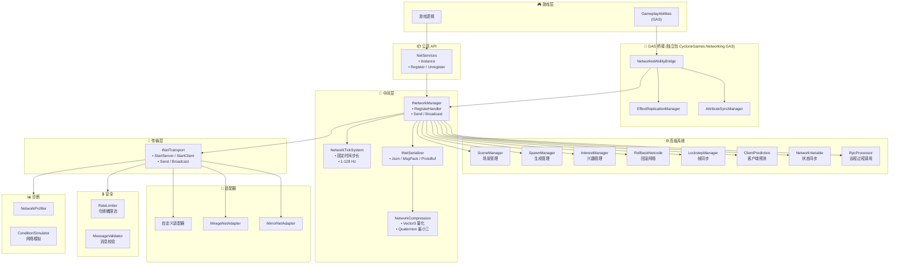
```mermaid
flowchart TB
    subgraph GameLayer["🎮 游戏层"]
        GameLogic["游戏逻辑"]
        GAS["GameplayAbilities</br>(GAS)"]
    end

    subgraph API["📦 公共 API"]
        NetServices["NetServices</br>• Instance</br>• Register / Unregister"]
    end

    subgraph HighLevel["⚙️ 高级系统"]
        RPC["RpcProcessor</br>远程过程调用"]
        StateSync["NetworkVariable</br>状态同步"]
        Prediction["ClientPrediction</br>客户端预测"]
        Lockstep["LockstepManager</br>帧同步"]
        Rollback["RollbackNetcode</br>回滚网络"]
        Interest["InterestManager</br>兴趣管理"]
        Spawn["SpawnManager</br>生成管理"]
        Scene["SceneManager</br>场景管理"]
    end

    subgraph Bridge["🔗 GAS 桥接 (独立包 CycloneGames.Networking.GAS)"]
        AbilityBridge["NetworkedAbilityBridge"]
        AttrSync["AttributeSyncManager"]
        EffectRepl["EffectReplicationManager"]
    end

    subgraph Mid["📡 中间层"]
        INetworkManager["INetworkManager</br>• RegisterHandler</br>• Send / Broadcast"]
        TickSystem["NetworkTickSystem</br>• 固定时间步长</br>• 1-128 Hz"]
        Serializer["INetSerializer</br>• Json / MsgPack / ProtoBuf"]
        Compression["NetworkCompression</br>• Vector3 量化</br>• Quaternion 最小三"]
    end

    subgraph Low["🔌 传输层"]
        INetTransport["INetTransport</br>• StartServer / StartClient</br>• Send / Broadcast"]
    end

    subgraph Adapters["🔄 适配器"]
        Mirror["MirrorNetAdapter"]
        Mirage["MirageNetAdapter"]
        Custom["自定义适配器"]
    end

    subgraph Security["🔒 安全"]
        RateLimiter["RateLimiter</br>令牌桶限流"]
        Validator["MessageValidator</br>消息校验"]
    end

    subgraph Diagnostics["📊 诊断"]
        Profiler["NetworkProfiler"]
        CondSim["ConditionSimulator</br>网络模拟"]
    end

    GameLogic --> NetServices
    GAS --> AbilityBridge
    AbilityBridge --> AttrSync
    AbilityBridge --> EffectRepl
    AbilityBridge --> INetworkManager
    NetServices --> INetworkManager
    INetworkManager --> RPC
    INetworkManager --> StateSync
    INetworkManager --> Prediction
    INetworkManager --> Lockstep
    INetworkManager --> Rollback
    INetworkManager --> Interest
    INetworkManager --> Spawn
    INetworkManager --> Scene
    INetworkManager --> Serializer
    INetworkManager --> TickSystem
    Serializer --> Compression
    INetworkManager --> INetTransport
    INetTransport --> Mirror
    INetTransport --> Mirage
    INetTransport --> Custom
    INetTransport --> Security
    INetTransport --> Diagnostics
```

### 设计原则

| 原则 | 说明 |
|------|------|
| **接口驱动** | 所有子系统通过接口定义（`INetTransport`、`INetSerializer`、`IInterestManager` 等） |
| **零 GC 稳态** | `ArrayPool`、`ConcurrentQueue` 对象池、环形缓冲区，运行时零分配 |
| **模块化** | 序列化器、传输层、兴趣管理均可插拔替换 |
| **确定性支持** | Q32.32 定点数学、帧同步、回滚，适用于竞技游戏 |
| **可插拔哈希** | `IStateHasher` struct 泛型约束，零成本哈希算法注入 |
| **线程安全** | `Interlocked` 原子操作、`ConcurrentQueue`、线程安全的缓冲区池 |
| **条件编译** | `#if MIRROR`、`#if MIRAGE`、`#if MESSAGEPACK` 等按需启用功能 |

---

## 快速开始

### 前置条件

- Unity 2022.3+
- 安装一个传输层实现（如 [Mirror](https://github.com/MirrorNetworking/Mirror)）

### 最小示例：发送和接收消息

```csharp
using CycloneGames.Networking;
using CycloneGames.Networking.Services;
using UnityEngine;

// ① 定义消息结构体（值类型，零 GC）
public struct ChatMsg
{
    public int SenderId;
    public int MessageType;
}

// ② 发送端
public class ChatSender : MonoBehaviour
{
    private const ushort MSG_CHAT = 1001;

    void Update()
    {
        if (Input.GetKeyDown(KeyCode.Return))
        {
            NetServices.Instance.SendToServer(MSG_CHAT, new ChatMsg
            {
                SenderId = 1,
                MessageType = 0
            });
        }
    }
}

// ③ 接收端
public class ChatReceiver : MonoBehaviour
{
    private const ushort MSG_CHAT = 1001;

    void Start()
    {
        NetServices.Instance.RegisterHandler<ChatMsg>(MSG_CHAT, OnChat);
    }

    void OnChat(INetConnection conn, ChatMsg msg)
    {
        Debug.Log($"收到来自玩家 {msg.SenderId} 的消息");
    }

    void OnDestroy()
    {
        NetServices.Instance.UnregisterHandler(MSG_CHAT);
    }
}
```

### 最小示例：使用 Mirror 适配器

```csharp
// 在场景中创建 GameObject，添加 MirrorNetAdapter 组件
// MirrorNetAdapter 会在 Awake 时自动注册到 NetServices

// 之后在任何地方通过 NetServices.Instance 访问网络管理器
var net = NetServices.Instance;
bool isAvailable = NetServices.IsAvailable; // 检查是否已注册
```

---

## 模块详解

### 1. 核心抽象层 (Core)

**路径**: `Runtime/Scripts/Core/`

核心层定义了网络框架的基础接口和类型，是所有上层模块的基石。

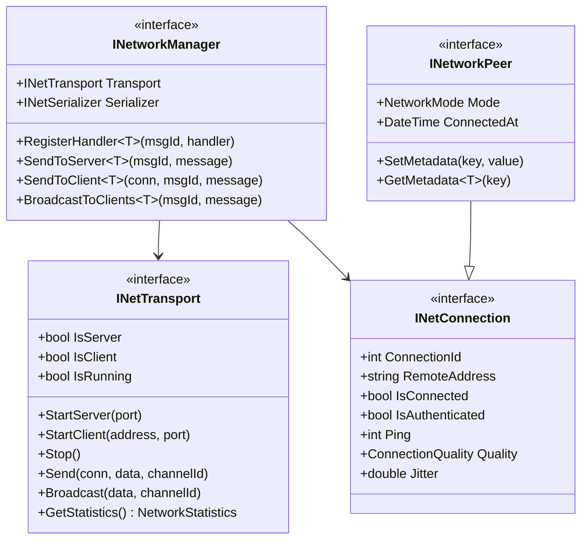
```mermaid
classDiagram
    class INetTransport {
        <<interface>>
        +bool IsServer
        +bool IsClient
        +bool IsRunning
        +StartServer(port)
        +StartClient(address, port)
        +Stop()
        +Send(conn, data, channelId)
        +Broadcast(data, channelId)
        +GetStatistics() NetworkStatistics
    }

    class INetworkManager {
        <<interface>>
        +INetTransport Transport
        +INetSerializer Serializer
        +RegisterHandler~T~(msgId, handler)
        +SendToServer~T~(msgId, message)
        +SendToClient~T~(conn, msgId, message)
        +BroadcastToClients~T~(msgId, message)
    }

    class INetConnection {
        <<interface>>
        +int ConnectionId
        +string RemoteAddress
        +bool IsConnected
        +bool IsAuthenticated
        +int Ping
        +ConnectionQuality Quality
        +double Jitter
    }

    class INetworkPeer {
        <<interface>>
        +NetworkMode Mode
        +DateTime ConnectedAt
        +SetMetadata(key, value)
        +GetMetadata~T~(key)
    }

    INetworkPeer --|> INetConnection
    INetworkManager --> INetTransport
    INetworkManager --> INetConnection
```

#### 关键枚举

| 枚举 | 值 | 说明 |
|------|-----|------|
| `NetworkMode` | Offline, Client, Server, Host, ListenServer, DedicatedServer, Relay | 网络运行模式 |
| `NetworkChannel` | Reliable, Unreliable, ReliableUnordered, UnreliableSequenced | 传输通道类型 |
| `ConnectionQuality` | Excellent, Good, Fair, Poor, Disconnected | 连接质量等级 |
| `TransportError` | None, DnsResolve, Refused, Timeout, Congestion, ... | 传输错误类型 |

---

### 2. 缓冲区系统 (Buffers)

**路径**: `Runtime/Scripts/Buffers/`

线程安全的零分配缓冲区池，用于网络消息的序列化与反序列化。

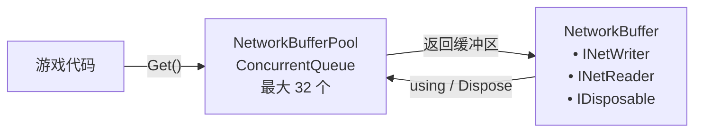
```mermaid
flowchart LR
    Code["游戏代码"] -->|"Get()"| Pool["NetworkBufferPool</br>ConcurrentQueue</br>最大 32 个"]
    Pool -->|"返回缓冲区"| Buffer["NetworkBuffer</br>• INetWriter</br>• INetReader</br>• IDisposable"]
    Buffer -->|"using / Dispose"| Pool
```

```csharp
// 零分配缓冲区使用
using (var buffer = NetworkBufferPool.Get())
{
    buffer.WriteInt(playerId);
    buffer.WriteFloat(health);
    buffer.WriteBlittable(position); // 仅限 unmanaged 类型

    var segment = buffer.ToArraySegment();
    transport.Send(conn, segment, channelId);
}
// Dispose 时自动归还到池
```

---

### 3. 服务注册 (Services)

**路径**: `Runtime/Scripts/Services/`

静态服务定位器，提供全局 `INetworkManager` 访问点。

```csharp
// 注册（通常在适配器 Awake 中自动完成）
NetServices.Register(myNetworkManager);

// 全局访问
var net = NetServices.Instance;

// 安全检查
if (NetServices.IsAvailable)
{
    net.SendToServer(msgId, data);
}

// 注销
NetServices.Unregister(myNetworkManager);
```

---

### 4. 序列化系统 (Serialization)

**路径**: `Runtime/Scripts/Serialization/` + `Runtime/Scripts/Serializers/`

可插拔的序列化系统，通过条件编译按需启用。

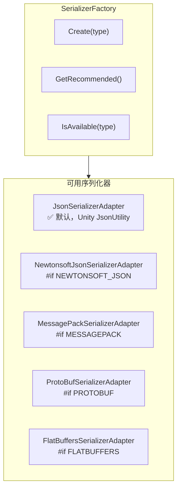
```mermaid
flowchart TB
    subgraph Factory["SerializerFactory"]
        Create["Create(type)"]
        GetRec["GetRecommended()"]
        IsAvail["IsAvailable(type)"]
    end

    subgraph Serializers["可用序列化器"]
        Json["JsonSerializerAdapter</br>✅ 默认，Unity JsonUtility"]
        Newtonsoft["NewtonsoftJsonSerializerAdapter</br>#if NEWTONSOFT_JSON"]
        MsgPack["MessagePackSerializerAdapter</br>#if MESSAGEPACK"]
        ProtoBuf["ProtoBufSerializerAdapter</br>#if PROTOBUF"]
        FlatBuf["FlatBuffersSerializerAdapter</br>#if FLATBUFFERS"]
    end

    Factory --> Serializers
```

| 序列化器 | 编译符号 | 格式 | 推荐场景 |
|----------|---------|------|----------|
| Json (Unity) | 无（默认） | 文本 | 开发调试 |
| Newtonsoft Json | `NEWTONSOFT_JSON` | 文本 | 复杂数据结构 |
| MessagePack | `MESSAGEPACK` | 二进制 | **生产环境推荐** |
| ProtoBuf | `PROTOBUF` | 二进制 | Schema 驱动开发 |
| FlatBuffers | `FLATBUFFERS` | 二进制 | 超高性能零拷贝 |

```csharp
// 获取推荐序列化器（优先级：MessagePack > Newtonsoft > Json）
var serializer = SerializerFactory.GetRecommended();

// 手动指定
if (SerializerFactory.IsAvailable(SerializerType.MessagePack))
{
    serializer = SerializerFactory.Create(SerializerType.MessagePack);
}
```

---

### 5. 网络模拟时钟 (Simulation)

**路径**: `Runtime/Scripts/Simulation/`

确定性固定时间步长的帧驱动系统，是预测、帧同步、回滚的基础。

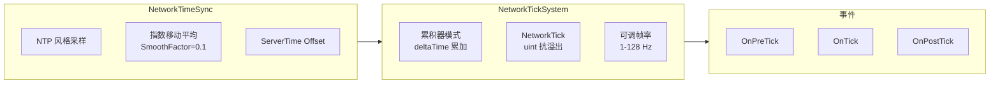
```mermaid
flowchart LR
    subgraph TickSystem["NetworkTickSystem"]
        Accumulator["累积器模式</br>deltaTime 累加"]
        Tick["NetworkTick</br>uint 抗溢出"]
        Rate["可调帧率</br>1-128 Hz"]
    end

    subgraph Events["事件"]
        PreTick["OnPreTick"]
        OnTick["OnTick"]
        PostTick["OnPostTick"]
    end

    subgraph TimeSync["NetworkTimeSync"]
        NTP["NTP 风格采样"]
        EMA["指数移动平均</br>SmoothFactor=0.1"]
        Offset["ServerTime Offset"]
    end

    TickSystem --> Events
    TimeSync --> TickSystem
```

```csharp
// 创建帧系统（30 Hz）
var tickSystem = new NetworkTickSystem(30);

// 注册帧回调
tickSystem.OnTick += tick =>
{
    // 每帧固定逻辑（物理、输入处理等）
    SimulateGameplay(tick);
};

// 在 Update 中驱动
void Update()
{
    tickSystem.Update(Time.deltaTime);
    // 自动限制每帧最多 5 次 Tick（防止死亡螺旋）
}

// 时间同步
var timeSync = new NetworkTimeSync();
timeSync.ProcessTimeSample(clientSendTime, serverTime, clientReceiveTime);
double serverNow = timeSync.LocalToServerTime(Time.timeAsDouble);
```

---

### 6. 客户端预测 (Prediction)

**路径**: `Runtime/Scripts/Prediction/`

实现了完整的**客户端预测 + 服务器授权 + 回滚纠正**流程。

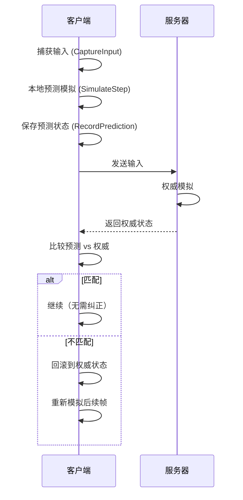
```mermaid
sequenceDiagram
    participant Client as 客户端
    participant Server as 服务器

    Client->>Client: 捕获输入 (CaptureInput)
    Client->>Client: 本地预测模拟 (SimulateStep)
    Client->>Client: 保存预测状态 (RecordPrediction)
    Client->>Server: 发送输入
    Server->>Server: 权威模拟
    Server-->>Client: 返回权威状态
    Client->>Client: 比较预测 vs 权威
    alt 匹配
        Client->>Client: 继续（无需纠正）
    else 不匹配
        Client->>Client: 回滚到权威状态
        Client->>Client: 重新模拟后续帧
    end
```

```csharp
// ① 实现 IPredictable 接口
public class PlayerMovement : IPredictable<MoveInput, PlayerState>
{
    public MoveInput CaptureInput()
        => new MoveInput { Horizontal = Input.GetAxis("Horizontal") };

    public PlayerState CaptureState()
        => new PlayerState { X = transform.position.x };

    public void ApplyState(in PlayerState state)
        => transform.position = new Vector3(state.X, 0, 0);

    public void SimulateStep(in MoveInput input, float deltaTime)
        => transform.position += Vector3.right * input.Horizontal * deltaTime;

    public bool StatesMatch(in PlayerState a, in PlayerState b)
        => Mathf.Abs(a.X - b.X) < 0.01f;
}

// ② 使用预测系统
var prediction = new ClientPredictionSystem<MoveInput, PlayerState>(player, capacity: 128);

// 每帧：记录预测
prediction.RecordPrediction(currentTick, deltaTime);

// 收到服务器状态时：自动比较并回滚
prediction.ProcessServerState(serverTick, serverState); // 不匹配则自动回滚
```

#### 快照插值

远程实体的平滑显示，避免抖动：

```csharp
var interpolation = new SnapshotInterpolation<TransformSnapshot>(
    TransformSnapshot.Lerp,
    TransformSnapshot.GetTimestamp
);

// 添加服务器快照
interpolation.AddSnapshot(new TransformSnapshot
{
    Timestamp = serverTime,
    Position = pos,
    Rotation = rot
});

// 每帧更新
var result = interpolation.Update(currentTime);
transform.position = result.Position;
transform.rotation = result.Rotation;
```

#### 滞后补偿

服务器端回退历史记录进行命中判定：

```csharp
var lagComp = new LagCompensationBuffer(capacity: 128);

// 每帧记录
lagComp.Record(tick, position, rotation, colliderBounds);

// 命中检测（回退到目标帧）
if (lagComp.HitTest(clientTick, shootRay, maxDist, out float hitDist))
{
    // 确认命中
}
```

---

### 7. 兴趣管理 (Interest Management)

**路径**: `Runtime/Scripts/Interest/`

控制哪些实体对哪些连接可见，**大幅降低带宽消耗**。

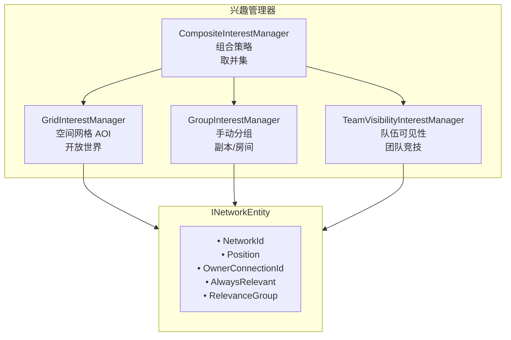
```mermaid
flowchart TB
    subgraph Managers["兴趣管理器"]
        Grid["GridInterestManager</br>空间网格 AOI</br>开放世界"]
        Group["GroupInterestManager</br>手动分组</br>副本/房间"]
        TeamVis["TeamVisibilityInterestManager</br>队伍可见性</br>团队竞技"]
        Composite["CompositeInterestManager</br>组合策略</br>取并集"]
    end

    subgraph Entity["INetworkEntity"]
        Props["• NetworkId</br>• Position</br>• OwnerConnectionId</br>• AlwaysRelevant</br>• RelevanceGroup"]
    end

    Composite --> Grid
    Composite --> Group
    Composite --> TeamVis
    Grid --> Entity
    Group --> Entity
    TeamVis --> Entity
```

```csharp
// 空间网格 AOI（适用于开放世界 MMO）
var grid = new GridInterestManager(cellSize: 50f, visibilityRange: 150f);
grid.SetObserverPosition(connectionId, playerPosition);

// 手动分组（适用于副本、房间）
var group = new GroupInterestManager();
group.AddEntityToGroup("dungeon_1", entity);
group.AddConnectionToGroup("dungeon_1", connectionId);

// 团队可见性管理（适用于 MOBA/RTS）
var visibility = new TeamVisibilityInterestManager(defaultDetectionRange: 30f);
visibility.SetConnectionTeam(connectionId, teamId: 1);
visibility.SetEntityTeam(entity, teamId: 1);
visibility.SetEntityDetectionRange(entity, 25f);
visibility.SetHidden(entity, true); // 隐身
visibility.AddRevealZone(position, radius); // 揭示区域

// 组合多种策略
var composite = new CompositeInterestManager();
composite.Add(grid);
composite.Add(visibility);
// 结果取并集：任一策略判定可见则可见
```

---

### 8. 状态同步变量 (StateSync)

**路径**: `Runtime/Scripts/StateSync/`

自动追踪变量脏标记并同步变更。

```csharp
// 值类型变量（零 GC，T : unmanaged, IEquatable<T>）
var health = new NetworkVariable<int>(100);
var position = new NetworkVariable<float>(0f);

// 修改时自动标脏
health.Value = 80; // 触发 OnChanged 事件

// 监听变更
health.OnChanged += (oldVal, newVal) =>
{
    Debug.Log($"血量变化: {oldVal} → {newVal}");
};

// 引用类型变量
var playerName = new NetworkVariableManaged<string>("Player1", serializer);

// 变量集合管理（最多 64 个变量）
var varSet = new NetworkVariableSet();
varSet.Register(health);
varSet.Register(position);

// 序列化脏数据（仅发送变更）
if (varSet.IsAnyDirty)
{
    varSet.WriteDirty(writer);
    varSet.ClearAllDirty();
}
```

---

### 9. 远程过程调用 (RPC)

**路径**: `Runtime/Scripts/Rpc/`

基于特性标注的 RPC 系统。

```csharp
// 定义 RPC 目标
public enum RpcTarget
{
    Server,          // 客户端 → 服务器
    Owner,           // 服务器 → 拥有者客户端
    AllClients,      // 服务器 → 所有客户端
    Observers,       // 服务器 → 观察者
    AllExceptOwner,  // 服务器 → 除拥有者外
    AllExceptSender  // 排除发送者
}

// 使用特性标注
[ServerRpc(requiresOwnership: true)]
void CmdAttack(int targetId) { /* 在服务器执行 */ }

[ClientRpc(target: RpcTarget.AllClients)]
void RpcDamaged(int damage) { /* 在所有客户端执行 */ }

// 使用 RpcProcessor
var rpc = new RpcProcessor(networkManager);
rpc.Register<DamageMsg>(1, OnDamageReceived);
rpc.Send(1, new DamageMsg { TargetId = 5, Amount = 20 }, RpcTarget.AllClients);
```

---

### 10. 帧同步与确定性模拟 (Lockstep)

**路径**: `Runtime/Scripts/Lockstep/`

完整的确定性帧同步与 GGPO 风格回滚实现。

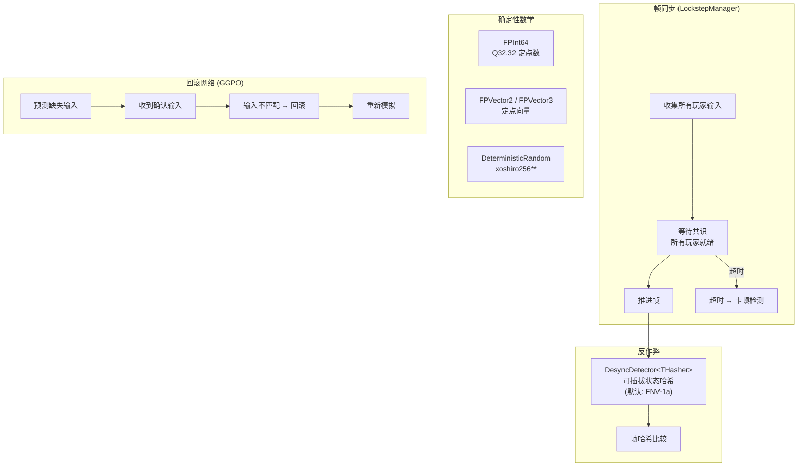
```mermaid
flowchart TB
    subgraph Lockstep["帧同步 (LockstepManager)"]
        Input["收集所有玩家输入"]
        Wait["等待共识</br>所有玩家就绪"]
        Advance["推进帧"]
        Stall["超时 → 卡顿检测"]
    end

    subgraph Deterministic["确定性数学"]
        FP["FPInt64</br>Q32.32 定点数"]
        Vec["FPVector2 / FPVector3</br>定点向量"]
        Rand["DeterministicRandom</br>xoshiro256**"]
    end

    subgraph Desync["反作弊"]
        Hash["DesyncDetector&lt;THasher&gt;</br>可插拔状态哈希</br>(默认: FNV-1a)"]
        Compare["帧哈希比较"]
    end

    subgraph Rollback["回滚网络 (GGPO)"]
        Predict["预测缺失输入"]
        Confirm["收到确认输入"]
        RB["输入不匹配 → 回滚"]
        Resim["重新模拟"]
    end

    Input --> Wait --> Advance
    Wait -->|"超时"| Stall
    Advance --> Hash --> Compare
    Predict --> Confirm --> RB --> Resim
```

#### 帧同步最小示例

```csharp
// 定义输入
public struct GameInput
{
    public byte MoveX;
    public byte MoveY;
    public bool Fire;
}

// 创建帧同步管理器
var lockstep = new LockstepManager<GameInput>(
    peerCount: 2,
    localPeerId: 0,
    inputDelay: 2
);

// 事件监听
lockstep.OnSimulateFrame += (frame, inputs) =>
{
    // 确定性模拟：所有客户端使用相同输入
    foreach (var (peerId, input) in inputs)
    {
        SimulatePlayer(peerId, input);
    }
};

lockstep.OnDesyncDetected += frame =>
    Debug.LogError($"帧 {frame} 检测到不同步！");

// 每帧
void FixedUpdate()
{
    lockstep.SubmitLocalInput(CaptureInput());
    lockstep.Tick(); // 所有输入就绪后推进帧
}

// 收到远程输入
void OnRemoteInput(int peerId, int frame, GameInput input)
{
    lockstep.ReceiveRemoteInput(peerId, frame, input);
}
```

#### 定点数学

确保跨平台计算一致性（浮点数在不同 CPU 架构下有微小差异）：

```csharp
// Q32.32 定点数
FPInt64 a = FPInt64.FromFloat(3.14f);
FPInt64 b = FPInt64.FromInt(2);
FPInt64 c = a * b;          // 精确乘法
float result = c.ToFloat(); // 转回浮点

// 定点向量
var v1 = new FPVector3(FPInt64.FromFloat(1f), FPInt64.Zero, FPInt64.Zero);
var v2 = new FPVector3(FPInt64.Zero, FPInt64.FromFloat(1f), FPInt64.Zero);
FPInt64 distance = FPVector3.Distance(v1, v2);

// 确定性随机数（所有客户端种子相同 → 结果相同）
var rng = new DeterministicRandom(seed: 12345);
int roll = rng.NextInt(1, 7); // 1-6 骰子
```

#### GGPO 风格回滚

```csharp
// 实现回滚接口
public class MySimulation : IRollbackSimulation<GameInput, GameState>
{
    public GameInput PredictInput(int frame) => default; // 预测：重复上一帧输入
    public GameState SaveState() => currentState;
    public void LoadState(in GameState state) => currentState = state;
    public void Simulate(in GameInput input) => /* 模拟一帧 */;
    public void OnRollback(int fromFrame, int toFrame) => Debug.Log("回滚！");
}

var rollback = new RollbackNetcode<GameInput, GameState>(
    simulation, maxRollbackFrames: 8
);

// 本地推进
rollback.AdvanceFrame(localInput);

// 收到服务器确认的输入
rollback.ReceiveConfirmedInput(frame, confirmedInput);
// 如果与预测不同 → 自动回滚 + 重新模拟
```

---

### 11. 安全模块 (Security)

**路径**: `Runtime/Scripts/Security/`

```csharp
// 令牌桶限流器
var limiter = new RateLimiter(
    maxMessagesPerSecond: 60,
    maxBytesPerSecond: 32768,
    burstLimit: 10
);

if (!limiter.TryConsume(connectionId, messageSize))
{
    // 超过限流 → 丢弃或断开
    return;
}

// 消息校验器
var validator = new MessageValidator(
    maxPayloadSize: 1024,
    maxMessageId: 9999
);

var result = validator.Validate(msgId, payloadSize);
if (result != ValidationResult.Valid)
{
    Debug.LogWarning($"非法消息: {result}");
}
```

---

### 12. 会话与重连 (Session)

**路径**: `Runtime/Scripts/Session/`

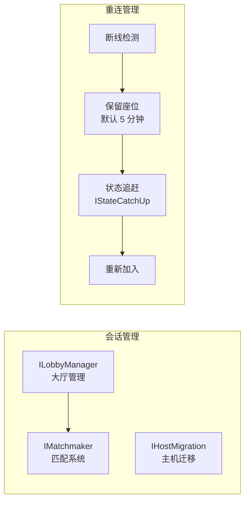
```mermaid
flowchart LR
    subgraph Session["会话管理"]
        Lobby["ILobbyManager</br>大厅管理"]
        Match["IMatchmaker</br>匹配系统"]
        Host["IHostMigration</br>主机迁移"]
    end

    subgraph Reconnect["重连管理"]
        Detect["断线检测"]
        Reserve["保留座位</br>默认 5 分钟"]
        CatchUp["状态追赶</br>IStateCatchUp"]
        Rejoin["重新加入"]
    end

    Lobby --> Match
    Detect --> Reserve --> CatchUp --> Rejoin
```

```csharp
// 重连管理器
var reconnect = new ReconnectionManager(
    reconnectWindowSeconds: 300, // 5 分钟内可重连
    catchUp: myStateCatchUpImpl
);

reconnect.OnClientReconnected += (conn, state) =>
    Debug.Log($"玩家 {conn.PlayerId} 重连成功");

reconnect.OnReconnectWindowExpired += playerId =>
    Debug.Log($"玩家 {playerId} 重连窗口过期");
```

---

### 13. 回放系统 (Replay)

**路径**: `Runtime/Scripts/Replay/`

```csharp
// 录像
var recorder = new ReplayRecorder(keyframeInterval: 300); // 每 300 帧一个关键帧
recorder.StartRecording();
recorder.RecordFrame(tick, inputData);
recorder.RecordKeyframe(tick, fullState); // 定期记录完整状态
recorder.StopRecording();

// 回放
var player = new ReplayPlayer(recorder.GetAllFrames());
player.Play();
player.SetSpeed(2.0f); // 2 倍速
player.Seek(targetTick); // 跳转到指定帧
player.Pause();

// 观战（带延迟）
var spectator = new SpectatorManager(delayTicks: 90); // 3 秒延迟 @30Hz
```

---

### 14. 网络生成管理 (Spawning)

**路径**: `Runtime/Scripts/Spawning/`

```csharp
var spawnManager = new NetworkSpawnManager(networkManager);

// 生成网络对象
spawnManager.Spawn(prefabId: 1, position, rotation, ownerConnectionId);

// 监听事件
spawnManager.OnSpawned += obj =>
    Debug.Log($"生成: NetworkId={obj.NetworkId}, PrefabId={obj.PrefabId}");

spawnManager.OnDespawned += networkId =>
    Debug.Log($"销毁: {networkId}");

// 转移所有权
spawnManager.TransferOwnership(networkId, newOwnerConnectionId);
```

---

### 15. 场景管理 (Scene)

**路径**: `Runtime/Scripts/Scene/`

```csharp
var sceneManager = new NetworkSceneManager(networkManager);

// 所有客户端加载场景
sceneManager.ServerLoadScene("BattleArena");

// 附加场景（副本）
sceneManager.ServerLoadScene("Dungeon_01", additive: true);

// 仅对指定连接加载（实例化副本）
sceneManager.ServerLoadSceneForConnections(
    "PrivateDungeon",
    new[] { conn1, conn2 }
);

// 事件
sceneManager.OnSceneLoaded += sceneName =>
    Debug.Log($"场景已加载: {sceneName}");
```

---

### 16. 数据压缩 (Compression)

**路径**: `Runtime/Scripts/Compression/`

```csharp
// Vector3 量化压缩（ZigZag + 可变长整数编码）
var qv = QuantizedVector3.FromVector3(transform.position, precision: 100);
// precision=100 → 精度 0.01 单位
qv.WriteTo(writer);

// 读取
var qv2 = QuantizedVector3.ReadFrom(reader);
Vector3 pos = qv2.ToVector3(precision: 100);

// Quaternion 最小三压缩（4 字节，每分量 10 位）
var qq = QuantizedQuaternion.FromQuaternion(transform.rotation);
// 仅传输最大分量索引（2位）+ 三个较小分量（各 10 位）= 32 位 = 4 字节
```

---

### 17. 诊断工具 (Diagnostics)

**路径**: `Runtime/Scripts/Diagnostics/`

```csharp
// 网络性能分析
var profiler = new NetworkProfiler();
profiler.RecordSend(msgId, byteCount);
profiler.RecordReceive(msgId, byteCount);
profiler.Update(deltaTime);

var snapshot = profiler.TakeSnapshot();
Debug.Log($"上行: {snapshot.BytesSentPerSecond} B/s");
Debug.Log($"下行: {snapshot.BytesReceivedPerSecond} B/s");
Debug.Log($"发包: {snapshot.PacketsSentPerSecond}/s");

// 按消息类型统计
var stats = profiler.GetMessageStats(msgId);
Debug.Log($"消息 {msgId}: 发送 {stats.SendCount} 次, {stats.SendBytes} 字节");

// 网络条件模拟器（测试用）
var simulator = new NetworkConditionSimulator(realTransport);
simulator.ApplyPreset(NetworkConditionSimulator.Preset.Mobile4G);
// 预设: LAN, Broadband, WiFi, Mobile4G, Mobile3G, Satellite, Terrible

// 自定义
simulator.LatencyMs = 150;
simulator.JitterMs = 30;
simulator.PacketLossPercent = 5f;
simulator.Enabled = true;
```

---

### 18. Gameplay Abilities 集成 (GAS)

**路径**: 📦 **独立包** — `CycloneGames.Networking.GAS`（与核心包平级目录）  
**Asmdef**: `CycloneGames.Networking.GAS`  
**引用**: `CycloneGames.Networking.Runtime`  
**命名空间**: `CycloneGames.Networking.GAS`

与 `CycloneGames.GameplayAbilities` 模块的深度集成，支持技能激活、效果复制、属性同步。

> ⚠️ **Breaking Change**: GAS 相关类已从核心包移至独立包。请在 asmdef 中添加对 `CycloneGames.Networking.GAS` 的引用。

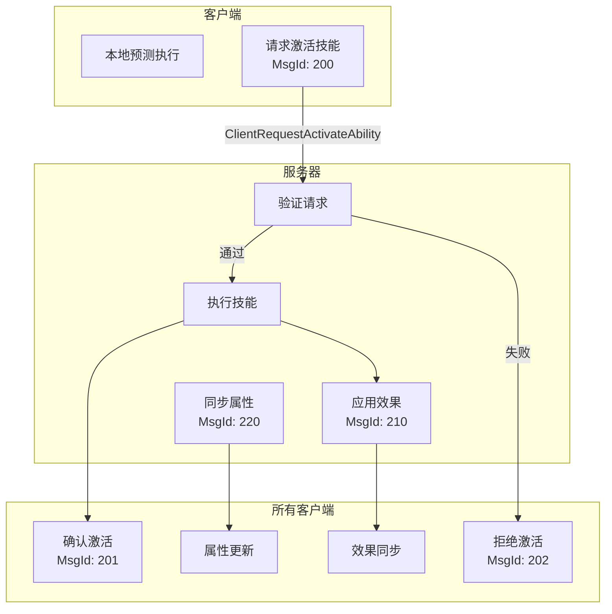
```mermaid
flowchart TB
    subgraph Client["客户端"]
        PredictLocal["本地预测执行"]
        RequestAbility["请求激活技能</br>MsgId: 200"]
    end

    subgraph Server["服务器"]
        Validate["验证请求"]
        Execute["执行技能"]
        ApplyEffect["应用效果</br>MsgId: 210"]
        SyncAttr["同步属性</br>MsgId: 220"]
    end

    subgraph Clients["所有客户端"]
        Confirm["确认激活</br>MsgId: 201"]
        Reject["拒绝激活</br>MsgId: 202"]
        EffectSync["效果同步"]
        AttrUpdate["属性更新"]
    end

    RequestAbility -->|"ClientRequestActivateAbility"| Validate
    Validate -->|"通过"| Execute
    Validate -->|"失败"| Reject
    Execute --> Confirm
    Execute --> ApplyEffect
    ApplyEffect --> EffectSync
    SyncAttr --> AttrUpdate
```

```csharp
using CycloneGames.Networking.GAS; // 📦 需引用 GAS 独立包

// 创建桥接
var bridge = new NetworkedAbilityBridge(networkManager);

// 注册 ASC（AbilitySystemComponent）
bridge.RegisterASC(networkId, myASC);

// 客户端请求激活技能
bridge.ClientRequestActivateAbility(
    abilityTag: 1001,
    targetNetworkId: targetId,
    predictionKey: nextPredictionKey++
);

// 属性同步管理器
var attrSync = new AttributeSyncManager(bridge);
attrSync.RegisterPublicAttribute(networkId, "Health");
attrSync.RegisterPublicAttribute(networkId, "MaxHealth");
attrSync.MarkDirty(networkId, "Health");
attrSync.FlushDirty(); // 发送脏属性

// 效果复制管理器
var effectRepl = new EffectReplicationManager(bridge);
int instanceId = effectRepl.OnEffectApplied(targetNetworkId, effectTag, level, stacks);
effectRepl.OnStackChanged(targetNetworkId, instanceId, newStacks);
effectRepl.OnEffectRemoved(targetNetworkId, instanceId);
```

#### 消息 ID 分配

| 范围 | 用途 |
|------|------|
| 200 | 技能激活请求 |
| 201 | 技能激活确认 |
| 202 | 技能激活拒绝 |
| 203 | 技能结束 |
| 210-212 | 效果应用/移除/堆叠变更 |
| 220-221 | 属性更新/批量更新 |
| 240-241 | 完整状态快照 |

---

### 19. 身份验证 (Authentication)

**路径**: `Runtime/Scripts/Authentication/`

```csharp
public class MyAuthenticator : INetAuthenticator
{
    public void OnClientAuthenticate(INetConnection conn, ReadOnlySpan<byte> authData)
    {
        // 验证 token
        if (ValidateToken(authData))
            AcceptClient(conn);
        else
            RejectClient(conn, "Invalid token");
    }

    public void OnServerAuthenticate(INetConnection conn, ReadOnlySpan<byte> authData)
    {
        // 服务器端验证逻辑
    }
}
```

---

### 20. 平台配置 (Platform)

**路径**: `Runtime/Scripts/Platform/`

根据目标平台自动调整网络参数。

```csharp
// 自动获取当前平台配置
var config = NetworkPlatformConfig.GetForCurrentPlatform();
Debug.Log($"MTU: {config.MaxMTU}");
Debug.Log($"最大连接数: {config.MaxConnections}");
Debug.Log($"需要加密: {config.RequireEncryption}");

// 手动选择平台
var mobileConfig = NetworkPlatformConfig.Android();
var consoleConfig = NetworkPlatformConfig.PlayStation();
var webConfig = NetworkPlatformConfig.WebGL(); // WebSocket only
```

| 平台 | MTU | 最大连接 | IPv6 | WebSocket | 加密 |
|------|-----|---------|------|-----------|------|
| Windows | 1200 | 200 | ✅ | ❌ | ❌ |
| WebGL | 1200 | 1 | ❌ | ✅ | ❌ |
| iOS | 1200 | 8 | ✅ | ❌ | ❌ |
| Android | 1200 | 8 | ✅ | ❌ | ❌ |
| PS4/PS5 | 1200 | 100 | ✅ | ❌ | ✅ |
| Xbox | 1200 | 100 | ✅ | ❌ | ✅ |
| Switch | 1200 | 16 | ✅ | ❌ | ❌ |

---

### 21. 传输适配器 (Adapters)

**路径**: `Runtime/Scripts/Adapters/`

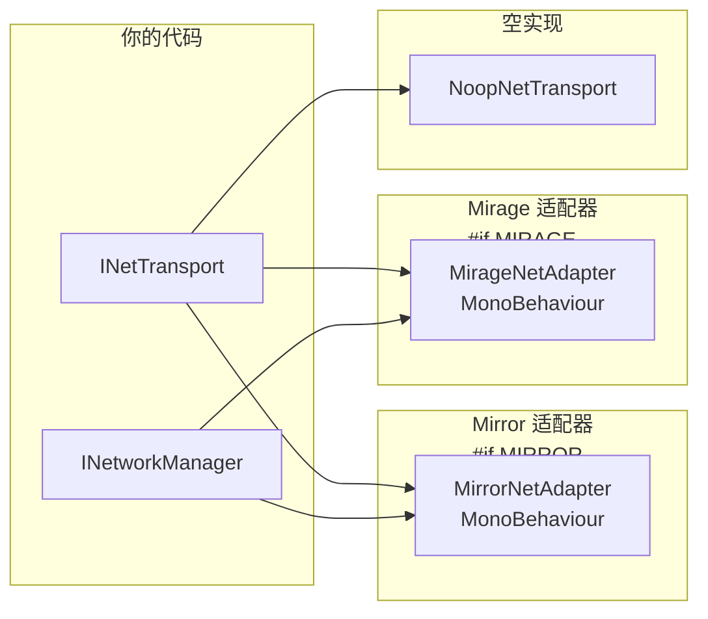
```mermaid
flowchart LR
    subgraph YourCode["你的代码"]
        INetTransport2["INetTransport"]
        INetworkManager2["INetworkManager"]
    end

    subgraph MirrorAdapter["Mirror 适配器</br>#if MIRROR"]
        MirrorNet["MirrorNetAdapter</br>MonoBehaviour"]
    end

    subgraph MirageAdapter["Mirage 适配器</br>#if MIRAGE"]
        MirageNet["MirageNetAdapter</br>MonoBehaviour"]
    end

    subgraph NoopAdapter["空实现"]
        Noop["NoopNetTransport"]
    end

    INetTransport2 --> MirrorNet
    INetTransport2 --> MirageNet
    INetTransport2 --> Noop
    INetworkManager2 --> MirrorNet
    INetworkManager2 --> MirageNet
```

---

## 游戏类型适配指南

根据你的游戏类型选择合适的模块组合：

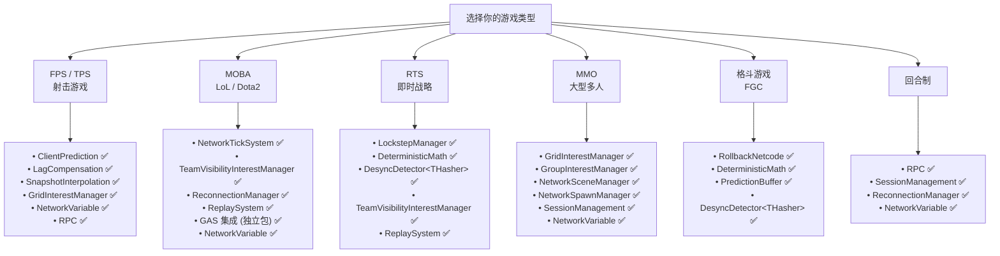
```mermaid
flowchart TB
    Start["选择你的游戏类型"] --> FPS
    Start --> MOBA
    Start --> RTS
    Start --> MMO
    Start --> Fighting
    Start --> TurnBased

    FPS["FPS / TPS</br>射击游戏"]
    MOBA["MOBA</br>LoL / Dota2"]
    RTS["RTS</br>即时战略"]
    MMO["MMO</br>大型多人"]
    Fighting["格斗游戏</br>FGC"]
    TurnBased["回合制"]

    FPS --> FPS_Modules["• ClientPrediction ✅</br>• LagCompensation ✅</br>• SnapshotInterpolation ✅</br>• GridInterestManager ✅</br>• NetworkVariable ✅</br>• RPC ✅"]

    MOBA --> MOBA_Modules["• NetworkTickSystem ✅</br>• TeamVisibilityInterestManager ✅</br>• ReconnectionManager ✅</br>• ReplaySystem ✅</br>• GAS 集成 (独立包) ✅</br>• NetworkVariable ✅"]

    RTS --> RTS_Modules["• LockstepManager ✅</br>• DeterministicMath ✅</br>• DesyncDetector&lt;THasher&gt; ✅</br>• TeamVisibilityInterestManager ✅</br>• ReplaySystem ✅"]

    MMO --> MMO_Modules["• GridInterestManager ✅</br>• GroupInterestManager ✅</br>• NetworkSceneManager ✅</br>• NetworkSpawnManager ✅</br>• SessionManagement ✅</br>• NetworkVariable ✅"]

    Fighting --> Fighting_Modules["• RollbackNetcode ✅</br>• DeterministicMath ✅</br>• PredictionBuffer ✅</br>• DesyncDetector&lt;THasher&gt; ✅"]

    TurnBased --> Turn_Modules["• RPC ✅</br>• SessionManagement ✅</br>• ReconnectionManager ✅</br>• NetworkVariable ✅"]
```

| 游戏类型 | 同步模式 | 核心模块 | 延迟策略 |
|----------|---------|---------|---------|
| FPS/TPS | 状态同步 | ClientPrediction + LagCompensation | 客户端预测 + 服务器回退 |
| MOBA (LoL) | 状态同步 | TeamVisibility + GAS + Reconnect + Replay | 服务器权威 + 兴趣管理 |
| RTS (Red Alert) | 帧同步 | Lockstep + FPInt64 + DesyncDetector\<THasher\> + TeamVisibility | 确定性模拟 |
| MMO | 状态同步 | Grid/Group Interest + Scene + Spawn | AOI 裁剪 |
| 格斗 (Street Fighter) | 回滚 | RollbackNetcode + FPInt64 | GGPO 回滚重放 |
| 回合制 | 请求响应 | RPC + Session | 无需实时同步 |

---

## 进阶教程

### 教程 1：从零搭建 FPS 网络同步

**目标**: 实现玩家移动的客户端预测和服务器授权。

```csharp
// === 步骤 1: 定义数据结构 ===
public struct FpsInput : IEquatable<FpsInput>
{
    public float MoveX, MoveZ;
    public float LookYaw;
    public bool Fire;

    public bool Equals(FpsInput other) =>
        MoveX == other.MoveX && MoveZ == other.MoveZ &&
        LookYaw == other.LookYaw && Fire == other.Fire;
}

public struct FpsState : IEquatable<FpsState>
{
    public float X, Y, Z;
    public float Yaw;

    public bool Equals(FpsState other) =>
        Math.Abs(X - other.X) < 0.01f &&
        Math.Abs(Z - other.Z) < 0.01f;
}

// === 步骤 2: 实现 IPredictable ===
public class FpsPlayer : MonoBehaviour, IPredictable<FpsInput, FpsState>
{
    public float Speed = 5f;

    public FpsInput CaptureInput() => new FpsInput
    {
        MoveX = Input.GetAxis("Horizontal"),
        MoveZ = Input.GetAxis("Vertical"),
        LookYaw = Input.GetAxis("Mouse X"),
        Fire = Input.GetMouseButton(0)
    };

    public FpsState CaptureState() => new FpsState
    {
        X = transform.position.x,
        Y = transform.position.y,
        Z = transform.position.z,
        Yaw = transform.eulerAngles.y
    };

    public void ApplyState(in FpsState state) =>
        transform.position = new Vector3(state.X, state.Y, state.Z);

    public void SimulateStep(in FpsInput input, float deltaTime)
    {
        var move = new Vector3(input.MoveX, 0, input.MoveZ) * Speed * deltaTime;
        transform.position += move;
    }

    public bool StatesMatch(in FpsState a, in FpsState b) => a.Equals(b);
}

// === 步骤 3: 组装系统 ===
public class FpsNetworkController : MonoBehaviour
{
    private ClientPredictionSystem<FpsInput, FpsState> _prediction;
    private NetworkTickSystem _tickSystem;
    private FpsPlayer _player;

    void Start()
    {
        _player = GetComponent<FpsPlayer>();
        _tickSystem = new NetworkTickSystem(60); // 60Hz
        _prediction = new ClientPredictionSystem<FpsInput, FpsState>(_player);

        _tickSystem.OnTick += OnTick;

        NetServices.Instance.RegisterHandler<FpsState>(2001, OnServerState);
    }

    void OnTick(NetworkTick tick)
    {
        _prediction.RecordPrediction(tick, _tickSystem.TickInterval);

        // 发送输入到服务器
        NetServices.Instance.SendToServer(2000, _player.CaptureInput());
    }

    void OnServerState(INetConnection conn, FpsState state)
    {
        // 自动回滚 + 重新模拟
        _prediction.ProcessServerState(_tickSystem.CurrentTick, state);
    }

    void Update() => _tickSystem.Update(Time.deltaTime);
}
```

### 教程 2：实现 RTS 帧同步

**目标**: 多玩家确定性帧同步，适用于 RTS 类游戏。

```csharp
// === 步骤 1: 定义确定性输入 ===
public struct RtsInput
{
    public int SelectedUnitId;
    public int TargetX; // 使用整数坐标
    public int TargetY;
    public byte CommandType; // Move=0, Attack=1, Build=2
}

// === 步骤 2: 确定性模拟 ===
public class RtsSimulation
{
    // 使用定点数避免浮点不确定性
    private Dictionary<int, FPVector3> _unitPositions = new();

    public void Simulate(int frame, Dictionary<int, RtsInput> inputs)
    {
        foreach (var (peerId, input) in inputs)
        {
            if (input.CommandType == 0) // Move
            {
                var target = new FPVector3(
                    FPInt64.FromInt(input.TargetX),
                    FPInt64.Zero,
                    FPInt64.FromInt(input.TargetY)
                );

                var current = _unitPositions[input.SelectedUnitId];
                var dir = FPVector3.Normalize(target - current);
                var speed = FPInt64.FromFloat(5f);
                var tickDelta = FPInt64.FromFloat(1f / 30f);

                _unitPositions[input.SelectedUnitId] =
                    current + dir * speed * tickDelta;
            }
        }
    }
}

// === 步骤 3: 组装帧同步 ===
public class RtsNetworkController : MonoBehaviour
{
    private LockstepManager<RtsInput> _lockstep;
    private DesyncDetector _desyncDetector;
    private RtsSimulation _simulation;

    void Start()
    {
        _simulation = new RtsSimulation();
        _desyncDetector = new DesyncDetector();

        _lockstep = new LockstepManager<RtsInput>(
            peerCount: 4, localPeerId: myPeerId, inputDelay: 3
        );

        _lockstep.OnSimulateFrame += (frame, inputs) =>
        {
            _simulation.Simulate(frame, inputs);

            // 计算状态哈希（反作弊）
            _desyncDetector.BeginFrame(frame);
            foreach (var unit in allUnits)
            {
                _desyncDetector.HashFPVector3(unit.Position);
            }
        };

        _lockstep.OnDesyncDetected += frame =>
            Debug.LogError($"不同步！帧 {frame}");
    }

    void FixedUpdate()
    {
        _lockstep.SubmitLocalInput(GetPlayerInput());
        _lockstep.Tick();
    }
}
```

### 教程 3：实现团队可见性管理

**目标**: 团队可见性控制，隐藏/揭示机制。

```csharp
using CycloneGames.Networking.GAS; // 📦 GAS 独立包

public class TeamVisionController : MonoBehaviour
{
    private TeamVisibilityInterestManager _visibility;
    private NetworkedAbilityBridge _abilityBridge;

    void Start()
    {
        _visibility = new TeamVisibilityInterestManager(defaultDetectionRange: 30f);

        // 设置团队
        _visibility.SetConnectionTeam(bluePlayer.ConnectionId, teamId: 1);
        _visibility.SetConnectionTeam(redPlayer.ConnectionId, teamId: 2);

        // 设置实体检测范围
        _visibility.SetEntityTeam(blueHero, teamId: 1);
        _visibility.SetEntityDetectionRange(blueHero, 25f);

        // 隐藏实体
        _visibility.SetHidden(stealthUnit, true);

        // 放置揭示区域（深度揭示）
        _visibility.AddRevealZone(wardPosition, radius: 15f, teamId: 1, isDeepReveal: true);

        // GAS 集成：技能造成属性变化自动同步
        _abilityBridge = new NetworkedAbilityBridge(NetServices.Instance);
    }

    void OnHiddenAbilityUsed(INetworkEntity entity)
    {
        _visibility.SetHidden(entity, true);
        // 该实体在敌方客户端上将不可见
        // 除非敌方有深度揭示区域在范围内
    }

    void OnSensorPlaced(Vector3 pos)
    {
        _visibility.AddRevealZone(pos, 15f, teamId: 1, isDeepReveal: true);
        // 揭示该区域及其中的隐藏单位
    }
}
```

---

## API 速查表

### 核心

| 类/接口 | 说明 | 关键方法 |
|---------|------|---------|
| `NetServices` | 全局服务定位器 | `Instance`, `Register`, `IsAvailable` |
| `INetTransport` | 传输层接口 | `StartServer`, `Send`, `Broadcast`, `GetStatistics` |
| `INetworkManager` | 高级网络接口 | `RegisterHandler<T>`, `SendToServer<T>`, `BroadcastToClients<T>` |
| `INetConnection` | 连接抽象 | `ConnectionId`, `Ping`, `Quality`, `IsAuthenticated` |

### 序列化

| 类 | 说明 |
|----|------|
| `SerializerFactory` | 创建序列化器实例 |
| `JsonSerializerAdapter` | Unity JsonUtility（默认） |
| `MessagePackSerializerAdapter` | MessagePack（推荐生产环境） |
| `ProtoBufSerializerAdapter` | Protocol Buffers |

### 同步

| 类 | 说明 | 关键方法 |
|----|------|---------|
| `NetworkTickSystem` | 固定帧驱动 | `Update(dt)`, `OnTick`, `TickRate` |
| `ClientPredictionSystem<I,S>` | 客户端预测 | `RecordPrediction`, `ProcessServerState` |
| `NetworkVariable<T>` | 自动同步变量 | `Value`, `OnChanged`, `IsDirty` |
| `RpcProcessor` | RPC 处理器 | `Register<T>`, `Send<T>` |

### 帧同步

| 类 | 说明 | 关键方法 |
|----|------|---------|
| `LockstepManager<T>` | 帧同步管理器 | `SubmitLocalInput`, `Tick`, `OnSimulateFrame` |
| `RollbackNetcode<I,S>` | GGPO 回滚 | `AdvanceFrame`, `ReceiveConfirmedInput` |
| `FPInt64` | Q32.32 定点数 | `FromFloat`, `ToFloat`, `Sqrt` |
| `DesyncDetector<THasher>` | 不同步检测（可插拔哈希） | `BeginFrame`, `HashFPVector3`, `EndFrame` |
| `DesyncDetector` | 默认别名（FNV-1a） | `new DesyncDetector()` |
| `IStateHasher` | 哈希算法接口 | `Reset`, `HashInt`, `HashLong`, `GetDigest` |
| `Fnv1aHasher` | FNV-1a 64-bit（默认） | 内置，零分配 |

### 兴趣管理

| 类 | 适用场景 |
|----|---------|
| `GridInterestManager` | 开放世界 MMO |
| `GroupInterestManager` | 副本、房间 |
| `TeamVisibilityInterestManager` | MOBA、RTS |
| `CompositeInterestManager` | 组合多种策略 |
| `BurstGridInterestManager` | 开放世界 MMO（5k+ 实体，DOD） |
| `BurstTeamVisibilityInterestManager` | MOBA、RTS（5k+ 实体，DOD） |

### GAS 集成（📦 独立包：`CycloneGames.Networking.GAS`）

| 类 | 说明 |
|----|------|
| `NetworkedAbilityBridge` | 技能激活/确认/拒绝的网络传输 |
| `AttributeSyncManager` | 属性脏追踪与同步 |
| `EffectReplicationManager` | 效果实例复制 |

---

## 目录结构

```
Runtime/Scripts/
├── Core/                 # 核心接口与类型
├── Buffers/              # 缓冲区与对象池
├── Services/             # 服务注册
├── Serialization/        # 序列化接口与工厂
├── Serializers/          # 各序列化器适配实现
├── Simulation/           # Tick 系统与时间同步
├── Prediction/           # 客户端预测、插值、滞后补偿
├── Interest/             # 兴趣管理（Grid/Group/TeamVisibility/Composite）
├── StateSync/            # NetworkVariable 状态同步
├── Rpc/                  # RPC 属性与处理器
├── Lockstep/             # 帧同步、定点数学、回滚、IStateHasher
├── Security/             # 限流器、消息校验
├── Session/              # 大厅、匹配、重连
├── Replay/               # 录像与回放
├── Spawning/             # 网络对象生成
├── Scene/                # 网络场景管理
├── Compression/          # Vector3/Quaternion 压缩
├── Diagnostics/          # 性能分析、网络模拟
├── Authentication/       # 身份验证
├── Platform/             # 平台特定配置
├── Adapters/             # Mirror/Mirage 适配器
└── Stubs/                # 空实现（测试用）

DOD/Runtime/                      # 面向数据设计变体（Burst/Jobs 加速）
├── BurstGridInterestManager.cs   # 排序式空间哈希，NativeList + IntroSort
└── BurstTeamVisibilityInterestManager.cs  # 扁平 NativeList 检测源

📦 CycloneGames.Networking.GAS/    # GAS 集成（独立包）
└── Runtime/Scripts/
    ├── IAbilityNetAdapter.cs
    ├── NoopAbilityNetAdapter.cs
    ├── NetworkedAbilityBridge.cs
    ├── AttributeSyncManager.cs
    └── EffectReplicationManager.cs
```

**总计**: 68 个 C# 源文件，20+ 子系统

---

## 许可证

本项目遵循项目根目录 LICENSE 文件中的许可证。
